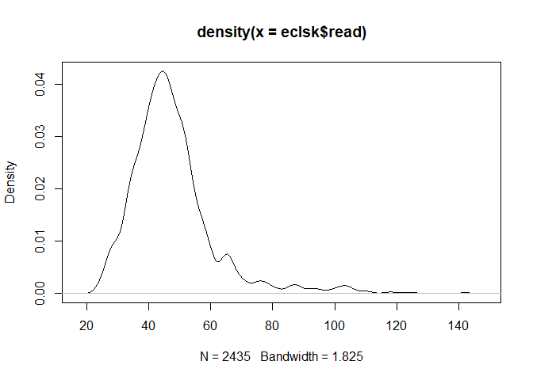

Codebook
================

## Open the file

``` r
library(readr)
eclsk <- read_csv("~/GitHub/ppol8102-Paul/codebook/eclsk.csv")
```

    ## New names:
    ## Rows: 2435 Columns: 20
    ## ── Column specification
    ## ──────────────────────────────────────────────────────── Delimiter: "," chr
    ## (2): parent.ed.cat, income.cat dbl (18): ...1, schid, parent.ed, female,
    ## income, math, read, gen, minority,...
    ## ℹ Use `spec()` to retrieve the full column specification for this data. ℹ
    ## Specify the column types or set `show_col_types = FALSE` to quiet this message.
    ## • `` -> `...1`

``` r
View(eclsk)
```

``` r
 summary(eclsk)
```

    ##       ...1          schid          parent.ed         female      
    ##  Min.   :   4   Min.   :  15.0   Min.   :1.000   Min.   :0.0000  
    ##  1st Qu.:1172   1st Qu.: 345.0   1st Qu.:3.000   1st Qu.:0.0000  
    ##  Median :2303   Median : 669.0   Median :5.000   Median :0.0000  
    ##  Mean   :2300   Mean   : 844.6   Mean   :4.925   Mean   :0.4895  
    ##  3rd Qu.:3378   3rd Qu.:1049.0   3rd Qu.:6.000   3rd Qu.:1.0000  
    ##  Max.   :4639   Max.   :3105.0   Max.   :9.000   Max.   :1.0000  
    ##      income            math             read             gen        
    ##  Min.   :     0   Min.   : 13.05   Min.   : 22.73   Min.   : 7.725  
    ##  1st Qu.: 24000   1st Qu.: 29.23   1st Qu.: 39.23   1st Qu.:22.922  
    ##  Median : 44000   Median : 36.74   Median : 45.33   Median :28.813  
    ##  Mean   : 53201   Mean   : 37.90   Mean   : 47.68   Mean   :28.357  
    ##  3rd Qu.: 70000   3rd Qu.: 44.87   3rd Qu.: 52.16   3rd Qu.:34.078  
    ##  Max.   :800000   Max.   :112.51   Max.   :143.02   Max.   :47.444  
    ##     minority           age            public           attend      
    ##  Min.   :0.0000   Min.   :56.90   Min.   :0.0000   Min.   : 89.00  
    ##  1st Qu.:0.0000   1st Qu.:65.43   1st Qu.:1.0000   1st Qu.: 94.00  
    ##  Median :0.0000   Median :68.60   Median :1.0000   Median : 96.00  
    ##  Mean   :0.3639   Mean   :68.86   Mean   :0.7963   Mean   : 95.24  
    ##  3rd Qu.:1.0000   3rd Qu.:72.10   3rd Qu.:1.0000   3rd Qu.: 97.00  
    ##  Max.   :1.0000   Max.   :79.00   Max.   :1.0000   Max.   :100.00  
    ##      gifted         free.lunch       suburban          urban      
    ##  Min.   : 0.000   Min.   : 0.00   Min.   :0.0000   Min.   :0.000  
    ##  1st Qu.: 0.000   1st Qu.: 4.05   1st Qu.:0.0000   1st Qu.:0.000  
    ##  Median : 2.550   Median :19.52   Median :0.0000   Median :0.000  
    ##  Mean   : 4.896   Mean   :26.21   Mean   :0.4197   Mean   :0.347  
    ##  3rd Qu.: 6.820   3rd Qu.:41.02   3rd Qu.:1.0000   3rd Qu.:1.000  
    ##  Max.   :24.000   Max.   :93.00   Max.   :1.0000   Max.   :1.000  
    ##    enrollment     min.percent   parent.ed.cat       income.cat       
    ##  Min.   :1.000   Min.   :1.00   Length:2435        Length:2435       
    ##  1st Qu.:2.000   1st Qu.:1.00   Class :character   Class :character  
    ##  Median :3.000   Median :2.00   Mode  :character   Mode  :character  
    ##  Mean   :3.205   Mean   :2.37                                        
    ##  3rd Qu.:4.000   3rd Qu.:4.00                                        
    ##  Max.   :5.000   Max.   :5.00

## Description

This data contains information on math and reading scores of students,
Parent education whether high school, Bachelors of Graduate school,
income category, age, sex.

\##Variable description

Dependent variable : read score. This is a continous variable
Independent variable: Parent education. This is a categorical variable.
Where High school or less = A. College = B, Graduate = C Control
variable: Imcome. This is a categorical variable andgrouped into Low,
middle or high

``` r
names(eclsk)
```

    ##  [1] "...1"          "schid"         "parent.ed"     "female"       
    ##  [5] "income"        "math"          "read"          "gen"          
    ##  [9] "minority"      "age"           "public"        "attend"       
    ## [13] "gifted"        "free.lunch"    "suburban"      "urban"        
    ## [17] "enrollment"    "min.percent"   "parent.ed.cat" "income.cat"

## plot a graph

``` r
boxplot(read~parent.ed, data= eclsk)
```

<!-- --> \##create a
density plot

``` r
plot(density(eclsk$read))
```

<!-- -->

\`\`\`

Note that the `echo = FALSE` parameter was added to the code chunk to
prevent printing of the R code that generated the plot.
