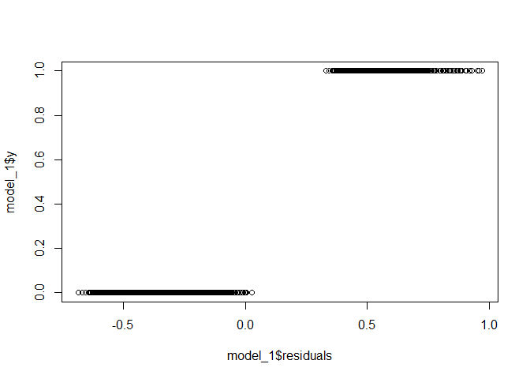
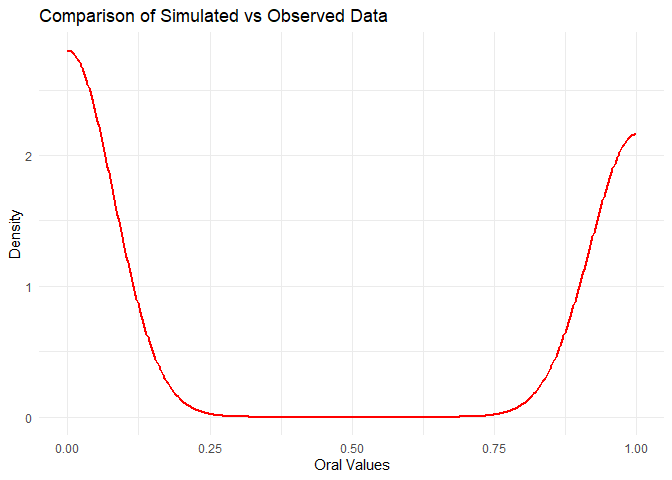
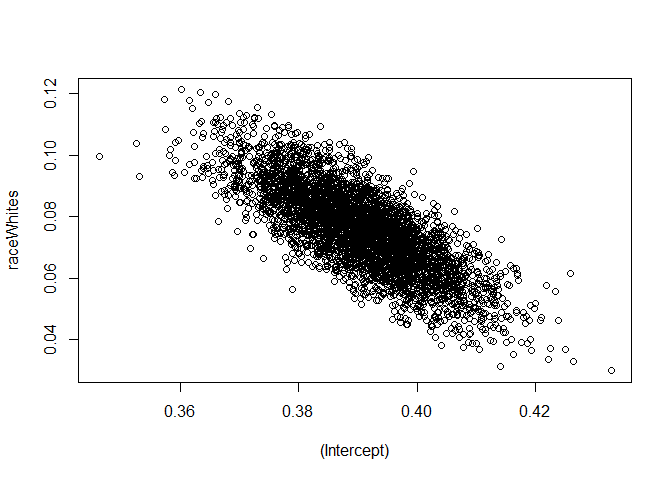

Untitled
================
sarah paul

## GitHub Documents

This is an R Markdown format used for publishing markdown documents to
GitHub. When you click the **Knit** button all R code chunks are run and
a markdown file (.md) suitable for publishing to GitHub is generated.

## Including Code

You can include R code in the document as follows:

``` r
summary(cars)
```

    ##      speed           dist       
    ##  Min.   : 4.0   Min.   :  2.00  
    ##  1st Qu.:12.0   1st Qu.: 26.00  
    ##  Median :15.0   Median : 36.00  
    ##  Mean   :15.4   Mean   : 42.98  
    ##  3rd Qu.:19.0   3rd Qu.: 56.00  
    ##  Max.   :25.0   Max.   :120.00

## Including Plots

You can also embed plots, for example:

<!-- -->

Note that the `echo = FALSE` parameter was added to the code chunk to
prevent printing of the R code that generated the plot.

``` r
data <- read.csv("C:/Users/sarad/OneDrive/Desktop/Studio 2/clean_data.csv")
```

``` r
library(ggplot2)
```

    ## Warning: package 'ggplot2' was built under R version 4.3.3

``` r
library(dplyr)
```

    ## Warning: package 'dplyr' was built under R version 4.3.3

    ## 
    ## Attaching package: 'dplyr'

    ## The following objects are masked from 'package:stats':
    ## 
    ##     filter, lag

    ## The following objects are masked from 'package:base':
    ## 
    ##     intersect, setdiff, setequal, union

``` r
library(tidyverse)
```

    ## Warning: package 'tidyverse' was built under R version 4.3.2

    ## ── Attaching core tidyverse packages ──────────────────────── tidyverse 2.0.0 ──
    ## ✔ forcats   1.0.0     ✔ stringr   1.5.0
    ## ✔ lubridate 1.9.3     ✔ tibble    3.2.1
    ## ✔ purrr     1.0.2     ✔ tidyr     1.3.0
    ## ✔ readr     2.1.4

    ## ── Conflicts ────────────────────────────────────────── tidyverse_conflicts() ──
    ## ✖ dplyr::filter() masks stats::filter()
    ## ✖ dplyr::lag()    masks stats::lag()
    ## ℹ Use the conflicted package (<http://conflicted.r-lib.org/>) to force all conflicts to become errors

``` r
library(broom)
library(boot)
library("rstanarm")
```

    ## Warning: package 'rstanarm' was built under R version 4.3.3

    ## Loading required package: Rcpp
    ## This is rstanarm version 2.32.1
    ## - See https://mc-stan.org/rstanarm/articles/priors for changes to default priors!
    ## - Default priors may change, so it's safest to specify priors, even if equivalent to the defaults.
    ## - For execution on a local, multicore CPU with excess RAM we recommend calling
    ##   options(mc.cores = parallel::detectCores())
    ## 
    ## Attaching package: 'rstanarm'
    ## 
    ## The following object is masked from 'package:boot':
    ## 
    ##     logit

``` r
library(reshape2)
```

    ## 
    ## Attaching package: 'reshape2'
    ## 
    ## The following object is masked from 'package:tidyr':
    ## 
    ##     smiths

``` r
#install.packages("mice")
#install.packages("bayesplot")
library(mice)
```

    ## Warning: package 'mice' was built under R version 4.3.3

    ## 
    ## Attaching package: 'mice'

    ## The following object is masked from 'package:stats':
    ## 
    ##     filter

    ## The following objects are masked from 'package:base':
    ## 
    ##     cbind, rbind

``` r
library(bayesplot)
```

    ## Warning: package 'bayesplot' was built under R version 4.3.3

    ## This is bayesplot version 1.11.1

    ## - Online documentation and vignettes at mc-stan.org/bayesplot

    ## - bayesplot theme set to bayesplot::theme_default()

    ##    * Does _not_ affect other ggplot2 plots

    ##    * See ?bayesplot_theme_set for details on theme setting

``` r
data_oral <- factor(data$oral, levels = c("6 months or less", "more than 6 months"),
                    labels = c(0,1), exclude = NULL)
data$oral <- as.numeric(data$oral == "6 months or less")
print(data)
```

    ##        seqn   race gender   age                           educ marital_status
    ## 1     93704 Whites   male 20-39     College graduate and above        married
    ## 2     93705 Blacks female   60+          Less than high school    not married
    ## 3     93709 Blacks female   60+ High school or some college/AA    not married
    ## 4     93710 Whites   male 20-39     College graduate and above        married
    ## 5     93713 Whites   male   60+ High school or some college/AA    not married
    ## 6     93714 Blacks   male 40-59 High school or some college/AA        married
    ## 7     93717 Whites   male 20-39                                   not married
    ## 8     93718 Blacks female 40-59 High school or some college/AA    not married
    ## 9     93719 Whites female 20-39 High school or some college/AA    not married
    ## 10    93720 Blacks female 20-39 High school or some college/AA        married
    ## 11    93722 Whites female   60+ High school or some college/AA    not married
    ## 12    93723 Whites   male   60+     College graduate and above        married
    ## 13    93724 Blacks female   60+          Less than high school        married
    ## 14    93725 Whites   male 40-59     College graduate and above        married
    ## 15    93728 Blacks   male 40-59     College graduate and above        married
    ## 16    93729 Blacks female 20-39 High school or some college/AA        married
    ## 17    93732 Whites   male   60+ High school or some college/AA    not married
    ## 18    93733 Whites   male 20-39 High school or some college/AA        married
    ## 19    93734 Whites female 40-59 High school or some college/AA        married
    ## 20    93737 Blacks female 20-39 High school or some college/AA    not married
    ## 21    93740 Blacks   male   60+          Less than high school    not married
    ## 22    93742 Blacks   male   60+     College graduate and above    not married
    ## 23    93743 Whites female   60+                                   not married
    ## 24    93744 Whites   male 40-59 High school or some college/AA    not married
    ## 25    93746 Blacks female 20-39     College graduate and above    not married
    ## 26    93749 Whites   male 20-39          Less than high school        married
    ## 27    93752 Whites female 20-39 High school or some college/AA    not married
    ## 28    93753 Whites female 40-59 High school or some college/AA        married
    ## 29    93755 Blacks female 20-39 High school or some college/AA    not married
    ## 30    93756 Blacks   male   60+          Less than high school        married
    ## 31    93757 Whites   male   60+ High school or some college/AA        married
    ## 32    93758 Whites female 40-59          Less than high school        married
    ## 33    93763 Whites female 40-59 High school or some college/AA        married
    ## 34    93764 Whites female 20-39          Less than high school        married
    ## 35    93765 Whites female 20-39 High school or some college/AA        married
    ## 36    93768 Whites   male   60+ High school or some college/AA        married
    ## 37    93772 Blacks female 40-59 High school or some college/AA    not married
    ## 38    93773 Whites   male   60+ High school or some college/AA    not married
    ## 39    93774 Whites   male 40-59     College graduate and above        married
    ## 40    93776 Blacks female 40-59 High school or some college/AA    not married
    ## 41    93777 Blacks female   60+ High school or some college/AA    not married
    ## 42    93778 Blacks   male   60+ High school or some college/AA        married
    ## 43    93782 Blacks female 40-59     College graduate and above    not married
    ## 44    93784 Whites female   60+          Less than high school    not married
    ## 45    93785 Whites female   60+     College graduate and above    not married
    ## 46    93786 Blacks female 20-39          Less than high school    not married
    ## 47    93788 Whites female   60+     College graduate and above    not married
    ## 48    93789 Whites female 20-39     College graduate and above    not married
    ## 49    93795 Blacks   male   60+          Less than high school        married
    ## 50    93796 Whites   male   60+ High school or some college/AA    not married
    ## 51    93797 Whites   male 40-59 High school or some college/AA        married
    ## 52    93798 Blacks female   60+                                       married
    ## 53    93799 Blacks   male 40-59 High school or some college/AA    not married
    ## 54    93800 Whites female   60+     College graduate and above    not married
    ## 55    93802 Whites female 40-59 High school or some college/AA    not married
    ## 56    93803 Blacks female 20-39 High school or some college/AA        married
    ## 57    93804 Whites   male 20-39 High school or some college/AA        married
    ## 58    93805 Whites   male   60+ High school or some college/AA        married
    ## 59    93808 Whites female 20-39 High school or some college/AA    not married
    ## 60    93810 Blacks   male   <20          Less than high school               
    ## 61    93812 Whites female   60+     College graduate and above        married
    ## 62    93814 Blacks   male 40-59 High school or some college/AA        married
    ## 63    93819 Blacks female 40-59 High school or some college/AA               
    ## 64    93820 Blacks female 20-39 High school or some college/AA        married
    ## 65    93825 Whites   male   60+          Less than high school    not married
    ## 66    93826 Whites   male 40-59          Less than high school    not married
    ## 67    93828 Whites female 20-39 High school or some college/AA        married
    ## 68    93829 Blacks   male 40-59 High school or some college/AA        married
    ## 69    93830 Blacks   male   60+ High school or some college/AA        married
    ## 70    93833 Whites female 40-59     College graduate and above    not married
    ## 71    93834 Whites   male 40-59 High school or some college/AA        married
    ## 72    93835 Blacks   male 40-59                                   not married
    ## 73    93837 Whites female 20-39 High school or some college/AA    not married
    ## 74    93839 Whites female 40-59 High school or some college/AA        married
    ## 75    93842 Blacks female 20-39     College graduate and above    not married
    ## 76    93844 Whites female 20-39          Less than high school    not married
    ## 77    93845 Whites female 20-39 High school or some college/AA    not married
    ## 78    93846 Blacks female 20-39 High school or some college/AA    not married
    ## 79    93848 Blacks   male   60+          Less than high school    not married
    ## 80    93849 Whites   male 40-59     College graduate and above        married
    ## 81    93850 Blacks female 20-39     College graduate and above    not married
    ## 82    93851 Whites   male   60+ High school or some college/AA        married
    ## 83    93854 Whites female 20-39     College graduate and above        married
    ## 84    93855 Whites   male   60+ High school or some college/AA    not married
    ## 85    93856 Blacks   male   60+ High school or some college/AA        married
    ## 86    93857 Whites female 40-59 High school or some college/AA        married
    ## 87    93859 Blacks   male   60+     College graduate and above        married
    ## 88    93861 Whites   male   60+          Less than high school        married
    ## 89    93865 Whites female 20-39 High school or some college/AA        married
    ## 90    93866 Whites   male 20-39 High school or some college/AA    not married
    ## 91    93868 Blacks   male   60+          Less than high school        married
    ## 92    93869 Whites female   60+          Less than high school    not married
    ## 93    93870 Whites female 40-59     College graduate and above        married
    ## 94    93875 Blacks   male 20-39          Less than high school    not married
    ## 95    93877 Whites female   60+ High school or some college/AA    not married
    ## 96    93878 Blacks female 40-59 High school or some college/AA    not married
    ## 97    93879 Whites female 20-39 High school or some college/AA    not married
    ## 98    93880 Whites female 20-39 High school or some college/AA        married
    ## 99    93883 Blacks female 20-39 High school or some college/AA    not married
    ## 100   93884 Whites female 40-59     College graduate and above        married
    ## 101   93885 Blacks female 20-39 High school or some college/AA    not married
    ## 102   93886 Whites   male   60+ High school or some college/AA    not married
    ## 103   93887 Whites   male   60+ High school or some college/AA    not married
    ## 104   93888 Whites female 20-39 High school or some college/AA        married
    ## 105   93889 Blacks female 20-39 High school or some college/AA        married
    ## 106   93892 Whites female   60+ High school or some college/AA    not married
    ## 107   93893 Blacks   male 40-59 High school or some college/AA        married
    ## 108   93894 Whites female   60+          Less than high school    not married
    ## 109   93895 Whites   male 40-59     College graduate and above        married
    ## 110   93896 Whites female 20-39 High school or some college/AA        married
    ## 111   93897 Whites female 40-59 High school or some college/AA    not married
    ## 112   93898 Blacks female 40-59 High school or some college/AA    not married
    ## 113   93899 Whites   male   60+          Less than high school        married
    ## 114   93903 Whites   male   60+ High school or some college/AA        married
    ## 115   93907 Blacks female 40-59 High school or some college/AA        married
    ## 116   93910 Whites female   60+ High school or some college/AA        married
    ## 117   93911 Whites female 40-59 High school or some college/AA        married
    ## 118   93912 Blacks   male 20-39 High school or some college/AA        married
    ## 119   93915 Whites   male 20-39 High school or some college/AA    not married
    ## 120   93917 Whites female 20-39          Less than high school               
    ## 121   93918 Whites female 20-39 High school or some college/AA        married
    ## 122   93919 Whites female 20-39     College graduate and above        married
    ## 123   93921 Whites female 40-59          Less than high school        married
    ## 124   93923 Whites female 40-59 High school or some college/AA        married
    ## 125   93924 Whites female   60+ High school or some college/AA    not married
    ## 126   93925 Blacks   male 40-59     College graduate and above        married
    ## 127   93927 Whites female 40-59          Less than high school        married
    ## 128   93928 Whites   male 40-59                                       married
    ## 129   93929 Whites   male 20-39                                       married
    ## 130   93933 Blacks female 40-59 High school or some college/AA    not married
    ## 131   93934 Whites   male 20-39     College graduate and above        married
    ## 132   93936 Whites   male 20-39 High school or some college/AA        married
    ## 133   93937 Whites   male 20-39 High school or some college/AA        married
    ## 134   93939 Blacks female 40-59 High school or some college/AA    not married
    ## 135   93940 Whites female 40-59     College graduate and above        married
    ## 136   93942 Whites   male 40-59 High school or some college/AA        married
    ## 137   93943 Whites   male   60+     College graduate and above    not married
    ## 138   93945 Blacks   male   60+          Less than high school    not married
    ## 139   93948 Blacks female 20-39 High school or some college/AA    not married
    ## 140   93951 Blacks female 40-59 High school or some college/AA        married
    ## 141   93952 Whites female 20-39 High school or some college/AA        married
    ## 142   93954 Whites   male 40-59          Less than high school        married
    ## 143   93956 Whites   male 40-59     College graduate and above        married
    ## 144   93957 Whites female 40-59 High school or some college/AA        married
    ## 145   93958 Blacks   male 20-39 High school or some college/AA        married
    ## 146   93959 Blacks female   60+          Less than high school    not married
    ## 147   93960 Blacks   male   60+ High school or some college/AA        married
    ## 148   93962 Whites   male 20-39     College graduate and above        married
    ## 149   93963 Whites   male   60+          Less than high school        married
    ## 150   93966 Whites   male 40-59 High school or some college/AA        married
    ## 151   93967 Whites   male 20-39          Less than high school        married
    ## 152   93968 Blacks female 40-59          Less than high school        married
    ## 153   93969 Whites female 20-39     College graduate and above    not married
    ## 154   93971 Blacks   male 40-59     College graduate and above        married
    ## 155   93972 Whites   male 20-39 High school or some college/AA        married
    ## 156   93974 Whites   male 40-59     College graduate and above    not married
    ## 157   93975 Whites female 40-59 High school or some college/AA    not married
    ## 158   93977 Blacks   male   60+ High school or some college/AA        married
    ## 159   93979 Whites female 40-59          Less than high school        married
    ## 160   93980 Whites female 20-39     College graduate and above    not married
    ## 161   93982 Whites female 40-59     College graduate and above    not married
    ## 162   93984 Whites   male 40-59 High school or some college/AA        married
    ## 163   93986 Blacks female 20-39 High school or some college/AA    not married
    ## 164   93988 Whites   male 20-39 High school or some college/AA        married
    ## 165   93989 Whites female 20-39     College graduate and above        married
    ## 166   93990 Whites   male 40-59          Less than high school        married
    ## 167   93993 Whites female 20-39 High school or some college/AA        married
    ## 168   93994 Blacks female 40-59 High school or some college/AA    not married
    ## 169   93995 Whites   male 40-59     College graduate and above        married
    ## 170   93997 Whites   male 20-39     College graduate and above        married
    ## 171   93998 Whites female 40-59 High school or some college/AA    not married
    ## 172   93999 Blacks   male 40-59                                       married
    ## 173   94000 Whites   male   60+ High school or some college/AA    not married
    ## 174   94002 Blacks   male 20-39 High school or some college/AA        married
    ## 175   94007 Blacks   male   60+ High school or some college/AA    not married
    ## 176   94010 Whites   male   60+     College graduate and above        married
    ## 177   94013 Whites   male 40-59 High school or some college/AA    not married
    ## 178   94015 Whites female   60+ High school or some college/AA    not married
    ## 179   94017 Whites   male 40-59 High school or some college/AA        married
    ## 180   94019 Blacks   male   60+ High school or some college/AA        married
    ## 181   94020 Whites   male 20-39 High school or some college/AA        married
    ## 182   94021 Whites female 20-39          Less than high school    not married
    ## 183   94023 Blacks   male 20-39 High school or some college/AA        married
    ## 184   94026 Whites female   60+                                   not married
    ## 185   94029 Whites   male 40-59 High school or some college/AA        married
    ## 186   94030 Whites   male 40-59          Less than high school        married
    ## 187   94031 Blacks   male   60+          Less than high school    not married
    ## 188   94048 Whites   male   60+ High school or some college/AA    not married
    ## 189   94049 Blacks female   60+ High school or some college/AA    not married
    ## 190   94050 Whites female 40-59 High school or some college/AA    not married
    ## 191   94051 Whites female   60+ High school or some college/AA    not married
    ## 192   94052 Blacks female 20-39 High school or some college/AA    not married
    ## 193   94053 Blacks   male 20-39                                       married
    ## 194   94055 Blacks   male   60+          Less than high school    not married
    ## 195   94056 Blacks female 20-39 High school or some college/AA        married
    ## 196   94057 Whites female   60+          Less than high school    not married
    ## 197   94058 Whites   male   60+ High school or some college/AA        married
    ## 198   94060 Whites   male 40-59 High school or some college/AA        married
    ## 199   94062 Whites   male 20-39 High school or some college/AA        married
    ## 200   94063 Whites female 20-39 High school or some college/AA    not married
    ## 201   94065 Blacks female   60+ High school or some college/AA    not married
    ## 202   94066 Whites female 20-39     College graduate and above        married
    ## 203   94068 Whites   male   60+ High school or some college/AA        married
    ## 204   94069 Whites   male   60+ High school or some college/AA        married
    ## 205   94074 Whites   male 20-39 High school or some college/AA    not married
    ## 206   94077 Whites female   60+ High school or some college/AA    not married
    ## 207   94078 Whites female 40-59 High school or some college/AA        married
    ## 208   94080 Whites female   60+ High school or some college/AA        married
    ## 209   94082 Whites female   60+ High school or some college/AA        married
    ## 210   94086 Whites female   60+ High school or some college/AA    not married
    ## 211   94087 Whites   male   <20 High school or some college/AA               
    ## 212   94088 Whites   male 40-59     College graduate and above        married
    ## 213   94089 Blacks female 20-39          Less than high school    not married
    ## 214   94093 Whites   male 20-39 High school or some college/AA        married
    ## 215   94094 Blacks female 40-59     College graduate and above    not married
    ## 216   94095 Blacks female   60+ High school or some college/AA    not married
    ## 217   94096 Whites   male   60+     College graduate and above        married
    ## 218   94097 Whites female   60+ High school or some college/AA    not married
    ## 219   94098 Blacks female 20-39 High school or some college/AA    not married
    ## 220   94102 Whites   male   60+ High school or some college/AA        married
    ## 221   94103 Whites female 40-59 High school or some college/AA        married
    ## 222   94107 Whites   male 20-39 High school or some college/AA        married
    ## 223   94109 Whites   male 40-59 High school or some college/AA        married
    ## 224   94110 Whites   male 20-39 High school or some college/AA        married
    ## 225   94111 Whites female 20-39 High school or some college/AA        married
    ## 226   94113 Whites female   60+ High school or some college/AA    not married
    ## 227   94114 Blacks female   60+ High school or some college/AA    not married
    ## 228   94115 Whites female 20-39 High school or some college/AA        married
    ## 229   94116 Whites   male   60+ High school or some college/AA        married
    ## 230   94117 Whites female 40-59          Less than high school    not married
    ## 231   94119 Blacks   male   60+ High school or some college/AA        married
    ## 232   94120 Whites female 40-59 High school or some college/AA        married
    ## 233   94121 Whites female 40-59          Less than high school    not married
    ## 234   94123 Blacks   male 20-39                                   not married
    ## 235   94126 Blacks female   60+          Less than high school    not married
    ## 236   94128 Blacks   male 20-39 High school or some college/AA    not married
    ## 237   94129 Blacks female   60+          Less than high school    not married
    ## 238   94130 Blacks   male 20-39 High school or some college/AA    not married
    ## 239   94131 Whites   male 40-59 High school or some college/AA        married
    ## 240   94132 Blacks   male 20-39 High school or some college/AA        married
    ## 241   94137 Blacks female 20-39     College graduate and above    not married
    ## 242   94141 Blacks   male   60+     College graduate and above        married
    ## 243   94143 Blacks   male 20-39 High school or some college/AA        married
    ## 244   94146 Whites female 20-39 High school or some college/AA        married
    ## 245   94147 Whites   male   60+     College graduate and above        married
    ## 246   94149 Blacks female   60+ High school or some college/AA    not married
    ## 247   94150 Whites female   60+          Less than high school        married
    ## 248   94152 Whites female   60+ High school or some college/AA    not married
    ## 249   94154 Whites   male   60+          Less than high school        married
    ## 250   94160 Whites   male 40-59 High school or some college/AA        married
    ## 251   94163 Whites female 20-39 High school or some college/AA        married
    ## 252   94165 Blacks   male 20-39          Less than high school        married
    ## 253   94166 Whites   male 20-39 High school or some college/AA        married
    ## 254   94170 Blacks female 40-59                                   not married
    ## 255   94171 Blacks   male 40-59          Less than high school        married
    ## 256   94172 Whites   male 20-39     College graduate and above        married
    ## 257   94173 Blacks female   60+ High school or some college/AA    not married
    ## 258   94175 Whites   male   60+ High school or some college/AA        married
    ## 259   94176 Whites female 20-39 High school or some college/AA    not married
    ## 260   94178 Whites female 40-59 High school or some college/AA        married
    ## 261   94179 Whites female   60+ High school or some college/AA        married
    ## 262   94180 Whites female 20-39 High school or some college/AA        married
    ## 263   94182 Whites female 40-59     College graduate and above    not married
    ## 264   94183 Whites   male 40-59 High school or some college/AA        married
    ## 265   94184 Whites female 20-39 High school or some college/AA    not married
    ## 266   94186 Blacks female 40-59     College graduate and above    not married
    ## 267   94188 Whites female 40-59 High school or some college/AA        married
    ## 268   94191 Whites female 20-39 High school or some college/AA        married
    ## 269   94192 Whites   male 40-59 High school or some college/AA        married
    ## 270   94193 Blacks female 40-59 High school or some college/AA    not married
    ## 271   94194 Whites   male 20-39 High school or some college/AA        married
    ## 272   94195 Whites   male 40-59 High school or some college/AA        married
    ## 273   94196 Whites   male 20-39     College graduate and above        married
    ## 274   94197 Blacks   male 40-59 High school or some college/AA               
    ## 275   94202 Whites female   60+ High school or some college/AA        married
    ## 276   94204 Whites   male   60+ High school or some college/AA        married
    ## 277   94205 Whites   male 40-59     College graduate and above        married
    ## 278   94207 Blacks   male   60+          Less than high school        married
    ## 279   94208 Blacks   male   60+     College graduate and above        married
    ## 280   94210 Blacks   male   60+          Less than high school    not married
    ## 281   94211 Whites female 20-39     College graduate and above    not married
    ## 282   94213 Blacks female 20-39 High school or some college/AA        married
    ## 283   94214 Whites   male 40-59 High school or some college/AA        married
    ## 284   94215 Whites female 20-39 High school or some college/AA        married
    ## 285   94216 Blacks   male   60+ High school or some college/AA        married
    ## 286   94218 Whites   male 40-59                                       married
    ## 287   94220 Blacks female 40-59 High school or some college/AA    not married
    ## 288   94221 Blacks   male   60+ High school or some college/AA    not married
    ## 289   94226 Blacks female 20-39 High school or some college/AA    not married
    ## 290   94227 Whites   male   60+     College graduate and above    not married
    ## 291   94229 Blacks   male 40-59                                       married
    ## 292   94230 Blacks female   60+ High school or some college/AA    not married
    ## 293   94231 Whites   male 40-59 High school or some college/AA    not married
    ## 294   94232 Whites   male   60+     College graduate and above        married
    ## 295   94235 Whites female   <20 High school or some college/AA               
    ## 296   94236 Blacks female 20-39          Less than high school    not married
    ## 297   94237 Whites   male   60+     College graduate and above        married
    ## 298   94238 Blacks female 40-59 High school or some college/AA        married
    ## 299   94240 Whites   male 40-59     College graduate and above        married
    ## 300   94242 Blacks   male   60+ High school or some college/AA        married
    ## 301   94245 Whites female 20-39     College graduate and above        married
    ## 302   94247 Whites female 20-39 High school or some college/AA        married
    ## 303   94248 Blacks female 20-39 High school or some college/AA    not married
    ## 304   94249 Blacks female   60+     College graduate and above    not married
    ## 305   94250 Whites female 20-39     College graduate and above        married
    ## 306   94251 Whites female 40-59 High school or some college/AA    not married
    ## 307   94256 Whites female 20-39     College graduate and above    not married
    ## 308   94258 Whites   male 40-59 High school or some college/AA        married
    ## 309   94263 Whites female 40-59 High school or some college/AA    not married
    ## 310   94264 Whites   male 40-59     College graduate and above        married
    ## 311   94268 Blacks female   60+          Less than high school    not married
    ## 312   94271 Whites female 20-39 High school or some college/AA    not married
    ## 313   94272 Whites   male 40-59 High school or some college/AA        married
    ## 314   94282 Blacks female 40-59 High school or some college/AA    not married
    ## 315   94283 Blacks   male 20-39 High school or some college/AA    not married
    ## 316   94284 Blacks   male 40-59          Less than high school        married
    ## 317   94286 Blacks female   60+     College graduate and above    not married
    ## 318   94287 Whites female 40-59     College graduate and above        married
    ## 319   94288 Blacks female 20-39 High school or some college/AA        married
    ## 320   94289 Whites female 40-59 High school or some college/AA    not married
    ## 321   94293 Whites   male   60+ High school or some college/AA        married
    ## 322   94296 Whites female 20-39 High school or some college/AA        married
    ## 323   94300 Whites female   60+     College graduate and above    not married
    ## 324   94305 Whites female 40-59 High school or some college/AA        married
    ## 325   94306 Whites female 20-39 High school or some college/AA    not married
    ## 326   94307 Whites female 20-39 High school or some college/AA        married
    ## 327   94311 Blacks female 40-59 High school or some college/AA    not married
    ## 328   94312 Whites female 20-39 High school or some college/AA    not married
    ## 329   94313 Blacks female   60+ High school or some college/AA    not married
    ## 330   94316 Blacks female 20-39 High school or some college/AA        married
    ## 331   94319 Whites   male 40-59     College graduate and above        married
    ## 332   94320 Blacks female 40-59 High school or some college/AA    not married
    ## 333   94321 Blacks female 40-59 High school or some college/AA        married
    ## 334   94324 Whites female 40-59          Less than high school    not married
    ## 335   94326 Whites   male 40-59 High school or some college/AA    not married
    ## 336   94327 Blacks   male   60+ High school or some college/AA    not married
    ## 337   94329 Blacks female 20-39 High school or some college/AA    not married
    ## 338   94330 Whites   male   60+ High school or some college/AA        married
    ## 339   94331 Whites   male 40-59 High school or some college/AA        married
    ## 340   94333 Blacks female 20-39 High school or some college/AA    not married
    ## 341   94340 Whites   male 40-59     College graduate and above    not married
    ## 342   94342 Blacks female 40-59     College graduate and above    not married
    ## 343   94345 Whites female   60+ High school or some college/AA        married
    ## 344   94348 Whites female   60+     College graduate and above        married
    ## 345   94351 Whites female 20-39 High school or some college/AA        married
    ## 346   94353 Whites female   60+ High school or some college/AA    not married
    ## 347   94355 Whites   male 20-39 High school or some college/AA        married
    ## 348   94356 Blacks   male 40-59 High school or some college/AA    not married
    ## 349   94358 Whites   male 20-39 High school or some college/AA        married
    ## 350   94362 Whites   male   60+ High school or some college/AA        married
    ## 351   94363 Whites female   60+ High school or some college/AA    not married
    ## 352   94364 Whites female 40-59          Less than high school    not married
    ## 353   94365 Blacks   male 20-39 High school or some college/AA        married
    ## 354   94367 Blacks   male 20-39          Less than high school        married
    ## 355   94368 Whites   male 20-39     College graduate and above        married
    ## 356   94369 Blacks female 40-59 High school or some college/AA    not married
    ## 357   94372 Blacks   male   60+     College graduate and above        married
    ## 358   94373 Whites   male   60+ High school or some college/AA    not married
    ## 359   94376 Blacks female 20-39 High school or some college/AA        married
    ## 360   94377 Whites   male 20-39 High school or some college/AA    not married
    ## 361   94379 Whites female 20-39 High school or some college/AA        married
    ## 362   94380 Blacks   male   60+          Less than high school        married
    ## 363   94381 Blacks female   60+ High school or some college/AA    not married
    ## 364   94382 Whites female 20-39 High school or some college/AA    not married
    ## 365   94384 Whites female 40-59     College graduate and above        married
    ## 366   94386 Whites female   60+ High school or some college/AA    not married
    ## 367   94387 Blacks female 20-39 High school or some college/AA    not married
    ## 368   94388 Blacks female 20-39 High school or some college/AA        married
    ## 369   94389 Whites   male 40-59 High school or some college/AA        married
    ## 370   94391 Whites   male 20-39     College graduate and above        married
    ## 371   94392 Blacks   male 40-59     College graduate and above    not married
    ## 372   94395 Whites female 40-59 High school or some college/AA        married
    ## 373   94396 Blacks female 40-59 High school or some college/AA    not married
    ## 374   94397 Blacks   male   <20 High school or some college/AA               
    ## 375   94398 Blacks female 20-39          Less than high school    not married
    ## 376   94400 Whites female 20-39     College graduate and above    not married
    ## 377   94401 Whites female 40-59 High school or some college/AA        married
    ## 378   94402 Whites   male 40-59 High school or some college/AA        married
    ## 379   94403 Whites   male 20-39 High school or some college/AA        married
    ## 380   94404 Whites female   60+ High school or some college/AA    not married
    ## 381   94405 Whites female 20-39          Less than high school    not married
    ## 382   94406 Blacks   male 20-39 High school or some college/AA        married
    ## 383   94407 Whites   male   60+ High school or some college/AA        married
    ## 384   94408 Whites female   60+ High school or some college/AA        married
    ## 385   94410 Blacks female   60+ High school or some college/AA    not married
    ## 386   94411 Blacks female 40-59     College graduate and above    not married
    ## 387   94414 Blacks female 40-59          Less than high school    not married
    ## 388   94416 Whites female 20-39 High school or some college/AA        married
    ## 389   94417 Whites   male 20-39 High school or some college/AA        married
    ## 390   94418 Whites   male   60+ High school or some college/AA        married
    ## 391   94419 Blacks female 20-39 High school or some college/AA    not married
    ## 392   94420 Whites female   60+          Less than high school    not married
    ## 393   94422 Whites female 40-59 High school or some college/AA    not married
    ## 394   94424 Blacks female   60+     College graduate and above    not married
    ## 395   94425 Whites   male   60+ High school or some college/AA        married
    ## 396   94429 Blacks female   60+     College graduate and above        married
    ## 397   94431 Whites female 40-59 High school or some college/AA        married
    ## 398   94433 Blacks female   60+     College graduate and above    not married
    ## 399   94435 Blacks female 20-39 High school or some college/AA    not married
    ## 400   94436 Blacks female 20-39          Less than high school        married
    ## 401   94437 Blacks   male 40-59 High school or some college/AA        married
    ## 402   94442 Whites   male   60+ High school or some college/AA        married
    ## 403   94444 Blacks female 40-59 High school or some college/AA    not married
    ## 404   94445 Whites   male 40-59 High school or some college/AA        married
    ## 405   94447 Blacks female 40-59 High school or some college/AA    not married
    ## 406   94448 Whites   male 40-59 High school or some college/AA        married
    ## 407   94449 Whites female 20-39 High school or some college/AA        married
    ## 408   94451 Whites female 20-39     College graduate and above    not married
    ## 409   94452 Whites female 40-59          Less than high school    not married
    ## 410   94453 Whites   male 40-59 High school or some college/AA        married
    ## 411   94456 Whites female 40-59 High school or some college/AA        married
    ## 412   94457 Whites female 40-59     College graduate and above    not married
    ## 413   94459 Blacks female 40-59          Less than high school    not married
    ## 414   94460 Blacks   male   60+     College graduate and above        married
    ## 415   94463 Blacks female 20-39 High school or some college/AA    not married
    ## 416   94464 Whites female   60+     College graduate and above        married
    ## 417   94468 Blacks female 20-39 High school or some college/AA    not married
    ## 418   94470 Whites female   60+          Less than high school        married
    ## 419   94473 Whites female   60+     College graduate and above    not married
    ## 420   94474 Whites female 40-59 High school or some college/AA        married
    ## 421   94476 Whites female 40-59     College graduate and above        married
    ## 422   94477 Blacks   male 40-59 High school or some college/AA        married
    ## 423   94478 Blacks female 20-39 High school or some college/AA    not married
    ## 424   94479 Whites female   60+ High school or some college/AA    not married
    ## 425   94482 Blacks female 40-59                                       married
    ## 426   94484 Blacks female 20-39 High school or some college/AA        married
    ## 427   94486 Blacks female 40-59 High school or some college/AA    not married
    ## 428   94487 Blacks female   60+     College graduate and above    not married
    ## 429   94490 Whites   male   60+ High school or some college/AA    not married
    ## 430   94491 Blacks female 20-39          Less than high school    not married
    ## 431   94494 Whites female 20-39 High school or some college/AA    not married
    ## 432   94496 Whites   male 20-39 High school or some college/AA        married
    ## 433   94499 Blacks   male   60+ High school or some college/AA        married
    ## 434   94500 Blacks female   60+ High school or some college/AA    not married
    ## 435   94503 Blacks female   60+ High school or some college/AA    not married
    ## 436   94504 Blacks   male 40-59 High school or some college/AA        married
    ## 437   94506 Blacks   male   60+                                       married
    ## 438   94507 Blacks   male 20-39 High school or some college/AA        married
    ## 439   94508 Blacks female 20-39     College graduate and above    not married
    ## 440   94509 Whites female 40-59     College graduate and above    not married
    ## 441   94510 Whites   male 40-59 High school or some college/AA        married
    ## 442   94511 Blacks female 20-39 High school or some college/AA        married
    ## 443   94513 Whites   male 40-59 High school or some college/AA        married
    ## 444   94516 Blacks female   <20 High school or some college/AA               
    ## 445   94518 Whites female 20-39     College graduate and above        married
    ## 446   94519 Whites   male 40-59     College graduate and above        married
    ## 447   94522 Blacks female 40-59          Less than high school    not married
    ## 448   94523 Blacks female   60+     College graduate and above        married
    ## 449   94524 Blacks female 20-39                                   not married
    ## 450   94525 Whites female   60+ High school or some college/AA        married
    ## 451   94526 Blacks   male 20-39          Less than high school        married
    ## 452   94529 Blacks   male 40-59 High school or some college/AA        married
    ## 453   94530 Blacks   male 20-39 High school or some college/AA    not married
    ## 454   94533 Whites   male 40-59 High school or some college/AA        married
    ## 455   94534 Whites   male   60+ High school or some college/AA        married
    ## 456   94535 Whites   male   60+     College graduate and above    not married
    ## 457   94536 Blacks   male 40-59 High school or some college/AA        married
    ## 458   94539 Whites   male   60+ High school or some college/AA    not married
    ## 459   94540 Blacks female 20-39 High school or some college/AA    not married
    ## 460   94541 Blacks   male   60+     College graduate and above        married
    ## 461   94542 Blacks female 40-59 High school or some college/AA        married
    ## 462   94543 Blacks female 40-59     College graduate and above    not married
    ## 463   94544 Whites   male 40-59          Less than high school        married
    ## 464   94547 Blacks female 40-59                                       married
    ## 465   94548 Blacks   male 40-59          Less than high school    not married
    ## 466   94549 Whites   male   60+          Less than high school        married
    ## 467   94553 Whites female   60+ High school or some college/AA        married
    ## 468   94556 Whites female 20-39 High school or some college/AA        married
    ## 469   94557 Blacks female 20-39 High school or some college/AA    not married
    ## 470   94560 Whites female 20-39 High school or some college/AA        married
    ## 471   94562 Whites   male 20-39 High school or some college/AA        married
    ## 472   94563 Whites   male 20-39 High school or some college/AA    not married
    ## 473   94566 Whites   male 40-59                                       married
    ## 474   94567 Blacks female 20-39 High school or some college/AA    not married
    ## 475   94569 Whites female 40-59 High school or some college/AA        married
    ## 476   94570 Whites female 40-59                                       married
    ## 477   94571 Whites   male   60+          Less than high school        married
    ## 478   94572 Blacks female 40-59 High school or some college/AA    not married
    ## 479   94574 Blacks   male 40-59                                       married
    ## 480   94575 Whites female   60+ High school or some college/AA    not married
    ## 481   94577 Whites   male   60+     College graduate and above        married
    ## 482   94578 Whites   male   60+ High school or some college/AA        married
    ## 483   94579 Blacks   male 40-59 High school or some college/AA    not married
    ## 484   94581 Whites   male   60+          Less than high school    not married
    ## 485   94583 Whites   male   60+          Less than high school    not married
    ## 486   94585 Whites female 40-59     College graduate and above        married
    ## 487   94586 Whites female   60+     College graduate and above        married
    ## 488   94587 Whites female 20-39 High school or some college/AA    not married
    ## 489   94588 Whites   male 40-59 High school or some college/AA        married
    ## 490   94589 Whites   male 20-39     College graduate and above        married
    ## 491   94591 Whites   male 40-59 High school or some college/AA        married
    ## 492   94592 Whites   male 20-39 High school or some college/AA        married
    ## 493   94593 Blacks female 20-39 High school or some college/AA    not married
    ## 494   94594 Blacks female 40-59 High school or some college/AA    not married
    ## 495   94596 Whites female 20-39 High school or some college/AA    not married
    ## 496   94598 Whites   male 40-59 High school or some college/AA        married
    ## 497   94599 Whites   male 40-59     College graduate and above        married
    ## 498   94600 Whites female   60+ High school or some college/AA    not married
    ## 499   94601 Whites female 40-59 High school or some college/AA    not married
    ## 500   94602 Whites   male 20-39 High school or some college/AA        married
    ## 501   94603 Blacks female 40-59     College graduate and above    not married
    ## 502   94605 Blacks   male 40-59 High school or some college/AA        married
    ## 503   94606 Whites   male 40-59     College graduate and above        married
    ## 504   94607 Whites   male 20-39 High school or some college/AA        married
    ## 505   94612 Blacks female 20-39          Less than high school    not married
    ## 506   94613 Whites female 20-39     College graduate and above        married
    ## 507   94617 Whites female 20-39 High school or some college/AA        married
    ## 508   94618 Whites   male 40-59 High school or some college/AA    not married
    ## 509   94619 Blacks   male   60+     College graduate and above        married
    ## 510   94622 Whites female 20-39 High school or some college/AA        married
    ## 511   94623 Whites   male 40-59     College graduate and above        married
    ## 512   94625 Blacks   male 20-39          Less than high school    not married
    ## 513   94628 Blacks   male 20-39          Less than high school        married
    ## 514   94629 Whites   male   60+ High school or some college/AA        married
    ## 515   94630 Blacks female 40-59          Less than high school    not married
    ## 516   94631 Blacks female 20-39 High school or some college/AA    not married
    ## 517   94632 Whites female   60+ High school or some college/AA    not married
    ## 518   94633 Whites female   60+ High school or some college/AA    not married
    ## 519   94634 Whites female   60+ High school or some college/AA    not married
    ## 520   94635 Blacks   male 20-39 High school or some college/AA        married
    ## 521   94638 Blacks   male 20-39 High school or some college/AA        married
    ## 522   94642 Whites   male 20-39 High school or some college/AA        married
    ## 523   94644 Whites female 20-39 High school or some college/AA        married
    ## 524   94645 Whites   male 20-39 High school or some college/AA        married
    ## 525   94646 Blacks female 20-39 High school or some college/AA    not married
    ## 526   94649 Whites   male   60+ High school or some college/AA    not married
    ## 527   94650 Blacks   male   60+ High school or some college/AA    not married
    ## 528   94651 Whites female 40-59 High school or some college/AA    not married
    ## 529   94652 Whites   male 20-39 High school or some college/AA    not married
    ## 530   94653 Whites   male 20-39 High school or some college/AA    not married
    ## 531   94654 Whites female   60+ High school or some college/AA    not married
    ## 532   94655 Whites   male 20-39 High school or some college/AA        married
    ## 533   94656 Whites   male 20-39 High school or some college/AA        married
    ## 534   94658 Blacks   male 20-39 High school or some college/AA        married
    ## 535   94662 Whites female 20-39 High school or some college/AA        married
    ## 536   94665 Whites   male 20-39 High school or some college/AA        married
    ## 537   94666 Blacks female 20-39 High school or some college/AA    not married
    ## 538   94668 Whites female 20-39     College graduate and above        married
    ## 539   94669 Whites female 20-39     College graduate and above        married
    ## 540   94670 Blacks female   60+ High school or some college/AA        married
    ## 541   94672 Whites   male 20-39 High school or some college/AA        married
    ## 542   94673 Blacks female 20-39 High school or some college/AA        married
    ## 543   94674 Whites   male 40-59     College graduate and above    not married
    ## 544   94675 Whites female 20-39 High school or some college/AA        married
    ## 545   94676 Blacks   male   60+     College graduate and above        married
    ## 546   94677 Whites female 20-39 High school or some college/AA        married
    ## 547   94678 Whites   male   60+     College graduate and above        married
    ## 548   94680 Whites female   60+ High school or some college/AA    not married
    ## 549   94681 Whites   male   60+ High school or some college/AA        married
    ## 550   94682 Whites   male 20-39     College graduate and above        married
    ## 551   94683 Blacks female 40-59 High school or some college/AA        married
    ## 552   94684 Whites female 20-39 High school or some college/AA        married
    ## 553   94685 Blacks female 40-59 High school or some college/AA    not married
    ## 554   94686 Whites female 20-39 High school or some college/AA        married
    ## 555   94688 Whites female   60+     College graduate and above        married
    ## 556   94690 Whites female 20-39 High school or some college/AA        married
    ## 557   94691 Whites   male   60+          Less than high school    not married
    ## 558   94692 Whites   male 20-39 High school or some college/AA        married
    ## 559   94693 Whites   male 40-59 High school or some college/AA    not married
    ## 560   94695 Whites female 40-59 High school or some college/AA        married
    ## 561   94696 Whites female 40-59 High school or some college/AA        married
    ## 562   94697 Whites female 20-39     College graduate and above    not married
    ## 563   94698 Blacks female 40-59          Less than high school    not married
    ## 564   94701 Blacks female 40-59 High school or some college/AA    not married
    ## 565   94702 Blacks female 20-39 High school or some college/AA    not married
    ## 566   94703 Whites female 40-59 High school or some college/AA        married
    ## 567   94704 Blacks female   60+          Less than high school    not married
    ## 568   94707 Whites   male   60+ High school or some college/AA        married
    ## 569   94708 Whites female 20-39     College graduate and above        married
    ## 570   94709 Whites female 20-39     College graduate and above        married
    ## 571   94710 Blacks   male   60+     College graduate and above    not married
    ## 572   94711 Whites   male   60+ High school or some college/AA        married
    ## 573   94712 Whites female 20-39 High school or some college/AA        married
    ## 574   94713 Blacks   male 40-59 High school or some college/AA        married
    ## 575   94714 Blacks female 20-39 High school or some college/AA        married
    ## 576   94715 Blacks female 40-59 High school or some college/AA    not married
    ## 577   94716 Whites female   60+     College graduate and above    not married
    ## 578   94718 Whites female 20-39 High school or some college/AA        married
    ## 579   94720 Blacks   male 20-39     College graduate and above        married
    ## 580   94722 Whites female 40-59 High school or some college/AA    not married
    ## 581   94723 Whites female 40-59     College graduate and above        married
    ## 582   94724 Whites female   60+ High school or some college/AA    not married
    ## 583   94725 Whites   male 40-59     College graduate and above    not married
    ## 584   94726 Whites   male 40-59 High school or some college/AA        married
    ## 585   94727 Blacks female 20-39          Less than high school        married
    ## 586   94729 Blacks   male 20-39          Less than high school        married
    ## 587   94731 Blacks   male 40-59                                       married
    ## 588   94732 Blacks female 40-59 High school or some college/AA        married
    ## 589   94733 Whites female 20-39 High school or some college/AA    not married
    ## 590   94734 Whites   male 40-59     College graduate and above        married
    ## 591   94737 Blacks female   60+          Less than high school    not married
    ## 592   94738 Whites female 20-39 High school or some college/AA    not married
    ## 593   94739 Whites female   60+ High school or some college/AA        married
    ## 594   94741 Blacks female 40-59 High school or some college/AA    not married
    ## 595   94742 Whites female 40-59     College graduate and above        married
    ## 596   94743 Whites   male 40-59 High school or some college/AA        married
    ## 597   94744 Blacks female 20-39          Less than high school        married
    ## 598   94745 Whites   male 40-59                                       married
    ## 599   94746 Blacks female 40-59 High school or some college/AA    not married
    ## 600   94747 Whites   male   60+ High school or some college/AA        married
    ## 601   94748 Blacks female 40-59 High school or some college/AA    not married
    ## 602   94749 Blacks female 20-39          Less than high school    not married
    ## 603   94750 Whites   male   60+          Less than high school        married
    ## 604   94752 Whites   male   60+ High school or some college/AA    not married
    ## 605   94754 Whites   male   60+          Less than high school        married
    ## 606   94756 Whites   male   60+ High school or some college/AA        married
    ## 607   94760 Blacks female   60+ High school or some college/AA    not married
    ## 608   94762 Whites female 20-39 High school or some college/AA    not married
    ## 609   94763 Blacks female 20-39 High school or some college/AA        married
    ## 610   94764 Blacks   male 40-59 High school or some college/AA        married
    ## 611   94765 Whites   male 40-59 High school or some college/AA    not married
    ## 612   94766 Blacks   male 40-59 High school or some college/AA        married
    ## 613   94768 Whites   male   60+     College graduate and above        married
    ## 614   94769 Whites female 20-39 High school or some college/AA    not married
    ## 615   94770 Blacks   male 20-39 High school or some college/AA        married
    ## 616   94771 Whites female 40-59 High school or some college/AA        married
    ## 617   94774 Whites   male 40-59 High school or some college/AA        married
    ## 618   94775 Blacks female 40-59     College graduate and above    not married
    ## 619   94777 Whites   male   60+                                       married
    ## 620   94778 Whites   male 20-39 High school or some college/AA        married
    ## 621   94779 Whites   male   60+ High school or some college/AA        married
    ## 622   94782 Whites female 40-59     College graduate and above    not married
    ## 623   94784 Whites female 20-39 High school or some college/AA    not married
    ## 624   94786 Whites   male 20-39 High school or some college/AA        married
    ## 625   94789 Blacks female 20-39 High school or some college/AA    not married
    ## 626   94790 Blacks   male 40-59          Less than high school    not married
    ## 627   94791 Whites female 40-59     College graduate and above    not married
    ## 628   94794 Whites   male 20-39     College graduate and above        married
    ## 629   94800 Whites female 40-59     College graduate and above        married
    ## 630   94801 Blacks   male 40-59     College graduate and above        married
    ## 631   94804 Blacks female 20-39 High school or some college/AA    not married
    ## 632   94808 Blacks female 40-59 High school or some college/AA    not married
    ## 633   94811 Blacks   male 40-59                                       married
    ## 634   94815 Blacks female 40-59 High school or some college/AA    not married
    ## 635   94816 Whites female   <20 High school or some college/AA               
    ## 636   94820 Blacks female 40-59 High school or some college/AA    not married
    ## 637   94822 Blacks   male 40-59     College graduate and above        married
    ## 638   94823 Blacks female 20-39          Less than high school        married
    ## 639   94824 Whites   male 20-39     College graduate and above        married
    ## 640   94826 Blacks   male 40-59 High school or some college/AA        married
    ## 641   94827 Blacks female 20-39 High school or some college/AA        married
    ## 642   94828 Blacks female 40-59 High school or some college/AA    not married
    ## 643   94829 Whites   male   60+     College graduate and above        married
    ## 644   94830 Whites female 20-39     College graduate and above        married
    ## 645   94831 Whites female   60+          Less than high school    not married
    ## 646   94832 Whites   male   60+     College graduate and above        married
    ## 647   94834 Whites female   60+ High school or some college/AA        married
    ## 648   94835 Whites female 40-59 High school or some college/AA    not married
    ## 649   94836 Whites female   60+ High school or some college/AA        married
    ## 650   94838 Blacks female   60+          Less than high school    not married
    ## 651   94839 Whites   male 40-59          Less than high school        married
    ## 652   94840 Whites female 40-59 High school or some college/AA        married
    ## 653   94843 Whites female 20-39     College graduate and above        married
    ## 654   94844 Whites   male 20-39     College graduate and above        married
    ## 655   94846 Blacks   male 20-39 High school or some college/AA        married
    ## 656   94847 Blacks female   60+ High school or some college/AA    not married
    ## 657   94850 Whites female 40-59 High school or some college/AA        married
    ## 658   94854 Whites   male 40-59 High school or some college/AA        married
    ## 659   94855 Blacks female 20-39          Less than high school        married
    ## 660   94856 Whites female   60+ High school or some college/AA    not married
    ## 661   94858 Whites female 40-59 High school or some college/AA    not married
    ## 662   94859 Whites female 20-39 High school or some college/AA    not married
    ## 663   94860 Blacks   male 20-39 High school or some college/AA        married
    ## 664   94861 Blacks   male   60+ High school or some college/AA        married
    ## 665   94865 Blacks female 20-39 High school or some college/AA    not married
    ## 666   94867 Whites female 40-59 High school or some college/AA        married
    ## 667   94869 Whites   male   60+ High school or some college/AA        married
    ## 668   94870 Blacks   male 40-59                                       married
    ## 669   94871 Whites   male   60+ High school or some college/AA        married
    ## 670   94872 Whites   male   60+          Less than high school        married
    ## 671   94874 Whites   male 40-59     College graduate and above    not married
    ## 672   94875 Whites female 20-39 High school or some college/AA    not married
    ## 673   94878 Blacks   male 20-39 High school or some college/AA        married
    ## 674   94880 Whites   male   60+                                   not married
    ## 675   94883 Blacks   male 40-59 High school or some college/AA        married
    ## 676   94885 Blacks   male   60+ High school or some college/AA        married
    ## 677   94887 Whites   male   60+ High school or some college/AA        married
    ## 678   94888 Blacks   male 40-59 High school or some college/AA        married
    ## 679   94890 Whites   male 40-59          Less than high school        married
    ## 680   94891 Blacks female 40-59 High school or some college/AA    not married
    ## 681   94892 Whites   male   60+ High school or some college/AA    not married
    ## 682   94894 Whites   male 40-59 High school or some college/AA        married
    ## 683   94896 Blacks female 40-59          Less than high school        married
    ## 684   94897 Blacks   male 40-59     College graduate and above        married
    ## 685   94898 Whites female   60+ High school or some college/AA    not married
    ## 686   94899 Blacks   male 20-39 High school or some college/AA    not married
    ## 687   94901 Whites female 20-39 High school or some college/AA        married
    ## 688   94903 Blacks   male 40-59     College graduate and above    not married
    ## 689   94904 Whites   male 40-59 High school or some college/AA        married
    ## 690   94905 Whites   male 40-59 High school or some college/AA        married
    ## 691   94906 Whites female 40-59 High school or some college/AA        married
    ## 692   94907 Whites   male   60+ High school or some college/AA        married
    ## 693   94908 Blacks   male 40-59 High school or some college/AA    not married
    ## 694   94909 Whites female 40-59 High school or some college/AA        married
    ## 695   94910 Whites   male 40-59 High school or some college/AA        married
    ## 696   94911 Whites   male 20-39                                       married
    ## 697   94912 Whites   male 20-39 High school or some college/AA        married
    ## 698   94913 Whites female 20-39     College graduate and above    not married
    ## 699   94915 Blacks female 40-59 High school or some college/AA        married
    ## 700   94916 Blacks female 20-39 High school or some college/AA    not married
    ## 701   94920 Blacks female 40-59 High school or some college/AA        married
    ## 702   94922 Blacks   male   60+ High school or some college/AA        married
    ## 703   94923 Blacks female 40-59     College graduate and above    not married
    ## 704   94924 Whites female 20-39 High school or some college/AA        married
    ## 705   94925 Blacks female 40-59     College graduate and above    not married
    ## 706   94926 Whites   male 20-39 High school or some college/AA    not married
    ## 707   94928 Whites female 40-59 High school or some college/AA    not married
    ## 708   94929 Whites female   60+     College graduate and above        married
    ## 709   94930 Blacks female   60+          Less than high school        married
    ## 710   94931 Whites female   60+ High school or some college/AA        married
    ## 711   94932 Whites   male 40-59 High school or some college/AA        married
    ## 712   94936 Blacks female 20-39 High school or some college/AA        married
    ## 713   94937 Whites   male 40-59 High school or some college/AA    not married
    ## 714   94938 Blacks female 40-59 High school or some college/AA        married
    ## 715   94941 Blacks   male 40-59 High school or some college/AA    not married
    ## 716   94942 Whites   male 40-59 High school or some college/AA        married
    ## 717   94946 Whites female 20-39 High school or some college/AA        married
    ## 718   94947 Blacks   male 40-59     College graduate and above        married
    ## 719   94948 Blacks female 40-59          Less than high school    not married
    ## 720   94950 Whites   male   60+ High school or some college/AA        married
    ## 721   94951 Blacks female 20-39                                   not married
    ## 722   94952 Whites female   60+     College graduate and above    not married
    ## 723   94953 Whites female 40-59 High school or some college/AA    not married
    ## 724   94954 Blacks female 20-39     College graduate and above    not married
    ## 725   94956 Blacks   male   60+          Less than high school        married
    ## 726   94957 Whites   male 40-59 High school or some college/AA    not married
    ## 727   94959 Blacks female 40-59 High school or some college/AA        married
    ## 728   94960 Whites female 20-39 High school or some college/AA    not married
    ## 729   94963 Whites   male   60+ High school or some college/AA        married
    ## 730   94965 Whites   male 40-59     College graduate and above        married
    ## 731   94967 Blacks   male 40-59 High school or some college/AA        married
    ## 732   94968 Blacks female   60+ High school or some college/AA    not married
    ## 733   94969 Whites female   60+ High school or some college/AA        married
    ## 734   94972 Whites   male 20-39          Less than high school    not married
    ## 735   94974 Blacks female 20-39 High school or some college/AA    not married
    ## 736   94975 Blacks   male 40-59 High school or some college/AA        married
    ## 737   94976 Whites   male 40-59     College graduate and above        married
    ## 738   94977 Whites female   60+ High school or some college/AA        married
    ## 739   94979 Blacks   male   60+ High school or some college/AA        married
    ## 740   94980 Blacks   male   60+ High school or some college/AA        married
    ## 741   94981 Whites female 20-39     College graduate and above        married
    ## 742   94982 Blacks female 20-39 High school or some college/AA    not married
    ## 743   94986 Whites   male   60+     College graduate and above        married
    ## 744   94987 Whites female   60+ High school or some college/AA        married
    ## 745   94988 Whites   male   60+ High school or some college/AA        married
    ## 746   94990 Blacks female 40-59     College graduate and above    not married
    ## 747   94991 Blacks   male 40-59 High school or some college/AA        married
    ## 748   94992 Whites   male 20-39     College graduate and above        married
    ## 749   94993 Whites female   60+ High school or some college/AA        married
    ## 750   94998 Whites   male 40-59     College graduate and above    not married
    ## 751   95001 Whites female   60+     College graduate and above    not married
    ## 752   95003 Whites   male 40-59     College graduate and above        married
    ## 753   95004 Whites   male   60+ High school or some college/AA    not married
    ## 754   95006 Whites   male 40-59 High school or some college/AA        married
    ## 755   95007 Whites   male   60+          Less than high school        married
    ## 756   95009 Blacks female 40-59     College graduate and above    not married
    ## 757   95011 Whites   male   60+                                       married
    ## 758   95012 Whites female 20-39 High school or some college/AA        married
    ## 759   95013 Whites   male 40-59 High school or some college/AA        married
    ## 760   95015 Whites female 20-39 High school or some college/AA        married
    ## 761   95016 Whites   male   60+     College graduate and above        married
    ## 762   95019 Whites female 20-39          Less than high school        married
    ## 763   95020 Blacks female   60+     College graduate and above    not married
    ## 764   95021 Whites female 20-39     College graduate and above        married
    ## 765   95024 Whites female 40-59 High school or some college/AA        married
    ## 766   95025 Whites   male 40-59 High school or some college/AA        married
    ## 767   95026 Blacks   male 20-39 High school or some college/AA    not married
    ## 768   95028 Whites female 20-39 High school or some college/AA        married
    ## 769   95029 Blacks female 40-59 High school or some college/AA    not married
    ## 770   95031 Whites female 40-59 High school or some college/AA        married
    ## 771   95032 Whites   male 40-59     College graduate and above        married
    ## 772   95034 Whites female   60+     College graduate and above        married
    ## 773   95036 Whites   male   60+ High school or some college/AA        married
    ## 774   95039 Whites female 20-39     College graduate and above    not married
    ## 775   95040 Whites   male 20-39 High school or some college/AA        married
    ## 776   95044 Whites female   60+     College graduate and above        married
    ## 777   95045 Whites female   60+     College graduate and above        married
    ## 778   95046 Blacks female   60+ High school or some college/AA    not married
    ## 779   95047 Whites female   60+ High school or some college/AA        married
    ## 780   95048 Whites   male 20-39     College graduate and above        married
    ## 781   95050 Blacks female 20-39     College graduate and above    not married
    ## 782   95051 Blacks   male 40-59 High school or some college/AA    not married
    ## 783   95053 Whites female 40-59 High school or some college/AA    not married
    ## 784   95057 Whites   male   60+     College graduate and above        married
    ## 785   95058 Whites   male   60+ High school or some college/AA        married
    ## 786   95059 Whites   male 40-59          Less than high school    not married
    ## 787   95062 Blacks   male   60+ High school or some college/AA    not married
    ## 788   95063 Whites   male 40-59          Less than high school        married
    ## 789   95064 Blacks   male 20-39          Less than high school    not married
    ## 790   95067 Blacks   male 40-59                                       married
    ## 791   95068 Whites female   60+          Less than high school    not married
    ## 792   95069 Whites female 20-39 High school or some college/AA        married
    ## 793   95071 Whites   male 40-59     College graduate and above        married
    ## 794   95072 Whites   male 40-59 High school or some college/AA        married
    ## 795   95074 Blacks   male 40-59     College graduate and above        married
    ## 796   95075 Whites   male   60+     College graduate and above    not married
    ## 797   95078 Blacks female 20-39 High school or some college/AA    not married
    ## 798   95079 Whites   male 20-39 High school or some college/AA        married
    ## 799   95081 Blacks   male 40-59     College graduate and above        married
    ## 800   95082 Whites   male   60+          Less than high school    not married
    ## 801   95083 Whites female 20-39     College graduate and above        married
    ## 802   95084 Whites   male 20-39 High school or some college/AA        married
    ## 803   95085 Whites   male 20-39 High school or some college/AA        married
    ## 804   95089 Blacks   male 20-39     College graduate and above        married
    ## 805   95091 Blacks   male   60+ High school or some college/AA    not married
    ## 806   95095 Whites female   60+     College graduate and above    not married
    ## 807   95097 Whites female   60+     College graduate and above        married
    ## 808   95101 Whites female   60+          Less than high school        married
    ## 809   95104 Whites female 20-39 High school or some college/AA        married
    ## 810   95105 Whites   male   60+ High school or some college/AA        married
    ## 811   95107 Whites   male 40-59 High school or some college/AA        married
    ## 812   95111 Whites female 40-59 High school or some college/AA        married
    ## 813   95112 Blacks female 40-59          Less than high school    not married
    ## 814   95115 Blacks   male 40-59          Less than high school        married
    ## 815   95116 Whites   male   60+ High school or some college/AA        married
    ## 816   95120 Whites female 40-59 High school or some college/AA        married
    ## 817   95124 Blacks   male   60+                                   not married
    ## 818   95125 Whites female 20-39 High school or some college/AA    not married
    ## 819   95127 Whites   male 40-59 High school or some college/AA        married
    ## 820   95128 Blacks female   60+          Less than high school    not married
    ## 821   95130 Whites female 20-39 High school or some college/AA        married
    ## 822   95131 Whites female 40-59 High school or some college/AA        married
    ## 823   95132 Whites female 20-39 High school or some college/AA        married
    ## 824   95133 Blacks female 20-39 High school or some college/AA    not married
    ## 825   95135 Whites   male   60+ High school or some college/AA    not married
    ## 826   95137 Whites   male 40-59 High school or some college/AA        married
    ## 827   95138 Whites female   60+          Less than high school        married
    ## 828   95139 Whites female 20-39          Less than high school        married
    ## 829   95141 Whites female 20-39          Less than high school        married
    ## 830   95144 Whites   male 40-59          Less than high school        married
    ## 831   95145 Whites   male 20-39 High school or some college/AA        married
    ## 832   95146 Blacks   male 40-59          Less than high school        married
    ## 833   95147 Whites female 20-39 High school or some college/AA        married
    ## 834   95148 Blacks female 20-39 High school or some college/AA    not married
    ## 835   95149 Whites female 40-59 High school or some college/AA    not married
    ## 836   95150 Whites   male   <20 High school or some college/AA               
    ## 837   95151 Whites female   60+ High school or some college/AA    not married
    ## 838   95152 Blacks   male 40-59 High school or some college/AA    not married
    ## 839   95153 Whites female 20-39 High school or some college/AA        married
    ## 840   95154 Whites female 20-39          Less than high school        married
    ## 841   95156 Whites   male 20-39 High school or some college/AA        married
    ## 842   95157 Blacks   male 40-59 High school or some college/AA        married
    ## 843   95158 Whites female 20-39 High school or some college/AA        married
    ## 844   95159 Whites   male 40-59     College graduate and above        married
    ## 845   95160 Blacks   male   60+                                       married
    ## 846   95165 Blacks   male   60+ High school or some college/AA        married
    ## 847   95168 Blacks   male   60+ High school or some college/AA        married
    ## 848   95171 Whites   male 40-59 High school or some college/AA        married
    ## 849   95173 Blacks female   60+     College graduate and above        married
    ## 850   95178 Whites   male 20-39     College graduate and above        married
    ## 851   95179 Whites   male 20-39 High school or some college/AA    not married
    ## 852   95181 Whites female 20-39     College graduate and above        married
    ## 853   95184 Whites   male   60+     College graduate and above        married
    ## 854   95185 Blacks female 40-59     College graduate and above    not married
    ## 855   95187 Blacks female 40-59 High school or some college/AA        married
    ## 856   95188 Blacks female 40-59 High school or some college/AA    not married
    ## 857   95189 Blacks   male   60+     College graduate and above    not married
    ## 858   95192 Blacks   male 20-39 High school or some college/AA        married
    ## 859   95193 Whites   male 20-39 High school or some college/AA        married
    ## 860   95196 Blacks female 20-39     College graduate and above        married
    ## 861   95197 Whites female 20-39 High school or some college/AA        married
    ## 862   95198 Blacks female   <20 High school or some college/AA               
    ## 863   95199 Blacks female   60+ High school or some college/AA        married
    ## 864   95201 Whites female 40-59 High school or some college/AA        married
    ## 865   95202 Whites   male   60+     College graduate and above        married
    ## 866   95203 Blacks   male 40-59 High school or some college/AA    not married
    ## 867   95205 Whites female 40-59 High school or some college/AA        married
    ## 868   95206 Blacks   male 40-59 High school or some college/AA        married
    ## 869   95207 Blacks   male   60+          Less than high school        married
    ## 870   95209 Blacks   male 40-59 High school or some college/AA    not married
    ## 871   95210 Whites   male 40-59 High school or some college/AA        married
    ## 872   95214 Blacks   male   60+ High school or some college/AA        married
    ## 873   95215 Whites female 40-59 High school or some college/AA    not married
    ## 874   95218 Whites female 20-39     College graduate and above        married
    ## 875   95219 Whites   male 20-39 High school or some college/AA        married
    ## 876   95223 Blacks   male 40-59          Less than high school        married
    ## 877   95225 Whites   male 20-39     College graduate and above        married
    ## 878   95226 Blacks female 20-39 High school or some college/AA        married
    ## 879   95228 Whites female 40-59 High school or some college/AA        married
    ## 880   95232 Blacks female 20-39          Less than high school        married
    ## 881   95234 Blacks female 40-59                                       married
    ## 882   95237 Whites   male 20-39     College graduate and above    not married
    ## 883   95238 Blacks female   60+ High school or some college/AA        married
    ## 884   95242 Blacks female 40-59     College graduate and above        married
    ## 885   95243 Blacks female   60+ High school or some college/AA    not married
    ## 886   95244 Blacks female 40-59 High school or some college/AA    not married
    ## 887   95245 Whites   male 20-39 High school or some college/AA        married
    ## 888   95248 Whites female 20-39     College graduate and above        married
    ## 889   95249 Whites female   60+ High school or some college/AA    not married
    ## 890   95251 Whites female 20-39          Less than high school        married
    ## 891   95252 Whites   male   60+     College graduate and above    not married
    ## 892   95253 Blacks   male 40-59     College graduate and above        married
    ## 893   95255 Whites   male 40-59 High school or some college/AA        married
    ## 894   95256 Whites female   60+ High school or some college/AA    not married
    ## 895   95257 Blacks   male 40-59     College graduate and above        married
    ## 896   95259 Whites female   60+                                       married
    ## 897   95260 Whites   male 20-39     College graduate and above    not married
    ## 898   95263 Whites   male 20-39 High school or some college/AA        married
    ## 899   95266 Whites   male 20-39 High school or some college/AA    not married
    ## 900   95267 Blacks   male 20-39 High school or some college/AA        married
    ## 901   95268 Whites   male   60+          Less than high school        married
    ## 902   95269 Blacks   male   <20          Less than high school               
    ## 903   95271 Whites female   <20 High school or some college/AA               
    ## 904   95272 Whites female   60+ High school or some college/AA    not married
    ## 905   95274 Whites   male 40-59 High school or some college/AA        married
    ## 906   95276 Whites   male 20-39     College graduate and above        married
    ## 907   95277 Whites   male 20-39 High school or some college/AA        married
    ## 908   95280 Whites   male 20-39 High school or some college/AA    not married
    ## 909   95281 Blacks female   60+     College graduate and above    not married
    ## 910   95285 Whites female 20-39 High school or some college/AA    not married
    ## 911   95286 Whites   male 40-59 High school or some college/AA        married
    ## 912   95288 Whites female   60+ High school or some college/AA    not married
    ## 913   95291 Blacks female 20-39 High school or some college/AA    not married
    ## 914   95292 Whites   male 40-59 High school or some college/AA        married
    ## 915   95293 Whites   male 40-59     College graduate and above        married
    ## 916   95298 Blacks   male   60+          Less than high school        married
    ## 917   95299 Whites   male 40-59     College graduate and above        married
    ## 918   95300 Whites female 20-39 High school or some college/AA    not married
    ## 919   95304 Blacks female 20-39 High school or some college/AA    not married
    ## 920   95308 Blacks   male   60+ High school or some college/AA        married
    ## 921   95309 Whites female 20-39 High school or some college/AA        married
    ## 922   95313 Whites female 40-59     College graduate and above        married
    ## 923   95314 Blacks   male 20-39 High school or some college/AA        married
    ## 924   95316 Whites   male 40-59 High school or some college/AA        married
    ## 925   95317 Whites   male 20-39 High school or some college/AA        married
    ## 926   95318 Whites   male   60+ High school or some college/AA        married
    ## 927   95321 Blacks   male   60+ High school or some college/AA    not married
    ## 928   95326 Whites female   60+     College graduate and above        married
    ## 929   95327 Blacks female 40-59     College graduate and above    not married
    ## 930   95328 Whites female 20-39 High school or some college/AA        married
    ## 931   95330 Blacks female   60+          Less than high school    not married
    ## 932   95332 Blacks female   60+     College graduate and above    not married
    ## 933   95333 Blacks   male 20-39 High school or some college/AA        married
    ## 934   95336 Whites female 20-39 High school or some college/AA        married
    ## 935   95337 Whites   male 20-39 High school or some college/AA    not married
    ## 936   95339 Whites female   60+ High school or some college/AA        married
    ## 937   95341 Whites female 40-59 High school or some college/AA        married
    ## 938   95342 Whites female 20-39     College graduate and above    not married
    ## 939   95344 Blacks female   60+          Less than high school    not married
    ## 940   95345 Blacks female   60+ High school or some college/AA        married
    ## 941   95346 Blacks female   60+     College graduate and above    not married
    ## 942   95347 Whites female 20-39 High school or some college/AA        married
    ## 943   95349 Blacks female 40-59 High school or some college/AA    not married
    ## 944   95350 Blacks female 40-59 High school or some college/AA        married
    ## 945   95352 Whites female 40-59          Less than high school    not married
    ## 946   95357 Blacks female 40-59 High school or some college/AA    not married
    ## 947   95359 Blacks female 20-39          Less than high school        married
    ## 948   95360 Whites   male   60+ High school or some college/AA        married
    ## 949   95361 Whites   male   60+ High school or some college/AA    not married
    ## 950   95363 Blacks   male   60+ High school or some college/AA    not married
    ## 951   95365 Whites   male 40-59 High school or some college/AA    not married
    ## 952   95369 Whites   male   60+ High school or some college/AA        married
    ## 953   95370 Whites female 40-59 High school or some college/AA        married
    ## 954   95371 Whites female 40-59     College graduate and above        married
    ## 955   95372 Whites   male   60+          Less than high school        married
    ## 956   95373 Whites   male 20-39 High school or some college/AA        married
    ## 957   95376 Blacks female 20-39 High school or some college/AA    not married
    ## 958   95377 Whites   male   60+     College graduate and above        married
    ## 959   95378 Blacks female   60+ High school or some college/AA    not married
    ## 960   95379 Blacks   male 40-59          Less than high school        married
    ## 961   95380 Whites   male   60+ High school or some college/AA    not married
    ## 962   95382 Blacks   male   60+ High school or some college/AA        married
    ## 963   95384 Whites female 20-39     College graduate and above        married
    ## 964   95386 Whites female 20-39 High school or some college/AA        married
    ## 965   95387 Blacks   male 40-59 High school or some college/AA    not married
    ## 966   95388 Blacks female 20-39 High school or some college/AA    not married
    ## 967   95389 Whites   male 40-59 High school or some college/AA        married
    ## 968   95390 Whites female 40-59 High school or some college/AA        married
    ## 969   95392 Whites   male 20-39 High school or some college/AA    not married
    ## 970   95395 Whites female 20-39 High school or some college/AA    not married
    ## 971   95396 Blacks female 40-59     College graduate and above    not married
    ## 972   95397 Whites   male   60+          Less than high school        married
    ## 973   95399 Whites   male 40-59 High school or some college/AA        married
    ## 974   95400 Whites   male 40-59 High school or some college/AA        married
    ## 975   95401 Whites female   60+          Less than high school    not married
    ## 976   95402 Blacks   male 40-59 High school or some college/AA        married
    ## 977   95403 Whites female 40-59     College graduate and above    not married
    ## 978   95406 Whites   male   60+     College graduate and above        married
    ## 979   95407 Blacks   male 20-39 High school or some college/AA    not married
    ## 980   95408 Whites   male   60+          Less than high school        married
    ## 981   95409 Whites female 20-39 High school or some college/AA    not married
    ## 982   95410 Blacks female   60+ High school or some college/AA        married
    ## 983   95411 Blacks   male   60+ High school or some college/AA        married
    ## 984   95412 Blacks   male   60+ High school or some college/AA    not married
    ## 985   95413 Whites female 40-59 High school or some college/AA    not married
    ## 986   95415 Whites   male 40-59     College graduate and above        married
    ## 987   95418 Blacks female 20-39 High school or some college/AA    not married
    ## 988   95421 Whites   male   60+ High school or some college/AA    not married
    ## 989   95422 Whites   male 20-39 High school or some college/AA        married
    ## 990   95424 Whites   male 40-59     College graduate and above        married
    ## 991   95427 Blacks   male   60+ High school or some college/AA    not married
    ## 992   95428 Whites   male 20-39 High school or some college/AA        married
    ## 993   95430 Blacks female 40-59 High school or some college/AA               
    ## 994   95431 Whites   male   60+ High school or some college/AA        married
    ## 995   95432 Whites   male 40-59 High school or some college/AA        married
    ## 996   95433 Blacks female 40-59 High school or some college/AA    not married
    ## 997   95438 Whites   male 20-39     College graduate and above        married
    ## 998   95439 Whites   male 20-39 High school or some college/AA        married
    ## 999   95440 Whites female   60+ High school or some college/AA    not married
    ## 1000  95441 Whites   male 20-39 High school or some college/AA        married
    ## 1001  95442 Whites   male 40-59 High school or some college/AA        married
    ## 1002  95443 Whites   male 20-39 High school or some college/AA        married
    ## 1003  95444 Whites female 20-39          Less than high school        married
    ## 1004  95448 Whites   male   60+ High school or some college/AA    not married
    ## 1005  95450 Blacks female 40-59          Less than high school        married
    ## 1006  95452 Whites female 40-59          Less than high school        married
    ## 1007  95457 Blacks female 40-59 High school or some college/AA    not married
    ## 1008  95461 Blacks   male 20-39          Less than high school        married
    ## 1009  95464 Whites   male 20-39                                       married
    ## 1010  95466 Whites   male 40-59     College graduate and above        married
    ## 1011  95467 Whites female   60+ High school or some college/AA        married
    ## 1012  95468 Whites   male   60+ High school or some college/AA        married
    ## 1013  95469 Whites   male 20-39     College graduate and above    not married
    ## 1014  95471 Whites   male   60+     College graduate and above    not married
    ## 1015  95472 Whites   male 20-39     College graduate and above    not married
    ## 1016  95473 Whites female 20-39 High school or some college/AA    not married
    ## 1017  95474 Blacks female 20-39 High school or some college/AA    not married
    ## 1018  95475 Blacks female 20-39 High school or some college/AA    not married
    ## 1019  95476 Blacks female 20-39          Less than high school        married
    ## 1020  95479 Whites female 40-59 High school or some college/AA        married
    ## 1021  95480 Whites female   60+ High school or some college/AA        married
    ## 1022  95481 Whites female 40-59          Less than high school    not married
    ## 1023  95483 Whites female 20-39     College graduate and above        married
    ## 1024  95484 Blacks   male   60+ High school or some college/AA        married
    ## 1025  95485 Whites   male 40-59     College graduate and above        married
    ## 1026  95486 Blacks   male 20-39     College graduate and above        married
    ## 1027  95487 Blacks female 20-39 High school or some college/AA    not married
    ## 1028  95488 Whites   male 20-39                                   not married
    ## 1029  95489 Whites   male 40-59 High school or some college/AA    not married
    ## 1030  95492 Whites female   60+     College graduate and above    not married
    ## 1031  95493 Whites   male 20-39 High school or some college/AA        married
    ## 1032  95495 Whites   male   60+ High school or some college/AA    not married
    ## 1033  95496 Blacks female 20-39 High school or some college/AA    not married
    ## 1034  95497 Whites female 20-39 High school or some college/AA        married
    ## 1035  95499 Blacks   male 40-59 High school or some college/AA    not married
    ## 1036  95500 Whites female   60+          Less than high school        married
    ## 1037  95501 Whites female 20-39 High school or some college/AA    not married
    ## 1038  95502 Whites   male 40-59     College graduate and above        married
    ## 1039  95504 Whites   male   60+ High school or some college/AA        married
    ## 1040  95505 Whites   male 20-39     College graduate and above        married
    ## 1041  95507 Blacks female 20-39 High school or some college/AA    not married
    ## 1042  95508 Blacks   male   60+          Less than high school    not married
    ## 1043  95509 Whites female 40-59 High school or some college/AA        married
    ## 1044  95511 Blacks   male   60+     College graduate and above        married
    ## 1045  95512 Whites   male 20-39          Less than high school        married
    ## 1046  95513 Blacks   male 20-39 High school or some college/AA        married
    ## 1047  95515 Blacks   male   60+ High school or some college/AA    not married
    ## 1048  95516 Blacks female   60+          Less than high school    not married
    ## 1049  95519 Whites female 40-59 High school or some college/AA    not married
    ## 1050  95520 Blacks female 20-39 High school or some college/AA    not married
    ## 1051  95522 Whites female 20-39 High school or some college/AA    not married
    ## 1052  95523 Whites   male 40-59 High school or some college/AA        married
    ## 1053  95525 Blacks female 40-59 High school or some college/AA    not married
    ## 1054  95527 Whites female 40-59 High school or some college/AA        married
    ## 1055  95528 Whites   male   60+                                       married
    ## 1056  95529 Blacks   male 20-39          Less than high school        married
    ## 1057  95531 Whites   male 40-59     College graduate and above    not married
    ## 1058  95533 Whites female 40-59 High school or some college/AA    not married
    ## 1059  95536 Blacks female 40-59     College graduate and above               
    ## 1060  95538 Whites female   60+ High school or some college/AA    not married
    ## 1061  95539 Blacks   male   60+     College graduate and above        married
    ## 1062  95542 Blacks   male 40-59 High school or some college/AA        married
    ## 1063  95544 Whites   male 20-39 High school or some college/AA        married
    ## 1064  95548 Whites   male 20-39 High school or some college/AA    not married
    ## 1065  95550 Whites female 40-59 High school or some college/AA        married
    ## 1066  95552 Blacks   male 20-39 High school or some college/AA        married
    ## 1067  95553 Blacks   male   60+     College graduate and above    not married
    ## 1068  95554 Whites   male 40-59 High school or some college/AA        married
    ## 1069  95557 Blacks female   60+     College graduate and above    not married
    ## 1070  95559 Whites   male 40-59 High school or some college/AA    not married
    ## 1071  95561 Blacks female   60+ High school or some college/AA    not married
    ## 1072  95562 Blacks female 20-39          Less than high school        married
    ## 1073  95563 Whites female 40-59 High school or some college/AA        married
    ## 1074  95566 Whites female   60+          Less than high school    not married
    ## 1075  95569 Blacks   male 40-59 High school or some college/AA        married
    ## 1076  95570 Whites   male 20-39 High school or some college/AA        married
    ## 1077  95571 Whites female 40-59 High school or some college/AA        married
    ## 1078  95572 Whites   male   60+ High school or some college/AA        married
    ## 1079  95573 Whites   male 20-39 High school or some college/AA    not married
    ## 1080  95574 Whites female 20-39     College graduate and above    not married
    ## 1081  95575 Blacks   male   60+ High school or some college/AA    not married
    ## 1082  95576 Whites female   60+ High school or some college/AA        married
    ## 1083  95577 Whites   male   60+ High school or some college/AA        married
    ## 1084  95579 Blacks   male 40-59     College graduate and above    not married
    ## 1085  95584 Whites   male 20-39 High school or some college/AA        married
    ## 1086  95586 Blacks female 40-59 High school or some college/AA    not married
    ## 1087  95587 Whites   male 20-39 High school or some college/AA        married
    ## 1088  95588 Blacks   male   60+          Less than high school    not married
    ## 1089  95589 Blacks   male 20-39                                   not married
    ## 1090  95592 Whites female 40-59 High school or some college/AA        married
    ## 1091  95593 Whites   male   60+ High school or some college/AA        married
    ## 1092  95595 Whites female 40-59          Less than high school        married
    ## 1093  95597 Whites   male   60+     College graduate and above        married
    ## 1094  95599 Whites   male 40-59 High school or some college/AA    not married
    ## 1095  95601 Whites   male   <20 High school or some college/AA               
    ## 1096  95607 Whites   male 40-59          Less than high school        married
    ## 1097  95608 Blacks   male   60+ High school or some college/AA        married
    ## 1098  95609 Whites   male 40-59     College graduate and above        married
    ## 1099  95615 Blacks   male   60+ High school or some college/AA    not married
    ## 1100  95617 Blacks   male   60+ High school or some college/AA        married
    ## 1101  95618 Blacks female 40-59 High school or some college/AA    not married
    ## 1102  95619 Blacks   male 40-59 High school or some college/AA        married
    ## 1103  95620 Whites   male 20-39 High school or some college/AA        married
    ## 1104  95622 Whites female 40-59          Less than high school        married
    ## 1105  95624 Blacks female   60+     College graduate and above    not married
    ## 1106  95629 Whites female   60+          Less than high school    not married
    ## 1107  95630 Blacks female   60+          Less than high school    not married
    ## 1108  95634 Blacks   male 40-59 High school or some college/AA        married
    ## 1109  95637 Whites   male   60+ High school or some college/AA    not married
    ## 1110  95640 Blacks   male   <20 High school or some college/AA               
    ## 1111  95643 Whites female 40-59 High school or some college/AA        married
    ## 1112  95646 Whites   male 20-39 High school or some college/AA        married
    ## 1113  95648 Whites   male   60+ High school or some college/AA    not married
    ## 1114  95649 Blacks female 40-59 High school or some college/AA        married
    ## 1115  95650 Whites female 40-59     College graduate and above        married
    ## 1116  95651 Whites   male   60+     College graduate and above        married
    ## 1117  95653 Blacks female 20-39 High school or some college/AA    not married
    ## 1118  95654 Whites female   60+ High school or some college/AA        married
    ## 1119  95655 Whites female 40-59 High school or some college/AA        married
    ## 1120  95657 Whites   male 20-39 High school or some college/AA        married
    ## 1121  95658 Whites female 20-39 High school or some college/AA        married
    ## 1122  95659 Blacks   male 40-59 High school or some college/AA    not married
    ## 1123  95660 Whites   male 20-39     College graduate and above        married
    ## 1124  95661 Whites female 40-59 High school or some college/AA        married
    ## 1125  95662 Whites female 40-59     College graduate and above    not married
    ## 1126  95664 Whites   male 40-59 High school or some college/AA        married
    ## 1127  95665 Whites   male 20-39     College graduate and above    not married
    ## 1128  95666 Whites   male 20-39 High school or some college/AA    not married
    ## 1129  95669 Whites female 40-59 High school or some college/AA        married
    ## 1130  95672 Blacks   male   60+ High school or some college/AA        married
    ## 1131  95673 Blacks   male   60+ High school or some college/AA        married
    ## 1132  95674 Blacks   male 40-59     College graduate and above    not married
    ## 1133  95677 Blacks female 20-39     College graduate and above    not married
    ## 1134  95678 Blacks female 40-59     College graduate and above    not married
    ## 1135  95680 Whites female 40-59 High school or some college/AA        married
    ## 1136  95681 Whites female 40-59     College graduate and above    not married
    ## 1137  95683 Whites   male 20-39          Less than high school        married
    ## 1138  95684 Whites female 20-39     College graduate and above        married
    ## 1139  95685 Whites female 20-39 High school or some college/AA        married
    ## 1140  95686 Whites   male   <20 High school or some college/AA               
    ## 1141  95687 Blacks   male   60+ High school or some college/AA    not married
    ## 1142  95689 Blacks female   60+     College graduate and above    not married
    ## 1143  95692 Whites female   60+     College graduate and above    not married
    ## 1144  95693 Whites   male   60+     College graduate and above        married
    ## 1145  95696 Blacks   male 20-39 High school or some college/AA    not married
    ## 1146  95699 Blacks   male   60+ High school or some college/AA        married
    ## 1147  95703 Blacks female 40-59                                   not married
    ## 1148  95705 Whites   male   60+                                   not married
    ## 1149  95707 Whites female   60+ High school or some college/AA    not married
    ## 1150  95708 Whites   male 40-59          Less than high school        married
    ## 1151  95712 Blacks female 40-59     College graduate and above               
    ## 1152  95713 Blacks   male   60+ High school or some college/AA    not married
    ## 1153  95714 Blacks   male 40-59                                       married
    ## 1154  95715 Whites female 20-39 High school or some college/AA        married
    ## 1155  95717 Whites   male   60+     College graduate and above        married
    ## 1156  95718 Whites   male 40-59                                       married
    ## 1157  95719 Whites   male 20-39 High school or some college/AA        married
    ## 1158  95720 Whites female 40-59 High school or some college/AA        married
    ## 1159  95723 Whites female   60+ High school or some college/AA        married
    ## 1160  95724 Whites   male 20-39     College graduate and above        married
    ## 1161  95725 Whites   male   60+          Less than high school        married
    ## 1162  95726 Blacks   male 20-39                                       married
    ## 1163  95727 Whites   male 40-59 High school or some college/AA    not married
    ## 1164  95730 Blacks   male 40-59 High school or some college/AA        married
    ## 1165  95732 Whites female 40-59          Less than high school        married
    ## 1166  95734 Whites female   60+ High school or some college/AA    not married
    ## 1167  95736 Whites   male 40-59 High school or some college/AA        married
    ## 1168  95737 Whites female   60+ High school or some college/AA    not married
    ## 1169  95739 Whites   male 40-59     College graduate and above        married
    ## 1170  95741 Whites female   <20 High school or some college/AA               
    ## 1171  95742 Whites female 40-59     College graduate and above    not married
    ## 1172  95745 Blacks   male   60+          Less than high school        married
    ## 1173  95746 Whites   male 20-39 High school or some college/AA        married
    ## 1174  95748 Blacks   male 40-59     College graduate and above        married
    ## 1175  95750 Whites female 40-59 High school or some college/AA        married
    ## 1176  95753 Whites   male 20-39 High school or some college/AA        married
    ## 1177  95754 Whites   male 20-39 High school or some college/AA        married
    ## 1178  95756 Whites   male 20-39 High school or some college/AA    not married
    ## 1179  95759 Blacks female   60+     College graduate and above    not married
    ## 1180  95762 Blacks   male 20-39                                       married
    ## 1181  95763 Whites   male   60+          Less than high school    not married
    ## 1182  95764 Whites female 20-39 High school or some college/AA        married
    ## 1183  95766 Whites female 40-59 High school or some college/AA        married
    ## 1184  95767 Whites female 40-59          Less than high school        married
    ## 1185  95769 Blacks   male   60+ High school or some college/AA        married
    ## 1186  95770 Blacks   male 40-59 High school or some college/AA        married
    ## 1187  95771 Blacks   male   60+          Less than high school        married
    ## 1188  95773 Blacks female   60+ High school or some college/AA    not married
    ## 1189  95776 Blacks female 20-39 High school or some college/AA    not married
    ## 1190  95777 Whites female   60+          Less than high school        married
    ## 1191  95778 Blacks   male 20-39          Less than high school        married
    ## 1192  95782 Whites   male 40-59 High school or some college/AA        married
    ## 1193  95784 Whites   male 20-39 High school or some college/AA        married
    ## 1194  95785 Whites   male 40-59 High school or some college/AA        married
    ## 1195  95786 Whites   male 20-39     College graduate and above        married
    ## 1196  95788 Whites   male 20-39     College graduate and above        married
    ## 1197  95789 Whites   male 40-59     College graduate and above        married
    ## 1198  95792 Whites   male 20-39 High school or some college/AA    not married
    ## 1199  95796 Blacks female 40-59 High school or some college/AA        married
    ## 1200  95798 Whites female   60+ High school or some college/AA    not married
    ## 1201  95799 Whites female 20-39 High school or some college/AA        married
    ## 1202  95800 Blacks female 20-39 High school or some college/AA    not married
    ## 1203  95801 Blacks female 20-39 High school or some college/AA    not married
    ## 1204  95802 Whites   male   60+     College graduate and above    not married
    ## 1205  95803 Whites   male 20-39 High school or some college/AA        married
    ## 1206  95807 Whites   male 40-59     College graduate and above        married
    ## 1207  95808 Whites female   <20 High school or some college/AA               
    ## 1208  95812 Blacks female   60+ High school or some college/AA    not married
    ## 1209  95813 Whites female   60+ High school or some college/AA    not married
    ## 1210  95814 Blacks   male 40-59     College graduate and above    not married
    ## 1211  95816 Blacks   male   60+ High school or some college/AA        married
    ## 1212  95819 Whites   male   60+     College graduate and above        married
    ## 1213  95820 Blacks   male 20-39     College graduate and above        married
    ## 1214  95821 Blacks female 20-39 High school or some college/AA    not married
    ## 1215  95825 Whites female 40-59 High school or some college/AA    not married
    ## 1216  95826 Blacks   male 40-59 High school or some college/AA        married
    ## 1217  95828 Blacks   male 40-59     College graduate and above    not married
    ## 1218  95829 Whites   male   60+ High school or some college/AA        married
    ## 1219  95830 Whites   male 20-39     College graduate and above        married
    ## 1220  95832 Blacks   male 40-59 High school or some college/AA        married
    ## 1221  95836 Whites female 40-59 High school or some college/AA    not married
    ## 1222  95837 Blacks   male 40-59 High school or some college/AA        married
    ## 1223  95839 Blacks   male 40-59 High school or some college/AA        married
    ## 1224  95840 Blacks female 20-39 High school or some college/AA    not married
    ## 1225  95844 Whites   male   60+     College graduate and above        married
    ## 1226  95846 Blacks female   60+ High school or some college/AA        married
    ## 1227  95847 Whites female 40-59          Less than high school        married
    ## 1228  95850 Blacks female   60+ High school or some college/AA    not married
    ## 1229  95852 Blacks   male   <20 High school or some college/AA               
    ## 1230  95854 Whites   male 20-39     College graduate and above    not married
    ## 1231  95856 Blacks female 20-39 High school or some college/AA    not married
    ## 1232  95857 Blacks   male 40-59 High school or some college/AA        married
    ## 1233  95859 Whites   male 20-39     College graduate and above        married
    ## 1234  95860 Whites female 40-59 High school or some college/AA    not married
    ## 1235  95862 Whites   male   60+          Less than high school        married
    ## 1236  95863 Blacks female 40-59                                              
    ## 1237  95864 Blacks   male   60+ High school or some college/AA    not married
    ## 1238  95865 Blacks   male 40-59 High school or some college/AA        married
    ## 1239  95867 Whites female 20-39 High school or some college/AA    not married
    ## 1240  95868 Whites   male   60+ High school or some college/AA        married
    ## 1241  95869 Blacks female   60+ High school or some college/AA        married
    ## 1242  95870 Blacks female 20-39 High school or some college/AA    not married
    ## 1243  95872 Whites female 20-39 High school or some college/AA        married
    ## 1244  95873 Whites   male   60+ High school or some college/AA    not married
    ## 1245  95877 Whites   male   60+ High school or some college/AA        married
    ## 1246  95878 Whites female 20-39 High school or some college/AA        married
    ## 1247  95880 Whites female   60+ High school or some college/AA    not married
    ## 1248  95882 Blacks female   60+     College graduate and above    not married
    ## 1249  95884 Whites female 20-39     College graduate and above    not married
    ## 1250  95885 Whites female   60+          Less than high school    not married
    ## 1251  95888 Blacks   male 20-39 High school or some college/AA        married
    ## 1252  95890 Blacks female 20-39 High school or some college/AA        married
    ## 1253  95891 Whites   male 40-59 High school or some college/AA    not married
    ## 1254  95894 Blacks female 20-39 High school or some college/AA    not married
    ## 1255  95895 Blacks female 20-39 High school or some college/AA        married
    ## 1256  95896 Blacks female 20-39     College graduate and above    not married
    ## 1257  95897 Blacks female 40-59 High school or some college/AA    not married
    ## 1258  95898 Whites   male 40-59     College graduate and above        married
    ## 1259  95900 Whites   male 20-39 High school or some college/AA    not married
    ## 1260  95902 Blacks   male 40-59 High school or some college/AA        married
    ## 1261  95906 Whites female 40-59     College graduate and above    not married
    ## 1262  95909 Whites female 20-39 High school or some college/AA    not married
    ## 1263  95912 Whites   male 40-59 High school or some college/AA        married
    ## 1264  95913 Whites   male   60+     College graduate and above        married
    ## 1265  95914 Whites   male 40-59          Less than high school        married
    ## 1266  95915 Whites   male 40-59 High school or some college/AA    not married
    ## 1267  95916 Whites female 40-59 High school or some college/AA        married
    ## 1268  95919 Whites female 40-59 High school or some college/AA        married
    ## 1269  95920 Whites female 40-59 High school or some college/AA        married
    ## 1270  95922 Whites   male 40-59 High school or some college/AA    not married
    ## 1271  95924 Blacks   male   60+ High school or some college/AA        married
    ## 1272  95925 Blacks female 20-39 High school or some college/AA               
    ## 1273  95926 Whites female   60+ High school or some college/AA        married
    ## 1274  95927 Blacks female 20-39 High school or some college/AA    not married
    ## 1275  95929 Blacks female 20-39 High school or some college/AA    not married
    ## 1276  95930 Whites female 20-39 High school or some college/AA    not married
    ## 1277  95931 Whites female   60+ High school or some college/AA    not married
    ## 1278  95932 Whites female 20-39     College graduate and above        married
    ## 1279  95933 Blacks   male   60+ High school or some college/AA        married
    ## 1280  95935 Whites female   60+          Less than high school        married
    ## 1281  95936 Blacks female   60+ High school or some college/AA    not married
    ## 1282  95938 Blacks female 40-59 High school or some college/AA    not married
    ## 1283  95939 Whites   male   60+ High school or some college/AA        married
    ## 1284  95941 Whites female 20-39 High school or some college/AA        married
    ## 1285  95943 Blacks female 20-39 High school or some college/AA        married
    ## 1286  95945 Whites female   60+ High school or some college/AA    not married
    ## 1287  95946 Whites   male   60+     College graduate and above    not married
    ## 1288  95948 Whites female 20-39 High school or some college/AA        married
    ## 1289  95950 Whites   male   60+     College graduate and above        married
    ## 1290  95951 Whites female 40-59 High school or some college/AA        married
    ## 1291  95952 Whites   male   60+     College graduate and above        married
    ## 1292  95953 Whites female 40-59 High school or some college/AA        married
    ## 1293  95955 Whites   male   60+ High school or some college/AA        married
    ## 1294  95960 Whites female 40-59     College graduate and above        married
    ## 1295  95961 Whites female   60+ High school or some college/AA    not married
    ## 1296  95962 Whites   male 20-39 High school or some college/AA        married
    ## 1297  95964 Whites   male   60+ High school or some college/AA        married
    ## 1298  95966 Whites   male   60+     College graduate and above        married
    ## 1299  95967 Whites   male 40-59 High school or some college/AA        married
    ## 1300  95969 Whites female 40-59 High school or some college/AA        married
    ## 1301  95970 Whites   male 40-59 High school or some college/AA        married
    ## 1302  95972 Whites   male 40-59 High school or some college/AA        married
    ## 1303  95974 Whites female 20-39 High school or some college/AA    not married
    ## 1304  95975 Blacks   male 20-39     College graduate and above        married
    ## 1305  95977 Blacks female 20-39 High school or some college/AA        married
    ## 1306  95979 Blacks female   60+ High school or some college/AA    not married
    ## 1307  95980 Blacks   male 20-39 High school or some college/AA        married
    ## 1308  95982 Blacks female 40-59 High school or some college/AA    not married
    ## 1309  95983 Whites female   60+ High school or some college/AA    not married
    ## 1310  95985 Whites female 40-59 High school or some college/AA        married
    ## 1311  95986 Blacks female   60+                                       married
    ## 1312  95987 Whites   male   60+     College graduate and above    not married
    ## 1313  95988 Whites female   60+          Less than high school        married
    ## 1314  95990 Whites   male 20-39          Less than high school        married
    ## 1315  95992 Whites female   60+ High school or some college/AA    not married
    ## 1316  95993 Whites female   60+ High school or some college/AA    not married
    ## 1317  95996 Blacks   male 40-59 High school or some college/AA        married
    ## 1318  95997 Blacks   male   60+                                       married
    ## 1319  95999 Blacks female   60+          Less than high school    not married
    ## 1320  96000 Blacks   male 20-39 High school or some college/AA        married
    ## 1321  96001 Whites   male   60+ High school or some college/AA    not married
    ## 1322  96004 Whites female 20-39          Less than high school    not married
    ## 1323  96005 Whites female 40-59 High school or some college/AA        married
    ## 1324  96007 Whites   male   60+ High school or some college/AA    not married
    ## 1325  96008 Blacks   male 40-59 High school or some college/AA    not married
    ## 1326  96009 Whites   male 20-39     College graduate and above        married
    ## 1327  96010 Blacks   male   60+ High school or some college/AA    not married
    ## 1328  96012 Blacks female 20-39 High school or some college/AA        married
    ## 1329  96015 Whites   male 20-39 High school or some college/AA        married
    ## 1330  96016 Whites   male   60+ High school or some college/AA    not married
    ## 1331  96018 Blacks female 20-39 High school or some college/AA        married
    ## 1332  96019 Whites female   60+     College graduate and above    not married
    ## 1333  96020 Whites female   60+     College graduate and above        married
    ## 1334  96021 Whites   male 20-39          Less than high school    not married
    ## 1335  96027 Whites female   60+     College graduate and above    not married
    ## 1336  96030 Blacks   male 40-59          Less than high school    not married
    ## 1337  96032 Blacks female 20-39 High school or some college/AA    not married
    ## 1338  96033 Blacks female   60+ High school or some college/AA    not married
    ## 1339  96034 Whites   male 40-59     College graduate and above        married
    ## 1340  96036 Whites female 20-39 High school or some college/AA    not married
    ## 1341  96037 Whites   male 40-59 High school or some college/AA    not married
    ## 1342  96039 Whites   male 20-39 High school or some college/AA        married
    ## 1343  96041 Blacks   male   60+ High school or some college/AA    not married
    ## 1344  96042 Whites   male 20-39     College graduate and above        married
    ## 1345  96044 Blacks   male   60+ High school or some college/AA        married
    ## 1346  96045 Whites   male 20-39 High school or some college/AA        married
    ## 1347  96046 Whites   male 20-39          Less than high school        married
    ## 1348  96050 Whites female 20-39 High school or some college/AA    not married
    ## 1349  96051 Blacks   male 20-39                                       married
    ## 1350  96052 Blacks   male 40-59     College graduate and above        married
    ## 1351  96055 Blacks female 40-59 High school or some college/AA        married
    ## 1352  96061 Whites   male   60+ High school or some college/AA        married
    ## 1353  96062 Whites female 20-39 High school or some college/AA        married
    ## 1354  96065 Blacks female   60+                                   not married
    ## 1355  96067 Whites female 40-59 High school or some college/AA        married
    ## 1356  96073 Whites   male 20-39 High school or some college/AA        married
    ## 1357  96074 Whites   male 20-39     College graduate and above        married
    ## 1358  96075 Blacks female 20-39 High school or some college/AA        married
    ## 1359  96076 Whites   male 20-39          Less than high school        married
    ## 1360  96077 Whites   male   60+          Less than high school    not married
    ## 1361  96080 Whites   male 40-59 High school or some college/AA        married
    ## 1362  96082 Whites   male 20-39     College graduate and above        married
    ## 1363  96083 Blacks   male 40-59 High school or some college/AA        married
    ## 1364  96084 Blacks female 20-39 High school or some college/AA    not married
    ## 1365  96085 Whites female 20-39          Less than high school        married
    ## 1366  96086 Whites female   60+ High school or some college/AA        married
    ## 1367  96088 Blacks   male 40-59 High school or some college/AA        married
    ## 1368  96089 Whites female   60+ High school or some college/AA        married
    ## 1369  96090 Whites   male   60+     College graduate and above    not married
    ## 1370  96093 Whites female 20-39 High school or some college/AA        married
    ## 1371  96094 Blacks   male 40-59     College graduate and above        married
    ## 1372  96095 Blacks   male 20-39 High school or some college/AA        married
    ## 1373  96096 Whites   male 40-59 High school or some college/AA    not married
    ## 1374  96097 Whites   male 40-59          Less than high school        married
    ## 1375  96102 Blacks female 20-39 High school or some college/AA        married
    ## 1376  96106 Whites female 20-39 High school or some college/AA    not married
    ## 1377  96107 Blacks female 20-39 High school or some college/AA        married
    ## 1378  96111 Blacks female 40-59                                       married
    ## 1379  96112 Whites   male   60+ High school or some college/AA    not married
    ## 1380  96114 Blacks   male   60+          Less than high school    not married
    ## 1381  96116 Whites female 40-59     College graduate and above        married
    ## 1382  96118 Blacks female 40-59                                   not married
    ## 1383  96119 Whites female 40-59     College graduate and above        married
    ## 1384  96120 Blacks   male   60+ High school or some college/AA    not married
    ## 1385  96121 Whites female   60+     College graduate and above        married
    ## 1386  96125 Whites female 20-39     College graduate and above    not married
    ## 1387  96126 Blacks female 20-39 High school or some college/AA        married
    ## 1388  96128 Whites   male 40-59 High school or some college/AA        married
    ## 1389  96131 Blacks   male 20-39     College graduate and above        married
    ## 1390  96132 Whites   male 40-59     College graduate and above        married
    ## 1391  96133 Blacks   male 20-39 High school or some college/AA        married
    ## 1392  96135 Blacks female   60+ High school or some college/AA        married
    ## 1393  96137 Whites female 40-59 High school or some college/AA    not married
    ## 1394  96138 Whites   male 40-59     College graduate and above        married
    ## 1395  96144 Blacks female   60+ High school or some college/AA    not married
    ## 1396  96145 Whites female   60+     College graduate and above        married
    ## 1397  96146 Whites female 20-39     College graduate and above        married
    ## 1398  96147 Whites   male 20-39 High school or some college/AA    not married
    ## 1399  96148 Whites female 20-39 High school or some college/AA        married
    ## 1400  96150 Whites   male 20-39 High school or some college/AA    not married
    ## 1401  96151 Whites   male 40-59     College graduate and above        married
    ## 1402  96153 Whites   male 20-39 High school or some college/AA        married
    ## 1403  96154 Whites female 20-39     College graduate and above        married
    ## 1404  96158 Blacks female 40-59 High school or some college/AA    not married
    ## 1405  96159 Blacks female   60+ High school or some college/AA    not married
    ## 1406  96166 Whites female 40-59 High school or some college/AA    not married
    ## 1407  96167 Whites female   60+          Less than high school    not married
    ## 1408  96169 Blacks   male   60+          Less than high school        married
    ## 1409  96171 Whites female   60+ High school or some college/AA    not married
    ## 1410  96172 Whites female   60+     College graduate and above    not married
    ## 1411  96175 Blacks   male 20-39          Less than high school        married
    ## 1412  96176 Whites female 20-39 High school or some college/AA        married
    ## 1413  96177 Whites female 40-59          Less than high school        married
    ## 1414  96178 Blacks   male   60+     College graduate and above        married
    ## 1415  96179 Whites female 40-59 High school or some college/AA        married
    ## 1416  96180 Blacks   male 20-39     College graduate and above    not married
    ## 1417  96181 Whites   male   60+ High school or some college/AA    not married
    ## 1418  96182 Blacks female 40-59 High school or some college/AA    not married
    ## 1419  96183 Whites   male 20-39 High school or some college/AA        married
    ## 1420  96184 Whites   male   60+ High school or some college/AA        married
    ## 1421  96185 Whites   male   60+ High school or some college/AA        married
    ## 1422  96186 Blacks   male 40-59     College graduate and above        married
    ## 1423  96188 Blacks   male 40-59 High school or some college/AA        married
    ## 1424  96192 Blacks female 20-39 High school or some college/AA        married
    ## 1425  96193 Blacks female 20-39 High school or some college/AA    not married
    ## 1426  96194 Blacks female 20-39 High school or some college/AA    not married
    ## 1427  96195 Whites female   60+     College graduate and above        married
    ## 1428  96196 Whites female 20-39          Less than high school    not married
    ## 1429  96198 Blacks female 20-39     College graduate and above    not married
    ## 1430  96199 Blacks   male 40-59          Less than high school    not married
    ## 1431  96200 Whites female 20-39 High school or some college/AA    not married
    ## 1432  96201 Whites female 40-59 High school or some college/AA    not married
    ## 1433  96204 Whites   male 40-59          Less than high school        married
    ## 1434  96205 Blacks female 40-59 High school or some college/AA    not married
    ## 1435  96206 Whites   male 20-39 High school or some college/AA        married
    ## 1436  96207 Whites female 20-39 High school or some college/AA        married
    ## 1437  96208 Whites female 20-39     College graduate and above        married
    ## 1438  96210 Whites   male   60+ High school or some college/AA    not married
    ## 1439  96211 Whites   male 20-39     College graduate and above        married
    ## 1440  96214 Blacks female 40-59 High school or some college/AA    not married
    ## 1441  96215 Blacks female 20-39 High school or some college/AA        married
    ## 1442  96216 Blacks female   60+ High school or some college/AA    not married
    ## 1443  96217 Whites   male   60+ High school or some college/AA        married
    ## 1444  96218 Blacks female 40-59 High school or some college/AA    not married
    ## 1445  96219 Blacks   male 40-59                                       married
    ## 1446  96221 Whites female 40-59     College graduate and above        married
    ## 1447  96222 Whites female 40-59 High school or some college/AA    not married
    ## 1448  96223 Blacks   male   60+     College graduate and above        married
    ## 1449  96224 Whites female 40-59     College graduate and above        married
    ## 1450  96226 Blacks female 20-39 High school or some college/AA        married
    ## 1451  96229 Whites   male 20-39 High school or some college/AA        married
    ## 1452  96230 Whites   male   60+ High school or some college/AA        married
    ## 1453  96231 Blacks female 20-39          Less than high school    not married
    ## 1454  96232 Whites female 20-39     College graduate and above        married
    ## 1455  96233 Blacks female 40-59     College graduate and above    not married
    ## 1456  96236 Blacks female   60+ High school or some college/AA    not married
    ## 1457  96237 Whites female 40-59 High school or some college/AA    not married
    ## 1458  96238 Whites   male 40-59 High school or some college/AA        married
    ## 1459  96239 Whites female   60+ High school or some college/AA        married
    ## 1460  96242 Blacks   male   60+          Less than high school    not married
    ## 1461  96243 Whites   male 20-39 High school or some college/AA        married
    ## 1462  96247 Whites female 40-59 High school or some college/AA        married
    ## 1463  96250 Whites female 20-39                                       married
    ## 1464  96253 Whites   male 40-59          Less than high school        married
    ## 1465  96255 Whites   male 20-39     College graduate and above        married
    ## 1466  96258 Whites female 20-39     College graduate and above        married
    ## 1467  96259 Whites   male 20-39 High school or some college/AA        married
    ## 1468  96263 Whites female 20-39 High school or some college/AA    not married
    ## 1469  96264 Blacks female 40-59     College graduate and above        married
    ## 1470  96265 Blacks   male   60+          Less than high school    not married
    ## 1471  96273 Blacks female 40-59 High school or some college/AA    not married
    ## 1472  96275 Whites female 20-39     College graduate and above        married
    ## 1473  96276 Blacks   male 40-59 High school or some college/AA    not married
    ## 1474  96277 Blacks   male 20-39 High school or some college/AA        married
    ## 1475  96279 Whites female 40-59 High school or some college/AA        married
    ## 1476  96282 Whites female 40-59     College graduate and above        married
    ## 1477  96283 Whites   male 40-59 High school or some college/AA        married
    ## 1478  96284 Whites female   60+     College graduate and above        married
    ## 1479  96285 Whites female 40-59 High school or some college/AA    not married
    ## 1480  96288 Whites   male   <20 High school or some college/AA               
    ## 1481  96290 Blacks female   60+ High school or some college/AA    not married
    ## 1482  96291 Blacks female 40-59 High school or some college/AA    not married
    ## 1483  96292 Blacks   male 40-59 High school or some college/AA        married
    ## 1484  96294 Whites   male 40-59 High school or some college/AA        married
    ## 1485  96295 Whites female 20-39          Less than high school        married
    ## 1486  96296 Whites female   60+          Less than high school    not married
    ## 1487  96297 Whites female 20-39     College graduate and above        married
    ## 1488  96298 Whites   male 40-59 High school or some college/AA        married
    ## 1489  96299 Whites female 20-39 High school or some college/AA        married
    ## 1490  96301 Blacks   male 40-59     College graduate and above    not married
    ## 1491  96302 Whites   male   60+ High school or some college/AA    not married
    ## 1492  96303 Whites female 20-39                                   not married
    ## 1493  96304 Blacks female   60+     College graduate and above    not married
    ## 1494  96306 Blacks female 40-59     College graduate and above    not married
    ## 1495  96307 Whites   male 20-39 High school or some college/AA        married
    ## 1496  96311 Blacks   male 20-39 High school or some college/AA        married
    ## 1497  96312 Whites female 20-39 High school or some college/AA        married
    ## 1498  96314 Whites female 20-39 High school or some college/AA    not married
    ## 1499  96317 Blacks   male   60+     College graduate and above        married
    ## 1500  96318 Whites female 40-59 High school or some college/AA    not married
    ## 1501  96319 Whites female   60+     College graduate and above    not married
    ## 1502  96320 Whites   male 40-59          Less than high school        married
    ## 1503  96321 Whites   male   60+ High school or some college/AA    not married
    ## 1504  96323 Blacks female 40-59 High school or some college/AA        married
    ## 1505  96324 Whites   male 20-39 High school or some college/AA        married
    ## 1506  96328 Blacks female 40-59 High school or some college/AA    not married
    ## 1507  96331 Blacks female 20-39 High school or some college/AA    not married
    ## 1508  96332 Whites   male 40-59 High school or some college/AA        married
    ## 1509  96335 Whites   male   60+ High school or some college/AA        married
    ## 1510  96336 Blacks female 40-59 High school or some college/AA        married
    ## 1511  96338 Whites female 40-59     College graduate and above        married
    ## 1512  96339 Blacks   male   60+ High school or some college/AA        married
    ## 1513  96340 Whites female 40-59     College graduate and above        married
    ## 1514  96342 Whites female   60+ High school or some college/AA    not married
    ## 1515  96345 Whites female 20-39 High school or some college/AA    not married
    ## 1516  96346 Blacks   male 20-39 High school or some college/AA        married
    ## 1517  96349 Whites   male   60+          Less than high school    not married
    ## 1518  96351 Whites female   60+          Less than high school        married
    ## 1519  96352 Blacks   male   60+     College graduate and above        married
    ## 1520  96353 Whites   male 20-39 High school or some college/AA        married
    ## 1521  96356 Whites female 20-39 High school or some college/AA    not married
    ## 1522  96357 Blacks   male   60+     College graduate and above        married
    ## 1523  96358 Whites female 40-59 High school or some college/AA    not married
    ## 1524  96359 Blacks female 20-39 High school or some college/AA    not married
    ## 1525  96360 Whites female   60+ High school or some college/AA        married
    ## 1526  96362 Whites   male   60+                                       married
    ## 1527  96363 Blacks female 40-59 High school or some college/AA    not married
    ## 1528  96364 Blacks female 20-39 High school or some college/AA        married
    ## 1529  96365 Whites female 20-39 High school or some college/AA    not married
    ## 1530  96367 Blacks female   60+          Less than high school        married
    ## 1531  96370 Whites   male   60+                                       married
    ## 1532  96373 Blacks   male   60+          Less than high school    not married
    ## 1533  96375 Whites   male   60+ High school or some college/AA    not married
    ## 1534  96378 Blacks   male 20-39 High school or some college/AA        married
    ## 1535  96380 Blacks   male 40-59 High school or some college/AA        married
    ## 1536  96382 Blacks   male 20-39 High school or some college/AA        married
    ## 1537  96383 Blacks   male 40-59 High school or some college/AA        married
    ## 1538  96384 Whites   male 20-39 High school or some college/AA        married
    ## 1539  96385 Blacks female 20-39     College graduate and above        married
    ## 1540  96387 Whites female 20-39 High school or some college/AA        married
    ## 1541  96389 Whites female   60+ High school or some college/AA        married
    ## 1542  96393 Whites female   60+ High school or some college/AA        married
    ## 1543  96394 Blacks female 20-39 High school or some college/AA        married
    ## 1544  96395 Whites female 20-39          Less than high school    not married
    ## 1545  96398 Blacks   male 20-39     College graduate and above    not married
    ## 1546  96400 Whites   male 20-39 High school or some college/AA        married
    ## 1547  96401 Blacks female 20-39          Less than high school    not married
    ## 1548  96402 Blacks female 40-59                                   not married
    ## 1549  96404 Whites female   60+ High school or some college/AA        married
    ## 1550  96406 Whites   male   60+ High school or some college/AA        married
    ## 1551  96407 Blacks   male 40-59                                       married
    ## 1552  96408 Blacks female 40-59     College graduate and above    not married
    ## 1553  96410 Blacks female 20-39 High school or some college/AA    not married
    ## 1554  96411 Blacks female   60+ High school or some college/AA    not married
    ## 1555  96412 Whites female 40-59     College graduate and above        married
    ## 1556  96413 Blacks female   60+ High school or some college/AA        married
    ## 1557  96414 Whites female   <20 High school or some college/AA               
    ## 1558  96416 Whites female 40-59          Less than high school    not married
    ## 1559  96424 Blacks female 20-39 High school or some college/AA        married
    ## 1560  96426 Blacks   male   60+ High school or some college/AA    not married
    ## 1561  96429 Whites   male   60+ High school or some college/AA        married
    ## 1562  96430 Whites   male 20-39 High school or some college/AA        married
    ## 1563  96433 Whites female 20-39 High school or some college/AA        married
    ## 1564  96434 Whites   male 20-39 High school or some college/AA        married
    ## 1565  96435 Blacks female 40-59 High school or some college/AA    not married
    ## 1566  96436 Whites   male   60+          Less than high school    not married
    ## 1567  96438 Whites female 20-39 High school or some college/AA        married
    ## 1568  96440 Blacks   male   60+ High school or some college/AA    not married
    ## 1569  96441 Blacks   male 40-59 High school or some college/AA        married
    ## 1570  96442 Whites female 40-59          Less than high school        married
    ## 1571  96443 Whites female 40-59     College graduate and above        married
    ## 1572  96446 Whites female   60+     College graduate and above    not married
    ## 1573  96447 Blacks   male   <20          Less than high school               
    ## 1574  96450 Whites female 40-59 High school or some college/AA    not married
    ## 1575  96451 Whites female   60+ High school or some college/AA    not married
    ## 1576  96455 Whites female 20-39     College graduate and above        married
    ## 1577  96456 Whites   male   60+          Less than high school        married
    ## 1578  96461 Blacks female 20-39 High school or some college/AA    not married
    ## 1579  96462 Blacks   male   60+ High school or some college/AA        married
    ## 1580  96466 Blacks   male 20-39 High school or some college/AA        married
    ## 1581  96467 Whites female 40-59 High school or some college/AA        married
    ## 1582  96468 Blacks   male   60+ High school or some college/AA        married
    ## 1583  96470 Whites female 40-59          Less than high school        married
    ## 1584  96471 Blacks   male   60+     College graduate and above        married
    ## 1585  96472 Whites   male 20-39          Less than high school        married
    ## 1586  96473 Whites   male   60+ High school or some college/AA        married
    ## 1587  96475 Blacks   male 40-59 High school or some college/AA    not married
    ## 1588  96476 Blacks   male 20-39     College graduate and above        married
    ## 1589  96477 Blacks   male   60+ High school or some college/AA    not married
    ## 1590  96479 Whites   male 40-59 High school or some college/AA        married
    ## 1591  96483 Blacks female 40-59 High school or some college/AA        married
    ## 1592  96485 Whites   male 20-39          Less than high school    not married
    ## 1593  96486 Whites   male   60+ High school or some college/AA        married
    ## 1594  96487 Whites   male   <20 High school or some college/AA               
    ## 1595  96493 Blacks female 20-39          Less than high school        married
    ## 1596  96494 Blacks female 20-39 High school or some college/AA        married
    ## 1597  96495 Blacks   male 40-59 High school or some college/AA        married
    ## 1598  96496 Blacks female 20-39 High school or some college/AA    not married
    ## 1599  96497 Whites female 40-59 High school or some college/AA        married
    ## 1600  96499 Blacks female 40-59 High school or some college/AA    not married
    ## 1601  96502 Whites female   60+ High school or some college/AA    not married
    ## 1602  96504 Whites female 40-59 High school or some college/AA        married
    ## 1603  96506 Whites   male   60+ High school or some college/AA        married
    ## 1604  96510 Whites female 20-39 High school or some college/AA    not married
    ## 1605  96511 Blacks   male 40-59     College graduate and above    not married
    ## 1606  96512 Whites   male   60+ High school or some college/AA    not married
    ## 1607  96513 Whites   male 20-39 High school or some college/AA    not married
    ## 1608  96514 Blacks female   60+     College graduate and above        married
    ## 1609  96515 Blacks   male   60+ High school or some college/AA    not married
    ## 1610  96516 Whites female   <20 High school or some college/AA               
    ## 1611  96517 Whites   male   60+ High school or some college/AA    not married
    ## 1612  96519 Blacks female 40-59 High school or some college/AA    not married
    ## 1613  96520 Blacks female 20-39 High school or some college/AA    not married
    ## 1614  96521 Whites   male   60+ High school or some college/AA    not married
    ## 1615  96522 Whites   male 40-59 High school or some college/AA        married
    ## 1616  96524 Whites   male 20-39 High school or some college/AA        married
    ## 1617  96525 Whites   male 40-59          Less than high school    not married
    ## 1618  96526 Blacks   male   60+     College graduate and above    not married
    ## 1619  96527 Blacks female 20-39     College graduate and above        married
    ## 1620  96530 Blacks female 20-39 High school or some college/AA    not married
    ## 1621  96531 Whites female 20-39     College graduate and above        married
    ## 1622  96532 Whites female 40-59 High school or some college/AA        married
    ## 1623  96533 Whites   male 40-59 High school or some college/AA        married
    ## 1624  96534 Blacks female 40-59          Less than high school    not married
    ## 1625  96535 Blacks female 20-39 High school or some college/AA        married
    ## 1626  96537 Whites female   60+ High school or some college/AA    not married
    ## 1627  96541 Blacks female 20-39     College graduate and above        married
    ## 1628  96542 Whites   male 40-59 High school or some college/AA        married
    ## 1629  96543 Blacks   male 40-59 High school or some college/AA        married
    ## 1630  96544 Whites female 40-59     College graduate and above        married
    ## 1631  96546 Whites female 40-59 High school or some college/AA        married
    ## 1632  96547 Whites female 40-59     College graduate and above        married
    ## 1633  96549 Blacks   male 20-39          Less than high school        married
    ## 1634  96552 Blacks   male   60+     College graduate and above        married
    ## 1635  96554 Blacks   male 20-39 High school or some college/AA    not married
    ## 1636  96555 Blacks   male 40-59 High school or some college/AA        married
    ## 1637  96557 Blacks   male 20-39 High school or some college/AA        married
    ## 1638  96558 Blacks female   60+     College graduate and above    not married
    ## 1639  96559 Blacks   male 40-59 High school or some college/AA        married
    ## 1640  96560 Blacks   male   60+          Less than high school    not married
    ## 1641  96563 Whites female 40-59 High school or some college/AA    not married
    ## 1642  96564 Blacks female 40-59          Less than high school    not married
    ## 1643  96566 Whites   male 20-39     College graduate and above    not married
    ## 1644  96567 Whites   male 20-39 High school or some college/AA        married
    ## 1645  96568 Whites   male   60+     College graduate and above        married
    ## 1646  96569 Whites female   60+ High school or some college/AA        married
    ## 1647  96572 Whites   male 20-39 High school or some college/AA        married
    ## 1648  96573 Whites   male 40-59 High school or some college/AA        married
    ## 1649  96574 Whites   male 40-59 High school or some college/AA        married
    ## 1650  96576 Whites   male 40-59 High school or some college/AA        married
    ## 1651  96577 Whites female 20-39 High school or some college/AA        married
    ## 1652  96578 Blacks   male 40-59 High school or some college/AA        married
    ## 1653  96579 Blacks female 40-59     College graduate and above    not married
    ## 1654  96580 Whites female 20-39     College graduate and above        married
    ## 1655  96581 Blacks   male 20-39 High school or some college/AA        married
    ## 1656  96582 Blacks   male 40-59          Less than high school    not married
    ## 1657  96583 Blacks   male   60+                                   not married
    ## 1658  96584 Blacks female 40-59 High school or some college/AA        married
    ## 1659  96586 Blacks female   60+ High school or some college/AA    not married
    ## 1660  96587 Blacks   male 20-39 High school or some college/AA    not married
    ## 1661  96591 Whites   male 20-39 High school or some college/AA        married
    ## 1662  96592 Whites female   60+ High school or some college/AA        married
    ## 1663  96593 Whites   male 20-39 High school or some college/AA        married
    ## 1664  96594 Whites female 40-59 High school or some college/AA        married
    ## 1665  96598 Blacks female   60+ High school or some college/AA    not married
    ## 1666  96599 Whites   male   60+ High school or some college/AA        married
    ## 1667  96600 Blacks female 40-59 High school or some college/AA    not married
    ## 1668  96601 Whites female 20-39 High school or some college/AA    not married
    ## 1669  96602 Whites   male   60+          Less than high school        married
    ## 1670  96603 Whites female 40-59 High school or some college/AA        married
    ## 1671  96604 Whites female 20-39 High school or some college/AA    not married
    ## 1672  96607 Whites   male   60+ High school or some college/AA        married
    ## 1673  96608 Whites female 20-39 High school or some college/AA        married
    ## 1674  96609 Blacks   male 40-59 High school or some college/AA        married
    ## 1675  96611 Blacks female 20-39 High school or some college/AA        married
    ## 1676  96612 Blacks female 20-39 High school or some college/AA        married
    ## 1677  96613 Blacks   male 20-39 High school or some college/AA        married
    ## 1678  96614 Blacks   male   60+ High school or some college/AA        married
    ## 1679  96618 Whites   male 40-59 High school or some college/AA        married
    ## 1680  96619 Whites female 20-39 High school or some college/AA        married
    ## 1681  96620 Blacks   male 40-59 High school or some college/AA        married
    ## 1682  96622 Blacks female 40-59 High school or some college/AA    not married
    ## 1683  96627 Blacks female 20-39 High school or some college/AA        married
    ## 1684  96628 Whites female   60+          Less than high school    not married
    ## 1685  96629 Blacks   male   60+ High school or some college/AA        married
    ## 1686  96633 Blacks   male   60+          Less than high school        married
    ## 1687  96637 Whites female 40-59 High school or some college/AA        married
    ## 1688  96638 Whites female 40-59                                       married
    ## 1689  96643 Whites   male 20-39 High school or some college/AA        married
    ## 1690  96645 Whites female   60+ High school or some college/AA    not married
    ## 1691  96647 Blacks female 20-39 High school or some college/AA        married
    ## 1692  96648 Whites   male   60+ High school or some college/AA        married
    ## 1693  96649 Blacks   male 40-59 High school or some college/AA        married
    ## 1694  96650 Blacks female 20-39 High school or some college/AA        married
    ## 1695  96651 Blacks female 40-59 High school or some college/AA        married
    ## 1696  96654 Whites female   60+ High school or some college/AA    not married
    ## 1697  96658 Blacks female   60+                                       married
    ## 1698  96659 Whites   male 40-59                                       married
    ## 1699  96660 Whites   male 40-59 High school or some college/AA        married
    ## 1700  96662 Whites female 20-39     College graduate and above        married
    ## 1701  96663 Whites female   <20 High school or some college/AA               
    ## 1702  96664 Blacks female 20-39     College graduate and above    not married
    ## 1703  96665 Whites   male 20-39 High school or some college/AA        married
    ## 1704  96668 Whites   male 20-39 High school or some college/AA        married
    ## 1705  96670 Whites   male 40-59 High school or some college/AA        married
    ## 1706  96673 Whites female 20-39 High school or some college/AA    not married
    ## 1707  96675 Whites female 40-59 High school or some college/AA        married
    ## 1708  96676 Whites female 40-59 High school or some college/AA    not married
    ## 1709  96677 Whites   male   60+ High school or some college/AA        married
    ## 1710  96678 Whites female 20-39 High school or some college/AA        married
    ## 1711  96679 Whites   male 20-39 High school or some college/AA        married
    ## 1712  96685 Blacks female 40-59     College graduate and above        married
    ## 1713  96686 Whites   male   60+ High school or some college/AA        married
    ## 1714  96687 Whites female 40-59                                       married
    ## 1715  96688 Blacks   male 40-59 High school or some college/AA        married
    ## 1716  96694 Whites   male 20-39 High school or some college/AA        married
    ## 1717  96695 Whites female 20-39 High school or some college/AA        married
    ## 1718  96697 Whites   male 20-39 High school or some college/AA        married
    ## 1719  96698 Whites female 20-39 High school or some college/AA        married
    ## 1720  96699 Whites   male   60+ High school or some college/AA        married
    ## 1721  96700 Whites   male   60+ High school or some college/AA        married
    ## 1722  96703 Whites female 20-39 High school or some college/AA        married
    ## 1723  96704 Blacks female   60+          Less than high school    not married
    ## 1724  96705 Whites   male 40-59     College graduate and above        married
    ## 1725  96706 Whites   male 40-59 High school or some college/AA    not married
    ## 1726  96708 Whites   male 40-59          Less than high school        married
    ## 1727  96709 Whites   male 20-39     College graduate and above        married
    ## 1728  96710 Blacks female   <20 High school or some college/AA               
    ## 1729  96712 Whites female   60+ High school or some college/AA    not married
    ## 1730  96713 Whites   male   60+     College graduate and above        married
    ## 1731  96714 Blacks female 20-39 High school or some college/AA        married
    ## 1732  96715 Blacks   male 40-59                                       married
    ## 1733  96716 Blacks   male 40-59 High school or some college/AA        married
    ## 1734  96717 Blacks female 20-39 High school or some college/AA    not married
    ## 1735  96718 Whites   male   60+          Less than high school    not married
    ## 1736  96719 Blacks   male 40-59     College graduate and above        married
    ## 1737  96720 Whites   male   60+ High school or some college/AA        married
    ## 1738  96722 Whites female   60+ High school or some college/AA        married
    ## 1739  96723 Whites female 20-39 High school or some college/AA    not married
    ## 1740  96724 Whites female 20-39          Less than high school        married
    ## 1741  96726 Blacks female   60+ High school or some college/AA    not married
    ## 1742  96728 Whites female 20-39 High school or some college/AA        married
    ## 1743  96731 Blacks   male 40-59 High school or some college/AA    not married
    ## 1744  96732 Whites   male 40-59 High school or some college/AA        married
    ## 1745  96733 Blacks   male 20-39          Less than high school        married
    ## 1746  96734 Blacks female 40-59 High school or some college/AA        married
    ## 1747  96735 Blacks   male 40-59     College graduate and above        married
    ## 1748  96736 Blacks   male   60+ High school or some college/AA        married
    ## 1749  96738 Whites   male 20-39 High school or some college/AA        married
    ## 1750  96743 Whites female 20-39 High school or some college/AA        married
    ## 1751  96745 Blacks female 40-59 High school or some college/AA    not married
    ## 1752  96746 Blacks female 20-39 High school or some college/AA        married
    ## 1753  96747 Whites   male 20-39     College graduate and above        married
    ## 1754  96749 Whites   male 20-39                                       married
    ## 1755  96750 Whites female 40-59          Less than high school    not married
    ## 1756  96751 Blacks female 40-59 High school or some college/AA    not married
    ## 1757  96753 Blacks   male   60+          Less than high school        married
    ## 1758  96755 Whites   male   60+     College graduate and above        married
    ## 1759  96756 Whites   male 20-39          Less than high school        married
    ## 1760  96758 Blacks   male 40-59 High school or some college/AA    not married
    ## 1761  96759 Whites female 20-39          Less than high school        married
    ## 1762  96760 Whites female 40-59 High school or some college/AA        married
    ## 1763  96765 Blacks female 20-39 High school or some college/AA    not married
    ## 1764  96766 Blacks female 40-59 High school or some college/AA    not married
    ## 1765  96770 Whites female   60+ High school or some college/AA    not married
    ## 1766  96772 Whites female 20-39     College graduate and above        married
    ## 1767  96773 Whites female 40-59 High school or some college/AA    not married
    ## 1768  96775 Whites female   60+ High school or some college/AA    not married
    ## 1769  96777 Whites   male   60+ High school or some college/AA        married
    ## 1770  96778 Blacks   male   60+ High school or some college/AA        married
    ## 1771  96779 Blacks   male   60+                                       married
    ## 1772  96780 Whites female 40-59 High school or some college/AA        married
    ## 1773  96781 Whites female 20-39 High school or some college/AA        married
    ## 1774  96786 Blacks   male 20-39 High school or some college/AA        married
    ## 1775  96787 Whites female   60+     College graduate and above    not married
    ## 1776  96788 Blacks female 20-39 High school or some college/AA        married
    ## 1777  96791 Whites female 20-39 High school or some college/AA        married
    ## 1778  96792 Blacks female   60+ High school or some college/AA    not married
    ## 1779  96793 Blacks   male 40-59          Less than high school        married
    ## 1780  96794 Whites female 20-39 High school or some college/AA        married
    ## 1781  96795 Whites female 40-59 High school or some college/AA    not married
    ## 1782  96796 Whites   male   60+     College graduate and above    not married
    ## 1783  96797 Whites female 20-39     College graduate and above        married
    ## 1784  96798 Blacks   male   60+ High school or some college/AA    not married
    ## 1785  96800 Blacks   male 40-59     College graduate and above        married
    ## 1786  96804 Blacks   male   60+ High school or some college/AA        married
    ## 1787  96806 Blacks   male 20-39 High school or some college/AA        married
    ## 1788  96808 Whites female 20-39 High school or some college/AA        married
    ## 1789  96809 Blacks   male   60+ High school or some college/AA        married
    ## 1790  96811 Blacks   male 20-39                                       married
    ## 1791  96815 Whites   male   60+ High school or some college/AA    not married
    ## 1792  96816 Blacks female   60+ High school or some college/AA    not married
    ## 1793  96818 Blacks   male 40-59 High school or some college/AA        married
    ## 1794  96820 Whites   male 40-59 High school or some college/AA    not married
    ## 1795  96823 Whites   male 40-59          Less than high school        married
    ## 1796  96825 Whites   male 20-39                                   not married
    ## 1797  96827 Whites female   60+ High school or some college/AA        married
    ## 1798  96829 Whites   male 40-59 High school or some college/AA        married
    ## 1799  96830 Whites   male   60+ High school or some college/AA        married
    ## 1800  96831 Whites female 20-39 High school or some college/AA        married
    ## 1801  96833 Blacks female 20-39          Less than high school    not married
    ## 1802  96835 Whites female   60+     College graduate and above    not married
    ## 1803  96836 Blacks female 40-59 High school or some college/AA    not married
    ## 1804  96841 Whites   male   60+ High school or some college/AA    not married
    ## 1805  96842 Whites female   60+     College graduate and above    not married
    ## 1806  96847 Blacks   male 40-59 High school or some college/AA        married
    ## 1807  96848 Blacks   male   60+          Less than high school        married
    ## 1808  96850 Whites female 40-59          Less than high school        married
    ## 1809  96853 Whites female 20-39 High school or some college/AA        married
    ## 1810  96854 Whites female 20-39 High school or some college/AA    not married
    ## 1811  96855 Blacks female   60+ High school or some college/AA    not married
    ## 1812  96856 Blacks   male 40-59 High school or some college/AA        married
    ## 1813  96859 Whites female 20-39 High school or some college/AA    not married
    ## 1814  96860 Whites   male 20-39     College graduate and above        married
    ## 1815  96861 Whites   male 40-59     College graduate and above        married
    ## 1816  96862 Whites   male 40-59 High school or some college/AA        married
    ## 1817  96863 Whites female 40-59     College graduate and above        married
    ## 1818  96864 Whites   male 20-39 High school or some college/AA        married
    ## 1819  96865 Blacks   male 40-59                                   not married
    ## 1820  96868 Whites female 40-59     College graduate and above        married
    ## 1821  96869 Blacks   male 40-59     College graduate and above        married
    ## 1822  96870 Whites female   60+ High school or some college/AA    not married
    ## 1823  96871 Whites   male   60+     College graduate and above        married
    ## 1824  96873 Blacks female   60+ High school or some college/AA    not married
    ## 1825  96875 Blacks female 40-59     College graduate and above    not married
    ## 1826  96876 Blacks female   60+ High school or some college/AA        married
    ## 1827  96877 Blacks   male   60+ High school or some college/AA    not married
    ## 1828  96878 Whites female   60+ High school or some college/AA        married
    ## 1829  96879 Whites   male 20-39     College graduate and above        married
    ## 1830  96880 Blacks female 20-39     College graduate and above        married
    ## 1831  96881 Blacks female   60+ High school or some college/AA        married
    ## 1832  96886 Whites female 20-39     College graduate and above        married
    ## 1833  96887 Whites female 40-59 High school or some college/AA        married
    ## 1834  96888 Blacks female   <20 High school or some college/AA               
    ## 1835  96890 Blacks female   60+ High school or some college/AA    not married
    ## 1836  96891 Blacks female 20-39          Less than high school    not married
    ## 1837  96892 Whites female   60+ High school or some college/AA    not married
    ## 1838  96896 Blacks female   60+ High school or some college/AA    not married
    ## 1839  96899 Blacks female 40-59 High school or some college/AA    not married
    ## 1840  96902 Whites   male   60+ High school or some college/AA    not married
    ## 1841  96905 Whites female 20-39 High school or some college/AA    not married
    ## 1842  96906 Whites female   60+     College graduate and above        married
    ## 1843  96907 Whites   male 20-39 High school or some college/AA        married
    ## 1844  96909 Whites   male 20-39 High school or some college/AA    not married
    ## 1845  96912 Blacks   male 40-59     College graduate and above        married
    ## 1846  96914 Whites female 40-59     College graduate and above        married
    ## 1847  96915 Whites female 40-59     College graduate and above        married
    ## 1848  96918 Whites   male 20-39 High school or some college/AA        married
    ## 1849  96920 Whites   male 20-39     College graduate and above        married
    ## 1850  96921 Whites   male 40-59     College graduate and above        married
    ## 1851  96922 Whites female 40-59 High school or some college/AA        married
    ## 1852  96923 Whites female 40-59                                   not married
    ## 1853  96924 Blacks female 20-39 High school or some college/AA    not married
    ## 1854  96926 Whites   male 40-59     College graduate and above        married
    ## 1855  96927 Whites   male   60+     College graduate and above        married
    ## 1856  96928 Blacks   male   60+          Less than high school        married
    ## 1857  96930 Whites   male   60+     College graduate and above        married
    ## 1858  96933 Whites   male 40-59 High school or some college/AA        married
    ## 1859  96934 Blacks female 40-59 High school or some college/AA    not married
    ## 1860  96935 Whites   male 40-59 High school or some college/AA        married
    ## 1861  96939 Whites female 20-39 High school or some college/AA        married
    ## 1862  96940 Whites   male   60+     College graduate and above        married
    ## 1863  96941 Blacks female 20-39     College graduate and above        married
    ## 1864  96942 Blacks female 40-59     College graduate and above    not married
    ## 1865  96945 Whites female   <20 High school or some college/AA               
    ## 1866  96947 Whites   male 40-59 High school or some college/AA        married
    ## 1867  96948 Blacks   male 20-39 High school or some college/AA    not married
    ## 1868  96949 Whites female 20-39     College graduate and above    not married
    ## 1869  96951 Whites female 20-39 High school or some college/AA    not married
    ## 1870  96952 Whites female   60+ High school or some college/AA    not married
    ## 1871  96953 Whites   male   60+ High school or some college/AA        married
    ## 1872  96956 Whites   male   60+          Less than high school        married
    ## 1873  96958 Blacks   male 20-39          Less than high school        married
    ## 1874  96960 Blacks female 40-59 High school or some college/AA        married
    ## 1875  96961 Blacks female 40-59 High school or some college/AA               
    ## 1876  96964 Blacks female   60+ High school or some college/AA    not married
    ## 1877  96966 Whites female 20-39 High school or some college/AA        married
    ## 1878  96971 Whites female 40-59 High school or some college/AA        married
    ## 1879  96972 Blacks   male 20-39          Less than high school        married
    ## 1880  96973 Whites   male   60+ High school or some college/AA        married
    ## 1881  96974 Whites female 20-39 High school or some college/AA    not married
    ## 1882  96975 Blacks female 20-39 High school or some college/AA    not married
    ## 1883  96976 Whites female 40-59 High school or some college/AA        married
    ## 1884  96978 Blacks   male   60+ High school or some college/AA        married
    ## 1885  96980 Whites female 20-39 High school or some college/AA        married
    ## 1886  96982 Blacks female   60+     College graduate and above        married
    ## 1887  96983 Whites   male   60+ High school or some college/AA    not married
    ## 1888  96984 Blacks female 20-39 High school or some college/AA    not married
    ## 1889  96985 Whites female   60+          Less than high school    not married
    ## 1890  96986 Whites female 20-39 High school or some college/AA        married
    ## 1891  96987 Blacks female 40-59     College graduate and above    not married
    ## 1892  96989 Blacks female   60+ High school or some college/AA    not married
    ## 1893  96992 Blacks female 20-39 High school or some college/AA        married
    ## 1894  96993 Whites   male 40-59 High school or some college/AA        married
    ## 1895  96995 Blacks female 20-39          Less than high school        married
    ## 1896  96997 Whites female 20-39 High school or some college/AA        married
    ## 1897  97003 Whites   male 40-59                                       married
    ## 1898  97005 Whites   male   60+ High school or some college/AA        married
    ## 1899  97009 Blacks female 40-59 High school or some college/AA        married
    ## 1900  97011 Whites female 20-39 High school or some college/AA    not married
    ## 1901  97012 Blacks female 20-39 High school or some college/AA    not married
    ## 1902  97014 Blacks female 20-39 High school or some college/AA    not married
    ## 1903  97015 Blacks female   60+ High school or some college/AA    not married
    ## 1904  97017 Whites female   60+          Less than high school    not married
    ## 1905  97018 Blacks female 20-39 High school or some college/AA        married
    ## 1906  97020 Blacks female   60+     College graduate and above    not married
    ## 1907  97021 Whites female 20-39 High school or some college/AA        married
    ## 1908  97024 Whites female 20-39 High school or some college/AA    not married
    ## 1909  97026 Whites female   60+ High school or some college/AA    not married
    ## 1910  97028 Whites female 20-39 High school or some college/AA        married
    ## 1911  97031 Blacks   male   60+          Less than high school        married
    ## 1912  97032 Whites   male 40-59 High school or some college/AA        married
    ## 1913  97034 Whites female 40-59                                       married
    ## 1914  97035 Blacks   male 20-39     College graduate and above        married
    ## 1915  97036 Blacks   male 40-59                                       married
    ## 1916  97038 Whites female 40-59 High school or some college/AA        married
    ## 1917  97040 Blacks female 40-59 High school or some college/AA    not married
    ## 1918  97041 Blacks   male   60+                                       married
    ## 1919  97042 Whites   male 20-39     College graduate and above        married
    ## 1920  97045 Whites   male 40-59 High school or some college/AA        married
    ## 1921  97046 Blacks   male   60+ High school or some college/AA        married
    ## 1922  97047 Whites female 20-39          Less than high school    not married
    ## 1923  97048 Blacks female 20-39 High school or some college/AA    not married
    ## 1924  97050 Whites   male 20-39 High school or some college/AA        married
    ## 1925  97052 Whites   male 20-39     College graduate and above        married
    ## 1926  97054 Whites   male 40-59          Less than high school    not married
    ## 1927  97058 Whites   male   60+     College graduate and above        married
    ## 1928  97059 Blacks female 40-59 High school or some college/AA        married
    ## 1929  97060 Blacks   male 40-59     College graduate and above        married
    ## 1930  97061 Blacks female 20-39 High school or some college/AA    not married
    ## 1931  97062 Blacks female 20-39 High school or some college/AA    not married
    ## 1932  97063 Blacks   male 40-59 High school or some college/AA        married
    ## 1933  97065 Blacks   male 40-59 High school or some college/AA        married
    ## 1934  97068 Blacks female 40-59                                   not married
    ## 1935  97069 Blacks   male 20-39 High school or some college/AA        married
    ## 1936  97070 Blacks female 40-59 High school or some college/AA    not married
    ## 1937  97071 Blacks female 20-39 High school or some college/AA        married
    ## 1938  97072 Blacks female 20-39 High school or some college/AA    not married
    ## 1939  97073 Whites   male 40-59 High school or some college/AA        married
    ## 1940  97074 Blacks female 20-39 High school or some college/AA        married
    ## 1941  97075 Blacks female 20-39 High school or some college/AA    not married
    ## 1942  97076 Whites   male 40-59 High school or some college/AA        married
    ## 1943  97077 Blacks female 40-59 High school or some college/AA    not married
    ## 1944  97078 Blacks female 20-39 High school or some college/AA    not married
    ## 1945  97079 Whites   male 40-59     College graduate and above        married
    ## 1946  97080 Whites   male   60+     College graduate and above        married
    ## 1947  97081 Whites female 40-59 High school or some college/AA    not married
    ## 1948  97082 Whites   male 20-39     College graduate and above        married
    ## 1949  97084 Whites   male 40-59 High school or some college/AA        married
    ## 1950  97085 Blacks female 20-39 High school or some college/AA        married
    ## 1951  97087 Blacks female 20-39 High school or some college/AA    not married
    ## 1952  97088 Whites   male   60+ High school or some college/AA    not married
    ## 1953  97090 Whites female 40-59 High school or some college/AA        married
    ## 1954  97091 Whites   male 40-59                                       married
    ## 1955  97092 Blacks female 20-39     College graduate and above    not married
    ## 1956  97093 Blacks female 20-39 High school or some college/AA        married
    ## 1957  97096 Whites female   60+ High school or some college/AA    not married
    ## 1958  97099 Whites   male   60+ High school or some college/AA        married
    ## 1959  97100 Whites female 40-59 High school or some college/AA        married
    ## 1960  97106 Whites   male   <20 High school or some college/AA               
    ## 1961  97109 Whites   male   60+ High school or some college/AA        married
    ## 1962  97112 Whites   male 40-59 High school or some college/AA        married
    ## 1963  97113 Whites   male 40-59 High school or some college/AA        married
    ## 1964  97118 Whites   male   60+          Less than high school        married
    ## 1965  97119 Blacks female 20-39 High school or some college/AA    not married
    ## 1966  97120 Whites female   60+     College graduate and above        married
    ## 1967  97122 Blacks female 20-39 High school or some college/AA        married
    ## 1968  97124 Whites female   60+ High school or some college/AA    not married
    ## 1969  97125 Blacks female   60+ High school or some college/AA    not married
    ## 1970  97126 Whites   male 40-59          Less than high school        married
    ## 1971  97131 Blacks female 40-59     College graduate and above    not married
    ## 1972  97135 Whites female 20-39 High school or some college/AA    not married
    ## 1973  97137 Blacks female 20-39          Less than high school        married
    ## 1974  97138 Whites female 40-59 High school or some college/AA    not married
    ## 1975  97144 Whites   male 20-39          Less than high school    not married
    ## 1976  97145 Whites   male 40-59                                       married
    ## 1977  97150 Blacks   male 40-59 High school or some college/AA        married
    ## 1978  97152 Whites   male 40-59          Less than high school        married
    ## 1979  97153 Whites   male 20-39 High school or some college/AA    not married
    ## 1980  97154 Blacks   male 40-59          Less than high school        married
    ## 1981  97155 Whites   male 40-59          Less than high school        married
    ## 1982  97159 Blacks female 20-39 High school or some college/AA        married
    ## 1983  97160 Whites female 40-59 High school or some college/AA    not married
    ## 1984  97162 Whites female 40-59 High school or some college/AA        married
    ## 1985  97164 Whites   male   60+ High school or some college/AA    not married
    ## 1986  97165 Blacks female 40-59 High school or some college/AA    not married
    ## 1987  97167 Whites   male 40-59     College graduate and above        married
    ## 1988  97168 Whites   male 40-59          Less than high school        married
    ## 1989  97169 Blacks female   60+     College graduate and above    not married
    ## 1990  97172 Blacks female 20-39          Less than high school    not married
    ## 1991  97173 Whites   male 40-59 High school or some college/AA        married
    ## 1992  97175 Whites   male 40-59     College graduate and above        married
    ## 1993  97178 Blacks female 40-59 High school or some college/AA        married
    ## 1994  97180 Whites   male   60+ High school or some college/AA        married
    ## 1995  97184 Whites female 40-59 High school or some college/AA    not married
    ## 1996  97188 Whites female 40-59 High school or some college/AA    not married
    ## 1997  97189 Blacks   male   60+ High school or some college/AA        married
    ## 1998  97190 Whites   male 20-39 High school or some college/AA        married
    ## 1999  97197 Blacks   male   60+ High school or some college/AA        married
    ## 2000  97198 Whites female   60+ High school or some college/AA    not married
    ## 2001  97200 Blacks   male 40-59 High school or some college/AA    not married
    ## 2002  97201 Blacks   male   60+ High school or some college/AA    not married
    ## 2003  97202 Whites female 20-39     College graduate and above        married
    ## 2004  97204 Whites female   60+ High school or some college/AA    not married
    ## 2005  97205 Blacks female 20-39 High school or some college/AA        married
    ## 2006  97206 Whites female   60+     College graduate and above        married
    ## 2007  97209 Whites   male   60+          Less than high school        married
    ## 2008  97212 Whites   male 20-39                                       married
    ## 2009  97214 Whites   male 20-39     College graduate and above        married
    ## 2010  97217 Blacks female 20-39          Less than high school        married
    ## 2011  97218 Whites female 40-59 High school or some college/AA        married
    ## 2012  97220 Blacks   male 20-39 High school or some college/AA        married
    ## 2013  97222 Blacks female 40-59 High school or some college/AA    not married
    ## 2014  97223 Blacks   male   60+          Less than high school        married
    ## 2015  97224 Whites female   60+ High school or some college/AA        married
    ## 2016  97225 Whites female   60+ High school or some college/AA    not married
    ## 2017  97228 Whites female 40-59 High school or some college/AA    not married
    ## 2018  97229 Whites female   60+     College graduate and above        married
    ## 2019  97232 Whites   male   60+ High school or some college/AA        married
    ## 2020  97235 Whites female 20-39 High school or some college/AA        married
    ## 2021  97237 Whites female   60+     College graduate and above    not married
    ## 2022  97238 Whites female 20-39 High school or some college/AA    not married
    ## 2023  97239 Blacks female 20-39 High school or some college/AA    not married
    ## 2024  97240 Blacks female   60+ High school or some college/AA        married
    ## 2025  97241 Whites   male 40-59 High school or some college/AA    not married
    ## 2026  97242 Whites female   60+ High school or some college/AA        married
    ## 2027  97243 Blacks female 20-39 High school or some college/AA    not married
    ## 2028  97244 Whites   male 40-59     College graduate and above        married
    ## 2029  97245 Whites female 20-39 High school or some college/AA        married
    ## 2030  97246 Blacks   male 20-39 High school or some college/AA        married
    ## 2031  97249 Blacks female 40-59     College graduate and above    not married
    ## 2032  97250 Whites   male 20-39 High school or some college/AA    not married
    ## 2033  97251 Blacks female 20-39     College graduate and above        married
    ## 2034  97252 Whites female   60+     College graduate and above    not married
    ## 2035  97253 Blacks   male   60+          Less than high school        married
    ## 2036  97255 Blacks   male 20-39 High school or some college/AA        married
    ## 2037  97256 Whites   male 40-59 High school or some college/AA        married
    ## 2038  97259 Blacks female 40-59          Less than high school        married
    ## 2039  97261 Whites   male   <20 High school or some college/AA               
    ## 2040  97265 Blacks   male 20-39 High school or some college/AA        married
    ## 2041  97268 Whites   male   60+          Less than high school    not married
    ## 2042  97269 Whites female 40-59     College graduate and above    not married
    ## 2043  97270 Blacks female   <20 High school or some college/AA               
    ## 2044  97271 Blacks   male   60+ High school or some college/AA        married
    ## 2045  97272 Blacks female   60+          Less than high school    not married
    ## 2046  97273 Whites female 20-39                                       married
    ## 2047  97275 Blacks female 20-39 High school or some college/AA        married
    ## 2048  97278 Blacks female 20-39 High school or some college/AA    not married
    ## 2049  97279 Whites female 40-59          Less than high school    not married
    ## 2050  97282 Blacks female   60+          Less than high school        married
    ## 2051  97284 Whites female 40-59 High school or some college/AA    not married
    ## 2052  97286 Whites   male 20-39     College graduate and above        married
    ## 2053  97289 Whites female 40-59 High school or some college/AA    not married
    ## 2054  97292 Blacks   male 20-39 High school or some college/AA        married
    ## 2055  97294 Whites female 40-59     College graduate and above        married
    ## 2056  97296 Whites   male 20-39 High school or some college/AA        married
    ## 2057  97299 Whites   male 40-59     College graduate and above    not married
    ## 2058  97301 Blacks female 40-59     College graduate and above        married
    ## 2059  97302 Whites female 40-59 High school or some college/AA               
    ## 2060  97305 Whites   male   60+ High school or some college/AA    not married
    ## 2061  97307 Whites   male   60+ High school or some college/AA    not married
    ## 2062  97308 Whites female 40-59 High school or some college/AA    not married
    ## 2063  97310 Blacks female 20-39 High school or some college/AA               
    ## 2064  97311 Blacks female 20-39     College graduate and above    not married
    ## 2065  97312 Blacks female 20-39 High school or some college/AA        married
    ## 2066  97313 Whites   male 40-59     College graduate and above        married
    ## 2067  97319 Whites   male 20-39 High school or some college/AA        married
    ## 2068  97320 Blacks   male   60+ High school or some college/AA        married
    ## 2069  97322 Blacks female 20-39 High school or some college/AA    not married
    ## 2070  97324 Whites   male 40-59 High school or some college/AA        married
    ## 2071  97327 Blacks   male   60+     College graduate and above    not married
    ## 2072  97328 Blacks   male 20-39 High school or some college/AA        married
    ## 2073  97329 Whites female 40-59     College graduate and above        married
    ## 2074  97330 Whites   male   60+ High school or some college/AA        married
    ## 2075  97332 Whites female   60+ High school or some college/AA    not married
    ## 2076  97334 Whites   male   60+     College graduate and above        married
    ## 2077  97337 Blacks   male   60+     College graduate and above    not married
    ## 2078  97339 Whites   male   60+          Less than high school        married
    ## 2079  97340 Blacks   male 40-59     College graduate and above        married
    ## 2080  97341 Whites   male 20-39 High school or some college/AA        married
    ## 2081  97342 Blacks female 40-59 High school or some college/AA    not married
    ## 2082  97343 Whites female 40-59 High school or some college/AA        married
    ## 2083  97344 Blacks female 20-39 High school or some college/AA        married
    ## 2084  97347 Whites female   <20 High school or some college/AA               
    ## 2085  97350 Blacks   male 20-39          Less than high school        married
    ## 2086  97351 Whites   male 40-59 High school or some college/AA        married
    ## 2087  97352 Whites female 40-59 High school or some college/AA        married
    ## 2088  97353 Whites   male   60+     College graduate and above    not married
    ## 2089  97355 Whites   male 40-59 High school or some college/AA        married
    ## 2090  97357 Blacks   male   60+ High school or some college/AA        married
    ## 2091  97358 Whites   male   60+ High school or some college/AA    not married
    ## 2092  97359 Whites   male 40-59     College graduate and above        married
    ## 2093  97360 Blacks   male   60+     College graduate and above        married
    ## 2094  97362 Whites   male 20-39 High school or some college/AA    not married
    ## 2095  97363 Whites female 20-39 High school or some college/AA        married
    ## 2096  97365 Whites female 40-59 High school or some college/AA        married
    ## 2097  97366 Whites female 20-39 High school or some college/AA        married
    ## 2098  97367 Whites female   60+ High school or some college/AA        married
    ## 2099  97368 Whites female 40-59     College graduate and above        married
    ## 2100  97369 Whites   male 40-59          Less than high school        married
    ## 2101  97371 Whites   male 40-59 High school or some college/AA        married
    ## 2102  97373 Whites female 40-59 High school or some college/AA    not married
    ## 2103  97374 Whites female 40-59 High school or some college/AA        married
    ## 2104  97377 Whites female 40-59          Less than high school    not married
    ## 2105  97378 Blacks female 40-59     College graduate and above    not married
    ## 2106  97381 Blacks   male   60+ High school or some college/AA        married
    ## 2107  97383 Whites female 40-59     College graduate and above        married
    ## 2108  97387 Whites   male   60+ High school or some college/AA        married
    ## 2109  97388 Blacks female   60+ High school or some college/AA    not married
    ## 2110  97389 Blacks   male   60+          Less than high school        married
    ## 2111  97390 Whites   male   60+     College graduate and above        married
    ## 2112  97392 Blacks   male   <20 High school or some college/AA               
    ## 2113  97393 Blacks female 40-59     College graduate and above    not married
    ## 2114  97395 Whites   male   60+ High school or some college/AA        married
    ## 2115  97396 Blacks   male 40-59 High school or some college/AA        married
    ## 2116  97397 Whites female   60+ High school or some college/AA    not married
    ## 2117  97400 Whites female 40-59 High school or some college/AA        married
    ## 2118  97401 Whites female 20-39 High school or some college/AA        married
    ## 2119  97404 Whites   male 40-59 High school or some college/AA        married
    ## 2120  97405 Whites female 20-39 High school or some college/AA        married
    ## 2121  97406 Whites   male 20-39     College graduate and above        married
    ## 2122  97407 Blacks female 40-59 High school or some college/AA        married
    ## 2123  97408 Whites female   60+ High school or some college/AA        married
    ## 2124  97412 Whites   male   60+          Less than high school        married
    ## 2125  97414 Whites   male 20-39 High school or some college/AA        married
    ## 2126  97418 Whites   male   60+ High school or some college/AA        married
    ## 2127  97422 Whites   male   60+          Less than high school    not married
    ## 2128  97424 Whites   male 40-59 High school or some college/AA        married
    ## 2129  97425 Whites female 40-59 High school or some college/AA    not married
    ## 2130  97426 Whites   male 20-39 High school or some college/AA        married
    ## 2131  97427 Blacks female 20-39 High school or some college/AA    not married
    ## 2132  97428 Whites   male   60+ High school or some college/AA    not married
    ## 2133  97429 Whites   male 40-59 High school or some college/AA    not married
    ## 2134  97432 Blacks female 40-59     College graduate and above    not married
    ## 2135  97433 Whites   male 20-39 High school or some college/AA        married
    ## 2136  97434 Blacks female 20-39 High school or some college/AA        married
    ## 2137  97435 Blacks   male 40-59     College graduate and above        married
    ## 2138  97438 Whites female 20-39          Less than high school               
    ## 2139  97439 Blacks female   60+ High school or some college/AA    not married
    ## 2140  97440 Whites   male 40-59 High school or some college/AA        married
    ## 2141  97441 Blacks   male   60+ High school or some college/AA        married
    ## 2142  97442 Whites   male 20-39     College graduate and above        married
    ## 2143  97443 Whites female 40-59 High school or some college/AA    not married
    ## 2144  97445 Blacks   male 40-59 High school or some college/AA    not married
    ## 2145  97447 Whites female 40-59          Less than high school    not married
    ## 2146  97450 Blacks female 20-39     College graduate and above    not married
    ## 2147  97454 Blacks   male 40-59                                       married
    ## 2148  97455 Whites female   60+ High school or some college/AA    not married
    ## 2149  97456 Blacks female 20-39     College graduate and above    not married
    ## 2150  97458 Whites   male 20-39     College graduate and above        married
    ## 2151  97459 Whites female 20-39 High school or some college/AA        married
    ## 2152  97460 Blacks female   60+ High school or some college/AA    not married
    ## 2153  97461 Blacks   male 20-39 High school or some college/AA        married
    ## 2154  97464 Whites   male 40-59          Less than high school        married
    ## 2155  97468 Whites   male 40-59 High school or some college/AA        married
    ## 2156  97469 Blacks female 20-39 High school or some college/AA        married
    ## 2157  97470 Blacks female 20-39 High school or some college/AA    not married
    ## 2158  97471 Whites   male   60+ High school or some college/AA        married
    ## 2159  97474 Whites   male 40-59 High school or some college/AA        married
    ## 2160  97482 Whites female   60+          Less than high school    not married
    ## 2161  97483 Whites female 20-39 High school or some college/AA        married
    ## 2162  97484 Blacks female 40-59 High school or some college/AA        married
    ## 2163  97485 Whites   male 20-39     College graduate and above        married
    ## 2164  97486 Blacks female   60+                                              
    ## 2165  97488 Whites female   60+     College graduate and above    not married
    ## 2166  97489 Whites female 20-39     College graduate and above        married
    ## 2167  97490 Whites female   60+ High school or some college/AA    not married
    ## 2168  97492 Whites   male 40-59          Less than high school        married
    ## 2169  97495 Blacks female 40-59 High school or some college/AA        married
    ## 2170  97496 Whites female 40-59     College graduate and above        married
    ## 2171  97497 Blacks female 40-59 High school or some college/AA    not married
    ## 2172  97499 Blacks female   60+ High school or some college/AA    not married
    ## 2173  97500 Blacks female   60+ High school or some college/AA    not married
    ## 2174  97502 Whites female   60+ High school or some college/AA        married
    ## 2175  97503 Whites   male 40-59          Less than high school        married
    ## 2176  97504 Whites female 40-59     College graduate and above        married
    ## 2177  97505 Whites   male   60+ High school or some college/AA    not married
    ## 2178  97509 Whites   male 40-59 High school or some college/AA        married
    ## 2179  97510 Blacks   male   60+ High school or some college/AA        married
    ## 2180  97511 Blacks female 20-39 High school or some college/AA    not married
    ## 2181  97512 Whites   male   60+ High school or some college/AA        married
    ## 2182  97513 Blacks   male 20-39 High school or some college/AA    not married
    ## 2183  97514 Whites female 20-39 High school or some college/AA        married
    ## 2184  97515 Whites female   60+     College graduate and above        married
    ## 2185  97517 Whites   male   60+ High school or some college/AA        married
    ## 2186  97518 Whites   male   60+     College graduate and above        married
    ## 2187  97519 Blacks   male 20-39 High school or some college/AA    not married
    ## 2188  97520 Blacks female 40-59 High school or some college/AA    not married
    ## 2189  97523 Whites   male   60+ High school or some college/AA    not married
    ## 2190  97524 Whites female 40-59     College graduate and above        married
    ## 2191  97525 Blacks   male 40-59                                       married
    ## 2192  97526 Whites   male 20-39          Less than high school        married
    ## 2193  97527 Blacks   male   60+ High school or some college/AA        married
    ## 2194  97528 Whites female 20-39 High school or some college/AA    not married
    ## 2195  97530 Whites   male 20-39 High school or some college/AA        married
    ## 2196  97532 Blacks   male 20-39 High school or some college/AA        married
    ## 2197  97534 Blacks   male 20-39                                       married
    ## 2198  97536 Whites female   60+          Less than high school        married
    ## 2199  97539 Whites   male 40-59 High school or some college/AA        married
    ## 2200  97541 Blacks   male 20-39 High school or some college/AA    not married
    ## 2201  97543 Whites female 20-39 High school or some college/AA        married
    ## 2202  97544 Blacks female 40-59 High school or some college/AA    not married
    ## 2203  97545 Whites female 40-59 High school or some college/AA        married
    ## 2204  97546 Whites   male 40-59 High school or some college/AA        married
    ## 2205  97547 Blacks   male 20-39          Less than high school        married
    ## 2206  97549 Blacks female 40-59     College graduate and above    not married
    ## 2207  97550 Whites   male   60+ High school or some college/AA        married
    ## 2208  97553 Blacks female 20-39 High school or some college/AA               
    ## 2209  97554 Whites   male 40-59 High school or some college/AA        married
    ## 2210  97556 Whites   male 40-59          Less than high school        married
    ## 2211  97557 Whites female   60+ High school or some college/AA        married
    ## 2212  97558 Whites female 40-59 High school or some college/AA        married
    ## 2213  97559 Blacks female   <20 High school or some college/AA               
    ## 2214  97561 Blacks   male 40-59     College graduate and above        married
    ## 2215  97562 Whites   male 20-39 High school or some college/AA        married
    ## 2216  97564 Whites   male 40-59 High school or some college/AA        married
    ## 2217  97565 Whites female 20-39 High school or some college/AA    not married
    ## 2218  97569 Blacks   male 40-59     College graduate and above    not married
    ## 2219  97571 Whites female 40-59 High school or some college/AA        married
    ## 2220  97572 Whites   male 40-59 High school or some college/AA        married
    ## 2221  97575 Whites   male 40-59 High school or some college/AA        married
    ## 2222  97577 Whites female 40-59 High school or some college/AA    not married
    ## 2223  97579 Whites female 20-39 High school or some college/AA        married
    ## 2224  97584 Blacks female 40-59          Less than high school    not married
    ## 2225  97585 Whites female 40-59 High school or some college/AA        married
    ## 2226  97586 Whites   male 40-59 High school or some college/AA        married
    ## 2227  97590 Blacks   male   60+ High school or some college/AA    not married
    ## 2228  97591 Whites   male 20-39 High school or some college/AA    not married
    ## 2229  97593 Blacks female   60+     College graduate and above        married
    ## 2230  97596 Whites female 40-59     College graduate and above    not married
    ## 2231  97597 Blacks female   60+ High school or some college/AA        married
    ## 2232  97599 Blacks female 20-39 High school or some college/AA               
    ## 2233  97602 Blacks   male 20-39 High school or some college/AA        married
    ## 2234  97603 Blacks   male 20-39          Less than high school        married
    ## 2235  97605 Whites female   60+ High school or some college/AA    not married
    ## 2236  97606 Blacks   male   60+ High school or some college/AA        married
    ## 2237  97612 Whites female 20-39     College graduate and above        married
    ## 2238  97614 Blacks female   <20 High school or some college/AA               
    ## 2239  97615 Blacks   male 40-59 High school or some college/AA    not married
    ## 2240  97616 Whites   male 20-39     College graduate and above        married
    ## 2241  97617 Blacks   male 40-59                                       married
    ## 2242  97619 Whites   male   60+ High school or some college/AA        married
    ## 2243  97621 Blacks female   60+ High school or some college/AA    not married
    ## 2244  97625 Whites   male 20-39 High school or some college/AA        married
    ## 2245  97626 Whites female   60+ High school or some college/AA    not married
    ## 2246  97627 Whites   male 20-39                                       married
    ## 2247  97628 Whites female 40-59 High school or some college/AA        married
    ## 2248  97629 Whites female 20-39 High school or some college/AA        married
    ## 2249  97630 Whites female   60+ High school or some college/AA        married
    ## 2250  97631 Blacks female 20-39 High school or some college/AA        married
    ## 2251  97632 Blacks female 20-39 High school or some college/AA               
    ## 2252  97636 Whites female 20-39     College graduate and above    not married
    ## 2253  97637 Blacks female 20-39 High school or some college/AA        married
    ## 2254  97638 Blacks   male 40-59 High school or some college/AA    not married
    ## 2255  97639 Whites   male   60+          Less than high school    not married
    ## 2256  97641 Whites female 40-59 High school or some college/AA        married
    ## 2257  97642 Whites female   60+ High school or some college/AA        married
    ## 2258  97643 Whites female 40-59     College graduate and above    not married
    ## 2259  97648 Whites female   60+     College graduate and above        married
    ## 2260  97649 Whites female   60+ High school or some college/AA    not married
    ## 2261  97650 Blacks female   60+     College graduate and above    not married
    ## 2262  97652 Whites female 40-59 High school or some college/AA        married
    ## 2263  97653 Whites female 20-39     College graduate and above        married
    ## 2264  97655 Whites female 20-39          Less than high school        married
    ## 2265  97657 Whites   male   60+ High school or some college/AA        married
    ## 2266  97658 Whites female 20-39 High school or some college/AA        married
    ## 2267  97660 Whites   male 20-39     College graduate and above        married
    ## 2268  97661 Blacks   male 20-39 High school or some college/AA    not married
    ## 2269  97662 Whites   male   60+     College graduate and above        married
    ## 2270  97664 Whites   male 40-59     College graduate and above        married
    ## 2271  97665 Whites female 20-39     College graduate and above        married
    ## 2272  97666 Blacks female   60+     College graduate and above        married
    ## 2273  97667 Blacks female   60+          Less than high school        married
    ## 2274  97668 Whites   male   60+ High school or some college/AA    not married
    ## 2275  97669 Whites female 40-59 High school or some college/AA        married
    ## 2276  97673 Whites   male 20-39     College graduate and above        married
    ## 2277  97675 Blacks female 20-39 High school or some college/AA    not married
    ## 2278  97677 Blacks   male 20-39 High school or some college/AA        married
    ## 2279  97682 Whites   male 40-59          Less than high school        married
    ## 2280  97684 Whites female 40-59     College graduate and above        married
    ## 2281  97687 Blacks   male 20-39 High school or some college/AA    not married
    ## 2282  97688 Blacks female 40-59 High school or some college/AA    not married
    ## 2283  97689 Whites   male   60+ High school or some college/AA    not married
    ## 2284  97691 Blacks female 20-39 High school or some college/AA    not married
    ## 2285  97693 Blacks   male   60+          Less than high school    not married
    ## 2286  97694 Whites female 20-39 High school or some college/AA        married
    ## 2287  97697 Blacks   male   60+          Less than high school        married
    ## 2288  97701 Whites female 40-59     College graduate and above        married
    ## 2289  97702 Blacks   male 40-59 High school or some college/AA        married
    ## 2290  97704 Blacks female 40-59 High school or some college/AA    not married
    ## 2291  97705 Blacks   male 40-59 High school or some college/AA        married
    ## 2292  97708 Blacks   male   60+ High school or some college/AA    not married
    ## 2293  97709 Whites female 20-39 High school or some college/AA        married
    ## 2294  97710 Blacks female 40-59     College graduate and above    not married
    ## 2295  97711 Whites female   60+ High school or some college/AA        married
    ## 2296  97712 Blacks female   60+ High school or some college/AA    not married
    ## 2297  97713 Blacks female   60+ High school or some college/AA    not married
    ## 2298  97715 Whites   male 40-59 High school or some college/AA        married
    ## 2299  97716 Whites   male 20-39 High school or some college/AA        married
    ## 2300  97717 Whites female 20-39 High school or some college/AA    not married
    ## 2301  97720 Whites   male 40-59 High school or some college/AA        married
    ## 2302  97721 Whites   male 40-59 High school or some college/AA        married
    ## 2303  97722 Blacks female 20-39     College graduate and above    not married
    ## 2304  97724 Whites   male   60+          Less than high school    not married
    ## 2305  97727 Blacks   male 40-59                                   not married
    ## 2306  97728 Whites female   60+          Less than high school        married
    ## 2307  97729 Whites female 40-59 High school or some college/AA    not married
    ## 2308  97734 Whites female 20-39 High school or some college/AA        married
    ## 2309  97736 Blacks female 20-39          Less than high school    not married
    ## 2310  97737 Whites   male 40-59 High school or some college/AA        married
    ## 2311  97739 Blacks female 20-39          Less than high school    not married
    ## 2312  97741 Whites female 20-39 High school or some college/AA    not married
    ## 2313  97742 Blacks   male 40-59                                       married
    ## 2314  97745 Whites female   60+     College graduate and above        married
    ## 2315  97746 Whites female   60+ High school or some college/AA        married
    ## 2316  97747 Blacks   male 40-59     College graduate and above        married
    ## 2317  97750 Blacks   male   60+ High school or some college/AA    not married
    ## 2318  97752 Whites female   60+ High school or some college/AA        married
    ## 2319  97753 Whites female   60+     College graduate and above        married
    ## 2320  97754 Whites female 20-39 High school or some college/AA        married
    ## 2321  97755 Whites female 40-59     College graduate and above        married
    ## 2322  97758 Blacks female 40-59     College graduate and above    not married
    ## 2323  97759 Blacks female 20-39 High school or some college/AA        married
    ## 2324  97761 Blacks   male   60+     College graduate and above        married
    ## 2325  97762 Whites female   60+ High school or some college/AA    not married
    ## 2326  97763 Whites female 20-39 High school or some college/AA        married
    ## 2327  97764 Blacks   male 40-59     College graduate and above        married
    ## 2328  97767 Blacks female 20-39                                   not married
    ## 2329  97769 Whites   male   60+ High school or some college/AA        married
    ## 2330  97770 Whites female   60+ High school or some college/AA    not married
    ## 2331  97771 Whites female 20-39     College graduate and above        married
    ## 2332  97772 Blacks   male 20-39 High school or some college/AA        married
    ## 2333  97773 Blacks female 20-39 High school or some college/AA    not married
    ## 2334  97777 Blacks   male   60+     College graduate and above        married
    ## 2335  97778 Whites   male 40-59 High school or some college/AA        married
    ## 2336  97779 Blacks female 40-59     College graduate and above    not married
    ## 2337  97780 Blacks   male 20-39 High school or some college/AA        married
    ## 2338  97782 Blacks female 20-39 High school or some college/AA    not married
    ## 2339  97783 Blacks female 40-59 High school or some college/AA    not married
    ## 2340  97784 Whites   male 20-39 High school or some college/AA        married
    ## 2341  97785 Whites female 40-59     College graduate and above    not married
    ## 2342  97789 Whites   male 20-39 High school or some college/AA        married
    ## 2343  97791 Blacks   male 20-39 High school or some college/AA        married
    ## 2344  97792 Blacks   male 40-59          Less than high school        married
    ## 2345  97795 Whites female 20-39 High school or some college/AA    not married
    ## 2346  97801 Whites   male   60+     College graduate and above        married
    ## 2347  97802 Whites   male   60+ High school or some college/AA        married
    ## 2348  97805 Whites female 20-39 High school or some college/AA        married
    ## 2349  97806 Whites female   <20 High school or some college/AA               
    ## 2350  97808 Whites female 40-59 High school or some college/AA        married
    ## 2351  97811 Blacks female 20-39 High school or some college/AA        married
    ## 2352  97812 Whites female 20-39 High school or some college/AA    not married
    ## 2353  97813 Whites   male 20-39 High school or some college/AA        married
    ## 2354  97815 Whites female 20-39 High school or some college/AA    not married
    ## 2355  97816 Whites   male 20-39     College graduate and above        married
    ## 2356  97819 Whites   male 20-39 High school or some college/AA    not married
    ## 2357  97822 Blacks   male 40-59     College graduate and above        married
    ## 2358  97825 Whites female 40-59 High school or some college/AA    not married
    ## 2359  97826 Whites   male   60+          Less than high school    not married
    ## 2360  97829 Blacks female 40-59 High school or some college/AA    not married
    ## 2361  97830 Whites   male   60+ High school or some college/AA    not married
    ## 2362  97832 Whites   male   60+ High school or some college/AA        married
    ## 2363  97833 Whites   male 20-39 High school or some college/AA        married
    ## 2364  97834 Whites   male 40-59     College graduate and above        married
    ## 2365  97835 Blacks female 40-59 High school or some college/AA        married
    ## 2366  97836 Blacks   male   60+ High school or some college/AA        married
    ## 2367  97837 Whites   male 20-39     College graduate and above        married
    ## 2368  97841 Whites female 40-59 High school or some college/AA        married
    ## 2369  97843 Blacks female 20-39     College graduate and above               
    ## 2370  97844 Whites   male   <20 High school or some college/AA               
    ## 2371  97846 Whites   male 40-59     College graduate and above        married
    ## 2372  97847 Whites   male   60+ High school or some college/AA        married
    ## 2373  97848 Blacks female 20-39     College graduate and above        married
    ## 2374  97849 Whites female 20-39 High school or some college/AA        married
    ## 2375  97851 Blacks   male 20-39          Less than high school    not married
    ## 2376  97855 Whites female 40-59 High school or some college/AA        married
    ## 2377  97856 Whites female 20-39     College graduate and above        married
    ## 2378  97857 Whites   male 20-39          Less than high school        married
    ## 2379  97860 Whites   male 20-39 High school or some college/AA        married
    ## 2380  97861 Whites female 40-59 High school or some college/AA        married
    ## 2381  97862 Blacks   male   <20 High school or some college/AA               
    ## 2382  97863 Whites female 20-39 High school or some college/AA    not married
    ## 2383  97864 Blacks   male 20-39 High school or some college/AA        married
    ## 2384  97865 Whites female 20-39 High school or some college/AA    not married
    ## 2385  97866 Whites   male 20-39     College graduate and above        married
    ## 2386  97867 Whites female 20-39 High school or some college/AA    not married
    ## 2387  97868 Whites female 20-39 High school or some college/AA        married
    ## 2388  97869 Whites   male   60+ High school or some college/AA        married
    ## 2389  97870 Blacks female 20-39          Less than high school    not married
    ## 2390  97872 Whites   male 20-39                                       married
    ## 2391  97873 Whites   male 40-59     College graduate and above        married
    ## 2392  97874 Whites   male   60+     College graduate and above        married
    ## 2393  97876 Whites   male 40-59 High school or some college/AA        married
    ## 2394  97877 Blacks female 20-39          Less than high school    not married
    ## 2395  97878 Blacks   male 20-39 High school or some college/AA    not married
    ## 2396  97880 Blacks   male   60+ High school or some college/AA        married
    ## 2397  97881 Whites female 20-39 High school or some college/AA        married
    ## 2398  97883 Whites   male   60+     College graduate and above        married
    ## 2399  97884 Blacks   male 20-39          Less than high school        married
    ## 2400  97887 Blacks female   60+ High school or some college/AA    not married
    ## 2401  97888 Whites female 20-39     College graduate and above        married
    ## 2402  97889 Whites   male 40-59     College graduate and above        married
    ## 2403  97892 Blacks   male 40-59     College graduate and above        married
    ## 2404  97893 Blacks   male   60+ High school or some college/AA        married
    ## 2405  97895 Whites   male   60+     College graduate and above        married
    ## 2406  97898 Whites   male 40-59     College graduate and above        married
    ## 2407  97899 Blacks female 20-39 High school or some college/AA        married
    ## 2408  97900 Whites female 20-39 High school or some college/AA    not married
    ## 2409  97901 Whites   male 40-59     College graduate and above        married
    ## 2410  97903 Whites female   60+ High school or some college/AA        married
    ## 2411  97904 Blacks   male 20-39     College graduate and above        married
    ## 2412  97905 Blacks female   60+          Less than high school    not married
    ## 2413  97906 Blacks female 20-39     College graduate and above    not married
    ## 2414  97907 Whites female 20-39     College graduate and above        married
    ## 2415  97908 Whites   male   60+ High school or some college/AA        married
    ## 2416  97910 Whites female 40-59 High school or some college/AA        married
    ## 2417  97911 Blacks   male 20-39 High school or some college/AA        married
    ## 2418  97914 Blacks   male 40-59     College graduate and above        married
    ## 2419  97916 Whites   male 40-59     College graduate and above    not married
    ## 2420  97917 Whites female 20-39     College graduate and above        married
    ## 2421  97919 Blacks female 20-39 High school or some college/AA        married
    ## 2422  97920 Whites female 20-39 High school or some college/AA    not married
    ## 2423  97921 Whites female 20-39 High school or some college/AA        married
    ## 2424  97923 Whites   male 20-39 High school or some college/AA        married
    ## 2425  97924 Whites   male 40-59     College graduate and above        married
    ## 2426  97925 Whites female 40-59     College graduate and above        married
    ## 2427  97926 Whites   male   60+ High school or some college/AA        married
    ## 2428  97929 Whites female   60+ High school or some college/AA        married
    ## 2429  97934 Whites female 40-59 High school or some college/AA        married
    ## 2430  97938 Blacks female 40-59 High school or some college/AA        married
    ## 2431  97939 Whites   male 20-39 High school or some college/AA        married
    ## 2432  97942 Whites   male 20-39 High school or some college/AA        married
    ## 2433  97943 Whites female 40-59 High school or some college/AA    not married
    ## 2434  97944 Whites female   60+ High school or some college/AA        married
    ## 2435  97946 Whites   male 20-39                                       married
    ## 2436  97947 Whites female   60+     College graduate and above        married
    ## 2437  97948 Whites female 20-39     College graduate and above    not married
    ## 2438  97949 Whites   male 20-39 High school or some college/AA        married
    ## 2439  97950 Blacks female   60+     College graduate and above    not married
    ## 2440  97955 Whites   male   60+ High school or some college/AA    not married
    ## 2441  97956 Whites female   60+ High school or some college/AA        married
    ## 2442  97957 Whites female 20-39 High school or some college/AA        married
    ## 2443  97958 Blacks female 20-39 High school or some college/AA    not married
    ## 2444  97959 Whites female   60+          Less than high school        married
    ## 2445  97961 Whites female   60+     College graduate and above    not married
    ## 2446  97963 Whites female 40-59 High school or some college/AA        married
    ## 2447  97964 Blacks   male   60+ High school or some college/AA    not married
    ## 2448  97966 Whites female 40-59 High school or some college/AA    not married
    ## 2449  97968 Whites   male 20-39 High school or some college/AA        married
    ## 2450  97970 Blacks   male   60+ High school or some college/AA        married
    ## 2451  97971 Whites   male   60+     College graduate and above        married
    ## 2452  97972 Blacks female 20-39 High school or some college/AA    not married
    ## 2453  97975 Whites female 20-39 High school or some college/AA        married
    ## 2454  97977 Blacks female 20-39 High school or some college/AA        married
    ## 2455  97978 Blacks female 40-59     College graduate and above    not married
    ## 2456  97979 Whites   male 40-59     College graduate and above        married
    ## 2457  97981 Whites female 20-39 High school or some college/AA        married
    ## 2458  97982 Whites   male 40-59                                       married
    ## 2459  97985 Blacks female   60+ High school or some college/AA    not married
    ## 2460  97986 Blacks female 20-39 High school or some college/AA        married
    ## 2461  97987 Whites   male 40-59 High school or some college/AA        married
    ## 2462  97989 Whites female 40-59 High school or some college/AA        married
    ## 2463  97990 Whites female 20-39 High school or some college/AA    not married
    ## 2464  97993 Whites female 20-39 High school or some college/AA        married
    ## 2465  97997 Whites   male   60+                                       married
    ## 2466  97999 Blacks female 40-59 High school or some college/AA    not married
    ## 2467  98000 Whites   male 20-39 High school or some college/AA        married
    ## 2468  98002 Blacks female 20-39 High school or some college/AA    not married
    ## 2469  98003 Whites female 20-39 High school or some college/AA    not married
    ## 2470  98004 Blacks female 20-39 High school or some college/AA    not married
    ## 2471  98005 Whites   male 40-59     College graduate and above    not married
    ## 2472  98006 Blacks female 20-39 High school or some college/AA        married
    ## 2473  98007 Blacks   male 20-39 High school or some college/AA        married
    ## 2474  98008 Whites   male   60+     College graduate and above        married
    ## 2475  98009 Whites   male 40-59 High school or some college/AA    not married
    ## 2476  98011 Blacks female   60+ High school or some college/AA    not married
    ## 2477  98014 Whites female 40-59     College graduate and above        married
    ## 2478  98015 Blacks   male 40-59 High school or some college/AA    not married
    ## 2479  98016 Blacks female   60+          Less than high school    not married
    ## 2480  98017 Whites female 20-39     College graduate and above        married
    ## 2481  98018 Blacks   male 20-39          Less than high school    not married
    ## 2482  98021 Blacks female 40-59 High school or some college/AA               
    ## 2483  98022 Blacks female 20-39 High school or some college/AA        married
    ## 2484  98023 Blacks female 40-59 High school or some college/AA        married
    ## 2485  98025 Blacks female 20-39 High school or some college/AA    not married
    ## 2486  98026 Whites female 20-39 High school or some college/AA    not married
    ## 2487  98028 Whites female 20-39 High school or some college/AA    not married
    ## 2488  98030 Blacks female 20-39 High school or some college/AA    not married
    ## 2489  98032 Whites   male   60+     College graduate and above        married
    ## 2490  98033 Blacks   male 40-59 High school or some college/AA        married
    ## 2491  98034 Blacks   male 40-59 High school or some college/AA    not married
    ## 2492  98039 Blacks female 40-59     College graduate and above               
    ## 2493  98042 Whites female 20-39     College graduate and above    not married
    ## 2494  98043 Blacks female 40-59     College graduate and above        married
    ## 2495  98044 Blacks   male 20-39          Less than high school        married
    ## 2496  98046 Whites   male 20-39 High school or some college/AA        married
    ## 2497  98050 Whites   male 20-39          Less than high school        married
    ## 2498  98051 Whites   male 40-59          Less than high school        married
    ## 2499  98052 Blacks   male   60+     College graduate and above        married
    ## 2500  98054 Whites female 40-59          Less than high school        married
    ## 2501  98056 Whites   male 40-59 High school or some college/AA        married
    ## 2502  98059 Whites   male 20-39 High school or some college/AA        married
    ## 2503  98060 Whites female   60+ High school or some college/AA        married
    ## 2504  98061 Blacks female 40-59     College graduate and above    not married
    ## 2505  98062 Whites   male   60+ High school or some college/AA        married
    ## 2506  98064 Whites   male 20-39 High school or some college/AA    not married
    ## 2507  98069 Whites   male 20-39 High school or some college/AA        married
    ## 2508  98070 Blacks female 40-59 High school or some college/AA    not married
    ## 2509  98071 Whites female   60+     College graduate and above        married
    ## 2510  98072 Blacks female 20-39 High school or some college/AA    not married
    ## 2511  98075 Whites female   60+     College graduate and above    not married
    ## 2512  98076 Whites   male 20-39     College graduate and above        married
    ## 2513  98077 Whites   male 20-39 High school or some college/AA    not married
    ## 2514  98078 Whites   male   60+ High school or some college/AA        married
    ## 2515  98080 Blacks female 20-39 High school or some college/AA    not married
    ## 2516  98081 Blacks female 40-59          Less than high school        married
    ## 2517  98082 Whites female 40-59 High school or some college/AA    not married
    ## 2518  98083 Blacks female 40-59     College graduate and above    not married
    ## 2519  98084 Whites   male 40-59     College graduate and above    not married
    ## 2520  98086 Whites female   60+ High school or some college/AA    not married
    ## 2521  98087 Whites female   60+ High school or some college/AA    not married
    ## 2522  98088 Whites female   60+ High school or some college/AA        married
    ## 2523  98090 Blacks female 40-59          Less than high school        married
    ## 2524  98091 Whites   male 40-59 High school or some college/AA        married
    ## 2525  98095 Whites female   60+     College graduate and above    not married
    ## 2526  98097 Whites   male 20-39     College graduate and above        married
    ## 2527  98098 Blacks   male 20-39                                       married
    ## 2528  98099 Whites   male 40-59 High school or some college/AA        married
    ## 2529  98100 Whites   male 20-39     College graduate and above        married
    ## 2530  98103 Blacks   male 20-39 High school or some college/AA    not married
    ## 2531  98112 Whites   male 20-39 High school or some college/AA        married
    ## 2532  98113 Whites female 20-39 High school or some college/AA        married
    ## 2533  98114 Blacks female 40-59 High school or some college/AA    not married
    ## 2534  98116 Whites   male 20-39 High school or some college/AA        married
    ## 2535  98117 Blacks female 20-39 High school or some college/AA    not married
    ## 2536  98118 Whites female 20-39     College graduate and above        married
    ## 2537  98119 Whites female 20-39 High school or some college/AA    not married
    ## 2538  98120 Whites   male 20-39 High school or some college/AA        married
    ## 2539  98121 Whites female   60+     College graduate and above        married
    ## 2540  98122 Blacks   male 40-59 High school or some college/AA        married
    ## 2541  98124 Whites   male 20-39 High school or some college/AA        married
    ## 2542  98125 Whites female   60+     College graduate and above        married
    ## 2543  98126 Whites   male   60+ High school or some college/AA    not married
    ## 2544  98127 Whites female   60+ High school or some college/AA        married
    ## 2545  98130 Whites   male   60+ High school or some college/AA        married
    ## 2546  98131 Blacks female 40-59 High school or some college/AA    not married
    ## 2547  98133 Whites female   60+          Less than high school    not married
    ## 2548  98135 Whites female 40-59 High school or some college/AA    not married
    ## 2549  98142 Blacks   male   60+          Less than high school    not married
    ## 2550  98143 Whites female   60+ High school or some college/AA    not married
    ## 2551  98144 Whites   male   60+     College graduate and above    not married
    ## 2552  98145 Whites female 40-59                                       married
    ## 2553  98146 Blacks   male   60+     College graduate and above    not married
    ## 2554  98147 Whites   male 20-39     College graduate and above        married
    ## 2555  98148 Whites female 20-39 High school or some college/AA    not married
    ## 2556  98152 Blacks   male   60+ High school or some college/AA        married
    ## 2557  98157 Whites   male 40-59     College graduate and above        married
    ## 2558  98158 Blacks   male   60+ High school or some college/AA        married
    ## 2559  98161 Whites female 40-59 High school or some college/AA    not married
    ## 2560  98165 Whites   male 40-59 High school or some college/AA        married
    ## 2561  98166 Whites female 20-39 High school or some college/AA        married
    ## 2562  98171 Whites female 20-39     College graduate and above        married
    ## 2563  98174 Blacks female 40-59 High school or some college/AA        married
    ## 2564  98175 Blacks female   60+     College graduate and above        married
    ## 2565  98176 Blacks   male 20-39 High school or some college/AA    not married
    ## 2566  98177 Whites   male 20-39 High school or some college/AA        married
    ## 2567  98178 Whites   male 40-59     College graduate and above        married
    ## 2568  98181 Blacks   male 20-39          Less than high school        married
    ## 2569  98182 Blacks female 20-39 High school or some college/AA    not married
    ## 2570  98183 Whites female   60+ High school or some college/AA    not married
    ## 2571  98185 Whites   male 40-59 High school or some college/AA        married
    ## 2572  98186 Whites   male 40-59     College graduate and above        married
    ## 2573  98188 Whites   male 40-59 High school or some college/AA        married
    ## 2574  98189 Whites   male 40-59 High school or some college/AA        married
    ## 2575  98192 Blacks female 20-39 High school or some college/AA        married
    ## 2576  98193 Whites   male 20-39 High school or some college/AA        married
    ## 2577  98195 Blacks female 40-59 High school or some college/AA    not married
    ## 2578  98196 Whites female 40-59                                       married
    ## 2579  98197 Blacks   male   60+ High school or some college/AA        married
    ## 2580  98198 Whites   male   60+ High school or some college/AA        married
    ## 2581  98202 Blacks female 40-59 High school or some college/AA        married
    ## 2582  98203 Whites   male   60+     College graduate and above        married
    ## 2583  98204 Whites   male   60+ High school or some college/AA        married
    ## 2584  98205 Whites female   60+ High school or some college/AA    not married
    ## 2585  98206 Whites female 20-39     College graduate and above        married
    ## 2586  98208 Whites female 20-39     College graduate and above    not married
    ## 2587  98209 Whites   male 40-59          Less than high school        married
    ## 2588  98210 Blacks   male 20-39 High school or some college/AA        married
    ## 2589  98212 Whites female   <20 High school or some college/AA               
    ## 2590  98213 Blacks female 20-39 High school or some college/AA    not married
    ## 2591  98215 Whites female 40-59 High school or some college/AA    not married
    ## 2592  98220 Blacks   male 40-59 High school or some college/AA        married
    ## 2593  98222 Whites female 20-39     College graduate and above    not married
    ## 2594  98223 Blacks   male 40-59 High school or some college/AA    not married
    ## 2595  98225 Blacks   male 20-39 High school or some college/AA        married
    ## 2596  98226 Whites   male 20-39 High school or some college/AA        married
    ## 2597  98228 Blacks female 40-59 High school or some college/AA    not married
    ## 2598  98229 Whites female 20-39 High school or some college/AA        married
    ## 2599  98232 Whites   male 40-59 High school or some college/AA        married
    ## 2600  98233 Blacks   male 40-59     College graduate and above    not married
    ## 2601  98237 Whites   male 20-39 High school or some college/AA        married
    ## 2602  98240 Whites female 20-39 High school or some college/AA               
    ## 2603  98242 Blacks female 40-59     College graduate and above    not married
    ## 2604  98244 Whites   male   60+          Less than high school    not married
    ## 2605  98245 Blacks   male 40-59 High school or some college/AA               
    ## 2606  98247 Blacks   male 20-39     College graduate and above    not married
    ## 2607  98249 Whites female 40-59 High school or some college/AA    not married
    ## 2608  98250 Whites   male   60+     College graduate and above    not married
    ## 2609  98251 Whites   male 40-59          Less than high school        married
    ## 2610  98255 Blacks female 40-59                                       married
    ## 2611  98256 Blacks female 40-59 High school or some college/AA    not married
    ## 2612  98257 Whites female   60+     College graduate and above        married
    ## 2613  98258 Whites   male   60+     College graduate and above        married
    ## 2614  98259 Blacks female 40-59     College graduate and above    not married
    ## 2615  98260 Whites female 40-59 High school or some college/AA        married
    ## 2616  98262 Whites   male 40-59     College graduate and above    not married
    ## 2617  98264 Whites   male   60+     College graduate and above        married
    ## 2618  98267 Blacks female 20-39 High school or some college/AA    not married
    ## 2619  98270 Blacks female   60+ High school or some college/AA    not married
    ## 2620  98274 Whites female 40-59     College graduate and above        married
    ## 2621  98275 Blacks   male 20-39 High school or some college/AA        married
    ## 2622  98276 Blacks female 40-59 High school or some college/AA    not married
    ## 2623  98277 Whites female 40-59     College graduate and above        married
    ## 2624  98278 Whites   male   60+ High school or some college/AA        married
    ## 2625  98279 Whites female 40-59 High school or some college/AA        married
    ## 2626  98281 Blacks female 20-39     College graduate and above    not married
    ## 2627  98283 Whites   male 40-59 High school or some college/AA    not married
    ## 2628  98284 Whites female 20-39 High school or some college/AA        married
    ## 2629  98287 Blacks   male   60+          Less than high school        married
    ## 2630  98288 Whites   male   60+ High school or some college/AA        married
    ## 2631  98289 Blacks   male   60+ High school or some college/AA        married
    ## 2632  98291 Blacks female 20-39 High school or some college/AA        married
    ## 2633  98292 Blacks female 40-59 High school or some college/AA    not married
    ## 2634  98293 Blacks   male   60+ High school or some college/AA        married
    ## 2635  98294 Whites female 20-39     College graduate and above        married
    ## 2636  98297 Whites female 20-39 High school or some college/AA    not married
    ## 2637  98300 Whites female 20-39 High school or some college/AA        married
    ## 2638  98301 Blacks female   60+ High school or some college/AA    not married
    ## 2639  98303 Blacks   male 20-39          Less than high school        married
    ## 2640  98304 Whites female   60+     College graduate and above    not married
    ## 2641  98307 Blacks female   60+     College graduate and above    not married
    ## 2642  98309 Whites   male   60+ High school or some college/AA        married
    ## 2643  98314 Blacks   male 20-39 High school or some college/AA    not married
    ## 2644  98316 Whites   male   60+ High school or some college/AA        married
    ## 2645  98318 Whites   male   60+ High school or some college/AA    not married
    ## 2646  98319 Blacks female 20-39 High school or some college/AA        married
    ## 2647  98320 Blacks female 40-59 High school or some college/AA    not married
    ## 2648  98321 Whites female   60+ High school or some college/AA        married
    ## 2649  98322 Whites female 40-59 High school or some college/AA    not married
    ## 2650  98323 Whites female 20-39     College graduate and above        married
    ## 2651  98324 Whites   male   60+     College graduate and above    not married
    ## 2652  98326 Blacks   male   60+     College graduate and above        married
    ## 2653  98330 Blacks   male   60+ High school or some college/AA        married
    ## 2654  98332 Whites female 20-39 High school or some college/AA    not married
    ## 2655  98335 Whites female 20-39 High school or some college/AA        married
    ## 2656  98336 Blacks female 40-59     College graduate and above    not married
    ## 2657  98337 Whites   male 20-39 High school or some college/AA        married
    ## 2658  98338 Whites   male 40-59 High school or some college/AA    not married
    ## 2659  98339 Whites   male   60+ High school or some college/AA    not married
    ## 2660  98340 Whites   male 40-59     College graduate and above        married
    ## 2661  98341 Whites   male   60+ High school or some college/AA    not married
    ## 2662  98343 Blacks female 40-59 High school or some college/AA    not married
    ## 2663  98344 Whites   male   60+     College graduate and above    not married
    ## 2664  98346 Blacks female 20-39 High school or some college/AA    not married
    ## 2665  98347 Whites   male   60+     College graduate and above    not married
    ## 2666  98348 Whites   male 40-59 High school or some college/AA        married
    ## 2667  98349 Blacks   male 40-59 High school or some college/AA        married
    ## 2668  98352 Whites female 40-59     College graduate and above        married
    ## 2669  98354 Blacks   male   60+                                       married
    ## 2670  98356 Blacks female 20-39 High school or some college/AA        married
    ## 2671  98357 Blacks female 40-59 High school or some college/AA    not married
    ## 2672  98358 Blacks   male 20-39 High school or some college/AA    not married
    ## 2673  98360 Whites female   60+     College graduate and above    not married
    ## 2674  98361 Whites female 40-59 High school or some college/AA        married
    ## 2675  98362 Blacks   male 20-39 High school or some college/AA        married
    ## 2676  98364 Whites   male 20-39     College graduate and above        married
    ## 2677  98365 Blacks female 40-59 High school or some college/AA    not married
    ## 2678  98366 Blacks female   60+          Less than high school    not married
    ## 2679  98368 Whites   male   60+ High school or some college/AA    not married
    ## 2680  98369 Whites   male   60+ High school or some college/AA        married
    ## 2681  98370 Blacks   male 20-39 High school or some college/AA    not married
    ## 2682  98371 Blacks   male   60+ High school or some college/AA        married
    ## 2683  98373 Whites female   60+     College graduate and above        married
    ## 2684  98374 Whites female 40-59          Less than high school    not married
    ## 2685  98377 Blacks   male 40-59          Less than high school        married
    ## 2686  98379 Blacks female   60+ High school or some college/AA    not married
    ## 2687  98385 Whites female   60+ High school or some college/AA        married
    ## 2688  98390 Blacks female   60+ High school or some college/AA    not married
    ## 2689  98391 Whites female 40-59                                   not married
    ## 2690  98392 Blacks female 40-59     College graduate and above        married
    ## 2691  98393 Whites female   60+ High school or some college/AA    not married
    ## 2692  98395 Whites female 20-39          Less than high school        married
    ## 2693  98397 Blacks   male 20-39 High school or some college/AA        married
    ## 2694  98400 Whites   male 40-59     College graduate and above        married
    ## 2695  98401 Blacks female   60+ High school or some college/AA    not married
    ## 2696  98404 Blacks female 40-59 High school or some college/AA    not married
    ## 2697  98405 Whites   male   60+     College graduate and above        married
    ## 2698  98406 Whites female 40-59     College graduate and above        married
    ## 2699  98408 Whites female 40-59 High school or some college/AA    not married
    ## 2700  98409 Whites female 20-39     College graduate and above        married
    ## 2701  98410 Whites female 20-39 High school or some college/AA        married
    ## 2702  98412 Blacks female   60+ High school or some college/AA    not married
    ## 2703  98415 Blacks   male 20-39 High school or some college/AA        married
    ## 2704  98417 Whites female   60+ High school or some college/AA        married
    ## 2705  98420 Whites   male 20-39     College graduate and above        married
    ## 2706  98422 Whites female   60+     College graduate and above    not married
    ## 2707  98423 Blacks female   60+ High school or some college/AA    not married
    ## 2708  98424 Blacks female   60+ High school or some college/AA        married
    ## 2709  98426 Blacks female 20-39 High school or some college/AA        married
    ## 2710  98428 Whites female 40-59 High school or some college/AA        married
    ## 2711  98429 Whites female   60+ High school or some college/AA    not married
    ## 2712  98431 Blacks female   60+ High school or some college/AA    not married
    ## 2713  98433 Whites   male   60+     College graduate and above        married
    ## 2714  98435 Blacks female 40-59 High school or some college/AA    not married
    ## 2715  98436 Blacks   male   60+ High school or some college/AA    not married
    ## 2716  98437 Blacks female 40-59          Less than high school        married
    ## 2717  98440 Blacks female   60+ High school or some college/AA    not married
    ## 2718  98441 Whites   male 40-59 High school or some college/AA        married
    ## 2719  98442 Blacks female 20-39 High school or some college/AA        married
    ## 2720  98443 Whites   male 20-39          Less than high school    not married
    ## 2721  98444 Whites   male   <20 High school or some college/AA               
    ## 2722  98447 Whites female 20-39 High school or some college/AA        married
    ## 2723  98448 Blacks female 20-39 High school or some college/AA        married
    ## 2724  98451 Whites female 40-59     College graduate and above        married
    ## 2725  98453 Blacks   male 40-59     College graduate and above        married
    ## 2726  98456 Blacks   male 20-39          Less than high school        married
    ## 2727  98457 Blacks   male   60+ High school or some college/AA    not married
    ## 2728  98463 Whites female   60+ High school or some college/AA    not married
    ## 2729  98465 Whites   male 20-39 High school or some college/AA        married
    ## 2730  98466 Blacks   male 20-39 High school or some college/AA        married
    ## 2731  98467 Whites   male 20-39 High school or some college/AA        married
    ## 2732  98474 Blacks   male   60+          Less than high school        married
    ## 2733  98476 Whites   male 20-39 High school or some college/AA        married
    ## 2734  98480 Whites   male   60+     College graduate and above        married
    ## 2735  98482 Blacks female 40-59     College graduate and above    not married
    ## 2736  98483 Whites   male 20-39 High school or some college/AA        married
    ## 2737  98489 Blacks female 40-59 High school or some college/AA    not married
    ## 2738  98490 Whites   male 40-59     College graduate and above        married
    ## 2739  98491 Whites female 40-59          Less than high school    not married
    ## 2740  98495 Whites   male 40-59 High school or some college/AA        married
    ## 2741  98496 Blacks female 40-59 High school or some college/AA    not married
    ## 2742  98498 Whites   male   60+          Less than high school        married
    ## 2743  98502 Whites   male   60+ High school or some college/AA        married
    ## 2744  98503 Blacks   male 20-39 High school or some college/AA        married
    ## 2745  98504 Blacks   male 40-59 High school or some college/AA        married
    ## 2746  98506 Blacks   male   60+     College graduate and above        married
    ## 2747  98509 Whites   male 20-39 High school or some college/AA        married
    ## 2748  98511 Whites female 20-39 High school or some college/AA    not married
    ## 2749  98512 Blacks female 20-39 High school or some college/AA    not married
    ## 2750  98514 Whites female 20-39 High school or some college/AA        married
    ## 2751  98515 Whites   male 40-59     College graduate and above        married
    ## 2752  98516 Whites   male 40-59 High school or some college/AA        married
    ## 2753  98517 Whites female   60+ High school or some college/AA    not married
    ## 2754  98518 Whites female 20-39     College graduate and above        married
    ## 2755  98520 Whites female 20-39          Less than high school        married
    ## 2756  98521 Blacks female   60+                                   not married
    ## 2757  98522 Blacks female 40-59     College graduate and above    not married
    ## 2758  98523 Whites female 40-59 High school or some college/AA        married
    ## 2759  98524 Blacks female 40-59 High school or some college/AA        married
    ## 2760  98525 Whites female 20-39     College graduate and above        married
    ## 2761  98526 Whites female   60+ High school or some college/AA        married
    ## 2762  98527 Blacks female 20-39          Less than high school    not married
    ## 2763  98528 Whites   male   60+ High school or some college/AA    not married
    ## 2764  98529 Whites female   60+ High school or some college/AA    not married
    ## 2765  98531 Whites   male 20-39     College graduate and above    not married
    ## 2766  98533 Whites female 20-39     College graduate and above        married
    ## 2767  98535 Whites   male   60+ High school or some college/AA    not married
    ## 2768  98536 Whites female   60+          Less than high school    not married
    ## 2769  98538 Whites female   60+     College graduate and above        married
    ## 2770  98542 Blacks female 40-59     College graduate and above    not married
    ## 2771  98544 Whites female 20-39 High school or some college/AA        married
    ## 2772  98546 Whites female 40-59     College graduate and above    not married
    ## 2773  98550 Blacks   male 40-59     College graduate and above    not married
    ## 2774  98552 Whites   male 20-39                                       married
    ## 2775  98557 Blacks   male   60+          Less than high school        married
    ## 2776  98558 Blacks   male   60+          Less than high school        married
    ## 2777  98559 Blacks   male 20-39 High school or some college/AA        married
    ## 2778  98560 Blacks female 40-59 High school or some college/AA    not married
    ## 2779  98561 Blacks   male 40-59     College graduate and above        married
    ## 2780  98562 Blacks female   60+ High school or some college/AA    not married
    ## 2781  98563 Blacks female 20-39 High school or some college/AA    not married
    ## 2782  98564 Whites   male 20-39     College graduate and above        married
    ## 2783  98565 Whites female 20-39 High school or some college/AA    not married
    ## 2784  98566 Blacks female 20-39 High school or some college/AA        married
    ## 2785  98567 Whites   male 20-39 High school or some college/AA    not married
    ## 2786  98568 Whites   male   60+ High school or some college/AA        married
    ## 2787  98570 Whites female 20-39 High school or some college/AA    not married
    ## 2788  98571 Blacks female 20-39 High school or some college/AA    not married
    ## 2789  98572 Whites female 40-59 High school or some college/AA        married
    ## 2790  98574 Blacks   male 40-59 High school or some college/AA        married
    ## 2791  98577 Blacks female 20-39 High school or some college/AA    not married
    ## 2792  98581 Whites female   60+ High school or some college/AA    not married
    ## 2793  98582 Blacks female 40-59 High school or some college/AA    not married
    ## 2794  98584 Blacks female 40-59     College graduate and above    not married
    ## 2795  98586 Whites   male   60+ High school or some college/AA    not married
    ## 2796  98587 Blacks   male 40-59 High school or some college/AA        married
    ## 2797  98588 Blacks female 20-39 High school or some college/AA    not married
    ## 2798  98590 Blacks female 40-59          Less than high school    not married
    ## 2799  98591 Blacks female 20-39 High school or some college/AA    not married
    ## 2800  98598 Blacks   male   60+          Less than high school    not married
    ## 2801  98599 Whites   male   60+ High school or some college/AA        married
    ## 2802  98600 Whites   male   60+ High school or some college/AA        married
    ## 2803  98601 Blacks female 40-59 High school or some college/AA    not married
    ## 2804  98604 Whites female 40-59 High school or some college/AA        married
    ## 2805  98605 Blacks   male   60+          Less than high school        married
    ## 2806  98606 Blacks female 40-59 High school or some college/AA        married
    ## 2807  98610 Whites   male   60+     College graduate and above    not married
    ## 2808  98615 Blacks   male   60+ High school or some college/AA    not married
    ## 2809  98620 Whites   male 40-59     College graduate and above        married
    ## 2810  98622 Blacks female 40-59 High school or some college/AA    not married
    ## 2811  98623 Whites female 40-59 High school or some college/AA    not married
    ## 2812  98624 Blacks   male 40-59 High school or some college/AA        married
    ## 2813  98625 Blacks   male 20-39 High school or some college/AA        married
    ## 2814  98626 Blacks female   60+ High school or some college/AA    not married
    ## 2815  98629 Whites female 40-59 High school or some college/AA        married
    ## 2816  98630 Blacks   male   60+     College graduate and above        married
    ## 2817  98631 Whites female 40-59          Less than high school        married
    ## 2818  98633 Whites   male 40-59 High school or some college/AA        married
    ## 2819  98635 Whites female 40-59 High school or some college/AA    not married
    ## 2820  98636 Whites   male 20-39          Less than high school        married
    ## 2821  98638 Blacks   male   60+ High school or some college/AA        married
    ## 2822  98639 Whites female 20-39 High school or some college/AA    not married
    ## 2823  98640 Whites female 20-39 High school or some college/AA    not married
    ## 2824  98641 Whites female   60+ High school or some college/AA        married
    ## 2825  98642 Whites female 40-59 High school or some college/AA        married
    ## 2826  98643 Whites female 20-39 High school or some college/AA        married
    ## 2827  98645 Whites female   60+          Less than high school    not married
    ## 2828  98647 Whites   male 40-59     College graduate and above        married
    ## 2829  98648 Whites female   60+          Less than high school        married
    ## 2830  98649 Whites   male   60+ High school or some college/AA        married
    ## 2831  98650 Blacks   male   60+ High school or some college/AA    not married
    ## 2832  98651 Blacks female 40-59 High school or some college/AA        married
    ## 2833  98653 Blacks female 40-59 High school or some college/AA        married
    ## 2834  98655 Blacks female 20-39 High school or some college/AA    not married
    ## 2835  98656 Whites female 40-59 High school or some college/AA        married
    ## 2836  98660 Whites female 20-39 High school or some college/AA        married
    ## 2837  98661 Blacks   male   60+          Less than high school        married
    ## 2838  98666 Blacks   male 40-59     College graduate and above        married
    ## 2839  98667 Whites female   60+ High school or some college/AA    not married
    ## 2840  98668 Whites   male 20-39 High school or some college/AA        married
    ## 2841  98669 Whites   male   60+ High school or some college/AA        married
    ## 2842  98671 Blacks female 40-59 High school or some college/AA    not married
    ## 2843  98674 Whites female 40-59 High school or some college/AA        married
    ## 2844  98676 Whites female 20-39 High school or some college/AA    not married
    ## 2845  98677 Whites   male 20-39 High school or some college/AA    not married
    ## 2846  98680 Blacks female 20-39 High school or some college/AA    not married
    ## 2847  98681 Blacks female   60+ High school or some college/AA    not married
    ## 2848  98683 Whites   male 40-59     College graduate and above        married
    ## 2849  98684 Whites female   60+     College graduate and above        married
    ## 2850  98686 Whites   male 40-59 High school or some college/AA        married
    ## 2851  98687 Whites   male 20-39 High school or some college/AA        married
    ## 2852  98688 Blacks female 40-59 High school or some college/AA    not married
    ## 2853  98689 Whites female 20-39          Less than high school        married
    ## 2854  98690 Blacks female   60+     College graduate and above        married
    ## 2855  98692 Blacks   male 40-59 High school or some college/AA        married
    ## 2856  98694 Whites   male 40-59     College graduate and above        married
    ## 2857  98695 Blacks female 40-59     College graduate and above    not married
    ## 2858  98697 Whites   male 40-59     College graduate and above        married
    ## 2859  98701 Whites female   60+ High school or some college/AA    not married
    ## 2860  98703 Blacks female   60+ High school or some college/AA    not married
    ## 2861  98704 Blacks female 20-39 High school or some college/AA    not married
    ## 2862  98706 Whites   male 20-39 High school or some college/AA        married
    ## 2863  98707 Blacks   male   60+ High school or some college/AA    not married
    ## 2864  98708 Whites   male 40-59     College graduate and above    not married
    ## 2865  98715 Whites   male 40-59     College graduate and above        married
    ## 2866  98716 Blacks female   60+                                              
    ## 2867  98721 Blacks female 40-59 High school or some college/AA    not married
    ## 2868  98722 Blacks female 40-59          Less than high school    not married
    ## 2869  98723 Whites female 20-39 High school or some college/AA        married
    ## 2870  98726 Whites   male 20-39     College graduate and above        married
    ## 2871  98727 Whites   male 40-59     College graduate and above        married
    ## 2872  98730 Blacks female 40-59 High school or some college/AA    not married
    ## 2873  98731 Blacks   male 20-39                                       married
    ## 2874  98732 Whites   male   60+ High school or some college/AA        married
    ## 2875  98733 Whites   male 20-39     College graduate and above        married
    ## 2876  98734 Whites   male 20-39 High school or some college/AA    not married
    ## 2877  98736 Whites   male 20-39 High school or some college/AA        married
    ## 2878  98737 Whites   male 20-39                                   not married
    ## 2879  98741 Whites female   60+ High school or some college/AA    not married
    ## 2880  98744 Blacks female   60+                                              
    ## 2881  98745 Blacks female   60+     College graduate and above    not married
    ## 2882  98746 Whites   male   60+ High school or some college/AA        married
    ## 2883  98747 Blacks female 20-39 High school or some college/AA        married
    ## 2884  98748 Whites   male 40-59 High school or some college/AA    not married
    ## 2885  98749 Whites   male 20-39          Less than high school    not married
    ## 2886  98750 Whites   male   60+ High school or some college/AA        married
    ## 2887  98752 Blacks female   60+ High school or some college/AA        married
    ## 2888  98755 Whites female   60+ High school or some college/AA    not married
    ## 2889  98756 Whites   male   60+          Less than high school    not married
    ## 2890  98757 Whites   male 40-59 High school or some college/AA        married
    ## 2891  98758 Blacks female 20-39          Less than high school        married
    ## 2892  98760 Whites   male 20-39 High school or some college/AA        married
    ## 2893  98761 Whites female 20-39     College graduate and above        married
    ## 2894  98762 Whites female 20-39 High school or some college/AA        married
    ## 2895  98763 Blacks female 20-39 High school or some college/AA    not married
    ## 2896  98765 Whites   male 20-39 High school or some college/AA        married
    ## 2897  98766 Whites female 20-39 High school or some college/AA        married
    ## 2898  98768 Blacks female   60+ High school or some college/AA    not married
    ## 2899  98770 Blacks   male 40-59 High school or some college/AA        married
    ## 2900  98772 Whites   male 40-59 High school or some college/AA    not married
    ## 2901  98776 Whites female 40-59 High school or some college/AA        married
    ## 2902  98777 Blacks   male 20-39          Less than high school        married
    ## 2903  98780 Blacks female 20-39          Less than high school        married
    ## 2904  98781 Whites   male 20-39 High school or some college/AA    not married
    ## 2905  98782 Blacks female 40-59 High school or some college/AA    not married
    ## 2906  98783 Whites female 40-59 High school or some college/AA        married
    ## 2907  98785 Whites   male 20-39 High school or some college/AA        married
    ## 2908  98786 Whites   male 40-59 High school or some college/AA        married
    ## 2909  98787 Whites   male 40-59 High school or some college/AA        married
    ## 2910  98791 Whites   male 40-59     College graduate and above    not married
    ## 2911  98792 Blacks female 20-39 High school or some college/AA    not married
    ## 2912  98794 Whites female 20-39     College graduate and above        married
    ## 2913  98796 Blacks female 20-39 High school or some college/AA    not married
    ## 2914  98797 Whites female 40-59 High school or some college/AA        married
    ## 2915  98799 Whites female 20-39     College graduate and above    not married
    ## 2916  98801 Blacks female 40-59 High school or some college/AA    not married
    ## 2917  98802 Blacks   male 20-39          Less than high school        married
    ## 2918  98808 Whites female 40-59          Less than high school        married
    ## 2919  98809 Blacks   male 20-39 High school or some college/AA        married
    ## 2920  98810 Blacks   male   60+     College graduate and above        married
    ## 2921  98811 Whites female 20-39 High school or some college/AA        married
    ## 2922  98815 Whites   male   60+ High school or some college/AA        married
    ## 2923  98816 Whites female 40-59 High school or some college/AA        married
    ## 2924  98817 Whites female 40-59          Less than high school        married
    ## 2925  98818 Whites female 20-39     College graduate and above        married
    ## 2926  98819 Blacks female 40-59 High school or some college/AA    not married
    ## 2927  98820 Whites   male   60+ High school or some college/AA        married
    ## 2928  98821 Whites   male 20-39     College graduate and above        married
    ## 2929  98822 Whites   male 20-39 High school or some college/AA        married
    ## 2930  98825 Blacks female 40-59                                   not married
    ## 2931  98826 Blacks female 20-39          Less than high school        married
    ## 2932  98828 Blacks   male 20-39     College graduate and above        married
    ## 2933  98832 Blacks female 40-59     College graduate and above    not married
    ## 2934  98833 Whites female   60+ High school or some college/AA        married
    ## 2935  98834 Whites female 40-59 High school or some college/AA        married
    ## 2936  98835 Whites female 20-39 High school or some college/AA    not married
    ## 2937  98837 Whites   male   60+ High school or some college/AA    not married
    ## 2938  98838 Whites female   60+ High school or some college/AA        married
    ## 2939  98841 Blacks female 20-39 High school or some college/AA    not married
    ## 2940  98842 Whites   male   60+ High school or some college/AA        married
    ## 2941  98843 Whites female   60+          Less than high school    not married
    ## 2942  98844 Blacks   male   60+          Less than high school        married
    ## 2943  98846 Whites   male 40-59 High school or some college/AA        married
    ## 2944  98847 Whites   male 40-59 High school or some college/AA    not married
    ## 2945  98853 Whites   male   60+ High school or some college/AA    not married
    ## 2946  98855 Blacks   male 20-39 High school or some college/AA        married
    ## 2947  98856 Blacks female 20-39 High school or some college/AA    not married
    ## 2948  98858 Blacks female   60+ High school or some college/AA    not married
    ## 2949  98859 Blacks   male 20-39 High school or some college/AA        married
    ## 2950  98860 Whites female   60+ High school or some college/AA    not married
    ## 2951  98862 Whites   male 20-39 High school or some college/AA        married
    ## 2952  98865 Whites   male 20-39     College graduate and above    not married
    ## 2953  98866 Whites   male   <20 High school or some college/AA               
    ## 2954  98867 Blacks   male   60+ High school or some college/AA    not married
    ## 2955  98868 Blacks female 40-59 High school or some college/AA    not married
    ## 2956  98870 Whites female 20-39 High school or some college/AA    not married
    ## 2957  98871 Blacks   male 40-59     College graduate and above        married
    ## 2958  98872 Blacks   male 40-59     College graduate and above        married
    ## 2959  98874 Whites female 20-39     College graduate and above        married
    ## 2960  98876 Blacks female 40-59 High school or some college/AA    not married
    ## 2961  98879 Whites female 20-39     College graduate and above        married
    ## 2962  98882 Blacks female 20-39          Less than high school    not married
    ## 2963  98884 Whites   male   60+     College graduate and above    not married
    ## 2964  98885 Whites female 40-59 High school or some college/AA    not married
    ## 2965  98887 Whites   male   60+ High school or some college/AA        married
    ## 2966  98888 Whites female   <20          Less than high school               
    ## 2967  98890 Whites female 20-39 High school or some college/AA        married
    ## 2968  98892 Whites female 20-39 High school or some college/AA        married
    ## 2969  98895 Blacks   male 20-39     College graduate and above        married
    ## 2970  98897 Blacks female 20-39 High school or some college/AA    not married
    ## 2971  98898 Whites   male   60+     College graduate and above    not married
    ## 2972  98899 Whites female   60+ High school or some college/AA    not married
    ## 2973  98900 Whites   male 20-39 High school or some college/AA        married
    ## 2974  98901 Blacks   male   60+ High school or some college/AA        married
    ## 2975  98904 Whites   male 40-59     College graduate and above        married
    ## 2976  98905 Whites   male   60+ High school or some college/AA    not married
    ## 2977  98908 Whites   male 20-39 High school or some college/AA    not married
    ## 2978  98910 Blacks female 40-59     College graduate and above    not married
    ## 2979  98911 Blacks female 20-39 High school or some college/AA               
    ## 2980  98912 Blacks   male   60+ High school or some college/AA    not married
    ## 2981  98913 Whites female 40-59 High school or some college/AA        married
    ## 2982  98914 Whites female   60+ High school or some college/AA    not married
    ## 2983  98915 Whites female 20-39 High school or some college/AA        married
    ## 2984  98916 Blacks   male   60+     College graduate and above        married
    ## 2985  98917 Whites   male 40-59 High school or some college/AA        married
    ## 2986  98918 Blacks female 40-59                                       married
    ## 2987  98920 Whites female 20-39 High school or some college/AA        married
    ## 2988  98921 Whites female 20-39     College graduate and above    not married
    ## 2989  98922 Whites   male   60+     College graduate and above    not married
    ## 2990  98923 Blacks female 20-39 High school or some college/AA    not married
    ## 2991  98927 Blacks female   60+ High school or some college/AA        married
    ## 2992  98931 Blacks female   60+     College graduate and above    not married
    ## 2993  98933 Whites female 40-59     College graduate and above    not married
    ## 2994  98934 Whites   male   60+          Less than high school        married
    ## 2995  98935 Blacks   male 40-59                                       married
    ## 2996  98936 Whites female 20-39 High school or some college/AA    not married
    ## 2997  98937 Blacks female 20-39 High school or some college/AA        married
    ## 2998  98938 Whites female   <20 High school or some college/AA               
    ## 2999  98939 Whites female 20-39                                   not married
    ## 3000  98942 Whites   male 40-59 High school or some college/AA        married
    ## 3001  98944 Whites female 20-39 High school or some college/AA        married
    ## 3002  98945 Whites   male 40-59 High school or some college/AA        married
    ## 3003  98946 Whites   male 40-59          Less than high school    not married
    ## 3004  98948 Whites   male 20-39 High school or some college/AA        married
    ## 3005  98949 Blacks female 40-59 High school or some college/AA    not married
    ## 3006  98950 Whites   male 40-59 High school or some college/AA        married
    ## 3007  98951 Blacks female 40-59 High school or some college/AA    not married
    ## 3008  98953 Whites   male 40-59 High school or some college/AA        married
    ## 3009  98955 Whites female 40-59 High school or some college/AA        married
    ## 3010  98956 Whites   male 20-39 High school or some college/AA        married
    ## 3011  98957 Whites   male   60+ High school or some college/AA        married
    ## 3012  98958 Whites   male 20-39 High school or some college/AA        married
    ## 3013  98960 Whites female 20-39 High school or some college/AA        married
    ## 3014  98963 Whites   male 20-39     College graduate and above        married
    ## 3015  98964 Whites   male   60+          Less than high school    not married
    ## 3016  98967 Whites   male 40-59 High school or some college/AA        married
    ## 3017  98968 Whites   male 20-39 High school or some college/AA        married
    ## 3018  98970 Blacks female 20-39 High school or some college/AA    not married
    ## 3019  98971 Blacks female 20-39 High school or some college/AA    not married
    ## 3020  98972 Whites   male   60+ High school or some college/AA        married
    ## 3021  98974 Blacks female 20-39          Less than high school    not married
    ## 3022  98975 Whites female 40-59 High school or some college/AA        married
    ## 3023  98981 Blacks female 20-39          Less than high school        married
    ## 3024  98982 Blacks   male 20-39          Less than high school        married
    ## 3025  98983 Blacks   male 40-59          Less than high school    not married
    ## 3026  98984 Blacks female   60+          Less than high school        married
    ## 3027  98986 Whites   male 40-59 High school or some college/AA        married
    ## 3028  98989 Whites   male 40-59 High school or some college/AA    not married
    ## 3029  98990 Whites female 20-39 High school or some college/AA        married
    ## 3030  98993 Whites   male 20-39     College graduate and above        married
    ## 3031  98996 Blacks   male   60+          Less than high school        married
    ## 3032  98997 Blacks   male   60+ High school or some college/AA        married
    ## 3033  98998 Blacks   male 40-59     College graduate and above        married
    ## 3034  99000 Blacks female 20-39 High school or some college/AA        married
    ## 3035  99003 Whites female 40-59 High school or some college/AA    not married
    ## 3036  99004 Whites female 40-59 High school or some college/AA    not married
    ## 3037  99005 Blacks   male   60+ High school or some college/AA        married
    ## 3038  99007 Whites female 20-39          Less than high school        married
    ## 3039  99008 Blacks   male 40-59 High school or some college/AA        married
    ## 3040  99009 Whites   male 40-59     College graduate and above        married
    ## 3041  99011 Whites female 40-59          Less than high school    not married
    ## 3042  99014 Whites   male   60+ High school or some college/AA        married
    ## 3043  99017 Whites female 20-39     College graduate and above        married
    ## 3044  99018 Whites   male   60+ High school or some college/AA        married
    ## 3045  99020 Whites   male 20-39     College graduate and above        married
    ## 3046  99021 Whites   male 20-39 High school or some college/AA    not married
    ## 3047  99023 Whites   male 20-39     College graduate and above    not married
    ## 3048  99025 Whites   male 40-59     College graduate and above        married
    ## 3049  99029 Blacks   male 40-59          Less than high school        married
    ## 3050  99033 Whites   male 40-59 High school or some college/AA        married
    ## 3051  99035 Whites female 20-39 High school or some college/AA    not married
    ## 3052  99036 Whites   male 40-59 High school or some college/AA        married
    ## 3053  99037 Blacks   male 40-59 High school or some college/AA        married
    ## 3054  99038 Blacks female 20-39          Less than high school    not married
    ## 3055  99039 Whites   male 40-59     College graduate and above        married
    ## 3056  99041 Whites female   <20 High school or some college/AA               
    ## 3057  99042 Blacks   male   60+ High school or some college/AA    not married
    ## 3058  99043 Whites   male   <20 High school or some college/AA               
    ## 3059  99044 Whites female   60+ High school or some college/AA    not married
    ## 3060  99045 Whites female 20-39 High school or some college/AA        married
    ## 3061  99046 Whites female 20-39 High school or some college/AA        married
    ## 3062  99047 Whites female   60+          Less than high school    not married
    ## 3063  99049 Blacks female 20-39 High school or some college/AA        married
    ## 3064  99051 Whites female 20-39          Less than high school        married
    ## 3065  99052 Whites   male 20-39     College graduate and above    not married
    ## 3066  99053 Blacks   male 20-39     College graduate and above        married
    ## 3067  99056 Whites female   60+ High school or some college/AA    not married
    ## 3068  99057 Blacks   male   60+ High school or some college/AA        married
    ## 3069  99059 Whites female 20-39     College graduate and above        married
    ## 3070  99060 Whites female 40-59 High school or some college/AA        married
    ## 3071  99061 Blacks   male 20-39 High school or some college/AA        married
    ## 3072  99063 Blacks female 20-39          Less than high school        married
    ## 3073  99067 Whites   male 20-39     College graduate and above        married
    ## 3074  99068 Blacks   male   60+ High school or some college/AA    not married
    ## 3075  99069 Blacks female   60+          Less than high school    not married
    ## 3076  99070 Blacks   male   60+ High school or some college/AA    not married
    ## 3077  99071 Whites   male 40-59 High school or some college/AA        married
    ## 3078  99072 Blacks female 20-39 High school or some college/AA    not married
    ## 3079  99081 Blacks female 40-59 High school or some college/AA    not married
    ## 3080  99082 Whites   male 40-59 High school or some college/AA        married
    ## 3081  99083 Whites   male   60+ High school or some college/AA        married
    ## 3082  99084 Whites   male   60+ High school or some college/AA        married
    ## 3083  99086 Blacks female 40-59 High school or some college/AA        married
    ## 3084  99089 Blacks female 20-39     College graduate and above    not married
    ## 3085  99090 Whites   male   60+          Less than high school    not married
    ## 3086  99092 Whites female 20-39 High school or some college/AA        married
    ## 3087  99093 Blacks female 20-39 High school or some college/AA    not married
    ## 3088  99094 Blacks   male 20-39 High school or some college/AA        married
    ## 3089  99096 Whites female 40-59     College graduate and above        married
    ## 3090  99097 Whites   male 40-59 High school or some college/AA    not married
    ## 3091  99100 Blacks   male   60+     College graduate and above    not married
    ## 3092  99104 Whites female   60+     College graduate and above        married
    ## 3093  99108 Whites   male 40-59 High school or some college/AA        married
    ## 3094  99111 Blacks   male 40-59 High school or some college/AA        married
    ## 3095  99120 Whites   male 40-59 High school or some college/AA        married
    ## 3096  99122 Blacks female 20-39                                   not married
    ## 3097  99124 Whites female 20-39 High school or some college/AA        married
    ## 3098  99128 Blacks   male   60+     College graduate and above        married
    ## 3099  99129 Blacks female 40-59     College graduate and above    not married
    ## 3100  99130 Blacks   male   60+ High school or some college/AA    not married
    ## 3101  99131 Whites   male   60+                                       married
    ## 3102  99132 Whites female 20-39     College graduate and above        married
    ## 3103  99133 Whites   male   60+ High school or some college/AA    not married
    ## 3104  99134 Blacks   male   60+ High school or some college/AA    not married
    ## 3105  99135 Blacks female   60+ High school or some college/AA    not married
    ## 3106  99136 Blacks female 40-59 High school or some college/AA        married
    ## 3107  99137 Whites female 40-59          Less than high school    not married
    ## 3108  99138 Blacks   male 20-39 High school or some college/AA    not married
    ## 3109  99140 Blacks female   60+ High school or some college/AA    not married
    ## 3110  99142 Whites female 20-39     College graduate and above        married
    ## 3111  99144 Blacks female   60+ High school or some college/AA    not married
    ## 3112  99145 Whites   male 40-59 High school or some college/AA        married
    ## 3113  99147 Whites female 20-39     College graduate and above        married
    ## 3114  99148 Whites   male 40-59          Less than high school    not married
    ## 3115  99149 Whites   male 40-59 High school or some college/AA        married
    ## 3116  99151 Whites female 20-39 High school or some college/AA    not married
    ## 3117  99152 Whites female   60+ High school or some college/AA    not married
    ## 3118  99155 Blacks female 20-39          Less than high school        married
    ## 3119  99159 Whites   male   60+                                       married
    ## 3120  99161 Whites female 20-39          Less than high school    not married
    ## 3121  99162 Blacks female 40-59 High school or some college/AA    not married
    ## 3122  99163 Blacks female 20-39          Less than high school    not married
    ## 3123  99164 Whites female 40-59 High school or some college/AA        married
    ## 3124  99165 Blacks   male 40-59     College graduate and above        married
    ## 3125  99167 Blacks   male 20-39 High school or some college/AA    not married
    ## 3126  99169 Blacks   male   60+ High school or some college/AA    not married
    ## 3127  99170 Whites female 40-59     College graduate and above        married
    ## 3128  99172 Blacks   male   60+ High school or some college/AA        married
    ## 3129  99175 Blacks   male   60+ High school or some college/AA        married
    ## 3130  99178 Blacks   male   60+ High school or some college/AA    not married
    ## 3131  99179 Blacks female 40-59     College graduate and above    not married
    ## 3132  99181 Whites female 40-59          Less than high school    not married
    ## 3133  99183 Blacks female   60+ High school or some college/AA        married
    ## 3134  99187 Whites   male 40-59 High school or some college/AA    not married
    ## 3135  99188 Whites   male   60+ High school or some college/AA        married
    ## 3136  99191 Whites   male   60+          Less than high school        married
    ## 3137  99192 Whites female   <20 High school or some college/AA               
    ## 3138  99194 Blacks female 20-39 High school or some college/AA    not married
    ## 3139  99195 Whites   male 40-59 High school or some college/AA        married
    ## 3140  99196 Whites   male 20-39 High school or some college/AA    not married
    ## 3141  99200 Blacks female 40-59          Less than high school    not married
    ## 3142  99202 Whites   male 20-39 High school or some college/AA        married
    ## 3143  99206 Whites female 20-39     College graduate and above        married
    ## 3144  99207 Blacks female 40-59 High school or some college/AA    not married
    ## 3145  99210 Whites female   60+ High school or some college/AA        married
    ## 3146  99211 Blacks   male 40-59 High school or some college/AA        married
    ## 3147  99212 Blacks   male 20-39     College graduate and above    not married
    ## 3148  99213 Whites female 20-39     College graduate and above        married
    ## 3149  99214 Whites female 20-39 High school or some college/AA        married
    ## 3150  99215 Whites female 40-59                                       married
    ## 3151  99216 Whites female 40-59     College graduate and above        married
    ## 3152  99220 Blacks female   60+ High school or some college/AA    not married
    ## 3153  99221 Whites   male   <20 High school or some college/AA               
    ## 3154  99222 Blacks female 40-59          Less than high school    not married
    ## 3155  99224 Blacks   male 40-59                                       married
    ## 3156  99228 Whites   male 20-39     College graduate and above    not married
    ## 3157  99229 Blacks female   <20 High school or some college/AA               
    ## 3158  99231 Whites   male 40-59 High school or some college/AA        married
    ## 3159  99232 Whites   male 20-39 High school or some college/AA        married
    ## 3160  99234 Whites female 20-39     College graduate and above    not married
    ## 3161  99235 Blacks   male 20-39 High school or some college/AA        married
    ## 3162  99236 Whites   male 20-39 High school or some college/AA        married
    ## 3163  99239 Whites   male   60+ High school or some college/AA        married
    ## 3164  99240 Blacks female 40-59          Less than high school    not married
    ## 3165  99241 Blacks   male   60+ High school or some college/AA    not married
    ## 3166  99244 Whites female 20-39 High school or some college/AA        married
    ## 3167  99245 Whites female 20-39 High school or some college/AA        married
    ## 3168  99246 Blacks   male 40-59 High school or some college/AA        married
    ## 3169  99247 Whites female 20-39 High school or some college/AA        married
    ## 3170  99251 Whites female 40-59     College graduate and above        married
    ## 3171  99252 Blacks   male 20-39     College graduate and above        married
    ## 3172  99255 Blacks female 40-59          Less than high school        married
    ## 3173  99258 Blacks   male 40-59     College graduate and above        married
    ## 3174  99260 Whites female 40-59 High school or some college/AA    not married
    ## 3175  99261 Blacks female 20-39     College graduate and above    not married
    ## 3176  99262 Blacks   male   60+          Less than high school    not married
    ## 3177  99264 Whites   male   60+                                   not married
    ## 3178  99269 Whites   male 40-59 High school or some college/AA        married
    ## 3179  99278 Blacks female 40-59 High school or some college/AA        married
    ## 3180  99280 Whites   male 20-39 High school or some college/AA        married
    ## 3181  99281 Blacks female 20-39 High school or some college/AA    not married
    ## 3182  99282 Blacks female 40-59 High school or some college/AA    not married
    ## 3183  99286 Whites female 40-59     College graduate and above        married
    ## 3184  99288 Blacks female 20-39                                   not married
    ## 3185  99289 Whites female   60+ High school or some college/AA    not married
    ## 3186  99290 Whites   male   60+ High school or some college/AA    not married
    ## 3187  99291 Blacks female   60+          Less than high school    not married
    ## 3188  99292 Whites   male 20-39 High school or some college/AA        married
    ## 3189  99293 Blacks   male   60+ High school or some college/AA    not married
    ## 3190  99296 Whites female   60+     College graduate and above    not married
    ## 3191  99297 Whites   male 20-39 High school or some college/AA        married
    ## 3192  99301 Blacks female 40-59                                       married
    ## 3193  99302 Whites female 40-59     College graduate and above    not married
    ## 3194  99303 Blacks female   60+     College graduate and above    not married
    ## 3195  99307 Whites female 20-39 High school or some college/AA    not married
    ## 3196  99308 Blacks   male   60+                                              
    ## 3197  99309 Whites female 40-59 High school or some college/AA        married
    ## 3198  99311 Whites   male   60+     College graduate and above        married
    ## 3199  99312 Whites female   60+ High school or some college/AA        married
    ## 3200  99313 Whites   male 40-59 High school or some college/AA        married
    ## 3201  99314 Whites female 20-39 High school or some college/AA        married
    ## 3202  99315 Blacks female   60+ High school or some college/AA        married
    ## 3203  99318 Blacks female 20-39 High school or some college/AA    not married
    ## 3204  99322 Blacks female 20-39     College graduate and above    not married
    ## 3205  99323 Blacks   male 40-59     College graduate and above        married
    ## 3206  99324 Whites female 20-39 High school or some college/AA        married
    ## 3207  99325 Blacks   male 40-59 High school or some college/AA        married
    ## 3208  99327 Blacks   male 40-59 High school or some college/AA    not married
    ## 3209  99330 Whites   male 20-39     College graduate and above        married
    ## 3210  99331 Whites   male 20-39     College graduate and above        married
    ## 3211  99336 Whites female 20-39     College graduate and above        married
    ## 3212  99337 Whites   male 40-59     College graduate and above        married
    ## 3213  99340 Whites female 40-59          Less than high school        married
    ## 3214  99341 Whites   male   60+     College graduate and above        married
    ## 3215  99343 Blacks   male   60+                                       married
    ## 3216  99347 Blacks female 20-39 High school or some college/AA    not married
    ## 3217  99348 Whites female   60+     College graduate and above    not married
    ## 3218  99349 Whites female 40-59          Less than high school        married
    ## 3219  99351 Whites female   60+ High school or some college/AA        married
    ## 3220  99353 Blacks   male 20-39 High school or some college/AA        married
    ## 3221  99354 Whites female 40-59 High school or some college/AA        married
    ## 3222  99357 Whites   male 20-39 High school or some college/AA        married
    ## 3223  99361 Whites female 20-39 High school or some college/AA        married
    ## 3224  99362 Whites female 20-39 High school or some college/AA        married
    ## 3225  99363 Whites   male 40-59     College graduate and above        married
    ## 3226  99365 Blacks   male 20-39 High school or some college/AA        married
    ## 3227  99368 Blacks female 20-39     College graduate and above        married
    ## 3228  99370 Blacks female 40-59 High school or some college/AA    not married
    ## 3229  99372 Whites female   60+     College graduate and above    not married
    ## 3230  99373 Whites female 40-59 High school or some college/AA        married
    ## 3231  99374 Whites female   60+ High school or some college/AA    not married
    ## 3232  99375 Whites female 20-39 High school or some college/AA        married
    ## 3233  99379 Whites female 20-39 High school or some college/AA    not married
    ## 3234  99380 Whites   male   60+ High school or some college/AA        married
    ## 3235  99382 Blacks female 20-39 High school or some college/AA    not married
    ## 3236  99383 Blacks female   60+ High school or some college/AA    not married
    ## 3237  99384 Whites   male   60+                                   not married
    ## 3238  99385 Whites female   60+     College graduate and above        married
    ## 3239  99387 Whites   male   60+          Less than high school        married
    ## 3240  99388 Blacks female 20-39     College graduate and above    not married
    ## 3241  99389 Whites female 40-59 High school or some college/AA        married
    ## 3242  99391 Blacks female 40-59 High school or some college/AA        married
    ## 3243  99392 Blacks   male 40-59     College graduate and above        married
    ## 3244  99394 Blacks   male 20-39          Less than high school    not married
    ## 3245  99395 Blacks female   60+          Less than high school    not married
    ## 3246  99397 Whites   male   60+          Less than high school        married
    ## 3247  99399 Whites   male 20-39 High school or some college/AA        married
    ## 3248  99402 Blacks   male   60+     College graduate and above        married
    ## 3249  99406 Whites female 20-39 High school or some college/AA        married
    ## 3250  99407 Blacks female   60+ High school or some college/AA    not married
    ## 3251  99408 Whites   male 20-39     College graduate and above        married
    ## 3252  99409 Whites   male 20-39 High school or some college/AA        married
    ## 3253  99410 Whites   male 40-59 High school or some college/AA        married
    ## 3254  99411 Whites female   60+     College graduate and above    not married
    ## 3255  99415 Blacks   male   60+ High school or some college/AA        married
    ## 3256  99418 Blacks female   60+ High school or some college/AA        married
    ## 3257  99420 Blacks female 40-59 High school or some college/AA    not married
    ## 3258  99421 Blacks   male   60+     College graduate and above    not married
    ## 3259  99424 Blacks female 40-59                                       married
    ## 3260  99425 Blacks female 20-39 High school or some college/AA        married
    ## 3261  99426 Whites female 20-39                                       married
    ## 3262  99427 Whites   male 40-59 High school or some college/AA        married
    ## 3263  99429 Blacks female   60+          Less than high school    not married
    ## 3264  99432 Whites female 40-59 High school or some college/AA               
    ## 3265  99433 Whites   male 20-39     College graduate and above        married
    ## 3266  99436 Blacks   male 20-39 High school or some college/AA        married
    ## 3267  99437 Whites female   60+ High school or some college/AA    not married
    ## 3268  99442 Whites   male 40-59                                       married
    ## 3269  99443 Whites female 40-59 High school or some college/AA        married
    ## 3270  99445 Whites   male 20-39 High school or some college/AA        married
    ## 3271  99446 Whites   male 20-39     College graduate and above        married
    ## 3272  99449 Blacks   male 40-59 High school or some college/AA        married
    ## 3273  99451 Blacks female 20-39 High school or some college/AA        married
    ## 3274  99452 Whites female   60+ High school or some college/AA    not married
    ## 3275  99454 Blacks   male 40-59 High school or some college/AA    not married
    ## 3276  99464 Whites   male   60+ High school or some college/AA    not married
    ## 3277  99467 Whites   male 20-39 High school or some college/AA        married
    ## 3278  99468 Blacks female 40-59 High school or some college/AA               
    ## 3279  99469 Whites   male 40-59 High school or some college/AA        married
    ## 3280  99470 Blacks   male 40-59     College graduate and above        married
    ## 3281  99471 Blacks female 40-59 High school or some college/AA    not married
    ## 3282  99472 Blacks   male 40-59 High school or some college/AA        married
    ## 3283  99473 Whites   male 40-59 High school or some college/AA        married
    ## 3284  99474 Whites female   60+ High school or some college/AA    not married
    ## 3285  99475 Blacks   male   60+     College graduate and above    not married
    ## 3286  99481 Whites female 20-39 High school or some college/AA        married
    ## 3287  99482 Blacks   male   60+     College graduate and above        married
    ## 3288  99483 Whites   male   60+ High school or some college/AA    not married
    ## 3289  99485 Whites female 20-39 High school or some college/AA        married
    ## 3290  99487 Blacks female 20-39 High school or some college/AA    not married
    ## 3291  99490 Whites   male   60+          Less than high school    not married
    ## 3292  99492 Whites   male   60+ High school or some college/AA        married
    ## 3293  99493 Whites female 40-59 High school or some college/AA        married
    ## 3294  99495 Whites   male 40-59          Less than high school        married
    ## 3295  99496 Blacks female 40-59 High school or some college/AA        married
    ## 3296  99501 Blacks female   60+ High school or some college/AA    not married
    ## 3297  99503 Blacks   male 40-59 High school or some college/AA        married
    ## 3298  99504 Whites female 40-59 High school or some college/AA        married
    ## 3299  99505 Whites female 40-59          Less than high school    not married
    ## 3300  99506 Blacks   male   60+          Less than high school        married
    ## 3301  99507 Blacks   male   60+ High school or some college/AA        married
    ## 3302  99509 Whites female   60+ High school or some college/AA        married
    ## 3303  99511 Whites female 40-59 High school or some college/AA        married
    ## 3304  99512 Blacks   male   60+          Less than high school    not married
    ## 3305  99514 Blacks   male   60+ High school or some college/AA        married
    ## 3306  99515 Whites female 20-39     College graduate and above        married
    ## 3307  99518 Blacks   male   60+ High school or some college/AA        married
    ## 3308  99519 Whites female   60+     College graduate and above    not married
    ## 3309  99520 Whites   male 40-59          Less than high school        married
    ## 3310  99521 Blacks   male   60+ High school or some college/AA        married
    ## 3311  99523 Whites female 20-39 High school or some college/AA        married
    ## 3312  99525 Whites female 40-59 High school or some college/AA        married
    ## 3313  99528 Whites female 20-39     College graduate and above        married
    ## 3314  99530 Whites   male 20-39 High school or some college/AA        married
    ## 3315  99533 Whites   male   60+     College graduate and above        married
    ## 3316  99536 Blacks female 20-39 High school or some college/AA        married
    ## 3317  99537 Whites   male 40-59          Less than high school    not married
    ## 3318  99538 Whites female 40-59     College graduate and above        married
    ## 3319  99539 Blacks   male 20-39 High school or some college/AA        married
    ## 3320  99541 Blacks   male 40-59 High school or some college/AA    not married
    ## 3321  99542 Whites   male 40-59     College graduate and above        married
    ## 3322  99544 Whites female   60+ High school or some college/AA    not married
    ## 3323  99546 Whites female 20-39 High school or some college/AA    not married
    ## 3324  99547 Whites   male   <20 High school or some college/AA               
    ## 3325  99550 Whites female 20-39     College graduate and above        married
    ## 3326  99552 Blacks female 20-39          Less than high school    not married
    ## 3327  99554 Whites   male   60+ High school or some college/AA    not married
    ## 3328  99555 Whites   male 40-59 High school or some college/AA        married
    ## 3329  99556 Whites   male   60+          Less than high school        married
    ## 3330  99561 Whites   male 40-59     College graduate and above        married
    ## 3331  99562 Blacks female 40-59 High school or some college/AA               
    ## 3332  99563 Blacks female 40-59 High school or some college/AA    not married
    ## 3333  99565 Blacks   male   60+                                   not married
    ## 3334  99571 Whites   male   60+ High school or some college/AA        married
    ## 3335  99573 Blacks   male 20-39 High school or some college/AA    not married
    ## 3336  99574 Whites   male   60+     College graduate and above        married
    ## 3337  99575 Whites female   60+     College graduate and above    not married
    ## 3338  99577 Whites female 20-39     College graduate and above        married
    ## 3339  99578 Whites female 20-39 High school or some college/AA    not married
    ## 3340  99579 Whites   male 40-59 High school or some college/AA        married
    ## 3341  99580 Whites   male   60+          Less than high school        married
    ## 3342  99582 Blacks female 40-59 High school or some college/AA    not married
    ## 3343  99583 Whites female 20-39     College graduate and above    not married
    ## 3344  99585 Blacks   male 20-39 High school or some college/AA        married
    ## 3345  99588 Blacks female 20-39 High school or some college/AA    not married
    ## 3346  99589 Blacks   male 40-59 High school or some college/AA        married
    ## 3347  99590 Whites female 40-59     College graduate and above    not married
    ## 3348  99591 Blacks female 40-59 High school or some college/AA    not married
    ## 3349  99597 Whites female   60+ High school or some college/AA        married
    ## 3350  99599 Whites female 40-59     College graduate and above        married
    ## 3351  99600 Blacks   male   60+          Less than high school        married
    ## 3352  99603 Whites   male   60+          Less than high school        married
    ## 3353  99604 Whites   male   60+ High school or some college/AA        married
    ## 3354  99605 Whites   male 40-59 High school or some college/AA        married
    ## 3355  99607 Blacks   male 40-59     College graduate and above        married
    ## 3356  99608 Whites female 40-59     College graduate and above        married
    ## 3357  99609 Blacks   male 40-59 High school or some college/AA        married
    ## 3358  99611 Blacks   male 40-59 High school or some college/AA        married
    ## 3359  99613 Blacks   male 20-39     College graduate and above        married
    ## 3360  99615 Whites female   60+ High school or some college/AA    not married
    ## 3361  99616 Whites female 20-39 High school or some college/AA        married
    ## 3362  99617 Blacks   male 40-59     College graduate and above        married
    ## 3363  99618 Blacks   male 40-59 High school or some college/AA        married
    ## 3364  99620 Whites   male 20-39 High school or some college/AA        married
    ## 3365  99622 Whites   male   60+     College graduate and above        married
    ## 3366  99623 Whites female   <20          Less than high school               
    ## 3367  99624 Whites   male 40-59 High school or some college/AA        married
    ## 3368  99625 Whites   male   60+     College graduate and above        married
    ## 3369  99626 Blacks female 40-59     College graduate and above    not married
    ## 3370  99627 Whites female 40-59 High school or some college/AA        married
    ## 3371  99629 Blacks female 20-39 High school or some college/AA    not married
    ## 3372  99630 Whites   male   60+ High school or some college/AA    not married
    ## 3373  99632 Whites female 40-59     College graduate and above        married
    ## 3374  99635 Blacks female   60+          Less than high school        married
    ## 3375  99639 Blacks female 40-59     College graduate and above               
    ## 3376  99641 Blacks female   60+     College graduate and above    not married
    ## 3377  99642 Blacks female 40-59 High school or some college/AA    not married
    ## 3378  99643 Whites female   60+ High school or some college/AA    not married
    ## 3379  99645 Blacks   male   60+ High school or some college/AA        married
    ## 3380  99646 Whites   male   60+ High school or some college/AA        married
    ## 3381  99647 Whites   male   60+          Less than high school    not married
    ## 3382  99648 Whites female 20-39     College graduate and above    not married
    ## 3383  99649 Blacks female 40-59 High school or some college/AA    not married
    ## 3384  99651 Whites female 20-39 High school or some college/AA        married
    ## 3385  99654 Whites female 20-39 High school or some college/AA    not married
    ## 3386  99655 Blacks   male 20-39 High school or some college/AA    not married
    ## 3387  99657 Whites   male 20-39                                       married
    ## 3388  99660 Whites   male   60+     College graduate and above        married
    ## 3389  99661 Blacks female 40-59 High school or some college/AA    not married
    ## 3390  99662 Blacks female   60+ High school or some college/AA        married
    ## 3391  99663 Whites female 20-39     College graduate and above        married
    ## 3392  99664 Whites female 20-39 High school or some college/AA        married
    ## 3393  99668 Blacks   male   60+ High school or some college/AA    not married
    ## 3394  99670 Blacks   male   60+ High school or some college/AA        married
    ## 3395  99671 Blacks female 20-39 High school or some college/AA    not married
    ## 3396  99673 Whites female 20-39 High school or some college/AA        married
    ## 3397  99674 Whites   male   60+ High school or some college/AA        married
    ## 3398  99675 Whites female 40-59 High school or some college/AA        married
    ## 3399  99677 Blacks   male 20-39     College graduate and above        married
    ## 3400  99680 Blacks   male   60+ High school or some college/AA    not married
    ## 3401  99681 Whites female 20-39 High school or some college/AA        married
    ## 3402  99682 Whites   male   60+     College graduate and above        married
    ## 3403  99683 Whites female   60+          Less than high school        married
    ## 3404  99686 Blacks female 40-59 High school or some college/AA        married
    ## 3405  99687 Whites   male   60+ High school or some college/AA        married
    ## 3406  99689 Whites   male 20-39 High school or some college/AA    not married
    ## 3407  99690 Blacks female 20-39 High school or some college/AA        married
    ## 3408  99692 Whites   male 20-39                                       married
    ## 3409  99694 Whites   male 40-59 High school or some college/AA        married
    ## 3410  99695 Whites   male 20-39 High school or some college/AA        married
    ## 3411  99698 Blacks female   60+          Less than high school        married
    ## 3412  99700 Whites female   60+     College graduate and above        married
    ## 3413  99702 Blacks   male   60+ High school or some college/AA    not married
    ## 3414  99703 Whites female   60+ High school or some college/AA    not married
    ## 3415  99713 Whites female 40-59     College graduate and above        married
    ## 3416  99714 Whites   male 20-39 High school or some college/AA        married
    ## 3417  99715 Blacks female 20-39 High school or some college/AA    not married
    ## 3418  99717 Blacks female   60+          Less than high school    not married
    ## 3419  99718 Whites female 40-59 High school or some college/AA        married
    ## 3420  99721 Blacks female 40-59 High school or some college/AA    not married
    ## 3421  99724 Whites   male 40-59     College graduate and above    not married
    ## 3422  99725 Whites   male 20-39     College graduate and above        married
    ## 3423  99726 Whites female   60+          Less than high school    not married
    ## 3424  99727 Whites female   60+ High school or some college/AA    not married
    ## 3425  99730 Blacks   male 20-39 High school or some college/AA        married
    ## 3426  99731 Blacks   male 20-39 High school or some college/AA        married
    ## 3427  99732 Whites female 40-59     College graduate and above        married
    ## 3428  99736 Blacks   male   60+     College graduate and above    not married
    ## 3429  99737 Blacks female 40-59          Less than high school        married
    ## 3430  99738 Blacks female 20-39          Less than high school        married
    ## 3431  99739 Blacks   male 40-59 High school or some college/AA        married
    ## 3432  99740 Whites   male   60+     College graduate and above    not married
    ## 3433  99741 Whites   male   60+ High school or some college/AA        married
    ## 3434  99743 Whites female   60+ High school or some college/AA    not married
    ## 3435  99744 Whites female 40-59 High school or some college/AA    not married
    ## 3436  99746 Whites   male 20-39 High school or some college/AA        married
    ## 3437  99747 Whites female   60+ High school or some college/AA    not married
    ## 3438  99748 Whites female 20-39 High school or some college/AA        married
    ## 3439  99749 Blacks female 20-39 High school or some college/AA        married
    ## 3440  99751 Whites female 20-39 High school or some college/AA    not married
    ## 3441  99752 Blacks female 20-39 High school or some college/AA    not married
    ## 3442  99753 Blacks female   60+          Less than high school        married
    ## 3443  99754 Whites   male   60+          Less than high school        married
    ## 3444  99755 Whites female 40-59 High school or some college/AA        married
    ## 3445  99758 Whites female   60+ High school or some college/AA        married
    ## 3446  99760 Blacks   male   60+     College graduate and above        married
    ## 3447  99767 Whites female 20-39 High school or some college/AA        married
    ## 3448  99768 Whites female 40-59 High school or some college/AA    not married
    ## 3449  99772 Blacks   male 40-59 High school or some college/AA        married
    ## 3450  99775 Whites   male 20-39     College graduate and above    not married
    ## 3451  99777 Whites female 40-59 High school or some college/AA    not married
    ## 3452  99781 Whites   male 40-59 High school or some college/AA        married
    ## 3453  99784 Whites   male 20-39          Less than high school    not married
    ## 3454  99785 Whites   male   60+     College graduate and above        married
    ## 3455  99786 Whites   male 40-59 High school or some college/AA    not married
    ## 3456  99788 Whites   male 40-59     College graduate and above    not married
    ## 3457  99789 Whites   male 20-39 High school or some college/AA        married
    ## 3458  99793 Whites female 20-39     College graduate and above        married
    ## 3459  99796 Whites   male 40-59                                   not married
    ## 3460  99797 Whites   male   60+ High school or some college/AA    not married
    ## 3461  99798 Whites female 20-39          Less than high school    not married
    ## 3462  99804 Whites female 40-59     College graduate and above        married
    ## 3463  99805 Whites female 20-39 High school or some college/AA        married
    ## 3464  99814 Whites   male 40-59     College graduate and above        married
    ## 3465  99815 Blacks female   60+ High school or some college/AA    not married
    ## 3466  99816 Whites female 40-59 High school or some college/AA        married
    ## 3467  99817 Blacks   male   60+ High school or some college/AA        married
    ## 3468  99818 Blacks female 40-59          Less than high school    not married
    ## 3469  99819 Whites   male 40-59 High school or some college/AA    not married
    ## 3470  99820 Whites   male   60+          Less than high school        married
    ## 3471  99821 Whites   male 40-59 High school or some college/AA        married
    ## 3472  99825 Blacks   male   60+     College graduate and above    not married
    ## 3473  99826 Whites   male 40-59 High school or some college/AA        married
    ## 3474  99827 Whites female 20-39 High school or some college/AA        married
    ## 3475  99831 Blacks female 40-59 High school or some college/AA        married
    ## 3476  99832 Whites   male 20-39     College graduate and above        married
    ## 3477  99833 Whites   male   60+     College graduate and above        married
    ## 3478  99835 Whites   male 20-39          Less than high school        married
    ## 3479  99836 Blacks   male 40-59                                       married
    ## 3480  99837 Blacks female 20-39                                   not married
    ## 3481  99838 Whites female 40-59     College graduate and above    not married
    ## 3482  99839 Blacks   male 40-59 High school or some college/AA    not married
    ## 3483  99842 Whites   male 40-59 High school or some college/AA        married
    ## 3484  99844 Blacks   male 40-59 High school or some college/AA        married
    ## 3485  99846 Whites female 20-39          Less than high school    not married
    ## 3486  99848 Whites female 20-39 High school or some college/AA        married
    ## 3487  99850 Whites   male 40-59          Less than high school        married
    ## 3488  99852 Blacks   male 20-39 High school or some college/AA        married
    ## 3489  99854 Whites female   60+ High school or some college/AA        married
    ## 3490  99855 Blacks female 20-39 High school or some college/AA        married
    ## 3491  99856 Blacks   male 40-59     College graduate and above    not married
    ## 3492  99858 Whites female   60+ High school or some college/AA        married
    ## 3493  99859 Whites female 40-59 High school or some college/AA    not married
    ## 3494  99860 Whites   male 40-59 High school or some college/AA        married
    ## 3495  99863 Blacks   male 40-59 High school or some college/AA    not married
    ## 3496  99864 Whites   male 40-59 High school or some college/AA        married
    ## 3497  99865 Whites   male 40-59     College graduate and above        married
    ## 3498  99866 Whites   male   60+ High school or some college/AA    not married
    ## 3499  99867 Whites   male 20-39 High school or some college/AA    not married
    ## 3500  99868 Whites female   60+     College graduate and above    not married
    ## 3501  99869 Whites female 20-39 High school or some college/AA        married
    ## 3502  99870 Whites female   60+ High school or some college/AA        married
    ## 3503  99872 Whites female 20-39 High school or some college/AA        married
    ## 3504  99875 Blacks   male 20-39 High school or some college/AA    not married
    ## 3505  99876 Whites   male 20-39 High school or some college/AA    not married
    ## 3506  99878 Blacks female 20-39                                       married
    ## 3507  99879 Blacks female 20-39 High school or some college/AA        married
    ## 3508  99880 Blacks   male 40-59 High school or some college/AA        married
    ## 3509  99882 Blacks   male 40-59 High school or some college/AA        married
    ## 3510  99884 Whites   male   60+ High school or some college/AA        married
    ## 3511  99885 Blacks female 40-59 High school or some college/AA        married
    ## 3512  99886 Whites female   60+ High school or some college/AA    not married
    ## 3513  99887 Whites female 20-39 High school or some college/AA        married
    ## 3514  99888 Blacks female 20-39 High school or some college/AA    not married
    ## 3515  99890 Whites   male   60+ High school or some college/AA        married
    ## 3516  99891 Whites female 40-59 High school or some college/AA        married
    ## 3517  99892 Whites female   <20 High school or some college/AA               
    ## 3518  99893 Blacks female 40-59 High school or some college/AA    not married
    ## 3519  99897 Whites   male 20-39 High school or some college/AA        married
    ## 3520  99898 Whites female 20-39 High school or some college/AA        married
    ## 3521  99899 Whites   male 40-59 High school or some college/AA        married
    ## 3522  99900 Blacks female 40-59 High school or some college/AA        married
    ## 3523  99901 Blacks female 20-39     College graduate and above    not married
    ## 3524  99904 Whites   male 40-59     College graduate and above        married
    ## 3525  99905 Blacks   male 40-59     College graduate and above        married
    ## 3526  99906 Whites   male   60+     College graduate and above        married
    ## 3527  99907 Whites female   60+ High school or some college/AA    not married
    ## 3528  99910 Whites female 40-59 High school or some college/AA        married
    ## 3529  99914 Blacks female   60+ High school or some college/AA    not married
    ## 3530  99919 Blacks   male   60+          Less than high school    not married
    ## 3531  99920 Whites   male 40-59 High school or some college/AA        married
    ## 3532  99921 Whites female 20-39 High school or some college/AA    not married
    ## 3533  99922 Whites   male   60+ High school or some college/AA        married
    ## 3534  99923 Whites female 20-39     College graduate and above        married
    ## 3535  99929 Whites female 20-39 High school or some college/AA        married
    ## 3536  99933 Blacks   male   60+ High school or some college/AA        married
    ## 3537  99934 Whites female   60+ High school or some college/AA    not married
    ## 3538  99936 Whites female 20-39 High school or some college/AA        married
    ## 3539  99938 Blacks female 20-39 High school or some college/AA    not married
    ## 3540  99939 Blacks female 20-39 High school or some college/AA    not married
    ## 3541  99940 Blacks female 20-39 High school or some college/AA    not married
    ## 3542  99944 Blacks female 40-59 High school or some college/AA    not married
    ## 3543  99946 Blacks female 20-39 High school or some college/AA        married
    ## 3544  99947 Blacks female 20-39 High school or some college/AA    not married
    ## 3545  99948 Whites female   60+          Less than high school    not married
    ## 3546  99950 Blacks   male   60+     College graduate and above    not married
    ## 3547  99952 Whites   male   60+ High school or some college/AA        married
    ## 3548  99953 Blacks   male   60+ High school or some college/AA    not married
    ## 3549  99955 Whites female   60+     College graduate and above    not married
    ## 3550  99957 Whites female   60+     College graduate and above    not married
    ## 3551  99958 Whites female 40-59          Less than high school    not married
    ## 3552  99959 Blacks   male 40-59 High school or some college/AA        married
    ## 3553  99960 Blacks female 20-39 High school or some college/AA    not married
    ## 3554  99962 Blacks female 20-39 High school or some college/AA        married
    ## 3555  99968 Whites   male 40-59          Less than high school        married
    ## 3556  99969 Blacks   male   60+          Less than high school    not married
    ## 3557  99971 Whites   male 40-59 High school or some college/AA        married
    ## 3558  99972 Whites female 40-59 High school or some college/AA        married
    ## 3559  99973 Whites female 20-39 High school or some college/AA        married
    ## 3560  99974 Whites female 20-39 High school or some college/AA        married
    ## 3561  99975 Whites female   60+ High school or some college/AA    not married
    ## 3562  99976 Whites female 40-59     College graduate and above        married
    ## 3563  99977 Blacks female   60+ High school or some college/AA    not married
    ## 3564  99981 Whites female 20-39     College graduate and above        married
    ## 3565  99982 Whites female 40-59     College graduate and above        married
    ## 3566  99983 Blacks female 20-39 High school or some college/AA    not married
    ## 3567  99985 Whites female 20-39     College graduate and above        married
    ## 3568  99988 Whites female 40-59 High school or some college/AA    not married
    ## 3569  99990 Whites   male 40-59 High school or some college/AA    not married
    ## 3570  99991 Blacks   male   60+          Less than high school        married
    ## 3571  99992 Blacks female   60+ High school or some college/AA    not married
    ## 3572  99995 Blacks female 40-59     College graduate and above    not married
    ## 3573  99996 Blacks female 40-59 High school or some college/AA    not married
    ## 3574 100000 Blacks female 20-39 High school or some college/AA    not married
    ## 3575 100001 Whites   male   60+     College graduate and above        married
    ## 3576 100002 Blacks female 20-39     College graduate and above    not married
    ## 3577 100005 Blacks female   <20 High school or some college/AA               
    ## 3578 100007 Blacks female   60+ High school or some college/AA    not married
    ## 3579 100009 Whites female   60+ High school or some college/AA    not married
    ## 3580 100010 Whites   male   60+     College graduate and above        married
    ## 3581 100012 Whites   male 40-59     College graduate and above        married
    ## 3582 100015 Whites   male 20-39 High school or some college/AA    not married
    ## 3583 100017 Whites   male 40-59          Less than high school        married
    ## 3584 100018 Whites   male 20-39 High school or some college/AA    not married
    ## 3585 100019 Blacks female 20-39 High school or some college/AA        married
    ## 3586 100020 Whites   male   60+ High school or some college/AA        married
    ## 3587 100021 Whites female 40-59 High school or some college/AA        married
    ## 3588 100022 Whites female 20-39 High school or some college/AA        married
    ## 3589 100023 Whites female   60+ High school or some college/AA    not married
    ## 3590 100024 Whites female 20-39 High school or some college/AA        married
    ## 3591 100025 Whites   male 40-59          Less than high school        married
    ## 3592 100027 Blacks female 20-39 High school or some college/AA    not married
    ## 3593 100028 Blacks female 20-39 High school or some college/AA        married
    ## 3594 100030 Whites   male   60+ High school or some college/AA    not married
    ## 3595 100031 Whites   male 20-39                                       married
    ## 3596 100034 Blacks female 20-39          Less than high school        married
    ## 3597 100035 Blacks female 40-59     College graduate and above               
    ## 3598 100038 Whites   male 40-59     College graduate and above        married
    ## 3599 100039 Whites female 20-39     College graduate and above        married
    ## 3600 100041 Whites   male 40-59     College graduate and above        married
    ## 3601 100042 Blacks   male   60+ High school or some college/AA    not married
    ## 3602 100043 Blacks female   60+ High school or some college/AA    not married
    ## 3603 100047 Blacks   male 40-59 High school or some college/AA        married
    ## 3604 100048 Whites   male 40-59 High school or some college/AA        married
    ## 3605 100051 Whites   male   60+ High school or some college/AA        married
    ## 3606 100052 Blacks female 40-59     College graduate and above               
    ## 3607 100057 Whites female 40-59     College graduate and above    not married
    ## 3608 100058 Whites   male 20-39 High school or some college/AA        married
    ## 3609 100059 Whites   male 20-39     College graduate and above    not married
    ## 3610 100060 Whites female 20-39 High school or some college/AA    not married
    ## 3611 100063 Whites   male 20-39 High school or some college/AA        married
    ## 3612 100065 Blacks   male 40-59     College graduate and above        married
    ## 3613 100066 Whites   male 40-59 High school or some college/AA        married
    ## 3614 100067 Whites   male   60+ High school or some college/AA        married
    ## 3615 100068 Whites   male   60+ High school or some college/AA        married
    ## 3616 100070 Whites female 20-39 High school or some college/AA    not married
    ## 3617 100071 Whites   male   60+ High school or some college/AA        married
    ## 3618 100075 Blacks female 20-39 High school or some college/AA    not married
    ## 3619 100078 Whites   male   60+ High school or some college/AA        married
    ## 3620 100079 Whites female   60+ High school or some college/AA        married
    ## 3621 100080 Blacks female 20-39 High school or some college/AA    not married
    ## 3622 100083 Whites female   60+ High school or some college/AA        married
    ## 3623 100085 Whites   male   60+          Less than high school        married
    ## 3624 100087 Whites   male 20-39 High school or some college/AA        married
    ## 3625 100089 Whites   male 20-39 High school or some college/AA    not married
    ## 3626 100093 Whites   male 20-39     College graduate and above        married
    ## 3627 100094 Blacks female   60+ High school or some college/AA    not married
    ## 3628 100097 Blacks female 20-39          Less than high school        married
    ## 3629 100098 Blacks   male   60+     College graduate and above    not married
    ## 3630 100099 Whites   male 40-59 High school or some college/AA        married
    ## 3631 100100 Blacks   male 20-39          Less than high school        married
    ## 3632 100101 Blacks   male 40-59          Less than high school        married
    ## 3633 100104 Whites female 20-39 High school or some college/AA        married
    ## 3634 100105 Blacks female 40-59 High school or some college/AA        married
    ## 3635 100106 Blacks female 40-59 High school or some college/AA    not married
    ## 3636 100107 Blacks   male 20-39 High school or some college/AA    not married
    ## 3637 100108 Whites female 20-39     College graduate and above    not married
    ## 3638 100109 Whites female 20-39     College graduate and above        married
    ## 3639 100110 Blacks   male 20-39     College graduate and above    not married
    ## 3640 100113 Whites   male   60+ High school or some college/AA        married
    ## 3641 100114 Whites   male   60+     College graduate and above    not married
    ## 3642 100115 Whites female 40-59          Less than high school    not married
    ## 3643 100118 Blacks   male   60+ High school or some college/AA        married
    ## 3644 100119 Whites female 40-59     College graduate and above        married
    ## 3645 100120 Whites female 20-39     College graduate and above        married
    ## 3646 100122 Blacks female   60+ High school or some college/AA        married
    ## 3647 100123 Whites female 40-59 High school or some college/AA    not married
    ## 3648 100125 Blacks female 40-59 High school or some college/AA        married
    ## 3649 100128 Whites   male 40-59     College graduate and above    not married
    ## 3650 100130 Blacks   male 40-59     College graduate and above        married
    ## 3651 100132 Blacks female 20-39          Less than high school    not married
    ## 3652 100133 Whites female 40-59                                       married
    ## 3653 100136 Whites   male   60+ High school or some college/AA        married
    ## 3654 100139 Blacks female 20-39 High school or some college/AA    not married
    ## 3655 100140 Blacks female 20-39 High school or some college/AA    not married
    ## 3656 100141 Whites   male 40-59 High school or some college/AA        married
    ## 3657 100142 Whites   male   60+     College graduate and above        married
    ## 3658 100143 Whites female 40-59     College graduate and above    not married
    ## 3659 100149 Whites female   60+ High school or some college/AA    not married
    ## 3660 100152 Blacks female 20-39 High school or some college/AA    not married
    ## 3661 100153 Blacks female 40-59 High school or some college/AA    not married
    ## 3662 100155 Whites female 20-39     College graduate and above    not married
    ## 3663 100156 Blacks female 40-59                                       married
    ## 3664 100157 Blacks   male 40-59 High school or some college/AA        married
    ## 3665 100158 Blacks   male   60+ High school or some college/AA    not married
    ## 3666 100159 Blacks female 20-39     College graduate and above    not married
    ## 3667 100160 Whites   male 20-39          Less than high school    not married
    ## 3668 100161 Whites female 20-39                                   not married
    ## 3669 100163 Blacks female   60+     College graduate and above    not married
    ## 3670 100165 Whites   male 40-59 High school or some college/AA        married
    ## 3671 100166 Whites female 40-59     College graduate and above    not married
    ## 3672 100172 Whites female 40-59     College graduate and above        married
    ## 3673 100173 Whites   male   60+ High school or some college/AA        married
    ## 3674 100175 Blacks   male 20-39     College graduate and above    not married
    ## 3675 100177 Whites   male 40-59 High school or some college/AA        married
    ## 3676 100178 Whites   male   60+ High school or some college/AA        married
    ## 3677 100179 Blacks female 20-39 High school or some college/AA        married
    ## 3678 100180 Blacks   male 40-59 High school or some college/AA    not married
    ## 3679 100184 Blacks   male 20-39                                       married
    ## 3680 100187 Blacks   male 20-39                                       married
    ## 3681 100188 Whites   male   60+ High school or some college/AA        married
    ## 3682 100189 Blacks   male 40-59     College graduate and above    not married
    ## 3683 100191 Whites   male 40-59 High school or some college/AA        married
    ## 3684 100194 Blacks   male   60+ High school or some college/AA        married
    ## 3685 100196 Blacks female 20-39 High school or some college/AA    not married
    ## 3686 100198 Whites female 20-39 High school or some college/AA        married
    ## 3687 100201 Whites   male 40-59 High school or some college/AA        married
    ## 3688 100203 Blacks female 20-39 High school or some college/AA        married
    ## 3689 100205 Blacks   male 40-59     College graduate and above        married
    ## 3690 100208 Blacks   male   60+     College graduate and above    not married
    ## 3691 100210 Whites   male   60+ High school or some college/AA        married
    ## 3692 100212 Whites   male 40-59 High school or some college/AA    not married
    ## 3693 100213 Whites female 40-59 High school or some college/AA        married
    ## 3694 100214 Blacks   male 40-59 High school or some college/AA    not married
    ## 3695 100217 Whites   male 40-59     College graduate and above        married
    ## 3696 100219 Blacks   male   60+ High school or some college/AA        married
    ## 3697 100221 Blacks female 20-39 High school or some college/AA    not married
    ## 3698 100222 Blacks female   60+ High school or some college/AA    not married
    ## 3699 100223 Blacks female 20-39 High school or some college/AA        married
    ## 3700 100225 Whites female 40-59          Less than high school    not married
    ## 3701 100228 Whites female   60+ High school or some college/AA        married
    ## 3702 100229 Whites   male   60+ High school or some college/AA        married
    ## 3703 100233 Blacks   male   60+     College graduate and above        married
    ## 3704 100235 Whites   male   60+ High school or some college/AA        married
    ## 3705 100236 Whites   male   60+     College graduate and above    not married
    ## 3706 100238 Whites   male 40-59 High school or some college/AA        married
    ## 3707 100239 Blacks female 20-39          Less than high school    not married
    ## 3708 100240 Blacks female 40-59 High school or some college/AA               
    ## 3709 100241 Whites   male 20-39     College graduate and above        married
    ## 3710 100242 Blacks   male   <20          Less than high school               
    ## 3711 100244 Whites   male   60+ High school or some college/AA    not married
    ## 3712 100249 Whites   male 20-39 High school or some college/AA        married
    ## 3713 100250 Whites female   60+ High school or some college/AA    not married
    ## 3714 100251 Blacks female 40-59     College graduate and above    not married
    ## 3715 100252 Whites   male   60+ High school or some college/AA        married
    ## 3716 100254 Blacks female 40-59          Less than high school    not married
    ## 3717 100255 Whites female 40-59     College graduate and above        married
    ## 3718 100258 Whites   male 20-39 High school or some college/AA        married
    ## 3719 100260 Whites female 40-59 High school or some college/AA        married
    ## 3720 100261 Whites   male 40-59 High school or some college/AA        married
    ## 3721 100263 Whites female 40-59 High school or some college/AA    not married
    ## 3722 100264 Blacks female 20-39 High school or some college/AA    not married
    ## 3723 100266 Whites female 40-59 High school or some college/AA    not married
    ## 3724 100269 Whites   male 20-39 High school or some college/AA        married
    ## 3725 100271 Whites female 20-39 High school or some college/AA    not married
    ## 3726 100273 Whites   male   60+ High school or some college/AA    not married
    ## 3727 100275 Blacks   male 40-59          Less than high school        married
    ## 3728 100276 Blacks female 20-39 High school or some college/AA    not married
    ## 3729 100277 Whites   male 40-59 High school or some college/AA        married
    ## 3730 100278 Whites   male   60+ High school or some college/AA        married
    ## 3731 100279 Whites   male 20-39 High school or some college/AA        married
    ## 3732 100280 Whites   male 20-39 High school or some college/AA        married
    ## 3733 100281 Whites   male   60+ High school or some college/AA        married
    ## 3734 100282 Whites   male   60+ High school or some college/AA    not married
    ## 3735 100284 Blacks female 40-59 High school or some college/AA    not married
    ## 3736 100286 Blacks female 40-59 High school or some college/AA        married
    ## 3737 100289 Blacks   male   60+ High school or some college/AA    not married
    ## 3738 100290 Whites female 20-39 High school or some college/AA    not married
    ## 3739 100291 Blacks female   60+ High school or some college/AA    not married
    ## 3740 100293 Blacks female 20-39 High school or some college/AA        married
    ## 3741 100294 Blacks   male 20-39                                       married
    ## 3742 100295 Blacks   male 20-39 High school or some college/AA        married
    ## 3743 100296 Blacks   male 40-59     College graduate and above        married
    ## 3744 100297 Whites   male   60+     College graduate and above        married
    ## 3745 100298 Blacks female 40-59     College graduate and above    not married
    ## 3746 100299 Blacks female 20-39 High school or some college/AA        married
    ## 3747 100300 Blacks   male 20-39                                       married
    ## 3748 100302 Whites   male 20-39 High school or some college/AA    not married
    ## 3749 100304 Whites   male 20-39          Less than high school    not married
    ## 3750 100306 Blacks female 20-39 High school or some college/AA        married
    ## 3751 100307 Blacks female 20-39 High school or some college/AA    not married
    ## 3752 100308 Blacks female 20-39 High school or some college/AA    not married
    ## 3753 100309 Whites female   60+ High school or some college/AA    not married
    ## 3754 100310 Blacks female 20-39          Less than high school        married
    ## 3755 100313 Whites female   60+ High school or some college/AA    not married
    ## 3756 100319 Whites female 40-59 High school or some college/AA    not married
    ## 3757 100323 Blacks   male 40-59 High school or some college/AA        married
    ## 3758 100326 Blacks female 40-59 High school or some college/AA    not married
    ## 3759 100327 Blacks   male 40-59 High school or some college/AA        married
    ## 3760 100330 Blacks   male 20-39 High school or some college/AA        married
    ## 3761 100331 Whites female 20-39 High school or some college/AA        married
    ## 3762 100332 Whites female 20-39 High school or some college/AA        married
    ## 3763 100335 Blacks female 20-39 High school or some college/AA    not married
    ## 3764 100336 Blacks   male   <20 High school or some college/AA               
    ## 3765 100338 Whites   male 40-59     College graduate and above        married
    ## 3766 100339 Whites   male 40-59 High school or some college/AA        married
    ## 3767 100342 Blacks female 40-59          Less than high school    not married
    ## 3768 100343 Whites   male 20-39 High school or some college/AA        married
    ## 3769 100344 Whites   male   60+ High school or some college/AA        married
    ## 3770 100348 Blacks   male 40-59 High school or some college/AA        married
    ## 3771 100351 Whites female 40-59     College graduate and above    not married
    ## 3772 100355 Whites female 20-39     College graduate and above    not married
    ## 3773 100356 Blacks female   60+ High school or some college/AA    not married
    ## 3774 100360 Whites female 40-59     College graduate and above    not married
    ## 3775 100362 Whites   male   60+ High school or some college/AA        married
    ## 3776 100367 Blacks   male 20-39 High school or some college/AA        married
    ## 3777 100370 Blacks   male 20-39 High school or some college/AA        married
    ## 3778 100374 Whites female 40-59     College graduate and above        married
    ## 3779 100375 Blacks   male 20-39     College graduate and above        married
    ## 3780 100376 Blacks   male 40-59     College graduate and above        married
    ## 3781 100379 Whites female 40-59 High school or some college/AA        married
    ## 3782 100380 Whites   male   60+                                       married
    ## 3783 100381 Whites female 40-59 High school or some college/AA        married
    ## 3784 100383 Whites   male 40-59 High school or some college/AA        married
    ## 3785 100384 Whites female 20-39          Less than high school    not married
    ## 3786 100385 Whites female 40-59          Less than high school        married
    ## 3787 100387 Whites female 40-59                                   not married
    ## 3788 100388 Whites female 40-59 High school or some college/AA        married
    ## 3789 100389 Blacks female 40-59          Less than high school    not married
    ## 3790 100390 Blacks female   60+ High school or some college/AA    not married
    ## 3791 100391 Blacks female 40-59 High school or some college/AA    not married
    ## 3792 100392 Blacks female   <20 High school or some college/AA               
    ## 3793 100393 Whites female   60+ High school or some college/AA    not married
    ## 3794 100395 Blacks female   60+          Less than high school    not married
    ## 3795 100399 Whites female   60+ High school or some college/AA    not married
    ## 3796 100401 Blacks female 20-39 High school or some college/AA        married
    ## 3797 100402 Whites   male 40-59     College graduate and above        married
    ## 3798 100405 Whites female 20-39 High school or some college/AA        married
    ## 3799 100406 Whites female   60+ High school or some college/AA    not married
    ## 3800 100408 Blacks female 20-39 High school or some college/AA    not married
    ## 3801 100411 Blacks   male   60+ High school or some college/AA    not married
    ## 3802 100414 Whites   male   60+ High school or some college/AA        married
    ## 3803 100415 Blacks female 40-59 High school or some college/AA        married
    ## 3804 100416 Whites female 20-39 High school or some college/AA        married
    ## 3805 100417 Blacks   male 20-39 High school or some college/AA        married
    ## 3806 100418 Whites   male 20-39     College graduate and above        married
    ## 3807 100419 Whites   male 40-59 High school or some college/AA    not married
    ## 3808 100420 Blacks   male 20-39 High school or some college/AA        married
    ## 3809 100422 Blacks female 20-39                                   not married
    ## 3810 100424 Blacks   male   60+ High school or some college/AA        married
    ## 3811 100425 Blacks   male   60+     College graduate and above    not married
    ## 3812 100426 Blacks   male 20-39     College graduate and above        married
    ## 3813 100428 Whites   male   60+     College graduate and above        married
    ## 3814 100430 Whites female 20-39 High school or some college/AA    not married
    ## 3815 100431 Whites female 20-39 High school or some college/AA    not married
    ## 3816 100437 Blacks female 40-59 High school or some college/AA    not married
    ## 3817 100441 Blacks   male 20-39 High school or some college/AA        married
    ## 3818 100442 Whites female   60+ High school or some college/AA    not married
    ## 3819 100443 Blacks   male 20-39 High school or some college/AA        married
    ## 3820 100445 Blacks female 40-59                                   not married
    ## 3821 100447 Whites female 20-39 High school or some college/AA    not married
    ## 3822 100448 Whites   male 40-59 High school or some college/AA        married
    ## 3823 100449 Whites   male 40-59     College graduate and above        married
    ## 3824 100452 Blacks   male 20-39 High school or some college/AA        married
    ## 3825 100453 Whites female   60+ High school or some college/AA    not married
    ## 3826 100455 Whites   male   60+ High school or some college/AA        married
    ## 3827 100456 Blacks   male 20-39     College graduate and above        married
    ## 3828 100459 Whites female 20-39          Less than high school        married
    ## 3829 100460 Whites   male 40-59     College graduate and above        married
    ## 3830 100463 Blacks female 40-59 High school or some college/AA    not married
    ## 3831 100466 Whites female 40-59 High school or some college/AA        married
    ## 3832 100468 Blacks female 40-59 High school or some college/AA    not married
    ## 3833 100469 Whites   male   60+          Less than high school        married
    ## 3834 100470 Blacks female 20-39 High school or some college/AA    not married
    ## 3835 100471 Blacks female 40-59 High school or some college/AA    not married
    ## 3836 100472 Whites   male 20-39     College graduate and above        married
    ## 3837 100473 Blacks   male 40-59     College graduate and above        married
    ## 3838 100474 Whites   male   60+                                       married
    ## 3839 100475 Blacks   male 20-39     College graduate and above        married
    ## 3840 100477 Whites   male 20-39     College graduate and above        married
    ## 3841 100479 Blacks female 20-39 High school or some college/AA        married
    ## 3842 100482 Whites female   60+ High school or some college/AA        married
    ## 3843 100484 Whites female 40-59 High school or some college/AA        married
    ## 3844 100485 Whites   male   60+     College graduate and above        married
    ## 3845 100486 Whites   male   60+ High school or some college/AA    not married
    ## 3846 100487 Blacks female 40-59 High school or some college/AA    not married
    ## 3847 100488 Blacks female 40-59 High school or some college/AA    not married
    ## 3848 100490 Whites   male 40-59 High school or some college/AA    not married
    ## 3849 100492 Blacks   male 20-39          Less than high school        married
    ## 3850 100495 Whites female   <20 High school or some college/AA               
    ## 3851 100496 Whites female 20-39 High school or some college/AA        married
    ## 3852 100497 Whites   male   60+ High school or some college/AA        married
    ## 3853 100500 Blacks female 20-39 High school or some college/AA    not married
    ## 3854 100502 Blacks female 20-39 High school or some college/AA        married
    ## 3855 100504 Blacks female 20-39 High school or some college/AA        married
    ## 3856 100506 Blacks female 20-39 High school or some college/AA    not married
    ## 3857 100507 Blacks   male 40-59     College graduate and above        married
    ## 3858 100508 Whites female   60+ High school or some college/AA    not married
    ## 3859 100509 Whites female   60+          Less than high school    not married
    ## 3860 100510 Blacks female 20-39          Less than high school    not married
    ## 3861 100511 Blacks female   60+     College graduate and above    not married
    ## 3862 100512 Whites   male 40-59          Less than high school        married
    ## 3863 100513 Blacks female   60+ High school or some college/AA    not married
    ## 3864 100517 Whites   male 20-39     College graduate and above        married
    ## 3865 100519 Blacks female 20-39 High school or some college/AA    not married
    ## 3866 100522 Blacks female 20-39 High school or some college/AA    not married
    ## 3867 100523 Blacks female 20-39          Less than high school    not married
    ## 3868 100527 Whites female   60+     College graduate and above        married
    ## 3869 100528 Whites female 40-59 High school or some college/AA    not married
    ## 3870 100532 Blacks   male 40-59     College graduate and above        married
    ## 3871 100533 Whites female 20-39     College graduate and above        married
    ## 3872 100544 Blacks   male   60+                                       married
    ## 3873 100545 Blacks   male   60+ High school or some college/AA        married
    ## 3874 100546 Whites   male 20-39 High school or some college/AA        married
    ## 3875 100547 Whites female 20-39 High school or some college/AA        married
    ## 3876 100548 Whites female 20-39     College graduate and above        married
    ## 3877 100549 Whites female   60+     College graduate and above    not married
    ## 3878 100551 Whites   male   60+     College graduate and above        married
    ## 3879 100552 Whites female 20-39 High school or some college/AA        married
    ## 3880 100554 Blacks   male   60+ High school or some college/AA    not married
    ## 3881 100556 Whites female 20-39 High school or some college/AA    not married
    ## 3882 100557 Blacks   male 40-59     College graduate and above        married
    ## 3883 100560 Whites female   60+ High school or some college/AA    not married
    ## 3884 100561 Whites   male 20-39 High school or some college/AA        married
    ## 3885 100562 Whites   male 40-59 High school or some college/AA        married
    ## 3886 100563 Blacks female 40-59 High school or some college/AA        married
    ## 3887 100564 Whites   male 40-59 High school or some college/AA        married
    ## 3888 100565 Whites   male   60+ High school or some college/AA        married
    ## 3889 100569 Whites   male 20-39     College graduate and above        married
    ## 3890 100571 Blacks   male 20-39     College graduate and above    not married
    ## 3891 100572 Whites female 20-39 High school or some college/AA        married
    ## 3892 100573 Whites   male 20-39 High school or some college/AA        married
    ## 3893 100577 Blacks female 20-39 High school or some college/AA    not married
    ## 3894 100579 Whites   male 40-59 High school or some college/AA    not married
    ## 3895 100581 Blacks   male   60+          Less than high school    not married
    ## 3896 100582 Blacks female 40-59                                       married
    ## 3897 100584 Whites female   60+ High school or some college/AA        married
    ## 3898 100585 Blacks female 20-39 High school or some college/AA        married
    ## 3899 100586 Whites   male   60+          Less than high school        married
    ## 3900 100588 Whites   male 20-39     College graduate and above        married
    ## 3901 100594 Blacks female 40-59 High school or some college/AA        married
    ## 3902 100595 Blacks female 20-39 High school or some college/AA    not married
    ## 3903 100596 Blacks   male   60+ High school or some college/AA        married
    ## 3904 100598 Whites female 20-39 High school or some college/AA        married
    ## 3905 100600 Whites female 40-59     College graduate and above        married
    ## 3906 100603 Blacks female 20-39 High school or some college/AA    not married
    ## 3907 100604 Blacks female   60+          Less than high school        married
    ## 3908 100606 Blacks female 20-39     College graduate and above    not married
    ## 3909 100610 Blacks female 40-59 High school or some college/AA        married
    ## 3910 100612 Whites   male 20-39 High school or some college/AA        married
    ## 3911 100614 Whites female 40-59 High school or some college/AA        married
    ## 3912 100616 Blacks female 20-39          Less than high school    not married
    ## 3913 100617 Whites   male   60+     College graduate and above        married
    ## 3914 100619 Whites female 20-39     College graduate and above    not married
    ## 3915 100620 Blacks   male 20-39     College graduate and above        married
    ## 3916 100623 Whites   male 20-39     College graduate and above        married
    ## 3917 100626 Whites female 20-39 High school or some college/AA        married
    ## 3918 100631 Whites female 20-39                                       married
    ## 3919 100632 Whites   male 20-39          Less than high school        married
    ## 3920 100633 Blacks   male   60+ High school or some college/AA        married
    ## 3921 100634 Blacks   male 20-39 High school or some college/AA        married
    ## 3922 100636 Blacks female 40-59 High school or some college/AA        married
    ## 3923 100637 Blacks female 40-59          Less than high school    not married
    ## 3924 100639 Whites female   60+ High school or some college/AA    not married
    ## 3925 100640 Whites female 20-39 High school or some college/AA    not married
    ## 3926 100642 Blacks   male   60+     College graduate and above    not married
    ## 3927 100644 Whites female 20-39 High school or some college/AA    not married
    ## 3928 100645 Blacks female   60+ High school or some college/AA    not married
    ## 3929 100646 Whites   male   60+ High school or some college/AA        married
    ## 3930 100647 Whites female   60+ High school or some college/AA    not married
    ## 3931 100648 Whites   male   60+          Less than high school        married
    ## 3932 100649 Whites   male 40-59 High school or some college/AA        married
    ## 3933 100650 Whites female   60+          Less than high school    not married
    ## 3934 100652 Blacks female 20-39 High school or some college/AA    not married
    ## 3935 100653 Blacks   male 20-39 High school or some college/AA    not married
    ## 3936 100654 Whites female   60+ High school or some college/AA        married
    ## 3937 100657 Blacks female 40-59 High school or some college/AA        married
    ## 3938 100658 Whites female 40-59                                       married
    ## 3939 100660 Whites   male 20-39 High school or some college/AA        married
    ## 3940 100662 Whites   male   60+                                       married
    ## 3941 100663 Whites   male   60+     College graduate and above        married
    ## 3942 100664 Blacks female 20-39 High school or some college/AA    not married
    ## 3943 100665 Whites female 20-39 High school or some college/AA        married
    ## 3944 100666 Blacks female 40-59 High school or some college/AA    not married
    ## 3945 100667 Blacks   male 40-59 High school or some college/AA        married
    ## 3946 100668 Blacks female 40-59 High school or some college/AA    not married
    ## 3947 100669 Whites female 40-59 High school or some college/AA    not married
    ## 3948 100671 Whites female 20-39 High school or some college/AA        married
    ## 3949 100673 Blacks   male 20-39          Less than high school        married
    ## 3950 100674 Whites   male   60+ High school or some college/AA    not married
    ## 3951 100675 Blacks female 40-59 High school or some college/AA    not married
    ## 3952 100676 Whites female 20-39 High school or some college/AA        married
    ## 3953 100677 Whites   male   60+ High school or some college/AA        married
    ## 3954 100678 Blacks female 20-39 High school or some college/AA    not married
    ## 3955 100679 Whites   male 20-39 High school or some college/AA    not married
    ## 3956 100680 Blacks   male   60+          Less than high school    not married
    ## 3957 100683 Whites   male 20-39 High school or some college/AA        married
    ## 3958 100684 Blacks female 20-39 High school or some college/AA        married
    ## 3959 100685 Blacks   male   60+ High school or some college/AA    not married
    ## 3960 100689 Blacks female 40-59 High school or some college/AA    not married
    ## 3961 100690 Whites   male 20-39     College graduate and above        married
    ## 3962 100692 Whites female 40-59 High school or some college/AA        married
    ## 3963 100693 Blacks   male 40-59                                       married
    ## 3964 100696 Whites   male   60+ High school or some college/AA    not married
    ## 3965 100697 Whites   male 20-39 High school or some college/AA    not married
    ## 3966 100699 Blacks   male 40-59 High school or some college/AA               
    ## 3967 100700 Blacks female 20-39     College graduate and above               
    ## 3968 100701 Blacks female 20-39     College graduate and above        married
    ## 3969 100705 Whites female 40-59 High school or some college/AA    not married
    ## 3970 100706 Whites   male   60+ High school or some college/AA        married
    ## 3971 100707 Whites   male 20-39     College graduate and above        married
    ## 3972 100708 Whites   male 20-39 High school or some college/AA        married
    ## 3973 100709 Whites female 20-39 High school or some college/AA        married
    ## 3974 100711 Whites female   60+     College graduate and above        married
    ## 3975 100712 Whites female 40-59 High school or some college/AA    not married
    ## 3976 100713 Whites female 20-39 High school or some college/AA    not married
    ## 3977 100714 Whites female 20-39     College graduate and above        married
    ## 3978 100715 Whites female 40-59 High school or some college/AA    not married
    ## 3979 100717 Whites female 40-59 High school or some college/AA    not married
    ## 3980 100719 Blacks female   60+ High school or some college/AA    not married
    ## 3981 100720 Whites   male 40-59 High school or some college/AA    not married
    ## 3982 100724 Blacks female 40-59 High school or some college/AA    not married
    ## 3983 100727 Whites female 20-39 High school or some college/AA        married
    ## 3984 100728 Whites female   60+ High school or some college/AA    not married
    ## 3985 100729 Blacks female 20-39          Less than high school    not married
    ## 3986 100730 Whites female 40-59 High school or some college/AA        married
    ## 3987 100734 Whites female 20-39     College graduate and above        married
    ## 3988 100737 Blacks female 20-39     College graduate and above        married
    ## 3989 100739 Whites female   60+ High school or some college/AA        married
    ## 3990 100740 Whites   male 40-59 High school or some college/AA        married
    ## 3991 100741 Whites   male   60+     College graduate and above        married
    ## 3992 100742 Blacks   male 20-39 High school or some college/AA        married
    ## 3993 100748 Blacks female   60+     College graduate and above    not married
    ## 3994 100750 Whites female   60+     College graduate and above        married
    ## 3995 100751 Whites   male 20-39     College graduate and above        married
    ## 3996 100753 Blacks   male 40-59     College graduate and above        married
    ## 3997 100754 Blacks female 40-59          Less than high school        married
    ## 3998 100755 Blacks female 20-39 High school or some college/AA    not married
    ## 3999 100756 Blacks   male   60+ High school or some college/AA        married
    ## 4000 100757 Blacks   male   <20 High school or some college/AA               
    ## 4001 100759 Whites female 40-59 High school or some college/AA    not married
    ## 4002 100760 Whites female   60+     College graduate and above    not married
    ## 4003 100761 Whites   male   60+     College graduate and above    not married
    ## 4004 100763 Whites   male 40-59 High school or some college/AA        married
    ## 4005 100766 Blacks female 20-39 High school or some college/AA    not married
    ## 4006 100770 Blacks female 20-39 High school or some college/AA    not married
    ## 4007 100771 Whites female   60+ High school or some college/AA    not married
    ## 4008 100773 Whites female 20-39     College graduate and above        married
    ## 4009 100775 Whites female   <20 High school or some college/AA               
    ## 4010 100776 Blacks female 20-39          Less than high school    not married
    ## 4011 100777 Whites   male 40-59     College graduate and above        married
    ## 4012 100778 Blacks   male   60+ High school or some college/AA        married
    ## 4013 100779 Blacks female 40-59 High school or some college/AA    not married
    ## 4014 100780 Whites female 40-59 High school or some college/AA        married
    ## 4015 100782 Whites   male 20-39     College graduate and above    not married
    ## 4016 100786 Whites female 40-59          Less than high school    not married
    ## 4017 100787 Whites female   60+ High school or some college/AA        married
    ## 4018 100788 Whites   male 20-39 High school or some college/AA        married
    ## 4019 100789 Blacks female 20-39 High school or some college/AA    not married
    ## 4020 100790 Blacks female   60+     College graduate and above    not married
    ## 4021 100791 Whites female 40-59          Less than high school    not married
    ## 4022 100792 Blacks female   60+ High school or some college/AA        married
    ## 4023 100793 Blacks female 40-59 High school or some college/AA    not married
    ## 4024 100794 Blacks female 20-39 High school or some college/AA    not married
    ## 4025 100795 Whites   male   60+     College graduate and above        married
    ## 4026 100797 Whites   male   60+     College graduate and above    not married
    ## 4027 100799 Whites female 20-39          Less than high school        married
    ## 4028 100800 Whites female   60+ High school or some college/AA    not married
    ## 4029 100801 Whites female 20-39     College graduate and above        married
    ## 4030 100802 Blacks   male 40-59     College graduate and above        married
    ## 4031 100805 Whites   male   60+          Less than high school        married
    ## 4032 100806 Whites female 20-39 High school or some college/AA    not married
    ## 4033 100807 Blacks female 40-59 High school or some college/AA    not married
    ## 4034 100808 Blacks female 20-39          Less than high school    not married
    ## 4035 100809 Blacks female 40-59          Less than high school        married
    ## 4036 100810 Whites female 20-39 High school or some college/AA    not married
    ## 4037 100814 Whites female 20-39 High school or some college/AA    not married
    ## 4038 100815 Blacks female   60+          Less than high school    not married
    ## 4039 100816 Whites female 40-59          Less than high school        married
    ## 4040 100819 Blacks female 40-59 High school or some college/AA    not married
    ## 4041 100822 Whites female 20-39 High school or some college/AA    not married
    ## 4042 100825 Blacks female 20-39 High school or some college/AA    not married
    ## 4043 100827 Whites female 40-59     College graduate and above        married
    ## 4044 100828 Whites female 20-39          Less than high school        married
    ## 4045 100829 Blacks   male 40-59          Less than high school        married
    ## 4046 100830 Whites female 20-39     College graduate and above        married
    ## 4047 100831 Blacks female   60+ High school or some college/AA    not married
    ## 4048 100832 Whites female 20-39 High school or some college/AA        married
    ## 4049 100837 Whites female 40-59 High school or some college/AA        married
    ## 4050 100838 Whites female 20-39 High school or some college/AA        married
    ## 4051 100839 Whites female 20-39 High school or some college/AA    not married
    ## 4052 100840 Whites   male   60+ High school or some college/AA        married
    ## 4053 100844 Blacks female 20-39 High school or some college/AA        married
    ## 4054 100846 Whites female 20-39 High school or some college/AA        married
    ## 4055 100847 Blacks female 40-59 High school or some college/AA        married
    ## 4056 100848 Whites   male   60+ High school or some college/AA        married
    ## 4057 100850 Blacks female 20-39 High school or some college/AA        married
    ## 4058 100851 Whites female   60+     College graduate and above        married
    ## 4059 100852 Blacks   male 40-59 High school or some college/AA        married
    ## 4060 100855 Whites female 20-39 High school or some college/AA        married
    ## 4061 100860 Blacks female 20-39          Less than high school    not married
    ## 4062 100861 Whites female 20-39 High school or some college/AA        married
    ## 4063 100865 Whites female 40-59          Less than high school        married
    ## 4064 100866 Whites   male 40-59 High school or some college/AA        married
    ## 4065 100867 Blacks   male 20-39 High school or some college/AA        married
    ## 4066 100871 Whites   male 20-39 High school or some college/AA    not married
    ## 4067 100872 Blacks female   60+          Less than high school    not married
    ## 4068 100873 Whites female 40-59 High school or some college/AA        married
    ## 4069 100877 Blacks female 40-59 High school or some college/AA    not married
    ## 4070 100878 Whites female 20-39     College graduate and above        married
    ## 4071 100880 Whites female 20-39 High school or some college/AA    not married
    ## 4072 100881 Blacks female 20-39 High school or some college/AA        married
    ## 4073 100883 Blacks female 20-39 High school or some college/AA    not married
    ## 4074 100885 Blacks   male 20-39                                       married
    ## 4075 100886 Whites female   60+ High school or some college/AA    not married
    ## 4076 100887 Blacks female   60+     College graduate and above    not married
    ## 4077 100889 Whites   male 40-59     College graduate and above        married
    ## 4078 100890 Blacks female   60+          Less than high school    not married
    ## 4079 100893 Whites   male 40-59 High school or some college/AA        married
    ## 4080 100896 Whites female 20-39          Less than high school    not married
    ## 4081 100897 Whites   male 20-39     College graduate and above        married
    ## 4082 100898 Whites female 40-59 High school or some college/AA        married
    ## 4083 100899 Blacks   male 20-39 High school or some college/AA        married
    ## 4084 100900 Blacks female 20-39 High school or some college/AA        married
    ## 4085 100901 Whites   male 40-59          Less than high school        married
    ## 4086 100905 Whites female   60+     College graduate and above        married
    ## 4087 100907 Whites   male 40-59 High school or some college/AA        married
    ## 4088 100908 Whites female 20-39 High school or some college/AA        married
    ## 4089 100909 Blacks   male   60+ High school or some college/AA    not married
    ## 4090 100910 Whites   male 20-39 High school or some college/AA    not married
    ## 4091 100911 Whites   male 20-39 High school or some college/AA        married
    ## 4092 100913 Blacks female 20-39 High school or some college/AA    not married
    ## 4093 100914 Whites female   60+ High school or some college/AA    not married
    ## 4094 100915 Whites   male   60+          Less than high school        married
    ## 4095 100918 Whites female   60+ High school or some college/AA        married
    ## 4096 100919 Whites   male   60+     College graduate and above    not married
    ## 4097 100920 Whites   male 40-59 High school or some college/AA        married
    ## 4098 100924 Whites   male 40-59 High school or some college/AA        married
    ## 4099 100925 Blacks   male 40-59 High school or some college/AA        married
    ## 4100 100927 Blacks female 40-59 High school or some college/AA    not married
    ## 4101 100928 Whites   male 20-39                                   not married
    ## 4102 100929 Blacks female 40-59 High school or some college/AA    not married
    ## 4103 100932 Blacks   male 40-59          Less than high school        married
    ## 4104 100934 Whites female 20-39     College graduate and above        married
    ## 4105 100935 Blacks female 20-39 High school or some college/AA        married
    ## 4106 100940 Whites   male 40-59     College graduate and above        married
    ## 4107 100941 Blacks female   60+          Less than high school    not married
    ## 4108 100942 Whites   male 20-39          Less than high school    not married
    ## 4109 100945 Whites female 20-39 High school or some college/AA        married
    ## 4110 100947 Whites female 20-39          Less than high school        married
    ## 4111 100948 Blacks   male   60+ High school or some college/AA        married
    ## 4112 100949 Blacks   male 40-59 High school or some college/AA        married
    ## 4113 100950 Blacks female   60+ High school or some college/AA    not married
    ## 4114 100951 Whites   male   60+ High school or some college/AA    not married
    ## 4115 100952 Whites female   60+ High school or some college/AA    not married
    ## 4116 100955 Blacks   male   60+     College graduate and above        married
    ## 4117 100956 Whites female 40-59     College graduate and above        married
    ## 4118 100959 Whites female 20-39          Less than high school        married
    ## 4119 100961 Whites female 40-59 High school or some college/AA        married
    ## 4120 100962 Blacks female 20-39                                       married
    ## 4121 100963 Blacks   male   60+ High school or some college/AA        married
    ## 4122 100964 Blacks   male 40-59                                       married
    ## 4123 100965 Blacks female 20-39 High school or some college/AA        married
    ## 4124 100966 Whites   male 20-39     College graduate and above        married
    ## 4125 100967 Whites   male 20-39 High school or some college/AA        married
    ## 4126 100969 Whites female   60+ High school or some college/AA    not married
    ## 4127 100971 Blacks female 20-39          Less than high school    not married
    ## 4128 100974 Whites female 40-59 High school or some college/AA    not married
    ## 4129 100976 Blacks female 20-39 High school or some college/AA    not married
    ## 4130 100977 Blacks female 20-39 High school or some college/AA    not married
    ## 4131 100979 Blacks female 40-59                                       married
    ## 4132 100985 Whites   male 40-59          Less than high school        married
    ## 4133 100988 Whites   male   60+ High school or some college/AA    not married
    ## 4134 100989 Blacks female   60+ High school or some college/AA        married
    ## 4135 100990 Blacks female 40-59 High school or some college/AA    not married
    ## 4136 100993 Blacks female 40-59                                       married
    ## 4137 100995 Whites   male 20-39 High school or some college/AA        married
    ## 4138 100996 Whites   male 40-59 High school or some college/AA        married
    ## 4139 100999 Whites   male 20-39 High school or some college/AA        married
    ## 4140 101000 Blacks female 40-59     College graduate and above    not married
    ## 4141 101001 Blacks   male   60+ High school or some college/AA        married
    ## 4142 101004 Whites   male 20-39 High school or some college/AA    not married
    ## 4143 101006 Whites female   60+     College graduate and above        married
    ## 4144 101007 Whites   male 20-39 High school or some college/AA        married
    ## 4145 101010 Whites   male   60+ High school or some college/AA    not married
    ## 4146 101011 Whites female 40-59 High school or some college/AA    not married
    ## 4147 101013 Blacks female 40-59 High school or some college/AA        married
    ## 4148 101014 Whites female 40-59 High school or some college/AA        married
    ## 4149 101015 Whites female   60+          Less than high school    not married
    ## 4150 101016 Whites female 20-39     College graduate and above        married
    ## 4151 101017 Whites female 40-59 High school or some college/AA        married
    ## 4152 101018 Whites female   60+ High school or some college/AA        married
    ## 4153 101019 Whites female   60+ High school or some college/AA    not married
    ## 4154 101021 Blacks   male   60+ High school or some college/AA    not married
    ## 4155 101022 Blacks   male   60+          Less than high school        married
    ## 4156 101024 Whites female   60+          Less than high school    not married
    ## 4157 101027 Whites   male 40-59          Less than high school    not married
    ## 4158 101032 Whites female 40-59     College graduate and above    not married
    ## 4159 101033 Blacks female   60+ High school or some college/AA    not married
    ## 4160 101034 Whites female 40-59 High school or some college/AA        married
    ## 4161 101035 Whites   male   60+ High school or some college/AA        married
    ## 4162 101036 Blacks female   60+ High school or some college/AA    not married
    ## 4163 101037 Whites female 40-59 High school or some college/AA        married
    ## 4164 101039 Blacks   male   60+     College graduate and above    not married
    ## 4165 101040 Blacks   male   60+          Less than high school    not married
    ## 4166 101049 Whites female 40-59 High school or some college/AA        married
    ## 4167 101052 Blacks   male   60+ High school or some college/AA    not married
    ## 4168 101053 Blacks   male 20-39 High school or some college/AA        married
    ## 4169 101055 Blacks female 40-59 High school or some college/AA    not married
    ## 4170 101056 Blacks   male   60+          Less than high school    not married
    ## 4171 101057 Blacks   male   60+ High school or some college/AA        married
    ## 4172 101058 Whites female 20-39 High school or some college/AA    not married
    ## 4173 101060 Whites   male   60+ High school or some college/AA        married
    ## 4174 101063 Blacks   male   60+     College graduate and above        married
    ## 4175 101066 Blacks   male 20-39 High school or some college/AA        married
    ## 4176 101067 Blacks   male 40-59 High school or some college/AA        married
    ## 4177 101068 Whites female 40-59 High school or some college/AA    not married
    ## 4178 101069 Blacks   male 20-39 High school or some college/AA    not married
    ## 4179 101071 Whites   male 20-39 High school or some college/AA        married
    ## 4180 101077 Whites   male 20-39 High school or some college/AA    not married
    ## 4181 101078 Blacks   male   60+ High school or some college/AA    not married
    ## 4182 101080 Whites   male 40-59     College graduate and above        married
    ## 4183 101081 Whites female 20-39 High school or some college/AA    not married
    ## 4184 101082 Whites female 20-39     College graduate and above        married
    ## 4185 101084 Whites female   60+ High school or some college/AA        married
    ## 4186 101087 Whites   male 40-59 High school or some college/AA    not married
    ## 4187 101088 Whites female   60+          Less than high school        married
    ## 4188 101091 Blacks female 40-59 High school or some college/AA    not married
    ## 4189 101092 Blacks   male 20-39 High school or some college/AA    not married
    ## 4190 101093 Blacks female   60+ High school or some college/AA    not married
    ## 4191 101098 Whites   male   60+ High school or some college/AA        married
    ## 4192 101099 Whites female 40-59     College graduate and above    not married
    ## 4193 101100 Blacks   male 20-39     College graduate and above        married
    ## 4194 101101 Whites   male 20-39 High school or some college/AA    not married
    ## 4195 101102 Whites   male   60+ High school or some college/AA        married
    ## 4196 101103 Blacks female 40-59     College graduate and above    not married
    ## 4197 101104 Blacks   male 40-59 High school or some college/AA        married
    ## 4198 101105 Blacks female 40-59                                   not married
    ## 4199 101106 Blacks   male 20-39 High school or some college/AA    not married
    ## 4200 101109 Blacks   male   60+ High school or some college/AA    not married
    ## 4201 101111 Blacks female 40-59 High school or some college/AA    not married
    ## 4202 101113 Whites   male 40-59     College graduate and above        married
    ## 4203 101114 Whites   male 40-59     College graduate and above        married
    ## 4204 101115 Blacks female 20-39 High school or some college/AA    not married
    ## 4205 101116 Whites   male 40-59 High school or some college/AA        married
    ## 4206 101120 Whites   male   60+ High school or some college/AA        married
    ## 4207 101121 Blacks female 20-39 High school or some college/AA        married
    ## 4208 101122 Blacks   male 20-39 High school or some college/AA        married
    ## 4209 101123 Whites   male   60+ High school or some college/AA        married
    ## 4210 101124 Whites   male   60+ High school or some college/AA        married
    ## 4211 101125 Whites female 20-39 High school or some college/AA    not married
    ## 4212 101126 Whites female 20-39     College graduate and above        married
    ## 4213 101129 Whites   male 20-39 High school or some college/AA        married
    ## 4214 101131 Whites female 40-59 High school or some college/AA        married
    ## 4215 101134 Whites female 20-39     College graduate and above    not married
    ## 4216 101136 Whites   male   60+ High school or some college/AA        married
    ## 4217 101138 Whites   male 20-39 High school or some college/AA        married
    ## 4218 101139 Whites   male 20-39     College graduate and above        married
    ## 4219 101140 Blacks female 40-59 High school or some college/AA    not married
    ## 4220 101142 Blacks female 20-39 High school or some college/AA        married
    ## 4221 101143 Whites   male   60+ High school or some college/AA        married
    ## 4222 101144 Blacks   male 20-39     College graduate and above        married
    ## 4223 101148 Blacks female 40-59 High school or some college/AA    not married
    ## 4224 101149 Whites female 40-59          Less than high school        married
    ## 4225 101150 Whites   male 40-59          Less than high school        married
    ## 4226 101151 Blacks female 40-59 High school or some college/AA        married
    ## 4227 101153 Blacks   male 40-59     College graduate and above        married
    ## 4228 101155 Blacks female 40-59          Less than high school        married
    ## 4229 101161 Blacks   male   <20          Less than high school               
    ## 4230 101162 Blacks female 40-59 High school or some college/AA        married
    ## 4231 101163 Blacks female   60+          Less than high school    not married
    ## 4232 101166 Whites   male 20-39     College graduate and above    not married
    ## 4233 101167 Whites   male   60+          Less than high school        married
    ## 4234 101168 Whites female   <20 High school or some college/AA               
    ## 4235 101169 Blacks female 40-59 High school or some college/AA        married
    ## 4236 101171 Whites female 40-59 High school or some college/AA        married
    ## 4237 101172 Whites   male   60+                                       married
    ## 4238 101173 Whites female   60+ High school or some college/AA        married
    ## 4239 101174 Blacks   male   60+          Less than high school        married
    ## 4240 101175 Whites   male 40-59     College graduate and above    not married
    ## 4241 101176 Blacks female   60+ High school or some college/AA    not married
    ## 4242 101180 Whites   male   60+ High school or some college/AA        married
    ## 4243 101182 Blacks   male 40-59 High school or some college/AA        married
    ## 4244 101183 Whites   male   60+ High school or some college/AA        married
    ## 4245 101184 Blacks female 20-39 High school or some college/AA    not married
    ## 4246 101189 Whites female 20-39          Less than high school    not married
    ## 4247 101191 Whites   male 40-59 High school or some college/AA        married
    ## 4248 101194 Whites female 40-59     College graduate and above        married
    ## 4249 101195 Whites female   60+ High school or some college/AA        married
    ## 4250 101196 Blacks female   60+ High school or some college/AA    not married
    ## 4251 101197 Blacks female 20-39 High school or some college/AA        married
    ## 4252 101198 Blacks female 40-59 High school or some college/AA        married
    ## 4253 101199 Whites   male   60+     College graduate and above        married
    ## 4254 101200 Whites   male   60+ High school or some college/AA        married
    ## 4255 101203 Whites female 40-59     College graduate and above    not married
    ## 4256 101204 Whites female   60+ High school or some college/AA        married
    ## 4257 101205 Blacks female 20-39 High school or some college/AA    not married
    ## 4258 101207 Whites   male   60+ High school or some college/AA        married
    ## 4259 101210 Whites   male 20-39 High school or some college/AA        married
    ## 4260 101211 Blacks female   60+     College graduate and above    not married
    ## 4261 101213 Whites   male   60+ High school or some college/AA    not married
    ## 4262 101216 Blacks female 40-59 High school or some college/AA    not married
    ## 4263 101218 Whites   male   60+          Less than high school    not married
    ## 4264 101219 Whites   male 20-39     College graduate and above        married
    ## 4265 101221 Blacks   male   60+ High school or some college/AA    not married
    ## 4266 101224 Whites   male 20-39 High school or some college/AA        married
    ## 4267 101227 Blacks   male   60+ High school or some college/AA    not married
    ## 4268 101228 Whites female 20-39 High school or some college/AA    not married
    ## 4269 101230 Blacks female 40-59 High school or some college/AA    not married
    ## 4270 101231 Whites female 40-59     College graduate and above        married
    ## 4271 101232 Whites   male   60+ High school or some college/AA    not married
    ## 4272 101235 Whites   male 20-39     College graduate and above        married
    ## 4273 101236 Blacks female 20-39 High school or some college/AA    not married
    ## 4274 101239 Whites   male   60+     College graduate and above        married
    ## 4275 101242 Whites female 40-59          Less than high school    not married
    ## 4276 101243 Whites   male   60+ High school or some college/AA        married
    ## 4277 101244 Blacks female 20-39          Less than high school        married
    ## 4278 101248 Blacks   male 40-59 High school or some college/AA    not married
    ## 4279 101250 Whites   male 40-59     College graduate and above        married
    ## 4280 101253 Blacks   male 40-59 High school or some college/AA    not married
    ## 4281 101254 Blacks female 20-39     College graduate and above        married
    ## 4282 101255 Blacks   male   60+                                       married
    ## 4283 101256 Blacks female 40-59 High school or some college/AA    not married
    ## 4284 101257 Whites   male 20-39 High school or some college/AA        married
    ## 4285 101258 Whites female   60+                                   not married
    ## 4286 101260 Whites female   60+ High school or some college/AA    not married
    ## 4287 101263 Whites   male 40-59 High school or some college/AA        married
    ## 4288 101265 Blacks   male 40-59 High school or some college/AA        married
    ## 4289 101266 Blacks   male 40-59                                       married
    ## 4290 101267 Blacks female   60+          Less than high school        married
    ## 4291 101268 Whites   male 20-39     College graduate and above        married
    ## 4292 101269 Whites female 40-59     College graduate and above        married
    ## 4293 101270 Whites   male 40-59     College graduate and above        married
    ## 4294 101271 Whites female 20-39 High school or some college/AA        married
    ## 4295 101274 Blacks female   60+ High school or some college/AA    not married
    ## 4296 101275 Blacks   male   60+ High school or some college/AA    not married
    ## 4297 101276 Whites female 20-39 High school or some college/AA        married
    ## 4298 101279 Blacks   male 40-59                                       married
    ## 4299 101280 Whites   male 40-59     College graduate and above        married
    ## 4300 101282 Whites   male   60+ High school or some college/AA        married
    ## 4301 101283 Blacks female 40-59     College graduate and above    not married
    ## 4302 101284 Blacks female   60+ High school or some college/AA    not married
    ## 4303 101285 Whites   male 20-39 High school or some college/AA        married
    ## 4304 101286 Blacks female 40-59 High school or some college/AA    not married
    ## 4305 101288 Blacks female   60+     College graduate and above        married
    ## 4306 101292 Blacks female 40-59 High school or some college/AA    not married
    ## 4307 101293 Blacks female 20-39 High school or some college/AA    not married
    ## 4308 101294 Blacks female   60+     College graduate and above    not married
    ## 4309 101296 Blacks female 20-39 High school or some college/AA        married
    ## 4310 101297 Blacks female 20-39 High school or some college/AA        married
    ## 4311 101301 Blacks female 20-39 High school or some college/AA               
    ## 4312 101306 Whites   male 40-59 High school or some college/AA    not married
    ## 4313 101307 Blacks female 40-59 High school or some college/AA    not married
    ## 4314 101308 Whites female 40-59 High school or some college/AA               
    ## 4315 101310 Whites female 40-59 High school or some college/AA        married
    ## 4316 101312 Whites female   60+ High school or some college/AA    not married
    ## 4317 101313 Blacks   male 20-39 High school or some college/AA        married
    ## 4318 101315 Whites female 40-59     College graduate and above    not married
    ## 4319 101317 Blacks   male 20-39          Less than high school        married
    ## 4320 101318 Whites female 20-39 High school or some college/AA        married
    ## 4321 101320 Whites   male   60+     College graduate and above        married
    ## 4322 101321 Whites female 40-59 High school or some college/AA    not married
    ## 4323 101323 Blacks female   60+ High school or some college/AA    not married
    ## 4324 101324 Blacks   male 20-39     College graduate and above        married
    ## 4325 101325 Blacks female 20-39 High school or some college/AA    not married
    ## 4326 101327 Whites female 20-39 High school or some college/AA    not married
    ## 4327 101329 Whites   male 40-59 High school or some college/AA        married
    ## 4328 101330 Whites female 40-59 High school or some college/AA    not married
    ## 4329 101331 Whites female   60+ High school or some college/AA    not married
    ## 4330 101332 Blacks female 20-39          Less than high school    not married
    ## 4331 101334 Whites female 40-59     College graduate and above        married
    ## 4332 101335 Blacks   male   60+ High school or some college/AA    not married
    ## 4333 101336 Whites   male   60+ High school or some college/AA        married
    ## 4334 101337 Whites   male 40-59 High school or some college/AA        married
    ## 4335 101338 Blacks female 20-39 High school or some college/AA    not married
    ## 4336 101340 Whites   male   60+ High school or some college/AA        married
    ## 4337 101341 Blacks female 20-39 High school or some college/AA    not married
    ## 4338 101342 Whites   male 40-59 High school or some college/AA        married
    ## 4339 101343 Whites   male   60+     College graduate and above        married
    ## 4340 101345 Blacks   male 40-59          Less than high school    not married
    ## 4341 101346 Whites female 20-39     College graduate and above        married
    ## 4342 101347 Blacks female 20-39 High school or some college/AA        married
    ## 4343 101348 Whites female   60+          Less than high school    not married
    ## 4344 101349 Blacks female   60+          Less than high school    not married
    ## 4345 101350 Whites   male 40-59 High school or some college/AA        married
    ## 4346 101352 Whites female 40-59 High school or some college/AA        married
    ## 4347 101353 Whites female 20-39 High school or some college/AA        married
    ## 4348 101355 Blacks   male 20-39          Less than high school    not married
    ## 4349 101356 Whites   male 40-59          Less than high school        married
    ## 4350 101357 Blacks female   60+ High school or some college/AA    not married
    ## 4351 101360 Whites female 20-39 High school or some college/AA    not married
    ## 4352 101361 Whites female   60+          Less than high school    not married
    ## 4353 101362 Whites female   60+ High school or some college/AA    not married
    ## 4354 101367 Whites   male 20-39 High school or some college/AA        married
    ## 4355 101368 Blacks   male 40-59 High school or some college/AA        married
    ## 4356 101369 Blacks female 40-59     College graduate and above        married
    ## 4357 101374 Whites female 20-39     College graduate and above        married
    ## 4358 101377 Whites female 20-39                                       married
    ## 4359 101379 Blacks   male 40-59 High school or some college/AA    not married
    ## 4360 101380 Blacks   male 20-39 High school or some college/AA        married
    ## 4361 101381 Blacks   male 40-59     College graduate and above    not married
    ## 4362 101382 Whites female   60+     College graduate and above    not married
    ## 4363 101383 Blacks   male 20-39 High school or some college/AA        married
    ## 4364 101384 Blacks female   60+ High school or some college/AA    not married
    ## 4365 101385 Blacks female 20-39     College graduate and above    not married
    ## 4366 101388 Whites   male 40-59     College graduate and above        married
    ## 4367 101390 Whites   male 40-59 High school or some college/AA        married
    ## 4368 101391 Whites female   60+          Less than high school        married
    ## 4369 101392 Whites   male 20-39 High school or some college/AA        married
    ## 4370 101395 Whites   male 40-59     College graduate and above        married
    ## 4371 101396 Whites female   60+ High school or some college/AA        married
    ## 4372 101397 Blacks   male 20-39 High school or some college/AA        married
    ## 4373 101398 Whites   male   60+ High school or some college/AA        married
    ## 4374 101399 Whites   male 40-59 High school or some college/AA        married
    ## 4375 101404 Blacks   male 20-39 High school or some college/AA    not married
    ## 4376 101405 Blacks female 40-59 High school or some college/AA    not married
    ## 4377 101407 Whites   male   60+                                       married
    ## 4378 101409 Whites   male 40-59 High school or some college/AA        married
    ## 4379 101410 Whites   male 20-39     College graduate and above        married
    ## 4380 101411 Blacks female 40-59 High school or some college/AA    not married
    ## 4381 101413 Blacks female 40-59 High school or some college/AA        married
    ## 4382 101414 Blacks female 40-59 High school or some college/AA    not married
    ## 4383 101415 Whites   male 20-39 High school or some college/AA        married
    ## 4384 101416 Whites   male 40-59 High school or some college/AA        married
    ## 4385 101418 Whites   male 20-39     College graduate and above        married
    ## 4386 101420 Blacks   male 40-59 High school or some college/AA        married
    ## 4387 101422 Whites female 20-39 High school or some college/AA        married
    ## 4388 101423 Blacks   male   60+     College graduate and above    not married
    ## 4389 101425 Blacks female 20-39 High school or some college/AA    not married
    ## 4390 101426 Blacks female 40-59 High school or some college/AA    not married
    ## 4391 101427 Whites   male 40-59 High school or some college/AA    not married
    ## 4392 101431 Whites female 20-39 High school or some college/AA        married
    ## 4393 101432 Whites female   60+ High school or some college/AA        married
    ## 4394 101436 Whites   male   60+ High school or some college/AA        married
    ## 4395 101439 Blacks female 40-59 High school or some college/AA    not married
    ## 4396 101442 Whites female   60+     College graduate and above        married
    ## 4397 101443 Blacks   male 40-59     College graduate and above        married
    ## 4398 101447 Whites female 20-39 High school or some college/AA        married
    ## 4399 101449 Blacks female 40-59 High school or some college/AA    not married
    ## 4400 101453 Blacks female 20-39                                       married
    ## 4401 101456 Whites   male 40-59     College graduate and above        married
    ## 4402 101459 Whites female 40-59     College graduate and above        married
    ## 4403 101460 Blacks female 20-39     College graduate and above    not married
    ## 4404 101462 Whites   male 20-39 High school or some college/AA        married
    ## 4405 101463 Whites female   60+          Less than high school        married
    ## 4406 101464 Whites female 40-59     College graduate and above    not married
    ## 4407 101466 Whites   male   60+     College graduate and above        married
    ## 4408 101467 Whites female   60+ High school or some college/AA    not married
    ## 4409 101469 Whites female 20-39     College graduate and above        married
    ## 4410 101470 Whites female 40-59 High school or some college/AA        married
    ## 4411 101474 Whites female 40-59 High school or some college/AA        married
    ## 4412 101476 Blacks female 20-39 High school or some college/AA    not married
    ## 4413 101477 Whites female 20-39 High school or some college/AA    not married
    ## 4414 101479 Whites female   60+ High school or some college/AA    not married
    ## 4415 101481 Whites   male 20-39 High school or some college/AA        married
    ## 4416 101484 Whites   male 40-59     College graduate and above        married
    ## 4417 101490 Whites   male   60+ High school or some college/AA        married
    ## 4418 101492 Blacks female   60+ High school or some college/AA    not married
    ## 4419 101494 Whites   male 40-59          Less than high school        married
    ## 4420 101495 Blacks female 20-39                                   not married
    ## 4421 101497 Whites female 40-59     College graduate and above    not married
    ## 4422 101499 Whites female 40-59 High school or some college/AA    not married
    ## 4423 101500 Whites female 20-39     College graduate and above    not married
    ## 4424 101502 Whites   male   60+ High school or some college/AA        married
    ## 4425 101503 Blacks   male 40-59          Less than high school    not married
    ## 4426 101504 Blacks   male 40-59 High school or some college/AA        married
    ## 4427 101506 Blacks female 40-59 High school or some college/AA    not married
    ## 4428 101509 Whites   male 20-39 High school or some college/AA        married
    ## 4429 101511 Blacks   male 20-39          Less than high school        married
    ## 4430 101512 Whites female 20-39 High school or some college/AA        married
    ## 4431 101513 Whites   male 20-39 High school or some college/AA    not married
    ## 4432 101516 Whites female 20-39     College graduate and above        married
    ## 4433 101518 Whites female   60+          Less than high school    not married
    ## 4434 101522 Whites female   60+ High school or some college/AA        married
    ## 4435 101523 Blacks   male   60+          Less than high school        married
    ## 4436 101526 Blacks female 20-39 High school or some college/AA    not married
    ## 4437 101531 Blacks female   60+ High school or some college/AA    not married
    ## 4438 101533 Whites   male 20-39 High school or some college/AA    not married
    ## 4439 101534 Whites   male 20-39     College graduate and above        married
    ## 4440 101535 Whites   male   60+          Less than high school        married
    ## 4441 101536 Whites   male 20-39 High school or some college/AA        married
    ## 4442 101537 Whites female 20-39 High school or some college/AA        married
    ## 4443 101538 Blacks female 40-59 High school or some college/AA    not married
    ## 4444 101540 Blacks female 20-39 High school or some college/AA        married
    ## 4445 101541 Whites   male   60+ High school or some college/AA    not married
    ## 4446 101544 Whites   male 40-59 High school or some college/AA        married
    ## 4447 101545 Whites   male 20-39 High school or some college/AA    not married
    ## 4448 101546 Blacks   male 20-39                                   not married
    ## 4449 101547 Whites female 40-59 High school or some college/AA    not married
    ## 4450 101548 Whites female   60+ High school or some college/AA        married
    ## 4451 101550 Blacks   male 40-59     College graduate and above    not married
    ## 4452 101551 Whites   male 20-39 High school or some college/AA        married
    ## 4453 101552 Blacks female 20-39 High school or some college/AA        married
    ## 4454 101553 Blacks   male 40-59 High school or some college/AA        married
    ## 4455 101554 Blacks female 20-39 High school or some college/AA    not married
    ## 4456 101560 Blacks   male 40-59 High school or some college/AA        married
    ## 4457 101561 Whites female 20-39 High school or some college/AA        married
    ## 4458 101563 Blacks   male 40-59 High school or some college/AA        married
    ## 4459 101565 Blacks   male 40-59 High school or some college/AA        married
    ## 4460 101566 Whites female 20-39 High school or some college/AA    not married
    ## 4461 101569 Whites   male 20-39     College graduate and above        married
    ## 4462 101570 Blacks female 20-39     College graduate and above        married
    ## 4463 101571 Blacks   male   60+ High school or some college/AA    not married
    ## 4464 101573 Whites female 20-39 High school or some college/AA        married
    ## 4465 101574 Blacks female   60+ High school or some college/AA    not married
    ## 4466 101580 Blacks   male   60+     College graduate and above        married
    ## 4467 101581 Blacks   male   60+          Less than high school    not married
    ## 4468 101582 Blacks   male 40-59                                       married
    ## 4469 101586 Whites female 20-39 High school or some college/AA    not married
    ## 4470 101587 Blacks female 40-59 High school or some college/AA    not married
    ## 4471 101589 Blacks   male   60+     College graduate and above    not married
    ## 4472 101592 Blacks female 40-59 High school or some college/AA    not married
    ## 4473 101594 Whites   male 40-59 High school or some college/AA        married
    ## 4474 101596 Blacks   male 40-59     College graduate and above        married
    ## 4475 101597 Whites female   60+ High school or some college/AA    not married
    ## 4476 101598 Whites female 20-39          Less than high school    not married
    ## 4477 101599 Whites female 20-39     College graduate and above        married
    ## 4478 101601 Whites   male 20-39 High school or some college/AA    not married
    ## 4479 101602 Whites female 20-39 High school or some college/AA        married
    ## 4480 101604 Blacks female 40-59 High school or some college/AA    not married
    ## 4481 101605 Whites   male   60+ High school or some college/AA    not married
    ## 4482 101608 Blacks female   60+                                   not married
    ## 4483 101611 Blacks female 20-39     College graduate and above    not married
    ## 4484 101612 Blacks female 20-39     College graduate and above        married
    ## 4485 101613 Blacks   male 40-59          Less than high school        married
    ## 4486 101614 Blacks   male 40-59                                       married
    ## 4487 101615 Blacks female 20-39          Less than high school    not married
    ## 4488 101618 Whites female 20-39 High school or some college/AA    not married
    ## 4489 101619 Blacks   male 20-39 High school or some college/AA        married
    ## 4490 101621 Whites   male   60+          Less than high school        married
    ## 4491 101622 Whites   male 20-39 High school or some college/AA        married
    ## 4492 101624 Whites female 20-39 High school or some college/AA        married
    ## 4493 101625 Blacks female 40-59     College graduate and above    not married
    ## 4494 101626 Whites   male 40-59 High school or some college/AA        married
    ## 4495 101627 Blacks   male   60+ High school or some college/AA        married
    ## 4496 101628 Blacks female 20-39          Less than high school        married
    ## 4497 101630 Whites   male 20-39 High school or some college/AA    not married
    ## 4498 101631 Whites   male   60+ High school or some college/AA        married
    ## 4499 101635 Whites female   60+ High school or some college/AA        married
    ## 4500 101638 Whites   male 40-59     College graduate and above        married
    ## 4501 101639 Blacks female 40-59 High school or some college/AA    not married
    ## 4502 101641 Whites female 20-39     College graduate and above        married
    ## 4503 101642 Blacks female 40-59 High school or some college/AA    not married
    ## 4504 101643 Blacks female 20-39 High school or some college/AA    not married
    ## 4505 101645 Whites female   60+          Less than high school        married
    ## 4506 101646 Blacks female 20-39     College graduate and above               
    ## 4507 101649 Whites female 40-59     College graduate and above    not married
    ## 4508 101651 Whites female 20-39          Less than high school    not married
    ## 4509 101652 Whites   male 40-59 High school or some college/AA        married
    ## 4510 101653 Blacks female   60+ High school or some college/AA        married
    ## 4511 101654 Whites female   60+ High school or some college/AA        married
    ## 4512 101655 Blacks   male 40-59     College graduate and above        married
    ## 4513 101657 Whites   male 20-39          Less than high school        married
    ## 4514 101658 Whites female 20-39 High school or some college/AA        married
    ## 4515 101660 Blacks   male   60+ High school or some college/AA        married
    ## 4516 101662 Whites   male 40-59     College graduate and above        married
    ## 4517 101663 Whites female 20-39 High school or some college/AA        married
    ## 4518 101664 Whites female 40-59 High school or some college/AA        married
    ## 4519 101666 Blacks   male   60+     College graduate and above    not married
    ## 4520 101669 Whites female 20-39          Less than high school        married
    ## 4521 101671 Blacks female 40-59     College graduate and above    not married
    ## 4522 101672 Whites female 20-39 High school or some college/AA        married
    ## 4523 101673 Whites female 20-39          Less than high school    not married
    ## 4524 101677 Whites female 40-59 High school or some college/AA    not married
    ## 4525 101680 Blacks female 20-39 High school or some college/AA    not married
    ## 4526 101681 Blacks female 20-39 High school or some college/AA    not married
    ## 4527 101682 Whites female 40-59 High school or some college/AA        married
    ## 4528 101683 Whites   male   60+     College graduate and above        married
    ## 4529 101685 Blacks   male   60+ High school or some college/AA        married
    ## 4530 101686 Blacks   male 40-59          Less than high school        married
    ## 4531 101687 Blacks female   60+ High school or some college/AA    not married
    ## 4532 101688 Whites female 40-59 High school or some college/AA        married
    ## 4533 101689 Whites   male   60+          Less than high school        married
    ## 4534 101690 Whites female   60+ High school or some college/AA        married
    ## 4535 101691 Blacks female 20-39          Less than high school    not married
    ## 4536 101692 Whites   male   60+     College graduate and above        married
    ## 4537 101693 Whites female 20-39     College graduate and above        married
    ## 4538 101696 Blacks female   60+          Less than high school    not married
    ## 4539 101697 Whites   male   60+     College graduate and above        married
    ## 4540 101699 Whites female 20-39     College graduate and above        married
    ## 4541 101700 Whites female   60+ High school or some college/AA    not married
    ## 4542 101702 Whites female   60+ High school or some college/AA    not married
    ## 4543 101704 Blacks   male   60+          Less than high school        married
    ## 4544 101705 Whites female   60+          Less than high school        married
    ## 4545 101707 Whites female   60+ High school or some college/AA    not married
    ## 4546 101708 Whites   male   60+          Less than high school        married
    ## 4547 101710 Whites   male   60+     College graduate and above        married
    ## 4548 101714 Blacks   male 20-39 High school or some college/AA    not married
    ## 4549 101715 Whites   male 40-59 High school or some college/AA    not married
    ## 4550 101718 Whites female 20-39 High school or some college/AA        married
    ## 4551 101719 Whites female 40-59     College graduate and above    not married
    ## 4552 101723 Whites   male   60+ High school or some college/AA        married
    ## 4553 101724 Blacks   male   60+ High school or some college/AA        married
    ## 4554 101728 Blacks   male   60+     College graduate and above    not married
    ## 4555 101729 Blacks   male   60+          Less than high school    not married
    ## 4556 101730 Whites female   60+ High school or some college/AA        married
    ## 4557 101732 Whites   male 20-39     College graduate and above    not married
    ## 4558 101734 Whites   male 40-59     College graduate and above    not married
    ## 4559 101736 Whites   male 20-39 High school or some college/AA        married
    ## 4560 101737 Whites   male 40-59 High school or some college/AA    not married
    ## 4561 101738 Whites female 40-59     College graduate and above        married
    ## 4562 101740 Blacks   male   60+          Less than high school        married
    ## 4563 101742 Whites   male 20-39     College graduate and above    not married
    ## 4564 101744 Whites   male 20-39 High school or some college/AA        married
    ## 4565 101747 Whites female 20-39     College graduate and above        married
    ## 4566 101748 Whites   male 20-39 High school or some college/AA    not married
    ## 4567 101750 Whites   male   60+                                       married
    ## 4568 101751 Whites   male 20-39 High school or some college/AA        married
    ## 4569 101756 Blacks female   60+ High school or some college/AA    not married
    ## 4570 101757 Blacks   male 40-59     College graduate and above        married
    ## 4571 101758 Whites   male 20-39     College graduate and above    not married
    ## 4572 101759 Whites   male 20-39 High school or some college/AA        married
    ## 4573 101762 Whites female   60+ High school or some college/AA    not married
    ## 4574 101763 Whites female 40-59 High school or some college/AA        married
    ## 4575 101764 Blacks female   60+                                   not married
    ## 4576 101765 Blacks female 20-39          Less than high school    not married
    ## 4577 101768 Whites female 40-59     College graduate and above        married
    ## 4578 101769 Whites female 40-59     College graduate and above        married
    ## 4579 101770 Whites female   60+ High school or some college/AA        married
    ## 4580 101772 Blacks female   60+          Less than high school        married
    ## 4581 101773 Blacks female   60+ High school or some college/AA        married
    ## 4582 101774 Whites   male 20-39 High school or some college/AA        married
    ## 4583 101777 Blacks   male   60+ High school or some college/AA        married
    ## 4584 101779 Whites   male 40-59 High school or some college/AA        married
    ## 4585 101780 Whites female   60+ High school or some college/AA        married
    ## 4586 101782 Blacks female 40-59 High school or some college/AA    not married
    ## 4587 101783 Whites   male 40-59          Less than high school    not married
    ## 4588 101785 Whites female   60+ High school or some college/AA    not married
    ## 4589 101786 Whites   male 40-59 High school or some college/AA        married
    ## 4590 101787 Blacks   male 20-39 High school or some college/AA    not married
    ## 4591 101788 Blacks female 20-39 High school or some college/AA    not married
    ## 4592 101789 Blacks female 40-59 High school or some college/AA    not married
    ## 4593 101790 Blacks female 20-39 High school or some college/AA    not married
    ## 4594 101791 Whites female 20-39     College graduate and above        married
    ## 4595 101792 Whites female 20-39 High school or some college/AA        married
    ## 4596 101797 Whites   male 20-39          Less than high school        married
    ## 4597 101798 Whites   male 40-59 High school or some college/AA        married
    ## 4598 101799 Whites female 20-39     College graduate and above    not married
    ## 4599 101800 Blacks female 20-39 High school or some college/AA    not married
    ## 4600 101804 Blacks female 40-59 High school or some college/AA    not married
    ## 4601 101805 Whites female   60+     College graduate and above        married
    ## 4602 101809 Whites   male   60+ High school or some college/AA        married
    ## 4603 101812 Blacks female 20-39 High school or some college/AA    not married
    ## 4604 101813 Blacks female 40-59     College graduate and above    not married
    ## 4605 101814 Whites   male 20-39 High school or some college/AA        married
    ## 4606 101816 Blacks female 20-39 High school or some college/AA    not married
    ## 4607 101817 Whites   male   60+ High school or some college/AA        married
    ## 4608 101818 Whites female 20-39 High school or some college/AA        married
    ## 4609 101822 Whites   male   60+          Less than high school        married
    ## 4610 101823 Blacks female   60+ High school or some college/AA        married
    ## 4611 101824 Blacks   male 40-59          Less than high school        married
    ## 4612 101825 Whites female 20-39 High school or some college/AA        married
    ## 4613 101826 Blacks   male 20-39 High school or some college/AA    not married
    ## 4614 101829 Whites   male   60+ High school or some college/AA        married
    ## 4615 101830 Blacks female 40-59 High school or some college/AA    not married
    ## 4616 101831 Whites female 20-39     College graduate and above        married
    ## 4617 101832 Whites   male   60+          Less than high school        married
    ## 4618 101834 Blacks female   60+     College graduate and above    not married
    ## 4619 101835 Blacks female 40-59 High school or some college/AA    not married
    ## 4620 101838 Whites female 20-39 High school or some college/AA    not married
    ## 4621 101840 Whites female   60+ High school or some college/AA        married
    ## 4622 101841 Blacks   male 40-59     College graduate and above        married
    ## 4623 101843 Whites female   60+ High school or some college/AA    not married
    ## 4624 101846 Whites female 40-59     College graduate and above        married
    ## 4625 101847 Blacks   male   60+     College graduate and above        married
    ## 4626 101855 Blacks female 20-39 High school or some college/AA    not married
    ## 4627 101858 Blacks   male 20-39 High school or some college/AA        married
    ## 4628 101861 Whites   male 40-59 High school or some college/AA        married
    ## 4629 101865 Blacks female 40-59 High school or some college/AA    not married
    ## 4630 101866 Blacks   male 40-59          Less than high school        married
    ## 4631 101870 Whites   male   60+     College graduate and above        married
    ## 4632 101871 Whites   male 20-39 High school or some college/AA    not married
    ## 4633 101872 Whites female 20-39 High school or some college/AA        married
    ## 4634 101876 Blacks female 20-39     College graduate and above        married
    ## 4635 101877 Whites   male 20-39 High school or some college/AA        married
    ## 4636 101881 Blacks female 20-39 High school or some college/AA    not married
    ## 4637 101882 Blacks female 40-59 High school or some college/AA    not married
    ## 4638 101883 Whites   male   60+ High school or some college/AA        married
    ## 4639 101884 Whites   male   60+ High school or some college/AA    not married
    ## 4640 101885 Whites   male 40-59 High school or some college/AA        married
    ## 4641 101889 Whites female 40-59     College graduate and above        married
    ## 4642 101891 Blacks female 40-59          Less than high school    not married
    ## 4643 101892 Blacks female 20-39 High school or some college/AA        married
    ## 4644 101896 Whites female 20-39 High school or some college/AA        married
    ## 4645 101897 Whites   male 20-39     College graduate and above        married
    ## 4646 101899 Blacks   male 20-39 High school or some college/AA    not married
    ## 4647 101900 Blacks   male 20-39 High school or some college/AA        married
    ## 4648 101901 Blacks female 20-39 High school or some college/AA    not married
    ## 4649 101902 Whites   male 40-59          Less than high school        married
    ## 4650 101904 Blacks female 20-39 High school or some college/AA    not married
    ## 4651 101905 Blacks   male 20-39 High school or some college/AA    not married
    ## 4652 101906 Whites   male 40-59 High school or some college/AA        married
    ## 4653 101907 Blacks   male 20-39 High school or some college/AA        married
    ## 4654 101909 Whites   male 20-39 High school or some college/AA        married
    ## 4655 101910 Whites female   60+ High school or some college/AA    not married
    ## 4656 101911 Blacks   male 20-39          Less than high school        married
    ## 4657 101913 Whites   male 40-59 High school or some college/AA        married
    ## 4658 101914 Whites   male 40-59 High school or some college/AA        married
    ## 4659 101915 Whites   male   60+ High school or some college/AA        married
    ## 4660 101918 Whites   male 40-59 High school or some college/AA        married
    ## 4661 101921 Whites   male   60+ High school or some college/AA    not married
    ## 4662 101923 Blacks   male 20-39 High school or some college/AA        married
    ## 4663 101924 Blacks   male   60+          Less than high school        married
    ## 4664 101927 Blacks female 20-39                                   not married
    ## 4665 101928 Blacks   male 20-39          Less than high school        married
    ## 4666 101929 Blacks female 20-39 High school or some college/AA    not married
    ## 4667 101936 Blacks   male   60+ High school or some college/AA        married
    ## 4668 101941 Blacks female 40-59     College graduate and above    not married
    ## 4669 101942 Blacks female 40-59 High school or some college/AA    not married
    ## 4670 101944 Whites   male 20-39     College graduate and above        married
    ## 4671 101945 Whites   male   60+ High school or some college/AA        married
    ## 4672 101946 Whites female 20-39     College graduate and above    not married
    ## 4673 101947 Blacks female 40-59 High school or some college/AA        married
    ## 4674 101948 Whites female 20-39 High school or some college/AA    not married
    ## 4675 101949 Whites   male   60+ High school or some college/AA    not married
    ## 4676 101950 Whites female 40-59 High school or some college/AA        married
    ## 4677 101951 Blacks   male 20-39          Less than high school    not married
    ## 4678 101953 Whites female 20-39 High school or some college/AA        married
    ## 4679 101958 Whites female 20-39 High school or some college/AA        married
    ## 4680 101959 Whites female   60+     College graduate and above    not married
    ## 4681 101960 Whites female 20-39 High school or some college/AA    not married
    ## 4682 101961 Blacks female 20-39 High school or some college/AA    not married
    ## 4683 101962 Whites   male   60+ High school or some college/AA        married
    ## 4684 101963 Whites female 20-39 High school or some college/AA        married
    ## 4685 101964 Blacks female 20-39 High school or some college/AA        married
    ## 4686 101968 Blacks female 40-59          Less than high school    not married
    ## 4687 101971 Blacks   male 20-39 High school or some college/AA    not married
    ## 4688 101972 Blacks female 20-39 High school or some college/AA        married
    ## 4689 101973 Blacks female 20-39          Less than high school        married
    ## 4690 101974 Whites female 20-39 High school or some college/AA        married
    ## 4691 101975 Blacks   male   60+                                   not married
    ## 4692 101977 Blacks female 20-39                                       married
    ## 4693 101978 Blacks female 40-59 High school or some college/AA    not married
    ## 4694 101979 Blacks female 20-39 High school or some college/AA    not married
    ## 4695 101980 Whites female 20-39 High school or some college/AA        married
    ## 4696 101985 Blacks   male 20-39     College graduate and above    not married
    ## 4697 101986 Whites female   <20 High school or some college/AA               
    ## 4698 101987 Whites   male   60+ High school or some college/AA        married
    ## 4699 101988 Whites female 20-39 High school or some college/AA    not married
    ## 4700 101990 Whites   male 40-59                                       married
    ## 4701 101992 Whites   male 40-59 High school or some college/AA        married
    ## 4702 101993 Whites   male   60+     College graduate and above        married
    ## 4703 101995 Whites   male 40-59 High school or some college/AA        married
    ## 4704 101996 Blacks female 20-39 High school or some college/AA    not married
    ## 4705 102000 Blacks female   60+ High school or some college/AA    not married
    ## 4706 102002 Whites   male   60+ High school or some college/AA        married
    ## 4707 102004 Whites   male 40-59 High school or some college/AA        married
    ## 4708 102005 Whites female 20-39 High school or some college/AA        married
    ## 4709 102006 Whites   male 20-39 High school or some college/AA        married
    ## 4710 102008 Whites female 40-59     College graduate and above    not married
    ## 4711 102009 Blacks female 20-39     College graduate and above        married
    ## 4712 102012 Blacks female 40-59          Less than high school    not married
    ## 4713 102013 Whites   male 40-59 High school or some college/AA        married
    ## 4714 102014 Blacks female 20-39 High school or some college/AA    not married
    ## 4715 102015 Whites female 20-39 High school or some college/AA        married
    ## 4716 102018 Blacks   male   60+ High school or some college/AA        married
    ## 4717 102019 Whites female 40-59 High school or some college/AA    not married
    ## 4718 102020 Blacks female 40-59                                       married
    ## 4719 102022 Whites female 20-39 High school or some college/AA    not married
    ## 4720 102024 Whites   male 20-39 High school or some college/AA        married
    ## 4721 102025 Blacks   male 40-59 High school or some college/AA        married
    ## 4722 102026 Whites female 20-39     College graduate and above    not married
    ## 4723 102027 Whites   male   60+ High school or some college/AA    not married
    ## 4724 102031 Whites female 40-59 High school or some college/AA    not married
    ## 4725 102032 Blacks female   60+ High school or some college/AA    not married
    ## 4726 102035 Whites female 20-39     College graduate and above        married
    ## 4727 102038 Whites female 20-39     College graduate and above        married
    ## 4728 102039 Whites   male   60+     College graduate and above        married
    ## 4729 102041 Whites female   60+                                       married
    ## 4730 102043 Whites   male 40-59 High school or some college/AA        married
    ## 4731 102044 Blacks female 20-39     College graduate and above        married
    ## 4732 102045 Whites female 40-59 High school or some college/AA               
    ## 4733 102050 Blacks   male 40-59 High school or some college/AA    not married
    ## 4734 102051 Whites female 40-59 High school or some college/AA        married
    ## 4735 102053 Whites   male 20-39 High school or some college/AA        married
    ## 4736 102054 Whites female   60+          Less than high school    not married
    ## 4737 102055 Whites   male   60+                                       married
    ## 4738 102057 Whites   male   60+          Less than high school        married
    ## 4739 102058 Whites female   60+ High school or some college/AA        married
    ## 4740 102059 Blacks   male   60+ High school or some college/AA        married
    ## 4741 102060 Whites female   60+          Less than high school        married
    ## 4742 102061 Whites   male 40-59 High school or some college/AA        married
    ## 4743 102062 Whites female 20-39 High school or some college/AA        married
    ## 4744 102063 Whites   male 40-59     College graduate and above        married
    ## 4745 102065 Blacks female 20-39 High school or some college/AA    not married
    ## 4746 102066 Whites female 20-39          Less than high school        married
    ## 4747 102067 Whites female   60+ High school or some college/AA    not married
    ## 4748 102069 Blacks female 40-59 High school or some college/AA    not married
    ## 4749 102070 Whites female   60+ High school or some college/AA    not married
    ## 4750 102073 Whites female 20-39 High school or some college/AA        married
    ## 4751 102074 Blacks female 20-39 High school or some college/AA    not married
    ## 4752 102076 Blacks   male 20-39 High school or some college/AA        married
    ## 4753 102077 Blacks female 40-59 High school or some college/AA        married
    ## 4754 102078 Blacks   male   60+ High school or some college/AA        married
    ## 4755 102079 Blacks   male   60+ High school or some college/AA        married
    ## 4756 102081 Whites female 40-59 High school or some college/AA        married
    ## 4757 102083 Whites female 20-39                                       married
    ## 4758 102084 Blacks female 20-39 High school or some college/AA        married
    ## 4759 102085 Blacks female 20-39     College graduate and above        married
    ## 4760 102086 Blacks female   <20 High school or some college/AA               
    ## 4761 102088 Whites female   60+ High school or some college/AA    not married
    ## 4762 102091 Blacks   male   60+                                   not married
    ## 4763 102094 Whites   male 20-39     College graduate and above        married
    ## 4764 102095 Blacks   male   60+     College graduate and above        married
    ## 4765 102099 Whites female 20-39 High school or some college/AA        married
    ## 4766 102100 Blacks female   60+          Less than high school    not married
    ## 4767 102102 Whites   male 40-59     College graduate and above        married
    ## 4768 102104 Whites   male 40-59 High school or some college/AA    not married
    ## 4769 102105 Blacks female 40-59 High school or some college/AA        married
    ## 4770 102106 Blacks female 20-39 High school or some college/AA        married
    ## 4771 102109 Blacks female 40-59                                       married
    ## 4772 102110 Whites female 20-39     College graduate and above        married
    ## 4773 102112 Blacks female   60+     College graduate and above    not married
    ## 4774 102114 Whites   male 20-39          Less than high school    not married
    ## 4775 102116 Blacks   male   60+ High school or some college/AA        married
    ## 4776 102118 Blacks female 20-39                                   not married
    ## 4777 102119 Whites   male   60+ High school or some college/AA        married
    ## 4778 102120 Blacks female 40-59 High school or some college/AA    not married
    ## 4779 102123 Blacks   male   <20 High school or some college/AA               
    ## 4780 102124 Whites female 20-39     College graduate and above        married
    ## 4781 102125 Whites   male 40-59 High school or some college/AA    not married
    ## 4782 102127 Blacks female 20-39 High school or some college/AA    not married
    ## 4783 102128 Blacks   male 20-39 High school or some college/AA        married
    ## 4784 102130 Whites   male 40-59     College graduate and above    not married
    ## 4785 102133 Whites female   <20 High school or some college/AA               
    ## 4786 102134 Whites   male 40-59 High school or some college/AA        married
    ## 4787 102135 Blacks   male 20-39 High school or some college/AA    not married
    ## 4788 102137 Blacks   male   60+ High school or some college/AA        married
    ## 4789 102140 Whites   male   60+                                   not married
    ## 4790 102142 Whites   male 20-39 High school or some college/AA        married
    ## 4791 102145 Blacks female 20-39 High school or some college/AA    not married
    ## 4792 102146 Whites   male 20-39     College graduate and above        married
    ## 4793 102148 Blacks female   60+ High school or some college/AA        married
    ## 4794 102149 Blacks female 40-59 High school or some college/AA    not married
    ## 4795 102150 Whites female 20-39 High school or some college/AA    not married
    ## 4796 102156 Whites female 20-39 High school or some college/AA    not married
    ## 4797 102158 Blacks female   60+ High school or some college/AA    not married
    ## 4798 102159 Whites female 20-39     College graduate and above        married
    ## 4799 102161 Blacks   male   <20 High school or some college/AA               
    ## 4800 102162 Whites female   60+          Less than high school        married
    ## 4801 102163 Whites female 20-39 High school or some college/AA        married
    ## 4802 102166 Whites   male 40-59 High school or some college/AA        married
    ## 4803 102167 Whites female   60+ High school or some college/AA    not married
    ## 4804 102168 Blacks female 40-59 High school or some college/AA    not married
    ## 4805 102169 Whites   male   60+ High school or some college/AA        married
    ## 4806 102170 Blacks   male   60+ High school or some college/AA    not married
    ## 4807 102173 Whites female   60+ High school or some college/AA    not married
    ## 4808 102175 Blacks female 40-59 High school or some college/AA    not married
    ## 4809 102176 Blacks female 20-39 High school or some college/AA        married
    ## 4810 102177 Whites   male   60+ High school or some college/AA    not married
    ## 4811 102178 Blacks female   60+ High school or some college/AA    not married
    ## 4812 102179 Blacks female 20-39 High school or some college/AA    not married
    ## 4813 102181 Blacks female 40-59     College graduate and above    not married
    ## 4814 102183 Whites   male   60+ High school or some college/AA        married
    ## 4815 102185 Blacks female 40-59 High school or some college/AA    not married
    ## 4816 102187 Blacks female 40-59 High school or some college/AA    not married
    ## 4817 102188 Whites   male   60+          Less than high school        married
    ## 4818 102189 Whites female 20-39 High school or some college/AA        married
    ## 4819 102190 Whites female 40-59 High school or some college/AA    not married
    ## 4820 102191 Whites female 40-59 High school or some college/AA        married
    ## 4821 102192 Whites   male   60+ High school or some college/AA        married
    ## 4822 102196 Whites female 20-39     College graduate and above        married
    ## 4823 102197 Blacks female   60+ High school or some college/AA    not married
    ## 4824 102200 Whites female 40-59 High school or some college/AA        married
    ## 4825 102201 Blacks female 40-59 High school or some college/AA    not married
    ## 4826 102204 Whites female 40-59 High school or some college/AA    not married
    ## 4827 102208 Whites female 20-39 High school or some college/AA        married
    ## 4828 102210 Blacks   male   60+     College graduate and above        married
    ## 4829 102212 Whites female 20-39 High school or some college/AA        married
    ## 4830 102215 Whites   male 40-59          Less than high school        married
    ## 4831 102216 Whites   male   60+ High school or some college/AA        married
    ## 4832 102217 Blacks female 40-59 High school or some college/AA    not married
    ## 4833 102218 Blacks female 40-59 High school or some college/AA    not married
    ## 4834 102219 Blacks   male 40-59 High school or some college/AA    not married
    ## 4835 102220 Whites female 20-39 High school or some college/AA        married
    ## 4836 102222 Blacks   male 20-39 High school or some college/AA    not married
    ## 4837 102223 Whites   male 20-39     College graduate and above        married
    ## 4838 102225 Whites   male 40-59     College graduate and above        married
    ## 4839 102230 Blacks female   60+     College graduate and above    not married
    ## 4840 102233 Whites   male 20-39 High school or some college/AA        married
    ## 4841 102234 Whites   male 40-59     College graduate and above        married
    ## 4842 102235 Whites female 40-59     College graduate and above    not married
    ## 4843 102236 Whites female 20-39     College graduate and above        married
    ## 4844 102237 Blacks female 20-39     College graduate and above        married
    ## 4845 102238 Whites female 40-59 High school or some college/AA    not married
    ## 4846 102240 Whites   male   60+ High school or some college/AA    not married
    ## 4847 102241 Blacks female   60+ High school or some college/AA    not married
    ## 4848 102242 Whites female 40-59 High school or some college/AA    not married
    ## 4849 102244 Blacks female 40-59 High school or some college/AA        married
    ## 4850 102247 Whites   male 20-39 High school or some college/AA        married
    ## 4851 102249 Whites female 20-39 High school or some college/AA        married
    ## 4852 102250 Whites   male 20-39     College graduate and above        married
    ## 4853 102255 Whites female 20-39     College graduate and above    not married
    ## 4854 102257 Blacks female 20-39 High school or some college/AA    not married
    ## 4855 102259 Blacks   male   60+                                       married
    ## 4856 102260 Whites   male   60+ High school or some college/AA        married
    ## 4857 102261 Whites   male 20-39                                       married
    ## 4858 102262 Blacks female 20-39     College graduate and above    not married
    ## 4859 102263 Whites   male   60+ High school or some college/AA        married
    ## 4860 102264 Whites   male 40-59 High school or some college/AA        married
    ## 4861 102265 Whites   male 20-39 High school or some college/AA    not married
    ## 4862 102266 Blacks female   60+ High school or some college/AA    not married
    ## 4863 102267 Blacks   male   60+          Less than high school        married
    ## 4864 102269 Blacks female 40-59     College graduate and above    not married
    ## 4865 102272 Whites female 20-39 High school or some college/AA        married
    ## 4866 102275 Blacks female 20-39 High school or some college/AA        married
    ## 4867 102276 Blacks female   60+          Less than high school    not married
    ## 4868 102277 Blacks   male 40-59     College graduate and above        married
    ## 4869 102280 Whites female 20-39 High school or some college/AA        married
    ## 4870 102283 Whites   male 20-39 High school or some college/AA        married
    ## 4871 102284 Whites   male   <20                                              
    ## 4872 102285 Blacks female   60+ High school or some college/AA    not married
    ## 4873 102286 Whites   male 20-39 High school or some college/AA        married
    ## 4874 102287 Blacks   male   60+     College graduate and above        married
    ## 4875 102289 Blacks female   60+ High school or some college/AA    not married
    ## 4876 102290 Whites   male 20-39 High school or some college/AA        married
    ## 4877 102292 Whites   male 40-59 High school or some college/AA        married
    ## 4878 102293 Whites female 20-39 High school or some college/AA    not married
    ## 4879 102294 Whites   male 40-59     College graduate and above        married
    ## 4880 102295 Blacks   male 20-39 High school or some college/AA        married
    ## 4881 102296 Blacks female   60+          Less than high school    not married
    ## 4882 102297 Whites   male 40-59     College graduate and above    not married
    ## 4883 102298 Blacks female   60+     College graduate and above    not married
    ## 4884 102300 Whites   male   60+ High school or some college/AA        married
    ## 4885 102301 Whites   male   60+          Less than high school    not married
    ## 4886 102303 Blacks   male 40-59          Less than high school        married
    ## 4887 102304 Whites   male 20-39 High school or some college/AA        married
    ## 4888 102307 Whites female   60+     College graduate and above        married
    ## 4889 102308 Whites female 20-39 High school or some college/AA        married
    ## 4890 102309 Whites   male 40-59 High school or some college/AA        married
    ## 4891 102310 Blacks female 40-59                                   not married
    ## 4892 102313 Whites   male   60+          Less than high school    not married
    ## 4893 102314 Whites   male 40-59 High school or some college/AA        married
    ## 4894 102316 Whites   male 20-39 High school or some college/AA        married
    ## 4895 102317 Whites female   60+     College graduate and above    not married
    ## 4896 102319 Whites female 40-59 High school or some college/AA        married
    ## 4897 102320 Blacks female   60+ High school or some college/AA        married
    ## 4898 102322 Blacks   male 40-59 High school or some college/AA    not married
    ## 4899 102325 Blacks female 40-59     College graduate and above    not married
    ## 4900 102328 Whites female   60+ High school or some college/AA    not married
    ## 4901 102331 Whites   male   60+                                       married
    ## 4902 102332 Blacks   male 40-59 High school or some college/AA        married
    ## 4903 102333 Blacks female 40-59 High school or some college/AA        married
    ## 4904 102334 Whites female 20-39 High school or some college/AA        married
    ## 4905 102336 Whites   male 20-39     College graduate and above        married
    ## 4906 102338 Whites   male 40-59 High school or some college/AA        married
    ## 4907 102340 Whites   male 20-39          Less than high school    not married
    ## 4908 102341 Whites female 20-39 High school or some college/AA        married
    ## 4909 102345 Blacks   male 40-59                                       married
    ## 4910 102346 Whites female 20-39          Less than high school    not married
    ## 4911 102351 Blacks female 40-59 High school or some college/AA    not married
    ## 4912 102352 Whites   male 20-39 High school or some college/AA        married
    ## 4913 102353 Whites   male   60+          Less than high school    not married
    ## 4914 102354 Whites female 20-39 High school or some college/AA        married
    ## 4915 102357 Whites female 20-39 High school or some college/AA        married
    ## 4916 102360 Blacks female 20-39 High school or some college/AA    not married
    ## 4917 102362 Whites female   60+ High school or some college/AA        married
    ## 4918 102363 Whites   male 20-39 High school or some college/AA    not married
    ## 4919 102364 Whites   male 20-39     College graduate and above        married
    ## 4920 102365 Whites female   60+ High school or some college/AA        married
    ## 4921 102367 Blacks female   60+ High school or some college/AA    not married
    ## 4922 102368 Whites female   60+     College graduate and above        married
    ## 4923 102370 Whites female   60+ High school or some college/AA    not married
    ## 4924 102371 Blacks   male 40-59 High school or some college/AA    not married
    ## 4925 102372 Whites female   60+                                   not married
    ## 4926 102374 Whites female 20-39                                       married
    ## 4927 102375 Blacks female 20-39 High school or some college/AA    not married
    ## 4928 102376 Whites female 20-39 High school or some college/AA    not married
    ## 4929 102380 Blacks   male 20-39 High school or some college/AA        married
    ## 4930 102381 Whites   male 40-59 High school or some college/AA        married
    ## 4931 102384 Whites female 20-39 High school or some college/AA    not married
    ## 4932 102387 Whites   male   60+ High school or some college/AA    not married
    ## 4933 102388 Whites female 20-39 High school or some college/AA        married
    ## 4934 102389 Blacks female   60+     College graduate and above    not married
    ## 4935 102392 Whites   male   60+ High school or some college/AA        married
    ## 4936 102393 Whites female   <20 High school or some college/AA               
    ## 4937 102394 Whites female 40-59 High school or some college/AA    not married
    ## 4938 102397 Whites female   60+ High school or some college/AA    not married
    ## 4939 102398 Whites   male 20-39                                       married
    ## 4940 102399 Whites female   60+ High school or some college/AA        married
    ## 4941 102404 Whites female 40-59     College graduate and above        married
    ## 4942 102406 Blacks   male 20-39 High school or some college/AA        married
    ## 4943 102407 Whites female   60+ High school or some college/AA        married
    ## 4944 102408 Blacks   male 40-59     College graduate and above        married
    ## 4945 102409 Blacks   male 20-39 High school or some college/AA        married
    ## 4946 102411 Whites   male   60+          Less than high school        married
    ## 4947 102413 Blacks female 40-59                                       married
    ## 4948 102418 Whites   male   60+ High school or some college/AA        married
    ## 4949 102423 Blacks female   60+ High school or some college/AA    not married
    ## 4950 102428 Whites   male 40-59 High school or some college/AA    not married
    ## 4951 102432 Whites female 20-39 High school or some college/AA        married
    ## 4952 102434 Blacks   male   60+ High school or some college/AA        married
    ## 4953 102435 Whites female 20-39 High school or some college/AA        married
    ## 4954 102436 Whites female 40-59 High school or some college/AA        married
    ## 4955 102437 Whites female 20-39 High school or some college/AA    not married
    ## 4956 102439 Blacks   male 20-39 High school or some college/AA    not married
    ## 4957 102441 Whites   male 40-59 High school or some college/AA        married
    ## 4958 102442 Whites   male 40-59     College graduate and above        married
    ## 4959 102443 Whites female 40-59     College graduate and above    not married
    ## 4960 102444 Whites female   60+ High school or some college/AA    not married
    ## 4961 102446 Blacks   male 20-39 High school or some college/AA        married
    ## 4962 102447 Blacks female   60+ High school or some college/AA    not married
    ## 4963 102448 Blacks   male 40-59     College graduate and above        married
    ## 4964 102449 Whites female 20-39                                       married
    ## 4965 102450 Whites   male 20-39 High school or some college/AA        married
    ## 4966 102451 Whites female 20-39     College graduate and above        married
    ## 4967 102453 Blacks female 20-39     College graduate and above    not married
    ## 4968 102455 Blacks   male   60+ High school or some college/AA        married
    ## 4969 102457 Whites female   60+     College graduate and above    not married
    ## 4970 102458 Blacks   male 20-39 High school or some college/AA    not married
    ## 4971 102459 Whites female 20-39     College graduate and above        married
    ## 4972 102460 Whites female 40-59 High school or some college/AA        married
    ## 4973 102463 Whites female 40-59 High school or some college/AA        married
    ## 4974 102464 Whites   male 40-59 High school or some college/AA        married
    ## 4975 102466 Whites female 20-39     College graduate and above        married
    ## 4976 102467 Blacks female 40-59     College graduate and above    not married
    ## 4977 102469 Whites female 20-39     College graduate and above        married
    ## 4978 102470 Whites   male 40-59     College graduate and above        married
    ## 4979 102472 Blacks   male 40-59 High school or some college/AA        married
    ## 4980 102476 Blacks   male 20-39                                       married
    ## 4981 102477 Whites   male 20-39 High school or some college/AA        married
    ## 4982 102478 Blacks female 40-59 High school or some college/AA        married
    ## 4983 102479 Whites   male 40-59 High school or some college/AA        married
    ## 4984 102480 Blacks   male   60+ High school or some college/AA        married
    ## 4985 102481 Whites female 20-39 High school or some college/AA        married
    ## 4986 102482 Whites   male 20-39     College graduate and above        married
    ## 4987 102483 Whites female   60+ High school or some college/AA    not married
    ## 4988 102484 Blacks   male 40-59     College graduate and above        married
    ## 4989 102485 Whites   male   60+          Less than high school    not married
    ## 4990 102489 Whites   male   60+     College graduate and above        married
    ## 4991 102492 Blacks   male 20-39 High school or some college/AA    not married
    ## 4992 102493 Whites female   60+ High school or some college/AA        married
    ## 4993 102494 Whites   male   60+ High school or some college/AA        married
    ## 4994 102495 Whites   male 40-59 High school or some college/AA    not married
    ## 4995 102496 Whites   male 20-39     College graduate and above        married
    ## 4996 102497 Whites   male   60+ High school or some college/AA        married
    ## 4997 102499 Whites female 20-39 High school or some college/AA        married
    ## 4998 102501 Whites   male 40-59 High school or some college/AA        married
    ## 4999 102502 Blacks female 20-39 High school or some college/AA    not married
    ## 5000 102503 Whites female 40-59     College graduate and above        married
    ## 5001 102504 Whites female   60+ High school or some college/AA    not married
    ## 5002 102508 Blacks   male   60+          Less than high school        married
    ## 5003 102510 Whites female 20-39 High school or some college/AA    not married
    ## 5004 102512 Whites female 40-59 High school or some college/AA    not married
    ## 5005 102513 Whites female 40-59 High school or some college/AA        married
    ## 5006 102515 Whites   male 40-59 High school or some college/AA        married
    ## 5007 102516 Whites female 40-59     College graduate and above        married
    ## 5008 102519 Blacks   male 20-39 High school or some college/AA        married
    ## 5009 102521 Whites female 20-39 High school or some college/AA        married
    ## 5010 102523 Whites   male 20-39 High school or some college/AA        married
    ## 5011 102526 Blacks female 20-39 High school or some college/AA        married
    ## 5012 102527 Whites female 20-39 High school or some college/AA        married
    ## 5013 102528 Whites   male   60+ High school or some college/AA    not married
    ## 5014 102529 Blacks female   60+ High school or some college/AA    not married
    ## 5015 102530 Whites female 40-59     College graduate and above    not married
    ## 5016 102531 Blacks   male 40-59 High school or some college/AA        married
    ## 5017 102532 Blacks female 20-39 High school or some college/AA        married
    ## 5018 102538 Blacks   male 40-59     College graduate and above        married
    ## 5019 102539 Whites   male 40-59     College graduate and above        married
    ## 5020 102540 Blacks female 20-39 High school or some college/AA    not married
    ## 5021 102543 Blacks   male 20-39     College graduate and above        married
    ## 5022 102544 Whites   male   60+          Less than high school        married
    ## 5023 102550 Blacks female 40-59 High school or some college/AA    not married
    ## 5024 102551 Blacks female 40-59 High school or some college/AA    not married
    ## 5025 102555 Blacks female   60+          Less than high school    not married
    ## 5026 102557 Blacks   male 20-39 High school or some college/AA        married
    ## 5027 102563 Blacks   male   60+ High school or some college/AA    not married
    ## 5028 102564 Blacks female 40-59 High school or some college/AA    not married
    ## 5029 102566 Whites female   60+ High school or some college/AA    not married
    ## 5030 102569 Whites female 20-39 High school or some college/AA        married
    ## 5031 102570 Blacks female 40-59          Less than high school    not married
    ## 5032 102571 Blacks female 20-39 High school or some college/AA    not married
    ## 5033 102572 Whites female   60+ High school or some college/AA        married
    ## 5034 102573 Blacks   male 40-59     College graduate and above    not married
    ## 5035 102575 Whites   male 20-39 High school or some college/AA        married
    ## 5036 102576 Blacks   male   60+     College graduate and above        married
    ## 5037 102577 Whites female 20-39 High school or some college/AA    not married
    ## 5038 102578 Blacks   male   60+     College graduate and above    not married
    ## 5039 102579 Whites   male   60+ High school or some college/AA        married
    ## 5040 102581 Blacks   male 40-59 High school or some college/AA        married
    ## 5041 102582 Whites female 20-39 High school or some college/AA        married
    ## 5042 102583 Whites female 20-39     College graduate and above        married
    ## 5043 102584 Blacks   male   60+     College graduate and above        married
    ## 5044 102587 Whites   male 20-39          Less than high school        married
    ## 5045 102588 Whites female   60+ High school or some college/AA        married
    ## 5046 102589 Blacks female 20-39          Less than high school        married
    ## 5047 102590 Whites   male   60+ High school or some college/AA        married
    ## 5048 102591 Whites female 40-59 High school or some college/AA    not married
    ## 5049 102595 Whites   male 40-59     College graduate and above        married
    ## 5050 102596 Blacks   male 20-39          Less than high school    not married
    ## 5051 102597 Whites   male   60+ High school or some college/AA        married
    ## 5052 102601 Blacks female 40-59 High school or some college/AA               
    ## 5053 102602 Whites female 40-59     College graduate and above        married
    ## 5054 102605 Blacks   male 40-59          Less than high school        married
    ## 5055 102606 Blacks   male   60+ High school or some college/AA    not married
    ## 5056 102607 Whites   male 40-59 High school or some college/AA        married
    ## 5057 102609 Whites female   60+ High school or some college/AA    not married
    ## 5058 102611 Whites   male   60+ High school or some college/AA    not married
    ## 5059 102612 Whites female   60+ High school or some college/AA    not married
    ## 5060 102613 Blacks   male 40-59 High school or some college/AA        married
    ## 5061 102614 Whites   male 20-39                                       married
    ## 5062 102615 Whites female   60+                                   not married
    ## 5063 102616 Whites female 40-59 High school or some college/AA    not married
    ## 5064 102617 Whites   male   60+                                       married
    ## 5065 102619 Whites   male   60+ High school or some college/AA        married
    ## 5066 102621 Blacks female 40-59 High school or some college/AA    not married
    ## 5067 102622 Whites   male 40-59 High school or some college/AA        married
    ## 5068 102623 Whites   male   60+ High school or some college/AA    not married
    ## 5069 102624 Blacks female   60+ High school or some college/AA    not married
    ## 5070 102627 Whites   male 40-59 High school or some college/AA        married
    ## 5071 102628 Whites female   60+     College graduate and above    not married
    ## 5072 102631 Blacks female 40-59                                   not married
    ## 5073 102632 Blacks   male 40-59     College graduate and above        married
    ## 5074 102634 Whites   male   60+ High school or some college/AA        married
    ## 5075 102637 Blacks   male   60+     College graduate and above        married
    ## 5076 102638 Whites female 20-39     College graduate and above    not married
    ## 5077 102639 Whites female 20-39 High school or some college/AA        married
    ## 5078 102640 Blacks female 20-39     College graduate and above        married
    ## 5079 102641 Whites   male 20-39          Less than high school    not married
    ## 5080 102643 Whites female 40-59     College graduate and above        married
    ## 5081 102644 Whites   male 40-59 High school or some college/AA        married
    ## 5082 102646 Blacks female 20-39          Less than high school    not married
    ## 5083 102647 Blacks   male   60+                                       married
    ## 5084 102648 Blacks   male   60+     College graduate and above    not married
    ## 5085 102649 Blacks   male 40-59 High school or some college/AA        married
    ## 5086 102650 Whites female   60+ High school or some college/AA    not married
    ## 5087 102651 Whites   male   60+     College graduate and above        married
    ## 5088 102652 Blacks female 40-59 High school or some college/AA    not married
    ## 5089 102657 Whites female   60+ High school or some college/AA        married
    ## 5090 102658 Whites female 40-59     College graduate and above        married
    ## 5091 102661 Whites   male   60+ High school or some college/AA        married
    ## 5092 102662 Whites female 40-59     College graduate and above        married
    ## 5093 102663 Whites   male 40-59 High school or some college/AA        married
    ## 5094 102665 Whites   male   60+ High school or some college/AA    not married
    ## 5095 102666 Whites female 40-59     College graduate and above    not married
    ## 5096 102668 Whites   male 20-39 High school or some college/AA        married
    ## 5097 102669 Blacks   male 20-39 High school or some college/AA    not married
    ## 5098 102671 Whites   male   60+     College graduate and above    not married
    ## 5099 102672 Blacks   male   60+     College graduate and above        married
    ## 5100 102674 Whites   male 20-39 High school or some college/AA        married
    ## 5101 102675 Blacks female 20-39     College graduate and above    not married
    ## 5102 102677 Whites   male   60+ High school or some college/AA    not married
    ## 5103 102679 Whites female   60+     College graduate and above        married
    ## 5104 102680 Whites   male   60+ High school or some college/AA        married
    ## 5105 102685 Whites   male 20-39 High school or some college/AA        married
    ## 5106 102686 Whites female 40-59 High school or some college/AA    not married
    ## 5107 102687 Blacks   male   60+                                       married
    ## 5108 102688 Whites   male 40-59 High school or some college/AA        married
    ## 5109 102689 Whites   male 20-39 High school or some college/AA        married
    ## 5110 102690 Blacks female 40-59     College graduate and above    not married
    ## 5111 102691 Whites female 20-39 High school or some college/AA        married
    ## 5112 102692 Whites female 40-59 High school or some college/AA        married
    ## 5113 102694 Whites female 40-59 High school or some college/AA    not married
    ## 5114 102696 Blacks   male   60+ High school or some college/AA        married
    ## 5115 102697 Blacks   male   60+ High school or some college/AA        married
    ## 5116 102701 Whites female   60+ High school or some college/AA    not married
    ## 5117 102702 Whites   male   60+ High school or some college/AA        married
    ## 5118 102704 Whites female 40-59 High school or some college/AA        married
    ## 5119 102705 Whites   male   60+ High school or some college/AA        married
    ## 5120 102707 Whites   male 20-39 High school or some college/AA        married
    ## 5121 102708 Whites female   60+ High school or some college/AA        married
    ## 5122 102710 Whites female   60+ High school or some college/AA    not married
    ## 5123 102711 Whites female 20-39                                   not married
    ## 5124 102713 Blacks   male   60+          Less than high school        married
    ## 5125 102717 Blacks female   60+ High school or some college/AA    not married
    ## 5126 102719 Whites female 40-59 High school or some college/AA    not married
    ## 5127 102720 Whites   male 40-59 High school or some college/AA        married
    ## 5128 102725 Whites   male   60+          Less than high school    not married
    ## 5129 102726 Blacks   male   60+ High school or some college/AA        married
    ## 5130 102728 Whites female 40-59 High school or some college/AA        married
    ## 5131 102729 Whites   male   60+ High school or some college/AA        married
    ## 5132 102731 Whites   male   60+     College graduate and above    not married
    ## 5133 102732 Whites   male   60+     College graduate and above    not married
    ## 5134 102733 Blacks   male   60+          Less than high school        married
    ## 5135 102734 Blacks   male 40-59          Less than high school        married
    ## 5136 102735 Blacks   male 20-39 High school or some college/AA        married
    ## 5137 102737 Whites   male 40-59 High school or some college/AA        married
    ## 5138 102738 Whites female   60+          Less than high school        married
    ## 5139 102740 Blacks female   60+ High school or some college/AA        married
    ## 5140 102746 Whites   male 40-59                                       married
    ## 5141 102747 Whites female 40-59 High school or some college/AA    not married
    ## 5142 102751 Whites female 40-59 High school or some college/AA        married
    ## 5143 102753 Whites   male 40-59     College graduate and above        married
    ## 5144 102754 Blacks   male 40-59 High school or some college/AA        married
    ## 5145 102756 Whites   male 20-39 High school or some college/AA    not married
    ## 5146 102757 Whites   male 20-39 High school or some college/AA        married
    ## 5147 102759 Whites   male 40-59 High school or some college/AA        married
    ## 5148 102761 Blacks   male 20-39 High school or some college/AA    not married
    ## 5149 102762 Whites female 20-39 High school or some college/AA        married
    ## 5150 102765 Blacks   male 40-59     College graduate and above        married
    ## 5151 102767 Whites female 20-39     College graduate and above        married
    ## 5152 102768 Whites female 20-39     College graduate and above        married
    ## 5153 102769 Blacks female 40-59 High school or some college/AA    not married
    ## 5154 102772 Whites female   <20 High school or some college/AA               
    ## 5155 102773 Whites   male   60+     College graduate and above        married
    ## 5156 102774 Blacks female 20-39 High school or some college/AA               
    ## 5157 102775 Whites   male   60+ High school or some college/AA    not married
    ## 5158 102776 Whites   male 20-39 High school or some college/AA        married
    ## 5159 102777 Whites female   60+ High school or some college/AA    not married
    ## 5160 102778 Blacks   male   60+          Less than high school        married
    ## 5161 102779 Whites   male 40-59 High school or some college/AA        married
    ## 5162 102780 Blacks   male 40-59          Less than high school        married
    ## 5163 102782 Blacks   male 40-59     College graduate and above        married
    ## 5164 102785 Whites   male 40-59 High school or some college/AA        married
    ## 5165 102787 Blacks   male 20-39     College graduate and above        married
    ## 5166 102788 Blacks female 40-59          Less than high school    not married
    ## 5167 102790 Whites   male 40-59 High school or some college/AA        married
    ## 5168 102791 Blacks   male   60+ High school or some college/AA    not married
    ## 5169 102792 Whites female 40-59 High school or some college/AA        married
    ## 5170 102793 Whites   male 20-39 High school or some college/AA        married
    ## 5171 102795 Whites female 20-39 High school or some college/AA        married
    ## 5172 102796 Whites female 20-39          Less than high school    not married
    ## 5173 102797 Blacks   male   60+                                       married
    ## 5174 102800 Whites   male   60+          Less than high school    not married
    ## 5175 102801 Blacks   male 40-59 High school or some college/AA    not married
    ## 5176 102803 Blacks female 40-59                                       married
    ## 5177 102805 Blacks   male   60+          Less than high school    not married
    ## 5178 102806 Blacks female 20-39                                   not married
    ## 5179 102807 Blacks   male   60+ High school or some college/AA        married
    ## 5180 102808 Blacks   male   60+          Less than high school        married
    ## 5181 102812 Whites female 20-39     College graduate and above        married
    ## 5182 102813 Whites   male 20-39 High school or some college/AA        married
    ## 5183 102815 Whites   male   60+ High school or some college/AA    not married
    ## 5184 102817 Whites   male 40-59 High school or some college/AA        married
    ## 5185 102818 Blacks female 20-39 High school or some college/AA    not married
    ## 5186 102819 Whites   male 40-59 High school or some college/AA        married
    ## 5187 102821 Blacks female 20-39 High school or some college/AA    not married
    ## 5188 102824 Whites female 20-39     College graduate and above        married
    ## 5189 102825 Whites female   60+ High school or some college/AA        married
    ## 5190 102827 Whites female 40-59 High school or some college/AA        married
    ## 5191 102828 Blacks   male 40-59 High school or some college/AA    not married
    ## 5192 102829 Whites   male 40-59 High school or some college/AA        married
    ## 5193 102830 Whites female 20-39 High school or some college/AA        married
    ## 5194 102832 Whites   male 20-39 High school or some college/AA        married
    ## 5195 102833 Blacks female 20-39 High school or some college/AA        married
    ## 5196 102834 Blacks   male   60+ High school or some college/AA    not married
    ## 5197 102835 Blacks   male 20-39 High school or some college/AA        married
    ## 5198 102839 Whites female 20-39     College graduate and above        married
    ## 5199 102840 Whites female 20-39     College graduate and above        married
    ## 5200 102845 Blacks   male   60+ High school or some college/AA    not married
    ## 5201 102846 Whites   male   60+          Less than high school        married
    ## 5202 102847 Whites female 20-39 High school or some college/AA    not married
    ## 5203 102848 Whites female 20-39 High school or some college/AA        married
    ## 5204 102853 Whites female 40-59          Less than high school        married
    ## 5205 102859 Whites   male 40-59 High school or some college/AA        married
    ## 5206 102861 Blacks female 40-59 High school or some college/AA    not married
    ## 5207 102862 Whites   male 40-59 High school or some college/AA        married
    ## 5208 102865 Whites female 40-59     College graduate and above    not married
    ## 5209 102866 Whites female   60+ High school or some college/AA    not married
    ## 5210 102869 Whites   male   60+ High school or some college/AA    not married
    ## 5211 102872 Blacks female 40-59     College graduate and above    not married
    ## 5212 102873 Blacks   male   60+ High school or some college/AA        married
    ## 5213 102875 Whites   male   60+ High school or some college/AA    not married
    ## 5214 102879 Whites   male 20-39 High school or some college/AA    not married
    ## 5215 102882 Whites female 40-59     College graduate and above        married
    ## 5216 102883 Whites   male   60+     College graduate and above    not married
    ## 5217 102885 Blacks female 20-39 High school or some college/AA        married
    ## 5218 102887 Blacks female   60+ High school or some college/AA    not married
    ## 5219 102890 Blacks   male   60+ High school or some college/AA    not married
    ## 5220 102893 Whites   male 40-59 High school or some college/AA    not married
    ## 5221 102895 Blacks female 40-59                                       married
    ## 5222 102896 Blacks female 40-59 High school or some college/AA               
    ## 5223 102897 Whites female 40-59 High school or some college/AA    not married
    ## 5224 102898 Blacks female 20-39 High school or some college/AA    not married
    ## 5225 102899 Whites female 40-59 High school or some college/AA    not married
    ## 5226 102901 Blacks female   60+     College graduate and above        married
    ## 5227 102902 Whites   male 20-39 High school or some college/AA        married
    ## 5228 102903 Blacks female 40-59 High school or some college/AA    not married
    ## 5229 102904 Whites female   60+     College graduate and above    not married
    ## 5230 102905 Whites   male   60+          Less than high school        married
    ## 5231 102906 Whites female 20-39     College graduate and above        married
    ## 5232 102907 Blacks   male 40-59 High school or some college/AA        married
    ## 5233 102908 Whites female   60+                                   not married
    ## 5234 102909 Whites female 20-39 High school or some college/AA    not married
    ## 5235 102910 Whites   male   60+ High school or some college/AA    not married
    ## 5236 102912 Whites female 20-39 High school or some college/AA        married
    ## 5237 102913 Whites female 20-39     College graduate and above        married
    ## 5238 102915 Blacks female 20-39 High school or some college/AA    not married
    ## 5239 102917 Blacks female   60+     College graduate and above        married
    ## 5240 102918 Whites   male 20-39 High school or some college/AA        married
    ## 5241 102919 Whites female 20-39     College graduate and above        married
    ## 5242 102922 Blacks female 40-59 High school or some college/AA    not married
    ## 5243 102923 Whites   male 40-59                                       married
    ## 5244 102924 Whites female   60+ High school or some college/AA    not married
    ## 5245 102925 Whites   male 20-39     College graduate and above        married
    ## 5246 102927 Whites female 20-39     College graduate and above        married
    ## 5247 102929 Blacks   male   60+          Less than high school        married
    ## 5248 102930 Blacks female 40-59                                   not married
    ## 5249 102931 Whites female 20-39     College graduate and above    not married
    ## 5250 102932 Whites   male 40-59 High school or some college/AA        married
    ## 5251 102933 Blacks   male   60+                                              
    ## 5252 102934 Blacks   male 40-59 High school or some college/AA        married
    ## 5253 102935 Whites   male 20-39     College graduate and above        married
    ## 5254 102937 Whites   male 20-39     College graduate and above        married
    ## 5255 102938 Whites female 20-39 High school or some college/AA    not married
    ## 5256 102940 Whites female   60+ High school or some college/AA        married
    ## 5257 102942 Whites female 20-39     College graduate and above    not married
    ## 5258 102947 Blacks   male   60+     College graduate and above    not married
    ## 5259 102948 Whites   male 20-39     College graduate and above        married
    ## 5260 102949 Whites female 20-39 High school or some college/AA        married
    ## 5261 102950 Blacks female 40-59 High school or some college/AA        married
    ## 5262 102951 Whites   male 40-59 High school or some college/AA        married
    ## 5263 102954 Blacks female 40-59 High school or some college/AA    not married
    ## 5264 102955 Blacks female 40-59 High school or some college/AA        married
    ## 5265 102956 Whites   male 20-39 High school or some college/AA    not married
    ##          weight income    health mental oral insurance
    ## 1     37338.768     15 Excellent           1        No
    ## 2      8614.571      3      Good     No    1        No
    ## 3     12043.388      2      Fair     No    1        No
    ## 4     16418.298     15 Very Good           0        No
    ## 5    174806.575      6      Good     No    1        No
    ## 6     15209.439      7      Good     No    0        No
    ## 7     53249.368     NA Very Good     No    0       Yes
    ## 8     20257.011     10      Good     No    1        No
    ## 9     67836.650     14 Very Good     No    0        No
    ## 10     8985.689     14 Excellent           1        No
    ## 11   132077.576      6 Excellent     No    1        No
    ## 12   230745.717      9 Excellent     No    0        No
    ## 13    11426.380      4 Very Good     No    0        No
    ## 14   125854.520     15 Excellent     No    1        No
    ## 15    32014.318     15 Very Good     No    1        No
    ## 16    11759.625      6      Good     No    0          
    ## 17    11725.339      3      Good     No    0        No
    ## 18    17265.999      9 Excellent     No    1        No
    ## 19    20517.634     10 Excellent     No    0        No
    ## 20    14253.761      1      Good     No    0        No
    ## 21     7568.712      2      Poor    Yes    0        No
    ## 22    13375.695      7      Fair    Yes    1        No
    ## 23   102288.734     12      Good     No    0       Yes
    ## 24    32424.003      7 Excellent     No    1        No
    ## 25    27134.675      7 Very Good     No    1        No
    ## 26    12961.765      3 Very Good           1        No
    ## 27    52415.998     14 Very Good     No    0        No
    ## 28    26120.032     10 Very Good     No    0       Yes
    ## 29    30922.126      6 Very Good     No    1        No
    ## 30     6437.798     NA Very Good     No    0        No
    ## 31    96421.251      7      Good     No    1        No
    ## 32    22936.832      3      Fair     No    0        No
    ## 33   103670.357     14 Very Good     No    0        No
    ## 34    12885.773      6 Very Good           0       Yes
    ## 35    74509.258     14      Good    Yes    0        No
    ## 36    14720.134      8      Good     No    0        No
    ## 37    20129.837      2      Fair     No    0        No
    ## 38    21085.172      2      Good     No    1        No
    ## 39   232377.053     14      Good     No    0        No
    ## 40    22486.968     10 Very Good    Yes    0        No
    ## 41    13094.208      7 Very Good     No    0        No
    ## 42    21031.996     15 Very Good    Yes    1        No
    ## 43    35096.116     14      Good     No    1        No
    ## 44    16932.905      4 Excellent           0        No
    ## 45    51276.385     10 Very Good     No    1        No
    ## 46     3933.059      3      Good           0        No
    ## 47   151138.888     15 Very Good     No    0        No
    ## 48   260717.556     14 Very Good     No    0        No
    ## 49     4769.614     10      Fair     No    0        No
    ## 50    15858.459      4 Very Good     No    0        No
    ## 51   126587.075     14 Very Good     No    1        No
    ## 52    27038.251     NA      Good     No    1        No
    ## 53    45775.952     14      Good     No    0        No
    ## 54    26840.245      6 Very Good     No    0        No
    ## 55    12241.484      2 Very Good           0        No
    ## 56    17766.934      8 Excellent     No    1        No
    ## 57    18061.080      5 Very Good           1        No
    ## 58    45212.475     12      Good     No    1        No
    ## 59    34830.961     15      Good     No    0        No
    ## 60    19642.344     NA      Good     No    0       Yes
    ## 61   251030.685     14      Good     No    1        No
    ## 62    21044.762     15 Excellent     No    0        No
    ## 63    21778.561      6      Good     No    0       Yes
    ## 64    18738.269      8 Excellent     No    1        No
    ## 65     5801.535      6 Very Good     No    0        No
    ## 66    36480.879      7      Poor     No    0        No
    ## 67    13972.250      6 Excellent           0       Yes
    ## 68    52037.807     15      Good     No    0        No
    ## 69     4668.799     14      Good     No    1        No
    ## 70    26363.361     14 Excellent     No    1        No
    ## 71    22570.566      2      Poor     No    1        No
    ## 72    30994.768     NA Very Good     No    1        No
    ## 73    37632.324      5      Fair     No    0        No
    ## 74   171159.866     NA Excellent     No    1        No
    ## 75     5214.592      4 Very Good           0        No
    ## 76    25584.747      1 Excellent     No    1        No
    ## 77   136035.102     14      Good     No    0       Yes
    ## 78    21170.643      4      Good     No    0        No
    ## 79    11969.596      4      Good     No    0       Yes
    ## 80   226200.716     15 Very Good     No    0        No
    ## 81    24256.026     15      Good     No    0        No
    ## 82    85525.513     14      Good     No    1        No
    ## 83    15351.055     14 Excellent           0        No
    ## 84    24893.878      8      Good     No    1        No
    ## 85    18969.667      9      Good     No    1        No
    ## 86    26816.964      8 Excellent           1        No
    ## 87     8870.275     15 Excellent     No    0        No
    ## 88    54542.107      9      Good     No    1        No
    ## 89     7981.390     15 Excellent           0        No
    ## 90   100821.506     12      Fair     No    0       Yes
    ## 91    10941.424     NA      Fair     No    0        No
    ## 92    17672.855     12 Excellent     No    1        No
    ## 93    69137.689     15 Very Good     No    1        No
    ## 94    21754.834      2 Very Good     No    0        No
    ## 95    36318.624      8 Very Good     No    0        No
    ## 96     9357.463      2      Good    Yes    0        No
    ## 97    27064.095      2      Good     No    0        No
    ## 98    25743.129      8 Very Good     No    1        No
    ## 99    20992.946     13      Good    Yes    0        No
    ## 100   61383.469     NA Excellent     No    1        No
    ## 101   12227.120     14 Excellent    Yes    0        No
    ## 102    9284.748      6      Good     No    1        No
    ## 103   16544.720      4      Fair     No    0        No
    ## 104   10205.570     15 Excellent     No    1        No
    ## 105   16817.028      4 Excellent     No    0        No
    ## 106   31602.764      5      Fair    Yes    0        No
    ## 107    8856.272     15 Excellent     No    0       Yes
    ## 108   21371.581     13      Poor    Yes    0        No
    ## 109  125947.630     15      Fair     No    1        No
    ## 110   14551.319      9 Very Good     No    1        No
    ## 111   19279.411      5 Very Good     No    1        No
    ## 112   11029.182      9 Very Good     No    0        No
    ## 113   24078.277      6      Good     No    0        No
    ## 114   28284.754      5      Fair    Yes    0        No
    ## 115   49549.301     15      Good     No    0        No
    ## 116   59600.392     NA      Poor     No    0        No
    ## 117   50385.444     15 Excellent     No    1       Yes
    ## 118   41682.947     NA Very Good     No    0        No
    ## 119   80919.086     15 Very Good    Yes    1        No
    ## 120   27490.221      6 Excellent    Yes    0        No
    ## 121   39038.208      7      Good     No    0       Yes
    ## 122   31719.244     15 Excellent     No    1        No
    ## 123   18860.294      7 Excellent     No    1        No
    ## 124  150314.261     NA      Fair     No    0        No
    ## 125   28180.841      3 Very Good     No    0        No
    ## 126   12937.560     15      Good     No    1        No
    ## 127   23181.309      6 Excellent     No    0        No
    ## 128   36727.110     12 Excellent     No    1        No
    ## 129  126779.202     15 Excellent     No    1        No
    ## 130    7943.548      4 Very Good           0        No
    ## 131   16323.630     14 Very Good           0        No
    ## 132   11102.464     14 Excellent           0        No
    ## 133   65415.166      9      Good     No    0        No
    ## 134   14496.769      9 Very Good     No    1        No
    ## 135  225977.982     15 Very Good     No    0        No
    ## 136  238440.552     15 Excellent     No    0        No
    ## 137   29092.067     14 Very Good     No    1        No
    ## 138    8002.337      5      Fair     No    1        No
    ## 139   17790.206     14 Excellent     No    0        No
    ## 140    7608.855      6 Excellent           0        No
    ## 141   73859.912      6      Fair     No    0        No
    ## 142  235948.803      7 Excellent     No    0        No
    ## 143   45559.013     15 Very Good     No    0        No
    ## 144   29161.757      8      Poor     No    1        No
    ## 145    6536.970      9 Excellent           1        No
    ## 146   17604.343      6 Very Good     No    0        No
    ## 147    8073.232      3      Fair    Yes    0        No
    ## 148   16662.567     15 Excellent           0        No
    ## 149    5851.261      6 Excellent     No    1        No
    ## 150   10305.472     10      Good           0        No
    ## 151   29938.490      4 Excellent           0        No
    ## 152   14954.790     10      Fair     No    0       Yes
    ## 153   61718.258      4 Excellent    Yes    0       Yes
    ## 154   25686.844     15 Very Good     No    0        No
    ## 155  124268.771     14      Good     No    1        No
    ## 156   60545.662      5 Very Good     No    0        No
    ## 157   80213.511      7 Very Good     No    1        No
    ## 158   17957.496     NA      Good     No    1        No
    ## 159   32771.975      7 Very Good     No    1        No
    ## 160  151975.704     10 Excellent    Yes    1        No
    ## 161   92061.191      1 Very Good    Yes    1        No
    ## 162   40922.466     10      Good     No    1        No
    ## 163   11200.866     NA Excellent     No    1        No
    ## 164  105555.817      4      Good     No    0       Yes
    ## 165   20229.205     15 Excellent     No    0        No
    ## 166  125233.300      6 Excellent     No    1        No
    ## 167   15820.503      5 Excellent           1        No
    ## 168    9328.189      2 Excellent           0        No
    ## 169   68544.825     15 Excellent     No    1        No
    ## 170   19396.341      6 Excellent     No    1       Yes
    ## 171   89825.870      8 Very Good     No    0        No
    ## 172   32245.724     15 Very Good     No    1        No
    ## 173  122588.052     14 Very Good     No    0        No
    ## 174   23983.410     14 Very Good     No    1        No
    ## 175   10936.257      8 Very Good     No    0        No
    ## 176   55058.230      7 Very Good    Yes    1        No
    ## 177   31075.248     14      Good     No    0       Yes
    ## 178   44180.620      6 Very Good     No    0        No
    ## 179  123854.920     14      Fair     No    1        No
    ## 180   34077.940     14 Excellent     No    1        No
    ## 181   40622.421      7 Excellent           1        No
    ## 182   36645.749      1      Good     No    1        No
    ## 183   11771.170     14 Excellent     No    1        No
    ## 184   58628.413     NA      Good     No    0       Yes
    ## 185   83118.769     15 Very Good    Yes    1        No
    ## 186  115083.703     15      Good     No    1        No
    ## 187    8659.738      3      Poor     No    0        No
    ## 188   13693.148      6 Excellent     No    1        No
    ## 189    9873.307      6      Good     No    0        No
    ## 190   77717.221      3      Good    Yes    1        No
    ## 191   40631.199     15      Good     No    1        No
    ## 192    7377.025      4      Good     No    1        No
    ## 193   15584.476      9      Good     No    0       Yes
    ## 194    9189.486      9      Good     No    0        No
    ## 195    7919.474     15 Very Good     No    1        No
    ## 196   32960.591      7      Fair     No    1       Yes
    ## 197   81613.443      7 Very Good     No    0        No
    ## 198   27076.210      8 Very Good     No    0        No
    ## 199   27708.033     15 Very Good     No    0        No
    ## 200   12953.864      2 Excellent           1        No
    ## 201   14536.351      6      Good     No    1        No
    ## 202   13939.243     15 Excellent           0        No
    ## 203  148118.366     14 Excellent     No    1        No
    ## 204  207083.520      9      Good     No    0        No
    ## 205  151719.439     15 Very Good     No    0        No
    ## 206   61158.364      8      Poor     No    1        No
    ## 207   66128.290     NA Very Good     No    0        No
    ## 208   82996.880      7 Excellent     No    1        No
    ## 209  191892.777     14 Excellent     No    0        No
    ## 210   32904.993      5      Fair     No    0        No
    ## 211   62924.108      2 Very Good     No    1        No
    ## 212   21628.559     14 Excellent           0        No
    ## 213   13944.839      7 Excellent     No    1        No
    ## 214  144022.590     15 Very Good     No    0        No
    ## 215    9540.712     14 Excellent     No    0       Yes
    ## 216   13456.795      5      Fair     No    0        No
    ## 217   45756.558     12      Good     No    1        No
    ## 218   47269.441      6      Good     No    1        No
    ## 219   23946.769      6      Fair     No    0       Yes
    ## 220   47229.828     15      Good     No    0        No
    ## 221   27963.771     15 Excellent     No    1        No
    ## 222   62734.557     14 Very Good     No    1        No
    ## 223   23554.166      2      Good    Yes    1        No
    ## 224   36272.905     10 Excellent           1        No
    ## 225   16795.830      8 Excellent           1        No
    ## 226   70729.840      6      Good     No    0        No
    ## 227   24315.342     NA      Good     No    0       Yes
    ## 228   14558.747      2      Good           0        No
    ## 229  176729.543      9 Very Good     No    1        No
    ## 230   25178.458      7      Poor     No    0        No
    ## 231   16532.847     10 Very Good     No    0        No
    ## 232   17817.446     12 Excellent     No    0        No
    ## 233   66651.201      4 Excellent    Yes    1        No
    ## 234   10622.940     NA Excellent     No    0        No
    ## 235    7961.712      6      Good     No    1        No
    ## 236   24550.119     10      Good    Yes    0        No
    ## 237   14187.603     NA Very Good     No    1        No
    ## 238   17681.562     NA      Good     No    0       Yes
    ## 239   51518.126     14      Fair     No    0        No
    ## 240   17312.380      1 Excellent     No    0        No
    ## 241   40737.604     15      Good     No    0       Yes
    ## 242   17613.861     15 Excellent     No    1        No
    ## 243    7903.775      7 Very Good           0        No
    ## 244   17480.980      6 Very Good           0        No
    ## 245   36777.689     NA      Good     No    1        No
    ## 246   20282.606     NA      Fair     No    0       Yes
    ## 247   16068.202      6      Fair     No    0        No
    ## 248   39581.008      4 Very Good     No    1       Yes
    ## 249   47130.543     14      Good     No    1        No
    ## 250   92911.752     15      Fair     No    0        No
    ## 251   20441.571      8      Good     No    1        No
    ## 252   12661.229      4      Good           1        No
    ## 253   98091.564      3 Very Good     No    0        No
    ## 254    9875.873     NA Excellent           0        No
    ## 255   16838.015      6      Good     No    1        No
    ## 256   26928.180     14 Excellent           0        No
    ## 257   12902.749      5      Fair     No    0        No
    ## 258    9784.956      5      Good     No    0        No
    ## 259  144839.650      8 Very Good     No    1        No
    ## 260  168876.069     15      Good    Yes    0       Yes
    ## 261    7135.056      6      Good     No    0        No
    ## 262   13380.587      8 Excellent     No    1        No
    ## 263  125121.304     15 Very Good     No    0        No
    ## 264  114528.172     15 Very Good     No    1        No
    ## 265   53135.291     14 Excellent     No    1        No
    ## 266   12289.489     12      Good     No    1        No
    ## 267   16526.283      6      Good     No    0        No
    ## 268   22960.758     14 Excellent           0        No
    ## 269  243181.517     15      Good     No    1        No
    ## 270   24273.129      7      Good     No    0       Yes
    ## 271   20224.280      6 Excellent    Yes    1        No
    ## 272   47534.132     14 Very Good     No    1        No
    ## 273    7817.705      6 Excellent           0       Yes
    ## 274   14234.874      6      Fair     No    1        No
    ## 275   10089.907     15      Good     No    1        No
    ## 276   34881.587     15 Very Good     No    1        No
    ## 277  118558.570     12      Fair     No    1        No
    ## 278   13783.038      3      Fair     No    0        No
    ## 279   11782.814     14      Fair    Yes    0       Yes
    ## 280    9058.915      3 Excellent     No    0        No
    ## 281  104530.705     15 Very Good     No    1        No
    ## 282   15952.871      4 Excellent           0        No
    ## 283   66531.463     14      Good     No    1        No
    ## 284   29091.612      8 Very Good           0        No
    ## 285   15385.163     15      Fair     No    0        No
    ## 286   28525.323     12 Excellent     No    1        No
    ## 287   10557.776      6 Very Good     No    1        No
    ## 288   20035.318      4      Fair     No    1        No
    ## 289   16048.877      6 Very Good     No    1        No
    ## 290   31094.339     14 Excellent     No    0        No
    ## 291   16384.161     NA      Fair     No    0        No
    ## 292   16922.234     12      Good     No    1        No
    ## 293   26387.379      6 Very Good     No    0        No
    ## 294  120329.883     15 Very Good     No    1        No
    ## 295   50218.435      1 Excellent     No    1        No
    ## 296   11297.476      1      Good     No    1        No
    ## 297  257751.308     15      Fair     No    1        No
    ## 298   22534.881     15 Very Good     No    1        No
    ## 299   65505.126     15      Good     No    1        No
    ## 300    7858.562      1      Fair     No    0       Yes
    ## 301   52488.075      7      Good     No    0        No
    ## 302   58619.449      7      Fair     No    0       Yes
    ## 303   19402.353      4 Excellent     No    1        No
    ## 304   14019.700      6 Very Good     No    0        No
    ## 305   43004.321     10 Very Good     No    1        No
    ## 306   85812.160      9      Good     No    1        No
    ## 307   23813.852      4 Excellent    Yes    0        No
    ## 308   16689.729      8 Very Good     No    0        No
    ## 309   46063.229      7 Excellent     No    0        No
    ## 310   41660.457     14 Excellent     No    1        No
    ## 311   24897.549     15      Good     No    0        No
    ## 312   20871.792      3      Fair    Yes    1        No
    ## 313   25328.924      6 Very Good     No    1        No
    ## 314    8116.345      4      Good     No    1        No
    ## 315   22498.837      2      Fair     No    0        No
    ## 316   37342.930      8      Good     No    0        No
    ## 317   20187.115     14 Very Good     No    0        No
    ## 318  219851.922     15 Very Good     No    0        No
    ## 319   35658.212      5 Very Good     No    0        No
    ## 320   36700.227      7 Very Good     No    0        No
    ## 321  134587.120     15 Very Good     No    0        No
    ## 322   17710.877      7 Very Good           0        No
    ## 323  135287.882      8      Good     No    0        No
    ## 324   72568.064     14 Very Good     No    1        No
    ## 325  118470.401      5 Very Good     No    1       Yes
    ## 326   14171.565      9 Excellent     No    1        No
    ## 327   13540.557      8      Good     No    1        No
    ## 328   16944.958      6      Good     No    0        No
    ## 329   30358.970      9      Good     No    0        No
    ## 330    6428.599      4 Excellent           0        No
    ## 331  230775.112     15 Very Good     No    1        No
    ## 332   28244.018      9 Very Good     No    0       Yes
    ## 333   11665.697     NA      Poor    Yes    0        No
    ## 334  117432.141     15      Good    Yes    1        No
    ## 335  201885.900     14 Very Good     No    1        No
    ## 336   13258.633      8 Excellent     No    0        No
    ## 337   12450.554     14 Very Good    Yes    0        No
    ## 338  304313.950      9      Fair     No    1        No
    ## 339   22231.024     14 Excellent     No    1        No
    ## 340    9978.568      5 Excellent           0        No
    ## 341  141318.027     14 Very Good     No    0        No
    ## 342   25696.607     10      Good    Yes    1        No
    ## 343   30360.806      6      Good     No    0        No
    ## 344   36953.133     12 Very Good     No    1        No
    ## 345   45399.626      9 Excellent     No    1        No
    ## 346   36411.281      7 Excellent     No    0        No
    ## 347   15655.990      9 Excellent           0        No
    ## 348   18090.258      6      Good     No    0        No
    ## 349   14713.596      6 Excellent           0        No
    ## 350   25253.446      9 Very Good     No    1        No
    ## 351   15831.011      8 Very Good    Yes    0        No
    ## 352   28366.713      5      Good    Yes    0       Yes
    ## 353   23223.852      2      Good    Yes    1        No
    ## 354    6754.337      9      Good     No    1        No
    ## 355  240778.990     14      Good     No    0        No
    ## 356    4444.704     10      Good           0        No
    ## 357    4869.294     14      Good     No    0        No
    ## 358   21571.637      6      Good     No    1        No
    ## 359    6861.958     15      Fair     No    0        No
    ## 360   37899.699      8      Good     No    0        No
    ## 361   10875.421     14      Fair     No    0        No
    ## 362    8274.481      1      Fair     No    0        No
    ## 363   20618.902     15      Good     No    1        No
    ## 364   95190.917      3 Very Good    Yes    1        No
    ## 365   20700.547     14 Excellent           0        No
    ## 366   27297.063      6      Fair     No    1        No
    ## 367   36600.919      8 Very Good     No    1        No
    ## 368   15257.636      5      Good     No    0        No
    ## 369   31654.823      7 Excellent     No    0        No
    ## 370   18395.805     15      Good           0        No
    ## 371   31174.529     10 Excellent     No    1       Yes
    ## 372   31691.426      5      Good     No    0        No
    ## 373   11100.748      6 Excellent     No    1        No
    ## 374    5663.325     NA      Good           0       Yes
    ## 375   29877.793      5      Fair     No    0        No
    ## 376   23813.852      4 Excellent     No    0        No
    ## 377  225382.481     10 Very Good     No    1        No
    ## 378   23931.511     10      Fair    Yes    0        No
    ## 379   24006.836      6 Excellent     No    1        No
    ## 380   40212.913      6 Very Good     No    0        No
    ## 381   46371.193     NA      Fair    Yes    0        No
    ## 382   31274.256     NA Very Good     No    0        No
    ## 383  125808.488     15 Very Good     No    1        No
    ## 384   35935.411      7 Excellent     No    0        No
    ## 385   14047.476     13      Good     No    0        No
    ## 386   22122.807      8 Very Good    Yes    1        No
    ## 387   19359.356      1      Fair     No    1        No
    ## 388   89825.870      7      Fair     No    0        No
    ## 389   26705.697      6 Very Good           1        No
    ## 390  178011.701      7      Good     No    0        No
    ## 391   15233.344      4 Very Good     No    0        No
    ## 392   22944.380      4 Very Good     No    1        No
    ## 393   12771.453      3 Very Good           0        No
    ## 394   12896.846     NA Excellent     No    0        No
    ## 395   65115.399      8      Fair     No    1        No
    ## 396   17318.791     15 Very Good     No    0        No
    ## 397   13313.531     14      Good     No    1        No
    ## 398   39339.711      6      Good     No    0       Yes
    ## 399    8904.008      8 Excellent           0        No
    ## 400   24008.914      5      Good     No    0        No
    ## 401   10929.321      4 Very Good           0        No
    ## 402   52331.365      7      Fair     No    0        No
    ## 403   26700.393      7      Fair     No    0        No
    ## 404   15443.418      9 Very Good     No    1        No
    ## 405   20700.348      6 Very Good     No    0        No
    ## 406  143070.325     14      Fair     No    0        No
    ## 407   13574.980      6 Very Good           1        No
    ## 408   25293.677      4 Excellent     No    0        No
    ## 409  118052.998     NA      Good     No    0        No
    ## 410   75660.948     10 Very Good     No    0        No
    ## 411   15717.146      7      Good     No    1        No
    ## 412  283452.917     15      Good     No    1        No
    ## 413   32196.420      4      Fair     No    0        No
    ## 414    6841.050     15 Very Good     No    1        No
    ## 415   36824.180     13      Poor     No    1        No
    ## 416   79764.738     15      Good     No    1        No
    ## 417    8472.453     13 Very Good           0        No
    ## 418  138831.943     NA      Good     No    0        No
    ## 419  115282.303      7 Very Good     No    0        No
    ## 420  170880.765     14      Good     No    1        No
    ## 421  371357.277     12 Very Good     No    0        No
    ## 422   27711.189     14      Good     No    1        No
    ## 423   27749.890      3      Good     No    0       Yes
    ## 424   32706.648      3 Very Good     No    0       Yes
    ## 425    8913.438     NA Excellent     No    1        No
    ## 426    7903.929      7 Excellent     No    1        No
    ## 427   26253.439      3      Fair    Yes    0        No
    ## 428   17759.758      4      Good     No    0       Yes
    ## 429   32173.734      6      Good     No    0        No
    ## 430   16393.979      6      Poor     No    1        No
    ## 431   15250.631      6      Good     No    0        No
    ## 432   84383.555     14 Excellent           1        No
    ## 433   13096.041      7      Good     No    0        No
    ## 434    8053.503      4      Fair    Yes    0       Yes
    ## 435   51538.173      7      Fair     No    1        No
    ## 436   77496.608      7      Good     No    0       Yes
    ## 437   20695.468     12 Very Good     No    0        No
    ## 438   22588.942      7      Fair     No    0       Yes
    ## 439   49728.617     15 Very Good     No    0       Yes
    ## 440   15654.800      9 Excellent    Yes    1        No
    ## 441  183489.797     15      Good     No    0        No
    ## 442    8688.205      6      Good    Yes    1        No
    ## 443   21497.393     14 Very Good           0        No
    ## 444   14293.908      1      Good     No    1        No
    ## 445    5471.039      7 Excellent           0        No
    ## 446  373660.789     14 Excellent     No    0       Yes
    ## 447   13605.395      4      Fair     No    0        No
    ## 448   20902.844      7      Good     No    1        No
    ## 449   14530.164     NA Excellent    Yes    1        No
    ## 450   28064.357      6      Good     No    1        No
    ## 451   19155.677      2 Excellent     No    0        No
    ## 452   20238.573      6      Good     No    0        No
    ## 453   43603.901     15      Good     No    0       Yes
    ## 454    7132.572     10      Good     No    1        No
    ## 455   23326.655      5 Very Good     No    1        No
    ## 456   66644.453      9      Good     No    1        No
    ## 457    9974.774      6 Very Good     No    1        No
    ## 458  158976.972      1      Good     No    1        No
    ## 459   12858.403     13 Excellent     No    0       Yes
    ## 460   18298.340     14 Very Good     No    0        No
    ## 461   35056.535     15 Excellent     No    0        No
    ## 462   13925.193     14 Excellent    Yes    0        No
    ## 463   74848.709     12 Excellent     No    1        No
    ## 464   18165.340     12      Good     No    0        No
    ## 465    9975.270      7 Excellent     No    1        No
    ## 466    9760.588      6      Fair     No    0        No
    ## 467   50164.528     NA Very Good     No    1        No
    ## 468   33216.422      8 Excellent     No    0        No
    ## 469   15165.153      7      Good     No    0        No
    ## 470   65989.345      7      Good     No    0        No
    ## 471   47975.340      4 Very Good     No    1        No
    ## 472   54721.179     15 Very Good     No    1        No
    ## 473  151507.431     NA      Good     No    0        No
    ## 474   17790.206     14      Good     No    0        No
    ## 475   63797.941     15 Very Good     No    1        No
    ## 476   18889.182      5      Fair     No    1        No
    ## 477   24062.312      9 Very Good     No    0        No
    ## 478   17554.029      6 Excellent     No    0        No
    ## 479   11076.858     14      Good     No    1        No
    ## 480   34751.355     NA      Good     No    0        No
    ## 481  113456.822     15 Very Good     No    0        No
    ## 482   10577.508      6      Good     No    1        No
    ## 483   30471.028      2      Good     No    1        No
    ## 484    8260.018      2      Good     No    0        No
    ## 485   12837.223      3      Good     No    0        No
    ## 486   47071.133     14 Excellent     No    1        No
    ## 487  114419.441     15 Very Good     No    1        No
    ## 488   30430.267     15 Very Good     No    1        No
    ## 489   24766.674      7 Excellent     No    0        No
    ## 490   92106.706     10      Good     No    0        No
    ## 491   27726.816      8 Excellent     No    0        No
    ## 492   10404.665      6      Good           0        No
    ## 493   10044.049      3 Excellent           0        No
    ## 494   20962.143      6      Good    Yes    1        No
    ## 495   57804.225     15 Excellent     No    0        No
    ## 496   38871.849     12      Good     No    0        No
    ## 497   58116.208     15 Very Good     No    0        No
    ## 498   70086.700      7      Good     No    0        No
    ## 499   27415.922      7 Excellent    Yes    1        No
    ## 500   15545.080      7 Excellent           0        No
    ## 501   21472.606      6 Very Good     No    1        No
    ## 502   22517.569      8      Fair     No    1        No
    ## 503   10652.278     14      Good     No    1        No
    ## 504   91222.396     15      Good     No    1        No
    ## 505   21639.521      6      Fair     No    1        No
    ## 506   41184.806     15 Excellent     No    1        No
    ## 507   17699.614      8 Excellent     No    0        No
    ## 508  186424.778      9      Good    Yes    0        No
    ## 509    5899.686     15      Good     No    0        No
    ## 510   52774.312      6 Very Good     No    0        No
    ## 511  174797.736     15 Very Good     No    1        No
    ## 512   31579.204      5      Fair     No    0       Yes
    ## 513    6680.652      1 Very Good           0        No
    ## 514   19864.349     14 Very Good           0        No
    ## 515   14579.714      1 Very Good     No    0        No
    ## 516   59980.046     14      Good     No    0        No
    ## 517   50767.987      6 Very Good     No    1        No
    ## 518  103844.056     14 Very Good     No    0        No
    ## 519   24163.835      6 Very Good     No    1        No
    ## 520   14638.016      4 Excellent           1        No
    ## 521   35643.475      7      Good     No    0        No
    ## 522   35390.692      9      Fair     No    0        No
    ## 523   49846.932     NA      Good     No    0       Yes
    ## 524   26593.669     15 Excellent           1        No
    ## 525    7981.455     12 Very Good           1        No
    ## 526   70087.172      6 Very Good     No    0        No
    ## 527   14536.351     10      Good     No    0        No
    ## 528   49422.004      4      Fair     No    1        No
    ## 529   56641.393      8 Very Good     No    1        No
    ## 530   62911.345     10 Very Good     No    1        No
    ## 531  175739.033     10      Good    Yes    1        No
    ## 532   20995.493     15 Excellent           0        No
    ## 533   43306.906      7 Excellent     No    1        No
    ## 534   11506.985      9 Excellent     No    1        No
    ## 535    9727.764      3 Excellent           0        No
    ## 536    9544.477      3      Good           0        No
    ## 537   16926.617      6      Good     No    0        No
    ## 538   17926.639     14 Excellent     No    1        No
    ## 539  263264.166     15 Excellent     No    1        No
    ## 540    7775.048      5      Fair     No    1        No
    ## 541  146511.073     15      Good     No    1        No
    ## 542   31056.259     NA      Fair     No    0       Yes
    ## 543   94800.240      9 Excellent    Yes    1        No
    ## 544    6284.351      6 Excellent           0        No
    ## 545    4869.294     15      Good     No    0        No
    ## 546   91514.012      9 Very Good     No    0       Yes
    ## 547  191044.598     15 Excellent    Yes    0        No
    ## 548   16155.250      7 Excellent           0        No
    ## 549   40852.384      6      Good     No    0        No
    ## 550   11811.756     10 Excellent           0        No
    ## 551    7890.323      9      Fair           0        No
    ## 552   44968.827      6 Very Good     No    0        No
    ## 553   14818.466      7      Fair     No    1        No
    ## 554  153069.402     14      Good     No    0        No
    ## 555  204004.944     15 Excellent     No    1        No
    ## 556   11706.401      5 Excellent           0        No
    ## 557   15263.647      3      Good     No    0        No
    ## 558   87074.672     15 Excellent           0       Yes
    ## 559   24149.119      5      Fair     No    0        No
    ## 560  216954.959     15      Good     No    0        No
    ## 561   32544.948      8 Excellent     No    0       Yes
    ## 562  104530.705     15 Excellent     No    0        No
    ## 563   23447.736     12 Very Good     No    1        No
    ## 564   18312.421      6 Excellent     No    0        No
    ## 565   12733.141      6 Very Good     No    0       Yes
    ## 566   10640.347     14 Excellent    Yes    1        No
    ## 567   18135.724      4      Good     No    0        No
    ## 568   17373.781     10 Very Good     No    1        No
    ## 569   91774.296     15      Good     No    0        No
    ## 570   17926.639     14 Excellent     No    1        No
    ## 571   20441.628      6 Very Good     No    0       Yes
    ## 572   35202.163      7      Good     No    0       Yes
    ## 573   18022.715      4 Excellent           0        No
    ## 574   19014.363     NA      Good     No    0        No
    ## 575    8053.898      2 Excellent           1        No
    ## 576   12326.596     12 Excellent     No    0        No
    ## 577   46509.070      5 Very Good     No    1        No
    ## 578   25159.965      7 Very Good           0        No
    ## 579   19670.134      4      Fair     No    0        No
    ## 580   16187.423      5      Poor    Yes    1        No
    ## 581   30060.877      6 Very Good     No    1        No
    ## 582   64769.374      3      Fair     No    0        No
    ## 583  330375.901     NA      Good     No    1        No
    ## 584  122679.936     15      Good     No    0        No
    ## 585   10925.776      5 Excellent     No    1        No
    ## 586   20892.723      9      Fair     No    0        No
    ## 587   24638.506      8 Excellent     No    1        No
    ## 588   16231.115      7 Very Good     No    0       Yes
    ## 589   17980.805      5 Very Good     No    1        No
    ## 590   22121.002      3      Good     No    0        No
    ## 591   37669.634     NA      Good     No    0       Yes
    ## 592   15606.204      5 Very Good     No    1        No
    ## 593   29294.725      5 Very Good     No    1        No
    ## 594    8319.084     10 Excellent           0        No
    ## 595   52465.041     14 Excellent     No    1        No
    ## 596   21530.667      9 Excellent     No    0       Yes
    ## 597   43691.654      6 Excellent     No    0        No
    ## 598   36925.978      4      Good     No    0        No
    ## 599   19614.443     NA Excellent     No    0       Yes
    ## 600  139188.889     NA Very Good     No    0        No
    ## 601   12629.775      1      Fair     No    0        No
    ## 602   28497.260      6      Good     No    1        No
    ## 603    9448.498      4      Fair     No    0        No
    ## 604   66618.999      7 Very Good     No    1        No
    ## 605   51749.456     15      Fair     No    0       Yes
    ## 606   28557.142      6 Very Good     No    0        No
    ## 607   12667.909      3      Fair     No    0       Yes
    ## 608   44237.079      6 Excellent     No    1        No
    ## 609   55927.100     15 Very Good    Yes    0        No
    ## 610   18205.229     15      Good     No    0        No
    ## 611   35924.637      2      Good    Yes    0        No
    ## 612   19639.199     15 Very Good     No    0        No
    ## 613   55580.282      9 Very Good     No    1        No
    ## 614    7042.758      6 Excellent     No    1        No
    ## 615    8259.794      9 Excellent           0        No
    ## 616   44936.384     15 Very Good     No    0        No
    ## 617   14220.283      8      Fair    Yes    0        No
    ## 618   30031.659      6      Good     No    1       Yes
    ## 619   22248.262      9 Very Good     No    1        No
    ## 620   24271.627      7 Excellent     No    1       Yes
    ## 621   19387.112      8      Fair     No    1        No
    ## 622  119901.568     14      Good     No    1        No
    ## 623   26597.664      4 Very Good     No    0        No
    ## 624   77016.245      9      Good     No    0       Yes
    ## 625    8126.360      1 Excellent     No    0        No
    ## 626    5403.046      7      Good           0        No
    ## 627   23589.136      8      Good     No    0        No
    ## 628    9198.589      6 Excellent           0        No
    ## 629   58178.773     15 Excellent     No    0        No
    ## 630   36915.333     15 Very Good     No    1        No
    ## 631   16124.775      7 Very Good     No    0        No
    ## 632   13192.829      5 Excellent     No    0       Yes
    ## 633    9602.805      2      Good     No    0        No
    ## 634    6662.065      8 Excellent           1        No
    ## 635   50218.435      1 Very Good     No    1        No
    ## 636   19700.907      6 Very Good     No    1        No
    ## 637    9869.342      9 Very Good     No    0        No
    ## 638    8713.799      4 Excellent           0        No
    ## 639   18183.264     15 Very Good           0        No
    ## 640    5472.958     NA      Good     No    1        No
    ## 641   12813.634      6 Excellent     No    1        No
    ## 642    7283.280      6 Excellent           0        No
    ## 643   52868.232     10 Excellent     No    1        No
    ## 644    7687.510      8 Excellent           0        No
    ## 645   25774.445      6      Good     No    0       Yes
    ## 646  115944.347     14      Fair     No    0        No
    ## 647   67066.828     15      Good    Yes    0        No
    ## 648   74077.559      2      Fair     No    1        No
    ## 649    8163.136     12      Good     No    1        No
    ## 650   14773.027      2      Good     No    1        No
    ## 651   20116.318      6      Good     No    1        No
    ## 652   19406.306     NA Very Good     No    1        No
    ## 653   37122.542     14 Excellent           1        No
    ## 654  196899.997     15 Very Good     No    1        No
    ## 655   10539.672      4 Excellent     No    0        No
    ## 656   16902.099      5      Poor     No    1        No
    ## 657   38461.261     10 Very Good     No    0        No
    ## 658  229610.722     12      Good    Yes    0        No
    ## 659   18150.803     NA      Fair    Yes    0        No
    ## 660  129989.661     12 Excellent     No    1        No
    ## 661   52320.064      4      Fair     No    0        No
    ## 662   15829.411      6 Very Good    Yes    0        No
    ## 663   11783.012      7 Very Good     No    0        No
    ## 664   18140.290      8      Good     No    0        No
    ## 665   14489.720      2      Good     No    0        No
    ## 666  142775.371     15 Very Good     No    0        No
    ## 667   26390.433     12      Good           0        No
    ## 668   11076.858     14 Very Good     No    0        No
    ## 669  108686.969     10      Good     No    1        No
    ## 670   10362.296      6      Fair     No    0        No
    ## 671   54428.286     14 Very Good     No    1        No
    ## 672   34830.961     15 Very Good     No    0        No
    ## 673   34383.345      6 Very Good     No    0        No
    ## 674   50104.294     10 Very Good     No    0       Yes
    ## 675   11202.286     14 Very Good     No    0        No
    ## 676    9536.902     10      Good     No    0        No
    ## 677   13035.672     NA      Fair     No    0        No
    ## 678   11611.500      5 Very Good     No    1        No
    ## 679  231669.758      7      Good     No    1       Yes
    ## 680   26556.643      7 Very Good     No    0        No
    ## 681   40348.859      3      Fair    Yes    0        No
    ## 682  230236.114     15      Good    Yes    0        No
    ## 683   33728.715      5 Very Good     No    0       Yes
    ## 684   18542.406     10      Good     No    1        No
    ## 685   53702.309      6      Fair     No    0        No
    ## 686   25022.560      8      Good     No    0        No
    ## 687   18187.268      5      Good    Yes    1        No
    ## 688   34255.490     15      Good     No    0        No
    ## 689   55581.625     14 Excellent     No    1        No
    ## 690   70896.223     15 Excellent     No    1        No
    ## 691   34430.773     15 Very Good     No    0        No
    ## 692   59162.646     15 Very Good     No    0        No
    ## 693   15459.828      8      Good     No    1        No
    ## 694   80345.044     12      Good     No    0        No
    ## 695   41767.304     15 Very Good     No    1        No
    ## 696   31662.654      7      Good     No    1       Yes
    ## 697   46629.642     15 Very Good     No    1        No
    ## 698   15224.743     10 Excellent           0        No
    ## 699   12916.000      7 Excellent    Yes    0        No
    ## 700   26862.280      3 Very Good     No    0        No
    ## 701   32830.655      9      Good    Yes    1        No
    ## 702    9462.890      8      Good     No    0        No
    ## 703    9540.712     14 Excellent     No    0       Yes
    ## 704   98257.572      6      Good     No    1        No
    ## 705   12026.914      8 Very Good     No    1        No
    ## 706   88106.436      4      Good     No    1        No
    ## 707   22597.578      3 Very Good     No    1        No
    ## 708   65510.617     15 Very Good     No    0        No
    ## 709   15585.656     NA      Good     No    0       Yes
    ## 710   28934.277      4      Good     No    0        No
    ## 711    8464.625     10 Very Good     No    0        No
    ## 712   17810.976      7 Very Good     No    0        No
    ## 713    8252.214      3      Good     No    1        No
    ## 714   11149.387      7 Excellent     No    0        No
    ## 715   17759.758      8      Fair     No    0        No
    ## 716   23984.082      8      Good           0        No
    ## 717   53450.088      6      Fair     No    0       Yes
    ## 718    9824.194     15      Good     No    1        No
    ## 719    4986.021      1 Excellent           0        No
    ## 720   44628.321      7 Excellent     No    0        No
    ## 721    6719.617     NA Very Good     No    0        No
    ## 722   55838.545     10      Good    Yes    1        No
    ## 723   21884.473      1      Fair    Yes    1        No
    ## 724   32063.685     14 Very Good     No    0        No
    ## 725    8001.422     10      Good     No    1        No
    ## 726  194373.981      7      Fair     No    0        No
    ## 727   37887.197     15      Good     No    1        No
    ## 728   63046.778      5 Excellent     No    0       Yes
    ## 729   39771.378     10      Good     No    0        No
    ## 730   77916.229     15 Very Good     No    1        No
    ## 731   19981.489     15 Very Good     No    0        No
    ## 732   24315.342     NA      Fair     No    0        No
    ## 733    9138.820      4 Very Good     No    0        No
    ## 734   45097.159     10      Good     No    0       Yes
    ## 735    9197.691      6 Excellent     No    1        No
    ## 736   24863.850     14 Excellent     No    0        No
    ## 737   22658.131      7 Very Good     No    1        No
    ## 738   38968.694     12 Very Good     No    1        No
    ## 739    8479.592      7      Good     No    1        No
    ## 740   14558.947      7      Good     No    0        No
    ## 741   10768.015      8 Excellent           0        No
    ## 742   24836.999      6 Very Good     No    0        No
    ## 743  122978.494     15 Very Good     No    1        No
    ## 744   40873.050      7      Good     No    1        No
    ## 745   56289.643      8      Good     No    1        No
    ## 746   37485.898     NA Very Good     No    0       Yes
    ## 747   41336.709     15 Very Good     No    1        No
    ## 748   32758.919     15 Excellent           1        No
    ## 749   22883.626      2      Poor    Yes    0        No
    ## 750   29705.899      2 Very Good     No    0       Yes
    ## 751   21146.556      5      Good     No    0        No
    ## 752   65505.126     15      Good     No    1        No
    ## 753   35062.107     15      Good     No    1        No
    ## 754   49370.947     15 Excellent     No    1        No
    ## 755   13491.685      6      Good     No    0        No
    ## 756   24897.549      6 Excellent    Yes    1        No
    ## 757   19650.903     NA      Good     No    1        No
    ## 758   16930.167      6 Excellent           1       Yes
    ## 759  141441.380     15 Very Good     No    0        No
    ## 760   27313.942      9      Good     No    1        No
    ## 761   15129.010     13 Very Good     No    1        No
    ## 762   25815.752      6      Good     No    1        No
    ## 763   19363.893      6      Good     No    0        No
    ## 764   37122.542     14 Excellent     No    1        No
    ## 765  189015.455     15 Excellent    Yes    1        No
    ## 766  205493.310     15 Very Good     No    1        No
    ## 767   25859.513      1 Excellent     No    0        No
    ## 768   38551.570      5      Good    Yes    0        No
    ## 769   18019.282      6      Fair    Yes    0        No
    ## 770  107403.968     14      Fair     No    1        No
    ## 771   54171.140     14 Excellent     No    1        No
    ## 772  289644.645      8 Very Good    Yes    1        No
    ## 773   22943.210      8 Very Good     No    1        No
    ## 774   81449.838      5      Fair    Yes    1        No
    ## 775   16708.092      7      Good     No    1        No
    ## 776    5728.968     14 Very Good     No    1        No
    ## 777  124866.873     15 Excellent     No    1        No
    ## 778    7777.135      3      Good     No    0        No
    ## 779    5034.702     12      Fair     No    1        No
    ## 780  199625.129     14 Very Good    Yes    0        No
    ## 781   14100.881     14 Excellent     No    1        No
    ## 782   19241.389      9      Fair     No    0       Yes
    ## 783   30029.432     13      Fair    Yes    1        No
    ## 784   39651.782     14      Good     No    0        No
    ## 785   84715.943     15      Fair     No    1        No
    ## 786   23915.112      1      Fair     No    0       Yes
    ## 787    6703.773      2      Good     No    0        No
    ## 788   36851.187      2      Good     No    0        No
    ## 789   14877.258     NA      Good     No    0       Yes
    ## 790   22504.784      9      Fair     No    0        No
    ## 791   28040.131      7      Fair     No    0        No
    ## 792  111779.686      7      Fair     No    0       Yes
    ## 793   42347.023      3      Poor     No    0        No
    ## 794   25602.728     14 Excellent     No    1        No
    ## 795   37177.230     15 Very Good     No    1        No
    ## 796   11267.666      4      Fair     No    0        No
    ## 797    5814.351      8 Excellent           0        No
    ## 798   58845.802     14 Excellent     No    1        No
    ## 799   19752.700     15      Good     No    1        No
    ## 800    6193.505      7      Good     No    0        No
    ## 801   84489.726      7      Fair     No    1        No
    ## 802   28799.555      5 Excellent     No    0        No
    ## 803   11934.503     15 Excellent           0        No
    ## 804   30473.812      7      Fair     No    0       Yes
    ## 805   12254.727      3      Fair     No    0        No
    ## 806   32311.761      5 Excellent    Yes    1        No
    ## 807  254885.351     14 Very Good     No    1        No
    ## 808   11373.216      3      Good     No    0        No
    ## 809   20509.172      9 Excellent           1        No
    ## 810   62628.897      7      Fair     No    0        No
    ## 811   32093.487      4 Excellent     No    1        No
    ## 812   48872.022      8      Good    Yes    1        No
    ## 813   13395.542      5 Very Good     No    0       Yes
    ## 814   26846.096      7      Good     No    0        No
    ## 815  168049.763      9      Fair     No    1        No
    ## 816   15451.452      7      Good     No    0        No
    ## 817   32959.616      7 Excellent     No    0       Yes
    ## 818   20265.301      1      Poor    Yes    0        No
    ## 819   60950.603     10      Good     No    1        No
    ## 820   24836.999     NA Very Good     No    0        No
    ## 821   22964.691      6 Excellent           0        No
    ## 822   27958.070      6      Good     No    1        No
    ## 823   36373.189      8 Excellent     No    0        No
    ## 824   14959.971      4 Excellent     No    0        No
    ## 825    7543.568      4      Fair     No    0        No
    ## 826   95449.912     15 Very Good     No    1        No
    ## 827  139424.952     10      Poor     No    0        No
    ## 828   76160.860      8      Good     No    0       Yes
    ## 829   46717.323      8      Good     No    0       Yes
    ## 830   28193.919     10 Very Good     No    0       Yes
    ## 831   30781.245      7 Excellent     No    1        No
    ## 832   19332.486      7      Good     No    1        No
    ## 833   21329.652      8 Excellent           0        No
    ## 834   37076.216     13      Fair     No    0       Yes
    ## 835  195462.455      7 Very Good     No    1        No
    ## 836   26200.979      1 Very Good    Yes    0        No
    ## 837   17528.039      5      Good     No    0        No
    ## 838   17908.256      2      Good    Yes    0        No
    ## 839   77356.829      7      Fair     No    1        No
    ## 840   15764.971      6 Very Good     No    0        No
    ## 841   24685.858      9 Very Good           0        No
    ## 842   29943.885     12 Excellent     No    1        No
    ## 843   47296.099      8      Good     No    0        No
    ## 844   65452.574     15 Excellent     No    1        No
    ## 845   12441.811     NA      Good     No    1        No
    ## 846   42019.700     14      Good     No    1       Yes
    ## 847   13667.112     10 Very Good     No    1        No
    ## 848   40357.271     10      Fair     No    0        No
    ## 849    9353.398      9      Poor     No    0        No
    ## 850   30028.818     15 Excellent           1        No
    ## 851   47713.296      8      Fair     No    0        No
    ## 852   25567.168     15 Excellent     No    1        No
    ## 853   67710.975     12 Excellent    Yes    1        No
    ## 854   15147.516      8 Very Good    Yes    0        No
    ## 855    7643.157     12 Excellent     No    1        No
    ## 856    8509.060     13      Good     No    1       Yes
    ## 857    6454.027      6      Good     No    0        No
    ## 858   21562.665      9 Excellent     No    1        No
    ## 859   41760.991     15      Poor     No    1        No
    ## 860    4581.841     NA Excellent           1        No
    ## 861   40996.917      7      Fair     No    0        No
    ## 862   14293.908      1      Poor     No    1        No
    ## 863   10581.811      8      Good     No    0        No
    ## 864   26862.647     15      Good     No    0        No
    ## 865   79265.290     15 Very Good     No    0        No
    ## 866   14730.772      4 Very Good     No    1        No
    ## 867   10087.696     10 Excellent           1        No
    ## 868   19639.199     14 Excellent     No    0        No
    ## 869   18887.937     NA      Fair     No    0        No
    ## 870   21511.839     12      Fair    Yes    0        No
    ## 871  113808.406     15      Fair     No    1        No
    ## 872    8956.891      5      Good     No    0        No
    ## 873   63788.088      1 Very Good     No    0       Yes
    ## 874   41184.806     15 Very Good     No    1        No
    ## 875   30571.208      9 Very Good     No    1        No
    ## 876   25002.226      7 Excellent     No    1        No
    ## 877   18872.101      8 Very Good     No    0        No
    ## 878   13032.197      2 Excellent     No    0       Yes
    ## 879  248637.786     15 Very Good    Yes    1        No
    ## 880   21074.523      4 Very Good     No    0       Yes
    ## 881   13275.141     NA Excellent     No    1        No
    ## 882  109946.876      4 Excellent    Yes    1        No
    ## 883    9734.390     10 Very Good     No    0        No
    ## 884   57659.410      6 Very Good     No    1        No
    ## 885    8655.489      6      Good     No    0        No
    ## 886    9547.814      5      Fair     No    0        No
    ## 887   38143.923     15      Fair     No    0        No
    ## 888   15388.903     15 Excellent           0        No
    ## 889   35107.763      5      Fair    Yes    0        No
    ## 890   76509.441      6      Fair     No    1        No
    ## 891   19352.586      4 Very Good     No    1        No
    ## 892    9824.194     15 Excellent     No    1        No
    ## 893   86059.438     15      Good     No    1        No
    ## 894   23856.182      2      Good     No    1        No
    ## 895   20349.689     15      Good     No    1        No
    ## 896   30832.841     NA      Good     No    1        No
    ## 897  136760.046     15 Very Good     No    1        No
    ## 898    5262.249      7 Excellent           0        No
    ## 899  118755.452     15 Very Good     No    1        No
    ## 900   10721.611      7 Very Good           0        No
    ## 901   42850.922      6 Excellent     No    0        No
    ## 902   19642.344     NA Excellent     No    0       Yes
    ## 903   11125.695     13 Excellent           0        No
    ## 904   22595.177      6 Excellent     No    1        No
    ## 905  172214.281      9      Fair     No    0        No
    ## 906  217494.157     14      Good    Yes    0        No
    ## 907   16746.712     15 Excellent           0        No
    ## 908   65062.216     12      Good     No    0       Yes
    ## 909    9078.407      7      Fair     No    0        No
    ## 910   12778.819      3      Fair     No    1        No
    ## 911   72188.173     14 Very Good    Yes    1        No
    ## 912   55966.252      6 Excellent     No    0        No
    ## 913    7566.549      4 Excellent     No    1        No
    ## 914   19377.814      9 Excellent     No    0       Yes
    ## 915   28133.073      3      Good     No    0        No
    ## 916    8666.222     NA      Fair     No    0        No
    ## 917   80824.395     15 Very Good     No    1        No
    ## 918    6459.983      6 Excellent     No    1        No
    ## 919    7393.154     NA Very Good           0        No
    ## 920    9722.409      7      Good     No    0        No
    ## 921   13411.711      8 Excellent     No    0        No
    ## 922  276581.888     15 Very Good     No    0        No
    ## 923   11898.713      1 Excellent     No    0        No
    ## 924   16278.271      9      Good     No    0       Yes
    ## 925   13758.995      8 Very Good     No    1        No
    ## 926  226609.260     15      Good     No    0        No
    ## 927    8952.195     NA      Fair     No    0        No
    ## 928   94839.104     14      Good     No    0        No
    ## 929   42414.427     15 Very Good     No    1        No
    ## 930   21286.494      6 Very Good    Yes    1        No
    ## 931   21095.742     NA      Fair     No    0        No
    ## 932   19446.343      5      Fair     No    0        No
    ## 933   29566.361      6      Good     No    0        No
    ## 934   27313.942      9      Good     No    1        No
    ## 935   47094.140      4 Excellent     No    1        No
    ## 936   33173.947     NA Excellent     No    1        No
    ## 937   11221.907      9 Very Good           0        No
    ## 938   52488.075      2 Excellent     No    0        No
    ## 939   17111.962     15      Good     No    0        No
    ## 940   10716.671      5 Very Good     No    1        No
    ## 941   20258.506      5      Good     No    0       Yes
    ## 942   17636.015      5 Excellent     No    1        No
    ## 943   22106.307      7      Good     No    1        No
    ## 944   18933.236     NA Excellent     No    1        No
    ## 945   22936.832      4      Good     No    0        No
    ## 946   36493.738      3      Good     No    0        No
    ## 947    6984.678      4 Excellent           0        No
    ## 948  261021.851      8 Excellent     No    1        No
    ## 949   81378.250      7      Good     No    0        No
    ## 950   11691.223      9 Very Good           0        No
    ## 951   18542.762      6 Very Good           0        No
    ## 952   28452.053      7 Very Good     No    0        No
    ## 953   22689.977      3      Good     No    0        No
    ## 954   50385.444     15 Excellent     No    0        No
    ## 955   18622.664      9 Excellent     No    0        No
    ## 956   74259.481     15      Good     No    0       Yes
    ## 957    8212.229      4 Excellent     No    0       Yes
    ## 958   34077.569     NA Very Good    Yes    0        No
    ## 959   12757.403      7      Good     No    0        No
    ## 960   26324.071     13      Good    Yes    1        No
    ## 961   17122.315      6 Very Good     No    0        No
    ## 962   14963.081     15 Very Good     No    1        No
    ## 963   11241.648      7 Excellent           0        No
    ## 964   26572.808      4 Excellent    Yes    0        No
    ## 965   21784.005      2      Fair     No    0       Yes
    ## 966   13402.602      5      Fair     No    0        No
    ## 967   48242.060     12 Excellent     No    0       Yes
    ## 968   19556.895      6 Very Good     No    0       Yes
    ## 969   61709.765     12 Very Good     No    0        No
    ## 970   24898.861      2 Very Good     No    1        No
    ## 971   21138.324     14      Good     No    0        No
    ## 972   27363.359      5      Fair     No    0        No
    ## 973   25602.728     14 Excellent     No    1        No
    ## 974   31472.518     15 Excellent     No    1        No
    ## 975   18736.807     15 Very Good     No    0        No
    ## 976   41336.709     15 Excellent    Yes    1        No
    ## 977   32824.905      5      Poor    Yes    0        No
    ## 978   30205.442     15      Good     No    1        No
    ## 979   13977.536     15 Excellent           0        No
    ## 980   37415.641      5 Excellent     No    1        No
    ## 981   58185.076     14      Good     No    1        No
    ## 982    8929.349     12 Very Good     No    0        No
    ## 983   10983.884     15      Good     No    0        No
    ## 984   10454.356      4      Fair     No    0        No
    ## 985   31671.487      3      Good    Yes    0       Yes
    ## 986  238960.801     15 Excellent     No    1        No
    ## 987   37267.722     14 Very Good     No    0        No
    ## 988   13840.215      6      Good     No    0        No
    ## 989  109134.004     15 Excellent     No    1        No
    ## 990  374688.535     15 Excellent     No    0        No
    ## 991    8479.592      3      Good     No    0        No
    ## 992    7547.882      4      Good           0        No
    ## 993    7516.101     15 Excellent           0        No
    ## 994   32293.875      6      Good    Yes    0        No
    ## 995   54495.502     10 Very Good     No    1        No
    ## 996   11968.904      9      Good     No    0       Yes
    ## 997   33179.007     15 Excellent           0        No
    ## 998   41148.653     15 Excellent           0        No
    ## 999   55453.146      3 Excellent     No    0        No
    ## 1000   9213.699      7 Excellent           0        No
    ## 1001  70179.600     14 Excellent     No    1        No
    ## 1002   9778.060      6 Excellent           0        No
    ## 1003  34937.310      6      Fair     No    0        No
    ## 1004  51805.341      6 Very Good     No    0        No
    ## 1005  32187.794      5      Good     No    0       Yes
    ## 1006  16464.510      6      Good     No    0        No
    ## 1007  20008.516      7 Very Good     No    1        No
    ## 1008  11676.033      1      Good     No    0        No
    ## 1009  25524.372     15 Excellent           1        No
    ## 1010  36902.268      7 Very Good     No    1        No
    ## 1011  14532.048      4      Good    Yes    1        No
    ## 1012  71317.947     15 Excellent     No    1        No
    ## 1013 387879.296      6 Very Good     No    1        No
    ## 1014  85892.840      9      Fair     No    1        No
    ## 1015 186452.371     15 Very Good     No    0        No
    ## 1016 117609.322      7 Excellent     No    1       Yes
    ## 1017  12735.870      3      Good    Yes    1       Yes
    ## 1018   8713.787      4 Excellent     No    1        No
    ## 1019  19733.577      6 Excellent     No    0       Yes
    ## 1020 114014.790     15 Excellent     No    1        No
    ## 1021 119214.807     14 Very Good     No    1        No
    ## 1022  39506.923      9      Good     No    0       Yes
    ## 1023  16767.450     14 Excellent           0        No
    ## 1024  12732.682      4      Good     No    0        No
    ## 1025  73205.563     15 Excellent     No    1        No
    ## 1026  52357.734     15      Fair     No    0        No
    ## 1027  17860.714      1 Very Good     No    0        No
    ## 1028  85242.166      9 Very Good     No    0        No
    ## 1029  15274.167      6 Excellent     No    1        No
    ## 1030  87275.087      6      Fair     No    1        No
    ## 1031 111128.070      7 Excellent     No    1        No
    ## 1032   7531.300      4 Very Good     No    0        No
    ## 1033  18738.269      7 Very Good     No    1        No
    ## 1034  34789.337      9 Excellent     No    0        No
    ## 1035  20761.987     12 Very Good     No    0        No
    ## 1036  30175.987      2      Poor     No    0        No
    ## 1037  70717.238      5      Good     No    0        No
    ## 1038  16283.592      9 Excellent           1        No
    ## 1039  68538.540      6      Good     No    0        No
    ## 1040 173892.753      9      Good    Yes    0        No
    ## 1041   6605.150      1      Good           1        No
    ## 1042   6645.832      4      Good     No    0        No
    ## 1043  80432.108     10      Good     No    0        No
    ## 1044  27356.493     15 Very Good     No    0        No
    ## 1045  10546.054      8      Good           0        No
    ## 1046  16609.094      6 Excellent           1        No
    ## 1047  16835.810     NA      Good     No    1          
    ## 1048  24897.549     15      Good     No    0        No
    ## 1049  51531.624      4      Good     No    0        No
    ## 1050  16945.705      1 Excellent     No    0        No
    ## 1051 144839.650      8      Good     No    0        No
    ## 1052  14799.814      3      Good     No    1        No
    ## 1053  37088.891      6      Good     No    0        No
    ## 1054  35724.980      5      Fair     No    0        No
    ## 1055  70284.634     15 Very Good     No    1        No
    ## 1056  10921.474      8      Good           1        No
    ## 1057 252825.175     15 Very Good     No    0        No
    ## 1058  32125.898      6      Good     No    0        No
    ## 1059  13964.255     15 Excellent     No    0        No
    ## 1060  16815.693      3 Excellent           1        No
    ## 1061   9978.884      5      Fair     No    0        No
    ## 1062  15575.379     10 Very Good     No    0       Yes
    ## 1063 170834.485     15      Good     No    0        No
    ## 1064 161466.100      8      Good     No    0       Yes
    ## 1065  54850.826      5      Good     No    0       Yes
    ## 1066   9162.360      6 Excellent     No    0        No
    ## 1067  11903.055     10      Good     No    0        No
    ## 1068  14594.106      6 Very Good     No    1        No
    ## 1069  32388.881     12      Good     No    1        No
    ## 1070  35490.014      6      Good     No    0       Yes
    ## 1071  10143.280      2 Excellent     No    0        No
    ## 1072   9388.213      4 Excellent           0        No
    ## 1073  86504.247     15 Very Good     No    1        No
    ## 1074  27731.317      3      Fair     No    0        No
    ## 1075  21250.508     14      Fair     No    0        No
    ## 1076  15190.691      6 Excellent           1        No
    ## 1077  67373.631     12      Good     No    0        No
    ## 1078  43623.114     NA Very Good     No    1        No
    ## 1079 104246.621     15 Very Good     No    0        No
    ## 1080  75530.472      5 Excellent     No    0        No
    ## 1081  15651.857      7 Excellent     No    1        No
    ## 1082  58811.161      9      Good     No    1        No
    ## 1083  70054.415      6 Very Good     No    0       Yes
    ## 1084  26768.838      5      Good     No    1        No
    ## 1085  97190.587     15 Excellent     No    1       Yes
    ## 1086  14183.728      6      Good     No    1        No
    ## 1087  50729.623     14 Very Good     No    0        No
    ## 1088  10486.651      5      Fair     No    0        No
    ## 1089  14041.310     15      Good     No    0        No
    ## 1090  26677.351      3 Very Good     No    1        No
    ## 1091  70750.795     14 Very Good     No    0        No
    ## 1092  26889.763      6      Good     No    0        No
    ## 1093 156230.764     15 Very Good     No    1        No
    ## 1094 166392.417      4 Very Good    Yes    0       Yes
    ## 1095  38835.091      4      Fair     No    1        No
    ## 1096  55973.134      9 Very Good     No    1        No
    ## 1097  10041.610     NA Excellent     No    1        No
    ## 1098 145628.734     15 Very Good    Yes    1        No
    ## 1099  12262.437      5      Good     No    0        No
    ## 1100  10624.046     15 Very Good     No    0        No
    ## 1101   8116.345      4 Very Good    Yes    1        No
    ## 1102  16571.556     15 Excellent    Yes    0        No
    ## 1103  20574.866      8 Excellent     No    1        No
    ## 1104  92118.916     14      Good     No    1       Yes
    ## 1105   5608.659     14 Excellent           0        No
    ## 1106  17394.759      3      Good     No    0        No
    ## 1107  12446.488      4      Fair     No    0        No
    ## 1108  19447.151     14 Excellent     No    1        No
    ## 1109  60052.732      7      Good     No    0        No
    ## 1110  30066.395      4      Good     No    1       Yes
    ## 1111 189896.219     10 Very Good     No    0       Yes
    ## 1112   9148.463      7 Excellent           0        No
    ## 1113  15913.778      4      Good     No    0        No
    ## 1114  22123.774     15      Poor     No    0        No
    ## 1115  69504.353     15 Very Good           1        No
    ## 1116  35671.839      8 Very Good     No    1        No
    ## 1117  14753.259      5 Excellent     No    1        No
    ## 1118  53734.421     NA      Good     No    1        No
    ## 1119 117032.773     10      Good     No    0        No
    ## 1120 108404.784      9      Good    Yes    0        No
    ## 1121  73755.428     15 Very Good     No    1       Yes
    ## 1122   6643.571      1      Fair    Yes    0          
    ## 1123  64557.517     15 Excellent     No    1        No
    ## 1124  39839.779     NA Very Good     No    0        No
    ## 1125 179881.458      7      Good     No    0        No
    ## 1126  29840.249      4      Fair     No    0       Yes
    ## 1127  93776.093      4 Very Good    Yes    1        No
    ## 1128  81661.651      5      Good     No    0       Yes
    ## 1129 128707.990      9      Good     No    1        No
    ## 1130  12214.049     15      Fair     No    1        No
    ## 1131   6177.777      8      Good     No    0        No
    ## 1132  29047.210     15 Very Good     No    0        No
    ## 1133  11329.978      3 Very Good     No    1        No
    ## 1134  39182.230     14 Excellent     No    0        No
    ## 1135  37508.499      5      Good     No    1        No
    ## 1136  48464.680     10      Good     No    0        No
    ## 1137  12860.099     15 Very Good           0        No
    ## 1138 228340.800     14 Excellent     No    1        No
    ## 1139  53488.724      6      Fair     No    0        No
    ## 1140  25884.053      4      Fair     No    0        No
    ## 1141   7012.788      3      Good    Yes    1        No
    ## 1142   9642.284      1 Very Good     No    0       Yes
    ## 1143  41180.933      8      Fair    Yes    0        No
    ## 1144  21578.898     15 Very Good           0        No
    ## 1145  27759.575      2 Excellent    Yes    0        No
    ## 1146   5215.376      8 Very Good     No    0        No
    ## 1147   8409.696     NA      Good     No    0        No
    ## 1148 159610.091     NA      Fair     No    1        No
    ## 1149  20371.679      3 Very Good     No    0        No
    ## 1150  27700.046     15      Good     No    0       Yes
    ## 1151  18225.143     10 Excellent     No    1        No
    ## 1152   6758.342      9      Good     No    0        No
    ## 1153   8620.233     15      Fair     No    1        No
    ## 1154  32006.533      9 Very Good     No    1        No
    ## 1155  76764.639     14      Fair     No    1        No
    ## 1156  16986.932      6      Fair     No    0       Yes
    ## 1157  40412.303      6      Good     No    0        No
    ## 1158   6833.686      8 Excellent     No    1        No
    ## 1159  21123.413      5      Good     No    0        No
    ## 1160  48174.695     15 Excellent     No    1        No
    ## 1161  29464.256      8      Good     No    0        No
    ## 1162  47843.985      9 Excellent     No    0        No
    ## 1163  24664.648      5      Good     No    0        No
    ## 1164   7548.995      5 Excellent           0        No
    ## 1165  17096.032      6 Excellent    Yes    1        No
    ## 1166  83860.196      4 Very Good     No    1        No
    ## 1167  25790.759      3      Poor     No    0        No
    ## 1168   8837.806      7 Excellent           0        No
    ## 1169  30867.772     15 Excellent     No    1        No
    ## 1170  24939.302      2 Excellent     No    1        No
    ## 1171  43404.794      5 Very Good     No    1        No
    ## 1172   6835.447      6      Good     No    0       Yes
    ## 1173  19476.777      6      Good    Yes    1        No
    ## 1174  31368.902     15 Excellent     No    0        No
    ## 1175  32557.761      9      Fair     No    0        No
    ## 1176  22000.368     15 Very Good           0        No
    ## 1177  97496.889      4 Excellent     No    0       Yes
    ## 1178  76558.604     NA Very Good     No    0        No
    ## 1179   9822.836      4      Fair     No    1        No
    ## 1180  44345.701      9 Excellent     No    0        No
    ## 1181   8217.877      4      Poor     No    0        No
    ## 1182  28818.808     12 Excellent     No    1        No
    ## 1183  26163.462     14 Very Good     No    1        No
    ## 1184  24145.606      6      Fair     No    0        No
    ## 1185  12062.515      8      Good     No    0       Yes
    ## 1186  14730.772      5      Good    Yes    0        No
    ## 1187  17844.499     14      Good     No    1        No
    ## 1188  13108.685      7      Fair    Yes    0        No
    ## 1189  11948.622      5 Very Good     No    0        No
    ## 1190  30291.571      4      Fair     No    0        No
    ## 1191  27225.706      5      Good     No    0       Yes
    ## 1192  16276.759      8      Good    Yes    0        No
    ## 1193  24685.858      9      Good     No    0        No
    ## 1194  22062.103      2 Very Good     No    0        No
    ## 1195  46636.298     15 Excellent     No    1        No
    ## 1196 155701.910     10 Excellent     No    1        No
    ## 1197 125373.396      9      Good     No    1        No
    ## 1198 113650.079      6 Very Good     No    0        No
    ## 1199   6155.275     NA Very Good     No    1        No
    ## 1200  70946.118      5      Fair     No    1        No
    ## 1201  65495.442      7 Excellent     No    0        No
    ## 1202  10006.883      6 Excellent           1        No
    ## 1203  17131.629      7      Good     No    1        No
    ## 1204 179060.272      7      Good     No    1        No
    ## 1205 102716.162     15 Very Good     No    1        No
    ## 1206  75244.354     15      Good     No    0        No
    ## 1207  50218.435      1      Good    Yes    0        No
    ## 1208  13656.686      5 Very Good     No    1        No
    ## 1209   5739.092      5      Fair     No    0        No
    ## 1210  25295.556     14      Poor     No    1        No
    ## 1211  21532.758      7 Excellent     No    1        No
    ## 1212  45756.558     15 Very Good     No    0        No
    ## 1213  32903.287     14 Very Good     No    0        No
    ## 1214  17302.082      6 Excellent     No    1        No
    ## 1215  29516.477      5      Poor     No    0        No
    ## 1216  10037.192      7 Very Good     No    0        No
    ## 1217  17878.870     10      Good     No    0        No
    ## 1218 134669.532      9 Very Good    Yes    1        No
    ## 1219  47684.364     15 Excellent     No    1        No
    ## 1220  21733.056     15 Excellent     No    1        No
    ## 1221  29368.041      5      Good     No    0        No
    ## 1222   9717.792     12 Very Good           1        No
    ## 1223  33292.054     14 Excellent     No    0        No
    ## 1224  10304.892      7      Good     No    0        No
    ## 1225  23688.732      7      Good     No    1        No
    ## 1226   7271.242      8      Good     No    0        No
    ## 1227   8274.915      8 Excellent           0        No
    ## 1228  42998.895     14 Very Good     No    0        No
    ## 1229  16182.632      4 Very Good           1        No
    ## 1230 136760.046     15 Very Good     No    0        No
    ## 1231   7981.455     12      Good     No    1        No
    ## 1232  12905.888     15 Very Good     No    0        No
    ## 1233  71285.607     15 Excellent     No    1        No
    ## 1234  31021.719      3      Fair     No    1        No
    ## 1235  16624.655      6      Fair     No    0        No
    ## 1236  32123.382     NA Very Good     No    1        No
    ## 1237  13337.710      4 Very Good     No    0        No
    ## 1238  28728.438      7      Good     No    0        No
    ## 1239  21725.529      6      Good     No    0        No
    ## 1240  11203.140      9 Very Good     No    1        No
    ## 1241  16204.618     14      Good     No    0        No
    ## 1242  72593.942      5      Good     No    0        No
    ## 1243  22172.149      9 Excellent           0        No
    ## 1244   9150.289      6 Very Good     No    0        No
    ## 1245 114971.607     12 Very Good     No    0        No
    ## 1246  15220.170      3      Good           0        No
    ## 1247  17471.744      5 Very Good     No    0        No
    ## 1248  18766.480     15      Good     No    1        No
    ## 1249  38892.357     10 Excellent     No    1        No
    ## 1250   6710.471      6 Excellent           0        No
    ## 1251   7967.005     14 Excellent     No    1        No
    ## 1252  23012.894     10 Very Good     No    0       Yes
    ## 1253  31075.248     14      Fair     No    0        No
    ## 1254   7744.119      5 Excellent           0        No
    ## 1255  13275.310      6 Very Good     No    1        No
    ## 1256  22931.577      6      Good    Yes    1       Yes
    ## 1257  13373.939      3      Good     No    1        No
    ## 1258  68544.825     15 Excellent     No    1        No
    ## 1259 102625.102      9      Good     No    1        No
    ## 1260  10447.663     14      Good     No    1        No
    ## 1261  31005.401     12      Good    Yes    1        No
    ## 1262  28474.898      2 Very Good     No    0        No
    ## 1263 113826.839     15 Very Good     No    1        No
    ## 1264  36596.153     15 Very Good     No    1        No
    ## 1265  34357.820      8      Good     No    1        No
    ## 1266  72730.423      8      Good     No    0        No
    ## 1267 204113.194     NA      Good     No    0        No
    ## 1268  19588.283      3      Fair     No    0        No
    ## 1269  59759.194     14 Very Good     No    0        No
    ## 1270 261518.235     10 Excellent     No    0       Yes
    ## 1271  10991.771      8      Good     No    1        No
    ## 1272  13216.429      6 Very Good           1       Yes
    ## 1273 112749.162      7 Excellent     No    1        No
    ## 1274  14349.539     13      Good     No    1        No
    ## 1275   8688.224      2 Excellent    Yes    1        No
    ## 1276  36929.432      6 Excellent     No    1        No
    ## 1277  36075.943      6      Good     No    0        No
    ## 1278  32594.320     15      Good           0        No
    ## 1279  24851.671      9      Fair    Yes    1        No
    ## 1280 135026.733     10      Fair     No    1        No
    ## 1281  10747.199     13      Good     No    0        No
    ## 1282   6662.065      8 Excellent           1        No
    ## 1283  24007.802     10 Very Good     No    1        No
    ## 1284  17983.199      9 Very Good           0        No
    ## 1285   8255.594      2 Excellent     No    1        No
    ## 1286  28180.841      3 Very Good     No    0        No
    ## 1287  41575.319      6      Fair    Yes    0        No
    ## 1288  65132.956     10 Very Good     No    0        No
    ## 1289 108711.063      7      Good     No    0        No
    ## 1290  49312.658     14 Excellent     No    1        No
    ## 1291 136448.186     15 Very Good     No    0        No
    ## 1292  14957.783      8 Excellent     No    0        No
    ## 1293  87012.775      6      Good     No    0        No
    ## 1294  40616.637     15      Good     No    1        No
    ## 1295  26884.778      3 Excellent     No    0        No
    ## 1296  68432.587     14 Very Good     No    0        No
    ## 1297  30121.328      7 Very Good     No    1        No
    ## 1298 137538.024     15      Fair     No    1        No
    ## 1299  41909.909     10      Good     No    1        No
    ## 1300  21060.459      7      Good     No    0        No
    ## 1301  37123.319     10 Excellent     No    1        No
    ## 1302  19347.184      3      Good           1        No
    ## 1303  27196.410      3 Excellent     No    1        No
    ## 1304  15065.485      7 Excellent     No    1        No
    ## 1305  20551.508      2      Good     No    0        No
    ## 1306  10436.016     NA      Fair    Yes    0        No
    ## 1307  11898.713      1 Excellent     No    0        No
    ## 1308   7943.548      4      Good           1        No
    ## 1309  97075.960      7      Good     No    1        No
    ## 1310  12200.363      9 Very Good     No    0       Yes
    ## 1311  20948.683     NA      Good    Yes    1       Yes
    ## 1312  48390.253      5      Good     No    1        No
    ## 1313  22053.014      6      Good     No    0        No
    ## 1314  64237.416     10 Excellent     No    0        No
    ## 1315  23268.083      3 Excellent     No    0        No
    ## 1316  18746.016      2 Very Good     No    0        No
    ## 1317  28459.254      7      Good     No    0        No
    ## 1318  18075.637     12 Very Good     No    0        No
    ## 1319  24897.549     15      Good     No    0        No
    ## 1320  28280.895      4 Very Good     No    0       Yes
    ## 1321  32073.187     NA      Good     No    0       Yes
    ## 1322  30029.432     NA      Good     No    0       Yes
    ## 1323  13894.813     14 Excellent    Yes    1        No
    ## 1324   6493.087      4 Excellent     No    1        No
    ## 1325  17539.950     14 Excellent     No    0        No
    ## 1326  31776.522     15 Excellent     No    1        No
    ## 1327   8624.542      2      Fair     No    0        No
    ## 1328  11111.604     14      Good     No    1        No
    ## 1329  15579.633      7 Excellent           0        No
    ## 1330  26649.333      1      Fair     No    0        No
    ## 1331  10429.219     15      Good     No    1        No
    ## 1332  25678.837      8      Good     No    1        No
    ## 1333  24651.485      7 Very Good     No    1        No
    ## 1334   5009.844     10 Very Good           0        No
    ## 1335  55117.101      8 Very Good     No    1        No
    ## 1336  14954.790      7      Good     No    0        No
    ## 1337  14284.681      7 Excellent     No    1        No
    ## 1338  10730.985      2      Good     No    0        No
    ## 1339  40340.567      7 Excellent     No    0        No
    ## 1340  20513.812      5      Good     No    1        No
    ## 1341  22325.691      3      Fair     No    0        No
    ## 1342  22758.195     15 Excellent           0        No
    ## 1343  11481.560      3      Fair     No    0        No
    ## 1344  46698.283     15 Excellent     No    1        No
    ## 1345  12102.702      9 Very Good     No    0        No
    ## 1346  24509.934      4      Good     No    0       Yes
    ## 1347  46472.655      6 Excellent     No    1        No
    ## 1348  62941.673     15 Very Good     No    0        No
    ## 1349  10763.500     14 Excellent     No    1        No
    ## 1350  15115.854     NA Very Good     No    1        No
    ## 1351   7640.209      1      Good     No    0        No
    ## 1352 193418.034     15      Good     No    0        No
    ## 1353  24098.342     15 Excellent           0        No
    ## 1354   8952.427     NA Very Good     No    0        No
    ## 1355  31841.689      5      Poor     No    0        No
    ## 1356  25813.584     15 Excellent           1        No
    ## 1357 114489.708     15      Good     No    1        No
    ## 1358  10645.932      6 Very Good           1        No
    ## 1359  48348.038      8      Good     No    0       Yes
    ## 1360   8577.382     NA Very Good     No    0        No
    ## 1361  16663.108      1 Very Good           0        No
    ## 1362 173338.715     10 Very Good     No    1        No
    ## 1363   8182.606     15      Good     No    0        No
    ## 1364  36851.182      5 Very Good     No    0        No
    ## 1365  53040.613      4      Fair     No    0        No
    ## 1366 100996.669      8 Very Good     No    1        No
    ## 1367  36757.315     NA Very Good     No    0       Yes
    ## 1368  36815.744      9      Poor     No    1        No
    ## 1369  40312.979      1 Very Good     No    0       Yes
    ## 1370  99436.820     NA      Good     No    0       Yes
    ## 1371  23087.056     NA Very Good     No    0        No
    ## 1372  11362.137     14      Good           1        No
    ## 1373  22797.507      1      Fair    Yes    0       Yes
    ## 1374  24149.119      2      Fair     No    0       Yes
    ## 1375   8946.465      5 Excellent     No    1        No
    ## 1376  33278.081      8 Very Good     No    0        No
    ## 1377  63047.625      4 Excellent     No    0        No
    ## 1378  35278.946     NA Very Good     No    0        No
    ## 1379  10071.537      4      Fair    Yes    0        No
    ## 1380  12420.592      2 Very Good     No    0        No
    ## 1381 108962.640     NA Excellent     No    1        No
    ## 1382  15010.860     NA Excellent           1        No
    ## 1383 109396.634     15      Good     No    1        No
    ## 1384   6385.949     13      Fair    Yes    0        No
    ## 1385 135302.212      8 Excellent     No    0        No
    ## 1386 122579.944      9 Excellent     No    1        No
    ## 1387  11128.700      8 Excellent     No    1        No
    ## 1388  41767.304     15 Very Good     No    0        No
    ## 1389  15241.092      7 Excellent           1        No
    ## 1390  73205.563     15 Excellent     No    1        No
    ## 1391  27328.120      7 Very Good     No    0       Yes
    ## 1392  19008.033     10      Good     No    0        No
    ## 1393  27312.174      3      Fair     No    0        No
    ## 1394  54306.512      7      Good     No    0        No
    ## 1395  15686.080      6      Good     No    1        No
    ## 1396  91966.767     15 Very Good     No    1        No
    ## 1397  23809.542     14 Excellent           0        No
    ## 1398 121349.972      9 Excellent     No    0        No
    ## 1399  22960.758     14 Excellent           0        No
    ## 1400  74619.093      5      Fair     No    0        No
    ## 1401 241869.417     15 Very Good     No    1        No
    ## 1402  36861.239     14 Very Good     No    0        No
    ## 1403  15675.835     10 Very Good           0        No
    ## 1404  35464.849      7 Very Good    Yes    0       Yes
    ## 1405  13561.305      1      Fair     No    1        No
    ## 1406  16680.211      5 Excellent     No    1        No
    ## 1407  23647.927     NA Very Good     No    0        No
    ## 1408  16512.090      3      Fair     No    0        No
    ## 1409  35932.196      4 Excellent     No    0        No
    ## 1410  55727.678      7 Very Good     No    1        No
    ## 1411  26598.939      8      Good     No    0       Yes
    ## 1412  20779.451      6 Excellent    Yes    1        No
    ## 1413  15102.430      6      Good     No    0        No
    ## 1414  10657.095     15 Very Good     No    1        No
    ## 1415 204058.536     15 Very Good     No    1        No
    ## 1416  20596.312      9 Excellent     No    1        No
    ## 1417  20462.152      2      Good     No    0        No
    ## 1418   6573.366      7 Excellent           0        No
    ## 1419  11861.530      5 Excellent           0        No
    ## 1420   8974.526      4      Fair     No    0        No
    ## 1421  77894.078      9 Very Good     No    1        No
    ## 1422  34371.187     15      Good     No    0       Yes
    ## 1423  12660.740     15      Good     No    0        No
    ## 1424  10429.219     15 Very Good     No    1        No
    ## 1425  12586.036      9 Very Good     No    0        No
    ## 1426   8076.034      4      Good     No    1        No
    ## 1427  20298.199      6      Fair     No    1        No
    ## 1428  42250.266      6      Good    Yes    0        No
    ## 1429  18811.364      3      Good     No    0        No
    ## 1430  10100.696      7      Good     No    1        No
    ## 1431  15191.205      9 Excellent           0        No
    ## 1432  38043.007      7 Excellent     No    0        No
    ## 1433  18358.582      2 Excellent           0        No
    ## 1434  23805.590      9      Good     No    0        No
    ## 1435  45987.084     15 Excellent     No    1        No
    ## 1436  21131.067     10 Very Good           1       Yes
    ## 1437  35513.485     15 Very Good           1        No
    ## 1438   8546.845      5 Very Good     No    0        No
    ## 1439 363343.179     14 Very Good    Yes    0        No
    ## 1440  15437.537      9      Good     No    0        No
    ## 1441   6320.877      5 Very Good           0        No
    ## 1442  39216.343     15      Good     No    0        No
    ## 1443  71682.704      8 Very Good     No    0        No
    ## 1444  32997.507     14      Good     No    0        No
    ## 1445  17852.026     14      Good     No    0        No
    ## 1446 141194.240      9      Poor     No    0        No
    ## 1447  42891.198      4      Fair     No    0       Yes
    ## 1448  11707.818      4      Good     No    0        No
    ## 1449  70956.969      5 Very Good     No    1        No
    ## 1450  23126.546      9      Good     No    0        No
    ## 1451  78930.626      4      Fair     No    0       Yes
    ## 1452  88077.283     15      Good     No    0        No
    ## 1453   9516.410      1      Good           1        No
    ## 1454  23853.119     15 Excellent     No    1        No
    ## 1455  28711.944     12 Very Good     No    1        No
    ## 1456  17321.075      3      Good     No    1        No
    ## 1457  43425.072      4      Fair     No    0        No
    ## 1458  25328.924      6 Excellent     No    1        No
    ## 1459 101104.718     10 Very Good     No    1        No
    ## 1460   9821.050      2      Poor     No    0        No
    ## 1461  48492.785      9 Very Good     No    0        No
    ## 1462  19763.051      8 Excellent     No    0        No
    ## 1463 224748.639     15 Very Good     No    1        No
    ## 1464 143777.403     15 Very Good     No    0        No
    ## 1465   7781.855     10 Excellent           0        No
    ## 1466  38177.262     14      Good     No    1        No
    ## 1467  28252.087      8 Very Good     No    0        No
    ## 1468  19850.889     14 Very Good     No    1        No
    ## 1469  37776.456     15 Excellent     No    1        No
    ## 1470   7297.453      2      Fair     No    0        No
    ## 1471   7527.723     12 Excellent     No    0        No
    ## 1472 161147.325     15 Very Good     No    0        No
    ## 1473  29089.454      5      Good     No    1        No
    ## 1474  19675.182      4 Excellent     No    1        No
    ## 1475  32834.635      5      Fair     No    0       Yes
    ## 1476 140978.362      7 Excellent     No    0        No
    ## 1477  68503.761     15      Good     No    1        No
    ## 1478 122669.023     14      Fair     No    0        No
    ## 1479  18433.704      6 Very Good     No    1        No
    ## 1480  62924.108      1      Good     No    0        No
    ## 1481  18593.245      6      Fair     No    1        No
    ## 1482  19637.530      6      Good     No    0        No
    ## 1483  17834.013     15 Excellent     No    1        No
    ## 1484  68544.825     15 Very Good     No    0        No
    ## 1485  38544.880      3      Good    Yes    0        No
    ## 1486  52121.812      5 Very Good     No    0        No
    ## 1487  75636.506     15 Excellent     No    0        No
    ## 1488  29305.284     14 Very Good     No    1        No
    ## 1489  58113.799      4      Good    Yes    1        No
    ## 1490  28894.259     15      Good     No    0        No
    ## 1491  38678.490      5 Very Good     No    1        No
    ## 1492  34652.671     NA      Good     No    1        No
    ## 1493  13034.813     14      Fair     No    1        No
    ## 1494  21939.239      7      Good     No    0        No
    ## 1495  10438.545      5      Good           0        No
    ## 1496   9322.615      7      Fair    Yes    0        No
    ## 1497  70867.879      9      Fair     No    1        No
    ## 1498  15355.835      1 Excellent           0        No
    ## 1499   8340.991     14 Very Good     No    1        No
    ## 1500  73783.915      7 Excellent     No    0        No
    ## 1501 113758.172      7 Very Good     No    1        No
    ## 1502  22486.686      2      Fair     No    0        No
    ## 1503  20359.050      4      Poor     No    0        No
    ## 1504   8619.905     10      Good     No    0        No
    ## 1505  19925.943      8 Excellent           0        No
    ## 1506  12264.605      6 Excellent    Yes    1        No
    ## 1507   9748.521     NA Very Good     No    1        No
    ## 1508  49679.695      8 Excellent     No    0        No
    ## 1509  20412.069     15      Good     No    1        No
    ## 1510  12203.436     NA      Good     No    0        No
    ## 1511  12514.556     14 Very Good     No    0        No
    ## 1512  15099.072      4      Fair     No    0        No
    ## 1513  73489.162     14 Very Good     No    1        No
    ## 1514  59547.376     NA      Good     No    1        No
    ## 1515  39589.758     15      Good    Yes    0        No
    ## 1516  29476.778      9      Good     No    1        No
    ## 1517  47490.711      7      Fair     No    1        No
    ## 1518  21124.969     10 Very Good     No    1        No
    ## 1519  11218.023      7      Good     No    0        No
    ## 1520  22687.710     10 Excellent           1        No
    ## 1521  23471.178      1 Excellent           1        No
    ## 1522   5806.528      6      Good     No    1        No
    ## 1523  20526.076      5      Good     No    0        No
    ## 1524   3933.059      3 Excellent           0        No
    ## 1525  71646.002     NA Excellent     No    0        No
    ## 1526 125431.126     12 Very Good     No    0        No
    ## 1527   4272.957      6 Very Good     No    0        No
    ## 1528  10867.216      7      Good     No    0        No
    ## 1529  71179.198     NA      Good    Yes    0        No
    ## 1530  18494.697     NA      Good     No    0        No
    ## 1531 144726.142     15 Very Good     No    1        No
    ## 1532  25735.015      5 Very Good     No    0        No
    ## 1533  18050.968     NA      Fair     No    1        No
    ## 1534   9105.240     14 Very Good     No    1        No
    ## 1535  45230.626     15      Good    Yes    0        No
    ## 1536  21245.914     14      Good     No    1       Yes
    ## 1537  15415.055     15      Good     No    1        No
    ## 1538  12246.562     15 Excellent           0        No
    ## 1539  15819.731     NA      Good     No    0        No
    ## 1540  27948.432      6 Very Good     No    1        No
    ## 1541  32329.742      6      Good     No    1        No
    ## 1542  52784.535      7 Excellent     No    1        No
    ## 1543  10264.876      6 Very Good     No    1        No
    ## 1544  24937.980      6      Good    Yes    1        No
    ## 1545  19993.567      6 Very Good     No    0        No
    ## 1546  65540.117      7 Very Good     No    1        No
    ## 1547  16393.979      6      Good     No    0        No
    ## 1548  13795.891     NA Very Good     No    1        No
    ## 1549  81870.547      7 Very Good     No    1        No
    ## 1550  59039.885      8      Good     No    0        No
    ## 1551  14770.949      8 Excellent           0        No
    ## 1552  23480.275     10      Fair    Yes    1        No
    ## 1553  13679.220     12 Very Good     No    1        No
    ## 1554  13791.028     10      Good     No    1        No
    ## 1555  48365.138     15 Excellent     No    1        No
    ## 1556  14124.267     14      Good     No    0        No
    ## 1557  12810.495     NA Excellent           1        No
    ## 1558  29126.561      5      Fair    Yes    0        No
    ## 1559   7080.054      5 Excellent           0        No
    ## 1560  10594.636      6      Fair     No    1        No
    ## 1561  40763.551     12 Excellent     No    1        No
    ## 1562  57289.930     14 Very Good    Yes    0        No
    ## 1563 110241.533      9 Excellent     No    1        No
    ## 1564  40495.701     10      Good           1        No
    ## 1565  13573.312      6      Fair     No    0        No
    ## 1566   8558.922      6      Good     No    0        No
    ## 1567   7122.261      6 Excellent           0        No
    ## 1568   9567.999     12      Good     No    1        No
    ## 1569  14111.048     12      Good     No    0        No
    ## 1570  32771.975      7 Excellent     No    1        No
    ## 1571 155405.478     12 Excellent     No    0        No
    ## 1572   9894.450      9      Good     No    1        No
    ## 1573  11128.022     NA Excellent           0        No
    ## 1574  37337.476      3      Poor    Yes    0        No
    ## 1575  42904.398      7      Fair     No    1        No
    ## 1576 138668.382     14 Very Good     No    1        No
    ## 1577 214463.671     15      Good     No    1        No
    ## 1578  12398.859      5 Excellent           1        No
    ## 1579  14020.865      4      Good     No    0        No
    ## 1580  17810.158      4 Excellent     No    0       Yes
    ## 1581  28631.422      6      Good     No    1        No
    ## 1582   7280.541      7      Fair     No    1        No
    ## 1583  15799.355      7      Fair     No    0        No
    ## 1584   8916.941     NA Very Good     No    0        No
    ## 1585  28079.566      7 Excellent     No    0        No
    ## 1586  49143.426      8      Good     No    1        No
    ## 1587  15348.911     NA      Good    Yes    1        No
    ## 1588  26311.272     14      Good     No    0        No
    ## 1589   6703.773      3      Good     No    0        No
    ## 1590 148804.859     14      Good     No    0        No
    ## 1591  18870.225     10      Good     No    1        No
    ## 1592  78774.138      5      Good     No    0       Yes
    ## 1593   5973.585      3      Poor     No    0        No
    ## 1594  62924.108      2 Excellent    Yes    1        No
    ## 1595   7980.527      4      Fair     No    1        No
    ## 1596  12603.319      8      Good     No    1        No
    ## 1597  32460.500     14      Fair     No    0        No
    ## 1598   6482.925      1 Very Good           0        No
    ## 1599 137454.478     12      Good     No    0        No
    ## 1600   7382.320     13 Excellent     No    1        No
    ## 1601  22883.220      3      Fair     No    0        No
    ## 1602  60620.020      4 Excellent     No    0        No
    ## 1603   6637.262      8      Good     No    1        No
    ## 1604  60142.718      6 Excellent     No    0       Yes
    ## 1605  20428.398      6      Fair     No    0        No
    ## 1606  26040.737      6 Very Good     No    0        No
    ## 1607 100312.824      3 Excellent    Yes    1        No
    ## 1608  11975.643     15 Very Good    Yes    1        No
    ## 1609   7147.270     NA Very Good     No    0        No
    ## 1610  50218.435      1 Very Good     No    0        No
    ## 1611 245765.074      2      Poor     No    1        No
    ## 1612  22486.968     10      Fair    Yes    0        No
    ## 1613  12275.580      1      Good     No    0        No
    ## 1614  29263.316      4      Good     No    0        No
    ## 1615 341637.683     15 Excellent     No    0        No
    ## 1616  79697.308     15 Excellent     No    0        No
    ## 1617   6519.968      8      Good     No    0        No
    ## 1618  16661.210     15 Excellent     No    0        No
    ## 1619  14803.835     15 Very Good     No    1        No
    ## 1620   6795.261      4      Good     No    1        No
    ## 1621  55169.259     15 Excellent           1        No
    ## 1622  25230.078      6      Fair     No    0        No
    ## 1623  48382.379      8 Very Good     No    1        No
    ## 1624  17655.451     NA      Good     No    0       Yes
    ## 1625  15955.806     15 Very Good     No    0        No
    ## 1626  45425.396      7      Good     No    0        No
    ## 1627   4746.786     NA Very Good     No    0        No
    ## 1628  83399.756      3      Fair     No    1       Yes
    ## 1629  33213.181     15 Very Good     No    1        No
    ## 1630  24401.694      6 Very Good     No    0        No
    ## 1631  20366.654     14      Good     No    0        No
    ## 1632 180118.049     15 Very Good    Yes    0        No
    ## 1633   9751.295      6 Very Good           0        No
    ## 1634  40676.732     15 Excellent     No    0       Yes
    ## 1635  27195.453      3      Good     No    1       Yes
    ## 1636  22668.398     15      Good     No    0        No
    ## 1637  27012.205      4      Fair    Yes    0       Yes
    ## 1638  36588.980      5      Fair    Yes    0        No
    ## 1639  17934.766     NA      Good     No    0        No
    ## 1640  10045.192      6      Fair     No    0        No
    ## 1641  32506.316      2      Good     No    0        No
    ## 1642  23235.762      4      Good     No    0        No
    ## 1643  73309.986      4 Very Good    Yes    0       Yes
    ## 1644  11779.133     14 Very Good           0        No
    ## 1645  30205.442      8 Excellent     No    1        No
    ## 1646  35901.878     15 Very Good     No    0        No
    ## 1647  89152.836     14 Excellent     No    1        No
    ## 1648 169857.926     15 Very Good     No    1        No
    ## 1649  61815.068     14 Very Good     No    1        No
    ## 1650  27861.422      3      Good     No    0        No
    ## 1651  28818.808     12 Excellent     No    1        No
    ## 1652  11734.913     15      Good     No    0        No
    ## 1653  12026.914      8      Good     No    1        No
    ## 1654  80963.849      8      Good     No    0        No
    ## 1655   9105.240     14 Excellent     No    1        No
    ## 1656  18224.587      1      Fair     No    0       Yes
    ## 1657  14232.546     13      Fair     No    0        No
    ## 1658  12120.110      7 Excellent     No    1       Yes
    ## 1659  15289.647     12      Good     No    0        No
    ## 1660  42987.066      4      Fair     No    0       Yes
    ## 1661  30005.403      4 Very Good           1        No
    ## 1662  43370.027      8      Good     No    1        No
    ## 1663 129043.701     15 Very Good    Yes    0        No
    ## 1664  20895.761      7      Fair     No    0        No
    ## 1665  16257.761     NA      Fair     No    0        No
    ## 1666  17916.750      5      Good     No    0        No
    ## 1667  20986.287      8      Fair     No    0        No
    ## 1668  36929.432      6 Excellent           1        No
    ## 1669  18622.664     15 Very Good     No    0        No
    ## 1670  98743.926      9      Good     No    1       Yes
    ## 1671   8787.485      6      Good     No    1        No
    ## 1672   9184.436      4 Very Good    Yes    0        No
    ## 1673  29830.178      9 Very Good     No    0        No
    ## 1674  50431.675     NA      Fair     No    0       Yes
    ## 1675  10560.497      5      Good     No    0        No
    ## 1676  24736.989      9      Good    Yes    1        No
    ## 1677  21911.724     NA Excellent     No    0        No
    ## 1678  13688.003      9      Fair    Yes    1        No
    ## 1679  31192.651      1      Fair     No    1       Yes
    ## 1680  84809.222      5 Very Good     No    0        No
    ## 1681  10929.321      4 Very Good           1        No
    ## 1682  29161.864      7      Good    Yes    0        No
    ## 1683  12521.985      5 Very Good           0        No
    ## 1684  38798.548      4      Good     No    1        No
    ## 1685  26737.199      8 Excellent     No    1        No
    ## 1686   7016.853      1      Good     No    0        No
    ## 1687  33813.229      8 Excellent     No    1        No
    ## 1688  42052.570     14 Excellent     No    1        No
    ## 1689  22720.822      9 Excellent           0        No
    ## 1690 209285.712     NA Very Good     No    0        No
    ## 1691  26809.923      6 Very Good     No    0        No
    ## 1692   6149.434     NA      Good     No    0        No
    ## 1693  47233.340      7      Good     No    0       Yes
    ## 1694  16701.211      7 Excellent           0        No
    ## 1695  10412.177     NA      Fair     No    0        No
    ## 1696   7574.983      7      Fair     No    0        No
    ## 1697  15119.457     NA      Fair     No    1        No
    ## 1698 157909.465     15 Excellent     No    0        No
    ## 1699  99783.917     15 Very Good     No    1        No
    ## 1700  19087.980     15 Excellent           0        No
    ## 1701 112934.086      2 Very Good     No    1        No
    ## 1702   9516.410      5      Good           0        No
    ## 1703  14790.723      9 Very Good           0        No
    ## 1704  15097.857      8 Very Good           0        No
    ## 1705  44907.469     15 Excellent     No    1        No
    ## 1706  55902.417      9 Excellent     No    1        No
    ## 1707  15717.146      7 Very Good    Yes    1        No
    ## 1708 121391.957      4      Good     No    0        No
    ## 1709 163286.994      9      Good     No    0        No
    ## 1710  23486.616      6 Excellent           0        No
    ## 1711  58728.906      9      Good     No    0        No
    ## 1712  26425.678      6      Fair    Yes    1        No
    ## 1713  35849.923     15 Very Good     No    1        No
    ## 1714  41161.316     NA      Good     No    0        No
    ## 1715  21969.899      7      Good    Yes    0        No
    ## 1716  52876.764      4      Good     No    0       Yes
    ## 1717 141764.429     15      Good     No    0       Yes
    ## 1718  72144.938      6      Good     No    0        No
    ## 1719 145722.723     10 Very Good     No    0        No
    ## 1720  33231.590      6      Good     No    0       Yes
    ## 1721  66419.035      5      Good    Yes    0        No
    ## 1722   9337.055      8 Excellent           0        No
    ## 1723  13556.138      5      Poor     No    0        No
    ## 1724 238472.493     15 Very Good     No    1        No
    ## 1725 104917.972     10      Fair     No    0        No
    ## 1726  33877.240     15 Very Good     No    1        No
    ## 1727  24283.018     15 Very Good           0        No
    ## 1728  14293.908      1      Good     No    0        No
    ## 1729  66627.342      6      Fair     No    0        No
    ## 1730  96621.473     NA      Fair     No    1        No
    ## 1731   7564.173     12 Very Good           0        No
    ## 1732  11076.858     14 Very Good     No    0        No
    ## 1733  11693.048     15 Excellent           1        No
    ## 1734   7943.739      1 Excellent           0        No
    ## 1735   6857.163      3 Very Good     No    0        No
    ## 1736  18227.283      4      Good     No    0       Yes
    ## 1737  20113.616      7      Good     No    1        No
    ## 1738  18106.980      6      Good     No    1        No
    ## 1739  39626.469      4 Excellent     No    1        No
    ## 1740  29462.688      4 Excellent     No    1        No
    ## 1741   9873.307      3      Fair     No    0       Yes
    ## 1742  32660.177      7      Good     No    1        No
    ## 1743  33417.346     14 Very Good     No    0        No
    ## 1744 143281.283     15      Good     No    1        No
    ## 1745  16440.630      5      Good     No    0        No
    ## 1746  16826.023     10 Excellent     No    0        No
    ## 1747  15104.901     15 Excellent           1        No
    ## 1748   8640.446     15 Very Good    Yes    1        No
    ## 1749  20231.593      4 Excellent           0       Yes
    ## 1750   5019.481      8      Good     No    0        No
    ## 1751  25456.737      2      Fair     No    1        No
    ## 1752  26774.524      8 Excellent     No    1        No
    ## 1753  21180.082     15 Excellent           0        No
    ## 1754  41760.991     10 Excellent    Yes    1        No
    ## 1755  29070.390      2      Good     No    0       Yes
    ## 1756  11004.557     13      Good     No    1       Yes
    ## 1757   7062.384      6      Good     No    1        No
    ## 1758  44558.922     NA      Poor     No    1        No
    ## 1759  89578.177      6      Good     No    0        No
    ## 1760  25209.249     NA      Fair     No    0        No
    ## 1761  27702.223     NA      Good     No    0       Yes
    ## 1762  21060.459     NA      Fair     No    0        No
    ## 1763  16165.811      1      Good     No    1        No
    ## 1764  14729.056      3      Good     No    0        No
    ## 1765  61388.616      6      Good     No    1        No
    ## 1766  29292.304      7 Excellent           0        No
    ## 1767  26655.572      4 Very Good     No    1        No
    ## 1768  45122.706     NA      Good     No    0        No
    ## 1769 120230.991     NA Excellent     No    0        No
    ## 1770  21532.758      7 Excellent     No    1        No
    ## 1771  15290.859     12 Very Good           0        No
    ## 1772  32133.282     12      Fair     No    1        No
    ## 1773  22081.444     10 Very Good     No    1        No
    ## 1774  24073.008     14 Very Good     No    1        No
    ## 1775  63104.136      7 Very Good     No    1        No
    ## 1776  24010.056     12      Good     No    0        No
    ## 1777  15862.531      9 Excellent           0        No
    ## 1778   9423.714      7 Very Good     No    1        No
    ## 1779  29026.541      7      Fair     No    0        No
    ## 1780  19638.600     14 Very Good     No    1        No
    ## 1781 228653.848     14      Good     No    0       Yes
    ## 1782  13646.666     NA      Fair     No    0        No
    ## 1783  15870.361      7 Excellent     No    0        No
    ## 1784   8870.465      5      Fair     No    0        No
    ## 1785  22555.140      9 Very Good     No    0        No
    ## 1786   7242.801      4      Fair     No    0        No
    ## 1787  13247.935     14 Excellent     No    0        No
    ## 1788  34443.021      4 Excellent     No    1        No
    ## 1789  12029.441      3      Good     No    0        No
    ## 1790  35461.253      9 Very Good     No    0        No
    ## 1791  67915.227      3 Very Good     No    0        No
    ## 1792   8567.115     NA      Fair     No    0       Yes
    ## 1793  14635.589      5 Excellent     No    0        No
    ## 1794  18644.016      5      Good     No    1        No
    ## 1795  89300.300      7 Excellent     No    0        No
    ## 1796  85228.501      8      Fair     No    0        No
    ## 1797  79301.260     14      Good     No    1        No
    ## 1798  10539.754     NA      Good     No    1        No
    ## 1799  19612.764      6 Excellent     No    0        No
    ## 1800  22618.808      7 Very Good     No    1        No
    ## 1801  14615.262     NA      Good    Yes    0        No
    ## 1802 138657.632     14 Very Good     No    1        No
    ## 1803  22504.784     10      Good     No    1        No
    ## 1804  11141.733      4      Good     No    1        No
    ## 1805  34804.049      4 Excellent     No    0        No
    ## 1806  44026.481     14      Fair     No    0        No
    ## 1807  16104.946     NA      Good     No    0        No
    ## 1808  17286.479      6 Very Good     No    0        No
    ## 1809   8144.320      7 Excellent           0        No
    ## 1810 102747.395      7 Very Good     No    0        No
    ## 1811  15590.852      9      Fair     No    0        No
    ## 1812   8213.579     NA Excellent     No    1        No
    ## 1813  18920.276      4      Good     No    1        No
    ## 1814 133838.518     14 Very Good     No    1        No
    ## 1815  61376.193     15      Good    Yes    1        No
    ## 1816 148387.095     15      Good     No    1        No
    ## 1817 118927.390     15      Good     No    1        No
    ## 1818  24006.836      6 Excellent     No    1        No
    ## 1819  41672.824      7      Fair     No    0        No
    ## 1820 171055.540      7      Good     No    0       Yes
    ## 1821  10576.540      4      Fair    Yes    0        No
    ## 1822 167376.576     12      Good     No    0        No
    ## 1823   9823.970      7      Good     No    1        No
    ## 1824  12667.909     NA      Good     No    0        No
    ## 1825  21374.539     14      Fair     No    0        No
    ## 1826  12962.484      5      Good     No    1        No
    ## 1827  14051.439      6      Good     No    0        No
    ## 1828  19601.544     NA      Good     No    0        No
    ## 1829 105444.527     14 Very Good     No    1        No
    ## 1830   4161.502      7 Excellent           0        No
    ## 1831  10716.671      5      Good     No    1        No
    ## 1832  19615.424     15 Excellent           0        No
    ## 1833  38493.954      6 Very Good     No    1        No
    ## 1834  15403.769      1 Very Good     No    1        No
    ## 1835  26631.506      3      Good     No    0        No
    ## 1836  14184.420      7 Very Good    Yes    0        No
    ## 1837  62603.514      7 Very Good     No    0        No
    ## 1838  11352.076     15 Very Good     No    0        No
    ## 1839  24277.334      9      Fair     No    0        No
    ## 1840  11023.798      9      Good     No    0        No
    ## 1841  30440.878      6 Very Good           0       Yes
    ## 1842  52784.535      7      Good     No    1        No
    ## 1843 105339.822     14 Very Good     No    1        No
    ## 1844 224847.116     NA      Good     No    0        No
    ## 1845  15364.874     15      Good     No    0        No
    ## 1846  23389.752     15 Excellent     No    1        No
    ## 1847 292259.468     15      Good     No    1        No
    ## 1848  38272.619     10 Excellent     No    0        No
    ## 1849  13799.712     14 Excellent           0        No
    ## 1850  44602.213      7      Good     No    0       Yes
    ## 1851  76262.840     14 Very Good     No    1        No
    ## 1852  34862.752     NA Very Good     No    0        No
    ## 1853  21790.022      9 Excellent    Yes    1        No
    ## 1854 113380.073     15 Very Good     No    1        No
    ## 1855  74632.111      9 Very Good     No    1        No
    ## 1856  10618.240      6      Good     No    0       Yes
    ## 1857 110956.870     12      Fair     No    1        No
    ## 1858  27670.139      5      Good    Yes    0        No
    ## 1859  11544.157      1      Poor    Yes    1          
    ## 1860  31202.760      7      Fair    Yes    0        No
    ## 1861  46033.926      5      Poor     No    0       Yes
    ## 1862 208829.952      9 Excellent     No    1        No
    ## 1863  58366.546     15      Fair     No    0        No
    ## 1864  16223.110      1      Good    Yes    1        No
    ## 1865  37987.000     13      Good     No    0       Yes
    ## 1866  22944.212     12 Excellent     No    0       Yes
    ## 1867  23221.993      7      Good     No    0        No
    ## 1868  14767.423      5 Excellent           0        No
    ## 1869 102651.299      7      Fair     No    0        No
    ## 1870 155525.669     NA      Good     No    1        No
    ## 1871  44943.583      7      Good     No    0        No
    ## 1872   5403.306      8      Good     No    0        No
    ## 1873  25757.851      7      Good     No    0        No
    ## 1874  19035.947      1      Good     No    0        No
    ## 1875  11982.786      7      Good     No    1        No
    ## 1876  11811.301     14 Very Good     No    0        No
    ## 1877  49143.917      6 Excellent     No    0       Yes
    ## 1878  39723.332     15 Very Good     No    1        No
    ## 1879   6827.966      7      Good     No    0        No
    ## 1880  35028.620      8 Very Good     No    1        No
    ## 1881  30259.217      3 Excellent           0        No
    ## 1882  21181.553      8 Excellent     No    0        No
    ## 1883  88077.283     15 Very Good     No    0        No
    ## 1884   5885.460      8 Very Good    Yes    1        No
    ## 1885  24634.961      5 Very Good     No    0        No
    ## 1886   8645.957     14      Fair     No    0        No
    ## 1887  21014.829      5      Good    Yes    1        No
    ## 1888  13285.715     NA Very Good     No    1        No
    ## 1889  14603.237      1      Poor     No    0        No
    ## 1890  10291.064     14 Excellent           0        No
    ## 1891  40607.161     14      Good     No    1        No
    ## 1892  14754.397     NA      Fair     No    0        No
    ## 1893  52674.998      9 Very Good    Yes    0       Yes
    ## 1894 122231.374     14      Good     No    0        No
    ## 1895  12165.512      3      Good     No    1        No
    ## 1896  13739.145      8 Very Good     No    1        No
    ## 1897  77126.683     NA      Good     No    0        No
    ## 1898  13491.074     12 Excellent           0        No
    ## 1899  19170.323     15 Excellent     No    0       Yes
    ## 1900  80291.442     15 Very Good    Yes    1        No
    ## 1901  13484.927      6 Excellent     No    1        No
    ## 1902  13745.153      2      Good     No    0        No
    ## 1903  10356.575      3      Good     No    0        No
    ## 1904  53570.167      4      Good     No    0        No
    ## 1905  21302.661      7      Fair     No    0        No
    ## 1906  16013.307     14      Fair     No    0        No
    ## 1907  48692.778      7      Good     No    0        No
    ## 1908 116483.999     14      Good    Yes    1        No
    ## 1909  58531.994      4      Good     No    0        No
    ## 1910  18506.093      9 Very Good    Yes    1        No
    ## 1911  13665.184     14 Very Good     No    0        No
    ## 1912  19684.429     15 Excellent     No    1        No
    ## 1913 101949.699      6 Very Good    Yes    1        No
    ## 1914  12858.046      5 Excellent     No    0        No
    ## 1915  43505.623     15 Excellent    Yes    1       Yes
    ## 1916  41690.427      3      Poor     No    0        No
    ## 1917  27305.984      4      Good     No    0        No
    ## 1918  31924.759     15      Good     No    1        No
    ## 1919  97523.536     15 Excellent     No    1        No
    ## 1920  32953.492      4 Excellent     No    1        No
    ## 1921   9037.521      9      Good     No    1        No
    ## 1922  25584.747      1 Very Good    Yes    1        No
    ## 1923  22791.513      3      Good     No    1        No
    ## 1924  20630.931      2 Excellent    Yes    0        No
    ## 1925  54555.516     15 Excellent     No    1        No
    ## 1926  18630.345      6      Fair     No    0        No
    ## 1927  67339.671      9 Very Good     No    1        No
    ## 1928  30148.734     NA      Good     No    1        No
    ## 1929  43891.355     15 Very Good     No    0        No
    ## 1930   5942.026      3 Excellent           0        No
    ## 1931  12398.859      5 Excellent     No    1        No
    ## 1932  27741.857     15      Good     No    0        No
    ## 1933  21520.389      7      Good     No    0        No
    ## 1934   9388.213      6 Very Good           1        No
    ## 1935  19516.463      9 Excellent     No    1        No
    ## 1936  20700.348      6      Good     No    0        No
    ## 1937  22506.182      8      Good     No    0        No
    ## 1938   9053.717      1 Excellent           0        No
    ## 1939 117114.577     15 Very Good     No    1        No
    ## 1940   4798.172      1 Excellent           0        No
    ## 1941  14594.605      7      Good     No    0       Yes
    ## 1942   8926.298      9      Good     No    1        No
    ## 1943  19899.235      9 Very Good     No    0        No
    ## 1944  30031.659      2      Good     No    0        No
    ## 1945  58116.208     15 Excellent     No    0        No
    ## 1946  29631.908     15 Very Good     No    1        No
    ## 1947  20618.878      5 Very Good     No    1        No
    ## 1948  19638.802     15 Very Good           0        No
    ## 1949  33278.902     12 Excellent           1        No
    ## 1950   5140.015      5 Excellent           0        No
    ## 1951  10032.171      6 Very Good     No    1        No
    ## 1952  19012.915      1      Good    Yes    0        No
    ## 1953  37687.885     15 Very Good     No    1       Yes
    ## 1954  13237.611      6 Excellent     No    1        No
    ## 1955  16244.306     15      Good     No    0        No
    ## 1956  21515.388     15      Good     No    0        No
    ## 1957  19886.259      4      Fair     No    0        No
    ## 1958  65292.383     15      Good     No    1        No
    ## 1959 108131.653     NA      Good     No    0        No
    ## 1960  64661.596     10 Excellent     No    1        No
    ## 1961  56831.398      6      Fair     No    1        No
    ## 1962  88552.171     15      Good     No    1        No
    ## 1963  23818.058     15 Excellent           0        No
    ## 1964 102774.419     14      Good     No    0        No
    ## 1965  13745.153      2 Excellent           0        No
    ## 1966  51740.768     15 Very Good     No    1        No
    ## 1967  24783.000      6      Fair     No    0        No
    ## 1968  61802.627      4      Fair    Yes    0        No
    ## 1969  18329.822     13 Very Good     No    1        No
    ## 1970  66299.515     14 Excellent           0        No
    ## 1971  40933.289     15 Very Good     No    1        No
    ## 1972  34830.961     15 Excellent     No    0        No
    ## 1973  20178.626     NA      Fair     No    0       Yes
    ## 1974  30677.330      5 Excellent     No    1        No
    ## 1975  18547.677     10 Excellent    Yes    0       Yes
    ## 1976 110392.620     NA      Good     No    1        No
    ## 1977  14865.981      7      Good     No    0        No
    ## 1978  99324.952     12 Excellent     No    0        No
    ## 1979  49913.715      6 Very Good     No    0        No
    ## 1980  12042.513      6      Good           0       Yes
    ## 1981  21632.934      4      Good     No    0       Yes
    ## 1982   8255.594      2 Excellent     No    1        No
    ## 1983  70642.681     10 Very Good    Yes    1        No
    ## 1984  38803.397     NA      Fair     No    1        No
    ## 1985  28995.347      1      Good     No    0       Yes
    ## 1986  14270.933      8      Good     No    1        No
    ## 1987  72888.889     15 Excellent     No    1        No
    ## 1988  22743.246      8      Fair     No    1        No
    ## 1989  17842.387      6      Good     No    1       Yes
    ## 1990  13781.278      1      Fair     No    0        No
    ## 1991  46771.263     14 Very Good     No    0        No
    ## 1992  78915.091     15 Very Good     No    1        No
    ## 1993  35994.170     NA      Poor     No    0        No
    ## 1994  47068.082      7 Very Good     No    0        No
    ## 1995  42269.541      7 Very Good     No    1        No
    ## 1996  12362.306      6      Fair     No    1        No
    ## 1997  12744.488     10      Good     No    0        No
    ## 1998  11693.010      3 Very Good           0        No
    ## 1999  18623.641     15 Very Good     No    1        No
    ## 2000  18046.735      3      Fair     No    0        No
    ## 2001  14621.487      8 Very Good     No    0       Yes
    ## 2002  15651.857      1      Good     No    0       Yes
    ## 2003  18374.805     14 Excellent    Yes    1        No
    ## 2004  29362.797      8 Very Good     No    0        No
    ## 2005   7132.026      2 Excellent           0        No
    ## 2006 122978.494     15 Very Good     No    1        No
    ## 2007 178341.467     14 Very Good     No    0        No
    ## 2008 108830.149     15 Very Good    Yes    0        No
    ## 2009  10083.145      6      Poor           0        No
    ## 2010  25227.915      3 Very Good     No    1        No
    ## 2011  30747.407     15 Very Good    Yes    0        No
    ## 2012   9105.240     14 Excellent     No    1       Yes
    ## 2013  20276.167     15      Fair    Yes    0        No
    ## 2014  38005.428     14      Good    Yes    1        No
    ## 2015  58138.728      7      Good     No    1        No
    ## 2016  33913.964     14      Fair     No    0        No
    ## 2017  22045.479     13      Fair     No    0        No
    ## 2018  23275.718      7 Very Good     No    1        No
    ## 2019  29687.111      6 Excellent    Yes    1        No
    ## 2020  65094.680      2      Good     No    0       Yes
    ## 2021  17768.142      5      Fair    Yes    1        No
    ## 2022  23163.373      1 Excellent     No    1        No
    ## 2023  12733.141      6      Good     No    0       Yes
    ## 2024  18735.976      8      Good    Yes    1        No
    ## 2025 144492.331      8 Excellent     No    1        No
    ## 2026   7981.572      6 Very Good     No    1        No
    ## 2027  10720.623      2 Excellent     No    0        No
    ## 2028  19795.405      7 Very Good     No    0        No
    ## 2029  33448.541     14      Good     No    0        No
    ## 2030  13176.122     14 Excellent     No    1        No
    ## 2031  38229.295      6      Good     No    0        No
    ## 2032  18312.024      5 Very Good     No    0       Yes
    ## 2033  11740.992     NA Very Good     No    0        No
    ## 2034  73584.746     NA Very Good    Yes    1        No
    ## 2035  22404.562      1      Fair     No    0        No
    ## 2036  20193.774      7 Very Good     No    0        No
    ## 2037  24865.283     NA      Poor     No    0        No
    ## 2038  26545.807      6 Very Good     No    0       Yes
    ## 2039  62924.108      1      Good     No    0        No
    ## 2040  22641.379     NA Very Good     No    1        No
    ## 2041  29764.818      9      Fair     No    0        No
    ## 2042  74832.100      9 Excellent     No    1        No
    ## 2043  30235.419      2      Poor     No    0       Yes
    ## 2044  11385.468      9 Very Good     No    0        No
    ## 2045  18447.601      3 Very Good     No    0        No
    ## 2046  50421.781     NA      Good     No    1        No
    ## 2047  48720.654      6 Very Good     No    0       Yes
    ## 2048  31654.415      4 Excellent     No    0       Yes
    ## 2049  28366.713      5 Excellent    Yes    0        No
    ## 2050  11701.680      4 Excellent     No    1        No
    ## 2051 198906.422      2      Fair     No    1        No
    ## 2052  54500.245     15 Very Good           0        No
    ## 2053 106802.794     14 Very Good     No    1        No
    ## 2054  10300.044      7 Excellent     No    0        No
    ## 2055   8448.568     14 Very Good           0        No
    ## 2056  25238.961     10 Very Good           0        No
    ## 2057 195860.404      6 Excellent     No    1        No
    ## 2058  14571.112      6 Very Good     No    0        No
    ## 2059  28950.324      4 Very Good     No    0        No
    ## 2060 117771.668     15 Very Good     No    1        No
    ## 2061  16684.586      3      Fair     No    0        No
    ## 2062  68523.701      7      Good     No    0        No
    ## 2063   6359.884     12 Excellent           0        No
    ## 2064  10298.113      9 Excellent           1        No
    ## 2065  15066.665      4 Excellent     No    1        No
    ## 2066 163648.774     15 Very Good     No    1        No
    ## 2067  38558.458      6      Good     No    1        No
    ## 2068  10393.714      7 Very Good     No    0        No
    ## 2069  26853.987      7      Fair     No    1        No
    ## 2070  14220.283      8      Good     No    0        No
    ## 2071  10043.721      7      Fair     No    0        No
    ## 2072  12734.396      9 Very Good     No    1        No
    ## 2073 107479.334     15 Very Good     No    1        No
    ## 2074  79753.463     14      Good     No    1        No
    ## 2075  26870.828      6 Very Good     No    0        No
    ## 2076 104189.109     15      Good     No    0        No
    ## 2077   7519.830      3 Very Good     No    0        No
    ## 2078   9755.488      3      Good     No    0        No
    ## 2079   7967.005     14 Excellent     No    1        No
    ## 2080  39548.373      7 Very Good     No    1        No
    ## 2081  21725.211      5 Very Good    Yes    0       Yes
    ## 2082 374665.894     15      Good     No    1        No
    ## 2083  11673.553     15 Excellent     No    0        No
    ## 2084   8667.542     10 Excellent           0        No
    ## 2085  11676.033      1      Good     No    1        No
    ## 2086  22938.408     14 Excellent     No    1        No
    ## 2087  85702.837     10 Very Good     No    0       Yes
    ## 2088  17299.881      4 Very Good     No    1        No
    ## 2089  12051.374      8 Excellent           0        No
    ## 2090   9592.123      6      Fair    Yes    0        No
    ## 2091  24429.061      8      Good     No    1        No
    ## 2092  78048.537     15 Excellent     No    1        No
    ## 2093  10541.734     NA Very Good     No    1        No
    ## 2094  66305.886      5 Very Good    Yes    0        No
    ## 2095  20228.131      6 Very Good     No    0        No
    ## 2096  50196.665     10      Good     No    0        No
    ## 2097  16368.722      5      Good     No    1        No
    ## 2098  76070.302      8      Fair     No    0        No
    ## 2099 117412.306     15 Excellent     No    1        No
    ## 2100  42228.340      6 Very Good     No    0        No
    ## 2101 128268.476     14 Excellent     No    1        No
    ## 2102  37073.727      4      Fair    Yes    1        No
    ## 2103  66419.035      8      Good    Yes    0        No
    ## 2104  66146.246      7 Excellent     No    1        No
    ## 2105  18215.284      9 Very Good     No    0        No
    ## 2106  10707.867     15 Excellent     No    1        No
    ## 2107 134586.019     NA Very Good     No    1        No
    ## 2108  17286.479      8 Excellent    Yes    1        No
    ## 2109  16563.431      2      Poor     No    0        No
    ## 2110  11270.365      5 Very Good     No    0        No
    ## 2111 131953.209     14 Very Good     No    1        No
    ## 2112  27213.227      4      Good     No    1        No
    ## 2113  10298.780      6 Excellent           0        No
    ## 2114  37832.351      7      Good    Yes    1        No
    ## 2115  19703.178      5      Good     No    0        No
    ## 2116  30763.649      1      Good     No    0        No
    ## 2117  43624.163     14 Excellent     No    1        No
    ## 2118  15989.995      6      Good     No    1        No
    ## 2119  14852.627     12 Excellent     No    0        No
    ## 2120  26465.751      6 Very Good     No    0        No
    ## 2121  19396.341      6 Excellent     No    1       Yes
    ## 2122  23406.409      9 Very Good     No    1        No
    ## 2123  18668.247      4      Fair    Yes    0        No
    ## 2124  82645.494      9      Good     No    0        No
    ## 2125  43394.960      7 Excellent           1        No
    ## 2126 195462.455     12      Good     No    0        No
    ## 2127  52399.517      7 Excellent     No    0       Yes
    ## 2128  34009.858      8      Good     No    0        No
    ## 2129  16113.045      3 Very Good     No    1        No
    ## 2130  25030.655      9 Excellent     No    0        No
    ## 2131   8212.229      4      Fair     No    0       Yes
    ## 2132  10197.988      7      Good     No    0        No
    ## 2133  33708.072      6      Good     No    1        No
    ## 2134  15731.274     14 Excellent    Yes    0        No
    ## 2135  19967.286      4 Very Good     No    1        No
    ## 2136   8472.453      2 Excellent           0        No
    ## 2137  15706.227     15 Excellent     No    0        No
    ## 2138  21615.528      6 Excellent     No    0        No
    ## 2139   8359.793     15 Excellent           1        No
    ## 2140  62192.135     15 Very Good     No    1        No
    ## 2141  10177.518     NA      Fair    Yes    1        No
    ## 2142  18872.101      8 Very Good     No    0        No
    ## 2143  42796.699      1      Good     No    0       Yes
    ## 2144  38866.956      4 Excellent    Yes    1        No
    ## 2145  98509.171     NA      Good     No    0        No
    ## 2146  32331.000      8 Very Good     No    1        No
    ## 2147   7613.070     14      Good     No    1        No
    ## 2148  47068.082     13 Very Good     No    1        No
    ## 2149  27334.754      3 Very Good     No    1        No
    ## 2150  72531.678     10      Good    Yes    0        No
    ## 2151  21063.748      7 Excellent           0        No
    ## 2152  15784.358     13      Fair     No    0        No
    ## 2153  24198.298     NA      Good     No    1        No
    ## 2154  23915.112      3      Fair     No    0        No
    ## 2155 102794.134      8 Excellent     No    1       Yes
    ## 2156  29115.129      2 Excellent     No    1        No
    ## 2157  18519.429      3 Excellent     No    1        No
    ## 2158  72734.267      7 Very Good     No    1        No
    ## 2159 129664.069     15      Good    Yes    0        No
    ## 2160  22068.610      4      Good     No    0        No
    ## 2161  26099.496      5      Good     No    1        No
    ## 2162  17470.021     12      Good     No    0        No
    ## 2163 153757.332     15 Very Good    Yes    1        No
    ## 2164   9919.802     NA Very Good     No    1          
    ## 2165  54477.676     12 Very Good     No    0        No
    ## 2166  24698.029     15 Excellent           1        No
    ## 2167  27031.742     14 Very Good    Yes    1        No
    ## 2168  25620.568      6      Fair     No    0       Yes
    ## 2169  18787.970      6      Good     No    0       Yes
    ## 2170  19448.505      7 Very Good     No    0        No
    ## 2171  28301.868      6 Very Good     No    0        No
    ## 2172  14594.387     12 Excellent     No    1        No
    ## 2173  13669.920     NA      Good     No    0        No
    ## 2174  47452.511      7 Very Good     No    0        No
    ## 2175  56788.613     15 Excellent     No    1        No
    ## 2176  47911.689     14 Excellent     No    1        No
    ## 2177  12170.377      3      Good     No    0        No
    ## 2178  14590.792      9      Good     No    1        No
    ## 2179   8235.754      6      Good     No    0        No
    ## 2180  10295.495      2 Excellent     No    0        No
    ## 2181  57494.557     15 Very Good     No    1        No
    ## 2182  31824.786     13      Fair     No    1        No
    ## 2183  27375.762      8 Excellent     No    1        No
    ## 2184  30609.261      4      Good     No    0        No
    ## 2185  47416.229      5 Very Good     No    1        No
    ## 2186  13192.758      5      Fair     No    0        No
    ## 2187  33273.452      5      Good     No    0        No
    ## 2188  25044.436      7 Very Good     No    1        No
    ## 2189   7297.153      4      Fair     No    0        No
    ## 2190  63693.312      6 Very Good     No    0        No
    ## 2191  15172.405     14 Excellent     No    1        No
    ## 2192  47713.296      6 Excellent     No    1        No
    ## 2193   8128.548     NA Very Good     No    0        No
    ## 2194  19671.716      6 Very Good     No    1        No
    ## 2195  15711.960     14 Excellent     No    1        No
    ## 2196  35909.206     14 Excellent     No    1        No
    ## 2197   9419.046      9 Very Good           0        No
    ## 2198   8922.059     NA      Poor    Yes    0        No
    ## 2199  62446.201     14      Good     No    0        No
    ## 2200  38079.693      2      Fair     No    0        No
    ## 2201  18098.126      9 Excellent           0        No
    ## 2202  26774.524      9 Excellent     No    0       Yes
    ## 2203  18570.322     14      Good    Yes    1        No
    ## 2204  40622.421     10      Good     No    1        No
    ## 2205  22130.198      6 Very Good     No    0        No
    ## 2206  18474.024      8 Very Good     No    1        No
    ## 2207 255183.059     15 Excellent     No    1        No
    ## 2208   6644.802     NA      Good           0        No
    ## 2209  26928.235      8      Fair     No    0        No
    ## 2210  16604.907      6      Fair           0        No
    ## 2211   7976.523     15      Good    Yes    1        No
    ## 2212  40312.017      6      Good     No    1        No
    ## 2213   6119.211      2 Very Good           0       Yes
    ## 2214  22221.603     10 Excellent     No    1        No
    ## 2215  30346.498      5 Excellent     No    1        No
    ## 2216  94800.240      9 Excellent     No    0        No
    ## 2217  16565.466     14 Excellent           0        No
    ## 2218  20110.666     15 Very Good     No    0        No
    ## 2219  24154.987      3      Good     No    0       Yes
    ## 2220  83855.032      8 Very Good     No    1        No
    ## 2221  11062.236      8 Very Good     No    0        No
    ## 2222  27136.642      1      Fair     No    1        No
    ## 2223   9190.786      5 Excellent           0        No
    ## 2224  13196.164      1 Very Good     No    0        No
    ## 2225 227763.538     15      Good     No    1        No
    ## 2226  37895.330     15 Excellent     No    1        No
    ## 2227   9190.828     15      Poor     No    0       Yes
    ## 2228 132403.293      8 Very Good     No    0       Yes
    ## 2229  12214.010      9      Good     No    0        No
    ## 2230  82418.248     15 Excellent     No    1        No
    ## 2231  10168.043      8      Good     No    0        No
    ## 2232   4731.650     12 Excellent           0        No
    ## 2233  16600.073      7      Good     No    0        No
    ## 2234  45306.615      6 Very Good     No    0       Yes
    ## 2235  23304.946      6      Good     No    0        No
    ## 2236   7325.928      8      Good     No    0        No
    ## 2237   8924.166     10 Excellent           0       Yes
    ## 2238  16983.419      2 Excellent           1        No
    ## 2239  19929.859      7      Good     No    0        No
    ## 2240  11534.626     10 Excellent           1        No
    ## 2241  21071.479     NA Very Good     No    0       Yes
    ## 2242  71275.521      9      Good     No    0        No
    ## 2243  11755.263      5      Good     No    1        No
    ## 2244  48331.496      8 Very Good    Yes    0        No
    ## 2245  22502.260      5 Excellent     No    0        No
    ## 2246 143208.360     15      Fair     No    0        No
    ## 2247  14928.908     NA Excellent           0        No
    ## 2248  77744.685      9 Very Good     No    0        No
    ## 2249  41196.802      7      Good    Yes    0        No
    ## 2250  15372.997     15      Poor     No    0        No
    ## 2251   7700.109     12 Excellent    Yes    0        No
    ## 2252  12956.404     10 Excellent           0        No
    ## 2253  11758.973     14 Very Good           0        No
    ## 2254  42889.696      3 Very Good    Yes    1        No
    ## 2255   8447.795      4      Poor     No    0       Yes
    ## 2256 179293.634     NA Very Good     No    1        No
    ## 2257   9068.116      7 Excellent     No    0        No
    ## 2258  51824.417      6      Good    Yes    1        No
    ## 2259 146394.396     10      Good     No    0        No
    ## 2260 160820.910     15 Excellent     No    1        No
    ## 2261  15913.778      6      Fair     No    1        No
    ## 2262  25111.016      6 Very Good     No    1        No
    ## 2263  11240.560      3 Excellent           0        No
    ## 2264   6997.728      6 Very Good           0        No
    ## 2265  32966.798      6 Very Good     No    1       Yes
    ## 2266  36292.731      8 Excellent    Yes    1        No
    ## 2267  24685.858     10 Excellent     No    0        No
    ## 2268  34314.783      7      Good     No    0        No
    ## 2269  19626.932     NA Very Good     No    1        No
    ## 2270  59166.349     15 Excellent     No    1        No
    ## 2271   9707.028      6 Very Good           1        No
    ## 2272   9578.843     15      Good     No    1        No
    ## 2273  10928.569     NA Very Good     No    1        No
    ## 2274  11023.798      4      Poor     No    0        No
    ## 2275  16117.218      8 Excellent     No    1        No
    ## 2276  27861.112     15 Very Good           0        No
    ## 2277  46784.623      5      Fair     No    0        No
    ## 2278  16757.604     14 Excellent     No    0        No
    ## 2279  24466.648      6      Fair     No    0        No
    ## 2280  13851.148     14      Good     No    0        No
    ## 2281  32448.333      7 Very Good     No    0       Yes
    ## 2282  12244.286      7      Fair     No    0       Yes
    ## 2283  31345.486      6      Good     No    1        No
    ## 2284  23209.547      1 Very Good    Yes    0        No
    ## 2285  11301.135      3      Poor     No    0        No
    ## 2286  47296.099      8      Fair     No    0        No
    ## 2287   7190.790      4      Poor     No    0        No
    ## 2288 319907.530     15      Fair    Yes    1        No
    ## 2289  25454.944     15 Very Good     No    0        No
    ## 2290  25839.641     12      Good     No    1        No
    ## 2291  29670.078      5 Excellent     No    1        No
    ## 2292   8567.102      7 Very Good     No    0        No
    ## 2293 164052.982     14      Good     No    0        No
    ## 2294  19712.764     14      Good     No    1        No
    ## 2295  51267.415     15      Fair     No    0        No
    ## 2296  11988.413      5      Fair    Yes    0        No
    ## 2297  22816.215     13      Fair     No    0        No
    ## 2298  34606.459     15 Very Good    Yes    1        No
    ## 2299 107637.709      4      Fair    Yes    0        No
    ## 2300  19568.386      5      Good     No    1        No
    ## 2301  16198.578     10 Very Good     No    0        No
    ## 2302  13904.898     14 Excellent           0        No
    ## 2303  40933.601     14 Very Good     No    0        No
    ## 2304   6892.759      4      Good     No    0        No
    ## 2305  24148.061     NA      Good     No    0       Yes
    ## 2306   7879.693      5      Fair     No    0        No
    ## 2307  32506.316      2      Poor    Yes    0        No
    ## 2308  22758.195      9 Excellent           0        No
    ## 2309  12677.252      1 Very Good     No    0        No
    ## 2310 135988.751     15 Excellent     No    1        No
    ## 2311  22404.792      7      Good     No    1        No
    ## 2312  66684.446      5 Very Good    Yes    1        No
    ## 2313  16523.056      8 Excellent     No    0        No
    ## 2314 133256.019      8 Very Good    Yes    0        No
    ## 2315  57841.147      9      Fair     No    1        No
    ## 2316  17680.817     15 Very Good     No    1        No
    ## 2317   7572.728      8 Excellent     No    0        No
    ## 2318 110956.870     15      Poor     No    1        No
    ## 2319 150295.988     15 Very Good     No    1        No
    ## 2320  32771.975      7 Very Good    Yes    1        No
    ## 2321 114553.671     15 Excellent     No    1        No
    ## 2322  18609.489      1      Fair    Yes    0        No
    ## 2323   9439.935      7      Good     No    0        No
    ## 2324  29473.330     15      Fair     No    1        No
    ## 2325 106396.655     15 Very Good     No    1        No
    ## 2326  52308.507     14      Good     No    0        No
    ## 2327  16970.435     14 Excellent     No    0        No
    ## 2328  14795.683     NA      Good    Yes    1        No
    ## 2329  13577.529      5 Very Good     No    1        No
    ## 2330 186272.738      3      Good     No    0       Yes
    ## 2331 113489.280     14 Very Good     No    1        No
    ## 2332  31308.974     NA Very Good     No    0        No
    ## 2333  39671.627      6 Very Good     No    0       Yes
    ## 2334   4869.294     15 Very Good     No    1        No
    ## 2335  16044.168      6 Excellent    Yes    1        No
    ## 2336  20822.023      6 Very Good     No    0        No
    ## 2337   6164.285     13 Excellent           0        No
    ## 2338  14935.378     12      Fair     No    0        No
    ## 2339  14921.372      8      Good     No    0        No
    ## 2340  32745.168      4 Very Good    Yes    1        No
    ## 2341  75139.209     15 Very Good     No    1        No
    ## 2342  27084.615     14 Excellent           0        No
    ## 2343  14819.912      9 Excellent    Yes    1        No
    ## 2344  19144.884      7      Fair     No    1        No
    ## 2345  31005.394     13      Good     No    0        No
    ## 2346  30205.442     15 Excellent     No    1        No
    ## 2347  31146.869     15      Fair     No    0        No
    ## 2348  88706.318     10 Excellent     No    0        No
    ## 2349  50218.435      1      Good     No    1        No
    ## 2350  24554.101     15 Very Good           0        No
    ## 2351  24783.000      1      Good    Yes    0        No
    ## 2352  23784.079      1 Excellent     No    1        No
    ## 2353  45409.468      8      Good     No    1        No
    ## 2354  15112.420      4 Excellent           0        No
    ## 2355  42645.417     15 Excellent     No    1        No
    ## 2356  29212.350      7 Very Good    Yes    0        No
    ## 2357  43861.413     15 Excellent     No    1        No
    ## 2358  37207.239      6      Good    Yes    1        No
    ## 2359   5285.843      3      Poor     No    1        No
    ## 2360  28661.045      3      Good    Yes    0        No
    ## 2361 137966.364      6      Fair     No    0       Yes
    ## 2362  12548.440      6      Fair     No    1        No
    ## 2363  51326.765     14 Very Good           1        No
    ## 2364  19565.299     15 Very Good           0        No
    ## 2365  11004.544     12 Very Good     No    1        No
    ## 2366  16649.787      7 Excellent     No    1        No
    ## 2367  13372.599     14 Excellent           0        No
    ## 2368 190962.020     15 Very Good     No    1        No
    ## 2369  16137.459      9 Very Good    Yes    1        No
    ## 2370  75781.545      6 Very Good     No    1        No
    ## 2371  80824.395     15 Very Good     No    1        No
    ## 2372 156437.492     14 Excellent     No    1        No
    ## 2373  19070.176     NA Excellent     No    0        No
    ## 2374  34010.988      6 Excellent     No    0        No
    ## 2375  18818.221     NA Very Good    Yes    0        No
    ## 2376  18920.298      7 Very Good     No    1       Yes
    ## 2377  47007.119     15      Good    Yes    1        No
    ## 2378  11182.251     10 Excellent           0        No
    ## 2379  18157.930      8 Excellent           1        No
    ## 2380  23751.974     NA      Fair    Yes    0        No
    ## 2381  15792.552      2 Excellent     No    0        No
    ## 2382  20216.381      6      Good    Yes    1        No
    ## 2383  21608.489     15 Very Good     No    0        No
    ## 2384  15896.116      6      Good     No    1        No
    ## 2385 152439.793     15      Fair     No    0        No
    ## 2386  17806.888      5 Very Good    Yes    0        No
    ## 2387 180082.465      8 Very Good     No    0       Yes
    ## 2388  34713.286      7      Fair     No    1        No
    ## 2389  13781.278      1 Very Good     No    0        No
    ## 2390  28420.753     NA      Good           1        No
    ## 2391  62743.268     15 Very Good     No    1        No
    ## 2392 237018.787     12 Excellent     No    1        No
    ## 2393  12998.417     NA Very Good     No    1        No
    ## 2394  31739.399      1 Excellent     No    0        No
    ## 2395   8941.099     10      Fair     No    1        No
    ## 2396   6736.622      9 Very Good           0        No
    ## 2397  45399.626      9 Very Good     No    1        No
    ## 2398  37017.482     14      Good     No    1        No
    ## 2399   7903.775      2 Excellent           1        No
    ## 2400  20859.457      4               No    0        No
    ## 2401  20593.994     10 Excellent           0        No
    ## 2402  48139.568     15 Excellent     No    1        No
    ## 2403  25464.041     15      Good    Yes    1       Yes
    ## 2404  10756.116     15      Good     No    1        No
    ## 2405 217513.291     12      Good     No    1        No
    ## 2406 114931.819     15 Excellent     No    1        No
    ## 2407  33546.989     10 Very Good    Yes    1        No
    ## 2408  12675.392      1      Fair           0        No
    ## 2409  21512.541      9      Good     No    1        No
    ## 2410  82090.044      9      Good     No    1        No
    ## 2411  30765.689      6 Very Good     No    0       Yes
    ## 2412  10453.540      8      Good     No    1        No
    ## 2413  13305.195     15 Very Good     No    0       Yes
    ## 2414  16113.434     14 Excellent           0        No
    ## 2415  24614.280      6 Very Good     No    1       Yes
    ## 2416 103017.013      9 Excellent     No    1        No
    ## 2417  11506.985      9      Fair     No    1        No
    ## 2418  19689.576     15 Excellent     No    1       Yes
    ## 2419  75851.538     12 Excellent     No    1        No
    ## 2420  18060.862      8 Excellent           0        No
    ## 2421  11310.461      2 Very Good     No    0        No
    ## 2422  13125.073      8 Excellent           0       Yes
    ## 2423  31216.987      9 Excellent     No    1        No
    ## 2424  83086.208      4      Poor     No    0       Yes
    ## 2425 335560.548     15 Excellent    Yes    1        No
    ## 2426 107479.334     15 Very Good    Yes    1        No
    ## 2427   7311.116      8      Good     No    0        No
    ## 2428  47589.118      6      Fair     No    0        No
    ## 2429 217138.968     15      Good    Yes    0        No
    ## 2430  17834.128      9      Good     No    0       Yes
    ## 2431  29283.347      7 Excellent           0        No
    ## 2432  18593.807     14 Excellent           1        No
    ## 2433  37597.984      8      Fair     No    0        No
    ## 2434 158441.879      9 Very Good     No    0        No
    ## 2435  77327.159     10 Excellent     No    0        No
    ## 2436  57270.439     12 Excellent     No    1        No
    ## 2437  49174.958     10 Very Good     No    1        No
    ## 2438  91892.280      9      Good     No    0       Yes
    ## 2439  13597.171      6      Good     No    0        No
    ## 2440 237045.497      4      Good     No    0        No
    ## 2441  29914.498      9 Excellent     No    1        No
    ## 2442  10500.724      8 Excellent           0        No
    ## 2443  52301.941      5 Very Good     No    1        No
    ## 2444  10016.465      6 Very Good     No    0        No
    ## 2445  73283.428     15 Excellent    Yes    1        No
    ## 2446  53027.030      6 Very Good    Yes    1        No
    ## 2447  11253.200      3      Poor    Yes    0        No
    ## 2448  20226.309      3 Very Good    Yes    1        No
    ## 2449  15395.390     15 Excellent           0        No
    ## 2450  11829.463      3      Good    Yes    0        No
    ## 2451  64915.664     12 Very Good     No    1        No
    ## 2452  34284.887      2 Excellent     No    0        No
    ## 2453  24735.367      7      Good     No    1        No
    ## 2454  12636.305     15      Good     No    0        No
    ## 2455  21278.310      9      Good    Yes    0        No
    ## 2456  28376.895      7      Good    Yes    0        No
    ## 2457  25828.868      9 Excellent     No    1        No
    ## 2458 163562.679     NA Very Good     No    0        No
    ## 2459  20879.249      3      Good     No    0        No
    ## 2460  22822.587      9      Fair     No    0        No
    ## 2461 152673.996     14      Good     No    1        No
    ## 2462  33963.908     10 Very Good     No    0       Yes
    ## 2463  17242.690      6      Good    Yes    1        No
    ## 2464  29941.368      8 Excellent     No    1        No
    ## 2465  63532.921     NA Very Good     No    1        No
    ## 2466  27818.825      8      Fair     No    0        No
    ## 2467  20224.280      6 Very Good    Yes    1        No
    ## 2468  17790.206     14 Excellent     No    1        No
    ## 2469   7042.758      6 Excellent     No    1        No
    ## 2470  13484.927      6 Excellent     No    1        No
    ## 2471  68033.178     12 Excellent     No    1        No
    ## 2472  30774.765     12      Good     No    0       Yes
    ## 2473  30743.449     15 Very Good     No    1       Yes
    ## 2474  36226.673     15 Excellent     No    1        No
    ## 2475  42613.255      4      Fair     No    0        No
    ## 2476   9162.924      5 Excellent           1        No
    ## 2477 230744.201     15      Good     No    0        No
    ## 2478  16146.560      3      Fair    Yes    0        No
    ## 2479   9862.922      3      Fair     No    0        No
    ## 2480  12361.369     15 Excellent           0        No
    ## 2481  31579.204      5 Very Good     No    0        No
    ## 2482  11165.813      6      Poor     No    1        No
    ## 2483  19255.127      7      Good     No    0        No
    ## 2484  39446.243     15      Good     No    1        No
    ## 2485  12001.937      4 Excellent     No    1        No
    ## 2486  27196.410      3      Good     No    1        No
    ## 2487  32341.301      4      Good    Yes    0        No
    ## 2488  44486.805      5 Excellent     No    0        No
    ## 2489 109181.750     15 Very Good     No    1        No
    ## 2490  15598.066     14 Very Good     No    1        No
    ## 2491  12782.207     10 Very Good     No    0        No
    ## 2492   8723.965      6 Very Good           0        No
    ## 2493 101649.882     14 Excellent     No    1        No
    ## 2494  10311.593     10 Very Good     No    1        No
    ## 2495   9381.476      2 Very Good     No    1        No
    ## 2496  28029.640      4      Poor     No    0       Yes
    ## 2497  96446.763      8      Fair     No    0       Yes
    ## 2498  84207.812     14 Excellent    Yes    1        No
    ## 2499  41745.176     NA Very Good    Yes    1       Yes
    ## 2500  31925.833      7 Very Good     No    0        No
    ## 2501  65799.698      9 Very Good     No    0       Yes
    ## 2502   6564.035      9 Excellent           0        No
    ## 2503  11203.140      6      Good     No    0        No
    ## 2504  10541.007     14 Excellent     No    0       Yes
    ## 2505  21686.111      8 Very Good     No    1        No
    ## 2506  57451.375     10 Very Good     No    1        No
    ## 2507  18523.280     15 Excellent           1        No
    ## 2508   4746.786      6 Excellent     No    0        No
    ## 2509 207137.513     15 Very Good     No    1        No
    ## 2510  10960.897      5 Excellent     No    1        No
    ## 2511 187684.121     14 Very Good     No    1        No
    ## 2512  24185.108     15 Excellent           0        No
    ## 2513 120816.807      7      Good     No    1        No
    ## 2514  39256.969     15 Excellent     No    1        No
    ## 2515  10295.495      4 Very Good     No    0        No
    ## 2516  16994.019      3      Fair     No    1        No
    ## 2517  37131.672      2      Fair     No    0        No
    ## 2518  42276.461     NA      Fair     No    0        No
    ## 2519  26051.008      5      Good     No    0        No
    ## 2520  46070.834      3      Good     No    0        No
    ## 2521  81101.596      7      Good     No    1        No
    ## 2522  85838.217     15      Fair     No    0        No
    ## 2523  11612.376      5 Excellent     No    0        No
    ## 2524  25100.453      3 Excellent           0       Yes
    ## 2525  29717.561      5 Excellent     No    0        No
    ## 2526 170714.360     12      Good     No    0       Yes
    ## 2527  23373.808      9 Excellent           1        No
    ## 2528  33956.361     12 Very Good     No    1        No
    ## 2529 217494.157     14      Fair    Yes    0        No
    ## 2530  35950.834      1 Very Good    Yes    0       Yes
    ## 2531  23986.135      4 Excellent     No    0        No
    ## 2532  89739.457      6      Good    Yes    0        No
    ## 2533  21070.263      6 Very Good     No    0        No
    ## 2534  24990.297     14 Very Good     No    0        No
    ## 2535   9886.430     NA Excellent     No    1        No
    ## 2536  85533.810     15 Very Good     No    0        No
    ## 2537 110225.192     14 Very Good     No    0        No
    ## 2538 226432.732     14      Good     No    0        No
    ## 2539   9511.817      8      Fair     No    1        No
    ## 2540  11611.500      5      Good     No    1        No
    ## 2541  65196.865      4      Good    Yes    0        No
    ## 2542  75532.119     15      Good     No    1        No
    ## 2543   8850.719     NA      Good    Yes    0        No
    ## 2544  33442.055      6      Good     No    0        No
    ## 2545  22763.178      6      Good     No    1        No
    ## 2546   4808.419     12      Good    Yes    1        No
    ## 2547  30017.346      7      Good     No    1        No
    ## 2548  57575.805      3      Fair     No    0        No
    ## 2549  15333.126     NA      Fair     No    0       Yes
    ## 2550  16944.711      5      Good     No    0        No
    ## 2551 156459.118      7      Good     No    0        No
    ## 2552 110082.650     NA Excellent     No    0        No
    ## 2553  15272.895      6 Very Good     No    0          
    ## 2554  80680.593      6 Excellent     No    0       Yes
    ## 2555  47158.485      6      Good     No    0        No
    ## 2556  18044.442      7      Good     No    0        No
    ## 2557  75622.967     15 Excellent     No    1        No
    ## 2558  12749.989      4      Fair     No    0        No
    ## 2559 104843.017      7      Good    Yes    0        No
    ## 2560  20298.050      7      Fair    Yes    0        No
    ## 2561  33356.980     15 Very Good           0        No
    ## 2562  21344.457     14 Excellent           0        No
    ## 2563  18315.740      7      Fair    Yes    0       Yes
    ## 2564  13457.668     15      Good     No    1        No
    ## 2565  27868.333      7 Excellent     No    0        No
    ## 2566  47930.710     14 Excellent     No    0        No
    ## 2567 271034.111     15 Very Good     No    1        No
    ## 2568  11884.141      5      Good           0        No
    ## 2569  15705.827      4 Excellent           1        No
    ## 2570  25332.244      3 Very Good     No    0        No
    ## 2571  40428.455     14 Excellent     No    0        No
    ## 2572 106120.066     15 Very Good    Yes    1        No
    ## 2573  33383.594     14 Very Good     No    1        No
    ## 2574 221716.059     12      Fair    Yes    0        No
    ## 2575   6071.480      4 Excellent           0        No
    ## 2576  20317.136     10 Excellent           0        No
    ## 2577  37239.133      9      Fair     No    1       Yes
    ## 2578  29770.012     12 Excellent           0        No
    ## 2579  16835.810     15      Good     No    0        No
    ## 2580  41070.843      6 Very Good     No    1        No
    ## 2581  36587.871     14      Good     No    1        No
    ## 2582 199753.620     15 Very Good     No    1        No
    ## 2583  31377.606      7 Very Good     No    1        No
    ## 2584  16103.345     14 Very Good     No    1        No
    ## 2585  28361.537     14 Excellent           0        No
    ## 2586 106683.994     15 Excellent    Yes    1        No
    ## 2587 137367.617      6 Excellent     No    1        No
    ## 2588  10300.044      7 Very Good     No    1       Yes
    ## 2589  32506.316      1 Very Good     No    0        No
    ## 2590  13679.220     12 Very Good     No    0        No
    ## 2591  31648.540      5 Very Good     No    0        No
    ## 2592   8856.272     12      Poor     No    1        No
    ## 2593 260053.382      8 Excellent     No    1        No
    ## 2594  18090.258      7      Good     No    0        No
    ## 2595  40112.744      9      Good     No    0        No
    ## 2596  14313.132     14      Good     No    0        No
    ## 2597  16582.872     12      Good     No    0        No
    ## 2598  15347.715     14      Good     No    0        No
    ## 2599  15175.025      6 Excellent           1        No
    ## 2600  15685.548     15 Excellent     No    0        No
    ## 2601  15962.658      7 Excellent           0        No
    ## 2602   6728.407      6 Excellent           0        No
    ## 2603  40048.437     14      Good     No    1        No
    ## 2604  10034.057     NA      Good     No    1        No
    ## 2605  11177.817      6 Excellent           0        No
    ## 2606  18498.028      9 Excellent     No    1        No
    ## 2607  17127.189      5 Excellent     No    1        No
    ## 2608  25042.723     14 Very Good     No    1        No
    ## 2609  99779.388     12 Very Good     No    0        No
    ## 2610   8913.438     NA Very Good     No    1        No
    ## 2611  79245.897      8 Very Good     No    0        No
    ## 2612  78614.128     10 Excellent     No    0        No
    ## 2613 100561.004     14      Good     No    1        No
    ## 2614  27651.553      8      Good     No    0        No
    ## 2615  57873.097      9 Very Good     No    1        No
    ## 2616  43859.471     12 Excellent     No    0        No
    ## 2617 144540.818     14 Very Good     No    1        No
    ## 2618  28706.767     13      Fair     No    0       Yes
    ## 2619  21259.905      4      Fair     No    0        No
    ## 2620 292220.323     15 Very Good     No    0        No
    ## 2621  10539.672      4 Excellent           0        No
    ## 2622   8296.536      6 Very Good     No    0        No
    ## 2623 107479.334     15      Good    Yes    1        No
    ## 2624 142608.729     14      Fair     No    1        No
    ## 2625  25737.727     10      Good     No    1        No
    ## 2626   7135.447     NA      Good     No    1        No
    ## 2627  15274.167      6 Very Good     No    1        No
    ## 2628  39153.907      6      Poor    Yes    0        No
    ## 2629  16594.852     12      Good     No    1        No
    ## 2630  41167.189     12 Excellent     No    0        No
    ## 2631  13287.108     NA Excellent     No    0        No
    ## 2632   7682.198      1 Excellent     No    0        No
    ## 2633  15661.992      4 Very Good     No    0       Yes
    ## 2634  26512.461      9      Fair     No    0        No
    ## 2635  30177.997     15 Very Good     No    0        No
    ## 2636  23576.166      6 Excellent    Yes    1        No
    ## 2637 185801.162      9 Very Good     No    0        No
    ## 2638  27135.194     15      Good     No    1        No
    ## 2639  11783.012      2 Excellent     No    0        No
    ## 2640  66049.509      7      Good     No    1        No
    ## 2641   9995.060     14 Excellent           0        No
    ## 2642   5270.191      9      Good     No    1        No
    ## 2643  50763.870      2      Poor     No    0        No
    ## 2644 186393.649     14      Fair     No    0        No
    ## 2645  18650.141      2      Fair    Yes    1       Yes
    ## 2646   9931.368      2 Excellent           1        No
    ## 2647  10805.050     NA      Fair     No    1        No
    ## 2648  19929.764     14 Very Good           0        No
    ## 2649 134891.609      5               No    0       Yes
    ## 2650  55448.663      7 Very Good     No    0        No
    ## 2651  34888.274      5 Very Good     No    0        No
    ## 2652  24607.741     15 Excellent     No    1        No
    ## 2653  27316.397     15 Very Good     No    1        No
    ## 2654  30662.238      2      Good     No    0        No
    ## 2655   9587.038      6 Excellent           0        No
    ## 2656  21429.393      6      Good    Yes    0        No
    ## 2657  45729.804     15      Good     No    1        No
    ## 2658  34207.178      5      Good     No    1        No
    ## 2659   6944.045      4      Fair     No    0        No
    ## 2660  24578.619      3      Good     No    0        No
    ## 2661  14861.144      3      Good     No    0        No
    ## 2662  13656.293     10 Excellent     No    1        No
    ## 2663  40440.836      8      Fair     No    1        No
    ## 2664   8126.360      1 Excellent     No    1        No
    ## 2665  31027.340     10      Fair     No    1        No
    ## 2666  31521.800     14 Very Good     No    1        No
    ## 2667  11361.353     15      Good     No    1        No
    ## 2668  41984.656     14 Excellent     No    1        No
    ## 2669  15209.439     15      Good     No    1        No
    ## 2670  11029.182      6 Excellent           1        No
    ## 2671  16964.323      6      Fair     No    1        No
    ## 2672  20379.675      5 Very Good     No    0        No
    ## 2673  13383.069      8      Fair    Yes    0        No
    ## 2674  13577.283      9 Very Good           0        No
    ## 2675  25397.701     10 Very Good     No    1        No
    ## 2676 174486.271     15      Good     No    1        No
    ## 2677  13932.133      5 Excellent     No    1        No
    ## 2678  12446.488      4      Good     No    0        No
    ## 2679  44215.995      5 Very Good     No    1        No
    ## 2680  18149.685      6      Good     No    1        No
    ## 2681  32709.659      1 Excellent     No    0        No
    ## 2682  13597.171     NA      Fair    Yes    0        No
    ## 2683 152603.836     15 Excellent     No    1        No
    ## 2684  25191.851      2      Fair     No    0        No
    ## 2685  19332.486      7      Good     No    1        No
    ## 2686   9366.566      3      Good     No    0        No
    ## 2687  81576.585     15 Excellent     No    0        No
    ## 2688  18629.929     NA      Fair     No    0        No
    ## 2689  51740.768     NA      Good     No    1        No
    ## 2690  29102.953     14 Very Good     No    1        No
    ## 2691  11557.576     14      Good     No    0        No
    ## 2692  77604.517      3      Fair     No    0        No
    ## 2693  26376.849      7 Very Good     No    1        No
    ## 2694  17816.062      7 Very Good     No    0        No
    ## 2695  19587.250     15      Good     No    0        No
    ## 2696  22106.307      7 Very Good     No    1        No
    ## 2697  34301.540      7 Very Good     No    1        No
    ## 2698  41184.806      7      Good     No    1        No
    ## 2699  23178.239      7 Very Good     No    0       Yes
    ## 2700  20250.310     14 Excellent           1        No
    ## 2701  47390.460      9 Excellent     No    1        No
    ## 2702  10951.169      7      Good     No    1        No
    ## 2703  11771.170      8 Excellent     No    1        No
    ## 2704  96192.466      4 Excellent     No    0        No
    ## 2705 140926.025     15 Excellent     No    1        No
    ## 2706  42043.021      6      Good    Yes    0        No
    ## 2707  17321.075      4      Good     No    0        No
    ## 2708  25558.376     NA      Good     No    0        No
    ## 2709  20341.916      6      Good     No    0       Yes
    ## 2710  69913.360     12      Fair     No    1       Yes
    ## 2711  75210.175      6 Very Good     No    0       Yes
    ## 2712  11803.236      3      Good     No    0        No
    ## 2713  13757.590      6      Good     No    0        No
    ## 2714  19002.776      4      Good     No    1        No
    ## 2715  27930.827      9      Good     No    0        No
    ## 2716  16790.037      5      Good     No    0       Yes
    ## 2717  11755.263      5      Good     No    1        No
    ## 2718  43049.864      5      Poor    Yes    0        No
    ## 2719  39671.627      8      Good     No    1        No
    ## 2720 128728.458      4      Fair     No    0        No
    ## 2721  67657.669      4      Fair     No    1        No
    ## 2722  57653.577      9 Very Good     No    1        No
    ## 2723  35478.322     10      Good     No    1        No
    ## 2724  76922.629     15 Excellent     No    1        No
    ## 2725  14325.453     15 Excellent     No    1        No
    ## 2726  29593.954      5 Very Good     No    0        No
    ## 2727  10009.043      6      Good     No    0        No
    ## 2728  60487.619      1      Fair     No    0        No
    ## 2729  18570.322      5 Excellent     No    1        No
    ## 2730   4281.033      7 Very Good           0        No
    ## 2731  34153.319     15 Excellent           0        No
    ## 2732  13693.492     10 Very Good     No    0        No
    ## 2733  20169.327      6 Excellent           1        No
    ## 2734  48524.996     10      Good     No    1        No
    ## 2735  18215.284      9 Very Good     No    1        No
    ## 2736  75774.310      4 Excellent     No    0       Yes
    ## 2737  26923.269      8      Fair     No    0        No
    ## 2738 207078.368     15      Good     No    1        No
    ## 2739  32960.591      7      Fair     No    0        No
    ## 2740  29773.774     14 Very Good     No    0        No
    ## 2741  30648.673      9      Good     No    0        No
    ## 2742  28689.932      3      Fair     No    1        No
    ## 2743  84248.216      6      Fair     No    0        No
    ## 2744   6932.471      2 Excellent           0        No
    ## 2745  16064.412      6      Fair    Yes    1        No
    ## 2746  10977.300     NA      Good     No    0        No
    ## 2747  83639.012      4      Fair     No    0       Yes
    ## 2748  28936.093      6 Excellent     No    1        No
    ## 2749  22680.869      1      Fair     No    0        No
    ## 2750  65470.137     14      Good     No    0        No
    ## 2751  31996.720     15 Excellent           1        No
    ## 2752  31538.868     15 Excellent     No    1        No
    ## 2753  24946.171      4 Very Good    Yes    0        No
    ## 2754  31809.601     14 Very Good           0        No
    ## 2755  22658.131      6      Good     No    0        No
    ## 2756  18184.569     NA      Good     No    0        No
    ## 2757  10541.007     14      Fair     No    0       Yes
    ## 2758  27420.293      5 Excellent     No    1        No
    ## 2759  24277.920      9      Good    Yes    1        No
    ## 2760  34080.891     14 Very Good           1        No
    ## 2761 104173.638     15 Excellent     No    0        No
    ## 2762  18053.328      1      Fair     No    0        No
    ## 2763 104191.351      7      Good     No    0        No
    ## 2764  37697.917     12      Good     No    0        No
    ## 2765 152489.384     15 Very Good     No    0        No
    ## 2766  37200.049     15 Excellent           0        No
    ## 2767  25377.761      5      Poor     No    0        No
    ## 2768  25683.373      4      Good     No    1        No
    ## 2769  45914.607      8      Fair     No    0        No
    ## 2770  33871.628      8      Good     No    1        No
    ## 2771  82665.871      5 Very Good     No    0        No
    ## 2772  63383.970     15 Excellent     No    1        No
    ## 2773  30132.429     15      Good     No    1        No
    ## 2774  15728.088     NA Excellent           0        No
    ## 2775  13535.260      4      Good     No    0        No
    ## 2776  11880.137      7 Very Good     No    0       Yes
    ## 2777  11369.998      7      Good     No    0        No
    ## 2778   8687.791      4 Excellent     No    1        No
    ## 2779  27772.412     15 Very Good     No    1        No
    ## 2780   7959.490      3      Good     No    0        No
    ## 2781  17302.082      8 Excellent     No    1        No
    ## 2782 124760.108     15 Excellent     No    0        No
    ## 2783  30467.633      6      Good     No    0        No
    ## 2784  11195.950      9 Very Good           1        No
    ## 2785  25605.264      7 Excellent    Yes    0        No
    ## 2786  30358.137      6 Very Good     No    1        No
    ## 2787   9450.071      4 Very Good           0        No
    ## 2788  16725.232     NA Very Good     No    0        No
    ## 2789  12915.692      2 Excellent           0        No
    ## 2790  26923.269     15      Good     No    1        No
    ## 2791   8713.787      4 Very Good     No    1        No
    ## 2792  27091.620      6      Good     No    0        No
    ## 2793   8163.595      6 Excellent     No    1        No
    ## 2794  12026.914      8 Excellent     No    1        No
    ## 2795   7663.683      5      Good     No    0        No
    ## 2796  12551.725     NA      Good     No    0        No
    ## 2797  13811.295     13      Fair    Yes    1        No
    ## 2798  14257.242     NA Excellent     No    0        No
    ## 2799  13072.974      3 Excellent     No    1        No
    ## 2800   7190.790      2      Good     No    1        No
    ## 2801  19134.123      6      Fair     No    0        No
    ## 2802  29914.498     NA      Good     No    1        No
    ## 2803   8709.055      6 Very Good     No    0        No
    ## 2804  23853.119     10 Very Good     No    0       Yes
    ## 2805  25839.641     NA      Fair     No    0        No
    ## 2806  16458.640     NA Excellent     No    0       Yes
    ## 2807  88931.921      3      Good    Yes    0        No
    ## 2808   9241.890      4      Good     No    0        No
    ## 2809  42754.485     14 Excellent     No    0        No
    ## 2810  27088.446      8 Very Good     No    1        No
    ## 2811  43340.185     14      Fair    Yes    0        No
    ## 2812  24158.843     14      Good     No    0       Yes
    ## 2813  12015.643      4 Excellent           0        No
    ## 2814   9366.566      2      Good     No    0       Yes
    ## 2815  21147.088      6 Very Good     No    0        No
    ## 2816  10303.846     15      Good     No    1        No
    ## 2817  36482.348      7      Good     No    0        No
    ## 2818  29961.950     12 Excellent     No    0       Yes
    ## 2819  46063.229      7 Very Good     No    0        No
    ## 2820  15451.680      7 Excellent           0        No
    ## 2821  10281.788      6      Fair     No    0        No
    ## 2822  15386.599      5 Excellent     No    1        No
    ## 2823  38382.584      6 Excellent     No    0       Yes
    ## 2824  14563.213     12      Good     No    0        No
    ## 2825  24062.478      7 Excellent     No    1       Yes
    ## 2826  15196.402      6 Very Good    Yes    0        No
    ## 2827  33138.489      4      Fair     No    1        No
    ## 2828  51190.439     15 Very Good     No    1        No
    ## 2829  15490.364     12      Fair    Yes    0        No
    ## 2830  10313.958     14 Very Good     No    0        No
    ## 2831   9803.500     NA      Good     No    0        No
    ## 2832  26497.443     15      Good     No    0        No
    ## 2833  33064.146     15      Good     No    0        No
    ## 2834   7481.107     13      Good     No    0        No
    ## 2835 125493.047      7      Good     No    0        No
    ## 2836  11731.281      8 Excellent           1        No
    ## 2837  13512.872     10 Very Good     No    0        No
    ## 2838  35574.655     NA      Good     No    1        No
    ## 2839  22379.297      9 Excellent     No    1        No
    ## 2840  14919.087     15 Excellent           0        No
    ## 2841 107492.038     14      Fair     No    1        No
    ## 2842  10004.678      7      Good    Yes    1        No
    ## 2843  15451.452      7 Excellent     No    0        No
    ## 2844  18920.276      4 Excellent     No    1       Yes
    ## 2845  54861.449      7      Good     No    0        No
    ## 2846  24614.411      8 Very Good     No    1        No
    ## 2847  12582.886      2      Good     No    0        No
    ## 2848 245408.969     NA      Good     No    1       Yes
    ## 2849  67017.315     15 Very Good     No    0        No
    ## 2850  15175.025      6 Excellent           1        No
    ## 2851  47713.296     13 Very Good    Yes    0        No
    ## 2852  20008.516      7 Excellent     No    1        No
    ## 2853  31578.654      5      Good    Yes    0        No
    ## 2854   6171.637     15      Fair    Yes    0        No
    ## 2855  12813.373     15      Good     No    0        No
    ## 2856  41415.490      7 Excellent     No    0       Yes
    ## 2857  28711.944     12      Good     No    0        No
    ## 2858  62744.449     15 Excellent     No    1        No
    ## 2859  51503.707      3      Fair     No    0        No
    ## 2860  10894.196      5      Fair     No    0        No
    ## 2861  10074.980      3      Good     No    0        No
    ## 2862  25813.584     15 Excellent           1        No
    ## 2863  14270.933     15      Fair    Yes    0        No
    ## 2864 129335.533      7      Good    Yes    0        No
    ## 2865 114150.853     15 Excellent     No    1        No
    ## 2866  18870.225     NA      Fair     No    0        No
    ## 2867  29461.153      6      Fair    Yes    0       Yes
    ## 2868  34301.801      1      Fair     No    0        No
    ## 2869  24075.641      5 Excellent           1        No
    ## 2870 138269.780     15 Very Good     No    1        No
    ## 2871  37360.712     14 Excellent     No    1        No
    ## 2872   7409.462     10 Excellent     No    0        No
    ## 2873  12861.360     10      Good     No    0        No
    ## 2874  23778.039      7      Good     No    0        No
    ## 2875  74151.079      9      Good     No    1        No
    ## 2876  60869.882      7      Good     No    0        No
    ## 2877  35243.866      6 Very Good     No    1        No
    ## 2878  41635.727      9 Very Good     No    1        No
    ## 2879  49640.196      7      Good     No    0        No
    ## 2880  14810.469     NA      Good     No    1        No
    ## 2881   9103.429      3      Fair    Yes    0        No
    ## 2882  25778.717     14      Fair    Yes    1        No
    ## 2883  41874.717      6      Good     No    0        No
    ## 2884  43753.070     12      Good     No    0        No
    ## 2885  28733.026      2      Fair    Yes    0        No
    ## 2886  29283.347     15 Excellent           0        No
    ## 2887   8811.547      7      Good     No    0        No
    ## 2888  34405.316      4      Good     No    0        No
    ## 2889  13880.819     13      Good     No    0        No
    ## 2890 156180.642     15 Very Good     No    1        No
    ## 2891  24762.288      6 Excellent     No    0       Yes
    ## 2892  12224.840      9 Very Good           0        No
    ## 2893  26505.721     14 Excellent     No    1        No
    ## 2894  61489.944      6 Very Good     No    1        No
    ## 2895  21254.750     13 Very Good     No    1        No
    ## 2896  35243.866      6 Very Good     No    1        No
    ## 2897  31111.501     12 Excellent     No    0        No
    ## 2898  22419.676      2      Good     No    1        No
    ## 2899  20625.771     14      Good     No    0        No
    ## 2900  31223.843      2      Poor    Yes    0        No
    ## 2901  23751.974      7      Good     No    1        No
    ## 2902  12484.265      5      Good     No    0        No
    ## 2903  39570.643      3      Good     No    0        No
    ## 2904  37940.670      6      Poor    Yes    0        No
    ## 2905  17283.251      7      Good     No    0        No
    ## 2906  28437.883      7      Fair     No    0        No
    ## 2907   8492.859      6      Good           0        No
    ## 2908  45842.163     15      Good     No    1       Yes
    ## 2909  37123.319     10      Good    Yes    1        No
    ## 2910 221963.150      8 Very Good     No    0        No
    ## 2911   7980.527      1 Excellent     No    0        No
    ## 2912  30318.751      3 Excellent     No    1        No
    ## 2913  36497.982     NA Very Good     No    0        No
    ## 2914 100954.202     14 Very Good     No    1        No
    ## 2915 113642.768      9 Excellent     No    1        No
    ## 2916  16235.667      8 Excellent     No    1        No
    ## 2917  18164.346      5      Good     No    0        No
    ## 2918  29904.290     14 Excellent     No    1        No
    ## 2919  11927.510      6 Very Good           0        No
    ## 2920  29334.291      8 Very Good     No    0        No
    ## 2921  17682.121      7 Excellent           1        No
    ## 2922  91455.959     10      Good     No    1        No
    ## 2923  17168.091      7 Excellent     No    0        No
    ## 2924  79414.060     14 Very Good     No    0        No
    ## 2925  43281.878     15 Excellent           0        No
    ## 2926  43804.731      2      Fair     No    0       Yes
    ## 2927  32052.527      7 Very Good     No    0       Yes
    ## 2928 135096.221     15 Very Good     No    1        No
    ## 2929  52605.244      7 Very Good     No    1       Yes
    ## 2930  14999.880     NA Excellent     No    0        No
    ## 2931  14991.699      3      Good           1        No
    ## 2932  19946.008      4 Very Good     No    0        No
    ## 2933  18157.929      7 Very Good     No    0        No
    ## 2934  31649.035      6      Fair     No    0        No
    ## 2935  34795.640      5      Good    Yes    1        No
    ## 2936  30248.143      1 Excellent     No    0        No
    ## 2937  10203.416      8      Fair    Yes    0        No
    ## 2938  66800.461      6      Good    Yes    1        No
    ## 2939   9526.010      6 Very Good           0        No
    ## 2940  97384.336      8      Good     No    1        No
    ## 2941  92451.608      4      Good     No    0       Yes
    ## 2942  10375.553      7      Poor    Yes    1        No
    ## 2943  21636.006      3      Fair     No    0        No
    ## 2944  21847.917      4 Excellent     No    0        No
    ## 2945  61833.578      5      Good     No    1        No
    ## 2946  13544.463     14 Excellent     No    1        No
    ## 2947  13378.499      6 Very Good     No    1        No
    ## 2948   4771.600      7      Good     No    1        No
    ## 2949  43325.281      9 Excellent     No    0        No
    ## 2950  26011.069      3      Good     No    0        No
    ## 2951  36553.957      4 Very Good     No    1        No
    ## 2952 115600.742     15 Excellent     No    0        No
    ## 2953  62924.108      1 Excellent     No    1        No
    ## 2954  13815.223     14 Very Good     No    1        No
    ## 2955  22627.141      7 Excellent     No    0        No
    ## 2956  81215.318      2      Good     No    1        No
    ## 2957   9692.230      9 Very Good     No    0        No
    ## 2958  35314.570     15      Fair     No    1        No
    ## 2959  38008.318     15 Excellent           1        No
    ## 2960  26318.458      4      Good     No    0        No
    ## 2961  30781.245      9 Excellent           0        No
    ## 2962   6482.925      1 Excellent           0        No
    ## 2963  88931.921      7      Good     No    1        No
    ## 2964  35486.078      4 Very Good     No    1        No
    ## 2965  30768.037     10 Very Good     No    1        No
    ## 2966   6540.541      6 Excellent           0        No
    ## 2967  59467.890     15      Fair     No    0        No
    ## 2968 407301.191      8      Good     No    0        No
    ## 2969  32207.290      7 Very Good     No    1       Yes
    ## 2970   5268.131     NA Excellent           0        No
    ## 2971  44811.132     12 Excellent     No    0        No
    ## 2972  67066.828      9 Very Good     No    1        No
    ## 2973 116993.562     14 Very Good     No    0       Yes
    ## 2974   7078.002     10      Fair    Yes    0        No
    ## 2975 424182.677     15 Excellent     No    1        No
    ## 2976  20758.329      4      Fair     No    0        No
    ## 2977  26291.405      7 Very Good     No    0        No
    ## 2978  30046.228      8 Very Good     No    0        No
    ## 2979   7840.818     12 Excellent     No    0        No
    ## 2980  33419.291     NA Very Good     No    0        No
    ## 2981  77704.947     14 Very Good     No    1        No
    ## 2982  86493.007      8 Very Good     No    0        No
    ## 2983  21232.622      9 Excellent     No    1        No
    ## 2984   7095.367      9      Good     No    0        No
    ## 2985 118606.187     15 Very Good     No    1        No
    ## 2986  24116.844     NA Excellent     No    1        No
    ## 2987  38615.481      5      Good     No    0        No
    ## 2988  93086.016      6      Good     No    1        No
    ## 2989  36777.689     10      Fair     No    1        No
    ## 2990  11753.995      3      Good     No    1        No
    ## 2991  11129.673     14 Excellent     No    1        No
    ## 2992  17717.759      8 Very Good     No    1        No
    ## 2993 103369.276     15 Excellent    Yes    1        No
    ## 2994  38843.638     10      Good     No    1        No
    ## 2995  57655.950     10      Good     No    0       Yes
    ## 2996  35450.021      5      Fair     No    0       Yes
    ## 2997   8604.913      7 Very Good           1        No
    ## 2998  33963.908     13      Good     No    0       Yes
    ## 2999  36726.366     NA      Fair    Yes    0        No
    ## 3000  19377.814      9 Very Good     No    0       Yes
    ## 3001  45031.711      7      Good     No    0        No
    ## 3002  27035.026      6      Fair     No    0        No
    ## 3003  58127.313      6      Fair     No    0        No
    ## 3004 195933.598     15 Very Good     No    0        No
    ## 3005  11460.153      8      Good           1        No
    ## 3006  42957.657     10 Excellent     No    1        No
    ## 3007  24244.798     13      Poor    Yes    0        No
    ## 3008  82113.664     15 Very Good     No    0        No
    ## 3009  55823.831     NA      Fair     No    0       Yes
    ## 3010  16902.814     14 Excellent           0        No
    ## 3011  14945.113      7      Poor    Yes    0        No
    ## 3012  78294.323      6      Good     No    0        No
    ## 3013  64988.739      9 Very Good     No    1        No
    ## 3014  59740.274     15 Excellent     No    1        No
    ## 3015   9432.730      3      Fair     No    1        No
    ## 3016  55857.890     10      Fair    Yes    1        No
    ## 3017  86389.169      7      Fair     No    0        No
    ## 3018   9675.130     13      Good     No    0        No
    ## 3019  16531.503      1 Excellent     No    1        No
    ## 3020  32138.870      6 Very Good     No    1        No
    ## 3021  21639.521      6      Good     No    1        No
    ## 3022  33609.892     10 Very Good     No    1        No
    ## 3023  22829.126      4 Very Good     No    0       Yes
    ## 3024  19448.347      8      Good     No    1        No
    ## 3025  31895.077      3 Excellent     No    0        No
    ## 3026  10177.001      4      Good     No    1        No
    ## 3027  14220.283      8 Very Good     No    0        No
    ## 3028  24354.355      2      Fair     No    0        No
    ## 3029  30581.375      9      Fair     No    0        No
    ## 3030  26928.180     14 Excellent           0        No
    ## 3031  12160.129      6 Very Good     No    0        No
    ## 3032  13287.108      9 Very Good     No    1        No
    ## 3033  17877.788      9 Very Good     No    0       Yes
    ## 3034   7745.424      6      Good     No    1        No
    ## 3035  28706.482     14 Excellent     No    1        No
    ## 3036  23047.946      3 Very Good     No    1        No
    ## 3037  40950.347      9      Good     No    0        No
    ## 3038  46797.359      6      Good     No    0       Yes
    ## 3039  21431.596     14 Excellent     No    1        No
    ## 3040  35503.644      7 Very Good     No    0        No
    ## 3041  10658.130      2      Good     No    0        No
    ## 3042 168927.388     15 Excellent     No    1        No
    ## 3043  18324.164      8 Excellent           1        No
    ## 3044  24999.997      6      Good     No    1        No
    ## 3045  22758.195      8 Excellent           0        No
    ## 3046  33972.818      7 Excellent     No    0        No
    ## 3047 228340.800     14      Good     No    0       Yes
    ## 3048 208163.136     15 Very Good     No    1        No
    ## 3049  35297.182      7      Fair     No    0        No
    ## 3050  75810.943      6      Fair     No    0        No
    ## 3051  22253.378      6 Excellent     No    1        No
    ## 3052  22195.074     12 Very Good     No    0        No
    ## 3053  16232.836     NA      Good     No    0        No
    ## 3054  21074.523      1      Fair     No    0        No
    ## 3055  56484.746     15 Excellent     No    1        No
    ## 3056  17096.032     NA      Good     No    0       Yes
    ## 3057  11071.253      4      Fair     No    0        No
    ## 3058  27241.010     10 Excellent     No    0        No
    ## 3059  32783.531      6 Very Good     No    1        No
    ## 3060   8388.658      8      Good           0        No
    ## 3061  14774.117      8 Very Good    Yes    1        No
    ## 3062  22058.215      6 Very Good     No    1        No
    ## 3063  12583.684      6 Very Good     No    1        No
    ## 3064  19795.405      6      Good     No    0        No
    ## 3065 210149.769     14 Excellent     No    0        No
    ## 3066   7701.757     14 Excellent     No    0        No
    ## 3067  10764.241      4      Good     No    1        No
    ## 3068  10771.115     NA Very Good     No    0       Yes
    ## 3069  21411.521     15 Excellent     No    0        No
    ## 3070 110680.222     14      Fair     No    1        No
    ## 3071   6778.805      9      Good           0        No
    ## 3072  22227.951      5 Very Good     No    0        No
    ## 3073  47374.782      8      Good     No    0        No
    ## 3074   9237.607      3      Good     No    0        No
    ## 3075  12597.429      2      Fair     No    0        No
    ## 3076   7600.994      4 Very Good     No    1        No
    ## 3077  16944.958     12 Excellent     No    1        No
    ## 3078   9650.765     12 Very Good     No    1        No
    ## 3079  18150.803      6      Fair    Yes    0        No
    ## 3080  26176.428     12 Excellent     No    0       Yes
    ## 3081  43153.250      5 Very Good     No    0        No
    ## 3082  32381.655     12      Fair     No    0        No
    ## 3083   7643.157     12 Excellent     No    1        No
    ## 3084  27134.675      8 Excellent     No    1        No
    ## 3085  13189.888      7      Good     No    0        No
    ## 3086 125051.965      8 Very Good    Yes    0       Yes
    ## 3087  11787.731     13      Fair           1        No
    ## 3088  18023.069      7      Good     No    0        No
    ## 3089 109396.634     15 Very Good     No    1        No
    ## 3090  28986.250      6 Very Good     No    1        No
    ## 3091   9278.573      3 Very Good     No    0        No
    ## 3092 149896.737     15 Very Good     No    1        No
    ## 3093  33179.036      7      Fair     No    0       Yes
    ## 3094  13907.708      5      Good     No    1        No
    ## 3095  19395.465     12      Good     No    1        No
    ## 3096  13564.972     NA Excellent     No    1        No
    ## 3097  35165.542     10 Very Good     No    1        No
    ## 3098  44117.719     NA Excellent     No    0        No
    ## 3099  52126.705     15 Very Good     No    0        No
    ## 3100  41448.676     15 Very Good     No    1        No
    ## 3101  34984.726      3      Good     No    0        No
    ## 3102  18469.299     14 Very Good           0        No
    ## 3103  37414.391      5      Good     No    0        No
    ## 3104   6171.039      2      Good     No    0        No
    ## 3105  20316.792      5      Good     No    1        No
    ## 3106  19474.722      7 Very Good     No    0        No
    ## 3107  14951.718      2 Excellent           0        No
    ## 3108  23303.453      2      Good    Yes    0        No
    ## 3109   7149.005     15 Excellent    Yes    0        No
    ## 3110  38177.262     14 Very Good     No    1        No
    ## 3111  36004.052     10      Poor     No    1        No
    ## 3112  33125.404      3 Excellent     No    0       Yes
    ## 3113  13071.498      9 Very Good           0        No
    ## 3114  33460.433     NA      Poor     No    0        No
    ## 3115  13692.158      8 Excellent           0        No
    ## 3116  12156.785      4 Excellent     No    1        No
    ## 3117  41358.210      3 Very Good     No    1        No
    ## 3118  16767.183      4 Excellent     No    0        No
    ## 3119 191241.474     15 Very Good     No    1        No
    ## 3120  11375.850      1      Good           0        No
    ## 3121   2571.069      6 Excellent           0        No
    ## 3122   9516.410      1      Good           1        No
    ## 3123  18426.524      7 Very Good     No    1       Yes
    ## 3124  28750.648     15 Excellent     No    1        No
    ## 3125  11824.482     15      Fair     No    0        No
    ## 3126  13533.885     NA      Fair    Yes    0        No
    ## 3127  37274.929     15 Excellent     No    0        No
    ## 3128  14021.277      7      Poor    Yes    0        No
    ## 3129  16085.696     14      Good     No    1        No
    ## 3130   5601.335     12      Fair     No    0        No
    ## 3131  21985.863     15      Poor     No    0        No
    ## 3132  55784.968      2      Fair     No    0       Yes
    ## 3133   8212.680      6      Good     No    0        No
    ## 3134  17767.501      5      Fair     No    0       Yes
    ## 3135  11228.474     10 Very Good     No    1        No
    ## 3136  35150.328      5      Good     No    0        No
    ## 3137  41847.649      5      Good     No    0        No
    ## 3138  18406.527      6      Good     No    0        No
    ## 3139 227348.378     NA      Good     No    0        No
    ## 3140  14902.681      7 Excellent           0        No
    ## 3141  22915.272      6      Good     No    1        No
    ## 3142  16277.294      5 Excellent     No    1        No
    ## 3143  20593.994     10 Excellent           0        No
    ## 3144  30927.488      5      Good     No    1        No
    ## 3145  11203.943      5      Fair     No    0        No
    ## 3146  37063.420     15      Good     No    0        No
    ## 3147  37494.694      9 Very Good     No    1        No
    ## 3148  31001.496      7 Very Good    Yes    1        No
    ## 3149   9614.647     15 Excellent           0        No
    ## 3150  54222.389     15 Very Good     No    1        No
    ## 3151  11779.133     14 Excellent           1        No
    ## 3152  17321.075      2      Fair     No    0        No
    ## 3153  62924.108      2 Very Good     No    1        No
    ## 3154   9983.640     NA      Good     No    0        No
    ## 3155  15661.992      8      Good     No    0       Yes
    ## 3156  45729.804      9      Good     No    1        No
    ## 3157  19498.226      5      Good     No    1        No
    ## 3158 130110.964     15 Very Good     No    0        No
    ## 3159  27199.584      9      Good     No    0       Yes
    ## 3160  46971.843     10      Good     No    0       Yes
    ## 3161   9318.040      2      Good           0        No
    ## 3162  38143.923     15      Good    Yes    0        No
    ## 3163  33892.341      4      Good     No    0        No
    ## 3164  21859.191     NA Very Good     No    0        No
    ## 3165   9718.673     NA      Good     No    0        No
    ## 3166   6783.821      9 Very Good     No    0        No
    ## 3167  20613.483     15 Very Good     No    1        No
    ## 3168  32720.154     15      Good     No    1        No
    ## 3169  41534.448      5      Good     No    0       Yes
    ## 3170 335560.548     15 Very Good     No    0        No
    ## 3171   5914.813     14 Excellent           0        No
    ## 3172  26255.689      6      Good     No    0        No
    ## 3173  27962.978     15 Very Good     No    1        No
    ## 3174 117732.834     14      Fair     No    0        No
    ## 3175  11596.716      6      Good     No    1        No
    ## 3176   9472.079      8      Good     No    0       Yes
    ## 3177  17816.062     10 Very Good     No    1        No
    ## 3178  29277.567      5      Fair     No    0        No
    ## 3179  51827.916     15 Excellent     No    0        No
    ## 3180 213547.947     14 Very Good     No    0        No
    ## 3181   6605.150      6 Very Good           1        No
    ## 3182  26528.926      5      Poor    Yes    0        No
    ## 3183  84430.417     12 Excellent     No    1        No
    ## 3184  18232.888     NA Very Good    Yes    1        No
    ## 3185  65610.780      6      Good     No    1        No
    ## 3186  69922.261      8 Very Good     No    0        No
    ## 3187  11384.395      6 Very Good     No    0       Yes
    ## 3188  71251.978      4      Good     No    0       Yes
    ## 3189  15730.627      3      Good     No    0        No
    ## 3190  34804.049      2 Very Good     No    1        No
    ## 3191  24851.901      8      Fair     No    0        No
    ## 3192   5546.176     NA      Good           0        No
    ## 3193  34255.630      7 Very Good     No    1        No
    ## 3194  17032.553      6      Good     No    0        No
    ## 3195  15058.909     14 Excellent           0        No
    ## 3196  22939.629      1 Very Good     No    0        No
    ## 3197  31523.143     12 Very Good     No    1        No
    ## 3198  52180.805     NA      Good     No    0        No
    ## 3199   8493.542      9 Very Good     No    0        No
    ## 3200  12155.233      8 Very Good     No    0        No
    ## 3201  12651.385      5 Excellent           0        No
    ## 3202  38983.870      8 Very Good     No    0        No
    ## 3203  18898.149      4 Very Good    Yes    1        No
    ## 3204  40316.100      8      Good     No    0        No
    ## 3205   9939.125     15 Excellent     No    1        No
    ## 3206  17071.460      7 Excellent     No    1        No
    ## 3207  17934.766     NA      Good     No    1        No
    ## 3208  18429.704      3      Good     No    0        No
    ## 3209  88623.793     10 Very Good     No    1        No
    ## 3210  31952.014     15 Excellent           0        No
    ## 3211  18234.150     10 Very Good           0        No
    ## 3212  59820.047     15      Good     No    1        No
    ## 3213  56537.393      5      Good     No    0        No
    ## 3214 175213.968     14      Good     No    1        No
    ## 3215  45873.544     14      Fair     No    1        No
    ## 3216  17302.082      6 Excellent     No    1        No
    ## 3217  18250.912      6      Fair    Yes    1        No
    ## 3218  72227.529     14      Good     No    0        No
    ## 3219  28949.161     15      Good     No    0        No
    ## 3220  35850.994      9      Good     No    0        No
    ## 3221  44039.301      4      Fair    Yes    0        No
    ## 3222  10310.777      6 Excellent           0        No
    ## 3223  87132.105      6      Good     No    1        No
    ## 3224  16795.830      7 Excellent           0        No
    ## 3225  49192.222     15 Excellent     No    1        No
    ## 3226  21911.724     NA Excellent     No    0        No
    ## 3227   9050.837      5 Excellent           1        No
    ## 3228  12719.402      5      Fair     No    1        No
    ## 3229 238626.180     10 Very Good     No    1        No
    ## 3230  67800.583      4 Very Good     No    0        No
    ## 3231  33494.882      3      Fair     No    0        No
    ## 3232  24874.055      7 Excellent           0        No
    ## 3233  15693.195      2 Excellent     No    1        No
    ## 3234  70943.486     14      Good     No    1        No
    ## 3235   8549.361     12 Very Good    Yes    1        No
    ## 3236   8855.193     NA      Fair     No    1        No
    ## 3237  28201.309     10 Very Good     No    0        No
    ## 3238 188534.869     14 Excellent     No    0        No
    ## 3239  29717.561     15      Fair     No    1        No
    ## 3240  16775.985     15      Fair     No    0        No
    ## 3241 144976.011     NA Very Good     No    0       Yes
    ## 3242  17544.358     15      Fair     No    0        No
    ## 3243  36747.417     15 Very Good     No    1        No
    ## 3244  15958.063     NA Very Good     No    0        No
    ## 3245  14446.862     NA Very Good     No    1        No
    ## 3246   7442.956      6      Fair     No    1        No
    ## 3247  17939.036      9 Excellent     No    1        No
    ## 3248   9578.843     NA Very Good     No    1        No
    ## 3249  17244.801      6 Excellent           0        No
    ## 3250  19064.822     14      Good     No    0        No
    ## 3251  19749.811     14 Very Good           0        No
    ## 3252  14827.009      4 Excellent     No    0        No
    ## 3253  13772.049     14      Fair     No    1        No
    ## 3254  44558.922     12      Good     No    0        No
    ## 3255  34054.194     15 Very Good     No    1        No
    ## 3256  28256.878      8      Good     No    1        No
    ## 3257  22899.273     NA      Good     No    0        No
    ## 3258   6135.674     10      Fair     No    1        No
    ## 3259  16668.939     NA      Good     No    0        No
    ## 3260  13097.968      7 Excellent     No    0       Yes
    ## 3261  65921.362     NA Very Good     No    0        No
    ## 3262  24899.808     10 Very Good     No    0        No
    ## 3263   8684.695      6      Good     No    0       Yes
    ## 3264  29578.598     15 Excellent     No    0        No
    ## 3265  31952.014     15 Excellent           0        No
    ## 3266  21356.349      7      Fair     No    0        No
    ## 3267  47471.431      8      Good     No    1        No
    ## 3268  24525.802      6      Good     No    1        No
    ## 3269 122695.206     10      Good     No    0        No
    ## 3270  66505.970     15      Good     No    1        No
    ## 3271  65922.967     10      Good     No    1        No
    ## 3272  18166.982     15      Good     No    1        No
    ## 3273  10925.776      6      Good     No    1        No
    ## 3274  42198.457      6 Very Good     No    0       Yes
    ## 3275  17007.092      6      Good     No    0        No
    ## 3276 153510.897      1      Good     No    0        No
    ## 3277  24922.031      7 Very Good     No    1       Yes
    ## 3278   8386.206      7      Good     No    1        No
    ## 3279 230119.936     15 Very Good     No    0        No
    ## 3280  21016.217     15      Good     No    0        No
    ## 3281   9292.264      6 Excellent    Yes    0        No
    ## 3282   9086.377     14 Excellent     No    1        No
    ## 3283 202832.692     14 Excellent     No    0        No
    ## 3284  33494.882      1      Fair     No    0        No
    ## 3285   6353.509      9 Excellent     No    0        No
    ## 3286  42736.999      6      Good     No    0        No
    ## 3287   7519.252     15 Excellent           0        No
    ## 3288  22677.314      4      Good     No    0        No
    ## 3289  61153.480      7 Excellent     No    1        No
    ## 3290  10999.858     NA Very Good     No    0        No
    ## 3291  31480.501      7      Good     No    0        No
    ## 3292  47572.422      6 Excellent     No    0        No
    ## 3293  19570.573     14 Very Good     No    1        No
    ## 3294  64998.545      9 Excellent     No    1        No
    ## 3295  21308.718      2      Poor     No    1        No
    ## 3296  12968.779     10      Good     No    0        No
    ## 3297   9103.429      7 Very Good     No    1        No
    ## 3298  26427.418     10 Very Good     No    0        No
    ## 3299  23681.366      2 Very Good    Yes    1        No
    ## 3300   4712.778     NA      Good     No    0        No
    ## 3301  17706.587     10      Poor     No    0        No
    ## 3302  20187.831      6      Good     No    0        No
    ## 3303 266718.433     10 Excellent     No    1        No
    ## 3304   6728.781      4      Fair     No    0        No
    ## 3305  25214.946     14      Poor     No    0        No
    ## 3306  14317.503      6 Excellent           0        No
    ## 3307  16827.178     15      Good     No    1        No
    ## 3308 135302.212      9 Very Good     No    1        No
    ## 3309  18784.769      6      Fair    Yes    1        No
    ## 3310  16877.689     15      Good     No    1        No
    ## 3311  13411.711      8 Very Good     No    1        No
    ## 3312  60856.203     NA Very Good     No    1       Yes
    ## 3313  20154.121     15 Excellent           1        No
    ## 3314  37593.668      4      Good           1        No
    ## 3315  74382.915     15 Excellent    Yes    1        No
    ## 3316  17579.950      6 Very Good     No    0        No
    ## 3317   7458.748      6      Poor     No    0        No
    ## 3318 177390.140     15      Good     No    1        No
    ## 3319  37859.985      6      Fair     No    0       Yes
    ## 3320  35869.440      7 Very Good     No    1       Yes
    ## 3321  27539.603      5 Very Good     No    1        No
    ## 3322  20724.485      6 Excellent     No    0        No
    ## 3323  20031.479      4 Very Good           1        No
    ## 3324  27241.010     10 Very Good     No    0       Yes
    ## 3325  54447.214     14 Very Good     No    0        No
    ## 3326  16393.979      6      Fair     No    0        No
    ## 3327  47315.321      6      Good     No    0        No
    ## 3328  43306.906     10 Very Good     No    1        No
    ## 3329 165385.539      8      Good     No    1       Yes
    ## 3330  33801.332     15 Excellent     No    1        No
    ## 3331   8235.709      7      Good     No    1        No
    ## 3332  21657.513     NA      Fair     No    1        No
    ## 3333  11251.927     13      Fair     No    0        No
    ## 3334  24938.847      7      Good     No    0        No
    ## 3335  32412.841      6 Excellent     No    1        No
    ## 3336 123339.380     14 Very Good     No    1        No
    ## 3337 144008.017     15 Very Good     No    1        No
    ## 3338   9898.855     15 Very Good     No    0        No
    ## 3339  24057.499     NA      Good    Yes    1        No
    ## 3340  60587.820     15 Very Good     No    1        No
    ## 3341 108226.133      8      Fair     No    0        No
    ## 3342  12586.036      6      Fair     No    1        No
    ## 3343 104530.705     15 Excellent    Yes    0        No
    ## 3344  47432.855     NA Very Good    Yes    1        No
    ## 3345  17302.082      8 Very Good     No    1        No
    ## 3346  24156.889     15 Very Good     No    1        No
    ## 3347  38002.690      2      Fair     No    0        No
    ## 3348  15437.537      9      Good     No    0        No
    ## 3349  29046.184      9      Good     No    1        No
    ## 3350 255974.006     15 Very Good     No    1        No
    ## 3351  28059.304      1      Fair     No    0       Yes
    ## 3352  71680.689     15      Good     No    0        No
    ## 3353  26759.084      7      Good     No    0        No
    ## 3354 101108.777     15      Good     No    0        No
    ## 3355  17666.424     10      Good     No    1        No
    ## 3356  63706.439     15 Very Good     No    1        No
    ## 3357  25627.906     14      Good     No    0       Yes
    ## 3358  21280.593     15 Very Good     No    1        No
    ## 3359  42801.760     15 Excellent     No    0        No
    ## 3360  33494.882      1      Good     No    1        No
    ## 3361 132927.246     14      Good     No    0        No
    ## 3362  14101.993      9 Excellent     No    0        No
    ## 3363  25059.507     14 Very Good     No    0        No
    ## 3364  15970.029      7 Excellent           1        No
    ## 3365 261709.171     15 Very Good     No    0        No
    ## 3366  14834.318      1 Excellent           0        No
    ## 3367  30107.851      3 Very Good     No    0        No
    ## 3368 284647.189     15      Good     No    1        No
    ## 3369   8985.689      6 Excellent           0       Yes
    ## 3370  50444.706     NA Excellent     No    1        No
    ## 3371  12450.750      3      Good     No    0        No
    ## 3372   7709.913     NA Very Good     No    0        No
    ## 3373  65503.050     15 Very Good     No    1        No
    ## 3374  20218.221     NA      Good    Yes    0        No
    ## 3375  18092.980      6      Good     No    1        No
    ## 3376  19562.173     14 Very Good     No    0        No
    ## 3377  20400.323     NA      Good     No    0       Yes
    ## 3378  19445.121      5 Very Good     No    1        No
    ## 3379  16878.966      3      Good     No    0        No
    ## 3380  48407.833      8 Very Good     No    1        No
    ## 3381  15176.168      4      Good     No    0        No
    ## 3382 111310.317     14 Excellent     No    1        No
    ## 3383   8163.595      6 Excellent     No    1        No
    ## 3384  32660.177      7      Good     No    1        No
    ## 3385  33380.404      2      Good     No    0        No
    ## 3386  31609.625      1 Excellent     No    0       Yes
    ## 3387  32503.368     10      Good     No    1        No
    ## 3388  64513.888     15      Poor    Yes    0        No
    ## 3389  10173.629      4      Fair     No    0        No
    ## 3390  15108.931      7      Good     No    0        No
    ## 3391  30318.751      3 Excellent     No    1        No
    ## 3392  16510.116      5 Very Good     No    1        No
    ## 3393   7834.046      9      Good     No    1        No
    ## 3394   9279.637     NA      Fair     No    0        No
    ## 3395  13378.499      8 Very Good     No    1        No
    ## 3396  12241.484      9 Excellent           0        No
    ## 3397  66495.631      8      Poor     No    1        No
    ## 3398 228313.665     14      Good     No    1        No
    ## 3399   7639.217      5 Excellent     No    1        No
    ## 3400   9908.423     NA      Good     No    0       Yes
    ## 3401  17096.032      7 Excellent     No    1        No
    ## 3402  60840.595     15 Very Good     No    1        No
    ## 3403  21331.389      6      Good     No    1        No
    ## 3404  35646.592      7 Excellent     No    0       Yes
    ## 3405  43910.780     15 Excellent     No    0        No
    ## 3406  36224.931      1 Very Good    Yes    1        No
    ## 3407  10753.476      5 Very Good     No    0        No
    ## 3408  64681.793     15 Excellent           0        No
    ## 3409 166392.417     15      Good    Yes    0        No
    ## 3410  79305.569      8      Good    Yes    0        No
    ## 3411  17764.322     14      Fair     No    0        No
    ## 3412   5867.784     14 Very Good     No    1        No
    ## 3413   9116.084      2 Excellent     No    0        No
    ## 3414  17676.728      4 Excellent     No    1        No
    ## 3415  41984.656     14 Excellent     No    0        No
    ## 3416  73230.142      7      Good     No    1        No
    ## 3417  27734.611      6 Very Good     No    0        No
    ## 3418  12697.249     NA Excellent     No    1        No
    ## 3419  39793.802      9 Very Good     No    0        No
    ## 3420  33992.338      5      Good     No    0        No
    ## 3421  40612.138      4 Excellent    Yes    0        No
    ## 3422  35128.189     15 Excellent           1        No
    ## 3423  51214.468      4      Good     No    0        No
    ## 3424  57144.579      8      Good     No    1        No
    ## 3425   8896.810      4 Excellent     No    1        No
    ## 3426  18003.140     NA      Good     No    1        No
    ## 3427 120726.444     15 Excellent     No    1        No
    ## 3428   9205.457     14      Good     No    0        No
    ## 3429  15017.999      5 Excellent     No    0        No
    ## 3430   8296.536      5 Excellent     No    1        No
    ## 3431  11592.698      7      Good     No    0        No
    ## 3432 110501.322     15      Good     No    1        No
    ## 3433  12249.650      7      Good     No    0        No
    ## 3434  31550.343      6      Good     No    0        No
    ## 3435  86069.443      9 Very Good     No    0        No
    ## 3436  13477.850      8 Very Good           1        No
    ## 3437  23830.420      3      Good    Yes    0        No
    ## 3438  19412.177      6 Excellent           0        No
    ## 3439  29058.780      6      Good     No    0        No
    ## 3440  61200.651      8 Very Good     No    0        No
    ## 3441   7186.256      4      Good           0        No
    ## 3442  10362.972      4 Excellent     No    1        No
    ## 3443  93963.943      8 Excellent     No    1        No
    ## 3444   7554.259     15 Very Good           0        No
    ## 3445  29038.468      7      Good     No    0        No
    ## 3446   7785.556     14      Good     No    0        No
    ## 3447  11612.102      8 Excellent           1        No
    ## 3448 160801.781     14      Good     No    0        No
    ## 3449  19215.283      8      Good     No    0        No
    ## 3450 210149.769     14 Excellent     No    0        No
    ## 3451 106785.009      9      Good     No    1        No
    ## 3452  24261.693      6 Excellent     No    1        No
    ## 3453  16978.286     10 Very Good           1        No
    ## 3454  84230.601     15 Excellent     No    1        No
    ## 3455  21667.506      1      Good    Yes    1        No
    ## 3456  73990.828     14 Very Good     No    1        No
    ## 3457   9544.477      6 Excellent           0        No
    ## 3458 163428.958     14 Very Good     No    1        No
    ## 3459  61602.389      4      Poor     No    0       Yes
    ## 3460  34874.782      3      Good     No    0        No
    ## 3461  61984.190      6      Good     No    0       Yes
    ## 3462  47155.290      5      Fair     No    0        No
    ## 3463   9159.937     14 Excellent           0        No
    ## 3464  49888.776     15 Excellent     No    0        No
    ## 3465  16902.099      3      Fair     No    1        No
    ## 3466 180230.671     15      Good     No    1        No
    ## 3467  18548.329     10 Excellent     No    0       Yes
    ## 3468  10171.964      5      Fair     No    0       Yes
    ## 3469 263927.029      6 Excellent     No    0       Yes
    ## 3470  22724.895     15      Fair     No    0        No
    ## 3471  20247.869     NA      Good     No    0        No
    ## 3472   4855.806     15 Very Good     No    1        No
    ## 3473  19326.498      3      Good     No    1        No
    ## 3474   9889.273     14 Excellent           0        No
    ## 3475  37727.404      6      Good     No    0        No
    ## 3476  21032.742      3 Excellent           0        No
    ## 3477  64915.664      7      Good     No    1        No
    ## 3478  22105.777      8      Fair           0        No
    ## 3479  18255.414      8      Good     No    0        No
    ## 3480   7464.757     NA Excellent     No    0        No
    ## 3481  57165.258     10      Fair     No    0       Yes
    ## 3482  16014.733      9      Good     No    1        No
    ## 3483 131730.424     14      Good     No    0        No
    ## 3484  14269.132     10      Good     No    0       Yes
    ## 3485  18733.650      5 Excellent           0        No
    ## 3486  51474.100      5      Good     No    0        No
    ## 3487  24228.066      2      Good     No    0        No
    ## 3488  40685.422      6      Good     No    0       Yes
    ## 3489  25087.887      6      Good     No    0        No
    ## 3490  19080.277      5      Good     No    0        No
    ## 3491  26517.874     14      Good     No    0        No
    ## 3492  90758.530      8 Very Good    Yes    1        No
    ## 3493  40374.508      8 Very Good     No    1        No
    ## 3494  54143.074     12 Very Good     No    1       Yes
    ## 3495  22652.126      3 Very Good     No    0        No
    ## 3496  49354.744      7      Good     No    0        No
    ## 3497  59166.349     15 Very Good     No    0        No
    ## 3498  21915.222      7      Fair     No    0        No
    ## 3499 102274.215     14 Very Good     No    0       Yes
    ## 3500 151787.036     10      Fair     No    1        No
    ## 3501  43775.025      5 Excellent     No    0       Yes
    ## 3502  15045.831     12      Good     No    1        No
    ## 3503  50917.315      6 Very Good     No    0        No
    ## 3504  15236.395     15      Fair     No    1        No
    ## 3505 104246.621     15      Fair     No    0        No
    ## 3506  12419.984     NA      Good     No    1        No
    ## 3507  37868.008     10 Excellent     No    1        No
    ## 3508   9086.377     14 Excellent     No    1        No
    ## 3509  21280.593     15 Excellent     No    1        No
    ## 3510 125590.804     14      Good     No    1        No
    ## 3511  22931.577     12 Excellent     No    1        No
    ## 3512  42792.801      2 Very Good     No    0       Yes
    ## 3513  51216.876     15 Very Good     No    0        No
    ## 3514  12627.650      2 Excellent     No    1        No
    ## 3515  44122.125      6      Good     No    1        No
    ## 3516 121885.928     15      Good     No    1        No
    ## 3517  32506.316      3      Good     No    1        No
    ## 3518  26085.660      6      Good    Yes    0       Yes
    ## 3519  62734.557     14 Excellent    Yes    0        No
    ## 3520 156040.868     14      Fair     No    0        No
    ## 3521 329882.363     15 Very Good    Yes    0        No
    ## 3522  26457.029     NA      Fair     No    1        No
    ## 3523  17693.545      7      Fair     No    0        No
    ## 3524  64870.432     15      Good     No    1        No
    ## 3525  21256.020     NA Excellent     No    0        No
    ## 3526  23354.764      9      Fair     No    0        No
    ## 3527 140706.034      7      Good     No    1        No
    ## 3528  57906.158     10      Fair     No    1        No
    ## 3529  21973.766      4 Very Good     No    0        No
    ## 3530   8612.315      3      Good     No    0        No
    ## 3531  54119.636      4      Good    Yes    0        No
    ## 3532  33533.163      6 Excellent     No    0        No
    ## 3533 148754.322     14 Very Good     No    1        No
    ## 3534  28966.384     15 Excellent     No    1        No
    ## 3535  39709.368      5      Good     No    0       Yes
    ## 3536  27316.397     15 Excellent     No    1        No
    ## 3537  84085.884      6 Very Good     No    1        No
    ## 3538   7840.935      4 Excellent           0        No
    ## 3539  13970.812      1 Excellent     No    0        No
    ## 3540  29587.961      9 Very Good     No    0        No
    ## 3541  14348.767      2      Good     No    1        No
    ## 3542  15125.297      3      Good     No    1        No
    ## 3543   6826.513      8      Good           0        No
    ## 3544  25224.441     14 Very Good     No    1        No
    ## 3545  25393.470      4      Good     No    0        No
    ## 3546  12119.855      2 Very Good     No    0        No
    ## 3547 183454.674     15      Good     No    0        No
    ## 3548   9156.143      4      Good     No    0        No
    ## 3549  50390.015     15 Very Good    Yes    0        No
    ## 3550  35088.656      6      Fair     No    0        No
    ## 3551  23904.672      2 Very Good           0        No
    ## 3552  11462.938      8 Very Good     No    0        No
    ## 3553  12450.554     14      Good     No    0        No
    ## 3554  23865.725      5 Excellent     No    0        No
    ## 3555  30092.137      3      Fair     No    0        No
    ## 3556   8232.818      3      Fair     No    0        No
    ## 3557  83514.497     14 Excellent     No    0        No
    ## 3558 103155.466      6 Excellent     No    0        No
    ## 3559  18506.093      9 Excellent     No    1        No
    ## 3560  80020.364      6      Fair     No    1        No
    ## 3561  17647.435      7 Very Good     No    0        No
    ## 3562  88097.802     15 Excellent     No    1        No
    ## 3563  18927.592      5 Very Good     No    0        No
    ## 3564  33305.344      7 Excellent     No    1        No
    ## 3565  34408.151      6      Fair     No    0        No
    ## 3566  31093.288      2      Good    Yes    0        No
    ## 3567 148940.714     14 Very Good     No    1        No
    ## 3568  40796.935      8 Very Good     No    1        No
    ## 3569  28769.479     NA Very Good     No    1        No
    ## 3570  15520.005     NA      Good     No    0        No
    ## 3571  11988.413      2      Good     No    1        No
    ## 3572  15338.603      6      Good    Yes    0        No
    ## 3573  12463.156     NA      Fair    Yes    1        No
    ## 3574  21780.234      9      Fair    Yes    1        No
    ## 3575 121099.297     15      Good     No    1        No
    ## 3576  16514.403      9      Good     No    1        No
    ## 3577   6843.883      2 Very Good           0        No
    ## 3578  13132.141      8 Very Good     No    1        No
    ## 3579  23616.435     14 Very Good     No    1        No
    ## 3580  66910.259     14 Excellent    Yes    1        No
    ## 3581 236671.892     12      Good     No    1        No
    ## 3582  81539.856      4 Very Good     No    0       Yes
    ## 3583  28150.941      9 Excellent     No    1        No
    ## 3584  72364.406      3 Very Good     No    0        No
    ## 3585  30887.090      8 Excellent     No    0        No
    ## 3586  18106.980      5      Good    Yes    1        No
    ## 3587  31557.642     14 Excellent     No    1        No
    ## 3588  37832.351      8 Very Good     No    1        No
    ## 3589  80814.301     12      Good     No    1        No
    ## 3590  48730.435     14      Good     No    0        No
    ## 3591  47261.125      6 Excellent    Yes    0        No
    ## 3592   5638.420      3 Excellent           0        No
    ## 3593   7040.287      3 Excellent           0        No
    ## 3594 119057.298     14      Fair     No    0        No
    ## 3595  31662.654      7      Good     No    1       Yes
    ## 3596   6966.339      3 Excellent           0        No
    ## 3597  18092.980      6      Good     No    0        No
    ## 3598  61376.193     15 Very Good     No    1        No
    ## 3599 119124.662      7 Very Good    Yes    1        No
    ## 3600 163822.533     15 Very Good     No    0        No
    ## 3601  21165.843     NA      Good     No    1        No
    ## 3602  10277.042      6      Good     No    0        No
    ## 3603  35704.807     NA Very Good     No    0        No
    ## 3604  30435.644     10 Very Good    Yes    0        No
    ## 3605  32052.527      7      Fair     No    0        No
    ## 3606  14092.238     10 Excellent     No    1        No
    ## 3607 101281.335     15 Excellent     No    1        No
    ## 3608  28154.940      6 Very Good     No    1        No
    ## 3609 122292.280      9 Excellent    Yes    0        No
    ## 3610  14290.591      6 Excellent           1        No
    ## 3611  50357.530     15 Excellent     No    1        No
    ## 3612  41934.584     15 Excellent     No    1        No
    ## 3613  14594.106      6 Very Good     No    1        No
    ## 3614   5360.880      8      Fair     No    0        No
    ## 3615 101421.089     12 Excellent     No    1       Yes
    ## 3616  86369.034      8      Good     No    1        No
    ## 3617  19955.120      6      Fair     No    0        No
    ## 3618  10074.980      3      Good     No    0        No
    ## 3619 117917.890     14      Fair     No    1        No
    ## 3620  70827.863     15 Very Good     No    1        No
    ## 3621   7566.549      7 Excellent     No    1       Yes
    ## 3622  28186.703     13      Poor     No    0        No
    ## 3623  16073.403      7      Good     No    1       Yes
    ## 3624 106081.475     14      Fair     No    0        No
    ## 3625 105356.254     15 Very Good     No    0        No
    ## 3626  62034.872     10 Excellent     No    1        No
    ## 3627  15524.505     14      Good     No    1        No
    ## 3628   8296.536      5      Good    Yes    1        No
    ## 3629  12269.635     10      Good     No    0        No
    ## 3630 115841.846     15      Good     No    1        No
    ## 3631  21139.071      8      Good     No    0        No
    ## 3632  19811.249      7      Good     No    0        No
    ## 3633  18863.620      6 Very Good           0        No
    ## 3634  23087.056     14      Good     No    1        No
    ## 3635  11722.562      9 Excellent     No    0        No
    ## 3636  37309.514      1      Good     No    0       Yes
    ## 3637 177055.534     14 Very Good     No    1        No
    ## 3638  24571.603     15 Very Good           0        No
    ## 3639  31113.779      6      Good     No    0        No
    ## 3640 128811.885      7      Fair     No    1       Yes
    ## 3641  15874.266     13 Very Good     No    1        No
    ## 3642 119821.205      8      Good     No    1        No
    ## 3643  11251.927     15      Good     No    1        No
    ## 3644 182055.618     15      Good     No    1        No
    ## 3645  25886.738     15 Very Good           1        No
    ## 3646  15800.898      8      Good     No    0        No
    ## 3647  23915.112     13      Good     No    0        No
    ## 3648  12410.934     12 Excellent     No    1        No
    ## 3649 208857.927     14      Fair     No    0        No
    ## 3650  17349.387     10      Good     No    1        No
    ## 3651  11961.999      5 Very Good     No    1        No
    ## 3652  42407.216     14      Fair    Yes    0        No
    ## 3653  38065.042     NA      Good     No    0        No
    ## 3654  11611.500      1 Excellent     No    0        No
    ## 3655   8713.787      7 Excellent     No    1       Yes
    ## 3656  42695.467     14 Very Good     No    1        No
    ## 3657  36742.564      7 Excellent     No    1        No
    ## 3658  43102.775     15      Good     No    1        No
    ## 3659  32365.567      7 Excellent     No    1        No
    ## 3660  29204.044      1      Fair     No    0        No
    ## 3661  21432.857     NA      Good     No    0        No
    ## 3662  35735.336     10 Excellent     No    0        No
    ## 3663  13517.726     NA Very Good     No    1        No
    ## 3664  26146.174     14 Very Good     No    1        No
    ## 3665   6758.342      9      Fair    Yes    1       Yes
    ## 3666   8069.855     NA      Good     No    1        No
    ## 3667  73290.770     10 Very Good     No    0        No
    ## 3668  15711.960      4 Very Good    Yes    0        No
    ## 3669  20902.844      9 Very Good     No    0        No
    ## 3670 258223.592     NA      Good     No    0       Yes
    ## 3671  31938.138     12 Excellent           0        No
    ## 3672 318292.626     15      Good     No    1        No
    ## 3673  48174.250      5 Very Good     No    0       Yes
    ## 3674  19170.323      6 Very Good     No    0        No
    ## 3675  22441.352     14      Good     No    1        No
    ## 3676  38563.146      8      Good    Yes    1        No
    ## 3677   8914.687      7      Good     No    0        No
    ## 3678  12618.929     14 Very Good     No    1        No
    ## 3679  16899.869      9 Excellent     No    1        No
    ## 3680  16515.235     10      Fair    Yes    0        No
    ## 3681  21943.776      5      Poor     No    0        No
    ## 3682  31134.310      8 Very Good     No    1        No
    ## 3683  25002.078      6 Very Good     No    0       Yes
    ## 3684  10283.962     NA      Good    Yes    0        No
    ## 3685  18504.146      5      Good    Yes    0        No
    ## 3686  10193.273      4 Excellent           0        No
    ## 3687  28914.552      6 Very Good     No    0        No
    ## 3688  38492.924     14      Good     No    0        No
    ## 3689  19983.650      8 Very Good     No    0        No
    ## 3690   9881.132      7 Excellent    Yes    1        No
    ## 3691 102944.145      5      Fair     No    0       Yes
    ## 3692  37896.331     14      Good     No    0        No
    ## 3693  39630.407      5      Good     No    0        No
    ## 3694  42889.696      2      Fair     No    0        No
    ## 3695  62744.449     15 Excellent     No    1        No
    ## 3696   9002.044      7 Very Good     No    0        No
    ## 3697  15302.249      7 Very Good     No    1       Yes
    ## 3698   7280.541      3      Fair     No    1        No
    ## 3699  30302.041     10 Excellent     No    1        No
    ## 3700  66651.201      4 Excellent    Yes    1        No
    ## 3701  42873.638     15      Fair     No    1        No
    ## 3702  32236.642      7      Fair     No    0        No
    ## 3703   9285.374     NA      Good     No    0        No
    ## 3704 117917.890     12 Excellent     No    1        No
    ## 3705  45701.744      5      Fair     No    0        No
    ## 3706 216405.765     14      Fair     No    1        No
    ## 3707   9027.493      1      Good     No    0        No
    ## 3708  11165.813      6      Good     No    1        No
    ## 3709 142803.434     15 Excellent     No    1        No
    ## 3710  24091.358     NA      Good     No    0       Yes
    ## 3711  36101.967      6      Good     No    0       Yes
    ## 3712  15798.720      2      Good     No    0        No
    ## 3713  23800.797      8 Excellent     No    0        No
    ## 3714  27447.150      5      Good    Yes    1        No
    ## 3715  20641.462      6 Excellent     No    0        No
    ## 3716  31855.919     NA      Good     No    0        No
    ## 3717  92649.828     15 Very Good     No    1        No
    ## 3718  70885.454      8      Fair     No    0        No
    ## 3719  30020.116      6      Good    Yes    1        No
    ## 3720  60928.915     15 Very Good     No    1        No
    ## 3721  31047.070      7      Good     No    0        No
    ## 3722  26125.066      5      Good     No    1        No
    ## 3723  52282.901      7 Excellent     No    0        No
    ## 3724  54746.494      6 Very Good     No    1        No
    ## 3725  70629.579     15      Good     No    1        No
    ## 3726   8186.443      5      Good    Yes    1        No
    ## 3727  10152.676      7 Very Good     No    1        No
    ## 3728  16313.412      3      Good     No    0        No
    ## 3729  14151.980     10 Very Good     No    0        No
    ## 3730  71879.301     10      Good     No    1        No
    ## 3731  25408.485     10 Excellent           0        No
    ## 3732 154372.312     15      Good    Yes    0        No
    ## 3733 160902.655     15      Fair     No    0        No
    ## 3734  13149.312     12      Poor     No    0        No
    ## 3735  11664.704      6 Excellent     No    1        No
    ## 3736  23945.068     NA      Good    Yes    0        No
    ## 3737   7402.629      9      Good     No    0        No
    ## 3738  29484.212     15 Excellent           1        No
    ## 3739  11988.413     NA      Good     No    0       Yes
    ## 3740  35424.152      6 Very Good     No    1        No
    ## 3741  18440.619     14 Very Good     No    1        No
    ## 3742  38887.343     NA Very Good     No    1        No
    ## 3743  29348.104     15 Very Good     No    1        No
    ## 3744 120329.883     15 Very Good     No    1        No
    ## 3745  46334.044      9      Good     No    0        No
    ## 3746  44041.122      9      Good     No    0        No
    ## 3747  21749.047     10      Good     No    0        No
    ## 3748 142122.108      8 Excellent     No    0       Yes
    ## 3749  16978.286     10 Very Good     No    1        No
    ## 3750   5849.783      1 Very Good           0        No
    ## 3751   6640.643      4 Excellent     No    1        No
    ## 3752   7178.332      2 Excellent           0        No
    ## 3753  62167.337      7 Very Good     No    1        No
    ## 3754  12165.512      3 Very Good     No    1        No
    ## 3755  38667.992      7      Good    Yes    1        No
    ## 3756  52401.839      6      Fair     No    0        No
    ## 3757  16991.497     15 Excellent     No    1        No
    ## 3758  39458.807      3      Good     No    0        No
    ## 3759  12905.888     15 Excellent     No    1        No
    ## 3760  11771.170      8 Excellent           1        No
    ## 3761  23784.558      7 Excellent           0        No
    ## 3762 137844.000     14      Good     No    0        No
    ## 3763   6685.206      3 Excellent           0        No
    ## 3764  15792.552      1 Excellent     No    1        No
    ## 3765  29981.375      3      Fair     No    1        No
    ## 3766  42645.417     15      Good     No    1        No
    ## 3767  14579.714      1 Very Good     No    0        No
    ## 3768  21360.711      6      Good     No    1        No
    ## 3769  13237.611      8 Very Good    Yes    1        No
    ## 3770  21311.382     14 Very Good     No    1        No
    ## 3771  26363.361     14 Excellent     No    1        No
    ## 3772 125124.178     15 Excellent    Yes    1        No
    ## 3773  23349.987      5 Very Good     No    0        No
    ## 3774  33776.852      6      Good    Yes    1        No
    ## 3775  80972.790     14 Excellent     No    1        No
    ## 3776  18195.779      9 Very Good     No    1        No
    ## 3777  11506.985      9 Excellent     No    1        No
    ## 3778  48365.138     15 Excellent     No    1        No
    ## 3779   5250.396      5 Excellent     No    0        No
    ## 3780  33376.378     15 Excellent     No    0        No
    ## 3781  57873.097      9      Good     No    0        No
    ## 3782  44922.081     NA      Poor    Yes    0        No
    ## 3783  11843.309     15 Excellent           1        No
    ## 3784  15872.910     14 Excellent           0        No
    ## 3785  28398.144      6 Excellent           0        No
    ## 3786  19023.572      7      Fair     No    0        No
    ## 3787  24052.940     NA      Poor     No    0        No
    ## 3788  34028.555      7      Fair     No    1        No
    ## 3789  29692.773      4      Good    Yes    0        No
    ## 3790   8708.976      5      Good     No    1        No
    ## 3791  17554.029      6 Excellent     No    0        No
    ## 3792   7157.819      1 Excellent           0        No
    ## 3793 162289.754     15      Good     No    1        No
    ## 3794  12446.488      2      Poor     No    1        No
    ## 3795  52333.370      6 Very Good     No    0        No
    ## 3796  12597.713      7 Excellent     No    0        No
    ## 3797 105145.151      5      Good     No    0        No
    ## 3798  20041.980     14 Very Good     No    1        No
    ## 3799  17649.287      9      Good    Yes    0        No
    ## 3800  18519.429      1 Excellent     No    1        No
    ## 3801   7719.490     NA Very Good    Yes    0       Yes
    ## 3802  38363.957      7 Very Good     No    0        No
    ## 3803  22420.323     15 Very Good     No    1        No
    ## 3804  10543.322      6 Excellent           0        No
    ## 3805  11605.405      8 Very Good           0        No
    ## 3806 196899.997     15 Excellent     No    1        No
    ## 3807  24997.641      2      Fair    Yes    0        No
    ## 3808  32751.287      9      Good     No    1        No
    ## 3809   6730.491      8      Fair     No    0        No
    ## 3810  13504.647     15      Fair     No    0        No
    ## 3811  11435.030     14      Good     No    1        No
    ## 3812  12060.800     14 Very Good           1        No
    ## 3813  12417.399      9      Good    Yes    1        No
    ## 3814  19850.889     14 Very Good    Yes    1        No
    ## 3815  75507.735     14      Fair     No    0        No
    ## 3816   9510.679      7      Good     No    1        No
    ## 3817  37251.777      7 Very Good     No    0        No
    ## 3818 188453.205     15      Fair     No    0        No
    ## 3819  49854.523     NA Excellent     No    0        No
    ## 3820  21898.449     NA      Good    Yes    0        No
    ## 3821  33867.013     14      Good     No    0        No
    ## 3822  79141.398     14 Excellent     No    1        No
    ## 3823   9977.504      3 Excellent           0        No
    ## 3824   6579.777      6 Excellent           0        No
    ## 3825  75871.768      6 Very Good     No    1        No
    ## 3826  17008.604      7      Poor     No    1        No
    ## 3827   8137.752      4 Very Good     No    0        No
    ## 3828   9612.837      5 Excellent           0        No
    ## 3829  80238.136      5 Very Good     No    0        No
    ## 3830  34769.970      6      Good     No    0       Yes
    ## 3831  34361.496      6      Fair     No    0        No
    ## 3832   9357.959      7      Good     No    1        No
    ## 3833  16035.370      6      Poor     No    0        No
    ## 3834  10632.339      8      Good     No    1        No
    ## 3835  15534.485      6      Good           0        No
    ## 3836  59536.594     15 Very Good     No    1        No
    ## 3837  17595.667      8      Good     No    0        No
    ## 3838  51343.201     NA      Fair     No    0        No
    ## 3839   8137.752      4 Excellent     No    0        No
    ## 3840  34781.832      8 Very Good     No    1        No
    ## 3841  26809.923      6      Good     No    0        No
    ## 3842   9472.026      5      Fair     No    1        No
    ## 3843  52695.088     15      Poor    Yes    0        No
    ## 3844 161872.731     NA Excellent     No    1        No
    ## 3845  56381.134      7      Good     No    1        No
    ## 3846  14730.696     NA      Fair     No    0        No
    ## 3847  18727.779      7 Very Good     No    1       Yes
    ## 3848  25311.195      8      Fair    Yes    1        No
    ## 3849  22216.205      7      Fair     No    0        No
    ## 3850  19568.386     NA Excellent    Yes    0        No
    ## 3851  21505.564      5 Very Good           0        No
    ## 3852  27249.291      9 Very Good     No    0        No
    ## 3853  13425.896     13      Fair     No    0        No
    ## 3854   7636.951     14 Very Good    Yes    1        No
    ## 3855   8296.536      6      Fair    Yes    1        No
    ## 3856  10259.086      3 Very Good     No    0        No
    ## 3857  12763.776      9 Excellent     No    0        No
    ## 3858  28494.662      5      Good     No    1        No
    ## 3859  57873.038      5      Fair     No    1        No
    ## 3860  20687.403      1      Good     No    0        No
    ## 3861  16102.257      4 Excellent     No    0        No
    ## 3862  28150.941      9 Excellent     No    1        No
    ## 3863  18632.931      5      Good    Yes    1        No
    ## 3864 165069.111     15 Excellent     No    0        No
    ## 3865  10958.370     NA Excellent     No    1        No
    ## 3866   7346.853     13      Good     No    0        No
    ## 3867  28497.260      6 Excellent     No    1        No
    ## 3868   9305.659     10 Excellent           0        No
    ## 3869 265691.601     15 Very Good     No    1        No
    ## 3870  23031.117      8      Good     No    0        No
    ## 3871  16856.567      7 Excellent     No    0        No
    ## 3872  11681.533     NA      Fair     No    1        No
    ## 3873  19225.421     15 Excellent     No    1        No
    ## 3874 101387.750     12 Very Good     No    0        No
    ## 3875  20041.980     14      Good     No    0        No
    ## 3876 230871.877     15 Excellent     No    0        No
    ## 3877  40193.275     NA      Good     No    1        No
    ## 3878 213121.113     14 Very Good     No    1        No
    ## 3879  14551.319      9 Very Good     No    1        No
    ## 3880   5312.225      8      Fair     No    1        No
    ## 3881  34651.069      6      Poor     No    0        No
    ## 3882  24178.093     15 Very Good     No    0       Yes
    ## 3883  28180.841      4 Very Good     No    1        No
    ## 3884  45120.230      4 Very Good     No    1        No
    ## 3885  48935.136     14      Good     No    1        No
    ## 3886  20625.771     NA      Fair    Yes    0        No
    ## 3887  36606.929     15 Excellent     No    0       Yes
    ## 3888   7585.442      6      Good     No    1        No
    ## 3889  18657.784     15 Very Good           0        No
    ## 3890  30765.689     NA Very Good     No    0       Yes
    ## 3891  22218.943      2      Poor     No    0       Yes
    ## 3892  35674.729      7 Excellent    Yes    1        No
    ## 3893  39671.627      1      Good     No    0       Yes
    ## 3894 235792.836      5 Very Good     No    0        No
    ## 3895   9058.915      5      Good     No    0        No
    ## 3896  12140.076     NA      Poor     No    0        No
    ## 3897  99423.099     15 Very Good     No    1        No
    ## 3898  10867.216      7 Very Good     No    0        No
    ## 3899  15000.728      5      Fair     No    0        No
    ## 3900  18214.453     15 Excellent           0        No
    ## 3901  15360.528      4      Poor     No    0        No
    ## 3902  14610.971      1      Good     No    1        No
    ## 3903  22493.357      9 Very Good     No    0        No
    ## 3904  44272.301     15 Excellent     No    0        No
    ## 3905  25524.372     15 Excellent     No    1        No
    ## 3906  10295.495      2 Excellent           0        No
    ## 3907   8501.041      4      Good     No    1        No
    ## 3908   8399.609      3      Good     No    1        No
    ## 3909  14495.344      4 Excellent     No    0        No
    ## 3910  17648.589      7 Excellent           0        No
    ## 3911  30747.407     15      Good     No    0        No
    ## 3912  12677.252      1 Excellent     No    1        No
    ## 3913  91718.026     14 Very Good     No    0        No
    ## 3914  81923.054      7 Very Good    Yes    1        No
    ## 3915   7701.757     14 Excellent     No    0        No
    ## 3916 130878.364     14      Good    Yes    0        No
    ## 3917  18271.769     10 Excellent           0        No
    ## 3918 156161.915     15 Very Good     No    1        No
    ## 3919  38171.340      8 Excellent     No    1        No
    ## 3920   9936.018      7      Good     No    0        No
    ## 3921  27031.392      7 Excellent    Yes    0       Yes
    ## 3922  14930.203      4      Fair    Yes    0        No
    ## 3923  14485.803      1 Excellent    Yes    1        No
    ## 3924  19445.121      4      Fair     No    1        No
    ## 3925  15693.195      2 Excellent     No    1        No
    ## 3926   6308.878      7      Fair    Yes    0        No
    ## 3927  30442.533      1      Fair    Yes    0        No
    ## 3928   7589.335      9 Excellent           0        No
    ## 3929  43370.027      7      Fair    Yes    1        No
    ## 3930  57665.178      6      Poor    Yes    0        No
    ## 3931  48565.279     15      Good     No    0       Yes
    ## 3932  32781.414      7      Good     No    0        No
    ## 3933  50044.423      1      Fair    Yes    0        No
    ## 3934   4889.688      1 Excellent           0        No
    ## 3935  37724.489      1      Good    Yes    1        No
    ## 3936  60561.664      7 Very Good     No    0        No
    ## 3937  22896.410      9      Fair     No    0        No
    ## 3938  54222.389     15      Good     No    1        No
    ## 3939  31716.894      9 Very Good     No    0        No
    ## 3940  35376.628      5      Poor     No    0        No
    ## 3941 152138.782     14      Good     No    1        No
    ## 3942  14240.602      5 Excellent           1        No
    ## 3943  16720.891     10 Excellent           0        No
    ## 3944   4272.957      6 Excellent     No    0        No
    ## 3945  31115.752     14 Excellent     No    1        No
    ## 3946  16414.452      3 Excellent     No    1        No
    ## 3947  36411.281      4 Very Good     No    1        No
    ## 3948  20335.774      6      Good    Yes    0        No
    ## 3949  19220.788      9 Very Good     No    0        No
    ## 3950   9059.058     13 Excellent     No    0        No
    ## 3951  41470.921      7      Good    Yes    1        No
    ## 3952  10436.246      8 Excellent           1        No
    ## 3953  58005.183      7 Excellent     No    1        No
    ## 3954  17746.911      4 Very Good     No    1        No
    ## 3955  33436.914      7 Excellent    Yes    0        No
    ## 3956  19735.736      5 Very Good     No    1        No
    ## 3957  13649.429      5 Very Good           0        No
    ## 3958  25123.799     15 Very Good     No    0        No
    ## 3959   5707.572     12      Fair     No    0        No
    ## 3960  33290.178     12      Good     No    1        No
    ## 3961   8657.887     15 Excellent           0        No
    ## 3962 139409.151     15 Very Good     No    1        No
    ## 3963  26191.371     15      Good     No    1        No
    ## 3964  22829.171      3      Fair     No    0        No
    ## 3965  77444.579     12 Excellent     No    0        No
    ## 3966  19579.976     NA      Good     No    0        No
    ## 3967  16432.349      9 Excellent     No    1        No
    ## 3968  29028.357     15 Very Good     No    1        No
    ## 3969 166139.227      7      Good     No    0        No
    ## 3970  24111.849      6      Good     No    0        No
    ## 3971 114867.495     10 Very Good     No    0        No
    ## 3972  47942.483     14 Excellent    Yes    1        No
    ## 3973  30866.576      6      Good     No    0        No
    ## 3974 139745.456     15 Excellent     No    1        No
    ## 3975  30532.977      1 Excellent           0        No
    ## 3976 128887.524     14      Good     No    0       Yes
    ## 3977  72531.678      7 Very Good     No    0        No
    ## 3978  81073.898      4      Poor     No    0        No
    ## 3979  16080.319      3 Very Good     No    0        No
    ## 3980  13093.607      2 Excellent           1        No
    ## 3981  48136.805      6      Fair     No    1        No
    ## 3982  11336.042      5      Good     No    1        No
    ## 3983   9163.364     14      Good    Yes    1        No
    ## 3984  45212.475      3      Good     No    1        No
    ## 3985   9726.185      1      Fair           0        No
    ## 3986   6910.727      8      Fair     No    0        No
    ## 3987  20831.582      7 Excellent           0        No
    ## 3988   6380.228     NA Excellent     No    0        No
    ## 3989  49247.772      7      Good     No    1        No
    ## 3990 161260.434     15      Good     No    0        No
    ## 3991 169294.207     15 Very Good     No    1        No
    ## 3992  25666.322     15 Very Good     No    0        No
    ## 3993  14019.700      6 Very Good     No    0        No
    ## 3994  28614.434      4      Good     No    0       Yes
    ## 3995  62514.234     15 Excellent     No    1        No
    ## 3996  15310.534     15 Excellent           1        No
    ## 3997  45059.100     10      Fair     No    0        No
    ## 3998   7307.554      8 Excellent     No    1        No
    ## 3999   8344.220      8 Very Good     No    1        No
    ## 4000   7646.388      7 Excellent           0        No
    ## 4001  38169.174      5 Excellent     No    0       Yes
    ## 4002 105616.762     15 Very Good     No    0        No
    ## 4003  39992.162     10      Good     No    1        No
    ## 4004  60863.900     14      Good     No    0        No
    ## 4005  12499.900      1      Fair     No    1        No
    ## 4006  14253.761      1      Good     No    0        No
    ## 4007  43186.201      2      Good     No    0        No
    ## 4008  20756.568     14 Excellent           1        No
    ## 4009  83639.012     13 Excellent    Yes    0       Yes
    ## 4010   8212.229      3 Excellent     No    0        No
    ## 4011  62744.449     15 Excellent     No    1        No
    ## 4012   6978.708      8      Good     No    1        No
    ## 4013  12677.252      1 Excellent     No    0        No
    ## 4014  28527.657      6      Fair    Yes    0        No
    ## 4015  82541.900     NA Very Good     No    0        No
    ## 4016  53865.318      4 Excellent     No    0        No
    ## 4017  59882.037     10      Fair     No    1        No
    ## 4018  37421.558      9 Excellent     No    1        No
    ## 4019  25421.305      1      Fair     No    1        No
    ## 4020   8620.233     15 Very Good     No    1        No
    ## 4021  18113.533      2 Excellent     No    0        No
    ## 4022   9062.877      5      Good     No    0        No
    ## 4023  16197.714      5      Good     No    1        No
    ## 4024  13679.220     12 Very Good     No    0        No
    ## 4025  94639.198     10      Good     No    1        No
    ## 4026  65656.819      7 Very Good     No    0        No
    ## 4027  24932.276     NA Excellent     No    1        No
    ## 4028  43116.801     15 Very Good     No    1        No
    ## 4029  31597.659      3 Excellent     No    0        No
    ## 4030  26733.685     15      Good    Yes    0        No
    ## 4031  29810.283      6      Fair     No    1        No
    ## 4032  33380.404      6      Fair           1        No
    ## 4033  12034.889      6 Excellent           1        No
    ## 4034  16393.979      6      Good     No    0        No
    ## 4035  13969.533      5 Excellent     No    0        No
    ## 4036  20965.979      6 Excellent           1        No
    ## 4037  28225.092      3      Fair     No    0       Yes
    ## 4038  51596.880      5 Very Good    Yes    0        No
    ## 4039  17534.273      7      Poor     No    0        No
    ## 4040  16374.552     10 Excellent     No    1        No
    ## 4041  11297.596      3      Good           0        No
    ## 4042  16224.481     NA      Fair    Yes    1        No
    ## 4043 318292.626     15 Excellent     No    0        No
    ## 4044  19085.369      4 Excellent           0        No
    ## 4045  19486.780      7      Fair     No    1        No
    ## 4046  42662.849     15      Good     No    1        No
    ## 4047  19945.466      9      Good     No    0        No
    ## 4048  59727.496      7      Fair    Yes    0        No
    ## 4049  31250.396      7 Very Good     No    0        No
    ## 4050  39153.907      6      Poor     No    0        No
    ## 4051  10087.696      5 Very Good           1        No
    ## 4052  34253.936      4      Good     No    0        No
    ## 4053  21046.192     15      Fair    Yes    0        No
    ## 4054  30198.352     12 Very Good     No    0       Yes
    ## 4055  45007.459     15 Very Good     No    1        No
    ## 4056 134407.881     14      Good     No    1        No
    ## 4057  14824.493      6 Excellent     No    1        No
    ## 4058  77849.474      7      Fair     No    0        No
    ## 4059   5658.097      4 Very Good           0        No
    ## 4060  67053.955      4      Good     No    1        No
    ## 4061  36072.968      6      Fair     No    0        No
    ## 4062  27945.245      6      Fair     No    0       Yes
    ## 4063  22894.761      7      Poor     No    0        No
    ## 4064  22078.223     10 Very Good     No    0        No
    ## 4065   9318.040      1 Very Good           1        No
    ## 4066  33074.584      4 Excellent     No    1        No
    ## 4067  16395.156      5      Poor     No    1        No
    ## 4068  24062.478     NA Excellent     No    0        No
    ## 4069  34789.470      6 Excellent     No    0       Yes
    ## 4070   5471.039      7 Excellent           0        No
    ## 4071  30969.844      6      Fair     No    0        No
    ## 4072  35025.493      7 Very Good     No    0       Yes
    ## 4073   7805.813      7 Very Good           1        No
    ## 4074  15379.627     14 Very Good     No    1        No
    ## 4075  39770.035      4      Good    Yes    0        No
    ## 4076   8157.804      4 Very Good     No    0        No
    ## 4077  87145.563     15 Very Good     No    1        No
    ## 4078   8614.571      2      Poor     No    0        No
    ## 4079  23323.882      7      Good     No    1        No
    ## 4080 115993.280      3      Good     No    0        No
    ## 4081  26825.881     15 Excellent           0        No
    ## 4082  23405.213     NA      Good     No    0        No
    ## 4083  17131.629     15 Very Good     No    1        No
    ## 4084   7912.256      7 Very Good           0       Yes
    ## 4085  80860.001     15      Good     No    1        No
    ## 4086  30205.442     14      Good     No    1        No
    ## 4087 144322.930     10 Very Good     No    1        No
    ## 4088  47296.099      8 Excellent     No    0        No
    ## 4089  17387.420     15 Excellent     No    0        No
    ## 4090  89343.896     10      Fair     No    0        No
    ## 4091 131429.882      8      Good     No    0        No
    ## 4092  35011.098      9 Very Good     No    0        No
    ## 4093  34343.253     NA      Good     No    0        No
    ## 4094 143557.951      9      Good     No    1        No
    ## 4095   9839.869      6      Fair     No    1        No
    ## 4096  12155.569      4 Very Good     No    1        No
    ## 4097  72350.508      6      Fair     No    0       Yes
    ## 4098  28967.295     12      Good     No    1        No
    ## 4099  21443.152      8      Good     No    1        No
    ## 4100  18738.269      9 Excellent     No    0        No
    ## 4101 121150.923      9      Good     No    0        No
    ## 4102  35092.127     NA      Good     No    1        No
    ## 4103  16838.015      6      Good     No    1        No
    ## 4104  77315.047     15      Good    Yes    0        No
    ## 4105  41874.717      6 Excellent     No    0       Yes
    ## 4106  24060.131      5 Excellent     No    1        No
    ## 4107  12446.488      4      Good     No    0        No
    ## 4108  64530.610      4 Very Good     No    0       Yes
    ## 4109  19389.879      9 Excellent     No    0        No
    ## 4110  37414.226     NA      Good     No    0        No
    ## 4111  10905.553      9 Very Good     No    1        No
    ## 4112   8351.937     15 Very Good     No    1        No
    ## 4113  11288.797      1 Very Good     No    0          
    ## 4114  23247.920      3      Poor     No    0        No
    ## 4115 151255.633     10 Very Good    Yes    1        No
    ## 4116   5836.847      6 Excellent     No    0        No
    ## 4117  58888.206     15 Excellent     No    1        No
    ## 4118  20235.374      4 Excellent     No    1        No
    ## 4119  50733.851      8 Excellent     No    1        No
    ## 4120  10981.874     NA Excellent     No    1        No
    ## 4121   8855.615      5      Good     No    1        No
    ## 4122  21679.373     14 Excellent     No    1        No
    ## 4123  26824.316      4 Excellent     No    0       Yes
    ## 4124  46625.326      8 Very Good     No    0        No
    ## 4125  66226.637      7      Good     No    1       Yes
    ## 4126  22158.944      4      Good     No    0        No
    ## 4127  20688.387      1      Fair     No    0       Yes
    ## 4128  67609.274      6 Very Good    Yes    0        No
    ## 4129  12915.504      1 Excellent     No    1        No
    ## 4130  14721.808     NA Excellent           0        No
    ## 4131   8913.438     NA Very Good     No    1        No
    ## 4132 287740.071      7 Excellent     No    0        No
    ## 4133  34355.254     NA Very Good     No    1        No
    ## 4134  14663.539     14      Fair     No    1        No
    ## 4135  16093.721      6 Excellent           0       Yes
    ## 4136   6768.459     NA Excellent     No    1        No
    ## 4137  21717.977     14 Excellent           0        No
    ## 4138 172888.174     15      Good     No    1        No
    ## 4139  43650.664      8      Good     No    0        No
    ## 4140  12289.489     12      Good     No    1        No
    ## 4141   7196.140      6      Good     No    1        No
    ## 4142  66305.886      6      Good     No    0        No
    ## 4143  99238.421     15      Good    Yes    1        No
    ## 4144  34505.701      6 Very Good     No    0        No
    ## 4145  40297.941      6 Very Good     No    0        No
    ## 4146 127597.735     14 Very Good     No    0        No
    ## 4147  13619.823     12      Good     No    0        No
    ## 4148  31176.709      3      Good    Yes    1        No
    ## 4149  20739.874     14      Good     No    1        No
    ## 4150  47007.119     15 Excellent     No    1        No
    ## 4151  14847.846     10      Good     No    1        No
    ## 4152  83830.083      9      Poor     No    1        No
    ## 4153 108977.237     10      Good    Yes    1        No
    ## 4154  10989.278      9 Very Good     No    0        No
    ## 4155   7583.487      1      Good     No    0        No
    ## 4156  90758.530      5 Very Good    Yes    0        No
    ## 4157  19713.430     NA      Poor     No    0        No
    ## 4158  46130.070     15 Excellent     No    1        No
    ## 4159  15173.666     15 Very Good     No    0        No
    ## 4160  37073.727      6      Poor     No    1        No
    ## 4161  73112.562     15 Very Good    Yes    1        No
    ## 4162  24006.159     15 Very Good     No    0        No
    ## 4163 111469.313     14 Very Good     No    1        No
    ## 4164   9881.132      7 Very Good    Yes    1        No
    ## 4165   9199.017      2      Fair    Yes    0        No
    ## 4166  12231.364      9      Good     No    0       Yes
    ## 4167  31291.734     NA      Good     No    1        No
    ## 4168   7376.320      9 Excellent           0        No
    ## 4169  15844.985     14      Good     No    0        No
    ## 4170  10635.442     NA      Fair     No    0        No
    ## 4171  16268.338      9 Very Good     No    1        No
    ## 4172  14852.627      6      Good     No    0        No
    ## 4173   7292.926      8      Fair    Yes    0        No
    ## 4174   7726.600     14      Good     No    1        No
    ## 4175  18248.358     14 Excellent     No    0        No
    ## 4176  31182.527     14 Very Good     No    1        No
    ## 4177 191241.474     14      Good     No    0       Yes
    ## 4178  18220.918      8 Very Good     No    0        No
    ## 4179  18859.939      9 Very Good           0        No
    ## 4180  38157.789      4      Good     No    1        No
    ## 4181   6091.900      4      Fair     No    0        No
    ## 4182  96614.362     15 Excellent     No    1        No
    ## 4183  18252.472     13      Good     No    1        No
    ## 4184  49760.508     14 Excellent           1        No
    ## 4185 221227.649     14 Excellent     No    1        No
    ## 4186 129374.834      9      Fair    Yes    0       Yes
    ## 4187  33840.474      7      Good     No    0        No
    ## 4188  35019.416      8      Poor     No    0        No
    ## 4189  12933.522      8      Good     No    0        No
    ## 4190  13725.672      2      Fair     No    0       Yes
    ## 4191  34542.555     12 Very Good           0        No
    ## 4192  69265.870      2      Good    Yes    1       Yes
    ## 4193  18434.502     14 Very Good     No    1        No
    ## 4194  74156.513     14      Good     No    0        No
    ## 4195   5725.772      4 Very Good     No    0        No
    ## 4196  35738.555      9      Good     No    1        No
    ## 4197   9090.784     14 Excellent           0        No
    ## 4198  14257.228     NA Excellent    Yes    0        No
    ## 4199  11004.544     15      Good     No    1        No
    ## 4200  14399.357      8      Fair     No    1        No
    ## 4201  23812.628     NA      Good     No    0        No
    ## 4202  91860.669     15 Excellent     No    1        No
    ## 4203 114150.853     15 Excellent     No    1        No
    ## 4204  29821.607      3      Good     No    0       Yes
    ## 4205  41612.709     10 Excellent           1        No
    ## 4206  29794.706      7      Good     No    1        No
    ## 4207   6027.795      8 Very Good           0        No
    ## 4208  29198.914      6      Good    Yes    1        No
    ## 4209 167382.235      7      Fair     No    1        No
    ## 4210  61887.519     14 Very Good     No    0        No
    ## 4211  51185.466      1 Excellent     No    0        No
    ## 4212  94468.416     15      Fair     No    0        No
    ## 4213  11357.288      9 Excellent           1        No
    ## 4214  19650.866      7 Excellent     No    0        No
    ## 4215 191650.323     12 Very Good    Yes    1        No
    ## 4216  12782.065      6      Good     No    0        No
    ## 4217 123638.703     15 Very Good     No    0        No
    ## 4218  66016.022     15      Good     No    0        No
    ## 4219   7249.839     13 Excellent     No    0        No
    ## 4220   8235.709     10 Very Good     No    1        No
    ## 4221   7744.692      7 Very Good     No    0        No
    ## 4222   5250.396      5 Excellent     No    1        No
    ## 4223  12764.579     NA      Fair     No    0        No
    ## 4224  36007.213      4      Poor     No    0        No
    ## 4225  28949.428     10 Very Good     No    0       Yes
    ## 4226   9725.886     NA      Good     No    0        No
    ## 4227  44625.145     15 Excellent     No    1        No
    ## 4228  19820.836      3      Fair    Yes    1        No
    ## 4229  16498.892     NA Excellent     No    1        No
    ## 4230  11095.010     10      Fair    Yes    0       Yes
    ## 4231   8614.571      2      Fair     No    0        No
    ## 4232  82738.209     15 Very Good     No    0        No
    ## 4233  13372.599     15 Excellent           0        No
    ## 4234  50218.435      1      Good     No    1        No
    ## 4235  26743.445      4      Good     No    1        No
    ## 4236 138377.140     NA      Good     No    0        No
    ## 4237 120545.521     NA      Good     No    0        No
    ## 4238  78970.158     NA      Good     No    1        No
    ## 4239  20448.345      7 Excellent     No    0       Yes
    ## 4240  24655.184      4      Good    Yes    0        No
    ## 4241  21354.882     NA Very Good     No    1        No
    ## 4242  29631.908     10 Very Good     No    1        No
    ## 4243  30990.368     14      Good     No    0        No
    ## 4244  40631.199      8      Good     No    1        No
    ## 4245  10426.958      6 Very Good     No    1        No
    ## 4246  27174.470      3 Very Good     No    0        No
    ## 4247  84562.155      8 Excellent     No    1        No
    ## 4248  89167.785     14 Very Good     No    1        No
    ## 4249  63034.726      7 Excellent     No    1        No
    ## 4250  13856.244      2      Good     No    0        No
    ## 4251  26774.524      8 Excellent     No    1        No
    ## 4252  10904.904     10 Excellent           1        No
    ## 4253 220853.284     12 Excellent     No    0        No
    ## 4254  12395.204      6      Poor     No    1        No
    ## 4255  38661.515      6      Good    Yes    1        No
    ## 4256  26558.895      6 Very Good    Yes    0        No
    ## 4257  10863.006      4 Excellent     No    1        No
    ## 4258  84489.840     14      Good     No    0        No
    ## 4259   9596.938      8 Very Good           0        No
    ## 4260  18606.723     15 Excellent     No    1        No
    ## 4261  20781.310      3      Poor    Yes    0        No
    ## 4262  20522.304     NA      Good     No    0        No
    ## 4263  13367.710     NA      Good     No    0        No
    ## 4264  54822.384     15 Very Good     No    1        No
    ## 4265  25672.507     NA Very Good     No    0        No
    ## 4266  22294.710      9 Excellent     No    1        No
    ## 4267  12704.715      7 Very Good     No    0        No
    ## 4268  43271.890      5      Good     No    1        No
    ## 4269  24587.333      6      Good     No    0        No
    ## 4270  52813.859     15 Excellent     No    1        No
    ## 4271  24969.125      6      Good     No    1        No
    ## 4272  13526.425      6 Excellent           0       Yes
    ## 4273  37989.701      8      Good     No    1       Yes
    ## 4274  36596.153      8 Excellent     No    1        No
    ## 4275  32618.905      2      Fair     No    0        No
    ## 4276  42185.833      7      Good     No    0        No
    ## 4277  10925.776      5 Very Good     No    1        No
    ## 4278  20912.373      8 Very Good     No    0       Yes
    ## 4279 179274.497     15 Very Good     No    0        No
    ## 4280  13622.073      6      Fair     No    0       Yes
    ## 4281  47867.013     14 Very Good     No    1       Yes
    ## 4282   8337.838     NA      Fair     No    0       Yes
    ## 4283  13656.293     10      Good     No    0       Yes
    ## 4284  18968.481      6 Excellent     No    1        No
    ## 4285  41041.617      4      Good     No    0        No
    ## 4286  24597.655      5      Good     No    0        No
    ## 4287  19395.465     12 Very Good     No    1        No
    ## 4288  15612.698     15      Good     No    0        No
    ## 4289   8976.064     NA      Fair     No    1        No
    ## 4290  10362.972      4      Good     No    1        No
    ## 4291  21755.084      8 Excellent           1        No
    ## 4292  28924.413      7 Excellent     No    1        No
    ## 4293  41660.457     14 Excellent     No    1        No
    ## 4294  45486.201     14 Excellent    Yes    0        No
    ## 4295  19865.868      3      Good     No    0        No
    ## 4296  11620.815      4 Very Good     No    0        No
    ## 4297  15386.599      7 Excellent     No    1        No
    ## 4298  18648.908     14 Very Good     No    1        No
    ## 4299 155392.237     15      Good     No    1        No
    ## 4300 218602.377     14 Very Good     No    1        No
    ## 4301  16519.874     14 Very Good    Yes    0        No
    ## 4302  15880.590      5      Good     No    0        No
    ## 4303 152613.004     14      Good     No    1        No
    ## 4304  15819.731      6      Fair    Yes    0        No
    ## 4305  24331.805     15 Very Good     No    1        No
    ## 4306  15437.537      9 Excellent     No    0        No
    ## 4307  24637.426     NA Excellent    Yes    1        No
    ## 4308  31274.256      6      Good     No    0       Yes
    ## 4309   7991.867      8      Good           1        No
    ## 4310  14352.540      9 Excellent    Yes    1        No
    ## 4311   7190.454      7 Excellent           0        No
    ## 4312  36991.664      7 Excellent     No    1        No
    ## 4313  19386.137      3      Fair     No    0        No
    ## 4314  95945.649     15 Very Good     No    1        No
    ## 4315  60019.392     15 Very Good     No    1       Yes
    ## 4316  43001.135      6      Poor     No    0        No
    ## 4317  15598.066      6 Very Good     No    0        No
    ## 4318  92180.854     15 Excellent     No    1        No
    ## 4319   8735.217      9 Very Good     No    1        No
    ## 4320  53169.819     15      Good     No    1        No
    ## 4321  61677.122     15 Very Good     No    1        No
    ## 4322  13976.552      7 Excellent           0        No
    ## 4323  16775.860      7      Good     No    0        No
    ## 4324  16079.495      5      Good     No    0        No
    ## 4325  14587.231     NA      Good     No    1        No
    ## 4326  42339.357      4      Fair     No    1        No
    ## 4327  57363.686     12 Excellent     No    1        No
    ## 4328  74373.663      7 Very Good     No    0        No
    ## 4329  66068.857      5      Poor     No    0        No
    ## 4330  13216.154      5      Good     No    0        No
    ## 4331 122354.884     15 Excellent     No    1        No
    ## 4332   8503.240     10      Good     No    0        No
    ## 4333  29728.001      6      Good     No    0        No
    ## 4334 117544.889     15 Excellent     No    1        No
    ## 4335   8025.076      5      Fair           1        No
    ## 4336  45775.520     14 Very Good     No    0        No
    ## 4337   6640.643      4      Good     No    1        No
    ## 4338  32007.971     14      Good     No    1        No
    ## 4339  41557.390     15      Fair     No    0        No
    ## 4340  32843.850      7 Excellent     No    0        No
    ## 4341  28310.928      7 Very Good     No    1        No
    ## 4342   6888.641      6 Excellent           0        No
    ## 4343  34911.040     NA      Fair     No    1        No
    ## 4344  11769.407      6      Fair     No    0        No
    ## 4345  25628.137      1      Fair     No    0        No
    ## 4346  19650.866      7 Excellent     No    0        No
    ## 4347  10883.472      6 Excellent           0        No
    ## 4348  23059.559      5 Very Good     No    0        No
    ## 4349 175978.320     15 Very Good     No    1        No
    ## 4350  15354.653     NA      Fair     No    0        No
    ## 4351 114302.236     14 Very Good     No    0       Yes
    ## 4352  26171.304      4 Excellent     No    0        No
    ## 4353  57727.888      6      Good     No    1        No
    ## 4354  17520.506     12 Excellent           0        No
    ## 4355  11693.048     15 Excellent           1        No
    ## 4356  25360.351     14 Very Good     No    0        No
    ## 4357  31520.137     14 Very Good           0        No
    ## 4358  38611.908     NA Very Good     No    1        No
    ## 4359  14909.758      1      Good    Yes    0        No
    ## 4360  13533.963      4 Excellent     No    0        No
    ## 4361  24461.963      8 Very Good     No    1        No
    ## 4362 109749.335     15 Very Good     No    1        No
    ## 4363   6512.293      8 Very Good           0        No
    ## 4364  40658.164     14 Very Good     No    0        No
    ## 4365  25933.737     15      Fair     No    0        No
    ## 4366  62743.268     15 Excellent     No    1        No
    ## 4367  97483.113     14 Very Good    Yes    1        No
    ## 4368  24626.446      5      Fair     No    0        No
    ## 4369  27690.840      7 Very Good     No    1       Yes
    ## 4370  87293.543     15 Excellent     No    1        No
    ## 4371  61228.564      7      Fair     No    1        No
    ## 4372  42411.985      4 Very Good     No    1        No
    ## 4373   4587.173      9      Fair     No    0        No
    ## 4374 186290.260     15      Good     No    1        No
    ## 4375  27461.032     13 Very Good     No    0       Yes
    ## 4376  34558.584     14      Good     No    1        No
    ## 4377 145092.335     15      Good    Yes    0        No
    ## 4378  44086.463     10 Very Good     No    1        No
    ## 4379  63576.790     15 Excellent           1        No
    ## 4380  16815.172     NA      Good    Yes    0        No
    ## 4381  13852.166     10 Very Good     No    1        No
    ## 4382  13633.154      3      Poor     No    0        No
    ## 4383  77327.159     15 Very Good    Yes    1        No
    ## 4384 152115.564     14      Good     No    0        No
    ## 4385  57882.982     15 Very Good     No    1        No
    ## 4386  12915.946     14 Very Good     No    1        No
    ## 4387  45895.049     12 Excellent     No    1        No
    ## 4388  11462.712      7 Very Good     No    0        No
    ## 4389  18738.269      7 Very Good     No    1        No
    ## 4390  20400.323      6      Good     No    0        No
    ## 4391 183913.799     10 Excellent     No    0        No
    ## 4392  79058.170     10      Good     No    0        No
    ## 4393  92110.002      8      Good     No    1        No
    ## 4394  47136.282      8      Good     No    0        No
    ## 4395  32723.589     12 Excellent     No    0       Yes
    ## 4396 199909.688     10 Very Good     No    1        No
    ## 4397  21221.269      8      Good     No    0        No
    ## 4398  65132.956     10 Very Good     No    0        No
    ## 4399  20859.076      7      Good     No    1       Yes
    ## 4400   7415.252     NA      Good           0        No
    ## 4401  19321.199      9 Very Good     No    1        No
    ## 4402  94431.369     12      Good     No    1        No
    ## 4403  17560.296      7 Excellent     No    0        No
    ## 4404  78803.677      7      Fair    Yes    1        No
    ## 4405  17860.713      3      Fair    Yes    0        No
    ## 4406  45649.207     12 Very Good    Yes    1        No
    ## 4407  99238.421     15 Very Good     No    1        No
    ## 4408  35662.486      6      Good    Yes    0        No
    ## 4409 138547.782     15 Very Good     No    1        No
    ## 4410  20357.650      9      Good     No    0        No
    ## 4411  34863.922     14 Excellent     No    0        No
    ## 4412   9659.157      4 Very Good           0        No
    ## 4413  15386.599      5 Excellent     No    1        No
    ## 4414  34189.571      5      Good     No    0        No
    ## 4415  45633.466      9 Excellent     No    0        No
    ## 4416 158978.903     15      Fair    Yes    1        No
    ## 4417  40905.683      4 Very Good     No    1        No
    ## 4418   7535.366      5      Good     No    0        No
    ## 4419  78783.607     15 Very Good     No    1        No
    ## 4420   4662.361     NA Excellent           0        No
    ## 4421 134104.149     14 Excellent     No    1        No
    ## 4422  21126.208      4 Very Good     No    0        No
    ## 4423 163509.901      6      Good     No    1        No
    ## 4424  54464.058      7      Good     No    0       Yes
    ## 4425  10285.273      7      Good     No    1        No
    ## 4426  10492.602      7 Very Good     No    1        No
    ## 4427  19134.890      7 Very Good     No    0        No
    ## 4428  22546.993      9 Excellent     No    0        No
    ## 4429   6565.667      2 Excellent     No    1        No
    ## 4430  33216.422      8 Excellent     No    0        No
    ## 4431  59986.924      5      Good     No    0        No
    ## 4432 113390.578     15 Excellent     No    1        No
    ## 4433  27268.675      5 Very Good     No    1        No
    ## 4434  46567.533      8 Very Good     No    0        No
    ## 4435  10150.352     10      Fair     No    0        No
    ## 4436  26294.282      1 Very Good     No    1       Yes
    ## 4437  14615.685     NA      Good     No    0        No
    ## 4438  59921.681     15 Very Good     No    1        No
    ## 4439  19377.814      8 Very Good     No    1        No
    ## 4440  30549.761     10      Good    Yes    1        No
    ## 4441  20574.866      9 Excellent     No    1        No
    ## 4442 106941.891      9 Very Good     No    1        No
    ## 4443  11695.134      4      Good     No    1        No
    ## 4444  39298.205      5 Very Good     No    1        No
    ## 4445  85408.842     12 Very Good     No    1        No
    ## 4446  99867.088     14 Very Good     No    1        No
    ## 4447 112266.415     10 Very Good     No    0        No
    ## 4448   9602.555     NA      Poor     No    0        No
    ## 4449  55366.819      7      Good     No    0        No
    ## 4450   9062.320     15 Very Good     No    1        No
    ## 4451  22265.803     10 Very Good     No    0       Yes
    ## 4452  47111.347      9 Excellent     No    1        No
    ## 4453  34134.543      8      Good     No    0        No
    ## 4454  16449.030     14 Excellent           1        No
    ## 4455   6414.794      3 Excellent           0        No
    ## 4456  50133.811     15 Very Good     No    1       Yes
    ## 4457  32771.975      7 Excellent     No    1        No
    ## 4458  77496.608      7      Good     No    0       Yes
    ## 4459   8554.966     NA Very Good     No    0        No
    ## 4460  69658.730      1 Very Good     No    1        No
    ## 4461  20231.593      8 Very Good           0        No
    ## 4462  27470.369      5 Excellent     No    0        No
    ## 4463  10801.850     14      Good     No    1        No
    ## 4464  16553.604      6 Very Good           0        No
    ## 4465  16779.509      5 Excellent     No    1        No
    ## 4466   8619.905     15 Very Good     No    1        No
    ## 4467   8719.072      3 Very Good     No    0        No
    ## 4468  21679.373     14 Excellent     No    1        No
    ## 4469  15178.658      3 Very Good           1        No
    ## 4470  20190.082      5      Fair     No    0       Yes
    ## 4471   6353.509     12      Good     No    0        No
    ## 4472   4444.704     10      Good           0        No
    ## 4473 127468.061     14 Excellent     No    0        No
    ## 4474  48512.113     15 Very Good     No    1        No
    ## 4475  61352.097     NA Excellent     No    1        No
    ## 4476  25606.240      6 Excellent     No    0        No
    ## 4477  48039.641      6 Very Good     No    0        No
    ## 4478  70291.586     15 Excellent    Yes    1        No
    ## 4479   9255.393      7 Excellent           0        No
    ## 4480  25544.263      7 Excellent    Yes    0       Yes
    ## 4481  19012.915      4      Good     No    0        No
    ## 4482  11756.927      7      Good     No    0        No
    ## 4483   5124.188     NA      Good           0        No
    ## 4484  18280.371     15 Excellent     No    1        No
    ## 4485  17052.935      6      Fair    Yes    1        No
    ## 4486  13625.404     15 Very Good     No    1        No
    ## 4487  11258.723     NA      Fair     No    0        No
    ## 4488  30180.180      6      Good     No    0       Yes
    ## 4489   9322.615      7      Good     No    0        No
    ## 4490  11625.778      6 Excellent     No    0        No
    ## 4491  36553.957      4 Very Good     No    1        No
    ## 4492  10225.089      7 Excellent           0        No
    ## 4493  24580.450     14 Very Good     No    0        No
    ## 4494 168483.321     14      Good     No    0        No
    ## 4495  11281.745     15      Good     No    0        No
    ## 4496  10925.776      5      Good    Yes    1        No
    ## 4497  52672.535      4      Good     No    1        No
    ## 4498  50883.787      8      Good     No    0        No
    ## 4499 143102.108      8      Good    Yes    1        No
    ## 4500 209743.727     15      Good     No    0        No
    ## 4501  22106.307      7 Excellent     No    1        No
    ## 4502  17819.628      9 Very Good           0        No
    ## 4503  16582.872     12 Very Good     No    1        No
    ## 4504  13229.945      5      Good           1        No
    ## 4505  16526.283      3      Good     No    0        No
    ## 4506  23479.667      9 Very Good     No    1        No
    ## 4507 155909.783     14 Excellent     No    1        No
    ## 4508  31468.734      1 Very Good           1        No
    ## 4509  18356.899      9 Very Good     No    1        No
    ## 4510  25068.134     14 Very Good     No    0        No
    ## 4511   9532.083      7      Good     No    0        No
    ## 4512  33727.586     15      Good     No    1        No
    ## 4513  63371.712      6 Excellent     No    0        No
    ## 4514  33162.224     10 Very Good    Yes    1        No
    ## 4515  10414.111     15      Good     No    1        No
    ## 4516  17162.249     14 Very Good     No    1        No
    ## 4517  20601.656      8 Very Good     No    1        No
    ## 4518  36128.137      4      Fair     No    0       Yes
    ## 4519  13638.234     NA      Good     No    1        No
    ## 4520  73778.844      4      Good     No    1        No
    ## 4521  29088.320      9 Very Good     No    0        No
    ## 4522  11488.791      9 Excellent           0        No
    ## 4523  28451.063      6 Very Good     No    1        No
    ## 4524  87674.757      7 Very Good     No    0        No
    ## 4525   5733.834      5 Excellent           0        No
    ## 4526  11237.533      4      Fair     No    0       Yes
    ## 4527  22969.502     14      Fair    Yes    1        No
    ## 4528  92645.432     15 Excellent     No    1        No
    ## 4529  14667.167      7      Good     No    0        No
    ## 4530  11388.836      7      Good           1        No
    ## 4531  23644.507      4      Good     No    0        No
    ## 4532 176672.442     15 Very Good     No    1        No
    ## 4533   6733.076      3      Fair     No    0        No
    ## 4534  72390.534      8      Good     No    1        No
    ## 4535   9858.998      1      Good           1        No
    ## 4536 125233.300     14 Excellent     No    1        No
    ## 4537  83774.920      7      Good    Yes    0        No
    ## 4538  15103.463     NA      Fair     No    0        No
    ## 4539 101104.718     15      Good     No    1        No
    ## 4540   9179.678     14 Excellent           0        No
    ## 4541  40497.635     12 Very Good     No    0        No
    ## 4542  24826.770      7      Poor     No    1        No
    ## 4543  16235.412     NA      Good     No    0        No
    ## 4544  21765.730     10      Good     No    0       Yes
    ## 4545  53145.177      4      Good     No    1        No
    ## 4546  33050.320     NA      Good     No    1        No
    ## 4547  74726.448     15      Good     No    1        No
    ## 4548  48735.073     15 Very Good     No    1        No
    ## 4549  56361.670     10 Very Good    Yes    1        No
    ## 4550  36125.604      5      Good     No    0        No
    ## 4551  41984.656     14 Excellent     No    1        No
    ## 4552  21540.009      6      Good     No    1        No
    ## 4553   9046.890     15 Very Good     No    0        No
    ## 4554   8671.271      1 Very Good     No    1        No
    ## 4555   7947.149     NA Excellent     No    0        No
    ## 4556   7135.056      7      Good     No    0        No
    ## 4557 124299.938     10 Very Good     No    1        No
    ## 4558  66154.675     14      Good     No    1        No
    ## 4559  55636.118      7      Fair     No    0       Yes
    ## 4560  30323.266      5      Fair     No    0        No
    ## 4561  31938.138     15 Excellent           0        No
    ## 4562   9357.959     10      Good     No    0        No
    ## 4563  11537.418     15      Fair     No    1        No
    ## 4564 141318.027      8 Very Good     No    0        No
    ## 4565  38177.262     14 Excellent     No    1        No
    ## 4566  57451.375     10 Very Good     No    1        No
    ## 4567  62031.382     15 Excellent     No    1        No
    ## 4568  31695.369      7 Excellent     No    1       Yes
    ## 4569  11420.046     NA      Good     No    0        No
    ## 4570   7349.190     14 Excellent    Yes    0        No
    ## 4571 257096.085     12               No    1       Yes
    ## 4572   8493.211      6 Excellent           0        No
    ## 4573  46660.932     14      Good     No    1        No
    ## 4574  40637.712      5      Fair     No    0        No
    ## 4575  18575.738     15      Fair     No    0        No
    ## 4576  42420.057      9 Very Good     No    0       Yes
    ## 4577 207465.215     NA      Poor     No    1        No
    ## 4578  92844.989     15 Excellent     No    1        No
    ## 4579  42666.595      6 Very Good     No    0        No
    ## 4580  12660.423     14 Very Good     No    1        No
    ## 4581  12838.370      8 Excellent     No    0        No
    ## 4582  78838.294      6      Fair     No    0        No
    ## 4583  12701.618     14      Good     No    1        No
    ## 4584 250579.896     NA      Fair    Yes    0       Yes
    ## 4585 109554.213     15 Very Good     No    1        No
    ## 4586  12463.156     NA      Good     No    0       Yes
    ## 4587  42722.297      7      Poor    Yes    0        No
    ## 4588  73825.365      6      Fair     No    0        No
    ## 4589  40362.644      7      Good    Yes    0        No
    ## 4590  16947.984     10 Very Good     No    0       Yes
    ## 4591  14993.403      7 Very Good     No    0        No
    ## 4592   8229.513      6 Excellent     No    1        No
    ## 4593  52301.941      8 Very Good     No    1        No
    ## 4594  19253.033     14 Very Good           0        No
    ## 4595  14551.319      9      Good     No    1        No
    ## 4596  29067.375      6 Excellent           1        No
    ## 4597  35138.420      7      Good     No    0       Yes
    ## 4598   9553.749     15 Very Good     No    1        No
    ## 4599  11590.796      3      Good     No    0        No
    ## 4600  11722.562      9 Excellent     No    1        No
    ## 4601  42882.979     14      Fair     No    1        No
    ## 4602  18471.528     14      Good     No    1        No
    ## 4603   7769.848      3 Excellent     No    0        No
    ## 4604  47013.831     15 Very Good     No    1        No
    ## 4605  60882.667      9      Fair     No    0        No
    ## 4606   4985.083     12      Good           0        No
    ## 4607   8896.618      6 Very Good     No    1        No
    ## 4608  24634.961      5      Fair     No    0       Yes
    ## 4609  79485.546      8      Good     No    0       Yes
    ## 4610  12506.062      5      Good     No    0        No
    ## 4611  12134.023      7      Fair     No    0        No
    ## 4612  30435.644      7 Very Good     No    0        No
    ## 4613  12933.522      8 Very Good     No    0        No
    ## 4614 101504.553     15      Good     No    0        No
    ## 4615  19480.229      9      Good     No    0        No
    ## 4616  28486.237     15 Excellent           1        No
    ## 4617 136988.116      9 Very Good     No    0        No
    ## 4618  24331.805      8      Good     No    1        No
    ## 4619  11485.257      4      Good     No    1        No
    ## 4620  31677.598      6      Poor     No    0        No
    ## 4621   9685.689      7      Fair     No    0        No
    ## 4622  25299.837     15 Excellent     No    0        No
    ## 4623  48249.816      6 Very Good     No    0        No
    ## 4624 223572.959     15 Very Good     No    1        No
    ## 4625  10729.583     15      Fair     No    0        No
    ## 4626  13638.850      3 Very Good    Yes    0        No
    ## 4627  13247.935     14      Good    Yes    0        No
    ## 4628 122773.269     15 Very Good     No    1        No
    ## 4629  31439.779      4      Good    Yes    0        No
    ## 4630  28618.078      6      Fair    Yes    0       Yes
    ## 4631 289018.048     15 Excellent     No    1        No
    ## 4632  57537.852     14      Good     No    0       Yes
    ## 4633  28507.717      9 Very Good    Yes    1        No
    ## 4634  32720.154     15      Poor     No    1        No
    ## 4635  25043.859     10 Excellent           1        No
    ## 4636  11548.414      1 Excellent           1        No
    ## 4637  27720.830      9      Good     No    0        No
    ## 4638  42650.945     10      Good     No    1        No
    ## 4639  94242.230     10 Excellent     No    0        No
    ## 4640  34006.272     14 Excellent     No    1        No
    ## 4641  38058.937     15 Excellent     No    1        No
    ## 4642  14989.080      4      Fair     No    0        No
    ## 4643  25609.007      9 Very Good    Yes    1        No
    ## 4644  87243.910      7      Good     No    0        No
    ## 4645  20282.464     15 Excellent           0        No
    ## 4646  24211.380      7 Very Good     No    0       Yes
    ## 4647  12687.787      9      Good     No    1        No
    ## 4648  63367.226      1 Excellent     No    1        No
    ## 4649  22135.051      9 Excellent     No    1        No
    ## 4650  35278.946     NA      Good     No    1        No
    ## 4651   6227.070      1      Good     No    0        No
    ## 4652   9328.750     14 Excellent           0        No
    ## 4653   8491.215      7      Good     No    0        No
    ## 4654  15191.205     15 Very Good           0        No
    ## 4655  17870.619      5 Very Good     No    1        No
    ## 4656  49451.264      6      Good     No    1       Yes
    ## 4657  49275.341     15 Excellent     No    1        No
    ## 4658  54062.982     15 Excellent     No    1        No
    ## 4659  44225.689     14 Very Good     No    0        No
    ## 4660  18872.101      9 Excellent     No    0       Yes
    ## 4661  11006.411      5      Fair     No    0        No
    ## 4662  11990.765     14 Very Good     No    1        No
    ## 4663  11415.258     NA      Fair     No    0        No
    ## 4664  10033.494     NA Excellent     No    0        No
    ## 4665  18519.374      8      Good     No    0        No
    ## 4666   7911.832      3      Fair     No    0        No
    ## 4667  19206.159      9      Fair     No    0        No
    ## 4668  17052.381     14 Very Good     No    0       Yes
    ## 4669  17401.499      6      Fair     No    1        No
    ## 4670  47760.733     15 Excellent           0        No
    ## 4671  11223.621      6      Poor     No    0        No
    ## 4672  29713.673     10 Excellent           0        No
    ## 4673   6610.976      6      Good     No    0        No
    ## 4674  19042.759      4      Good           1        No
    ## 4675  52784.535      7 Very Good     No    1        No
    ## 4676  34687.531      6      Poor    Yes    1        No
    ## 4677  10242.915     NA      Good     No    0        No
    ## 4678  34801.424     10 Very Good           1        No
    ## 4679  20544.629      9 Very Good     No    1        No
    ## 4680  47770.408      8      Good     No    0        No
    ## 4681  35088.470      6 Excellent     No    1        No
    ## 4682  12133.993      3 Excellent     No    1        No
    ## 4683  11166.093      4      Good     No    0        No
    ## 4684   9497.487     14 Excellent           0        No
    ## 4685   9109.949      5 Excellent     No    1        No
    ## 4686  10826.300     NA Excellent     No    0        No
    ## 4687  19662.539     NA      Good     No    0        No
    ## 4688  10845.672     10 Very Good     No    1        No
    ## 4689  44084.066      6 Very Good     No    0       Yes
    ## 4690  20481.304      7 Excellent     No    1        No
    ## 4691  13481.036     NA      Good     No    0          
    ## 4692  13432.365     NA Very Good     No    1        No
    ## 4693  34767.215      1 Very Good     No    0        No
    ## 4694   6482.925      1 Excellent           0        No
    ## 4695  54569.960      9      Good     No    1        No
    ## 4696  57374.222      6      Fair     No    0       Yes
    ## 4697  16503.514      4      Good    Yes    0        No
    ## 4698 186203.119     15 Very Good     No    1        No
    ## 4699  24879.682      4 Excellent     No    1        No
    ## 4700 199906.304     15      Fair    Yes    0        No
    ## 4701  24350.391     12 Excellent           1        No
    ## 4702  11210.903      9 Very Good     No    0        No
    ## 4703 209859.343     15      Fair     No    0        No
    ## 4704  13402.602      8 Very Good     No    0        No
    ## 4705   6616.025      9 Very Good     No    0        No
    ## 4706  85302.344     15 Very Good     No    1        No
    ## 4707  83514.497     14 Excellent     No    1        No
    ## 4708  48871.632      9 Very Good    Yes    1        No
    ## 4709  10013.065      6      Fair           0        No
    ## 4710 108081.774      5      Good    Yes    0        No
    ## 4711  14803.835     15      Good     No    1        No
    ## 4712  17151.361      1      Fair     No    1       Yes
    ## 4713  38272.619     10 Very Good     No    1        No
    ## 4714  10589.549      3 Excellent           0        No
    ## 4715 103553.577      6 Very Good     No    0        No
    ## 4716   7388.536      7      Good     No    0        No
    ## 4717  18418.596     NA Very Good     No    0        No
    ## 4718  28803.045     NA Excellent     No    0       Yes
    ## 4719 163471.419     15      Good     No    0        No
    ## 4720  11038.085     10      Good     No    1        No
    ## 4721  28620.437     15 Excellent     No    1        No
    ## 4722 144168.129      4 Excellent     No    1        No
    ## 4723  16877.800      3      Fair     No    0        No
    ## 4724 151424.517     10 Excellent     No    1        No
    ## 4725  18383.336      5      Fair     No    0        No
    ## 4726  52488.075      7      Good    Yes    0        No
    ## 4727  56302.733     15 Excellent     No    1        No
    ## 4728 161587.718     14 Very Good     No    1        No
    ## 4729  82665.292     NA Excellent     No    1        No
    ## 4730  29743.182     10 Very Good     No    0        No
    ## 4731  19070.176      8 Excellent     No    0        No
    ## 4732  24443.369      4      Good     No    0       Yes
    ## 4733  24818.593      7 Very Good    Yes    1        No
    ## 4734  94853.997      9 Very Good     No    1        No
    ## 4735  32051.535      6 Excellent     No    1        No
    ## 4736  46908.066      5      Poor     No    0        No
    ## 4737  21953.366      2      Good     No    0        No
    ## 4738   7568.934      4      Fair     No    0        No
    ## 4739  34405.316      9      Good     No    0        No
    ## 4740  15760.612     15      Good    Yes    1        No
    ## 4741  28040.131      6 Very Good     No    0        No
    ## 4742  42269.541      8 Excellent     No    1        No
    ## 4743  66618.199     14 Excellent     No    1        No
    ## 4744  48139.568     15 Excellent     No    1        No
    ## 4745  10295.495      4 Excellent           0        No
    ## 4746  30252.196      4 Excellent     No    0        No
    ## 4747  87735.395      3      Fair     No    0       Yes
    ## 4748  12586.036      6 Excellent     No    0        No
    ## 4749  22934.073      7 Excellent     No    0        No
    ## 4750  30922.204      7      Fair     No    1        No
    ## 4751  20680.947      2      Fair    Yes    0        No
    ## 4752  19665.163      6 Excellent     No    1        No
    ## 4753  10707.211      2      Good    Yes    1        No
    ## 4754   6385.949      5      Good     No    0        No
    ## 4755  11420.046      5 Very Good     No    0        No
    ## 4756  30239.370      5      Fair    Yes    0        No
    ## 4757  39646.587     NA      Good    Yes    1        No
    ## 4758   7919.474     15 Very Good     No    0        No
    ## 4759  35942.322     14      Good     No    0        No
    ## 4760  23154.024      2 Very Good     No    0        No
    ## 4761  62842.250      7 Very Good     No    0        No
    ## 4762  22242.098     NA Very Good     No    0        No
    ## 4763  30645.689     15 Excellent           0        No
    ## 4764   8180.081     NA Excellent           0        No
    ## 4765   5977.263      8 Excellent    Yes    1        No
    ## 4766  30095.601      6      Good     No    0        No
    ## 4767  91860.669     15      Good     No    1        No
    ## 4768  14542.038      7      Fair     No    0        No
    ## 4769  39332.393      6      Good     No    0        No
    ## 4770   7872.351      7 Very Good     No    0       Yes
    ## 4771   4183.154     NA Very Good           0        No
    ## 4772  85533.810     15 Very Good     No    0        No
    ## 4773  17483.804     14      Good     No    0       Yes
    ## 4774  16204.284     10 Very Good     No    1        No
    ## 4775  18320.853     15      Good     No    1        No
    ## 4776   4043.241     NA Excellent           0        No
    ## 4777  17014.653      8 Very Good    Yes    0        No
    ## 4778   9789.569      6 Excellent           0        No
    ## 4779  15792.552      1 Excellent     No    1        No
    ## 4780  69667.179     15 Very Good     No    1        No
    ## 4781  39839.779     NA      Good     No    0       Yes
    ## 4782   7991.867      9 Very Good           0        No
    ## 4783  20018.177      7 Excellent     No    0        No
    ## 4784 263440.174      8 Excellent     No    1        No
    ## 4785  32506.316      3 Very Good     No    1       Yes
    ## 4786  39294.439      3      Good     No    0        No
    ## 4787  37084.638      5 Very Good     No    1        No
    ## 4788   5567.441      9      Good     No    1        No
    ## 4789  22682.383     10 Very Good     No    0        No
    ## 4790  15687.143      7 Excellent           0        No
    ## 4791  38257.634      1      Fair     No    1        No
    ## 4792  61546.547     15 Excellent           1        No
    ## 4793  13079.712     NA      Fair     No    0        No
    ## 4794  27829.427      1      Poor    Yes    0       Yes
    ## 4795  84619.976     14      Good     No    1        No
    ## 4796   7712.425      4 Excellent           0        No
    ## 4797   8389.226      7      Good     No    0        No
    ## 4798  41297.031     15 Excellent           0        No
    ## 4799  15792.552      1 Excellent     No    0        No
    ## 4800  19000.705     NA      Fair     No    0        No
    ## 4801  75327.444     14 Very Good     No    1        No
    ## 4802  38661.515      7      Good    Yes    0        No
    ## 4803  32293.509      5 Very Good     No    1        No
    ## 4804  25839.641     NA      Good     No    0        No
    ## 4805  79639.208      6 Very Good     No    0        No
    ## 4806   9279.637      6      Fair     No    0        No
    ## 4807  65875.771      3      Good     No    0       Yes
    ## 4808   8410.470      6      Good     No    0        No
    ## 4809   5567.963      7 Very Good           0        No
    ## 4810  12590.842      8 Excellent     No    1        No
    ## 4811   8641.443      3      Good     No    1       Yes
    ## 4812  28106.342      5      Fair     No    0        No
    ## 4813  40598.755      6      Good    Yes    1        No
    ## 4814  77605.133     14 Very Good     No    1        No
    ## 4815  10649.738     10      Fair     No    0        No
    ## 4816  25194.854      7      Good     No    0       Yes
    ## 4817  37415.641      5 Excellent     No    1        No
    ## 4818  74509.258     14      Fair    Yes    1        No
    ## 4819  23473.305      4      Good     No    0        No
    ## 4820  21924.073      9 Excellent     No    0        No
    ## 4821  94639.627      7      Good     No    0        No
    ## 4822 109300.719     15 Very Good     No    0        No
    ## 4823  11843.100     12 Excellent     No    1        No
    ## 4824  21430.489     14 Excellent     No    1        No
    ## 4825  13957.640      4      Good     No    0       Yes
    ## 4826 104644.416      8      Good     No    1        No
    ## 4827  21522.474      5 Excellent     No    1        No
    ## 4828  16775.637      5      Good     No    1        No
    ## 4829  59529.842      6      Good     No    0        No
    ## 4830 165033.470     15      Good     No    1        No
    ## 4831  22964.691     12 Excellent           1        No
    ## 4832  47460.251     14 Excellent    Yes    1        No
    ## 4833  16231.115      7      Good     No    0       Yes
    ## 4834  19391.338      6      Good     No    0        No
    ## 4835  12810.832      8 Excellent           0        No
    ## 4836  14979.685      3 Very Good     No    1        No
    ## 4837 113163.055     15 Excellent     No    1        No
    ## 4838 158978.903     15 Very Good     No    0       Yes
    ## 4839  15464.276      6      Good           0        No
    ## 4840  26379.020      8 Very Good           1        No
    ## 4841  37025.174      7      Good     No    1        No
    ## 4842  31001.496      8 Very Good     No    1        No
    ## 4843  20154.121     15 Excellent     No    1        No
    ## 4844   6431.321      7 Excellent           1        No
    ## 4845  37131.672      2      Good    Yes    0        No
    ## 4846 226562.687      2      Fair     No    0        No
    ## 4847  17053.528      1 Very Good     No    0        No
    ## 4848  84908.433      5 Very Good     No    0       Yes
    ## 4849  10576.540     15      Fair     No    0        No
    ## 4850  11832.455     15 Very Good           0        No
    ## 4851  69828.048      8 Very Good     No    0       Yes
    ## 4852 119160.426     15 Very Good     No    1        No
    ## 4853 193322.767      7 Excellent     No    1        No
    ## 4854   7704.110     12      Fair           0        No
    ## 4855  49859.019     14 Very Good     No    0        No
    ## 4856  99305.215     15 Very Good     No    1        No
    ## 4857  15331.728     NA Excellent     No    1        No
    ## 4858   9657.934      7      Good     No    0        No
    ## 4859  21022.063      7      Poor     No    0        No
    ## 4860  24764.429     10 Excellent     No    1       Yes
    ## 4861  39826.996      4 Very Good    Yes    0       Yes
    ## 4862  20006.325      7      Good     No    0        No
    ## 4863  18648.194      5      Poor    Yes    0        No
    ## 4864  19888.838      8      Good     No    0        No
    ## 4865  20825.230     12      Good     No    1        No
    ## 4866  15372.997     15      Good     No    0        No
    ## 4867  18945.154      1      Fair     No    1        No
    ## 4868  14714.740     15 Excellent     No    1        No
    ## 4869  16261.410     14 Excellent           0        No
    ## 4870  12640.069      9      Fair     No    0       Yes
    ## 4871 104705.889      6      Fair     No    0        No
    ## 4872  24543.444      6 Very Good     No    0       Yes
    ## 4873   8173.213      7      Good           0        No
    ## 4874  21101.167     NA Very Good     No    0        No
    ## 4875  11535.734     NA      Fair    Yes    0        No
    ## 4876  30983.949      5 Excellent     No    1        No
    ## 4877  51466.011     14 Very Good     No    1        No
    ## 4878  25293.677      2      Good     No    0        No
    ## 4879 126790.942     15 Very Good     No    0        No
    ## 4880   9789.742      5 Very Good           0        No
    ## 4881  16164.725     15      Fair     No    1        No
    ## 4882  73990.828     14      Good     No    0        No
    ## 4883  22938.874     15      Good     No    1        No
    ## 4884   5442.600      6      Fair     No    0        No
    ## 4885  11711.355      3      Poor     No    0        No
    ## 4886  19332.486      7      Good     No    1        No
    ## 4887  51061.153     15 Very Good     No    1        No
    ## 4888  80994.696     NA      Good     No    1        No
    ## 4889  42687.663     14 Excellent           1        No
    ## 4890 219426.949     15      Good     No    0        No
    ## 4891  17909.120     NA Excellent     No    1        No
    ## 4892  12808.333      6      Good     No    0        No
    ## 4893  53164.646     14 Very Good     No    1        No
    ## 4894  19362.012      4 Very Good     No    0        No
    ## 4895  34868.030      8      Good     No    0        No
    ## 4896  48991.115      4 Very Good    Yes    0        No
    ## 4897  15105.159      7      Good     No    1        No
    ## 4898  30049.759     NA Very Good     No    0        No
    ## 4899  12026.914      8 Very Good     No    1        No
    ## 4900  24680.658      3      Good     No    1        No
    ## 4901  20721.915      1 Very Good     No    0        No
    ## 4902  13532.056     12      Good     No    1       Yes
    ## 4903  11069.394     15 Very Good     No    0        No
    ## 4904  43951.562      5      Good     No    0       Yes
    ## 4905 187870.436     15 Very Good     No    0        No
    ## 4906 261673.117     15 Excellent     No    0        No
    ## 4907  60851.878      4      Good     No    0       Yes
    ## 4908 186845.982     15      Good     No    0        No
    ## 4909  27334.754     15      Good     No    1        No
    ## 4910  36645.749      1      Fair     No    0        No
    ## 4911  10260.746      3      Good     No    1        No
    ## 4912  46978.585      5 Very Good     No    0        No
    ## 4913  24357.050      5      Poor    Yes    0        No
    ## 4914  28818.808     12 Very Good     No    1        No
    ## 4915  18742.984      7      Good           1        No
    ## 4916  11847.495     NA Very Good     No    1       Yes
    ## 4917  48792.228      7      Fair     No    0        No
    ## 4918 113650.079      8 Very Good     No    0        No
    ## 4919 108617.213     15 Very Good     No    1        No
    ## 4920   7270.674      6 Very Good     No    1        No
    ## 4921  11811.301     13      Fair    Yes    0        No
    ## 4922 147629.828     15 Very Good     No    1        No
    ## 4923  18424.560      4      Fair     No    0        No
    ## 4924  29664.655      7      Good     No    1        No
    ## 4925   5851.261      5 Very Good     No    0        No
    ## 4926  15351.921      6 Excellent     No    0        No
    ## 4927  21614.992      3 Excellent     No    1        No
    ## 4928  15998.691     13      Good     No    1        No
    ## 4929  40581.860      9      Good     No    1        No
    ## 4930  24406.284      6 Excellent     No    0        No
    ## 4931  27789.329      2 Excellent     No    0        No
    ## 4932  25276.115      4      Fair     No    0        No
    ## 4933  37338.768     15 Excellent           0        No
    ## 4934  11246.237      5      Fair     No    0        No
    ## 4935  16983.690      4      Good     No    1        No
    ## 4936  80024.510      2 Very Good     No    1        No
    ## 4937  31002.614      4 Very Good     No    1        No
    ## 4938 101998.176     10 Very Good     No    1        No
    ## 4939  47795.383     NA      Good     No    1        No
    ## 4940  13417.932      7      Good     No    0        No
    ## 4941  61383.469     NA Very Good     No    1        No
    ## 4942  14819.912      9 Very Good     No    1        No
    ## 4943  70887.943      8 Very Good     No    1        No
    ## 4944  17349.387     10      Good     No    1        No
    ## 4945   9789.742      5 Very Good           0        No
    ## 4946  36475.973     14      Fair     No    1        No
    ## 4947   6768.459     NA Excellent     No    1        No
    ## 4948  76458.362     15 Very Good     No    1        No
    ## 4949  11988.413      4      Good     No    1        No
    ## 4950  28978.762      7      Good     No    0       Yes
    ## 4951  22303.843      8 Very Good     No    1        No
    ## 4952  30365.020     15 Excellent     No    1        No
    ## 4953   5167.415      8 Excellent     No    1        No
    ## 4954  90249.718     14 Very Good     No    1        No
    ## 4955  20595.717      5 Excellent           0        No
    ## 4956  12087.307      8 Very Good     No    0        No
    ## 4957  62773.701     10      Fair    Yes    1        No
    ## 4958 105683.762     15 Very Good     No    1        No
    ## 4959  34969.549      7 Excellent     No    0        No
    ## 4960  87735.395      3      Poor    Yes    0        No
    ## 4961   7889.046     14 Very Good           0        No
    ## 4962  12968.779     10      Fair     No    1        No
    ## 4963   9979.300     14 Excellent           0        No
    ## 4964  18610.305     15 Excellent           0        No
    ## 4965  80845.091      8      Poor     No    0        No
    ## 4966  13071.498      9 Very Good           0        No
    ## 4967  19358.782     15 Excellent     No    0       Yes
    ## 4968  10447.693      9 Very Good     No    1        No
    ## 4969 111646.173      7      Fair     No    0       Yes
    ## 4970  54374.275      4 Very Good     No    0       Yes
    ## 4971  20121.080     14      Fair    Yes    1        No
    ## 4972  92606.483     10 Very Good     No    0        No
    ## 4973  21255.882     14 Excellent     No    1        No
    ## 4974 129745.561     14 Very Good     No    0        No
    ## 4975 282093.866     15 Excellent     No    1        No
    ## 4976  35718.870     14      Good     No    1        No
    ## 4977  84379.609     14      Good     No    1        No
    ## 4978  17288.346     15 Very Good           0        No
    ## 4979  18646.941     15 Excellent     No    0        No
    ## 4980  21749.047     10      Good     No    0        No
    ## 4981  39818.674     14 Very Good           0        No
    ## 4982   9408.693     10      Fair     No    0        No
    ## 4983   6431.686     10 Very Good     No    1        No
    ## 4984  13290.348      8      Fair     No    0        No
    ## 4985  12949.837      8 Very Good     No    1        No
    ## 4986  99620.284     15      Good     No    0        No
    ## 4987  33442.055      7      Good     No    1        No
    ## 4988  14714.740     15      Good     No    1        No
    ## 4989  38157.733     NA      Fair     No    0        No
    ## 4990  72244.872     15      Good     No    1        No
    ## 4991  20111.212     15 Very Good     No    0        No
    ## 4992   9227.495      7      Fair     No    0        No
    ## 4993  57005.239     15 Very Good     No    1        No
    ## 4994  29298.324      5 Excellent     No    0        No
    ## 4995  51871.140     15 Excellent           1        No
    ## 4996  36820.257      8 Very Good     No    0        No
    ## 4997  15347.715     14      Good     No    1        No
    ## 4998  25356.416     10 Very Good     No    0        No
    ## 4999   4028.072      2 Excellent           0        No
    ## 5000  54166.201     14 Excellent           0        No
    ## 5001  19955.246      4      Good     No    0        No
    ## 5002  11765.625     NA      Good    Yes    0        No
    ## 5003  52169.954     14 Very Good    Yes    1        No
    ## 5004  36063.600      6      Good     No    0        No
    ## 5005  26163.462     14 Very Good     No    1        No
    ## 5006  65405.042      2 Very Good     No    1        No
    ## 5007  45728.413      6 Very Good     No    0        No
    ## 5008   8616.280     15 Excellent           0       Yes
    ## 5009  24293.503      7 Excellent     No    0        No
    ## 5010   7373.638      7 Excellent           0        No
    ## 5011  16117.211     15      Fair     No    0        No
    ## 5012  26734.777     14 Excellent           0        No
    ## 5013  25713.413      5      Poor     No    1        No
    ## 5014  21382.558      8      Poor     No    0        No
    ## 5015 209430.268      9      Good    Yes    1        No
    ## 5016   9032.243     15      Good     No    0        No
    ## 5017  15984.550      7      Good     No    0        No
    ## 5018  28750.648     15 Excellent     No    1        No
    ## 5019  56055.392     15      Good     No    1        No
    ## 5020  14489.720      2      Fair     No    0        No
    ## 5021  10716.671      4 Excellent     No    1        No
    ## 5022  11509.044      5      Good     No    0        No
    ## 5023  10882.539      4      Fair    Yes    1        No
    ## 5024  12463.156     NA      Fair     No    0        No
    ## 5025   8614.571      2      Poor     No    0        No
    ## 5026  25458.915     14 Very Good     No    1        No
    ## 5027   3845.234     13 Very Good           0        No
    ## 5028   7463.614      9 Very Good           1        No
    ## 5029  31499.322      7 Very Good    Yes    1        No
    ## 5030  26098.864      4 Excellent           1        No
    ## 5031  13395.542      5      Good     No    0       Yes
    ## 5032  11095.502     13      Good     No    1        No
    ## 5033  10755.073     NA      Fair     No    1        No
    ## 5034  26240.413     14      Good    Yes    1        No
    ## 5035  74259.481     15 Excellent     No    1        No
    ## 5036  11269.994     15      Good     No    0        No
    ## 5037  19850.889     14 Very Good     No    1        No
    ## 5038   6074.184     NA      Good     No    0        No
    ## 5039 141538.553     15 Very Good     No    1        No
    ## 5040  21657.513     14      Good     No    1        No
    ## 5041  27790.890      5 Excellent     No    1        No
    ## 5042  36347.298     15 Very Good     No    1        No
    ## 5043  12521.863     15      Good     No    1        No
    ## 5044  22105.777      8 Excellent     No    0        No
    ## 5045  34042.238      5      Good     No    0        No
    ## 5046  19560.610      4 Excellent     No    0        No
    ## 5047  11874.127      6      Good    Yes    0        No
    ## 5048 137560.187     14 Very Good     No    1        No
    ## 5049  56484.746     15      Good     No    1        No
    ## 5050   7595.239     NA Excellent           0        No
    ## 5051   5926.998      8      Fair     No    0        No
    ## 5052  11165.813      6      Good     No    1        No
    ## 5053  55169.259     15 Excellent     No    1        No
    ## 5054  16809.506      6      Good    Yes    1        No
    ## 5055   9161.408      6      Good     No    0        No
    ## 5056  52004.654     15 Excellent     No    1        No
    ## 5057  26620.091      4      Good     No    1        No
    ## 5058  46420.400      5      Good    Yes    0        No
    ## 5059  37456.788      7 Very Good     No    1        No
    ## 5060  18308.999     15 Very Good     No    1        No
    ## 5061  35243.866     NA Very Good     No    0        No
    ## 5062  14920.533      6      Good     No    0        No
    ## 5063 196327.416     14      Good     No    1        No
    ## 5064 112275.392     10      Good     No    1        No
    ## 5065 266039.168     14      Good     No    1        No
    ## 5066  22034.553      9      Poor     No    0        No
    ## 5067  32142.120      9      Good     No    0       Yes
    ## 5068  25879.885      2 Very Good    Yes    1        No
    ## 5069  31671.381     10      Good     No    1        No
    ## 5070  33648.019     14 Very Good     No    1        No
    ## 5071 254885.351     14      Good    Yes    1        No
    ## 5072  26895.192     14      Good     No    0        No
    ## 5073  41934.584     15 Very Good     No    1        No
    ## 5074  23613.273     10      Good     No    1        No
    ## 5075   5806.528      9      Good     No    0        No
    ## 5076 129719.858      7 Excellent     No    0        No
    ## 5077  18865.707      7 Excellent     No    0        No
    ## 5078  13810.002     15 Excellent     No    1        No
    ## 5079  46952.905      5      Fair    Yes    1        No
    ## 5080  58177.464     15 Excellent     No    1        No
    ## 5081 138812.074     15      Good     No    0        No
    ## 5082  22034.954      6      Fair     No    1        No
    ## 5083  15610.200      5 Very Good     No    0        No
    ## 5084  18809.434      7 Very Good     No    1        No
    ## 5085  19224.467     NA      Fair     No    0        No
    ## 5086  52588.315     14 Very Good     No    1        No
    ## 5087 125883.853     15 Very Good    Yes    1        No
    ## 5088  12158.329     13      Good     No    1       Yes
    ## 5089 163281.699     14 Very Good     No    1        No
    ## 5090  76922.629     15 Excellent     No    1        No
    ## 5091 250172.835      8      Good     No    1        No
    ## 5092  71742.676     15 Excellent     No    0        No
    ## 5093  29338.581     14 Excellent     No    1        No
    ## 5094  12590.842     10      Good     No    1        No
    ## 5095 122244.944      8 Very Good    Yes    0        No
    ## 5096  31253.833      4      Good     No    1        No
    ## 5097  22663.251     NA      Fair     No    0        No
    ## 5098  36777.689     15      Fair    Yes    1        No
    ## 5099  38040.728     15      Good     No    1        No
    ## 5100  91886.471      7 Very Good     No    0        No
    ## 5101  53774.600     14 Very Good    Yes    0        No
    ## 5102  24249.969      6      Good    Yes    0        No
    ## 5103   8802.453     14 Excellent     No    1        No
    ## 5104  18340.221      6      Good     No    1        No
    ## 5105  24098.813      4 Very Good     No    0        No
    ## 5106  35511.110      5      Fair     No    0        No
    ## 5107   6426.314      9      Good     No    1        No
    ## 5108  27136.642      3      Good    Yes    0        No
    ## 5109  40412.303      6      Good     No    0       Yes
    ## 5110   9332.078     12      Good     No    1        No
    ## 5111  15572.695      6 Very Good     No    1        No
    ## 5112  13894.813     14      Good    Yes    1        No
    ## 5113  55768.167      4      Good     No    0        No
    ## 5114  17066.840     12      Good     No    1        No
    ## 5115   9513.622     15 Very Good     No    0        No
    ## 5116 385796.604      7      Good     No    1        No
    ## 5117  47589.942      6      Fair     No    1        No
    ## 5118  86291.487      7      Good     No    0        No
    ## 5119  28452.053      7      Good    Yes    0        No
    ## 5120  67311.598      4 Excellent     No    0        No
    ## 5121  15906.105      7 Very Good     No    1        No
    ## 5122  17160.719      2      Fair     No    0        No
    ## 5123  22188.980     13 Very Good           0        No
    ## 5124  20179.586      7 Excellent     No    0       Yes
    ## 5125  15423.342      5 Very Good     No    0        No
    ## 5126  75658.120     14 Very Good     No    0        No
    ## 5127 130824.673     14 Very Good     No    1        No
    ## 5128  20797.614      6 Very Good     No    0        No
    ## 5129   7042.248      7 Very Good     No    0       Yes
    ## 5130  29262.577     14 Very Good     No    1        No
    ## 5131  55034.283      7      Fair     No    0        No
    ## 5132  10932.886      3      Good     No    0        No
    ## 5133   9598.011      5      Poor     No    0        No
    ## 5134   9821.050     NA      Poor    Yes    0       Yes
    ## 5135  19811.249      7      Good     No    1        No
    ## 5136  14629.285      6      Good    Yes    0        No
    ## 5137  39409.341      7 Very Good     No    0       Yes
    ## 5138  38607.165     NA      Fair     No    0        No
    ## 5139   8446.619      7      Good     No    1        No
    ## 5140 157205.910      8 Very Good     No    0        No
    ## 5141  30249.179      7 Very Good     No    0       Yes
    ## 5142  15149.555     12 Excellent     No    0        No
    ## 5143 201599.605      9      Good     No    1        No
    ## 5144  25016.939     15      Good     No    1        No
    ## 5145  54255.721      6      Good    Yes    0       Yes
    ## 5146  38143.923     15 Excellent     No    1        No
    ## 5147 108180.180     15 Very Good     No    1        No
    ## 5148  29318.272      5      Fair     No    0        No
    ## 5149  56525.333      6      Good     No    0        No
    ## 5150   9692.230      9 Very Good     No    0        No
    ## 5151  31673.284     15 Excellent     No    1        No
    ## 5152 293906.263     14 Very Good     No    0        No
    ## 5153  15301.781      5 Very Good     No    1        No
    ## 5154  19832.891     NA      Good     No    0        No
    ## 5155 109452.701      7      Good     No    1        No
    ## 5156  10269.095     NA      Good           0        No
    ## 5157  25247.721      3      Good     No    0        No
    ## 5158  69282.146      9      Good     No    0        No
    ## 5159  49889.659      2      Fair    Yes    1        No
    ## 5160   4887.375      4      Poor     No    0        No
    ## 5161 185019.576     14 Very Good     No    1        No
    ## 5162   9970.479      7 Excellent     No    1        No
    ## 5163   7349.190     14 Excellent     No    0        No
    ## 5164 192967.914     15      Good     No    0        No
    ## 5165  18923.292     14 Excellent     No    1        No
    ## 5166  18004.857     NA Very Good     No    1        No
    ## 5167 178132.744      9 Very Good     No    0        No
    ## 5168  11169.757      3      Fair     No    1        No
    ## 5169  25526.284      6      Fair     No    1        No
    ## 5170  33303.894     10 Excellent     No    0        No
    ## 5171  13051.005     14 Excellent     No    0        No
    ## 5172  24944.450      5 Very Good     No    1        No
    ## 5173  27589.413     NA Very Good     No    1        No
    ## 5174  81844.085     14      Good     No    0        No
    ## 5175  19221.290      6      Fair     No    0        No
    ## 5176   6892.143     NA      Good     No    1        No
    ## 5177  10150.352      4 Very Good     No    0       Yes
    ## 5178   9254.645     NA Very Good           0       Yes
    ## 5179   9003.206     15      Good     No    0        No
    ## 5180  11733.685      7      Fair     No    0        No
    ## 5181  12947.504     15 Excellent     No    0        No
    ## 5182  16166.784      9 Excellent           0        No
    ## 5183   6533.559      3      Poor     No    1       Yes
    ## 5184  15337.071      6 Excellent           1        No
    ## 5185  14745.980      3 Excellent     No    0        No
    ## 5186 127788.393     15      Good     No    0        No
    ## 5187  24658.195     10      Good    Yes    0        No
    ## 5188  26397.536     15 Excellent           0        No
    ## 5189  84035.859      7 Very Good     No    0        No
    ## 5190  32771.975      6 Very Good    Yes    1        No
    ## 5191  17228.938     NA      Fair     No    0        No
    ## 5192  22066.783      7 Very Good           0        No
    ## 5193  23931.511      7      Good     No    1        No
    ## 5194 107981.205      4 Excellent     No    1       Yes
    ## 5195  29641.489      1      Good     No    1        No
    ## 5196  41448.676     15      Good     No    0        No
    ## 5197  14539.424      6      Good     No    0        No
    ## 5198  29490.099     14 Very Good           0        No
    ## 5199   7834.124     15 Excellent           0        No
    ## 5200   7147.270      4      Good     No    0        No
    ## 5201 219377.782      9 Very Good     No    1        No
    ## 5202  30338.864      1      Fair     No    0        No
    ## 5203  12810.495      7 Excellent           1        No
    ## 5204  17568.573      3 Excellent     No    0        No
    ## 5205  15098.467     NA Excellent     No    1        No
    ## 5206  71999.529      7 Very Good     No    1        No
    ## 5207  11180.184     15 Excellent           0        No
    ## 5208 122244.944      9      Good     No    1        No
    ## 5209 120492.287     15 Very Good     No    1        No
    ## 5210  25461.886      3      Good     No    0        No
    ## 5211  38333.486     12      Good     No    1        No
    ## 5212  11323.618      7      Good     No    1        No
    ## 5213  19612.764      5      Good     No    0        No
    ## 5214  86688.703      1      Good     No    0       Yes
    ## 5215  28924.413      7 Excellent     No    1        No
    ## 5216  27569.869     15 Very Good     No    1        No
    ## 5217  20168.980     10      Good     No    0        No
    ## 5218   7808.419      8      Good     No    0        No
    ## 5219   8567.102     15      Good     No    0        No
    ## 5220  80406.129      6 Very Good    Yes    1        No
    ## 5221  17801.878     NA      Fair     No    0        No
    ## 5222   9316.153      7      Good           1        No
    ## 5223  18733.650      4      Good           0        No
    ## 5224   9668.967      6      Good     No    0       Yes
    ## 5225  92973.593      7 Very Good     No    1        No
    ## 5226  15301.890      7      Good     No    1        No
    ## 5227  25423.264      4 Very Good           0        No
    ## 5228  42039.489     12 Very Good     No    1        No
    ## 5229 112087.805     14 Excellent     No    0        No
    ## 5230 103155.466      8 Excellent     No    0        No
    ## 5231  64687.314     15 Excellent     No    1        No
    ## 5232   8709.055     NA      Good     No    1        No
    ## 5233  37237.582      9      Fair     No    1        No
    ## 5234  84619.976     14 Very Good     No    1        No
    ## 5235   5442.600      5      Good     No    0        No
    ## 5236  28971.195      8 Very Good     No    1        No
    ## 5237 173782.508     14 Very Good     No    0        No
    ## 5238  17302.082      6 Very Good     No    1        No
    ## 5239  23655.921     12      Good     No    1        No
    ## 5240  33839.939      9 Very Good     No    0       Yes
    ## 5241  20357.033     15 Excellent           0        No
    ## 5242  37261.450      6      Good     No    0       Yes
    ## 5243  60208.964      4      Fair     No    0        No
    ## 5244  86565.866      5      Good    Yes    1        No
    ## 5245  60679.686     15 Excellent           1        No
    ## 5246  17319.139     15 Excellent           0        No
    ## 5247   9953.785     12      Good     No    0        No
    ## 5248  13274.313     NA Very Good           0        No
    ## 5249  43092.060     10 Very Good     No    1        No
    ## 5250  33883.266     15 Excellent           1        No
    ## 5251  19083.543     12 Very Good     No    0        No
    ## 5252  15283.208      9      Good     No    0        No
    ## 5253 151975.704     14      Fair    Yes    0        No
    ## 5254  41043.913     15 Excellent     No    1        No
    ## 5255  21391.170      4 Excellent     No    1        No
    ## 5256 170302.805     NA      Good     No    0        No
    ## 5257  14913.515      7 Excellent           0        No
    ## 5258  13379.651      8 Very Good     No    1        No
    ## 5259 130481.003     15 Excellent     No    1        No
    ## 5260  29334.650      6 Very Good     No    0        No
    ## 5261  11804.994      7      Fair     No    0        No
    ## 5262  34822.139     10      Good     No    1        No
    ## 5263  17160.895     10 Very Good     No    0        No
    ## 5264  14238.446      9      Good     No    1        No
    ## 5265  38645.740      7      Fair    Yes    0        No

\##predictive mean matching for missing variables

``` r
imputed_data <- mice(data , method = "pmm", m = 5 )
```

    ## 
    ##  iter imp variable
    ##   1   1  income
    ##   1   2  income
    ##   1   3  income
    ##   1   4  income
    ##   1   5  income
    ##   2   1  income
    ##   2   2  income
    ##   2   3  income
    ##   2   4  income
    ##   2   5  income
    ##   3   1  income
    ##   3   2  income
    ##   3   3  income
    ##   3   4  income
    ##   3   5  income
    ##   4   1  income
    ##   4   2  income
    ##   4   3  income
    ##   4   4  income
    ##   4   5  income
    ##   5   1  income
    ##   5   2  income
    ##   5   3  income
    ##   5   4  income
    ##   5   5  income

    ## Warning: Number of logged events: 8

``` r
complete_data <- complete(imputed_data)
```

``` r
model_1 <- stan_glm(oral ~ race + gender + age +educ + income + marital_status + insurance,
                    data = data , 
                    family = gaussian(),
                    weights = weight ,
                    chains = 4, iter = 2000, seed = 1234)
```

    ## 
    ## SAMPLING FOR MODEL 'continuous' NOW (CHAIN 1).
    ## Chain 1: 
    ## Chain 1: Gradient evaluation took 0.001345 seconds
    ## Chain 1: 1000 transitions using 10 leapfrog steps per transition would take 13.45 seconds.
    ## Chain 1: Adjust your expectations accordingly!
    ## Chain 1: 
    ## Chain 1: 
    ## Chain 1: Iteration:    1 / 2000 [  0%]  (Warmup)
    ## Chain 1: Iteration:  200 / 2000 [ 10%]  (Warmup)
    ## Chain 1: Iteration:  400 / 2000 [ 20%]  (Warmup)
    ## Chain 1: Iteration:  600 / 2000 [ 30%]  (Warmup)
    ## Chain 1: Iteration:  800 / 2000 [ 40%]  (Warmup)
    ## Chain 1: Iteration: 1000 / 2000 [ 50%]  (Warmup)
    ## Chain 1: Iteration: 1001 / 2000 [ 50%]  (Sampling)
    ## Chain 1: Iteration: 1200 / 2000 [ 60%]  (Sampling)
    ## Chain 1: Iteration: 1400 / 2000 [ 70%]  (Sampling)
    ## Chain 1: Iteration: 1600 / 2000 [ 80%]  (Sampling)
    ## Chain 1: Iteration: 1800 / 2000 [ 90%]  (Sampling)
    ## Chain 1: Iteration: 2000 / 2000 [100%]  (Sampling)
    ## Chain 1: 
    ## Chain 1:  Elapsed Time: 0.765 seconds (Warm-up)
    ## Chain 1:                1.244 seconds (Sampling)
    ## Chain 1:                2.009 seconds (Total)
    ## Chain 1: 
    ## 
    ## SAMPLING FOR MODEL 'continuous' NOW (CHAIN 2).
    ## Chain 2: 
    ## Chain 2: Gradient evaluation took 4.2e-05 seconds
    ## Chain 2: 1000 transitions using 10 leapfrog steps per transition would take 0.42 seconds.
    ## Chain 2: Adjust your expectations accordingly!
    ## Chain 2: 
    ## Chain 2: 
    ## Chain 2: Iteration:    1 / 2000 [  0%]  (Warmup)
    ## Chain 2: Iteration:  200 / 2000 [ 10%]  (Warmup)
    ## Chain 2: Iteration:  400 / 2000 [ 20%]  (Warmup)
    ## Chain 2: Iteration:  600 / 2000 [ 30%]  (Warmup)
    ## Chain 2: Iteration:  800 / 2000 [ 40%]  (Warmup)
    ## Chain 2: Iteration: 1000 / 2000 [ 50%]  (Warmup)
    ## Chain 2: Iteration: 1001 / 2000 [ 50%]  (Sampling)
    ## Chain 2: Iteration: 1200 / 2000 [ 60%]  (Sampling)
    ## Chain 2: Iteration: 1400 / 2000 [ 70%]  (Sampling)
    ## Chain 2: Iteration: 1600 / 2000 [ 80%]  (Sampling)
    ## Chain 2: Iteration: 1800 / 2000 [ 90%]  (Sampling)
    ## Chain 2: Iteration: 2000 / 2000 [100%]  (Sampling)
    ## Chain 2: 
    ## Chain 2:  Elapsed Time: 0.661 seconds (Warm-up)
    ## Chain 2:                1.198 seconds (Sampling)
    ## Chain 2:                1.859 seconds (Total)
    ## Chain 2: 
    ## 
    ## SAMPLING FOR MODEL 'continuous' NOW (CHAIN 3).
    ## Chain 3: 
    ## Chain 3: Gradient evaluation took 2.2e-05 seconds
    ## Chain 3: 1000 transitions using 10 leapfrog steps per transition would take 0.22 seconds.
    ## Chain 3: Adjust your expectations accordingly!
    ## Chain 3: 
    ## Chain 3: 
    ## Chain 3: Iteration:    1 / 2000 [  0%]  (Warmup)
    ## Chain 3: Iteration:  200 / 2000 [ 10%]  (Warmup)
    ## Chain 3: Iteration:  400 / 2000 [ 20%]  (Warmup)
    ## Chain 3: Iteration:  600 / 2000 [ 30%]  (Warmup)
    ## Chain 3: Iteration:  800 / 2000 [ 40%]  (Warmup)
    ## Chain 3: Iteration: 1000 / 2000 [ 50%]  (Warmup)
    ## Chain 3: Iteration: 1001 / 2000 [ 50%]  (Sampling)
    ## Chain 3: Iteration: 1200 / 2000 [ 60%]  (Sampling)
    ## Chain 3: Iteration: 1400 / 2000 [ 70%]  (Sampling)
    ## Chain 3: Iteration: 1600 / 2000 [ 80%]  (Sampling)
    ## Chain 3: Iteration: 1800 / 2000 [ 90%]  (Sampling)
    ## Chain 3: Iteration: 2000 / 2000 [100%]  (Sampling)
    ## Chain 3: 
    ## Chain 3:  Elapsed Time: 0.716 seconds (Warm-up)
    ## Chain 3:                1.251 seconds (Sampling)
    ## Chain 3:                1.967 seconds (Total)
    ## Chain 3: 
    ## 
    ## SAMPLING FOR MODEL 'continuous' NOW (CHAIN 4).
    ## Chain 4: 
    ## Chain 4: Gradient evaluation took 1.8e-05 seconds
    ## Chain 4: 1000 transitions using 10 leapfrog steps per transition would take 0.18 seconds.
    ## Chain 4: Adjust your expectations accordingly!
    ## Chain 4: 
    ## Chain 4: 
    ## Chain 4: Iteration:    1 / 2000 [  0%]  (Warmup)
    ## Chain 4: Iteration:  200 / 2000 [ 10%]  (Warmup)
    ## Chain 4: Iteration:  400 / 2000 [ 20%]  (Warmup)
    ## Chain 4: Iteration:  600 / 2000 [ 30%]  (Warmup)
    ## Chain 4: Iteration:  800 / 2000 [ 40%]  (Warmup)
    ## Chain 4: Iteration: 1000 / 2000 [ 50%]  (Warmup)
    ## Chain 4: Iteration: 1001 / 2000 [ 50%]  (Sampling)
    ## Chain 4: Iteration: 1200 / 2000 [ 60%]  (Sampling)
    ## Chain 4: Iteration: 1400 / 2000 [ 70%]  (Sampling)
    ## Chain 4: Iteration: 1600 / 2000 [ 80%]  (Sampling)
    ## Chain 4: Iteration: 1800 / 2000 [ 90%]  (Sampling)
    ## Chain 4: Iteration: 2000 / 2000 [100%]  (Sampling)
    ## Chain 4: 
    ## Chain 4:  Elapsed Time: 0.689 seconds (Warm-up)
    ## Chain 4:                1.179 seconds (Sampling)
    ## Chain 4:                1.868 seconds (Total)
    ## Chain 4:

``` r
summary(model_1)
```

    ## 
    ## Model Info:
    ##  function:     stan_glm
    ##  family:       gaussian [identity]
    ##  formula:      oral ~ race + gender + age + educ + income + marital_status + 
    ##     insurance
    ##  algorithm:    sampling
    ##  sample:       4000 (posterior sample size)
    ##  priors:       see help('prior_summary')
    ##  observations: 4872
    ##  predictors:   14
    ## 
    ## Estimates:
    ##                                      mean   sd   10%   50%   90%
    ## (Intercept)                         0.3    0.2  0.0   0.2   0.5 
    ## raceWhites                          0.0    0.0  0.0   0.0   0.1 
    ## gendermale                          0.0    0.0  0.0   0.0   0.0 
    ## age20-39                           -0.2    0.1 -0.3  -0.2   0.0 
    ## age40-59                           -0.1    0.1 -0.2  -0.1   0.0 
    ## age60+                             -0.1    0.1 -0.3  -0.1   0.0 
    ## educCollege graduate and above      0.1    0.0  0.0   0.1   0.2 
    ## educHigh school or some college/AA  0.0    0.0  0.0   0.0   0.1 
    ## educLess than high school           0.0    0.0 -0.1   0.0   0.0 
    ## income                              0.0    0.0  0.0   0.0   0.0 
    ## marital_statusmarried               0.0    0.1 -0.1   0.0   0.1 
    ## marital_statusnot married           0.0    0.1 -0.1   0.0   0.1 
    ## insuranceNo                         0.2    0.2 -0.1   0.2   0.4 
    ## insuranceYes                       -0.1    0.2 -0.4  -0.1   0.2 
    ## sigma                               0.5    0.0  0.5   0.5   0.5 
    ## 
    ## Fit Diagnostics:
    ##            mean   sd   10%   50%   90%
    ## mean_PPD 0.4    0.0  0.4   0.4   0.5  
    ## 
    ## The mean_ppd is the sample average posterior predictive distribution of the outcome variable (for details see help('summary.stanreg')).
    ## 
    ## MCMC diagnostics
    ##                                    mcse Rhat n_eff
    ## (Intercept)                        0.0  1.0  2643 
    ## raceWhites                         0.0  1.0  5762 
    ## gendermale                         0.0  1.0  6374 
    ## age20-39                           0.0  1.0  1080 
    ## age40-59                           0.0  1.0  1077 
    ## age60+                             0.0  1.0  1087 
    ## educCollege graduate and above     0.0  1.0  2237 
    ## educHigh school or some college/AA 0.0  1.0  2205 
    ## educLess than high school          0.0  1.0  2388 
    ## income                             0.0  1.0  6834 
    ## marital_statusmarried              0.0  1.0  1183 
    ## marital_statusnot married          0.0  1.0  1165 
    ## insuranceNo                        0.0  1.0  2611 
    ## insuranceYes                       0.0  1.0  2607 
    ## sigma                              0.0  1.0  6673 
    ## mean_PPD                           0.0  1.0  5121 
    ## log-posterior                      0.1  1.0  1772 
    ## 
    ## For each parameter, mcse is Monte Carlo standard error, n_eff is a crude measure of effective sample size, and Rhat is the potential scale reduction factor on split chains (at convergence Rhat=1).

## Interpretation of result

Race does not significantly predict oral health disparities as the
estimate and standard deviation are 0.0. Lack of health insurance is
associated with worse oral health ( SD = 0.2). Higher education is
associated with better oral health. Older age groups had slightly lower
oral health score than younger age group.

``` r
fit_1 <- stan_glm(oral ~ race, data = data)
```

    ## 
    ## SAMPLING FOR MODEL 'continuous' NOW (CHAIN 1).
    ## Chain 1: 
    ## Chain 1: Gradient evaluation took 1.6e-05 seconds
    ## Chain 1: 1000 transitions using 10 leapfrog steps per transition would take 0.16 seconds.
    ## Chain 1: Adjust your expectations accordingly!
    ## Chain 1: 
    ## Chain 1: 
    ## Chain 1: Iteration:    1 / 2000 [  0%]  (Warmup)
    ## Chain 1: Iteration:  200 / 2000 [ 10%]  (Warmup)
    ## Chain 1: Iteration:  400 / 2000 [ 20%]  (Warmup)
    ## Chain 1: Iteration:  600 / 2000 [ 30%]  (Warmup)
    ## Chain 1: Iteration:  800 / 2000 [ 40%]  (Warmup)
    ## Chain 1: Iteration: 1000 / 2000 [ 50%]  (Warmup)
    ## Chain 1: Iteration: 1001 / 2000 [ 50%]  (Sampling)
    ## Chain 1: Iteration: 1200 / 2000 [ 60%]  (Sampling)
    ## Chain 1: Iteration: 1400 / 2000 [ 70%]  (Sampling)
    ## Chain 1: Iteration: 1600 / 2000 [ 80%]  (Sampling)
    ## Chain 1: Iteration: 1800 / 2000 [ 90%]  (Sampling)
    ## Chain 1: Iteration: 2000 / 2000 [100%]  (Sampling)
    ## Chain 1: 
    ## Chain 1:  Elapsed Time: 0.049 seconds (Warm-up)
    ## Chain 1:                0.548 seconds (Sampling)
    ## Chain 1:                0.597 seconds (Total)
    ## Chain 1: 
    ## 
    ## SAMPLING FOR MODEL 'continuous' NOW (CHAIN 2).
    ## Chain 2: 
    ## Chain 2: Gradient evaluation took 1.7e-05 seconds
    ## Chain 2: 1000 transitions using 10 leapfrog steps per transition would take 0.17 seconds.
    ## Chain 2: Adjust your expectations accordingly!
    ## Chain 2: 
    ## Chain 2: 
    ## Chain 2: Iteration:    1 / 2000 [  0%]  (Warmup)
    ## Chain 2: Iteration:  200 / 2000 [ 10%]  (Warmup)
    ## Chain 2: Iteration:  400 / 2000 [ 20%]  (Warmup)
    ## Chain 2: Iteration:  600 / 2000 [ 30%]  (Warmup)
    ## Chain 2: Iteration:  800 / 2000 [ 40%]  (Warmup)
    ## Chain 2: Iteration: 1000 / 2000 [ 50%]  (Warmup)
    ## Chain 2: Iteration: 1001 / 2000 [ 50%]  (Sampling)
    ## Chain 2: Iteration: 1200 / 2000 [ 60%]  (Sampling)
    ## Chain 2: Iteration: 1400 / 2000 [ 70%]  (Sampling)
    ## Chain 2: Iteration: 1600 / 2000 [ 80%]  (Sampling)
    ## Chain 2: Iteration: 1800 / 2000 [ 90%]  (Sampling)
    ## Chain 2: Iteration: 2000 / 2000 [100%]  (Sampling)
    ## Chain 2: 
    ## Chain 2:  Elapsed Time: 0.053 seconds (Warm-up)
    ## Chain 2:                0.65 seconds (Sampling)
    ## Chain 2:                0.703 seconds (Total)
    ## Chain 2: 
    ## 
    ## SAMPLING FOR MODEL 'continuous' NOW (CHAIN 3).
    ## Chain 3: 
    ## Chain 3: Gradient evaluation took 1.3e-05 seconds
    ## Chain 3: 1000 transitions using 10 leapfrog steps per transition would take 0.13 seconds.
    ## Chain 3: Adjust your expectations accordingly!
    ## Chain 3: 
    ## Chain 3: 
    ## Chain 3: Iteration:    1 / 2000 [  0%]  (Warmup)
    ## Chain 3: Iteration:  200 / 2000 [ 10%]  (Warmup)
    ## Chain 3: Iteration:  400 / 2000 [ 20%]  (Warmup)
    ## Chain 3: Iteration:  600 / 2000 [ 30%]  (Warmup)
    ## Chain 3: Iteration:  800 / 2000 [ 40%]  (Warmup)
    ## Chain 3: Iteration: 1000 / 2000 [ 50%]  (Warmup)
    ## Chain 3: Iteration: 1001 / 2000 [ 50%]  (Sampling)
    ## Chain 3: Iteration: 1200 / 2000 [ 60%]  (Sampling)
    ## Chain 3: Iteration: 1400 / 2000 [ 70%]  (Sampling)
    ## Chain 3: Iteration: 1600 / 2000 [ 80%]  (Sampling)
    ## Chain 3: Iteration: 1800 / 2000 [ 90%]  (Sampling)
    ## Chain 3: Iteration: 2000 / 2000 [100%]  (Sampling)
    ## Chain 3: 
    ## Chain 3:  Elapsed Time: 0.059 seconds (Warm-up)
    ## Chain 3:                0.618 seconds (Sampling)
    ## Chain 3:                0.677 seconds (Total)
    ## Chain 3: 
    ## 
    ## SAMPLING FOR MODEL 'continuous' NOW (CHAIN 4).
    ## Chain 4: 
    ## Chain 4: Gradient evaluation took 1.4e-05 seconds
    ## Chain 4: 1000 transitions using 10 leapfrog steps per transition would take 0.14 seconds.
    ## Chain 4: Adjust your expectations accordingly!
    ## Chain 4: 
    ## Chain 4: 
    ## Chain 4: Iteration:    1 / 2000 [  0%]  (Warmup)
    ## Chain 4: Iteration:  200 / 2000 [ 10%]  (Warmup)
    ## Chain 4: Iteration:  400 / 2000 [ 20%]  (Warmup)
    ## Chain 4: Iteration:  600 / 2000 [ 30%]  (Warmup)
    ## Chain 4: Iteration:  800 / 2000 [ 40%]  (Warmup)
    ## Chain 4: Iteration: 1000 / 2000 [ 50%]  (Warmup)
    ## Chain 4: Iteration: 1001 / 2000 [ 50%]  (Sampling)
    ## Chain 4: Iteration: 1200 / 2000 [ 60%]  (Sampling)
    ## Chain 4: Iteration: 1400 / 2000 [ 70%]  (Sampling)
    ## Chain 4: Iteration: 1600 / 2000 [ 80%]  (Sampling)
    ## Chain 4: Iteration: 1800 / 2000 [ 90%]  (Sampling)
    ## Chain 4: Iteration: 2000 / 2000 [100%]  (Sampling)
    ## Chain 4: 
    ## Chain 4:  Elapsed Time: 0.05 seconds (Warm-up)
    ## Chain 4:                0.582 seconds (Sampling)
    ## Chain 4:                0.632 seconds (Total)
    ## Chain 4:

``` r
print(fit_1)
```

    ## stan_glm
    ##  family:       gaussian [identity]
    ##  formula:      oral ~ race
    ##  observations: 5265
    ##  predictors:   2
    ## ------
    ##             Median MAD_SD
    ## (Intercept) 0.4    0.0   
    ## raceWhites  0.1    0.0   
    ## 
    ## Auxiliary parameter(s):
    ##       Median MAD_SD
    ## sigma 0.5    0.0   
    ## 
    ## ------
    ## * For help interpreting the printed output see ?print.stanreg
    ## * For info on the priors used see ?prior_summary.stanreg

``` r
fit <- stan_glm(oral ~ 1, data = data)
```

    ## 
    ## SAMPLING FOR MODEL 'continuous' NOW (CHAIN 1).
    ## Chain 1: 
    ## Chain 1: Gradient evaluation took 2e-05 seconds
    ## Chain 1: 1000 transitions using 10 leapfrog steps per transition would take 0.2 seconds.
    ## Chain 1: Adjust your expectations accordingly!
    ## Chain 1: 
    ## Chain 1: 
    ## Chain 1: Iteration:    1 / 2000 [  0%]  (Warmup)
    ## Chain 1: Iteration:  200 / 2000 [ 10%]  (Warmup)
    ## Chain 1: Iteration:  400 / 2000 [ 20%]  (Warmup)
    ## Chain 1: Iteration:  600 / 2000 [ 30%]  (Warmup)
    ## Chain 1: Iteration:  800 / 2000 [ 40%]  (Warmup)
    ## Chain 1: Iteration: 1000 / 2000 [ 50%]  (Warmup)
    ## Chain 1: Iteration: 1001 / 2000 [ 50%]  (Sampling)
    ## Chain 1: Iteration: 1200 / 2000 [ 60%]  (Sampling)
    ## Chain 1: Iteration: 1400 / 2000 [ 70%]  (Sampling)
    ## Chain 1: Iteration: 1600 / 2000 [ 80%]  (Sampling)
    ## Chain 1: Iteration: 1800 / 2000 [ 90%]  (Sampling)
    ## Chain 1: Iteration: 2000 / 2000 [100%]  (Sampling)
    ## Chain 1: 
    ## Chain 1:  Elapsed Time: 0.034 seconds (Warm-up)
    ## Chain 1:                0.572 seconds (Sampling)
    ## Chain 1:                0.606 seconds (Total)
    ## Chain 1: 
    ## 
    ## SAMPLING FOR MODEL 'continuous' NOW (CHAIN 2).
    ## Chain 2: 
    ## Chain 2: Gradient evaluation took 1.7e-05 seconds
    ## Chain 2: 1000 transitions using 10 leapfrog steps per transition would take 0.17 seconds.
    ## Chain 2: Adjust your expectations accordingly!
    ## Chain 2: 
    ## Chain 2: 
    ## Chain 2: Iteration:    1 / 2000 [  0%]  (Warmup)
    ## Chain 2: Iteration:  200 / 2000 [ 10%]  (Warmup)
    ## Chain 2: Iteration:  400 / 2000 [ 20%]  (Warmup)
    ## Chain 2: Iteration:  600 / 2000 [ 30%]  (Warmup)
    ## Chain 2: Iteration:  800 / 2000 [ 40%]  (Warmup)
    ## Chain 2: Iteration: 1000 / 2000 [ 50%]  (Warmup)
    ## Chain 2: Iteration: 1001 / 2000 [ 50%]  (Sampling)
    ## Chain 2: Iteration: 1200 / 2000 [ 60%]  (Sampling)
    ## Chain 2: Iteration: 1400 / 2000 [ 70%]  (Sampling)
    ## Chain 2: Iteration: 1600 / 2000 [ 80%]  (Sampling)
    ## Chain 2: Iteration: 1800 / 2000 [ 90%]  (Sampling)
    ## Chain 2: Iteration: 2000 / 2000 [100%]  (Sampling)
    ## Chain 2: 
    ## Chain 2:  Elapsed Time: 0.035 seconds (Warm-up)
    ## Chain 2:                0.591 seconds (Sampling)
    ## Chain 2:                0.626 seconds (Total)
    ## Chain 2: 
    ## 
    ## SAMPLING FOR MODEL 'continuous' NOW (CHAIN 3).
    ## Chain 3: 
    ## Chain 3: Gradient evaluation took 1.4e-05 seconds
    ## Chain 3: 1000 transitions using 10 leapfrog steps per transition would take 0.14 seconds.
    ## Chain 3: Adjust your expectations accordingly!
    ## Chain 3: 
    ## Chain 3: 
    ## Chain 3: Iteration:    1 / 2000 [  0%]  (Warmup)
    ## Chain 3: Iteration:  200 / 2000 [ 10%]  (Warmup)
    ## Chain 3: Iteration:  400 / 2000 [ 20%]  (Warmup)
    ## Chain 3: Iteration:  600 / 2000 [ 30%]  (Warmup)
    ## Chain 3: Iteration:  800 / 2000 [ 40%]  (Warmup)
    ## Chain 3: Iteration: 1000 / 2000 [ 50%]  (Warmup)
    ## Chain 3: Iteration: 1001 / 2000 [ 50%]  (Sampling)
    ## Chain 3: Iteration: 1200 / 2000 [ 60%]  (Sampling)
    ## Chain 3: Iteration: 1400 / 2000 [ 70%]  (Sampling)
    ## Chain 3: Iteration: 1600 / 2000 [ 80%]  (Sampling)
    ## Chain 3: Iteration: 1800 / 2000 [ 90%]  (Sampling)
    ## Chain 3: Iteration: 2000 / 2000 [100%]  (Sampling)
    ## Chain 3: 
    ## Chain 3:  Elapsed Time: 0.033 seconds (Warm-up)
    ## Chain 3:                0.562 seconds (Sampling)
    ## Chain 3:                0.595 seconds (Total)
    ## Chain 3: 
    ## 
    ## SAMPLING FOR MODEL 'continuous' NOW (CHAIN 4).
    ## Chain 4: 
    ## Chain 4: Gradient evaluation took 2.2e-05 seconds
    ## Chain 4: 1000 transitions using 10 leapfrog steps per transition would take 0.22 seconds.
    ## Chain 4: Adjust your expectations accordingly!
    ## Chain 4: 
    ## Chain 4: 
    ## Chain 4: Iteration:    1 / 2000 [  0%]  (Warmup)
    ## Chain 4: Iteration:  200 / 2000 [ 10%]  (Warmup)
    ## Chain 4: Iteration:  400 / 2000 [ 20%]  (Warmup)
    ## Chain 4: Iteration:  600 / 2000 [ 30%]  (Warmup)
    ## Chain 4: Iteration:  800 / 2000 [ 40%]  (Warmup)
    ## Chain 4: Iteration: 1000 / 2000 [ 50%]  (Warmup)
    ## Chain 4: Iteration: 1001 / 2000 [ 50%]  (Sampling)
    ## Chain 4: Iteration: 1200 / 2000 [ 60%]  (Sampling)
    ## Chain 4: Iteration: 1400 / 2000 [ 70%]  (Sampling)
    ## Chain 4: Iteration: 1600 / 2000 [ 80%]  (Sampling)
    ## Chain 4: Iteration: 1800 / 2000 [ 90%]  (Sampling)
    ## Chain 4: Iteration: 2000 / 2000 [100%]  (Sampling)
    ## Chain 4: 
    ## Chain 4:  Elapsed Time: 0.034 seconds (Warm-up)
    ## Chain 4:                0.643 seconds (Sampling)
    ## Chain 4:                0.677 seconds (Total)
    ## Chain 4:

``` r
sims <- as.matrix(fit)
n_sims <- nrow(sims)
n <- length(data$y)
oral_rep <- array(NA, c(n_sims, n))
for (s in 1:n_sims) {oral_rep[s,] <- rnorm(n, sims[s,1], sims[s,2])
}
```

``` r
length(na.omit(oral_rep[s, ]))
```

    ## [1] 0

``` r
print(class(oral_rep[s, ]))  # Check if it's numeric
```

    ## [1] "numeric"

``` r
print(str(oral_rep[s, ])) 
```

    ##  num(0) 
    ## NULL

``` r
oral_rep_df <- as.data.frame(oral_rep)  # Convert matrix to data frame
oral_rep_df$sim_id <- 1:nrow(oral_rep_df)
oral_rep_long <- melt(oral_rep_df, id.vars = "sim_id", variable.name = "Observation", value.name = "Simulated_Oral")
# Check if oral_rep_long was created properly
head(oral_rep_long)
```

    ##   sim_id
    ## 1      1
    ## 2      2
    ## 3      3
    ## 4      4
    ## 5      5
    ## 6      6

``` r
plot(model_1$residuals, model_1$y)
```

<!-- -->

``` r
 ggplot() +
  geom_density(aes(x = oral_rep_long$value), fill = "blue", alpha = 0.5) +
  geom_density(aes(x = data$oral), color = "red", size = 1) +
  labs(title = "Comparison of Simulated vs Observed Data",
       x = "Oral Values",
       y = "Density") +
  theme_minimal()
```

    ## Warning: Using `size` aesthetic for lines was deprecated in ggplot2 3.4.0.
    ## ℹ Please use `linewidth` instead.
    ## This warning is displayed once every 8 hours.
    ## Call `lifecycle::last_lifecycle_warnings()` to see where this warning was
    ## generated.

<!-- -->

``` r
sims <- as.matrix(fit_1)
predicted <- predict(fit_1)
resid <- data$oral - predicted
print(resid)
```

    ##          1          2          3          4          5          6          7 
    ##  0.5337163  0.6097744  0.6097744 -0.4662837  0.5337163 -0.3902256 -0.4662837 
    ##          8          9         10         11         12         13         14 
    ##  0.6097744 -0.4662837  0.6097744  0.5337163 -0.4662837 -0.3902256  0.5337163 
    ##         15         16         17         18         19         20         21 
    ##  0.6097744 -0.3902256 -0.4662837  0.5337163 -0.4662837 -0.3902256 -0.3902256 
    ##         22         23         24         25         26         27         28 
    ##  0.6097744 -0.4662837  0.5337163  0.6097744  0.5337163 -0.4662837 -0.4662837 
    ##         29         30         31         32         33         34         35 
    ##  0.6097744 -0.3902256  0.5337163 -0.4662837 -0.4662837 -0.4662837 -0.4662837 
    ##         36         37         38         39         40         41         42 
    ## -0.4662837 -0.3902256  0.5337163 -0.4662837 -0.3902256 -0.3902256  0.6097744 
    ##         43         44         45         46         47         48         49 
    ##  0.6097744 -0.4662837  0.5337163 -0.3902256 -0.4662837 -0.4662837 -0.3902256 
    ##         50         51         52         53         54         55         56 
    ## -0.4662837  0.5337163  0.6097744 -0.3902256 -0.4662837 -0.4662837  0.6097744 
    ##         57         58         59         60         61         62         63 
    ##  0.5337163  0.5337163 -0.4662837 -0.3902256  0.5337163 -0.3902256 -0.3902256 
    ##         64         65         66         67         68         69         70 
    ##  0.6097744 -0.4662837 -0.4662837 -0.4662837 -0.3902256  0.6097744  0.5337163 
    ##         71         72         73         74         75         76         77 
    ##  0.5337163  0.6097744 -0.4662837  0.5337163 -0.3902256  0.5337163 -0.4662837 
    ##         78         79         80         81         82         83         84 
    ## -0.3902256 -0.3902256 -0.4662837 -0.3902256  0.5337163 -0.4662837  0.5337163 
    ##         85         86         87         88         89         90         91 
    ##  0.6097744  0.5337163 -0.3902256  0.5337163 -0.4662837 -0.4662837 -0.3902256 
    ##         92         93         94         95         96         97         98 
    ##  0.5337163  0.5337163 -0.3902256 -0.4662837 -0.3902256 -0.4662837  0.5337163 
    ##         99        100        101        102        103        104        105 
    ## -0.3902256  0.5337163 -0.3902256  0.5337163 -0.4662837  0.5337163 -0.3902256 
    ##        106        107        108        109        110        111        112 
    ## -0.4662837 -0.3902256 -0.4662837  0.5337163  0.5337163  0.5337163 -0.3902256 
    ##        113        114        115        116        117        118        119 
    ## -0.4662837 -0.4662837 -0.3902256 -0.4662837  0.5337163 -0.3902256  0.5337163 
    ##        120        121        122        123        124        125        126 
    ## -0.4662837 -0.4662837  0.5337163  0.5337163 -0.4662837 -0.4662837  0.6097744 
    ##        127        128        129        130        131        132        133 
    ## -0.4662837  0.5337163  0.5337163 -0.3902256 -0.4662837 -0.4662837 -0.4662837 
    ##        134        135        136        137        138        139        140 
    ##  0.6097744 -0.4662837 -0.4662837  0.5337163  0.6097744 -0.3902256 -0.3902256 
    ##        141        142        143        144        145        146        147 
    ## -0.4662837 -0.4662837 -0.4662837  0.5337163  0.6097744 -0.3902256 -0.3902256 
    ##        148        149        150        151        152        153        154 
    ## -0.4662837  0.5337163 -0.4662837 -0.4662837 -0.3902256 -0.4662837 -0.3902256 
    ##        155        156        157        158        159        160        161 
    ##  0.5337163 -0.4662837  0.5337163  0.6097744  0.5337163  0.5337163  0.5337163 
    ##        162        163        164        165        166        167        168 
    ##  0.5337163  0.6097744 -0.4662837 -0.4662837  0.5337163  0.5337163 -0.3902256 
    ##        169        170        171        172        173        174        175 
    ##  0.5337163  0.5337163 -0.4662837  0.6097744 -0.4662837  0.6097744 -0.3902256 
    ##        176        177        178        179        180        181        182 
    ##  0.5337163 -0.4662837 -0.4662837  0.5337163  0.6097744  0.5337163  0.5337163 
    ##        183        184        185        186        187        188        189 
    ##  0.6097744 -0.4662837  0.5337163  0.5337163 -0.3902256  0.5337163 -0.3902256 
    ##        190        191        192        193        194        195        196 
    ##  0.5337163  0.5337163  0.6097744 -0.3902256 -0.3902256  0.6097744  0.5337163 
    ##        197        198        199        200        201        202        203 
    ## -0.4662837 -0.4662837 -0.4662837  0.5337163  0.6097744 -0.4662837  0.5337163 
    ##        204        205        206        207        208        209        210 
    ## -0.4662837 -0.4662837  0.5337163 -0.4662837  0.5337163 -0.4662837 -0.4662837 
    ##        211        212        213        214        215        216        217 
    ##  0.5337163 -0.4662837  0.6097744 -0.4662837 -0.3902256 -0.3902256  0.5337163 
    ##        218        219        220        221        222        223        224 
    ##  0.5337163 -0.3902256 -0.4662837  0.5337163  0.5337163  0.5337163  0.5337163 
    ##        225        226        227        228        229        230        231 
    ##  0.5337163 -0.4662837 -0.3902256 -0.4662837  0.5337163 -0.4662837 -0.3902256 
    ##        232        233        234        235        236        237        238 
    ## -0.4662837  0.5337163 -0.3902256  0.6097744 -0.3902256  0.6097744 -0.3902256 
    ##        239        240        241        242        243        244        245 
    ## -0.4662837 -0.3902256 -0.3902256  0.6097744 -0.3902256 -0.4662837  0.5337163 
    ##        246        247        248        249        250        251        252 
    ## -0.3902256 -0.4662837  0.5337163  0.5337163 -0.4662837  0.5337163  0.6097744 
    ##        253        254        255        256        257        258        259 
    ## -0.4662837 -0.3902256  0.6097744 -0.4662837 -0.3902256 -0.4662837  0.5337163 
    ##        260        261        262        263        264        265        266 
    ## -0.4662837 -0.4662837  0.5337163 -0.4662837  0.5337163  0.5337163  0.6097744 
    ##        267        268        269        270        271        272        273 
    ## -0.4662837 -0.4662837  0.5337163 -0.3902256  0.5337163  0.5337163 -0.4662837 
    ##        274        275        276        277        278        279        280 
    ##  0.6097744  0.5337163  0.5337163  0.5337163 -0.3902256 -0.3902256 -0.3902256 
    ##        281        282        283        284        285        286        287 
    ##  0.5337163 -0.3902256  0.5337163 -0.4662837 -0.3902256  0.5337163  0.6097744 
    ##        288        289        290        291        292        293        294 
    ##  0.6097744  0.6097744 -0.4662837 -0.3902256  0.6097744 -0.4662837  0.5337163 
    ##        295        296        297        298        299        300        301 
    ##  0.5337163  0.6097744  0.5337163  0.6097744  0.5337163 -0.3902256 -0.4662837 
    ##        302        303        304        305        306        307        308 
    ## -0.4662837  0.6097744 -0.3902256  0.5337163  0.5337163 -0.4662837 -0.4662837 
    ##        309        310        311        312        313        314        315 
    ## -0.4662837  0.5337163 -0.3902256  0.5337163  0.5337163  0.6097744 -0.3902256 
    ##        316        317        318        319        320        321        322 
    ## -0.3902256 -0.3902256 -0.4662837 -0.3902256 -0.4662837 -0.4662837 -0.4662837 
    ##        323        324        325        326        327        328        329 
    ## -0.4662837  0.5337163  0.5337163  0.5337163  0.6097744 -0.4662837 -0.3902256 
    ##        330        331        332        333        334        335        336 
    ## -0.3902256  0.5337163 -0.3902256 -0.3902256  0.5337163  0.5337163 -0.3902256 
    ##        337        338        339        340        341        342        343 
    ## -0.3902256  0.5337163  0.5337163 -0.3902256 -0.4662837  0.6097744 -0.4662837 
    ##        344        345        346        347        348        349        350 
    ##  0.5337163  0.5337163 -0.4662837 -0.4662837 -0.3902256 -0.4662837  0.5337163 
    ##        351        352        353        354        355        356        357 
    ## -0.4662837 -0.4662837  0.6097744  0.6097744 -0.4662837 -0.3902256 -0.3902256 
    ##        358        359        360        361        362        363        364 
    ##  0.5337163 -0.3902256 -0.4662837 -0.4662837 -0.3902256  0.6097744  0.5337163 
    ##        365        366        367        368        369        370        371 
    ## -0.4662837  0.5337163  0.6097744 -0.3902256 -0.4662837 -0.4662837  0.6097744 
    ##        372        373        374        375        376        377        378 
    ## -0.4662837  0.6097744 -0.3902256 -0.3902256 -0.4662837  0.5337163 -0.4662837 
    ##        379        380        381        382        383        384        385 
    ##  0.5337163 -0.4662837 -0.4662837 -0.3902256  0.5337163 -0.4662837 -0.3902256 
    ##        386        387        388        389        390        391        392 
    ##  0.6097744  0.6097744 -0.4662837  0.5337163 -0.4662837 -0.3902256  0.5337163 
    ##        393        394        395        396        397        398        399 
    ## -0.4662837 -0.3902256  0.5337163 -0.3902256  0.5337163 -0.3902256 -0.3902256 
    ##        400        401        402        403        404        405        406 
    ## -0.3902256 -0.3902256 -0.4662837 -0.3902256  0.5337163 -0.3902256 -0.4662837 
    ##        407        408        409        410        411        412        413 
    ##  0.5337163 -0.4662837 -0.4662837 -0.4662837  0.5337163  0.5337163 -0.3902256 
    ##        414        415        416        417        418        419        420 
    ##  0.6097744  0.6097744  0.5337163 -0.3902256 -0.4662837 -0.4662837  0.5337163 
    ##        421        422        423        424        425        426        427 
    ## -0.4662837  0.6097744 -0.3902256 -0.4662837  0.6097744  0.6097744 -0.3902256 
    ##        428        429        430        431        432        433        434 
    ## -0.3902256 -0.4662837  0.6097744 -0.4662837  0.5337163 -0.3902256 -0.3902256 
    ##        435        436        437        438        439        440        441 
    ##  0.6097744 -0.3902256 -0.3902256 -0.3902256 -0.3902256  0.5337163 -0.4662837 
    ##        442        443        444        445        446        447        448 
    ##  0.6097744 -0.4662837  0.6097744 -0.4662837 -0.4662837 -0.3902256  0.6097744 
    ##        449        450        451        452        453        454        455 
    ##  0.6097744  0.5337163 -0.3902256 -0.3902256 -0.3902256  0.5337163  0.5337163 
    ##        456        457        458        459        460        461        462 
    ##  0.5337163  0.6097744  0.5337163 -0.3902256 -0.3902256 -0.3902256 -0.3902256 
    ##        463        464        465        466        467        468        469 
    ##  0.5337163 -0.3902256  0.6097744 -0.4662837  0.5337163 -0.4662837 -0.3902256 
    ##        470        471        472        473        474        475        476 
    ## -0.4662837  0.5337163  0.5337163 -0.4662837 -0.3902256  0.5337163  0.5337163 
    ##        477        478        479        480        481        482        483 
    ## -0.4662837 -0.3902256  0.6097744 -0.4662837 -0.4662837  0.5337163  0.6097744 
    ##        484        485        486        487        488        489        490 
    ## -0.4662837 -0.4662837  0.5337163  0.5337163  0.5337163 -0.4662837 -0.4662837 
    ##        491        492        493        494        495        496        497 
    ## -0.4662837 -0.4662837 -0.3902256  0.6097744 -0.4662837 -0.4662837 -0.4662837 
    ##        498        499        500        501        502        503        504 
    ## -0.4662837  0.5337163 -0.4662837  0.6097744  0.6097744  0.5337163  0.5337163 
    ##        505        506        507        508        509        510        511 
    ##  0.6097744  0.5337163 -0.4662837 -0.4662837 -0.3902256 -0.4662837  0.5337163 
    ##        512        513        514        515        516        517        518 
    ## -0.3902256 -0.3902256 -0.4662837 -0.3902256 -0.3902256  0.5337163 -0.4662837 
    ##        519        520        521        522        523        524        525 
    ##  0.5337163  0.6097744 -0.3902256 -0.4662837 -0.4662837  0.5337163  0.6097744 
    ##        526        527        528        529        530        531        532 
    ## -0.4662837 -0.3902256  0.5337163  0.5337163  0.5337163  0.5337163 -0.4662837 
    ##        533        534        535        536        537        538        539 
    ##  0.5337163  0.6097744 -0.4662837 -0.4662837 -0.3902256  0.5337163  0.5337163 
    ##        540        541        542        543        544        545        546 
    ##  0.6097744  0.5337163 -0.3902256  0.5337163 -0.4662837 -0.3902256 -0.4662837 
    ##        547        548        549        550        551        552        553 
    ## -0.4662837 -0.4662837 -0.4662837 -0.4662837 -0.3902256 -0.4662837  0.6097744 
    ##        554        555        556        557        558        559        560 
    ## -0.4662837  0.5337163 -0.4662837 -0.4662837 -0.4662837 -0.4662837 -0.4662837 
    ##        561        562        563        564        565        566        567 
    ## -0.4662837 -0.4662837  0.6097744 -0.3902256 -0.3902256  0.5337163 -0.3902256 
    ##        568        569        570        571        572        573        574 
    ##  0.5337163 -0.4662837  0.5337163 -0.3902256 -0.4662837 -0.4662837 -0.3902256 
    ##        575        576        577        578        579        580        581 
    ##  0.6097744 -0.3902256  0.5337163 -0.4662837 -0.3902256  0.5337163  0.5337163 
    ##        582        583        584        585        586        587        588 
    ## -0.4662837  0.5337163 -0.4662837  0.6097744 -0.3902256  0.6097744 -0.3902256 
    ##        589        590        591        592        593        594        595 
    ##  0.5337163 -0.4662837 -0.3902256  0.5337163  0.5337163 -0.3902256  0.5337163 
    ##        596        597        598        599        600        601        602 
    ## -0.4662837 -0.3902256 -0.4662837 -0.3902256 -0.4662837 -0.3902256  0.6097744 
    ##        603        604        605        606        607        608        609 
    ## -0.4662837  0.5337163 -0.4662837 -0.4662837 -0.3902256  0.5337163 -0.3902256 
    ##        610        611        612        613        614        615        616 
    ## -0.3902256 -0.4662837 -0.3902256  0.5337163  0.5337163 -0.3902256 -0.4662837 
    ##        617        618        619        620        621        622        623 
    ## -0.4662837  0.6097744  0.5337163  0.5337163  0.5337163  0.5337163 -0.4662837 
    ##        624        625        626        627        628        629        630 
    ## -0.4662837 -0.3902256 -0.3902256 -0.4662837 -0.4662837 -0.4662837  0.6097744 
    ##        631        632        633        634        635        636        637 
    ## -0.3902256 -0.3902256 -0.3902256  0.6097744  0.5337163  0.6097744 -0.3902256 
    ##        638        639        640        641        642        643        644 
    ## -0.3902256 -0.4662837  0.6097744  0.6097744 -0.3902256  0.5337163 -0.4662837 
    ##        645        646        647        648        649        650        651 
    ## -0.4662837 -0.4662837 -0.4662837  0.5337163  0.5337163  0.6097744  0.5337163 
    ##        652        653        654        655        656        657        658 
    ##  0.5337163  0.5337163  0.5337163 -0.3902256  0.6097744 -0.4662837 -0.4662837 
    ##        659        660        661        662        663        664        665 
    ## -0.3902256  0.5337163 -0.4662837 -0.4662837 -0.3902256 -0.3902256 -0.3902256 
    ##        666        667        668        669        670        671        672 
    ## -0.4662837 -0.4662837 -0.3902256  0.5337163 -0.4662837  0.5337163 -0.4662837 
    ##        673        674        675        676        677        678        679 
    ## -0.3902256 -0.4662837 -0.3902256 -0.3902256 -0.4662837  0.6097744  0.5337163 
    ##        680        681        682        683        684        685        686 
    ## -0.3902256 -0.4662837 -0.4662837 -0.3902256  0.6097744 -0.4662837 -0.3902256 
    ##        687        688        689        690        691        692        693 
    ##  0.5337163 -0.3902256  0.5337163  0.5337163 -0.4662837 -0.4662837  0.6097744 
    ##        694        695        696        697        698        699        700 
    ## -0.4662837  0.5337163  0.5337163  0.5337163 -0.4662837 -0.3902256 -0.3902256 
    ##        701        702        703        704        705        706        707 
    ##  0.6097744 -0.3902256 -0.3902256  0.5337163  0.6097744  0.5337163  0.5337163 
    ##        708        709        710        711        712        713        714 
    ## -0.4662837 -0.3902256 -0.4662837 -0.4662837 -0.3902256  0.5337163 -0.3902256 
    ##        715        716        717        718        719        720        721 
    ## -0.3902256 -0.4662837 -0.4662837  0.6097744 -0.3902256 -0.4662837 -0.3902256 
    ##        722        723        724        725        726        727        728 
    ##  0.5337163  0.5337163 -0.3902256  0.6097744 -0.4662837  0.6097744 -0.4662837 
    ##        729        730        731        732        733        734        735 
    ## -0.4662837  0.5337163 -0.3902256 -0.3902256 -0.4662837 -0.4662837  0.6097744 
    ##        736        737        738        739        740        741        742 
    ## -0.3902256  0.5337163  0.5337163  0.6097744 -0.3902256 -0.4662837 -0.3902256 
    ##        743        744        745        746        747        748        749 
    ##  0.5337163  0.5337163  0.5337163 -0.3902256  0.6097744  0.5337163 -0.4662837 
    ##        750        751        752        753        754        755        756 
    ## -0.4662837 -0.4662837  0.5337163  0.5337163  0.5337163 -0.4662837  0.6097744 
    ##        757        758        759        760        761        762        763 
    ##  0.5337163  0.5337163 -0.4662837  0.5337163  0.5337163  0.5337163 -0.3902256 
    ##        764        765        766        767        768        769        770 
    ##  0.5337163  0.5337163  0.5337163 -0.3902256 -0.4662837 -0.3902256  0.5337163 
    ##        771        772        773        774        775        776        777 
    ##  0.5337163  0.5337163  0.5337163  0.5337163  0.5337163  0.5337163  0.5337163 
    ##        778        779        780        781        782        783        784 
    ## -0.3902256  0.5337163 -0.4662837  0.6097744 -0.3902256  0.5337163 -0.4662837 
    ##        785        786        787        788        789        790        791 
    ##  0.5337163 -0.4662837 -0.3902256 -0.4662837 -0.3902256 -0.3902256 -0.4662837 
    ##        792        793        794        795        796        797        798 
    ## -0.4662837 -0.4662837  0.5337163  0.6097744 -0.4662837 -0.3902256  0.5337163 
    ##        799        800        801        802        803        804        805 
    ##  0.6097744 -0.4662837  0.5337163 -0.4662837 -0.4662837 -0.3902256 -0.3902256 
    ##        806        807        808        809        810        811        812 
    ##  0.5337163  0.5337163 -0.4662837  0.5337163 -0.4662837  0.5337163  0.5337163 
    ##        813        814        815        816        817        818        819 
    ## -0.3902256 -0.3902256  0.5337163 -0.4662837 -0.3902256 -0.4662837  0.5337163 
    ##        820        821        822        823        824        825        826 
    ## -0.3902256 -0.4662837  0.5337163 -0.4662837 -0.3902256 -0.4662837  0.5337163 
    ##        827        828        829        830        831        832        833 
    ## -0.4662837 -0.4662837 -0.4662837 -0.4662837  0.5337163  0.6097744 -0.4662837 
    ##        834        835        836        837        838        839        840 
    ## -0.3902256  0.5337163 -0.4662837 -0.4662837 -0.3902256  0.5337163 -0.4662837 
    ##        841        842        843        844        845        846        847 
    ## -0.4662837  0.6097744 -0.4662837  0.5337163  0.6097744  0.6097744  0.6097744 
    ##        848        849        850        851        852        853        854 
    ## -0.4662837 -0.3902256  0.5337163 -0.4662837  0.5337163  0.5337163 -0.3902256 
    ##        855        856        857        858        859        860        861 
    ##  0.6097744  0.6097744 -0.3902256  0.6097744  0.5337163  0.6097744 -0.4662837 
    ##        862        863        864        865        866        867        868 
    ##  0.6097744 -0.3902256 -0.4662837 -0.4662837  0.6097744  0.5337163 -0.3902256 
    ##        869        870        871        872        873        874        875 
    ## -0.3902256 -0.3902256  0.5337163 -0.3902256 -0.4662837  0.5337163  0.5337163 
    ##        876        877        878        879        880        881        882 
    ##  0.6097744 -0.4662837 -0.3902256  0.5337163 -0.3902256  0.6097744  0.5337163 
    ##        883        884        885        886        887        888        889 
    ## -0.3902256  0.6097744 -0.3902256 -0.3902256 -0.4662837 -0.4662837 -0.4662837 
    ##        890        891        892        893        894        895        896 
    ##  0.5337163  0.5337163  0.6097744  0.5337163  0.5337163  0.6097744  0.5337163 
    ##        897        898        899        900        901        902        903 
    ##  0.5337163 -0.4662837  0.5337163 -0.3902256 -0.4662837 -0.3902256 -0.4662837 
    ##        904        905        906        907        908        909        910 
    ##  0.5337163 -0.4662837 -0.4662837 -0.4662837 -0.4662837 -0.3902256  0.5337163 
    ##        911        912        913        914        915        916        917 
    ##  0.5337163 -0.4662837  0.6097744 -0.4662837 -0.4662837 -0.3902256  0.5337163 
    ##        918        919        920        921        922        923        924 
    ##  0.5337163 -0.3902256 -0.3902256 -0.4662837 -0.4662837 -0.3902256 -0.4662837 
    ##        925        926        927        928        929        930        931 
    ##  0.5337163 -0.4662837 -0.3902256 -0.4662837  0.6097744  0.5337163 -0.3902256 
    ##        932        933        934        935        936        937        938 
    ## -0.3902256 -0.3902256  0.5337163  0.5337163  0.5337163 -0.4662837 -0.4662837 
    ##        939        940        941        942        943        944        945 
    ## -0.3902256  0.6097744 -0.3902256  0.5337163  0.6097744  0.6097744 -0.4662837 
    ##        946        947        948        949        950        951        952 
    ## -0.3902256 -0.3902256  0.5337163 -0.4662837 -0.3902256 -0.4662837 -0.4662837 
    ##        953        954        955        956        957        958        959 
    ## -0.4662837 -0.4662837 -0.4662837 -0.4662837 -0.3902256 -0.4662837 -0.3902256 
    ##        960        961        962        963        964        965        966 
    ##  0.6097744 -0.4662837  0.6097744 -0.4662837 -0.4662837 -0.3902256 -0.3902256 
    ##        967        968        969        970        971        972        973 
    ## -0.4662837 -0.4662837 -0.4662837  0.5337163 -0.3902256 -0.4662837  0.5337163 
    ##        974        975        976        977        978        979        980 
    ##  0.5337163 -0.4662837  0.6097744 -0.4662837  0.5337163 -0.3902256  0.5337163 
    ##        981        982        983        984        985        986        987 
    ##  0.5337163 -0.3902256 -0.3902256 -0.3902256 -0.4662837  0.5337163 -0.3902256 
    ##        988        989        990        991        992        993        994 
    ## -0.4662837  0.5337163 -0.4662837 -0.3902256 -0.4662837 -0.3902256 -0.4662837 
    ##        995        996        997        998        999       1000       1001 
    ##  0.5337163 -0.3902256 -0.4662837 -0.4662837 -0.4662837 -0.4662837  0.5337163 
    ##       1002       1003       1004       1005       1006       1007       1008 
    ## -0.4662837 -0.4662837 -0.4662837 -0.3902256 -0.4662837  0.6097744 -0.3902256 
    ##       1009       1010       1011       1012       1013       1014       1015 
    ##  0.5337163  0.5337163  0.5337163  0.5337163  0.5337163  0.5337163 -0.4662837 
    ##       1016       1017       1018       1019       1020       1021       1022 
    ##  0.5337163  0.6097744  0.6097744 -0.3902256  0.5337163  0.5337163 -0.4662837 
    ##       1023       1024       1025       1026       1027       1028       1029 
    ## -0.4662837 -0.3902256  0.5337163 -0.3902256 -0.3902256 -0.4662837  0.5337163 
    ##       1030       1031       1032       1033       1034       1035       1036 
    ##  0.5337163  0.5337163 -0.4662837  0.6097744 -0.4662837 -0.3902256 -0.4662837 
    ##       1037       1038       1039       1040       1041       1042       1043 
    ## -0.4662837  0.5337163 -0.4662837 -0.4662837  0.6097744 -0.3902256 -0.4662837 
    ##       1044       1045       1046       1047       1048       1049       1050 
    ## -0.3902256 -0.4662837  0.6097744  0.6097744 -0.3902256 -0.4662837 -0.3902256 
    ##       1051       1052       1053       1054       1055       1056       1057 
    ## -0.4662837  0.5337163 -0.3902256 -0.4662837  0.5337163  0.6097744 -0.4662837 
    ##       1058       1059       1060       1061       1062       1063       1064 
    ## -0.4662837 -0.3902256  0.5337163 -0.3902256 -0.3902256 -0.4662837 -0.4662837 
    ##       1065       1066       1067       1068       1069       1070       1071 
    ## -0.4662837 -0.3902256 -0.3902256  0.5337163  0.6097744 -0.4662837 -0.3902256 
    ##       1072       1073       1074       1075       1076       1077       1078 
    ## -0.3902256  0.5337163 -0.4662837 -0.3902256  0.5337163 -0.4662837  0.5337163 
    ##       1079       1080       1081       1082       1083       1084       1085 
    ## -0.4662837 -0.4662837  0.6097744  0.5337163 -0.4662837  0.6097744  0.5337163 
    ##       1086       1087       1088       1089       1090       1091       1092 
    ##  0.6097744 -0.4662837 -0.3902256 -0.3902256  0.5337163 -0.4662837 -0.4662837 
    ##       1093       1094       1095       1096       1097       1098       1099 
    ##  0.5337163 -0.4662837  0.5337163  0.5337163  0.6097744  0.5337163 -0.3902256 
    ##       1100       1101       1102       1103       1104       1105       1106 
    ## -0.3902256  0.6097744 -0.3902256  0.5337163  0.5337163 -0.3902256 -0.4662837 
    ##       1107       1108       1109       1110       1111       1112       1113 
    ## -0.3902256  0.6097744 -0.4662837  0.6097744 -0.4662837 -0.4662837 -0.4662837 
    ##       1114       1115       1116       1117       1118       1119       1120 
    ## -0.3902256  0.5337163  0.5337163  0.6097744  0.5337163 -0.4662837 -0.4662837 
    ##       1121       1122       1123       1124       1125       1126       1127 
    ##  0.5337163 -0.3902256  0.5337163 -0.4662837 -0.4662837 -0.4662837  0.5337163 
    ##       1128       1129       1130       1131       1132       1133       1134 
    ## -0.4662837  0.5337163  0.6097744 -0.3902256 -0.3902256  0.6097744 -0.3902256 
    ##       1135       1136       1137       1138       1139       1140       1141 
    ##  0.5337163 -0.4662837 -0.4662837  0.5337163 -0.4662837 -0.4662837  0.6097744 
    ##       1142       1143       1144       1145       1146       1147       1148 
    ## -0.3902256 -0.4662837 -0.4662837 -0.3902256 -0.3902256 -0.3902256  0.5337163 
    ##       1149       1150       1151       1152       1153       1154       1155 
    ## -0.4662837 -0.4662837  0.6097744 -0.3902256  0.6097744  0.5337163  0.5337163 
    ##       1156       1157       1158       1159       1160       1161       1162 
    ## -0.4662837 -0.4662837  0.5337163 -0.4662837  0.5337163 -0.4662837 -0.3902256 
    ##       1163       1164       1165       1166       1167       1168       1169 
    ## -0.4662837 -0.3902256  0.5337163  0.5337163 -0.4662837 -0.4662837  0.5337163 
    ##       1170       1171       1172       1173       1174       1175       1176 
    ##  0.5337163  0.5337163 -0.3902256  0.5337163 -0.3902256 -0.4662837 -0.4662837 
    ##       1177       1178       1179       1180       1181       1182       1183 
    ## -0.4662837 -0.4662837  0.6097744 -0.3902256 -0.4662837  0.5337163  0.5337163 
    ##       1184       1185       1186       1187       1188       1189       1190 
    ## -0.4662837 -0.3902256 -0.3902256  0.6097744 -0.3902256 -0.3902256 -0.4662837 
    ##       1191       1192       1193       1194       1195       1196       1197 
    ## -0.3902256 -0.4662837 -0.4662837 -0.4662837  0.5337163  0.5337163  0.5337163 
    ##       1198       1199       1200       1201       1202       1203       1204 
    ## -0.4662837  0.6097744  0.5337163 -0.4662837  0.6097744  0.6097744  0.5337163 
    ##       1205       1206       1207       1208       1209       1210       1211 
    ##  0.5337163 -0.4662837 -0.4662837  0.6097744 -0.4662837  0.6097744  0.6097744 
    ##       1212       1213       1214       1215       1216       1217       1218 
    ## -0.4662837 -0.3902256  0.6097744 -0.4662837 -0.3902256 -0.3902256  0.5337163 
    ##       1219       1220       1221       1222       1223       1224       1225 
    ##  0.5337163  0.6097744 -0.4662837  0.6097744 -0.3902256 -0.3902256  0.5337163 
    ##       1226       1227       1228       1229       1230       1231       1232 
    ## -0.3902256 -0.4662837 -0.3902256  0.6097744 -0.4662837  0.6097744 -0.3902256 
    ##       1233       1234       1235       1236       1237       1238       1239 
    ##  0.5337163  0.5337163 -0.4662837  0.6097744 -0.3902256 -0.3902256 -0.4662837 
    ##       1240       1241       1242       1243       1244       1245       1246 
    ##  0.5337163 -0.3902256 -0.3902256 -0.4662837 -0.4662837 -0.4662837 -0.4662837 
    ##       1247       1248       1249       1250       1251       1252       1253 
    ## -0.4662837  0.6097744  0.5337163 -0.4662837  0.6097744 -0.3902256 -0.4662837 
    ##       1254       1255       1256       1257       1258       1259       1260 
    ## -0.3902256  0.6097744  0.6097744  0.6097744  0.5337163  0.5337163  0.6097744 
    ##       1261       1262       1263       1264       1265       1266       1267 
    ##  0.5337163 -0.4662837  0.5337163  0.5337163  0.5337163 -0.4662837 -0.4662837 
    ##       1268       1269       1270       1271       1272       1273       1274 
    ## -0.4662837 -0.4662837 -0.4662837  0.6097744  0.6097744  0.5337163  0.6097744 
    ##       1275       1276       1277       1278       1279       1280       1281 
    ##  0.6097744  0.5337163 -0.4662837 -0.4662837  0.6097744  0.5337163 -0.3902256 
    ##       1282       1283       1284       1285       1286       1287       1288 
    ##  0.6097744  0.5337163 -0.4662837  0.6097744 -0.4662837 -0.4662837 -0.4662837 
    ##       1289       1290       1291       1292       1293       1294       1295 
    ## -0.4662837  0.5337163 -0.4662837 -0.4662837 -0.4662837  0.5337163 -0.4662837 
    ##       1296       1297       1298       1299       1300       1301       1302 
    ## -0.4662837  0.5337163  0.5337163  0.5337163 -0.4662837  0.5337163  0.5337163 
    ##       1303       1304       1305       1306       1307       1308       1309 
    ##  0.5337163  0.6097744 -0.3902256 -0.3902256 -0.3902256  0.6097744  0.5337163 
    ##       1310       1311       1312       1313       1314       1315       1316 
    ## -0.4662837  0.6097744  0.5337163 -0.4662837 -0.4662837 -0.4662837 -0.4662837 
    ##       1317       1318       1319       1320       1321       1322       1323 
    ## -0.3902256 -0.3902256 -0.3902256 -0.3902256 -0.4662837 -0.4662837  0.5337163 
    ##       1324       1325       1326       1327       1328       1329       1330 
    ##  0.5337163 -0.3902256  0.5337163 -0.3902256  0.6097744 -0.4662837 -0.4662837 
    ##       1331       1332       1333       1334       1335       1336       1337 
    ##  0.6097744  0.5337163  0.5337163 -0.4662837  0.5337163 -0.3902256  0.6097744 
    ##       1338       1339       1340       1341       1342       1343       1344 
    ## -0.3902256 -0.4662837  0.5337163 -0.4662837 -0.4662837 -0.3902256  0.5337163 
    ##       1345       1346       1347       1348       1349       1350       1351 
    ## -0.3902256 -0.4662837  0.5337163 -0.4662837  0.6097744  0.6097744 -0.3902256 
    ##       1352       1353       1354       1355       1356       1357       1358 
    ## -0.4662837 -0.4662837 -0.3902256 -0.4662837  0.5337163  0.5337163  0.6097744 
    ##       1359       1360       1361       1362       1363       1364       1365 
    ## -0.4662837 -0.4662837 -0.4662837  0.5337163 -0.3902256 -0.3902256 -0.4662837 
    ##       1366       1367       1368       1369       1370       1371       1372 
    ##  0.5337163 -0.3902256  0.5337163 -0.4662837 -0.4662837 -0.3902256  0.6097744 
    ##       1373       1374       1375       1376       1377       1378       1379 
    ## -0.4662837 -0.4662837  0.6097744 -0.4662837 -0.3902256 -0.3902256 -0.4662837 
    ##       1380       1381       1382       1383       1384       1385       1386 
    ## -0.3902256  0.5337163  0.6097744  0.5337163 -0.3902256 -0.4662837  0.5337163 
    ##       1387       1388       1389       1390       1391       1392       1393 
    ##  0.6097744 -0.4662837  0.6097744  0.5337163 -0.3902256 -0.3902256 -0.4662837 
    ##       1394       1395       1396       1397       1398       1399       1400 
    ## -0.4662837  0.6097744  0.5337163 -0.4662837 -0.4662837 -0.4662837 -0.4662837 
    ##       1401       1402       1403       1404       1405       1406       1407 
    ##  0.5337163 -0.4662837 -0.4662837 -0.3902256  0.6097744  0.5337163 -0.4662837 
    ##       1408       1409       1410       1411       1412       1413       1414 
    ## -0.3902256 -0.4662837  0.5337163 -0.3902256  0.5337163 -0.4662837  0.6097744 
    ##       1415       1416       1417       1418       1419       1420       1421 
    ##  0.5337163  0.6097744 -0.4662837 -0.3902256 -0.4662837 -0.4662837  0.5337163 
    ##       1422       1423       1424       1425       1426       1427       1428 
    ## -0.3902256 -0.3902256  0.6097744 -0.3902256  0.6097744  0.5337163 -0.4662837 
    ##       1429       1430       1431       1432       1433       1434       1435 
    ## -0.3902256  0.6097744 -0.4662837 -0.4662837 -0.4662837 -0.3902256  0.5337163 
    ##       1436       1437       1438       1439       1440       1441       1442 
    ##  0.5337163  0.5337163 -0.4662837 -0.4662837 -0.3902256 -0.3902256 -0.3902256 
    ##       1443       1444       1445       1446       1447       1448       1449 
    ## -0.4662837 -0.3902256 -0.3902256 -0.4662837 -0.4662837 -0.3902256  0.5337163 
    ##       1450       1451       1452       1453       1454       1455       1456 
    ## -0.3902256 -0.4662837 -0.4662837  0.6097744  0.5337163  0.6097744  0.6097744 
    ##       1457       1458       1459       1460       1461       1462       1463 
    ## -0.4662837  0.5337163  0.5337163 -0.3902256 -0.4662837 -0.4662837  0.5337163 
    ##       1464       1465       1466       1467       1468       1469       1470 
    ## -0.4662837 -0.4662837  0.5337163 -0.4662837  0.5337163  0.6097744 -0.3902256 
    ##       1471       1472       1473       1474       1475       1476       1477 
    ## -0.3902256 -0.4662837  0.6097744  0.6097744 -0.4662837 -0.4662837  0.5337163 
    ##       1478       1479       1480       1481       1482       1483       1484 
    ## -0.4662837  0.5337163 -0.4662837  0.6097744 -0.3902256  0.6097744 -0.4662837 
    ##       1485       1486       1487       1488       1489       1490       1491 
    ## -0.4662837 -0.4662837 -0.4662837  0.5337163  0.5337163 -0.3902256  0.5337163 
    ##       1492       1493       1494       1495       1496       1497       1498 
    ##  0.5337163  0.6097744 -0.3902256 -0.4662837 -0.3902256  0.5337163 -0.4662837 
    ##       1499       1500       1501       1502       1503       1504       1505 
    ##  0.6097744 -0.4662837  0.5337163 -0.4662837 -0.4662837 -0.3902256 -0.4662837 
    ##       1506       1507       1508       1509       1510       1511       1512 
    ##  0.6097744  0.6097744 -0.4662837  0.5337163 -0.3902256 -0.4662837 -0.3902256 
    ##       1513       1514       1515       1516       1517       1518       1519 
    ##  0.5337163  0.5337163 -0.4662837  0.6097744  0.5337163  0.5337163 -0.3902256 
    ##       1520       1521       1522       1523       1524       1525       1526 
    ##  0.5337163  0.5337163  0.6097744 -0.4662837 -0.3902256 -0.4662837 -0.4662837 
    ##       1527       1528       1529       1530       1531       1532       1533 
    ## -0.3902256 -0.3902256 -0.4662837 -0.3902256  0.5337163 -0.3902256  0.5337163 
    ##       1534       1535       1536       1537       1538       1539       1540 
    ##  0.6097744 -0.3902256  0.6097744  0.6097744 -0.4662837 -0.3902256  0.5337163 
    ##       1541       1542       1543       1544       1545       1546       1547 
    ##  0.5337163  0.5337163  0.6097744  0.5337163 -0.3902256  0.5337163 -0.3902256 
    ##       1548       1549       1550       1551       1552       1553       1554 
    ##  0.6097744  0.5337163 -0.4662837 -0.3902256  0.6097744  0.6097744  0.6097744 
    ##       1555       1556       1557       1558       1559       1560       1561 
    ##  0.5337163 -0.3902256  0.5337163 -0.4662837 -0.3902256  0.6097744  0.5337163 
    ##       1562       1563       1564       1565       1566       1567       1568 
    ## -0.4662837  0.5337163  0.5337163 -0.3902256 -0.4662837 -0.4662837  0.6097744 
    ##       1569       1570       1571       1572       1573       1574       1575 
    ## -0.3902256  0.5337163 -0.4662837  0.5337163 -0.3902256 -0.4662837  0.5337163 
    ##       1576       1577       1578       1579       1580       1581       1582 
    ##  0.5337163  0.5337163  0.6097744 -0.3902256 -0.3902256  0.5337163  0.6097744 
    ##       1583       1584       1585       1586       1587       1588       1589 
    ## -0.4662837 -0.3902256 -0.4662837  0.5337163  0.6097744 -0.3902256 -0.3902256 
    ##       1590       1591       1592       1593       1594       1595       1596 
    ## -0.4662837  0.6097744 -0.4662837 -0.4662837  0.5337163  0.6097744  0.6097744 
    ##       1597       1598       1599       1600       1601       1602       1603 
    ## -0.3902256 -0.3902256 -0.4662837  0.6097744 -0.4662837 -0.4662837  0.5337163 
    ##       1604       1605       1606       1607       1608       1609       1610 
    ## -0.4662837 -0.3902256 -0.4662837  0.5337163  0.6097744 -0.3902256 -0.4662837 
    ##       1611       1612       1613       1614       1615       1616       1617 
    ##  0.5337163 -0.3902256 -0.3902256 -0.4662837 -0.4662837 -0.4662837 -0.4662837 
    ##       1618       1619       1620       1621       1622       1623       1624 
    ## -0.3902256  0.6097744  0.6097744  0.5337163 -0.4662837  0.5337163 -0.3902256 
    ##       1625       1626       1627       1628       1629       1630       1631 
    ## -0.3902256 -0.4662837 -0.3902256  0.5337163  0.6097744 -0.4662837 -0.4662837 
    ##       1632       1633       1634       1635       1636       1637       1638 
    ## -0.4662837 -0.3902256 -0.3902256  0.6097744 -0.3902256 -0.3902256 -0.3902256 
    ##       1639       1640       1641       1642       1643       1644       1645 
    ## -0.3902256 -0.3902256 -0.4662837 -0.3902256 -0.4662837 -0.4662837  0.5337163 
    ##       1646       1647       1648       1649       1650       1651       1652 
    ## -0.4662837  0.5337163  0.5337163  0.5337163 -0.4662837  0.5337163 -0.3902256 
    ##       1653       1654       1655       1656       1657       1658       1659 
    ##  0.6097744 -0.4662837  0.6097744 -0.3902256 -0.3902256  0.6097744 -0.3902256 
    ##       1660       1661       1662       1663       1664       1665       1666 
    ## -0.3902256  0.5337163  0.5337163 -0.4662837 -0.4662837 -0.3902256 -0.4662837 
    ##       1667       1668       1669       1670       1671       1672       1673 
    ## -0.3902256  0.5337163 -0.4662837  0.5337163  0.5337163 -0.4662837 -0.4662837 
    ##       1674       1675       1676       1677       1678       1679       1680 
    ## -0.3902256 -0.3902256  0.6097744 -0.3902256  0.6097744  0.5337163 -0.4662837 
    ##       1681       1682       1683       1684       1685       1686       1687 
    ##  0.6097744 -0.3902256 -0.3902256  0.5337163  0.6097744 -0.3902256  0.5337163 
    ##       1688       1689       1690       1691       1692       1693       1694 
    ##  0.5337163 -0.4662837 -0.4662837 -0.3902256 -0.4662837 -0.3902256 -0.3902256 
    ##       1695       1696       1697       1698       1699       1700       1701 
    ## -0.3902256 -0.4662837  0.6097744 -0.4662837  0.5337163 -0.4662837  0.5337163 
    ##       1702       1703       1704       1705       1706       1707       1708 
    ## -0.3902256 -0.4662837 -0.4662837  0.5337163  0.5337163  0.5337163 -0.4662837 
    ##       1709       1710       1711       1712       1713       1714       1715 
    ## -0.4662837 -0.4662837 -0.4662837  0.6097744  0.5337163 -0.4662837 -0.3902256 
    ##       1716       1717       1718       1719       1720       1721       1722 
    ## -0.4662837 -0.4662837 -0.4662837 -0.4662837 -0.4662837 -0.4662837 -0.4662837 
    ##       1723       1724       1725       1726       1727       1728       1729 
    ## -0.3902256  0.5337163 -0.4662837  0.5337163 -0.4662837 -0.3902256 -0.4662837 
    ##       1730       1731       1732       1733       1734       1735       1736 
    ##  0.5337163 -0.3902256 -0.3902256  0.6097744 -0.3902256 -0.4662837 -0.3902256 
    ##       1737       1738       1739       1740       1741       1742       1743 
    ##  0.5337163  0.5337163  0.5337163  0.5337163 -0.3902256  0.5337163 -0.3902256 
    ##       1744       1745       1746       1747       1748       1749       1750 
    ##  0.5337163 -0.3902256 -0.3902256  0.6097744  0.6097744 -0.4662837 -0.4662837 
    ##       1751       1752       1753       1754       1755       1756       1757 
    ##  0.6097744  0.6097744 -0.4662837  0.5337163 -0.4662837  0.6097744  0.6097744 
    ##       1758       1759       1760       1761       1762       1763       1764 
    ##  0.5337163 -0.4662837 -0.3902256 -0.4662837 -0.4662837  0.6097744 -0.3902256 
    ##       1765       1766       1767       1768       1769       1770       1771 
    ##  0.5337163 -0.4662837  0.5337163 -0.4662837 -0.4662837  0.6097744 -0.3902256 
    ##       1772       1773       1774       1775       1776       1777       1778 
    ##  0.5337163  0.5337163  0.6097744  0.5337163 -0.3902256 -0.4662837  0.6097744 
    ##       1779       1780       1781       1782       1783       1784       1785 
    ## -0.3902256  0.5337163 -0.4662837 -0.4662837 -0.4662837 -0.3902256 -0.3902256 
    ##       1786       1787       1788       1789       1790       1791       1792 
    ## -0.3902256 -0.3902256  0.5337163 -0.3902256 -0.3902256 -0.4662837 -0.3902256 
    ##       1793       1794       1795       1796       1797       1798       1799 
    ## -0.3902256  0.5337163 -0.4662837 -0.4662837  0.5337163  0.5337163 -0.4662837 
    ##       1800       1801       1802       1803       1804       1805       1806 
    ##  0.5337163 -0.3902256  0.5337163  0.6097744  0.5337163 -0.4662837 -0.3902256 
    ##       1807       1808       1809       1810       1811       1812       1813 
    ## -0.3902256 -0.4662837 -0.4662837 -0.4662837 -0.3902256  0.6097744  0.5337163 
    ##       1814       1815       1816       1817       1818       1819       1820 
    ##  0.5337163  0.5337163  0.5337163  0.5337163  0.5337163 -0.3902256 -0.4662837 
    ##       1821       1822       1823       1824       1825       1826       1827 
    ## -0.3902256 -0.4662837  0.5337163 -0.3902256 -0.3902256  0.6097744 -0.3902256 
    ##       1828       1829       1830       1831       1832       1833       1834 
    ## -0.4662837  0.5337163 -0.3902256  0.6097744 -0.4662837  0.5337163  0.6097744 
    ##       1835       1836       1837       1838       1839       1840       1841 
    ## -0.3902256 -0.3902256 -0.4662837 -0.3902256 -0.3902256 -0.4662837 -0.4662837 
    ##       1842       1843       1844       1845       1846       1847       1848 
    ##  0.5337163  0.5337163 -0.4662837 -0.3902256  0.5337163  0.5337163 -0.4662837 
    ##       1849       1850       1851       1852       1853       1854       1855 
    ## -0.4662837 -0.4662837  0.5337163 -0.4662837  0.6097744  0.5337163  0.5337163 
    ##       1856       1857       1858       1859       1860       1861       1862 
    ## -0.3902256  0.5337163 -0.4662837  0.6097744 -0.4662837 -0.4662837  0.5337163 
    ##       1863       1864       1865       1866       1867       1868       1869 
    ## -0.3902256  0.6097744 -0.4662837 -0.4662837 -0.3902256 -0.4662837 -0.4662837 
    ##       1870       1871       1872       1873       1874       1875       1876 
    ##  0.5337163 -0.4662837 -0.4662837 -0.3902256 -0.3902256  0.6097744 -0.3902256 
    ##       1877       1878       1879       1880       1881       1882       1883 
    ## -0.4662837  0.5337163 -0.3902256  0.5337163 -0.4662837 -0.3902256 -0.4662837 
    ##       1884       1885       1886       1887       1888       1889       1890 
    ##  0.6097744 -0.4662837 -0.3902256  0.5337163  0.6097744 -0.4662837 -0.4662837 
    ##       1891       1892       1893       1894       1895       1896       1897 
    ##  0.6097744 -0.3902256 -0.3902256 -0.4662837  0.6097744  0.5337163 -0.4662837 
    ##       1898       1899       1900       1901       1902       1903       1904 
    ## -0.4662837 -0.3902256  0.5337163  0.6097744 -0.3902256 -0.3902256 -0.4662837 
    ##       1905       1906       1907       1908       1909       1910       1911 
    ## -0.3902256 -0.3902256 -0.4662837  0.5337163 -0.4662837  0.5337163 -0.3902256 
    ##       1912       1913       1914       1915       1916       1917       1918 
    ##  0.5337163  0.5337163 -0.3902256  0.6097744 -0.4662837 -0.3902256  0.6097744 
    ##       1919       1920       1921       1922       1923       1924       1925 
    ##  0.5337163  0.5337163  0.6097744  0.5337163  0.6097744 -0.4662837  0.5337163 
    ##       1926       1927       1928       1929       1930       1931       1932 
    ## -0.4662837  0.5337163  0.6097744 -0.3902256 -0.3902256  0.6097744 -0.3902256 
    ##       1933       1934       1935       1936       1937       1938       1939 
    ## -0.3902256  0.6097744  0.6097744 -0.3902256 -0.3902256 -0.3902256  0.5337163 
    ##       1940       1941       1942       1943       1944       1945       1946 
    ## -0.3902256 -0.3902256  0.5337163 -0.3902256 -0.3902256 -0.4662837  0.5337163 
    ##       1947       1948       1949       1950       1951       1952       1953 
    ##  0.5337163 -0.4662837  0.5337163 -0.3902256  0.6097744 -0.4662837  0.5337163 
    ##       1954       1955       1956       1957       1958       1959       1960 
    ##  0.5337163 -0.3902256 -0.3902256 -0.4662837  0.5337163 -0.4662837  0.5337163 
    ##       1961       1962       1963       1964       1965       1966       1967 
    ##  0.5337163  0.5337163 -0.4662837 -0.4662837 -0.3902256  0.5337163 -0.3902256 
    ##       1968       1969       1970       1971       1972       1973       1974 
    ## -0.4662837  0.6097744 -0.4662837  0.6097744 -0.4662837 -0.3902256  0.5337163 
    ##       1975       1976       1977       1978       1979       1980       1981 
    ## -0.4662837  0.5337163 -0.3902256 -0.4662837 -0.4662837 -0.3902256 -0.4662837 
    ##       1982       1983       1984       1985       1986       1987       1988 
    ##  0.6097744  0.5337163  0.5337163 -0.4662837  0.6097744  0.5337163  0.5337163 
    ##       1989       1990       1991       1992       1993       1994       1995 
    ##  0.6097744 -0.3902256 -0.4662837  0.5337163 -0.3902256 -0.4662837  0.5337163 
    ##       1996       1997       1998       1999       2000       2001       2002 
    ##  0.5337163 -0.3902256 -0.4662837  0.6097744 -0.4662837 -0.3902256 -0.3902256 
    ##       2003       2004       2005       2006       2007       2008       2009 
    ##  0.5337163 -0.4662837 -0.3902256  0.5337163 -0.4662837 -0.4662837 -0.4662837 
    ##       2010       2011       2012       2013       2014       2015       2016 
    ##  0.6097744 -0.4662837  0.6097744 -0.3902256  0.6097744  0.5337163 -0.4662837 
    ##       2017       2018       2019       2020       2021       2022       2023 
    ## -0.4662837  0.5337163  0.5337163 -0.4662837  0.5337163  0.5337163 -0.3902256 
    ##       2024       2025       2026       2027       2028       2029       2030 
    ##  0.6097744  0.5337163  0.5337163 -0.3902256 -0.4662837 -0.4662837  0.6097744 
    ##       2031       2032       2033       2034       2035       2036       2037 
    ## -0.3902256 -0.4662837 -0.3902256  0.5337163 -0.3902256 -0.3902256 -0.4662837 
    ##       2038       2039       2040       2041       2042       2043       2044 
    ## -0.3902256 -0.4662837  0.6097744 -0.4662837  0.5337163 -0.3902256 -0.3902256 
    ##       2045       2046       2047       2048       2049       2050       2051 
    ## -0.3902256  0.5337163 -0.3902256 -0.3902256 -0.4662837  0.6097744  0.5337163 
    ##       2052       2053       2054       2055       2056       2057       2058 
    ## -0.4662837  0.5337163 -0.3902256 -0.4662837 -0.4662837  0.5337163 -0.3902256 
    ##       2059       2060       2061       2062       2063       2064       2065 
    ## -0.4662837  0.5337163 -0.4662837 -0.4662837 -0.3902256  0.6097744  0.6097744 
    ##       2066       2067       2068       2069       2070       2071       2072 
    ##  0.5337163  0.5337163 -0.3902256  0.6097744 -0.4662837 -0.3902256  0.6097744 
    ##       2073       2074       2075       2076       2077       2078       2079 
    ##  0.5337163  0.5337163 -0.4662837 -0.4662837 -0.3902256 -0.4662837  0.6097744 
    ##       2080       2081       2082       2083       2084       2085       2086 
    ##  0.5337163 -0.3902256  0.5337163 -0.3902256 -0.4662837  0.6097744  0.5337163 
    ##       2087       2088       2089       2090       2091       2092       2093 
    ## -0.4662837  0.5337163 -0.4662837 -0.3902256  0.5337163  0.5337163  0.6097744 
    ##       2094       2095       2096       2097       2098       2099       2100 
    ## -0.4662837 -0.4662837 -0.4662837  0.5337163 -0.4662837  0.5337163 -0.4662837 
    ##       2101       2102       2103       2104       2105       2106       2107 
    ##  0.5337163  0.5337163 -0.4662837  0.5337163 -0.3902256  0.6097744  0.5337163 
    ##       2108       2109       2110       2111       2112       2113       2114 
    ##  0.5337163 -0.3902256 -0.3902256  0.5337163  0.6097744 -0.3902256  0.5337163 
    ##       2115       2116       2117       2118       2119       2120       2121 
    ## -0.3902256 -0.4662837  0.5337163  0.5337163 -0.4662837 -0.4662837  0.5337163 
    ##       2122       2123       2124       2125       2126       2127       2128 
    ##  0.6097744 -0.4662837 -0.4662837  0.5337163 -0.4662837 -0.4662837 -0.4662837 
    ##       2129       2130       2131       2132       2133       2134       2135 
    ##  0.5337163 -0.4662837 -0.3902256 -0.4662837  0.5337163 -0.3902256  0.5337163 
    ##       2136       2137       2138       2139       2140       2141       2142 
    ## -0.3902256 -0.3902256 -0.4662837  0.6097744  0.5337163  0.6097744 -0.4662837 
    ##       2143       2144       2145       2146       2147       2148       2149 
    ## -0.4662837  0.6097744 -0.4662837  0.6097744  0.6097744  0.5337163  0.6097744 
    ##       2150       2151       2152       2153       2154       2155       2156 
    ## -0.4662837 -0.4662837 -0.3902256  0.6097744 -0.4662837  0.5337163  0.6097744 
    ##       2157       2158       2159       2160       2161       2162       2163 
    ##  0.6097744  0.5337163 -0.4662837 -0.4662837  0.5337163 -0.3902256  0.5337163 
    ##       2164       2165       2166       2167       2168       2169       2170 
    ##  0.6097744 -0.4662837  0.5337163  0.5337163 -0.4662837 -0.3902256 -0.4662837 
    ##       2171       2172       2173       2174       2175       2176       2177 
    ## -0.3902256  0.6097744 -0.3902256 -0.4662837  0.5337163  0.5337163 -0.4662837 
    ##       2178       2179       2180       2181       2182       2183       2184 
    ##  0.5337163 -0.3902256 -0.3902256  0.5337163  0.6097744  0.5337163 -0.4662837 
    ##       2185       2186       2187       2188       2189       2190       2191 
    ##  0.5337163 -0.4662837 -0.3902256  0.6097744 -0.4662837 -0.4662837  0.6097744 
    ##       2192       2193       2194       2195       2196       2197       2198 
    ##  0.5337163 -0.3902256  0.5337163  0.5337163  0.6097744 -0.3902256 -0.4662837 
    ##       2199       2200       2201       2202       2203       2204       2205 
    ## -0.4662837 -0.3902256 -0.4662837 -0.3902256  0.5337163  0.5337163 -0.3902256 
    ##       2206       2207       2208       2209       2210       2211       2212 
    ##  0.6097744  0.5337163 -0.3902256 -0.4662837 -0.4662837  0.5337163  0.5337163 
    ##       2213       2214       2215       2216       2217       2218       2219 
    ## -0.3902256  0.6097744  0.5337163 -0.4662837 -0.4662837 -0.3902256 -0.4662837 
    ##       2220       2221       2222       2223       2224       2225       2226 
    ##  0.5337163 -0.4662837  0.5337163 -0.4662837 -0.3902256  0.5337163  0.5337163 
    ##       2227       2228       2229       2230       2231       2232       2233 
    ## -0.3902256 -0.4662837 -0.3902256  0.5337163 -0.3902256 -0.3902256 -0.3902256 
    ##       2234       2235       2236       2237       2238       2239       2240 
    ## -0.3902256 -0.4662837 -0.3902256 -0.4662837  0.6097744 -0.3902256  0.5337163 
    ##       2241       2242       2243       2244       2245       2246       2247 
    ## -0.3902256 -0.4662837  0.6097744 -0.4662837 -0.4662837 -0.4662837 -0.4662837 
    ##       2248       2249       2250       2251       2252       2253       2254 
    ## -0.4662837 -0.4662837 -0.3902256 -0.3902256 -0.4662837 -0.3902256  0.6097744 
    ##       2255       2256       2257       2258       2259       2260       2261 
    ## -0.4662837  0.5337163 -0.4662837  0.5337163 -0.4662837  0.5337163  0.6097744 
    ##       2262       2263       2264       2265       2266       2267       2268 
    ##  0.5337163 -0.4662837 -0.4662837  0.5337163  0.5337163 -0.4662837 -0.3902256 
    ##       2269       2270       2271       2272       2273       2274       2275 
    ##  0.5337163  0.5337163  0.5337163  0.6097744  0.6097744 -0.4662837  0.5337163 
    ##       2276       2277       2278       2279       2280       2281       2282 
    ## -0.4662837 -0.3902256 -0.3902256 -0.4662837 -0.4662837 -0.3902256 -0.3902256 
    ##       2283       2284       2285       2286       2287       2288       2289 
    ##  0.5337163 -0.3902256 -0.3902256 -0.4662837 -0.3902256  0.5337163 -0.3902256 
    ##       2290       2291       2292       2293       2294       2295       2296 
    ##  0.6097744  0.6097744 -0.3902256 -0.4662837  0.6097744 -0.4662837 -0.3902256 
    ##       2297       2298       2299       2300       2301       2302       2303 
    ## -0.3902256  0.5337163 -0.4662837  0.5337163 -0.4662837 -0.4662837 -0.3902256 
    ##       2304       2305       2306       2307       2308       2309       2310 
    ## -0.4662837 -0.3902256 -0.4662837 -0.4662837 -0.4662837 -0.3902256  0.5337163 
    ##       2311       2312       2313       2314       2315       2316       2317 
    ##  0.6097744  0.5337163 -0.3902256 -0.4662837  0.5337163  0.6097744 -0.3902256 
    ##       2318       2319       2320       2321       2322       2323       2324 
    ##  0.5337163  0.5337163  0.5337163  0.5337163 -0.3902256 -0.3902256  0.6097744 
    ##       2325       2326       2327       2328       2329       2330       2331 
    ##  0.5337163 -0.4662837 -0.3902256  0.6097744  0.5337163 -0.4662837  0.5337163 
    ##       2332       2333       2334       2335       2336       2337       2338 
    ## -0.3902256 -0.3902256  0.6097744  0.5337163 -0.3902256 -0.3902256 -0.3902256 
    ##       2339       2340       2341       2342       2343       2344       2345 
    ## -0.3902256  0.5337163  0.5337163 -0.4662837  0.6097744  0.6097744 -0.4662837 
    ##       2346       2347       2348       2349       2350       2351       2352 
    ##  0.5337163 -0.4662837 -0.4662837  0.5337163 -0.4662837 -0.3902256  0.5337163 
    ##       2353       2354       2355       2356       2357       2358       2359 
    ##  0.5337163 -0.4662837  0.5337163 -0.4662837  0.6097744  0.5337163  0.5337163 
    ##       2360       2361       2362       2363       2364       2365       2366 
    ## -0.3902256 -0.4662837  0.5337163  0.5337163 -0.4662837  0.6097744  0.6097744 
    ##       2367       2368       2369       2370       2371       2372       2373 
    ## -0.4662837  0.5337163  0.6097744  0.5337163  0.5337163  0.5337163 -0.3902256 
    ##       2374       2375       2376       2377       2378       2379       2380 
    ## -0.4662837 -0.3902256  0.5337163  0.5337163 -0.4662837  0.5337163 -0.4662837 
    ##       2381       2382       2383       2384       2385       2386       2387 
    ## -0.3902256  0.5337163 -0.3902256  0.5337163 -0.4662837 -0.4662837 -0.4662837 
    ##       2388       2389       2390       2391       2392       2393       2394 
    ##  0.5337163 -0.3902256  0.5337163  0.5337163  0.5337163  0.5337163 -0.3902256 
    ##       2395       2396       2397       2398       2399       2400       2401 
    ##  0.6097744 -0.3902256  0.5337163  0.5337163  0.6097744 -0.3902256 -0.4662837 
    ##       2402       2403       2404       2405       2406       2407       2408 
    ##  0.5337163  0.6097744  0.6097744  0.5337163  0.5337163  0.6097744 -0.4662837 
    ##       2409       2410       2411       2412       2413       2414       2415 
    ##  0.5337163  0.5337163 -0.3902256  0.6097744 -0.3902256 -0.4662837  0.5337163 
    ##       2416       2417       2418       2419       2420       2421       2422 
    ##  0.5337163  0.6097744  0.6097744  0.5337163 -0.4662837 -0.3902256 -0.4662837 
    ##       2423       2424       2425       2426       2427       2428       2429 
    ##  0.5337163 -0.4662837  0.5337163  0.5337163 -0.4662837 -0.4662837 -0.4662837 
    ##       2430       2431       2432       2433       2434       2435       2436 
    ## -0.3902256 -0.4662837  0.5337163 -0.4662837 -0.4662837 -0.4662837  0.5337163 
    ##       2437       2438       2439       2440       2441       2442       2443 
    ##  0.5337163 -0.4662837 -0.3902256 -0.4662837  0.5337163 -0.4662837  0.6097744 
    ##       2444       2445       2446       2447       2448       2449       2450 
    ## -0.4662837  0.5337163  0.5337163 -0.3902256  0.5337163 -0.4662837 -0.3902256 
    ##       2451       2452       2453       2454       2455       2456       2457 
    ##  0.5337163 -0.3902256  0.5337163 -0.3902256 -0.3902256 -0.4662837  0.5337163 
    ##       2458       2459       2460       2461       2462       2463       2464 
    ## -0.4662837 -0.3902256 -0.3902256  0.5337163 -0.4662837  0.5337163  0.5337163 
    ##       2465       2466       2467       2468       2469       2470       2471 
    ##  0.5337163 -0.3902256  0.5337163  0.6097744  0.5337163  0.6097744  0.5337163 
    ##       2472       2473       2474       2475       2476       2477       2478 
    ## -0.3902256  0.6097744  0.5337163 -0.4662837  0.6097744 -0.4662837 -0.3902256 
    ##       2479       2480       2481       2482       2483       2484       2485 
    ## -0.3902256 -0.4662837 -0.3902256  0.6097744 -0.3902256  0.6097744  0.6097744 
    ##       2486       2487       2488       2489       2490       2491       2492 
    ##  0.5337163 -0.4662837 -0.3902256  0.5337163  0.6097744 -0.3902256 -0.3902256 
    ##       2493       2494       2495       2496       2497       2498       2499 
    ##  0.5337163  0.6097744  0.6097744 -0.4662837 -0.4662837  0.5337163  0.6097744 
    ##       2500       2501       2502       2503       2504       2505       2506 
    ## -0.4662837 -0.4662837 -0.4662837 -0.4662837 -0.3902256  0.5337163  0.5337163 
    ##       2507       2508       2509       2510       2511       2512       2513 
    ##  0.5337163 -0.3902256  0.5337163  0.6097744  0.5337163 -0.4662837  0.5337163 
    ##       2514       2515       2516       2517       2518       2519       2520 
    ##  0.5337163 -0.3902256  0.6097744 -0.4662837 -0.3902256 -0.4662837 -0.4662837 
    ##       2521       2522       2523       2524       2525       2526       2527 
    ##  0.5337163 -0.4662837 -0.3902256 -0.4662837 -0.4662837 -0.4662837  0.6097744 
    ##       2528       2529       2530       2531       2532       2533       2534 
    ##  0.5337163 -0.4662837 -0.3902256 -0.4662837 -0.4662837 -0.3902256 -0.4662837 
    ##       2535       2536       2537       2538       2539       2540       2541 
    ##  0.6097744 -0.4662837 -0.4662837 -0.4662837  0.5337163  0.6097744 -0.4662837 
    ##       2542       2543       2544       2545       2546       2547       2548 
    ##  0.5337163 -0.4662837 -0.4662837  0.5337163  0.6097744  0.5337163 -0.4662837 
    ##       2549       2550       2551       2552       2553       2554       2555 
    ## -0.3902256 -0.4662837 -0.4662837 -0.4662837 -0.3902256 -0.4662837 -0.4662837 
    ##       2556       2557       2558       2559       2560       2561       2562 
    ## -0.3902256  0.5337163 -0.3902256 -0.4662837 -0.4662837 -0.4662837 -0.4662837 
    ##       2563       2564       2565       2566       2567       2568       2569 
    ## -0.3902256  0.6097744 -0.3902256 -0.4662837  0.5337163 -0.3902256  0.6097744 
    ##       2570       2571       2572       2573       2574       2575       2576 
    ## -0.4662837 -0.4662837  0.5337163  0.5337163 -0.4662837 -0.3902256 -0.4662837 
    ##       2577       2578       2579       2580       2581       2582       2583 
    ##  0.6097744 -0.4662837 -0.3902256  0.5337163  0.6097744  0.5337163  0.5337163 
    ##       2584       2585       2586       2587       2588       2589       2590 
    ##  0.5337163 -0.4662837  0.5337163  0.5337163  0.6097744 -0.4662837 -0.3902256 
    ##       2591       2592       2593       2594       2595       2596       2597 
    ## -0.4662837  0.6097744  0.5337163 -0.3902256 -0.3902256 -0.4662837 -0.3902256 
    ##       2598       2599       2600       2601       2602       2603       2604 
    ## -0.4662837  0.5337163 -0.3902256 -0.4662837 -0.4662837  0.6097744  0.5337163 
    ##       2605       2606       2607       2608       2609       2610       2611 
    ## -0.3902256  0.6097744  0.5337163  0.5337163 -0.4662837  0.6097744 -0.3902256 
    ##       2612       2613       2614       2615       2616       2617       2618 
    ## -0.4662837  0.5337163 -0.3902256  0.5337163 -0.4662837  0.5337163 -0.3902256 
    ##       2619       2620       2621       2622       2623       2624       2625 
    ## -0.3902256 -0.4662837 -0.3902256 -0.3902256  0.5337163  0.5337163  0.5337163 
    ##       2626       2627       2628       2629       2630       2631       2632 
    ##  0.6097744  0.5337163 -0.4662837  0.6097744 -0.4662837 -0.3902256 -0.3902256 
    ##       2633       2634       2635       2636       2637       2638       2639 
    ## -0.3902256 -0.3902256 -0.4662837  0.5337163 -0.4662837  0.6097744 -0.3902256 
    ##       2640       2641       2642       2643       2644       2645       2646 
    ##  0.5337163 -0.3902256  0.5337163 -0.3902256 -0.4662837  0.5337163  0.6097744 
    ##       2647       2648       2649       2650       2651       2652       2653 
    ##  0.6097744 -0.4662837 -0.4662837 -0.4662837 -0.4662837  0.6097744  0.6097744 
    ##       2654       2655       2656       2657       2658       2659       2660 
    ## -0.4662837 -0.4662837 -0.3902256  0.5337163  0.5337163 -0.4662837 -0.4662837 
    ##       2661       2662       2663       2664       2665       2666       2667 
    ## -0.4662837  0.6097744  0.5337163  0.6097744  0.5337163  0.5337163  0.6097744 
    ##       2668       2669       2670       2671       2672       2673       2674 
    ##  0.5337163  0.6097744  0.6097744  0.6097744 -0.3902256 -0.4662837 -0.4662837 
    ##       2675       2676       2677       2678       2679       2680       2681 
    ##  0.6097744  0.5337163  0.6097744 -0.3902256  0.5337163  0.5337163 -0.3902256 
    ##       2682       2683       2684       2685       2686       2687       2688 
    ## -0.3902256  0.5337163 -0.4662837  0.6097744 -0.3902256 -0.4662837 -0.3902256 
    ##       2689       2690       2691       2692       2693       2694       2695 
    ##  0.5337163  0.6097744 -0.4662837 -0.4662837  0.6097744 -0.4662837 -0.3902256 
    ##       2696       2697       2698       2699       2700       2701       2702 
    ##  0.6097744  0.5337163  0.5337163 -0.4662837  0.5337163  0.5337163  0.6097744 
    ##       2703       2704       2705       2706       2707       2708       2709 
    ##  0.6097744 -0.4662837  0.5337163 -0.4662837 -0.3902256 -0.3902256 -0.3902256 
    ##       2710       2711       2712       2713       2714       2715       2716 
    ##  0.5337163 -0.4662837 -0.3902256 -0.4662837  0.6097744 -0.3902256 -0.3902256 
    ##       2717       2718       2719       2720       2721       2722       2723 
    ##  0.6097744 -0.4662837  0.6097744 -0.4662837  0.5337163  0.5337163  0.6097744 
    ##       2724       2725       2726       2727       2728       2729       2730 
    ##  0.5337163  0.6097744 -0.3902256 -0.3902256 -0.4662837  0.5337163 -0.3902256 
    ##       2731       2732       2733       2734       2735       2736       2737 
    ## -0.4662837 -0.3902256  0.5337163  0.5337163  0.6097744 -0.4662837 -0.3902256 
    ##       2738       2739       2740       2741       2742       2743       2744 
    ##  0.5337163 -0.4662837 -0.4662837 -0.3902256  0.5337163 -0.4662837 -0.3902256 
    ##       2745       2746       2747       2748       2749       2750       2751 
    ##  0.6097744 -0.3902256 -0.4662837  0.5337163 -0.3902256 -0.4662837  0.5337163 
    ##       2752       2753       2754       2755       2756       2757       2758 
    ##  0.5337163 -0.4662837 -0.4662837 -0.4662837 -0.3902256 -0.3902256  0.5337163 
    ##       2759       2760       2761       2762       2763       2764       2765 
    ##  0.6097744  0.5337163 -0.4662837 -0.3902256 -0.4662837 -0.4662837 -0.4662837 
    ##       2766       2767       2768       2769       2770       2771       2772 
    ## -0.4662837 -0.4662837  0.5337163 -0.4662837  0.6097744 -0.4662837  0.5337163 
    ##       2773       2774       2775       2776       2777       2778       2779 
    ##  0.6097744 -0.4662837 -0.3902256 -0.3902256 -0.3902256  0.6097744  0.6097744 
    ##       2780       2781       2782       2783       2784       2785       2786 
    ## -0.3902256  0.6097744 -0.4662837 -0.4662837  0.6097744 -0.4662837  0.5337163 
    ##       2787       2788       2789       2790       2791       2792       2793 
    ## -0.4662837 -0.3902256 -0.4662837  0.6097744  0.6097744 -0.4662837  0.6097744 
    ##       2794       2795       2796       2797       2798       2799       2800 
    ##  0.6097744 -0.4662837 -0.3902256  0.6097744 -0.3902256  0.6097744  0.6097744 
    ##       2801       2802       2803       2804       2805       2806       2807 
    ## -0.4662837  0.5337163 -0.3902256 -0.4662837 -0.3902256 -0.3902256 -0.4662837 
    ##       2808       2809       2810       2811       2812       2813       2814 
    ## -0.3902256 -0.4662837  0.6097744 -0.4662837 -0.3902256 -0.3902256 -0.3902256 
    ##       2815       2816       2817       2818       2819       2820       2821 
    ## -0.4662837  0.6097744 -0.4662837 -0.4662837 -0.4662837 -0.4662837 -0.3902256 
    ##       2822       2823       2824       2825       2826       2827       2828 
    ##  0.5337163 -0.4662837 -0.4662837  0.5337163 -0.4662837  0.5337163  0.5337163 
    ##       2829       2830       2831       2832       2833       2834       2835 
    ## -0.4662837 -0.4662837 -0.3902256 -0.3902256 -0.3902256 -0.3902256 -0.4662837 
    ##       2836       2837       2838       2839       2840       2841       2842 
    ##  0.5337163 -0.3902256  0.6097744  0.5337163 -0.4662837  0.5337163  0.6097744 
    ##       2843       2844       2845       2846       2847       2848       2849 
    ## -0.4662837  0.5337163 -0.4662837  0.6097744 -0.3902256  0.5337163 -0.4662837 
    ##       2850       2851       2852       2853       2854       2855       2856 
    ##  0.5337163 -0.4662837  0.6097744 -0.4662837 -0.3902256 -0.3902256 -0.4662837 
    ##       2857       2858       2859       2860       2861       2862       2863 
    ## -0.3902256  0.5337163 -0.4662837 -0.3902256 -0.3902256  0.5337163 -0.3902256 
    ##       2864       2865       2866       2867       2868       2869       2870 
    ## -0.4662837  0.5337163 -0.3902256 -0.3902256 -0.3902256  0.5337163  0.5337163 
    ##       2871       2872       2873       2874       2875       2876       2877 
    ##  0.5337163 -0.3902256 -0.3902256 -0.4662837  0.5337163 -0.4662837  0.5337163 
    ##       2878       2879       2880       2881       2882       2883       2884 
    ##  0.5337163 -0.4662837  0.6097744 -0.3902256  0.5337163 -0.3902256 -0.4662837 
    ##       2885       2886       2887       2888       2889       2890       2891 
    ## -0.4662837 -0.4662837 -0.3902256 -0.4662837 -0.4662837  0.5337163 -0.3902256 
    ##       2892       2893       2894       2895       2896       2897       2898 
    ## -0.4662837  0.5337163  0.5337163  0.6097744  0.5337163 -0.4662837  0.6097744 
    ##       2899       2900       2901       2902       2903       2904       2905 
    ## -0.3902256 -0.4662837  0.5337163 -0.3902256 -0.3902256 -0.4662837 -0.3902256 
    ##       2906       2907       2908       2909       2910       2911       2912 
    ## -0.4662837 -0.4662837  0.5337163  0.5337163 -0.4662837 -0.3902256  0.5337163 
    ##       2913       2914       2915       2916       2917       2918       2919 
    ## -0.3902256  0.5337163  0.5337163  0.6097744 -0.3902256  0.5337163 -0.3902256 
    ##       2920       2921       2922       2923       2924       2925       2926 
    ## -0.3902256  0.5337163  0.5337163 -0.4662837 -0.4662837 -0.4662837 -0.3902256 
    ##       2927       2928       2929       2930       2931       2932       2933 
    ## -0.4662837  0.5337163  0.5337163 -0.3902256  0.6097744 -0.3902256 -0.3902256 
    ##       2934       2935       2936       2937       2938       2939       2940 
    ## -0.4662837  0.5337163 -0.4662837 -0.4662837  0.5337163 -0.3902256  0.5337163 
    ##       2941       2942       2943       2944       2945       2946       2947 
    ## -0.4662837  0.6097744 -0.4662837 -0.4662837  0.5337163  0.6097744  0.6097744 
    ##       2948       2949       2950       2951       2952       2953       2954 
    ##  0.6097744 -0.3902256 -0.4662837  0.5337163 -0.4662837  0.5337163  0.6097744 
    ##       2955       2956       2957       2958       2959       2960       2961 
    ## -0.3902256  0.5337163 -0.3902256  0.6097744  0.5337163 -0.3902256 -0.4662837 
    ##       2962       2963       2964       2965       2966       2967       2968 
    ## -0.3902256  0.5337163  0.5337163  0.5337163 -0.4662837 -0.4662837 -0.4662837 
    ##       2969       2970       2971       2972       2973       2974       2975 
    ##  0.6097744 -0.3902256 -0.4662837  0.5337163 -0.4662837 -0.3902256  0.5337163 
    ##       2976       2977       2978       2979       2980       2981       2982 
    ## -0.4662837 -0.4662837 -0.3902256 -0.3902256 -0.3902256  0.5337163 -0.4662837 
    ##       2983       2984       2985       2986       2987       2988       2989 
    ##  0.5337163 -0.3902256  0.5337163  0.6097744 -0.4662837  0.5337163  0.5337163 
    ##       2990       2991       2992       2993       2994       2995       2996 
    ##  0.6097744  0.6097744  0.6097744  0.5337163  0.5337163 -0.3902256 -0.4662837 
    ##       2997       2998       2999       3000       3001       3002       3003 
    ##  0.6097744 -0.4662837 -0.4662837 -0.4662837 -0.4662837 -0.4662837 -0.4662837 
    ##       3004       3005       3006       3007       3008       3009       3010 
    ## -0.4662837  0.6097744  0.5337163 -0.3902256 -0.4662837 -0.4662837 -0.4662837 
    ##       3011       3012       3013       3014       3015       3016       3017 
    ## -0.4662837 -0.4662837  0.5337163  0.5337163  0.5337163  0.5337163 -0.4662837 
    ##       3018       3019       3020       3021       3022       3023       3024 
    ## -0.3902256  0.6097744  0.5337163  0.6097744  0.5337163 -0.3902256  0.6097744 
    ##       3025       3026       3027       3028       3029       3030       3031 
    ## -0.3902256  0.6097744 -0.4662837 -0.4662837 -0.4662837 -0.4662837 -0.3902256 
    ##       3032       3033       3034       3035       3036       3037       3038 
    ##  0.6097744 -0.3902256  0.6097744  0.5337163  0.5337163 -0.3902256 -0.4662837 
    ##       3039       3040       3041       3042       3043       3044       3045 
    ##  0.6097744 -0.4662837 -0.4662837  0.5337163  0.5337163  0.5337163 -0.4662837 
    ##       3046       3047       3048       3049       3050       3051       3052 
    ## -0.4662837 -0.4662837  0.5337163 -0.3902256 -0.4662837  0.5337163 -0.4662837 
    ##       3053       3054       3055       3056       3057       3058       3059 
    ## -0.3902256 -0.3902256  0.5337163 -0.4662837 -0.3902256 -0.4662837  0.5337163 
    ##       3060       3061       3062       3063       3064       3065       3066 
    ## -0.4662837  0.5337163  0.5337163  0.6097744 -0.4662837 -0.4662837 -0.3902256 
    ##       3067       3068       3069       3070       3071       3072       3073 
    ##  0.5337163 -0.3902256 -0.4662837  0.5337163 -0.3902256 -0.3902256 -0.4662837 
    ##       3074       3075       3076       3077       3078       3079       3080 
    ## -0.3902256 -0.3902256  0.6097744  0.5337163  0.6097744 -0.3902256 -0.4662837 
    ##       3081       3082       3083       3084       3085       3086       3087 
    ## -0.4662837 -0.4662837  0.6097744  0.6097744 -0.4662837 -0.4662837  0.6097744 
    ##       3088       3089       3090       3091       3092       3093       3094 
    ## -0.3902256  0.5337163  0.5337163 -0.3902256  0.5337163 -0.4662837  0.6097744 
    ##       3095       3096       3097       3098       3099       3100       3101 
    ##  0.5337163  0.6097744  0.5337163 -0.3902256 -0.3902256  0.6097744 -0.4662837 
    ##       3102       3103       3104       3105       3106       3107       3108 
    ## -0.4662837 -0.4662837 -0.3902256  0.6097744 -0.3902256 -0.4662837 -0.3902256 
    ##       3109       3110       3111       3112       3113       3114       3115 
    ## -0.3902256  0.5337163  0.6097744 -0.4662837 -0.4662837 -0.4662837 -0.4662837 
    ##       3116       3117       3118       3119       3120       3121       3122 
    ##  0.5337163  0.5337163 -0.3902256  0.5337163 -0.4662837 -0.3902256  0.6097744 
    ##       3123       3124       3125       3126       3127       3128       3129 
    ##  0.5337163  0.6097744 -0.3902256 -0.3902256 -0.4662837 -0.3902256  0.6097744 
    ##       3130       3131       3132       3133       3134       3135       3136 
    ## -0.3902256 -0.3902256 -0.4662837 -0.3902256 -0.4662837  0.5337163 -0.4662837 
    ##       3137       3138       3139       3140       3141       3142       3143 
    ## -0.4662837 -0.3902256 -0.4662837 -0.4662837  0.6097744  0.5337163 -0.4662837 
    ##       3144       3145       3146       3147       3148       3149       3150 
    ##  0.6097744 -0.4662837 -0.3902256  0.6097744  0.5337163 -0.4662837  0.5337163 
    ##       3151       3152       3153       3154       3155       3156       3157 
    ##  0.5337163 -0.3902256  0.5337163 -0.3902256 -0.3902256  0.5337163  0.6097744 
    ##       3158       3159       3160       3161       3162       3163       3164 
    ## -0.4662837 -0.4662837 -0.4662837 -0.3902256 -0.4662837 -0.4662837 -0.3902256 
    ##       3165       3166       3167       3168       3169       3170       3171 
    ## -0.3902256 -0.4662837  0.5337163  0.6097744 -0.4662837 -0.4662837 -0.3902256 
    ##       3172       3173       3174       3175       3176       3177       3178 
    ## -0.3902256  0.6097744 -0.4662837  0.6097744 -0.3902256  0.5337163 -0.4662837 
    ##       3179       3180       3181       3182       3183       3184       3185 
    ## -0.3902256 -0.4662837  0.6097744 -0.3902256  0.5337163  0.6097744  0.5337163 
    ##       3186       3187       3188       3189       3190       3191       3192 
    ## -0.4662837 -0.3902256 -0.4662837 -0.3902256  0.5337163 -0.4662837 -0.3902256 
    ##       3193       3194       3195       3196       3197       3198       3199 
    ##  0.5337163 -0.3902256 -0.4662837 -0.3902256  0.5337163 -0.4662837 -0.4662837 
    ##       3200       3201       3202       3203       3204       3205       3206 
    ## -0.4662837 -0.4662837 -0.3902256  0.6097744 -0.3902256  0.6097744  0.5337163 
    ##       3207       3208       3209       3210       3211       3212       3213 
    ##  0.6097744 -0.3902256  0.5337163 -0.4662837 -0.4662837  0.5337163 -0.4662837 
    ##       3214       3215       3216       3217       3218       3219       3220 
    ##  0.5337163  0.6097744  0.6097744  0.5337163 -0.4662837 -0.4662837 -0.3902256 
    ##       3221       3222       3223       3224       3225       3226       3227 
    ## -0.4662837 -0.4662837  0.5337163 -0.4662837  0.5337163 -0.3902256  0.6097744 
    ##       3228       3229       3230       3231       3232       3233       3234 
    ##  0.6097744  0.5337163 -0.4662837 -0.4662837 -0.4662837  0.5337163  0.5337163 
    ##       3235       3236       3237       3238       3239       3240       3241 
    ##  0.6097744  0.6097744 -0.4662837 -0.4662837  0.5337163 -0.3902256 -0.4662837 
    ##       3242       3243       3244       3245       3246       3247       3248 
    ## -0.3902256  0.6097744 -0.3902256  0.6097744  0.5337163  0.5337163  0.6097744 
    ##       3249       3250       3251       3252       3253       3254       3255 
    ## -0.4662837 -0.3902256 -0.4662837 -0.4662837  0.5337163 -0.4662837  0.6097744 
    ##       3256       3257       3258       3259       3260       3261       3262 
    ##  0.6097744 -0.3902256  0.6097744 -0.3902256 -0.3902256 -0.4662837 -0.4662837 
    ##       3263       3264       3265       3266       3267       3268       3269 
    ## -0.3902256 -0.4662837 -0.4662837 -0.3902256  0.5337163  0.5337163 -0.4662837 
    ##       3270       3271       3272       3273       3274       3275       3276 
    ##  0.5337163  0.5337163  0.6097744  0.6097744 -0.4662837 -0.3902256 -0.4662837 
    ##       3277       3278       3279       3280       3281       3282       3283 
    ##  0.5337163  0.6097744 -0.4662837 -0.3902256 -0.3902256  0.6097744 -0.4662837 
    ##       3284       3285       3286       3287       3288       3289       3290 
    ## -0.4662837 -0.3902256 -0.4662837 -0.3902256 -0.4662837  0.5337163 -0.3902256 
    ##       3291       3292       3293       3294       3295       3296       3297 
    ## -0.4662837 -0.4662837  0.5337163  0.5337163  0.6097744 -0.3902256  0.6097744 
    ##       3298       3299       3300       3301       3302       3303       3304 
    ## -0.4662837  0.5337163 -0.3902256 -0.3902256 -0.4662837  0.5337163 -0.3902256 
    ##       3305       3306       3307       3308       3309       3310       3311 
    ## -0.3902256 -0.4662837  0.6097744  0.5337163  0.5337163  0.6097744  0.5337163 
    ##       3312       3313       3314       3315       3316       3317       3318 
    ##  0.5337163  0.5337163  0.5337163  0.5337163 -0.3902256 -0.4662837  0.5337163 
    ##       3319       3320       3321       3322       3323       3324       3325 
    ## -0.3902256  0.6097744  0.5337163 -0.4662837  0.5337163 -0.4662837 -0.4662837 
    ##       3326       3327       3328       3329       3330       3331       3332 
    ## -0.3902256 -0.4662837  0.5337163  0.5337163  0.5337163  0.6097744  0.6097744 
    ##       3333       3334       3335       3336       3337       3338       3339 
    ## -0.3902256 -0.4662837  0.6097744  0.5337163  0.5337163 -0.4662837  0.5337163 
    ##       3340       3341       3342       3343       3344       3345       3346 
    ##  0.5337163 -0.4662837  0.6097744 -0.4662837  0.6097744  0.6097744  0.6097744 
    ##       3347       3348       3349       3350       3351       3352       3353 
    ## -0.4662837 -0.3902256  0.5337163  0.5337163 -0.3902256 -0.4662837 -0.4662837 
    ##       3354       3355       3356       3357       3358       3359       3360 
    ## -0.4662837  0.6097744  0.5337163 -0.3902256  0.6097744 -0.3902256  0.5337163 
    ##       3361       3362       3363       3364       3365       3366       3367 
    ## -0.4662837 -0.3902256 -0.3902256  0.5337163 -0.4662837 -0.4662837 -0.4662837 
    ##       3368       3369       3370       3371       3372       3373       3374 
    ##  0.5337163 -0.3902256  0.5337163 -0.3902256 -0.4662837  0.5337163 -0.3902256 
    ##       3375       3376       3377       3378       3379       3380       3381 
    ##  0.6097744 -0.3902256 -0.3902256  0.5337163 -0.3902256  0.5337163 -0.4662837 
    ##       3382       3383       3384       3385       3386       3387       3388 
    ##  0.5337163  0.6097744  0.5337163 -0.4662837 -0.3902256  0.5337163 -0.4662837 
    ##       3389       3390       3391       3392       3393       3394       3395 
    ## -0.3902256 -0.3902256  0.5337163  0.5337163  0.6097744 -0.3902256  0.6097744 
    ##       3396       3397       3398       3399       3400       3401       3402 
    ## -0.4662837  0.5337163  0.5337163  0.6097744 -0.3902256  0.5337163  0.5337163 
    ##       3403       3404       3405       3406       3407       3408       3409 
    ##  0.5337163 -0.3902256 -0.4662837  0.5337163 -0.3902256 -0.4662837 -0.4662837 
    ##       3410       3411       3412       3413       3414       3415       3416 
    ## -0.4662837 -0.3902256  0.5337163 -0.3902256  0.5337163 -0.4662837  0.5337163 
    ##       3417       3418       3419       3420       3421       3422       3423 
    ## -0.3902256  0.6097744 -0.4662837 -0.3902256 -0.4662837  0.5337163 -0.4662837 
    ##       3424       3425       3426       3427       3428       3429       3430 
    ##  0.5337163  0.6097744  0.6097744  0.5337163 -0.3902256 -0.3902256  0.6097744 
    ##       3431       3432       3433       3434       3435       3436       3437 
    ## -0.3902256  0.5337163 -0.4662837 -0.4662837 -0.4662837  0.5337163 -0.4662837 
    ##       3438       3439       3440       3441       3442       3443       3444 
    ## -0.4662837 -0.3902256 -0.4662837 -0.3902256  0.6097744  0.5337163 -0.4662837 
    ##       3445       3446       3447       3448       3449       3450       3451 
    ## -0.4662837 -0.3902256  0.5337163 -0.4662837 -0.3902256 -0.4662837  0.5337163 
    ##       3452       3453       3454       3455       3456       3457       3458 
    ##  0.5337163  0.5337163  0.5337163  0.5337163  0.5337163 -0.4662837  0.5337163 
    ##       3459       3460       3461       3462       3463       3464       3465 
    ## -0.4662837 -0.4662837 -0.4662837 -0.4662837 -0.4662837 -0.4662837  0.6097744 
    ##       3466       3467       3468       3469       3470       3471       3472 
    ##  0.5337163 -0.3902256 -0.3902256 -0.4662837 -0.4662837 -0.4662837  0.6097744 
    ##       3473       3474       3475       3476       3477       3478       3479 
    ##  0.5337163 -0.4662837 -0.3902256 -0.4662837  0.5337163 -0.4662837 -0.3902256 
    ##       3480       3481       3482       3483       3484       3485       3486 
    ## -0.3902256 -0.4662837  0.6097744 -0.4662837 -0.3902256 -0.4662837 -0.4662837 
    ##       3487       3488       3489       3490       3491       3492       3493 
    ## -0.4662837 -0.3902256 -0.4662837 -0.3902256 -0.3902256  0.5337163  0.5337163 
    ##       3494       3495       3496       3497       3498       3499       3500 
    ##  0.5337163 -0.3902256 -0.4662837 -0.4662837 -0.4662837 -0.4662837  0.5337163 
    ##       3501       3502       3503       3504       3505       3506       3507 
    ## -0.4662837  0.5337163 -0.4662837  0.6097744 -0.4662837  0.6097744  0.6097744 
    ##       3508       3509       3510       3511       3512       3513       3514 
    ##  0.6097744  0.6097744  0.5337163  0.6097744 -0.4662837 -0.4662837  0.6097744 
    ##       3515       3516       3517       3518       3519       3520       3521 
    ##  0.5337163  0.5337163  0.5337163 -0.3902256 -0.4662837 -0.4662837 -0.4662837 
    ##       3522       3523       3524       3525       3526       3527       3528 
    ##  0.6097744 -0.3902256  0.5337163 -0.3902256 -0.4662837  0.5337163  0.5337163 
    ##       3529       3530       3531       3532       3533       3534       3535 
    ## -0.3902256 -0.3902256 -0.4662837 -0.4662837  0.5337163  0.5337163 -0.4662837 
    ##       3536       3537       3538       3539       3540       3541       3542 
    ##  0.6097744  0.5337163 -0.4662837 -0.3902256 -0.3902256  0.6097744  0.6097744 
    ##       3543       3544       3545       3546       3547       3548       3549 
    ## -0.3902256  0.6097744 -0.4662837 -0.3902256 -0.4662837 -0.3902256 -0.4662837 
    ##       3550       3551       3552       3553       3554       3555       3556 
    ## -0.4662837 -0.4662837 -0.3902256 -0.3902256 -0.3902256 -0.4662837 -0.3902256 
    ##       3557       3558       3559       3560       3561       3562       3563 
    ## -0.4662837 -0.4662837  0.5337163  0.5337163 -0.4662837  0.5337163 -0.3902256 
    ##       3564       3565       3566       3567       3568       3569       3570 
    ##  0.5337163 -0.4662837 -0.3902256  0.5337163  0.5337163  0.5337163 -0.3902256 
    ##       3571       3572       3573       3574       3575       3576       3577 
    ##  0.6097744 -0.3902256  0.6097744  0.6097744  0.5337163  0.6097744 -0.3902256 
    ##       3578       3579       3580       3581       3582       3583       3584 
    ##  0.6097744  0.5337163  0.5337163  0.5337163 -0.4662837  0.5337163 -0.4662837 
    ##       3585       3586       3587       3588       3589       3590       3591 
    ## -0.3902256  0.5337163  0.5337163  0.5337163  0.5337163 -0.4662837 -0.4662837 
    ##       3592       3593       3594       3595       3596       3597       3598 
    ## -0.3902256 -0.3902256 -0.4662837  0.5337163 -0.3902256 -0.3902256  0.5337163 
    ##       3599       3600       3601       3602       3603       3604       3605 
    ##  0.5337163 -0.4662837  0.6097744 -0.3902256 -0.3902256 -0.4662837 -0.4662837 
    ##       3606       3607       3608       3609       3610       3611       3612 
    ##  0.6097744  0.5337163  0.5337163 -0.4662837  0.5337163  0.5337163  0.6097744 
    ##       3613       3614       3615       3616       3617       3618       3619 
    ##  0.5337163 -0.4662837  0.5337163  0.5337163 -0.4662837 -0.3902256  0.5337163 
    ##       3620       3621       3622       3623       3624       3625       3626 
    ##  0.5337163  0.6097744 -0.4662837  0.5337163 -0.4662837 -0.4662837  0.5337163 
    ##       3627       3628       3629       3630       3631       3632       3633 
    ##  0.6097744  0.6097744 -0.3902256  0.5337163 -0.3902256 -0.3902256 -0.4662837 
    ##       3634       3635       3636       3637       3638       3639       3640 
    ##  0.6097744 -0.3902256 -0.3902256  0.5337163 -0.4662837 -0.3902256  0.5337163 
    ##       3641       3642       3643       3644       3645       3646       3647 
    ##  0.5337163  0.5337163  0.6097744  0.5337163  0.5337163 -0.3902256 -0.4662837 
    ##       3648       3649       3650       3651       3652       3653       3654 
    ##  0.6097744 -0.4662837  0.6097744  0.6097744 -0.4662837 -0.4662837 -0.3902256 
    ##       3655       3656       3657       3658       3659       3660       3661 
    ##  0.6097744  0.5337163  0.5337163  0.5337163  0.5337163 -0.3902256 -0.3902256 
    ##       3662       3663       3664       3665       3666       3667       3668 
    ## -0.4662837  0.6097744  0.6097744  0.6097744  0.6097744 -0.4662837 -0.4662837 
    ##       3669       3670       3671       3672       3673       3674       3675 
    ## -0.3902256 -0.4662837 -0.4662837  0.5337163 -0.4662837 -0.3902256  0.5337163 
    ##       3676       3677       3678       3679       3680       3681       3682 
    ##  0.5337163 -0.3902256  0.6097744  0.6097744 -0.3902256 -0.4662837  0.6097744 
    ##       3683       3684       3685       3686       3687       3688       3689 
    ## -0.4662837 -0.3902256 -0.3902256 -0.4662837 -0.4662837 -0.3902256 -0.3902256 
    ##       3690       3691       3692       3693       3694       3695       3696 
    ##  0.6097744 -0.4662837 -0.4662837 -0.4662837 -0.3902256  0.5337163 -0.3902256 
    ##       3697       3698       3699       3700       3701       3702       3703 
    ##  0.6097744  0.6097744  0.6097744  0.5337163  0.5337163 -0.4662837 -0.3902256 
    ##       3704       3705       3706       3707       3708       3709       3710 
    ##  0.5337163 -0.4662837  0.5337163 -0.3902256  0.6097744  0.5337163 -0.3902256 
    ##       3711       3712       3713       3714       3715       3716       3717 
    ## -0.4662837 -0.4662837 -0.4662837  0.6097744 -0.4662837 -0.3902256  0.5337163 
    ##       3718       3719       3720       3721       3722       3723       3724 
    ## -0.4662837  0.5337163  0.5337163 -0.4662837  0.6097744 -0.4662837  0.5337163 
    ##       3725       3726       3727       3728       3729       3730       3731 
    ##  0.5337163  0.5337163  0.6097744 -0.3902256 -0.4662837  0.5337163 -0.4662837 
    ##       3732       3733       3734       3735       3736       3737       3738 
    ## -0.4662837 -0.4662837 -0.4662837  0.6097744 -0.3902256 -0.3902256  0.5337163 
    ##       3739       3740       3741       3742       3743       3744       3745 
    ## -0.3902256  0.6097744  0.6097744  0.6097744  0.6097744  0.5337163 -0.3902256 
    ##       3746       3747       3748       3749       3750       3751       3752 
    ## -0.3902256 -0.3902256 -0.4662837  0.5337163 -0.3902256  0.6097744 -0.3902256 
    ##       3753       3754       3755       3756       3757       3758       3759 
    ##  0.5337163  0.6097744  0.5337163 -0.4662837  0.6097744 -0.3902256  0.6097744 
    ##       3760       3761       3762       3763       3764       3765       3766 
    ##  0.6097744 -0.4662837 -0.4662837 -0.3902256  0.6097744  0.5337163  0.5337163 
    ##       3767       3768       3769       3770       3771       3772       3773 
    ## -0.3902256  0.5337163  0.5337163  0.6097744  0.5337163  0.5337163 -0.3902256 
    ##       3774       3775       3776       3777       3778       3779       3780 
    ##  0.5337163  0.5337163  0.6097744  0.6097744  0.5337163 -0.3902256 -0.3902256 
    ##       3781       3782       3783       3784       3785       3786       3787 
    ## -0.4662837 -0.4662837  0.5337163 -0.4662837 -0.4662837 -0.4662837 -0.4662837 
    ##       3788       3789       3790       3791       3792       3793       3794 
    ##  0.5337163 -0.3902256  0.6097744 -0.3902256 -0.3902256  0.5337163  0.6097744 
    ##       3795       3796       3797       3798       3799       3800       3801 
    ## -0.4662837 -0.3902256 -0.4662837  0.5337163 -0.4662837  0.6097744 -0.3902256 
    ##       3802       3803       3804       3805       3806       3807       3808 
    ## -0.4662837  0.6097744 -0.4662837 -0.3902256  0.5337163 -0.4662837  0.6097744 
    ##       3809       3810       3811       3812       3813       3814       3815 
    ## -0.3902256 -0.3902256  0.6097744  0.6097744  0.5337163  0.5337163 -0.4662837 
    ##       3816       3817       3818       3819       3820       3821       3822 
    ##  0.6097744 -0.3902256 -0.4662837 -0.3902256 -0.3902256 -0.4662837  0.5337163 
    ##       3823       3824       3825       3826       3827       3828       3829 
    ## -0.4662837 -0.3902256  0.5337163  0.5337163 -0.3902256 -0.4662837 -0.4662837 
    ##       3830       3831       3832       3833       3834       3835       3836 
    ## -0.3902256 -0.4662837  0.6097744 -0.4662837  0.6097744 -0.3902256  0.5337163 
    ##       3837       3838       3839       3840       3841       3842       3843 
    ## -0.3902256 -0.4662837 -0.3902256  0.5337163 -0.3902256  0.5337163 -0.4662837 
    ##       3844       3845       3846       3847       3848       3849       3850 
    ##  0.5337163  0.5337163 -0.3902256  0.6097744  0.5337163 -0.3902256 -0.4662837 
    ##       3851       3852       3853       3854       3855       3856       3857 
    ## -0.4662837 -0.4662837 -0.3902256  0.6097744  0.6097744 -0.3902256 -0.3902256 
    ##       3858       3859       3860       3861       3862       3863       3864 
    ##  0.5337163  0.5337163 -0.3902256 -0.3902256  0.5337163  0.6097744 -0.4662837 
    ##       3865       3866       3867       3868       3869       3870       3871 
    ##  0.6097744 -0.3902256  0.6097744 -0.4662837  0.5337163 -0.3902256 -0.4662837 
    ##       3872       3873       3874       3875       3876       3877       3878 
    ##  0.6097744  0.6097744 -0.4662837 -0.4662837 -0.4662837  0.5337163  0.5337163 
    ##       3879       3880       3881       3882       3883       3884       3885 
    ##  0.5337163  0.6097744 -0.4662837 -0.3902256  0.5337163  0.5337163  0.5337163 
    ##       3886       3887       3888       3889       3890       3891       3892 
    ## -0.3902256 -0.4662837  0.5337163 -0.4662837 -0.3902256 -0.4662837  0.5337163 
    ##       3893       3894       3895       3896       3897       3898       3899 
    ## -0.3902256 -0.4662837 -0.3902256 -0.3902256  0.5337163 -0.3902256 -0.4662837 
    ##       3900       3901       3902       3903       3904       3905       3906 
    ## -0.4662837 -0.3902256  0.6097744 -0.3902256 -0.4662837  0.5337163 -0.3902256 
    ##       3907       3908       3909       3910       3911       3912       3913 
    ##  0.6097744  0.6097744 -0.3902256 -0.4662837 -0.4662837  0.6097744 -0.4662837 
    ##       3914       3915       3916       3917       3918       3919       3920 
    ##  0.5337163 -0.3902256 -0.4662837 -0.4662837  0.5337163  0.5337163 -0.3902256 
    ##       3921       3922       3923       3924       3925       3926       3927 
    ## -0.3902256 -0.3902256  0.6097744  0.5337163  0.5337163 -0.3902256 -0.4662837 
    ##       3928       3929       3930       3931       3932       3933       3934 
    ## -0.3902256  0.5337163 -0.4662837 -0.4662837 -0.4662837 -0.4662837 -0.3902256 
    ##       3935       3936       3937       3938       3939       3940       3941 
    ##  0.6097744 -0.4662837 -0.3902256  0.5337163 -0.4662837 -0.4662837  0.5337163 
    ##       3942       3943       3944       3945       3946       3947       3948 
    ##  0.6097744 -0.4662837 -0.3902256  0.6097744  0.6097744  0.5337163 -0.4662837 
    ##       3949       3950       3951       3952       3953       3954       3955 
    ## -0.3902256 -0.4662837  0.6097744  0.5337163  0.5337163  0.6097744 -0.4662837 
    ##       3956       3957       3958       3959       3960       3961       3962 
    ##  0.6097744 -0.4662837 -0.3902256 -0.3902256  0.6097744 -0.4662837  0.5337163 
    ##       3963       3964       3965       3966       3967       3968       3969 
    ##  0.6097744 -0.4662837 -0.4662837 -0.3902256  0.6097744  0.6097744 -0.4662837 
    ##       3970       3971       3972       3973       3974       3975       3976 
    ## -0.4662837 -0.4662837  0.5337163 -0.4662837  0.5337163 -0.4662837 -0.4662837 
    ##       3977       3978       3979       3980       3981       3982       3983 
    ## -0.4662837 -0.4662837 -0.4662837  0.6097744  0.5337163  0.6097744  0.5337163 
    ##       3984       3985       3986       3987       3988       3989       3990 
    ##  0.5337163 -0.3902256 -0.4662837 -0.4662837 -0.3902256  0.5337163 -0.4662837 
    ##       3991       3992       3993       3994       3995       3996       3997 
    ##  0.5337163 -0.3902256 -0.3902256 -0.4662837  0.5337163  0.6097744 -0.3902256 
    ##       3998       3999       4000       4001       4002       4003       4004 
    ##  0.6097744  0.6097744 -0.3902256 -0.4662837 -0.4662837  0.5337163 -0.4662837 
    ##       4005       4006       4007       4008       4009       4010       4011 
    ##  0.6097744 -0.3902256 -0.4662837  0.5337163 -0.4662837 -0.3902256  0.5337163 
    ##       4012       4013       4014       4015       4016       4017       4018 
    ##  0.6097744 -0.3902256 -0.4662837 -0.4662837 -0.4662837  0.5337163  0.5337163 
    ##       4019       4020       4021       4022       4023       4024       4025 
    ##  0.6097744  0.6097744 -0.4662837 -0.3902256  0.6097744 -0.3902256  0.5337163 
    ##       4026       4027       4028       4029       4030       4031       4032 
    ## -0.4662837  0.5337163  0.5337163 -0.4662837 -0.3902256  0.5337163  0.5337163 
    ##       4033       4034       4035       4036       4037       4038       4039 
    ##  0.6097744 -0.3902256 -0.3902256  0.5337163 -0.4662837 -0.3902256 -0.4662837 
    ##       4040       4041       4042       4043       4044       4045       4046 
    ##  0.6097744 -0.4662837  0.6097744 -0.4662837 -0.4662837  0.6097744  0.5337163 
    ##       4047       4048       4049       4050       4051       4052       4053 
    ## -0.3902256 -0.4662837 -0.4662837 -0.4662837  0.5337163 -0.4662837 -0.3902256 
    ##       4054       4055       4056       4057       4058       4059       4060 
    ## -0.4662837  0.6097744  0.5337163  0.6097744 -0.4662837 -0.3902256  0.5337163 
    ##       4061       4062       4063       4064       4065       4066       4067 
    ## -0.3902256 -0.4662837 -0.4662837 -0.4662837  0.6097744  0.5337163  0.6097744 
    ##       4068       4069       4070       4071       4072       4073       4074 
    ## -0.4662837 -0.3902256 -0.4662837 -0.4662837 -0.3902256  0.6097744  0.6097744 
    ##       4075       4076       4077       4078       4079       4080       4081 
    ## -0.4662837 -0.3902256  0.5337163 -0.3902256  0.5337163 -0.4662837 -0.4662837 
    ##       4082       4083       4084       4085       4086       4087       4088 
    ## -0.4662837  0.6097744 -0.3902256  0.5337163  0.5337163  0.5337163 -0.4662837 
    ##       4089       4090       4091       4092       4093       4094       4095 
    ## -0.3902256 -0.4662837 -0.4662837 -0.3902256 -0.4662837  0.5337163  0.5337163 
    ##       4096       4097       4098       4099       4100       4101       4102 
    ##  0.5337163 -0.4662837  0.5337163  0.6097744 -0.3902256 -0.4662837  0.6097744 
    ##       4103       4104       4105       4106       4107       4108       4109 
    ##  0.6097744 -0.4662837 -0.3902256  0.5337163 -0.3902256 -0.4662837 -0.4662837 
    ##       4110       4111       4112       4113       4114       4115       4116 
    ## -0.4662837  0.6097744  0.6097744 -0.3902256 -0.4662837  0.5337163 -0.3902256 
    ##       4117       4118       4119       4120       4121       4122       4123 
    ##  0.5337163  0.5337163  0.5337163  0.6097744  0.6097744  0.6097744 -0.3902256 
    ##       4124       4125       4126       4127       4128       4129       4130 
    ## -0.4662837  0.5337163 -0.4662837 -0.3902256 -0.4662837  0.6097744 -0.3902256 
    ##       4131       4132       4133       4134       4135       4136       4137 
    ##  0.6097744 -0.4662837  0.5337163  0.6097744 -0.3902256  0.6097744 -0.4662837 
    ##       4138       4139       4140       4141       4142       4143       4144 
    ##  0.5337163 -0.4662837  0.6097744  0.6097744 -0.4662837  0.5337163 -0.4662837 
    ##       4145       4146       4147       4148       4149       4150       4151 
    ## -0.4662837 -0.4662837 -0.3902256  0.5337163  0.5337163  0.5337163  0.5337163 
    ##       4152       4153       4154       4155       4156       4157       4158 
    ##  0.5337163  0.5337163 -0.3902256 -0.3902256 -0.4662837 -0.4662837  0.5337163 
    ##       4159       4160       4161       4162       4163       4164       4165 
    ## -0.3902256  0.5337163  0.5337163 -0.3902256  0.5337163  0.6097744 -0.3902256 
    ##       4166       4167       4168       4169       4170       4171       4172 
    ## -0.4662837  0.6097744 -0.3902256 -0.3902256 -0.3902256  0.6097744 -0.4662837 
    ##       4173       4174       4175       4176       4177       4178       4179 
    ## -0.4662837  0.6097744 -0.3902256  0.6097744 -0.4662837 -0.3902256 -0.4662837 
    ##       4180       4181       4182       4183       4184       4185       4186 
    ##  0.5337163 -0.3902256  0.5337163  0.5337163  0.5337163  0.5337163 -0.4662837 
    ##       4187       4188       4189       4190       4191       4192       4193 
    ## -0.4662837 -0.3902256 -0.3902256 -0.3902256 -0.4662837  0.5337163  0.6097744 
    ##       4194       4195       4196       4197       4198       4199       4200 
    ## -0.4662837 -0.4662837  0.6097744 -0.3902256 -0.3902256  0.6097744  0.6097744 
    ##       4201       4202       4203       4204       4205       4206       4207 
    ## -0.3902256  0.5337163  0.5337163 -0.3902256  0.5337163  0.5337163 -0.3902256 
    ##       4208       4209       4210       4211       4212       4213       4214 
    ##  0.6097744  0.5337163 -0.4662837 -0.4662837 -0.4662837  0.5337163 -0.4662837 
    ##       4215       4216       4217       4218       4219       4220       4221 
    ##  0.5337163 -0.4662837 -0.4662837 -0.4662837 -0.3902256  0.6097744 -0.4662837 
    ##       4222       4223       4224       4225       4226       4227       4228 
    ##  0.6097744 -0.3902256 -0.4662837 -0.4662837 -0.3902256  0.6097744  0.6097744 
    ##       4229       4230       4231       4232       4233       4234       4235 
    ##  0.6097744 -0.3902256 -0.3902256 -0.4662837 -0.4662837  0.5337163  0.6097744 
    ##       4236       4237       4238       4239       4240       4241       4242 
    ## -0.4662837 -0.4662837  0.5337163 -0.3902256 -0.4662837  0.6097744  0.5337163 
    ##       4243       4244       4245       4246       4247       4248       4249 
    ## -0.3902256  0.5337163  0.6097744 -0.4662837  0.5337163  0.5337163  0.5337163 
    ##       4250       4251       4252       4253       4254       4255       4256 
    ## -0.3902256  0.6097744  0.6097744 -0.4662837  0.5337163  0.5337163 -0.4662837 
    ##       4257       4258       4259       4260       4261       4262       4263 
    ##  0.6097744 -0.4662837 -0.4662837  0.6097744 -0.4662837 -0.3902256 -0.4662837 
    ##       4264       4265       4266       4267       4268       4269       4270 
    ##  0.5337163 -0.3902256  0.5337163 -0.3902256  0.5337163 -0.3902256  0.5337163 
    ##       4271       4272       4273       4274       4275       4276       4277 
    ##  0.5337163 -0.4662837  0.6097744  0.5337163 -0.4662837 -0.4662837  0.6097744 
    ##       4278       4279       4280       4281       4282       4283       4284 
    ## -0.3902256 -0.4662837 -0.3902256  0.6097744 -0.3902256 -0.3902256  0.5337163 
    ##       4285       4286       4287       4288       4289       4290       4291 
    ## -0.4662837 -0.4662837  0.5337163 -0.3902256  0.6097744  0.6097744  0.5337163 
    ##       4292       4293       4294       4295       4296       4297       4298 
    ##  0.5337163  0.5337163 -0.4662837 -0.3902256 -0.3902256  0.5337163  0.6097744 
    ##       4299       4300       4301       4302       4303       4304       4305 
    ##  0.5337163  0.5337163 -0.3902256 -0.3902256  0.5337163 -0.3902256  0.6097744 
    ##       4306       4307       4308       4309       4310       4311       4312 
    ## -0.3902256  0.6097744 -0.3902256  0.6097744  0.6097744 -0.3902256  0.5337163 
    ##       4313       4314       4315       4316       4317       4318       4319 
    ## -0.3902256  0.5337163  0.5337163 -0.4662837 -0.3902256  0.5337163  0.6097744 
    ##       4320       4321       4322       4323       4324       4325       4326 
    ##  0.5337163  0.5337163 -0.4662837 -0.3902256 -0.3902256  0.6097744  0.5337163 
    ##       4327       4328       4329       4330       4331       4332       4333 
    ##  0.5337163 -0.4662837 -0.4662837 -0.3902256  0.5337163 -0.3902256 -0.4662837 
    ##       4334       4335       4336       4337       4338       4339       4340 
    ##  0.5337163  0.6097744 -0.4662837  0.6097744  0.5337163 -0.4662837 -0.3902256 
    ##       4341       4342       4343       4344       4345       4346       4347 
    ##  0.5337163 -0.3902256  0.5337163 -0.3902256 -0.4662837 -0.4662837 -0.4662837 
    ##       4348       4349       4350       4351       4352       4353       4354 
    ## -0.3902256  0.5337163 -0.3902256 -0.4662837 -0.4662837  0.5337163 -0.4662837 
    ##       4355       4356       4357       4358       4359       4360       4361 
    ##  0.6097744 -0.3902256 -0.4662837  0.5337163 -0.3902256 -0.3902256  0.6097744 
    ##       4362       4363       4364       4365       4366       4367       4368 
    ##  0.5337163 -0.3902256 -0.3902256 -0.3902256  0.5337163  0.5337163 -0.4662837 
    ##       4369       4370       4371       4372       4373       4374       4375 
    ##  0.5337163  0.5337163  0.5337163  0.6097744 -0.4662837  0.5337163 -0.3902256 
    ##       4376       4377       4378       4379       4380       4381       4382 
    ##  0.6097744 -0.4662837  0.5337163  0.5337163 -0.3902256  0.6097744 -0.3902256 
    ##       4383       4384       4385       4386       4387       4388       4389 
    ##  0.5337163 -0.4662837  0.5337163  0.6097744  0.5337163 -0.3902256  0.6097744 
    ##       4390       4391       4392       4393       4394       4395       4396 
    ## -0.3902256 -0.4662837 -0.4662837  0.5337163 -0.4662837 -0.3902256  0.5337163 
    ##       4397       4398       4399       4400       4401       4402       4403 
    ## -0.3902256 -0.4662837  0.6097744 -0.3902256  0.5337163  0.5337163 -0.3902256 
    ##       4404       4405       4406       4407       4408       4409       4410 
    ##  0.5337163 -0.4662837  0.5337163  0.5337163 -0.4662837  0.5337163 -0.4662837 
    ##       4411       4412       4413       4414       4415       4416       4417 
    ## -0.4662837 -0.3902256  0.5337163 -0.4662837 -0.4662837  0.5337163  0.5337163 
    ##       4418       4419       4420       4421       4422       4423       4424 
    ## -0.3902256  0.5337163 -0.3902256  0.5337163 -0.4662837  0.5337163 -0.4662837 
    ##       4425       4426       4427       4428       4429       4430       4431 
    ##  0.6097744  0.6097744 -0.3902256 -0.4662837  0.6097744 -0.4662837 -0.4662837 
    ##       4432       4433       4434       4435       4436       4437       4438 
    ##  0.5337163  0.5337163 -0.4662837 -0.3902256  0.6097744 -0.3902256  0.5337163 
    ##       4439       4440       4441       4442       4443       4444       4445 
    ##  0.5337163  0.5337163  0.5337163  0.5337163  0.6097744  0.6097744  0.5337163 
    ##       4446       4447       4448       4449       4450       4451       4452 
    ##  0.5337163 -0.4662837 -0.3902256 -0.4662837  0.5337163 -0.3902256  0.5337163 
    ##       4453       4454       4455       4456       4457       4458       4459 
    ## -0.3902256  0.6097744 -0.3902256  0.6097744  0.5337163 -0.3902256 -0.3902256 
    ##       4460       4461       4462       4463       4464       4465       4466 
    ##  0.5337163 -0.4662837 -0.3902256  0.6097744 -0.4662837  0.6097744  0.6097744 
    ##       4467       4468       4469       4470       4471       4472       4473 
    ## -0.3902256  0.6097744  0.5337163 -0.3902256 -0.3902256 -0.3902256 -0.4662837 
    ##       4474       4475       4476       4477       4478       4479       4480 
    ##  0.6097744  0.5337163 -0.4662837 -0.4662837  0.5337163 -0.4662837 -0.3902256 
    ##       4481       4482       4483       4484       4485       4486       4487 
    ## -0.4662837 -0.3902256 -0.3902256  0.6097744  0.6097744  0.6097744 -0.3902256 
    ##       4488       4489       4490       4491       4492       4493       4494 
    ## -0.4662837 -0.3902256 -0.4662837  0.5337163 -0.4662837 -0.3902256 -0.4662837 
    ##       4495       4496       4497       4498       4499       4500       4501 
    ## -0.3902256  0.6097744  0.5337163 -0.4662837  0.5337163 -0.4662837  0.6097744 
    ##       4502       4503       4504       4505       4506       4507       4508 
    ## -0.4662837  0.6097744  0.6097744 -0.4662837  0.6097744  0.5337163  0.5337163 
    ##       4509       4510       4511       4512       4513       4514       4515 
    ##  0.5337163 -0.3902256 -0.4662837  0.6097744 -0.4662837  0.5337163  0.6097744 
    ##       4516       4517       4518       4519       4520       4521       4522 
    ##  0.5337163  0.5337163 -0.4662837  0.6097744  0.5337163 -0.3902256 -0.4662837 
    ##       4523       4524       4525       4526       4527       4528       4529 
    ##  0.5337163 -0.4662837 -0.3902256 -0.3902256  0.5337163  0.5337163 -0.3902256 
    ##       4530       4531       4532       4533       4534       4535       4536 
    ##  0.6097744 -0.3902256  0.5337163 -0.4662837  0.5337163  0.6097744  0.5337163 
    ##       4537       4538       4539       4540       4541       4542       4543 
    ## -0.4662837 -0.3902256  0.5337163 -0.4662837 -0.4662837  0.5337163 -0.3902256 
    ##       4544       4545       4546       4547       4548       4549       4550 
    ## -0.4662837  0.5337163  0.5337163  0.5337163  0.6097744  0.5337163 -0.4662837 
    ##       4551       4552       4553       4554       4555       4556       4557 
    ##  0.5337163  0.5337163 -0.3902256  0.6097744 -0.3902256 -0.4662837  0.5337163 
    ##       4558       4559       4560       4561       4562       4563       4564 
    ##  0.5337163 -0.4662837 -0.4662837 -0.4662837 -0.3902256  0.5337163 -0.4662837 
    ##       4565       4566       4567       4568       4569       4570       4571 
    ##  0.5337163  0.5337163  0.5337163  0.5337163 -0.3902256 -0.3902256  0.5337163 
    ##       4572       4573       4574       4575       4576       4577       4578 
    ## -0.4662837  0.5337163 -0.4662837 -0.3902256 -0.3902256  0.5337163  0.5337163 
    ##       4579       4580       4581       4582       4583       4584       4585 
    ## -0.4662837  0.6097744 -0.3902256 -0.4662837  0.6097744 -0.4662837  0.5337163 
    ##       4586       4587       4588       4589       4590       4591       4592 
    ## -0.3902256 -0.4662837 -0.4662837 -0.4662837 -0.3902256 -0.3902256  0.6097744 
    ##       4593       4594       4595       4596       4597       4598       4599 
    ##  0.6097744 -0.4662837  0.5337163  0.5337163 -0.4662837  0.5337163 -0.3902256 
    ##       4600       4601       4602       4603       4604       4605       4606 
    ##  0.6097744  0.5337163  0.5337163 -0.3902256  0.6097744 -0.4662837 -0.3902256 
    ##       4607       4608       4609       4610       4611       4612       4613 
    ##  0.5337163 -0.4662837 -0.4662837 -0.3902256 -0.3902256 -0.4662837 -0.3902256 
    ##       4614       4615       4616       4617       4618       4619       4620 
    ## -0.4662837 -0.3902256  0.5337163 -0.4662837  0.6097744  0.6097744 -0.4662837 
    ##       4621       4622       4623       4624       4625       4626       4627 
    ## -0.4662837 -0.3902256 -0.4662837  0.5337163 -0.3902256 -0.3902256 -0.3902256 
    ##       4628       4629       4630       4631       4632       4633       4634 
    ##  0.5337163 -0.3902256 -0.3902256  0.5337163 -0.4662837  0.5337163  0.6097744 
    ##       4635       4636       4637       4638       4639       4640       4641 
    ##  0.5337163  0.6097744 -0.3902256  0.5337163 -0.4662837  0.5337163  0.5337163 
    ##       4642       4643       4644       4645       4646       4647       4648 
    ## -0.3902256  0.6097744 -0.4662837 -0.4662837 -0.3902256  0.6097744  0.6097744 
    ##       4649       4650       4651       4652       4653       4654       4655 
    ##  0.5337163  0.6097744 -0.3902256 -0.4662837 -0.3902256 -0.4662837  0.5337163 
    ##       4656       4657       4658       4659       4660       4661       4662 
    ##  0.6097744  0.5337163  0.5337163 -0.4662837 -0.4662837 -0.4662837  0.6097744 
    ##       4663       4664       4665       4666       4667       4668       4669 
    ## -0.3902256 -0.3902256 -0.3902256 -0.3902256 -0.3902256 -0.3902256  0.6097744 
    ##       4670       4671       4672       4673       4674       4675       4676 
    ## -0.4662837 -0.4662837 -0.4662837 -0.3902256  0.5337163  0.5337163  0.5337163 
    ##       4677       4678       4679       4680       4681       4682       4683 
    ## -0.3902256  0.5337163  0.5337163 -0.4662837  0.5337163  0.6097744 -0.4662837 
    ##       4684       4685       4686       4687       4688       4689       4690 
    ## -0.4662837  0.6097744 -0.3902256 -0.3902256  0.6097744 -0.3902256  0.5337163 
    ##       4691       4692       4693       4694       4695       4696       4697 
    ## -0.3902256  0.6097744 -0.3902256 -0.3902256  0.5337163 -0.3902256 -0.4662837 
    ##       4698       4699       4700       4701       4702       4703       4704 
    ##  0.5337163  0.5337163 -0.4662837  0.5337163 -0.4662837 -0.4662837 -0.3902256 
    ##       4705       4706       4707       4708       4709       4710       4711 
    ## -0.3902256  0.5337163  0.5337163  0.5337163 -0.4662837 -0.4662837  0.6097744 
    ##       4712       4713       4714       4715       4716       4717       4718 
    ##  0.6097744  0.5337163 -0.3902256 -0.4662837 -0.3902256 -0.4662837 -0.3902256 
    ##       4719       4720       4721       4722       4723       4724       4725 
    ## -0.4662837  0.5337163  0.6097744  0.5337163 -0.4662837  0.5337163 -0.3902256 
    ##       4726       4727       4728       4729       4730       4731       4732 
    ## -0.4662837  0.5337163  0.5337163  0.5337163 -0.4662837 -0.3902256 -0.4662837 
    ##       4733       4734       4735       4736       4737       4738       4739 
    ##  0.6097744  0.5337163  0.5337163 -0.4662837 -0.4662837 -0.4662837 -0.4662837 
    ##       4740       4741       4742       4743       4744       4745       4746 
    ##  0.6097744 -0.4662837  0.5337163  0.5337163  0.5337163 -0.3902256 -0.4662837 
    ##       4747       4748       4749       4750       4751       4752       4753 
    ## -0.4662837 -0.3902256 -0.4662837  0.5337163 -0.3902256  0.6097744  0.6097744 
    ##       4754       4755       4756       4757       4758       4759       4760 
    ## -0.3902256 -0.3902256 -0.4662837  0.5337163 -0.3902256 -0.3902256 -0.3902256 
    ##       4761       4762       4763       4764       4765       4766       4767 
    ## -0.4662837 -0.3902256 -0.4662837 -0.3902256  0.5337163 -0.3902256  0.5337163 
    ##       4768       4769       4770       4771       4772       4773       4774 
    ## -0.4662837 -0.3902256 -0.3902256 -0.3902256 -0.4662837 -0.3902256  0.5337163 
    ##       4775       4776       4777       4778       4779       4780       4781 
    ##  0.6097744 -0.3902256 -0.4662837 -0.3902256  0.6097744  0.5337163 -0.4662837 
    ##       4782       4783       4784       4785       4786       4787       4788 
    ## -0.3902256 -0.3902256  0.5337163  0.5337163 -0.4662837  0.6097744  0.6097744 
    ##       4789       4790       4791       4792       4793       4794       4795 
    ## -0.4662837 -0.4662837  0.6097744  0.5337163 -0.3902256 -0.3902256  0.5337163 
    ##       4796       4797       4798       4799       4800       4801       4802 
    ## -0.4662837 -0.3902256 -0.4662837 -0.3902256 -0.4662837  0.5337163 -0.4662837 
    ##       4803       4804       4805       4806       4807       4808       4809 
    ##  0.5337163 -0.3902256 -0.4662837 -0.3902256 -0.4662837 -0.3902256 -0.3902256 
    ##       4810       4811       4812       4813       4814       4815       4816 
    ##  0.5337163  0.6097744 -0.3902256  0.6097744  0.5337163 -0.3902256 -0.3902256 
    ##       4817       4818       4819       4820       4821       4822       4823 
    ##  0.5337163  0.5337163 -0.4662837 -0.4662837 -0.4662837 -0.4662837  0.6097744 
    ##       4824       4825       4826       4827       4828       4829       4830 
    ##  0.5337163 -0.3902256  0.5337163  0.5337163  0.6097744 -0.4662837  0.5337163 
    ##       4831       4832       4833       4834       4835       4836       4837 
    ##  0.5337163  0.6097744 -0.3902256 -0.3902256 -0.4662837  0.6097744  0.5337163 
    ##       4838       4839       4840       4841       4842       4843       4844 
    ## -0.4662837 -0.3902256  0.5337163  0.5337163  0.5337163  0.5337163  0.6097744 
    ##       4845       4846       4847       4848       4849       4850       4851 
    ## -0.4662837 -0.4662837 -0.3902256 -0.4662837 -0.3902256 -0.4662837 -0.4662837 
    ##       4852       4853       4854       4855       4856       4857       4858 
    ##  0.5337163  0.5337163 -0.3902256 -0.3902256  0.5337163  0.5337163 -0.3902256 
    ##       4859       4860       4861       4862       4863       4864       4865 
    ## -0.4662837  0.5337163 -0.4662837 -0.3902256 -0.3902256 -0.3902256  0.5337163 
    ##       4866       4867       4868       4869       4870       4871       4872 
    ## -0.3902256  0.6097744  0.6097744 -0.4662837 -0.4662837 -0.4662837 -0.3902256 
    ##       4873       4874       4875       4876       4877       4878       4879 
    ## -0.4662837 -0.3902256 -0.3902256  0.5337163  0.5337163 -0.4662837 -0.4662837 
    ##       4880       4881       4882       4883       4884       4885       4886 
    ## -0.3902256  0.6097744 -0.4662837  0.6097744 -0.4662837 -0.4662837  0.6097744 
    ##       4887       4888       4889       4890       4891       4892       4893 
    ##  0.5337163  0.5337163  0.5337163 -0.4662837  0.6097744 -0.4662837  0.5337163 
    ##       4894       4895       4896       4897       4898       4899       4900 
    ## -0.4662837 -0.4662837 -0.4662837  0.6097744 -0.3902256  0.6097744  0.5337163 
    ##       4901       4902       4903       4904       4905       4906       4907 
    ## -0.4662837  0.6097744 -0.3902256 -0.4662837 -0.4662837 -0.4662837 -0.4662837 
    ##       4908       4909       4910       4911       4912       4913       4914 
    ## -0.4662837  0.6097744 -0.4662837  0.6097744 -0.4662837 -0.4662837  0.5337163 
    ##       4915       4916       4917       4918       4919       4920       4921 
    ##  0.5337163  0.6097744 -0.4662837 -0.4662837  0.5337163  0.5337163 -0.3902256 
    ##       4922       4923       4924       4925       4926       4927       4928 
    ##  0.5337163 -0.4662837  0.6097744 -0.4662837 -0.4662837  0.6097744  0.5337163 
    ##       4929       4930       4931       4932       4933       4934       4935 
    ##  0.6097744 -0.4662837 -0.4662837 -0.4662837 -0.4662837 -0.3902256  0.5337163 
    ##       4936       4937       4938       4939       4940       4941       4942 
    ##  0.5337163  0.5337163  0.5337163  0.5337163 -0.4662837  0.5337163  0.6097744 
    ##       4943       4944       4945       4946       4947       4948       4949 
    ##  0.5337163  0.6097744 -0.3902256  0.5337163  0.6097744  0.5337163  0.6097744 
    ##       4950       4951       4952       4953       4954       4955       4956 
    ## -0.4662837  0.5337163  0.6097744  0.5337163  0.5337163 -0.4662837 -0.3902256 
    ##       4957       4958       4959       4960       4961       4962       4963 
    ##  0.5337163  0.5337163 -0.4662837 -0.4662837 -0.3902256  0.6097744 -0.3902256 
    ##       4964       4965       4966       4967       4968       4969       4970 
    ## -0.4662837 -0.4662837 -0.4662837 -0.3902256  0.6097744 -0.4662837 -0.3902256 
    ##       4971       4972       4973       4974       4975       4976       4977 
    ##  0.5337163 -0.4662837  0.5337163 -0.4662837  0.5337163  0.6097744  0.5337163 
    ##       4978       4979       4980       4981       4982       4983       4984 
    ## -0.4662837 -0.3902256 -0.3902256 -0.4662837 -0.3902256  0.5337163 -0.3902256 
    ##       4985       4986       4987       4988       4989       4990       4991 
    ##  0.5337163 -0.4662837  0.5337163  0.6097744 -0.4662837  0.5337163 -0.3902256 
    ##       4992       4993       4994       4995       4996       4997       4998 
    ## -0.4662837  0.5337163 -0.4662837  0.5337163 -0.4662837  0.5337163 -0.4662837 
    ##       4999       5000       5001       5002       5003       5004       5005 
    ## -0.3902256 -0.4662837 -0.4662837 -0.3902256  0.5337163 -0.4662837  0.5337163 
    ##       5006       5007       5008       5009       5010       5011       5012 
    ##  0.5337163 -0.4662837 -0.3902256 -0.4662837 -0.4662837 -0.3902256 -0.4662837 
    ##       5013       5014       5015       5016       5017       5018       5019 
    ##  0.5337163 -0.3902256  0.5337163 -0.3902256 -0.3902256  0.6097744  0.5337163 
    ##       5020       5021       5022       5023       5024       5025       5026 
    ## -0.3902256  0.6097744 -0.4662837  0.6097744 -0.3902256 -0.3902256  0.6097744 
    ##       5027       5028       5029       5030       5031       5032       5033 
    ## -0.3902256  0.6097744  0.5337163  0.5337163 -0.3902256  0.6097744  0.5337163 
    ##       5034       5035       5036       5037       5038       5039       5040 
    ##  0.6097744  0.5337163 -0.3902256  0.5337163 -0.3902256  0.5337163  0.6097744 
    ##       5041       5042       5043       5044       5045       5046       5047 
    ##  0.5337163  0.5337163  0.6097744 -0.4662837 -0.4662837 -0.3902256 -0.4662837 
    ##       5048       5049       5050       5051       5052       5053       5054 
    ##  0.5337163  0.5337163 -0.3902256 -0.4662837  0.6097744  0.5337163  0.6097744 
    ##       5055       5056       5057       5058       5059       5060       5061 
    ## -0.3902256  0.5337163  0.5337163 -0.4662837  0.5337163  0.6097744 -0.4662837 
    ##       5062       5063       5064       5065       5066       5067       5068 
    ## -0.4662837  0.5337163  0.5337163  0.5337163 -0.3902256 -0.4662837  0.5337163 
    ##       5069       5070       5071       5072       5073       5074       5075 
    ##  0.6097744  0.5337163  0.5337163 -0.3902256  0.6097744  0.5337163 -0.3902256 
    ##       5076       5077       5078       5079       5080       5081       5082 
    ## -0.4662837 -0.4662837  0.6097744  0.5337163  0.5337163 -0.4662837  0.6097744 
    ##       5083       5084       5085       5086       5087       5088       5089 
    ## -0.3902256  0.6097744 -0.3902256  0.5337163  0.5337163  0.6097744  0.5337163 
    ##       5090       5091       5092       5093       5094       5095       5096 
    ##  0.5337163  0.5337163 -0.4662837  0.5337163  0.5337163 -0.4662837  0.5337163 
    ##       5097       5098       5099       5100       5101       5102       5103 
    ## -0.3902256  0.5337163  0.6097744 -0.4662837 -0.3902256 -0.4662837  0.5337163 
    ##       5104       5105       5106       5107       5108       5109       5110 
    ##  0.5337163 -0.4662837 -0.4662837  0.6097744 -0.4662837 -0.4662837  0.6097744 
    ##       5111       5112       5113       5114       5115       5116       5117 
    ##  0.5337163  0.5337163 -0.4662837  0.6097744 -0.3902256  0.5337163  0.5337163 
    ##       5118       5119       5120       5121       5122       5123       5124 
    ## -0.4662837 -0.4662837 -0.4662837  0.5337163 -0.4662837 -0.4662837 -0.3902256 
    ##       5125       5126       5127       5128       5129       5130       5131 
    ## -0.3902256 -0.4662837  0.5337163 -0.4662837 -0.3902256  0.5337163 -0.4662837 
    ##       5132       5133       5134       5135       5136       5137       5138 
    ## -0.4662837 -0.4662837 -0.3902256  0.6097744 -0.3902256 -0.4662837 -0.4662837 
    ##       5139       5140       5141       5142       5143       5144       5145 
    ##  0.6097744 -0.4662837 -0.4662837 -0.4662837  0.5337163  0.6097744 -0.4662837 
    ##       5146       5147       5148       5149       5150       5151       5152 
    ##  0.5337163  0.5337163 -0.3902256 -0.4662837 -0.3902256  0.5337163 -0.4662837 
    ##       5153       5154       5155       5156       5157       5158       5159 
    ##  0.6097744 -0.4662837  0.5337163 -0.3902256 -0.4662837 -0.4662837  0.5337163 
    ##       5160       5161       5162       5163       5164       5165       5166 
    ## -0.3902256  0.5337163  0.6097744 -0.3902256 -0.4662837  0.6097744  0.6097744 
    ##       5167       5168       5169       5170       5171       5172       5173 
    ## -0.4662837  0.6097744  0.5337163 -0.4662837 -0.4662837  0.5337163  0.6097744 
    ##       5174       5175       5176       5177       5178       5179       5180 
    ## -0.4662837 -0.3902256  0.6097744 -0.3902256 -0.3902256 -0.3902256 -0.3902256 
    ##       5181       5182       5183       5184       5185       5186       5187 
    ## -0.4662837 -0.4662837  0.5337163  0.5337163 -0.3902256 -0.4662837 -0.3902256 
    ##       5188       5189       5190       5191       5192       5193       5194 
    ## -0.4662837 -0.4662837  0.5337163 -0.3902256 -0.4662837  0.5337163  0.5337163 
    ##       5195       5196       5197       5198       5199       5200       5201 
    ##  0.6097744 -0.3902256 -0.3902256 -0.4662837 -0.4662837 -0.3902256  0.5337163 
    ##       5202       5203       5204       5205       5206       5207       5208 
    ## -0.4662837  0.5337163 -0.4662837  0.5337163  0.6097744 -0.4662837  0.5337163 
    ##       5209       5210       5211       5212       5213       5214       5215 
    ##  0.5337163 -0.4662837  0.6097744  0.6097744 -0.4662837 -0.4662837  0.5337163 
    ##       5216       5217       5218       5219       5220       5221       5222 
    ##  0.5337163 -0.3902256 -0.3902256 -0.3902256  0.5337163 -0.3902256  0.6097744 
    ##       5223       5224       5225       5226       5227       5228       5229 
    ## -0.4662837 -0.3902256  0.5337163  0.6097744 -0.4662837  0.6097744 -0.4662837 
    ##       5230       5231       5232       5233       5234       5235       5236 
    ## -0.4662837  0.5337163  0.6097744  0.5337163  0.5337163 -0.4662837  0.5337163 
    ##       5237       5238       5239       5240       5241       5242       5243 
    ## -0.4662837  0.6097744  0.6097744 -0.4662837 -0.4662837 -0.3902256 -0.4662837 
    ##       5244       5245       5246       5247       5248       5249       5250 
    ##  0.5337163  0.5337163 -0.4662837 -0.3902256 -0.3902256  0.5337163  0.5337163 
    ##       5251       5252       5253       5254       5255       5256       5257 
    ## -0.3902256 -0.3902256 -0.4662837  0.5337163  0.5337163 -0.4662837 -0.4662837 
    ##       5258       5259       5260       5261       5262       5263       5264 
    ##  0.6097744  0.5337163 -0.4662837 -0.3902256  0.5337163 -0.3902256  0.6097744 
    ##       5265 
    ## -0.4662837

``` r
plot(sims)
```

<!-- -->

``` r
colnames(data)
```

    ##  [1] "seqn"           "race"           "gender"         "age"           
    ##  [5] "educ"           "marital_status" "weight"         "income"        
    ##  [9] "health"         "mental"         "oral"           "insurance"

``` r
model <- lm(oral ~ race + educ + age + gender + marital_status + income + insurance, 
            data = data, weights =  weight, na.action = na.exclude)
summary(model)
```

    ## 
    ## Call:
    ## lm(formula = oral ~ race + educ + age + gender + marital_status + 
    ##     income + insurance, data = data, weights = weight, na.action = na.exclude)
    ## 
    ## Weighted Residuals:
    ##     Min      1Q  Median      3Q     Max 
    ## -406.69  -66.96  -29.13   81.45  410.65 
    ## 
    ## Coefficients:
    ##                                     Estimate Std. Error t value Pr(>|t|)    
    ## (Intercept)                         0.288612   0.430303   0.671 0.502433    
    ## raceWhites                          0.041282   0.019501   2.117 0.034317 *  
    ## educCollege graduate and above      0.163314   0.045704   3.573 0.000356 ***
    ## educHigh school or some college/AA  0.064246   0.045006   1.427 0.153501    
    ## educLess than high school           0.015674   0.050872   0.308 0.758010    
    ## age20-39                           -0.222639   0.148903  -1.495 0.134927    
    ## age40-59                           -0.150917   0.148673  -1.015 0.310113    
    ## age60+                             -0.097005   0.149055  -0.651 0.515206    
    ## gendermale                         -0.038266   0.014393  -2.659 0.007872 ** 
    ## marital_statusmarried              -0.037121   0.130729  -0.284 0.776458    
    ## marital_statusnot married          -0.071886   0.130715  -0.550 0.582385    
    ## income                              0.013164   0.001903   6.918 5.18e-12 ***
    ## insuranceNo                         0.199450   0.422532   0.472 0.636922    
    ## insuranceYes                       -0.064589   0.422986  -0.153 0.878643    
    ## ---
    ## Signif. codes:  0 '***' 0.001 '**' 0.01 '*' 0.05 '.' 0.1 ' ' 1
    ## 
    ## Residual standard error: 100.3 on 4858 degrees of freedom
    ##   (393 observations deleted due to missingness)
    ## Multiple R-squared:  0.08804,    Adjusted R-squared:  0.0856 
    ## F-statistic: 36.08 on 13 and 4858 DF,  p-value: < 2.2e-16

## Education and income significantly improve oral health, with higher education being strongly associated with better outcomes. Age, race, gender, marital status, and insurance all play a role in oral health. Individuals aged 20-39 experience the sharpest decline, while white individuals have better oral health than non-White individuals. Males have slightly worse oral health than females, and those without insurance have worse oral health, but the effect is not as significant.
