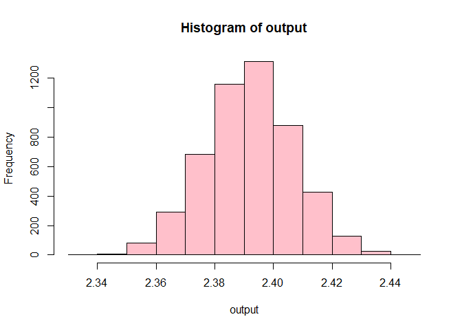

Untitled
================
Sarah Paul

## GitHub Documents

This is an R Markdown format used for publishing markdown documents to
GitHub. When you click the **Knit** button all R code chunks are run and
a markdown file (.md) suitable for publishing to GitHub is generated.

## Including Code

You can include R code in the document as follows:

``` r
summary(cars)
```

    ##      speed           dist       
    ##  Min.   : 4.0   Min.   :  2.00  
    ##  1st Qu.:12.0   1st Qu.: 26.00  
    ##  Median :15.0   Median : 36.00  
    ##  Mean   :15.4   Mean   : 42.98  
    ##  3rd Qu.:19.0   3rd Qu.: 56.00  
    ##  Max.   :25.0   Max.   :120.00

## Including Plots

You can also embed plots, for example:

<!-- -->

\##Install the Bootstrap package

``` r
#install.packages("boot")
library("boot")
```

``` r
library(ggplot2)
library(dplyr)
```

    ## Warning: package 'dplyr' was built under R version 4.3.3

    ## 
    ## Attaching package: 'dplyr'

    ## The following objects are masked from 'package:stats':
    ## 
    ##     filter, lag

    ## The following objects are masked from 'package:base':
    ## 
    ##     intersect, setdiff, setequal, union

``` r
library(tidyverse)
```

    ## Warning: package 'tidyverse' was built under R version 4.3.2

    ## ── Attaching core tidyverse packages ──────────────────────── tidyverse 2.0.0 ──
    ## ✔ forcats   1.0.0     ✔ stringr   1.5.0
    ## ✔ lubridate 1.9.3     ✔ tibble    3.2.1
    ## ✔ purrr     1.0.2     ✔ tidyr     1.3.0
    ## ✔ readr     2.1.4

    ## ── Conflicts ────────────────────────────────────────── tidyverse_conflicts() ──
    ## ✖ dplyr::filter() masks stats::filter()
    ## ✖ dplyr::lag()    masks stats::lag()
    ## ℹ Use the conflicted package (<http://conflicted.r-lib.org/>) to force all conflicts to become errors

``` r
library(broom)
```

Note that the `echo = FALSE` parameter was added to the code chunk to
prevent printing of the R code that generated the plot.

``` r
clean_data <- read.csv("~/GitHub/ppol8102-Paul/codebook/clean_data.csv")
View(clean_data)
```

\##Dependent variable Conceptualization: General Health Condition: This
is the overall state of physical, mental and emotional well being of an
individual.

Operationalization: This is measured by asking respondents how they will
rate their/spouse health in general from from a scale of Excellent to
poor.

``` r
str(clean_data$health)
```

    ##  chr [1:5265] "Excellent" "Good" "Fair" "Very Good" "Good" "Good" ...

\##convert the dependent variable from categorical to numeric

``` r
clean_data$health <- as.numeric(factor(clean_data$health, 
    levels = c("Excellent", "Very Good", "Good", "Fair", "Poor"), 
    labels = c(5, 4, 3, 2, 1), exclude = NULL))
str(clean_data$health)
```

    ##  num [1:5265] 1 3 4 2 3 3 2 3 2 1 ...

``` r
mean_clean_data_health <- mean(clean_data$health, na.rm=T)
```

``` r
health <- clean_data$health
```

## Simulating the data using bootstrapping

``` r
n <-nrow(clean_data)
boot<- sample(n, replace = TRUE)
health_boot <- health[boot]
ratio_boot <- median(health_boot)
```

``` r
boot_ratio <- function(data){
n <- nrow(data)
boot <- sample(1:n, replace=TRUE)
health_boot <- data$health[boot]
mean(health_boot)}
```

``` r
n_sims <- 1000
output <- replicate(n_sims, boot_ratio(data=clean_data))
hist(output)
```

<!-- -->
